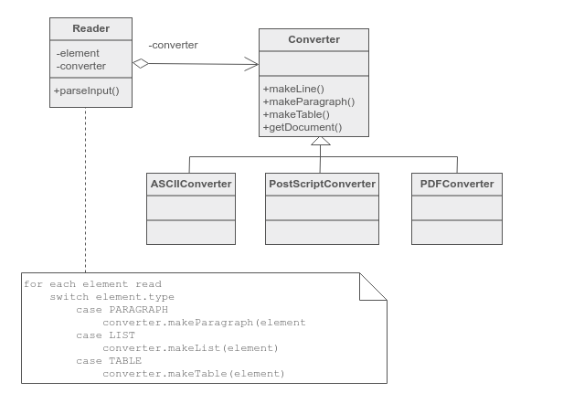
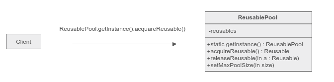
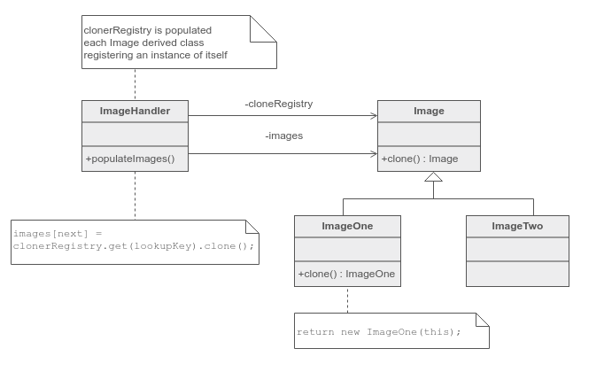
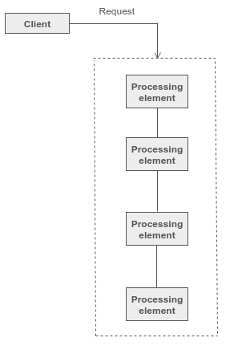
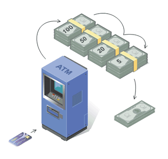
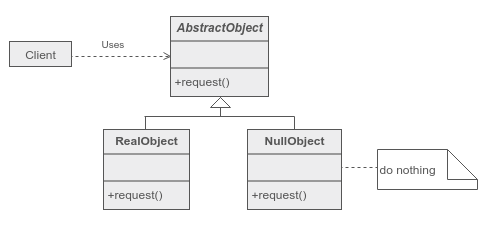
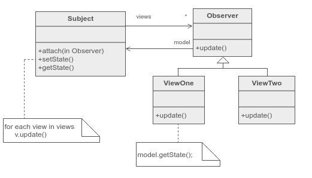
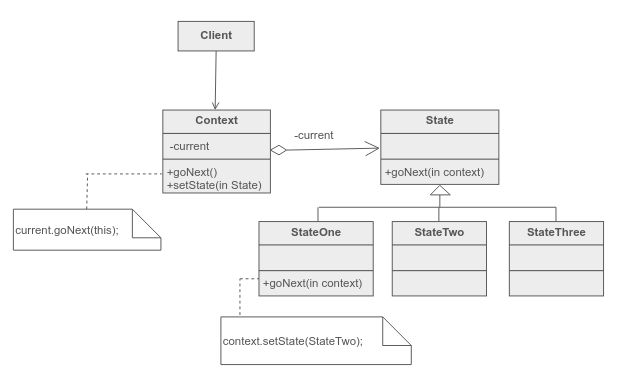
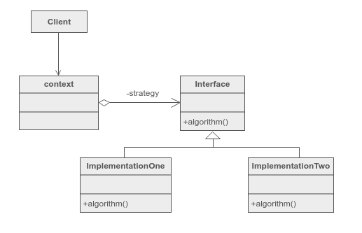

# 设计模式


<!-- @import "[TOC]" {cmd="toc" depthFrom=1 depthTo=6 orderedList=false} -->
<!-- code_chunk_output -->

* [设计模式](#设计模式)
	* [创建型模式](#创建型模式)
		* [Factory(工厂) 模式](#factory工厂-模式)
		* [Abstract factory(抽象工厂) 模式](#abstract-factory抽象工厂-模式)
		* [Singleton(单例) 模式](#singleton单例-模式)
		* [Builder(生成器) 模式](#builder生成器-模式)
		* [Object pool(对象池) 模式](#object-pool对象池-模式)
		* [Prototype(原型) 模式](#prototype原型-模式)
	* [结构型模式](#结构型模式)
		* [Adapter(适配器) 模式](#adapter适配器-模式)
		* [Bridge(桥接) 模式](#bridge桥接-模式)
		* [Composite(组合) 模式](#composite组合-模式)
		* [Decorator(修饰) 模式](#decorator修饰-模式)
		* [Facade(外观) 模式](#facade外观-模式)
		* [Flyweight(享元) 模式](#flyweight享元-模式)
		* [Proxy(代理) 模式](#proxy代理-模式)
	* [行为型模式](#行为型模式)
		* [Chain of responsibility(责任链) 模式](#chain-of-responsibility责任链-模式)
		* [Command(命令) 模式](#command命令-模式)
		* [Interpreter(解释器) 模式](#interpreter解释器-模式)
		* [Iterator(迭代器) 模式](#iterator迭代器-模式)
		* [Mediator(中介者) 模式](#mediator中介者-模式)
		* [Memento(备忘录) 模式](#memento备忘录-模式)
		* [Null Object(空对象) 模式](#null-object空对象-模式)
		* [Observer(观察者) 模式](#observer观察者-模式)
		* [State(状态) 模式](#state状态-模式)
		* [Strategy(策略) 模式](#strategy策略-模式)

<!-- /code_chunk_output -->

参考链接：

[设计模式精解－GoF 23种设计模式解析](https://manyones.files.wordpress.com/2010/07/dp-2nd.pdf)

[设计模式 wiki](https://zh.wikipedia.org/zh-cn/%E8%AE%BE%E8%AE%A1%E6%A8%A1%E5%BC%8F)

[design patterns](https://sourcemaking.com/design_patterns)

## 创建型模式

在软件工程中，创建型模式是处理对象创建机制的设计模式，试图以适合情况的方式创建对象。对象创建的基本形式可能会导致设计问题或增加设计的复杂性。创建型模式通过控制这个对象创建来解决这个问题。

### Factory(工厂) 模式
工厂方法模式（英语：Factory method pattern）是一种实现了“工厂”概念的面向对象设计模式。就像其他创建型模式一样，它也是处理在不指定对象具体类型的情况下创建对象的问题。

工厂方法模式的实质是：
* 定义一个创建对象的接口，但让实现这个接口的类来决定实例化哪个类。
* 工厂方法让类的实例化推迟到子类中进行。
在父类中并不知道具体要实例化哪一个具体的子类。这里的意思为：假设我们在类 A 中要使用到类 B，B 是一个抽象父类，在 A 中并不知道具体要实例化那一个 B 的子类，但是在类 A 的子类 D 中是可以知道的。在 A 中我们没有办法直接使用类似于 new ×××的语句，因为根本就不知道×××是什么。

创建一个对象常常需要复杂的过程，所以不适合包含在一个复合对象中。创建对象可能会导致大量的重复代码，可能会需要复合对象访问不到的信息，也可能提供不了足够级别的抽象，还可能并不是复合对象概念的一部分。工厂方法模式通过定义一个单独的创建对象的方法来解决这些问题。由子类实现这个方法来创建具体类型的对象。

对象创建中的有些过程包括决定创建哪个对象、管理对象的生命周期，以及管理特定对象的建立和销毁的概念。

[wiki link](https://zh.wikipedia.org/wiki/%E5%B7%A5%E5%8E%82%E6%96%B9%E6%B3%95)

Before:
```c++
class Stooge
{
  public:
    virtual void slap_stick() = 0;
};

class Larry: public Stooge
{
  public:
    void slap_stick()
    {
        cout << "Larry: poke eyes\n";
    }
};
class Moe: public Stooge
{
  public:
    void slap_stick()
    {
        cout << "Moe: slap head\n";
    }
};
class Curly: public Stooge
{
  public:
    void slap_stick()
    {
        cout << "Curly: suffer abuse\n";
    }
};

int main()
{
  vector<Stooge*> roles;
  int choice;

  while (true)
  {
    cout << "Larry(1) Moe(2) Curly(3) Go(0): ";
    cin >> choice;
    if (choice == 0)
      break;
    else if (choice == 1)
      roles.push_back(new Larry);
    else if (choice == 2)
      roles.push_back(new Moe);
    else
      roles.push_back(new Curly);
  }
  for (int i = 0; i < roles.size(); i++)
    roles[i]->slap_stick();
  for (int i = 0; i < roles.size(); i++)
    delete roles[i];
}
```

output:
```sh
Larry(1) Moe(2) Curly(3) Go(0): 2
Larry(1) Moe(2) Curly(3) Go(0): 1
Larry(1) Moe(2) Curly(3) Go(0): 3
Larry(1) Moe(2) Curly(3) Go(0): 0
Moe: slap head
Larry: poke eyes
Curly: suffer abuse
```

after:
```c++
class Stooge
{
public:
  //factory method
  static Stooge * make_stooge(int choice);
  virtual void slap_stick()=0;
};

int main(int argc, char const *argv[]) {
  std::vector<Stooge * > roles;
  int choice;
  while (true) {
    std::cout << "Larry(1) Moe(2) Curly(3) Go(0):" << '\n';
    cin>>choice;
    if(choice==0)
    break;
    roles.push_back(Stooge::make_stooge(choice));
  }

  for (size_t i = 0; i < roles.size(); i++) {
    roles[i]->slap_stick();
  }
  for (size_t i = 0; i < roles.size(); i++) {
    delete roles[i];
  }
  return 0;
}

class Larry: public Stooge
{
  public:
    void slap_stick()
    {
        cout << "Larry: poke eyes\n";
    }
};
class Moe: public Stooge
{
  public:
    void slap_stick()
    {
        cout << "Moe: slap head\n";
    }
};
class Curly: public Stooge
{
  public:
    void slap_stick()
    {
        cout << "Curly: suffer abuse\n";
    }
};

Stooge *Stooge::make_stooge(int choice)
{
  if (choice == 1)
    return new Larry;
  else if (choice == 2)
    return new Moe;
  else
    return new Curly;
}

//care
// deleting object of abstract class type ‘Stooge’ which has non-virtual destructor will cause undefined behavior
```

output:
```sh
Larry(1) Moe(2) Curly(3) Go(0):
1
Larry(1) Moe(2) Curly(3) Go(0):
2
Larry(1) Moe(2) Curly(3) Go(0):
3
Larry(1) Moe(2) Curly(3) Go(0):
0
Larry: poke eyes
Moe: slap head
Curly: suffer abuse
```
[示例代码链接](https://sourcemaking.com/design_patterns/factory_method/cpp/1)

### Abstract factory(抽象工厂) 模式
抽象工厂模式提供了一种方式，可以将一组具有同一主题的单独的工厂封装起来。

在正常使用中，客户端程序需要创建抽象工厂的具体实现，然后使用抽象工厂作为接口来创建这一主题的具体对象。客户端程序不需要知道（或关心）它从这些内部的工厂方法中获得对象的具体类型，因为客户端程序仅使用这些对象的通用接口。抽象工厂模式将一组对象的实现细节与他们的一般使用分离开来。

“工厂”是创建产品（对象）的地方，其目的是将产品的创建与产品的使用分离。抽象工厂模式的目的，是将若干抽象产品的接口与不同主题产品的具体实现分离开。

抽象工厂模式的实质是:
* 提供接口，创建一系列相关或独立的对象，而不指定这些对象的具体类。

我们的产品结构是这样的:
```c++
class Button; // Abstract Class

class MacButton: public Button {};

class WinButton: public Button {};

class Border; // Abstract Class

class MacBorder: public Border {};

class WinBorder: public Border {};
```

对应的工厂是这样的:
```c++
class AbstractFactory {
public:
    virtual Button* CreateButton() =0;
    virtual Border* CreateBorder() =0;
};

class MacFactory: public AbstractFactory {
public:
    MacButton* CreateButton() { return new MacButton; }
    MacBorder* CreateBorder() { return new MacBorder; }
};

class WinFactory: public AbstractFactory {
public:
    WinButton* CreateButton() { return new WinButton; }
    WinBorder* CreateBorder() { return new WinBorder; }
};
```
那么客户可以根据需要选择 Mac 风格或者 Win 风格來創建 Button 或 Border:
```c++
AbstractFactory* fac;
switch (style) {
case MAC:
    fac = new MacFactory;
    break;
case WIN:
    fac = new WinFactory;
    break;
}
Button* button = fac->CreateButton();
Border* border = fac->CreateBorder();
```
[抽象工厂模式 wiki](https://zh.wikipedia.org/wiki/%E6%8A%BD%E8%B1%A1%E5%B7%A5%E5%8E%82)

### Singleton(单例) 模式
单例模式，也叫单子模式，是一种常用的软件设计模式。
在应用这个模式时，单例对象的类必须保证只有一个实例存在。许多时候整个系统只需要拥有一个的全局对象，这样有利于我们协调系统整体的行为。比如在某个服务器程序中，该服务器的配置信息存放在一个文件中，这些配置数据由一个单例对象统一读取，然后服务进程中的其他对象再通过这个单例对象获取这些配置信息。这种方式简化了在复杂环境下的配置管理。

实现单例模式的思路是：一个类能返回对象一个引用(永远是同一个)和一个获得该实例的方法（必须是静态方法，通常使用getInstance这个名称）；当我们调用这个方法时，如果类持有的引用不为空就返回这个引用，如果类保持的引用为空就创建该类的实例并将实例的引用赋予该类保持的引用；同时我们还将该类的构造函数定义为私有方法，这样其他处的代码就无法通过调用该类的构造函数来实例化该类的对象，只有通过该类提供的静态方法来得到该类的唯一实例。

单例模式在多线程的应用场合下必须小心使用。如果当唯一实例尚未创建时，有两个线程同时调用创建方法，那么它们同时没有检测到唯一实例的存在，从而同时各自创建了一个实例，这样就有两个实例被构造出来，从而违反了单例模式中实例唯一的原则。 解决这个问题的办法是为指示类是否已经实例化的变量提供一个互斥锁(虽然这样会降低效率)。

[Singleton 模式 wiki](https://zh.wikipedia.org/wiki/%E5%8D%95%E4%BE%8B%E6%A8%A1%E5%BC%8F)

Before:
```c++
class GlobaClass{
	int mvalue_;
public:
	GlobaClass(int v=0)
	{
		mvalue_=v;
	}
	int getvalue_()
	{
		return mvalue_;
	}
	void setvalue_(int v)
	{
		mvalue_=v;
	}
};

GlobaClass *global_ptr=nullptr;

void foo(void)
{
	if(!global_ptr)
	{
		global_ptr=new GlobaClass;
	}
	global_ptr->setvalue_(1);
	std::cout << "foo:global_ptr is"<<global_ptr->getvalue_() << '\n';
}

void bar(void)
{
	if (!global_ptr)
	global_ptr=new GlobaClass;
	global_ptr->setvalue_(2);
	std::cout << "bar:global_ptr is "<<global_ptr->getvalue_() << '\n';
}

int main(int argc, char const *argv[]) {
	if(!global_ptr)
	global_ptr=new GlobaClass;
	std::cout << "main:global_ptr is"<<global_ptr->getvalue_() << '\n';
	foo();
	bar();
	return 0;
}
```

output:
```sh
main:global_ptr is0
foo:global_ptr is1
bar:global_ptr is 2
```

after:
```c++
class GlobalClass
{
    int mvalue_;
    static GlobalClass * s_instance;
    GlobalClass(int v = 0)
    {
        mvalue_ = v;
    }
  public:
    int getvalue_()
    {
        return mvalue_;
    }
    void setvalue_(int v)
    {
        mvalue_ = v;
    }
    static GlobalClass *instance()
    {
        if (!s_instance)
          s_instance = new GlobalClass;
        return s_instance;
    }
};

// Allocating and initializing GlobalClass's
// static data member.  The pointer is being
// allocated - not the object inself.
GlobalClass *GlobalClass::s_instance = 0;

void foo(void)
{
  GlobalClass::instance()->setvalue_(1);
  cout << "foo: global_ptr is " << GlobalClass::instance()->getvalue_() << '\n';
}

void bar(void)
{
  GlobalClass::instance()->setvalue_(2);
  cout << "bar: global_ptr is " << GlobalClass::instance()->getvalue_() << '\n';
}

int main()
{
  cout << "main: global_ptr is " << GlobalClass::instance()->getvalue_() << '\n';
  foo();
  bar();
}
```

output:
```sh
main: global_ptr is 0
foo: global_ptr is 1
bar: global_ptr is 2
```

[示例代码链接](https://sourcemaking.com/design_patterns/singleton/cpp/1)

上述代码在单线程中能够正常工作，不过在多线程下可采取加互斥锁的方法：
```c++
#include <future>
#include <iostream>
#include <mutex>
#include <thread>

using namespace std;
std::mutex mutexLock;

class singleton {
  singleton(int n = 0) { mvalue_ = n; };
  static singleton *globalPtr;
  int mvalue_ = 0;

public:
  ~singleton(){};
  int getvalue_() { return mvalue_; }
  void setvalue_(int n) { mvalue_ = n; }
  static singleton *instance() {
    if (globalPtr == NULL) {
      mutexLock.lock();
      if (globalPtr == NULL)
        globalPtr = new singleton;
      mutexLock.unlock();
    }
    return globalPtr;
  }
};
singleton *singleton::globalPtr = NULL;
int main(int argc, char const *argv[]) {

  singleton * ptr;

  auto f1 = async(launch::async, [] { return singleton::instance(); });
  auto f2 = async(launch::async, [] { return singleton::instance(); });

  ptr = f1.get();
  std::cout << "p1:" << ptr->getvalue_() << '\n';
  std::cout << "localtion:" << ptr << '\n';
  ptr = f2.get();
  ptr->setvalue_(3);
  std::cout << "p1:" << ptr->getvalue_() << '\n';
  std::cout << "localtion:" << ptr << '\n';
  return 0;
}
```

output:
```sh
p1:0
localtion:0x7f9514000b10
p1:3
localtion:0x7f9514000b10
```

### Builder(生成器) 模式
生成器模式，他可以将复杂的建造过程抽象出来，使这个抽象过程的不同实现方法可以构造出不同表现（属性）的对象。

适用性：
* 当创建复杂对象的算法应独立于该对象的组成部分以及他们的装配方式时。
* 当构造过程必须允许被构造的对象有不同的表示时。

[生成器模式 wiki](https://zh.wikipedia.org/wiki/%E7%94%9F%E6%88%90%E5%99%A8%E6%A8%A1%E5%BC%8F)



示例代码：
```c++
#include <cstdio>
#include <cstring>
#include <iostream>

using namespace std;

enum PersistenceType { File, Queue, Pathway };

struct PersistenceAttribute {
  PersistenceType type;
  char value[30];
};

class DistrWorkPackage {
public:
  DistrWorkPackage(char * type) {
    sprintf(desc_, "Distributed work package for :%s", type);
  }
  void setFile(char * f, char * v) {
    sprintf(temp_, "\n  File(%s): %s", f, v);
    strcat(desc_, temp_);
  }
  void setQueue(char *q, char *v) {
    sprintf(temp_, "\n  Queue(%s): %s", q, v);
    strcat(desc_, temp_);
  }
  void setPathway(char *p, char *v) {
    sprintf(temp_, "\n  Pathway(%s): %s", p, v);
    strcat(desc_, temp_);
  }
  const char * getState() { return desc_; }

private:
  char desc_[200], temp_[80];
};

class Builder {
protected:
  DistrWorkPackage * result_;

public:
  virtual void configureFile(char * ) = 0;
  virtual void configureQueue(char * ) = 0;
  virtual void configurePathway(char * ) = 0;
  DistrWorkPackage * getResult() { return result_; }
};

class UnixBuilder : public Builder {
public:
  UnixBuilder() { result_ = new DistrWorkPackage("Unix"); }
  void configureFile(char * name) { result_->setFile("flatFile", name); }
  void configureQueue(char *queue) { result_->setQueue("FIFO", queue); }
  void configurePathway(char *type) { result_->setPathway("thread", type); }
};

class VmsBuilder : public Builder {
public:
  VmsBuilder() { result_ = new DistrWorkPackage("Vms"); }
  void configureFile(char * name) { result_->setFile("ISAM", name); }
  void configureQueue(char *queue) { result_->setQueue("priority", queue); }
  void configurePathway(char *type) { result_->setPathway("LWP", type); }
};

class Reader {
public:
  void setBuilder(Builder * b) { builder_ = b; }
  void construct(PersistenceAttribute[], int);

private:
  Builder *builder_;
};

void Reader::construct(PersistenceAttribute list[], int num) {
  for (int i = 0; i < num; i++)
    if (list[i].type == File)
      builder_->configureFile(list[i].value);
    else if (list[i].type == Queue)
      builder_->configureQueue(list[i].value);
    else if (list[i].type == Pathway)
      builder_->configurePathway(list[i].value);
}

const int NUM_ENTRIES = 6;
PersistenceAttribute input[NUM_ENTRIES] = {
    {File, "state.dat"},         {File, "config.sys"},
    {Queue, "compute"},          {Queue, "log"},
    {Pathway, "authentication"}, {Pathway, "error processing"}};

int main() {
  UnixBuilder unixBuilder;
  VmsBuilder vmsBuilder;
  Reader reader;

  reader.setBuilder(&unixBuilder);
  reader.construct(input, NUM_ENTRIES);
  cout << unixBuilder.getResult()->getState() << endl;

  reader.setBuilder(&vmsBuilder);
  reader.construct(input, NUM_ENTRIES);
  cout << vmsBuilder.getResult()->getState() << endl;
}
```
output:
```sh
Distributed work package for :Unix
  File(flatFile): state.dat
  File(flatFile): config.sys

  Queue(FIFO): compute
  Queue(FIFO): log
  Pathway(thread): authentication
  Pathway(thread): error processing
Distributed work package for :Vms
  File(ISAM): state.dat
  File(ISAM): config.sys
  Queue(priority): compute
  Queue(priority): log
  Pathway(LWP): authentication
  Pathway(LWP): error processing
```

[示例代码链接](https://sourcemaking.com/design_patterns/builder/cpp/1)

### Object pool(对象池) 模式

对象池模式可以提供显着的性能提升;在初始化类实例的成本高，类的实例化率高，并且在任何时候使用的实例化数量低的情况下，这是最有效的。

对象池（也称为资源池）用于管理对象缓存。有权访问对象池的客户端可以通过简单地向池中请求一个已经实例化的对象来避免创建新的对象。一般来说，池将是一个增长的池，即池本身将创建新的对象，如果池是空的，或者我们可以有一个池，限制了创建的对象的数量。 希望将当前不再使用的所有可重用对象保留在同一个对象池中，以便可以通过一个一致的策略来管理它们。为了达到这个目的，可重用池类被设计成一个单例类。


对象池允许其他人从其池中“检出”对象，当这些对象不再被它们的进程需要时，它们被返回到池中以便被重用。 但是，我们不希望进程需要等待某个特定的对象被释放，所以对象池也会根据需要实例化新的对象，但是还必须实现一个方法来定期清理未使用的对象。

[source link](https://sourcemaking.com/design_patterns/object_pool)


python 代码示例：
```python
class ReusablePool:
    """
    Manage Reusable objects for use by Client objects.
    """

    def __init__(self, size):
        self._reusables = [Reusable() for _ in range(size)]

    def acquire(self):
        return self._reusables.pop()

    def release(self, reusable):
        self._reusables.append(reusable)


class Reusable:
    """
    Collaborate with other objects for a limited amount of time, then
    they are no longer needed for that collaboration.
    """

    pass


def main():
    reusable_pool = ReusablePool(10)
    reusable = reusable_pool.acquire()
    reusable_pool.release(reusable)


if __name__ == "__main__":
    main()
```
[示例代码链接](https://sourcemaking.com/design_patterns/object_pool/python/1)

### Prototype(原型) 模式
原型模式是创建型模式的一种，其特点在于通过「复制」一个已经存在的实例来返回新的实例,而不是新建实例。被复制的实例就是我们所称的「原型」，这个原型是可定制的。

原型模式多用于创建复杂的或者耗时的实例，因为这种情况下，复制一个已经存在的实例使程序运行更高效；或者创建值相等，只是命名不一样的同类数据。
[原型模式 wiki](https://zh.wikipedia.org/wiki/%E5%8E%9F%E5%9E%8B%E6%A8%A1%E5%BC%8F)



```c++
#include <iostream>
#include <string>

using namespace std;
class Prototype {
protected:
  string type;
  int value;

public:
  virtual Prototype * clone() = 0;
  string getType() { return type; }
  int getValue() { return value; }
};

class ConcretePrototype1 : public Prototype {
public:
  ConcretePrototype1(int number) {
    type = "Type1";
    value = number;
  }

  Prototype * clone() { return new ConcretePrototype1(*this); }
};

class ConcretePrototype2 : public Prototype {
public:
  ConcretePrototype2(int number) {
    type = "Type2";
    value = number;
  }

  Prototype * clone() { return new ConcretePrototype2(*this); }
};

class ObjectFactory {
  static Prototype * type1value1;
  static Prototype * type1value2;
  static Prototype * type2value1;
  static Prototype * type2value2;

public:
  static void initialize() {
    type1value1 = new ConcretePrototype1(1);
    type1value2 = new ConcretePrototype1(2);
    type2value1 = new ConcretePrototype2(1);
    type2value2 = new ConcretePrototype2(2);
  }

  static Prototype * getType1Value1() { return type1value1->clone(); }

  static Prototype *getType1Value2() { return type1value2->clone(); }

  static Prototype *getType2Value1() { return type2value1->clone(); }

  static Prototype *getType2Value2() { return type2value2->clone(); }
};

Prototype *ObjectFactory::type1value1 = 0;
Prototype *ObjectFactory::type1value2 = 0;
Prototype *ObjectFactory::type2value1 = 0;
Prototype *ObjectFactory::type2value2 = 0;

int main() {
  ObjectFactory::initialize();
  Prototype * object;

  // All the object were created by cloning the prototypes.
  object = ObjectFactory::getType1Value1();
  std::cout << object->getType() << ": " << object->getValue() << std::endl;

  object = ObjectFactory::getType1Value2();
  std::cout << object->getType() << ": " << object->getValue() << std::endl;

  object = ObjectFactory::getType2Value1();
  std::cout << object->getType() << ": " << object->getValue() << std::endl;

  object = ObjectFactory::getType2Value2();
  std::cout << object->getType() << ": " << object->getValue() << std::endl;

  return 0;
}

```

output:
```sh
Type1: 1
Type1: 2
Type2: 1
Type2: 2
```

[示例代码链接](https://gist.github.com/pazdera/1122349)

## 结构型模式

### Adapter(适配器) 模式

将某个类的接口转换成客户端期望的另一个接口表示。适配器模式可以消除由于接口不匹配所造成的类兼容性问题。

有两种类型的适配器模式：
1. 对象适配器模式：在这种适配器模式中，适配器容纳一个它包裹的类的实例。在这种情况下，适配器调用被包裹对象的物理实体
2. 类适配器模式：在这种模式下，适配器继承自己实现的类（一般多重继承）

[适配器模式 wikipedia](https://zh.wikipedia.org/wiki/%E9%80%82%E9%85%8D%E5%99%A8%E6%A8%A1%E5%BC%8F)

类适配器模式示例：
```c++
#include <iostream>

typedef int Coordinate;
typedef int Dimension;
using namespace std;

class Rectangle {
public:
  virtual void draw() = 0;
};

class LegacyRectangle {
public:
  LegacyRectangle(Coordinate x1, Coordinate y1, Coordinate x2, Coordinate y2) {
    x1_ = x1;
    y1_ = y1;
    x2_ = x2;
    y2_ = y2;
    cout << "LegacyRectangle:  create.  (" << x1_ << "," << y1_ << ") => ("
         << x2_ << "," << y2_ << ")" << endl;
  }

  void oldDraw() {
    cout << "LegacyRectangle:  oldDraw.  (" << x1_ << "," << y1_ << ") => ("
         << x2_ << "," << y2_ << ")" << endl;
  }

private:
  Coordinate x1_;
  Coordinate y1_;
  Coordinate x2_;
  Coordinate y2_;
};

class RectangleAdapter : public Rectangle, private LegacyRectangle {
public:
  RectangleAdapter(Coordinate x, Coordinate y, Dimension w, Dimension h)
      : LegacyRectangle(x, y, x + w, y + h) {
    cout << "RectangleAdapter: create.  (" << x << "," << y
         << "), width = " << w << ", height = " << h << endl;
  }

  virtual void draw() {
    cout << "RectangleAdapter: draw." << endl;
    oldDraw();
  }
};

int main(int argc, char const *argv[]) {
  Rectangle * r = new RectangleAdapter(120, 200, 60, 40);
  r->draw();
  return 0;
}
```

Run:
```terminal
LegacyRectangle:  create.  (120,200) => (180,240)
RectangleAdapter: create.  (120,200), width = 60, height =
 40
RectangleAdapter: draw.
LegacyRectangle:  oldDraw.  (120,200) => (180,240)
```

[示例代码链接](https://sourcemaking.com/design_patterns/adapter/cpp/1)

### Bridge(桥接) 模式

将对象的接口从其实现中分离出来；将一个抽象与实现解耦，以便两者可以独立的变化。

桥接模式时软件设计模式中最复杂的模式之一，他把事物对象和其具体行为、具体特征分离开来，使他们各自独立变化。事物对象仅时一个抽象的概念。如“圆形”、“三角形”归于抽象的“形状”之下，而“画圆”、“画三角形”归于实现行为的“画图”类之下，然后由“形状”调用“画图”。

[桥接模式 wikipedia](https://zh.wikipedia.org/zh-cn/%E6%A9%8B%E6%8E%A5%E6%A8%A1%E5%BC%8F)

```c++
#include <iomanip>
#include <iostream>
#include <string.h>

using namespace std;

class TimeImp {
public:
  TimeImp(int hr, int min) {
    hr_ = hr;
    min_ = min;
  }
  virtual void tell() {
    cout << "time is " << setw(2) << setfill(' ') << hr_ << min_ << endl;
  }

protected:
  int hr_, min_;
};

class CivilianTimeImp : public TimeImp {
public:
  CivilianTimeImp(int hr, int min, int pm) : TimeImp(hr, min) {
    if (pm)
      strcpy(whichM_, " PM");
    else
      strcpy(whichM_, " AM");
  }

  virtual void tell() {
    std::cout << "time is " << hr_ << ":" << min_ << whichM_ << '\n';
  }

protected:
  char whichM_[4];
};

class ZuluTimeImp : public TimeImp {
public:
  ZuluTimeImp(int hr, int min, int zone) : TimeImp(hr, min) {
    if (zone == 5)
      strcpy(zone_, " eastern standard time");
    else if (zone == 6)
      strcpy(zone_, " central standard time");
  }

  virtual void tell() {
    std::cout << "time is " << setw(2) << setfill(' ') << hr_ << min_ << zone_
              << '\n';
  }

protected:
  char zone_[30];
};

class Time {
public:
  Time() {}
  Time(int hr, int min) { imp_ = new TimeImp(hr, min); }

  virtual void tell() { imp_->tell(); }

protected:
  TimeImp *imp_;
};

class CivilianTime : public Time {
public:
  CivilianTime(int hr, int min, int pm) {
    imp_ = new CivilianTimeImp(hr, min, pm);
  }
};

class ZuluTime : public Time {
public:
  ZuluTime(int hr, int min, int zone) { imp_ = new ZuluTimeImp(hr, min, zone); }
};

int main(int argc, char const *argv[]) {
  Time * times[3];
  times[0] = new Time(14, 30);
  times[1] = new CivilianTime(2, 30, 1);
  times[2] = new ZuluTime(14, 30, 6);
  for (size_t i = 0; i < 3; i++) {
    times[i]->tell();
  }
  return 0;
}
```

Run:
```terminal
time is 1430
time is 2:30 PM
time is 1430 central standard time
```

[示例代码链接 ](https://sourcemaking.com/design_patterns/bridge/cpp/1)

### Composite(组合) 模式

把多个对象组成树状结构来表示局部与整体，这样用户可以一样的对待单个对象和对象的组合

```c++
#include <iostream>
#include <vector>

using namespace std;

// create an "interface" -- lowest common denominator
class Component {
public:
  virtual void traverse() = 0;
};

class Leaf : public Component {
  int value;

public:
  Leaf(int val) { value = val; }
  void traverse() { std::cout << value << ' '; }
};

class Composite : public Component {
  std::vector<Component * > children;

public:
  void add(Component * ele) { children.push_back(ele); }

  void traverse() {
    for (size_t i = 0; i < children.size(); i++) {
      children[i]->traverse();
    }
  }
};

int main(int argc, char const *argv[]) {
  Composite containers[4];

  for (size_t i = 0; i < 4; i++) {
    for (size_t j = 0; j < 3; j++) {
      containers[i].add(new Leaf(i * 3 + j));
    }
  }

  for (size_t i = 1; i < 4; i++) {
    containers[0].add(&(containers[i]));
  }

  for (size_t i = 0; i < 4; i++) {
    containers[i].traverse();
    std::cout << '\n';
  }
  return 0;
}
```

Run:
```terminal
0 1 2 3 4 5 6 7 8 9 10 11
3 4 5
6 7 8
9 10 11
```

[示例代码链接](https://sourcemaking.com/design_patterns/composite/cpp/1)

### Decorator(修饰) 模式

修饰模式：一种动态地往一个对象中添加新的行为的设计模式。就功能而言，修饰模式相比生成子类更加灵活，这样可以给某个对象而不是整个类添加一些功能。

[修饰模式 wikipedia](https://zh.wikipedia.org/wiki/%E4%BF%AE%E9%A5%B0%E6%A8%A1%E5%BC%8F)

[decorator design pattern](https://sourcemaking.com/design_patterns/decorator)

```c++
#include <iostream>

using namespace std;
// 1."lowest common denominator"
class Widget {
public:
  virtual void draw() = 0;
};

class TextField : public Widget {
  int width, height;

  // 3."core" class & "is a"
public:
  TextField(int w, int h) {
    width = w;
    height = h;
  }

  virtual void draw() {
    std::cout << "  TextField: " << width << ", " << height << '\n';
  }
};

// 2. 2nd level base class
class Decorator : public Widget {
  Widget * wid; // 4. "has a" relationship

public:
  Decorator(Widget * w) { wid = w; }

  virtual void draw() {
    wid->draw(); // 5.delegation
  }
};

class BorderDecorator : public Decorator {
public:
  // 6.optional embellishment
  BorderDecorator(Widget * w) : Decorator(w) {}

  void draw() {
    // delegate to base class and add extra stuff
    Decorator::draw();
    std::cout << "  BorderDecorator" << '\n';
  }
};

class ScrollDecorator : public Decorator {
public:
  // 6.optional embellishment
  ScrollDecorator(Widget * w) : Decorator(w) {}

  virtual void draw() {
    // 7.delegate to base class and add extra stuff
    Decorator::draw();
    cout << "  ScrollDecorator" << endl;
  }
};

int main(int argc, char const *argv[]) {
  // 8.client has the responsibility to compose desired configurations
  Widget * aWidget = new BorderDecorator(
      new BorderDecorator(new ScrollDecorator(new TextField(80, 24))));
  aWidget->draw();
  return 0;
}
```
Run:
```terminal
  TextField: 80, 24
  ScrollDecorator
  BorderDecorator
  BorderDecorator
```

[示例代码链接](https://sourcemaking.com/design_patterns/decorator/cpp/2)

[Decorator in C++: Before and after](https://sourcemaking.com/design_patterns/decorator/cpp/1)

### Facade(外观) 模式

为子系统中的一组接口提供一个一致的界面，外观模式定义了一个高层接口，这个接口使得这一子系统更加容易使用。

[外观模式 wikipedia](https://zh.wikipedia.org/wiki/%E5%A4%96%E8%A7%80%E6%A8%A1%E5%BC%8F)

代码示例1：
```c++
#include <iostream>

class MisDepartment {
public:
  void submitNetworkRequest() { state_ = 0; }
  bool checkOnStatus() {
    state_++;
    if (state_ == Complete)
      return true;
    return false;
  }

private:
  enum States {
    Received,
    DenyAllKnowledge,
    ReferClientToFacilities,
    FacilitiesHasNotSentPaperwork,
    ElectricianIsNotDone,
    ElectricianDidItWrong,
    DispatchTechnician,
    SignedOff,
    DoesNotWork,
    FixElectriciansWiring,
    Complete
  };
  int state_;
};

class ElectricianUnion {
public:
  void submitNetworkRequest() { state_ = 0; }
  bool checkOnStatus() {
    state_++;
    if (state_ == Complete)
      return true;
    return false;
  }

private:
  enum States {
    Received,
    RejectTheForm,
    SizeTheJob,
    SmokeAndJokeBreak,
    WaitForAuthorization,
    DoTheWrongJob,
    BlameTheEngineer,
    WaitToPunchOut,
    DoHalfAJob,
    ComplainToEngineer,
    GetClarification,
    CompleteTheJob,
    TurnInThePaperwork,
    Complete
  };
  int state_;
};

class FacilitiesDepartment {
public:
  void submitNetworkRequest() { state_ = 0; }
  bool checkOnStatus() {
    state_++;
    if (state_ == Complete)
      return true;
    return false;
  }

private:
  enum States {
    Received,
    AssignToEngineer,
    EngineerResearches,
    RequestIsNotPossible,
    EngineerLeavesCompany,
    AssignToNewEngineer,
    NewEngineerResearches,
    ReassignEngineer,
    EngineerReturns,
    EngineerResearchesAgain,
    EngineerFillsOutPaperWork,
    Complete
  };
  int state_;
};

class FacilitiesFacade {
public:
  FacilitiesFacade() { count_ = 0; }
  void submitNetworkRequest() { state_ = 0; }

  bool checkOnStatus() {
    count_++;
    if (state_ == Received) {
      state_++;
      engineer_.submitNetworkRequest();
      std::cout << "submit to Facilities -" << count_ << " phone calls so far"
                << '\n';
    } else if (state_ == SubmitToEngineer) {
      if (engineer_.checkOnStatus()) {
        state_++;
        eletrician_.submitNetworkRequest();
        std::cout << "submit to Electrician - " << count_
                  << " phone calls so far" << '\n';
      }
    } else if (state_ == SubmitToElectrician) {
      if (eletrician_.checkOnStatus()) {
        state_++;
        technician_.submitNetworkRequest();
        std::cout << "submit ro MIS - " << count_ << " phone calls so far"
                  << '\n';
      }
    } else if (state_ == SubmitToTechnician) {
      if (technician_.checkOnStatus())
        return true;
    }
    return false;
  }

  int getNumberOfCalls() { return count_; }

private:
  enum States {
    Received,
    SubmitToEngineer,
    SubmitToElectrician,
    SubmitToTechnician
  };

  int state_;
  int count_;
  FacilitiesDepartment engineer_;
  ElectricianUnion eletrician_;
  MisDepartment technician_;
};

int main(int argc, char const *argv[]) {
  FacilitiesFacade facilities;

  facilities.submitNetworkRequest();
  while (!facilities.checkOnStatus()) {
    ;
  }

  std::cout << "job completed after only " << facilities.getNumberOfCalls()
            << " phone calls" << '\n';
  return 0;
}
```

Run：
```terminal
submit to Facilities -1 phone calls so far
submit to Electrician - 12 phone calls so far
submit ro MIS - 25 phone calls so far
job completed after only 35 phone calls
```

[代码示例链接](https://sourcemaking.com/design_patterns/facade/cpp/1)

代码示例2:
```c++
class CPU {
public:
	void freeze() { ... }
	void jump(long position) { ... }
	void execute() { ... }
}

class Memory {
public:
	void load(long position, char* data) {
		...
	}
}

class HardDrive {
public:
	char* read(long lba, int size) {
		...
	}
}

/* Façade */

class Computer {
public:
	void startComputer() {
		cpu.freeze();
		memory.load(BOOT_ADDRESS, hardDrive.read(BOOT_SECTOR, SECTOR_SIZE));
		cpu.jump(BOOT_ADDRESS);
		cpu.execute();
	}
}

/* Client */

class You {
public:
	void start(String[] args) {
		Computer facade = new Computer();
		facade.startComputer();
	}
}
```


[代码示例链接](https://zh.wikipedia.org/wiki/%E5%A4%96%E8%A7%80%E6%A8%A1%E5%BC%8F#C++)

### Flyweight(享元) 模式

通过共享以便有效的支持大量小颗粒对象

它使用共享对象，用来尽可能减少内存使用量以及分享资讯给尽可能多的相似对象；它适合用于当大量对象只是重复因而导致无法令人接受的使用大量内存。通常对象中的部分状态是可以分享。常见做法是把他们放在外部数据结构，当使用时在将他们传递给享元。

[享元模式 wikipedia](https://zh.wikipedia.org/zh-cn/%E4%BA%AB%E5%85%83%E6%A8%A1%E5%BC%8F)

[Flyweight in C++: Before and after](https://sourcemaking.com/design_patterns/flyweight/cpp/1)

代码示例：
```c++
#include <cstring>
#include <iostream>

class Icon {
public:
  Icon(char * fileName) {
    strcpy(name_, fileName);
    if (!strcmp(fileName, "go")) {
      width_ = 20;
      height_ = 20;
    }
    if (!strcmp(fileName, "stop")) {
      width_ = 40;
      height_ = 40;
    }
    if (!strcmp(fileName, "select")) {
      width_ = 60;
      height_ = 60;
    }
    if (!strcmp(fileName, "undo")) {
      width_ = 30;
      height_ = 30;
    }
  }

  const char *getName() { return name_; }

  void draw(int x, int y) {
    std::cout << "  drawing " << name_ << ": upper left (" << x << "," << y
              << ") - lower right (" << x + width_ << "," << y + height_ << ")"
              << '\n';
  }

private:
  char name_[20];
  int width_;
  int height_;
};

class FlyweightFactory {
public:
  static Icon * getIcon(char * name) {
    for (ssize_t i = 0; i < numIcons_; i++)
      if (!strcmp(name, icons_[i]->getName()))
        return icons_[i];
    icons_[numIcons_] = new Icon(name);
    return icons_[numIcons_++];
  }

  static void reportTheIcons() {
    std::cout << "Active Flyweights: ";
    for (ssize_t i = 0; i < numIcons_; i++) {
      std::cout << icons_[i]->getName() << " ";
    }
    std::cout << '\n';
  }

private:
  enum { MAX_ICONS = 5 };
  static int numIcons_;
  static Icon *icons_[MAX_ICONS];
};

int FlyweightFactory::numIcons_ = 0;
Icon *FlyweightFactory::icons_[];

class DialogBox {
public:
  DialogBox(int x, int y, int incr)
      : iconsOriginX_(x), iconsOriginY_(y), iconsXIncrement_(incr) {}
  virtual void draw() = 0;

protected:
  Icon *icons_[3];
  int iconsOriginX_;
  int iconsOriginY_;
  int iconsXIncrement_;
};

class FileSelection : public DialogBox {
public:
  FileSelection(Icon * first, Icon * second, Icon * third)
      : DialogBox(100, 100, 100) {
    icons_[0] = first;
    icons_[1] = second;
    icons_[2] = third;
  }

  void draw() {
    std::cout << "drawing FileSelection :" << '\n';
    for (ssize_t i = 0; i < 3; i++) {
      icons_[i]->draw(iconsOriginX_ + (i * iconsXIncrement_), iconsOriginY_);
    }
  }
};

class CommitTransaction : public DialogBox {
public:
  CommitTransaction(Icon * first, Icon * second, Icon * third)
      : DialogBox(150, 150, 150) {
    icons_[0] = first;
    icons_[1] = second;
    icons_[2] = third;
  }

  void draw() {
    std::cout << "drawing CommitTransaction :" << '\n';
    for (ssize_t i = 0; i < 3; i++) {
      icons_[i]->draw(iconsOriginX_ + (i * iconsXIncrement_), iconsOriginY_);
    }
  }
};

int main(int argc, char const *argv[]) {
  DialogBox * dialogs[2];
  dialogs[0] = new FileSelection(FlyweightFactory::getIcon("go"),
                                 FlyweightFactory::getIcon("stop"),
                                 FlyweightFactory::getIcon("select"));
  dialogs[1] = new CommitTransaction(FlyweightFactory::getIcon("select"),
                                     FlyweightFactory::getIcon("stop"),
                                     FlyweightFactory::getIcon("undo"));

  for (int i = 0; i < 2; i++)
    dialogs[i]->draw();
  FlyweightFactory::reportTheIcons();

  return 0;
}
```

Run:
```terminal
drawing FileSelection :
  drawing go: upper left (100,100) - lower right (120,120)
  drawing stop: upper left (200,100) - lower right (240,140)
  drawing select: upper left (300,100) - lower right (360,160)
drawing CommitTransaction :
  drawing select: upper left (150,150) - lower right (210,210)
  drawing stop: upper left (300,150) - lower right (340,190)
  drawing undo: upper left (450,150) - lower right (480,180)
Active Flyweights: go stop select undo
```

[代码示例链接](https://sourcemaking.com/design_patterns/flyweight/cpp/2)


### Proxy(代理) 模式

为其他对象提供一个代理以控制对这个对象的访问

[代理模式 wikipedia](https://zh.wikipedia.org/zh-cn/%E4%BB%A3%E7%90%86%E6%A8%A1%E5%BC%8F)

[Proxy in C++: Before and after](https://sourcemaking.com/design_patterns/proxy/cpp/1)

```c++
// A protection proxy controls access to the original object

#include <iostream>
#include <string>

using namespace std;

class Person {
  string nameString;
  static string list[];
  static int next;

public:
  Person() { nameString = list[next++]; }

  string name() { return nameString; }
};

string Person::list[] = {"Tom", "Dick", "Harry", "Bubba"};
int Person::next = 0;

class PettyCashProted {
  int balance;

public:
  PettyCashProted() { balance = 500; }

  bool withdraw(int amount) {
    if (amount > balance)
      return false;
    balance -= amount;
    return true;
  }

  int getBalance() { return balance; }
};

class PettyCash {
  PettyCashProted realThing;

public:
  bool withdraw(Person &p, int amount) {
    if (p.name() == "Tom" || p.name() == "Harry" || p.name() == "Bubba")
      return realThing.withdraw(amount);
    else
      return false;
  }

  int getBalance() { return realThing.getBalance(); }
};

int main(int argc, char const *argv[]) {
  PettyCash pc;
  Person workers[4];
  for (ssize_t i = 0, amount = 100; i < 4; i++, amount += 100) {
    if (!pc.withdraw(workers[i], amount))
      std::cout << "No money for " << workers[i].name() << '\n';
    else
      std::cout << amount << "  dollars for " << workers[i].name() << '\n';
    std::cout << "Remaining balance is " << pc.getBalance() << '\n';
  }
  return 0;
}
```

Run:
```terminal
100  dollars for Tom
Remaining balance is 400
No money for Dick
Remaining balance is 400
300  dollars for Harry
Remaining balance is 100
No money for Bubba
Remaining balance is 100
```

[代码示例链接 1](https://sourcemaking.com/design_patterns/proxy/cpp/3)

```c++
// "->" and "." operator give different results

#include <iostream>
#include <string>

using namespace std;

class Subject {
public:
  virtual void execute() = 0;

  virtual ~Subject(){};
};

class RealSubject : public Subject {
  string str;

public:
  RealSubject(string s) { str = s; }

  virtual void execute() { std::cout << str << '\n'; }
};

class ProxySubject : public Subject {
  string first, second, third;
  RealSubject * ptr;

public:
  ProxySubject(string s) {
    int num = s.find_first_of(' ');
    first = s.substr(0, num);
    s = s.substr(num + 1);
    num = s.find_first_of(' ');
    second = s.substr(0, num);
    s = s.substr(num + 1);
    num = s.find_first_of(' ');
    third = s.substr(0, num);
    s = s.substr(num + 1);
    ptr = new RealSubject(s);
  }
  ~ProxySubject() { delete ptr; }

  RealSubject *operator->() {
    cout << first << ' ' << second << ' ';
    return ptr;
  }

  virtual void execute() {
    cout << first << ' ' << third << ' ';
    ptr->execute();
  }
};

int main(int argc, char const *argv[]) {
  ProxySubject obj(string("the quick brown fox jumped over the dog"));
  obj->execute();
  obj.execute();
  return 0;
}
```

Run:
```terminal
the quick fox jumped over the dog
the brown fox jumped over the dog
```

[代码示例链接 2 ](https://sourcemaking.com/design_patterns/proxy/cpp/2)

## 行为型模式

在软件工程中，行为型模式为设计模式的一种类型，用来识别对象之间的常用交流模式并加以实现。如此，可在进行这些交流活动时增加弹性。

### Chain of responsibility(责任链) 模式

为解除请求的发送者和接收者之间耦合，而使多个对象都有机会处理这个请求。将这些对象连成一条链，并沿着这条链传递该请求，直到有一个对象处理它。


责任链模式包含了一些命令对象和一系列的处理对象。每一个处理对象决定它能处理哪些命令，它也知道如何将它不能处理的命令对象，它也知道如何将它不能处理的命令对象传递给该链中的下一个处理对象。该模式还描述了往处理链的末尾添加新的处理对象的方法。

[责任链模式 wikipedia](https://zh.wikipedia.org/zh-cn/%E8%B4%A3%E4%BB%BB%E9%93%BE%E6%A8%A1%E5%BC%8F)




责任链模式避免了通过给予多个对象处理请求的机会来将请求的发送者耦合到接收者。例如ATM使用责任链的过程：


[link](https://sourcemaking.com/design_patterns/chain_of_responsibility)

```highlight
1. Put a "next" pointer in the base class
2. The "chain" method in the base class always delegates to the next object
3. If the derived class cannot handle,they delegate to the base class
```

```c++
#include <ctime>
#include <iostream>
#include <vector>

using namespace std;

class Base {
  Base * next; //"next" pointer in the base class

public:
  Base() { next = nullptr; }
  void setNext(Base * n) { next = n; }
  void add(Base *n) {
    if (next)
      next->add(n);
    else
      next = n;
  }

  virtual void handle(int i) { next->handle(i); }
};

//The "chain" method in the base class always delegates to the next object
class Handle1 : public Base {
public:
  virtual void handle(int i) {
    if (rand() % 3) {
			//3. Don't handle requests 3 times out of 4
      std::cout << "H1 passed " << i << ' ';
      Base::handle(i);
			//3. Delegate to the base class
    } else
      std::cout << "H1 handled " << i << ' ';
  }
};

class Handle2 : public Base {
public:
  virtual void handle(int i) {
    if (rand() % 3) {
      std::cout << "H2 passed " << i << ' ';
      Base::handle(i);
    } else
      std::cout << "H2 handled " << i << ' ';
  }
};

class Handle3 : public Base {
public:
  virtual void handle(int i) {
    if (rand() % 3) {
      std::cout << "H3 passed " << i << ' ';
      Base::handle(i);
    } else
      std::cout << "H3 handled " << i << ' ';
  }
};

int main(int argc, char const *argv[]) {
  srand(time(0));
  Handle1 root;
  Handle2 two;
  Handle3 three;
  root.add(&two);
  root.add(&three);
  three.setNext(&root);

  for (size_t i = 0; i < 10; i++) {
    root.handle(i);
    std::cout << '\n';
  }

  return 0;
}
```

Run:
```terminal
H1 handled 0val
H1 passed 1 H2 passed 1 H3 handled 1
H1 passed 2 H2 passed 2 H3 handled 2
H1 handled 3
H1 passed 4 H2 passed 4 H3 passed 4 H1 passed 4 H2 handled 4
H1 handled 5
H1 passed 6 H2 passed 6 H3 passed 6 H1 handled 6
H1 passed 7 H2 passed 7 H3 handled 7
H1 passed 8 H2 handled 8
H1 passed 9 H2 handled 9
```

[示例代码链接](https://sourcemaking.com/design_patterns/chain_of_responsibility/cpp/1)

[Chain of Responsibility in C++: Chain and Composite](https://sourcemaking.com/design_patterns/chain_of_responsibility/cpp/2)

### Command(命令) 模式

将一个请求封装为一个对象，从而使你可用不同的请求对客户进行参数化；对请求排队或记录请求日志，以及支持可取消的操作。

命令模式是一种软件设计模式，它尝试以对象来代表实际行动。命令对象可以把行动及参数封装起来，于是这些行动可以被：
* 重复多次
* 取消（如果该对象有实现的话）
* 取消后又再重做
这些都是现代大型应用程序所必须的功能,即“撤销”及“重复”。除此之外，可以用命令模式来实现的功能例子还有：
* 交易行为
* 进度列
* 向导
* 用户界面按钮及功能表项目
* 线程Pool
* 宏收录

[命令模式 wikipedia](https://zh.wikipedia.org/zh-cn/%E5%91%BD%E4%BB%A4%E6%A8%A1%E5%BC%8F)

```c++
#include <iostream>
#include <vector>

class ICommand {
public:
  virtual void execute() = 0;
  virtual ~ICommand() {}
};

class Swicher {
private:
  std::vector<ICommand * > commands_;

public:
  void storeAndExecute(ICommand * command) {
    if (command) {
      commands_.push_back(command);
      command->execute();
    }
  }
};

class Light {
public:
  void TurnOn() { std::cout << "The light is on ." << '\n'; }

  void turnOff() { std::cout << "The light is off ." << '\n'; }
};

class FilpUpCommand : public ICommand {
private:
  Light * light_;

public:
  FilpUpCommand(Light * light) { light_ = light; }

  void execute() { light_->TurnOn(); }
};

class FilpDownCommand : public ICommand {
private:
  Light * light_;

public:
  FilpDownCommand(Light * light) { light_ = light; }
  void execute() { light_->turnOff(); }
};

int main(int argc, char const * argv[]) {
  Light * light = new Light();
  ICommand * switchOn = new FilpUpCommand(light);
  ICommand * switchOff = new FilpDownCommand(light);

  Swicher * switcher = new Swicher();
  switcher->storeAndExecute(switchOn);
  switcher->storeAndExecute(switchOff);

  delete switcher;
  delete switchOn;
  delete switchOff;
  delete light;
  return 0;
}
```

Run:
```terminal
The light is on .
The light is off .
```

[示例代码链接](https://zh.wikipedia.org/zh-cn/%E5%91%BD%E4%BB%A4%E6%A8%A1%E5%BC%8F#C++)

[Command in C++: Before and after](https://sourcemaking.com/design_patterns/command/cpp/1)

[Command in C++](https://sourcemaking.com/design_patterns/command/cpp/2)

### Interpreter(解释器) 模式

给定一个语言，定义他的文法的一种表示，并定义一个解释器，该解释器使用该表示来解释语言中的句子。

[Interpreter Design Pattern](https://sourcemaking.com/design_patterns/interpreter)

```c++
#include <cstring>
#include <iostream>

class RNInterpreter {
public:
  RNInterpreter(); // ctor for client
  RNInterpreter(int){};
  // ctor for subclasses,avoids infinite loop

  int interpret(char *input);
  // interpret() for client
  virtual void interpret(char *input, int &total) {
    // for internal use
    int index;
    index = 0;
    if (!strncmp(input, nine(), 2)) {
      total += 9 * multiplier();
      index += 2;
    } else if (!strncmp(input, four(), 2)) {
      total += 4 * multiplier();
      index += 2;
    } else {
      if (input[0] == five()) {
        total += 5 * multiplier();
        index = 1;
      } else
        index = 0;

      for (int end = index + 3; index < end; index++) {
        if (input[index] == one())
          total += 1 * multiplier();
        else
          break;
      }
    }
    strcpy(input, &(input[index]));
  } // remove leading chars processed

protected:
  // cannot be pure virtual because client asks for instance
  virtual char one() {}
  virtual char *four() {}
  virtual char five() {}
  virtual char *nine() {}
  virtual int multiplier() {}

private:
  RNInterpreter *thousands;
  RNInterpreter *hundreds;
  RNInterpreter *tens;
  RNInterpreter *ones;
};

class Thousand : public RNInterpreter {
public:
  // provide 1-arg ctor to avoid infinite loop in base class ctor
  Thousand(int) : RNInterpreter(1) {}

protected:
  char one() { return 'M'; }
  char *four() { return ""; }
  char five() { return '\0'; }
  char *nine() { return ""; }
  int multiplier() { return 1000; }
};

class Hundred : public RNInterpreter {
public:
  Hundred(int) : RNInterpreter(1) {}

protected:
  char one() { return 'C'; }
  char *four() { return "CD"; }
  char five() { return 'D'; }
  char *nine() { return "CM"; }
  int multiplier() { return 100; }
};

class Ten : public RNInterpreter {
public:
  Ten(int) : RNInterpreter(1) {}

protected:
  char one() { return 'X'; }
  char *four() { return "XL"; }
  char five() { return 'L'; }
  char *nine() { return "XC"; }
  int multiplier() { return 10; }
};

class One : public RNInterpreter {
public:
  One(int) : RNInterpreter(1) {}

protected:
  char one() { return 'I'; }
  char *four() { return "IV"; }
  char five() { return 'V'; }
  char *nine() { return "IX"; }
  int multiplier() { return 1; }
};

RNInterpreter::RNInterpreter() {
  // use 1-arg ctor to avoid infinite loop
  thousands = new Thousand(1);
  hundreds = new Hundred(1);
  tens = new Ten(1);
  ones = new One(1);
}

int RNInterpreter::interpret(char *input) {
  int total = 0;
  thousands->interpret(input, total);
  hundreds->interpret(input, total);
  tens->interpret(input, total);
  ones->interpret(input, total);

  if (strcmp(input, ""))
    // if input was invalid, return 0
    return 0;

  return total;
}

int main(int argc, char const *argv[]) {
  RNInterpreter interpreter;
  char input[20];
  std::cout << "Enter Roman Numeral: " << '\n';
  while (std::cin >> input) {
    std::cout << "  interpretation is " << interpreter.interpret(input) << '\n';
    std::cout << "Enter Roman Numeral: " << '\n';
  }
  return 0;
}
```

Run :
```terminal
Enter Roman Numeral: MCMXCVI
   interpretation is 1996
Enter Roman Numeral: MMMCMXCIX
   interpretation is 3999
Enter Roman Numeral: MMMM
   interpretation is 0
Enter Roman Numeral: MDCLXVIIII
   interpretation is 0
Enter Roman Numeral: CXCX
   interpretation is 0
Enter Roman Numeral: MDCLXVI
   interpretation is 1666
Enter Roman Numeral: DCCCLXXXVIII
   interpretation is 888
```

[代码示例链接](https://sourcemaking.com/design_patterns/interpreter/cpp/1)

### Iterator(迭代器) 模式

提供一种方法顺序访问一个聚合对象中各个元素，而又不需暴露该对象的内部表示。

[迭代器模式 wikipedia](https://zh.wikipedia.org/wiki/%E8%BF%AD%E4%BB%A3%E5%99%A8%E6%A8%A1%E5%BC%8F)

```highlight
1. Design an "iterator" class for the "container" class
2. Add a createIterator() member to the container class
3. Clients ask the container object to create an iterator object
4. clients use the first(),isDone(),next(),and currentItem() protocol
```

```c++
#include <iostream>

using namespace std;

class StackIter;

class Stack {
  int items[10];
  int sp;

public:
  friend class StackIter;
  Stack() { sp = -1; }
  void push(int in) { items[++sp] = in; }
  int pop() { return items[sp--]; }
  bool isEmpty() { return (sp == -1); }

  StackIter *createIterator() const;
};

class StackIter {
  const Stack * stk;
  int index;

public:
  StackIter(const Stack * s) { stk = s; }
  void first() { index = 0; }
  void next() { index++; }
  bool isDone() { return index == stk->sp + 1; }
  int currentItem() { return stk->items[index]; }
};

StackIter *Stack::createIterator() const { return new StackIter(this); }

bool operator == (const Stack &l, const Stack &r) {
  StackIter * itl = l.createIterator();
  StackIter * itr = r.createIterator();
  for (itl->first(), itr->first(); !itl->isDone(); itl->next(), itr->next())
    if (itl->currentItem() != itr->currentItem())
      break;
  bool ans = itl->isDone() && itr->isDone();
  delete itl;
  delete itr;
  return ans;
}

int main(int argc, char const *argv[]) {
  Stack s1;
  for (size_t i = 0; i < 5; i++) {
    s1.push(i);
  }
  Stack s2(s1), s3(s1), s4(s1), s5(s1);
  s3.pop();
  s5.pop();
  s4.push(2);
  s5.push(9);
  cout << "s1 == s2 is " << (s1 == s2) << endl;
  cout << "s1 == s3 is " << (s1 == s3) << endl;
  cout << "s1 == s4 is " << (s1 == s4) << endl;
  cout << "s1 == s5 is " << (s1 == s5) << endl;
  return 0;
}
```

Run:
```terminal
s1 == s2 is 1
s1 == s3 is 0
s1 == s4 is 0
s1 == s5 is 0
```

[示例代码链接 1](https://sourcemaking.com/design_patterns/iterator/cpp/1)

```c++
#include <iostream>
using namespace std;

class Stack {
  int items[10];
  int sp;

public:
  friend class StackIter;
  Stack() { sp = -1; }
  void push(int in) { items[++sp] = in; }
  int pop() { return items[sp--]; }
  bool isEmpty() { return (sp == -1); }
};

class StackIter {
  const Stack &stk;
  int index;

public:
  StackIter(const Stack &s) : stk(s) { index = 0; }
  void operator++() { index++; }
  bool operator()() { return index != stk.sp + 1; }
  int operator*() { return stk.items[index]; }
};

bool operator==(const Stack &l, const Stack &r) {
  StackIter itl(l), itr(r);
  for (; itl(); ++itl, ++itr)
    if (*itl != *itr)
      break;
  return !itl() && !itr();
}

int main() {
  Stack s1;
  int i;
  for (i = 1; i < 5; i++)
    s1.push(i);
  Stack s2(s1), s3(s1), s4(s1), s5(s1);
  s3.pop();
  s5.pop();
  s4.push(2);
  s5.push(9);
  cout << "s1 == s2 is " << (s1 == s2) << endl;
  cout << "s1 == s3 is " << (s1 == s3) << endl;
  cout << "s1 == s4 is " << (s1 == s4) << endl;
  cout << "s1 == s5 is " << (s1 == s5) << endl;
}
```

Run:
```terminal
s1 == s2 is 1
s1 == s3 is 0
s1 == s4 is 0
s1 == s5 is 0
```

[代码示例链接 2](https://sourcemaking.com/design_patterns/iterator/cpp/2)

### Mediator(中介者) 模式

定义类之间的简单通信

包装了一系列对象相互作用的方式，使得这些对象不必相互明显作用，从而使它们可以松散耦合。当某些对象之间的作用发生改变时，不会立即影响其他的一些对象之间的作用，保证这些作用可以彼此独立的变化。

[Mediator Design Pattern](https://sourcemaking.com/design_patterns/mediator)

[Mediator in C++: Before and after](https://sourcemaking.com/design_patterns/mediator/cpp/2)

FileSelectionDialog :: widgetChanged（）封装了对话框的所有集体行为（它充当通信的中心）。用户可以选择与模拟：过滤器编辑字段，目录列表，文件列表或选择编辑字段“交互”。

```c++
#include <cstring>
#include <iostream>

class FileSelectionDialog;

class Widget {
  FileSelectionDialog * mediator_;

protected:
  char name_[20];

public:
  Widget(FileSelectionDialog * mediator, char * name) {
    mediator_ = mediator;
    strcpy(name_, name);
  }
  virtual ~Widget() {}
  virtual void changed();
  virtual void updateWidget() = 0;
  virtual void queryWidget() = 0;
};

class List : public Widget {
public:
  List(FileSelectionDialog * dir, char * name) : Widget(dir, name) {}
  void queryWidget() { std::cout << " " << name_ << " list queried" << '\n'; }
  void updateWidget() { std::cout << " " << name_ << " list updated" << '\n'; }
};

class Edit : public Widget {
public:
  Edit(FileSelectionDialog * dir, char * name) : Widget(dir, name) {}
  void queryWidget() { std::cout << " " << name_ << " edit queried" << '\n'; }
  void updateWidget() { std::cout << " " << name_ << " edit updated" << '\n'; }
};

class FileSelectionDialog {
public:
  enum Widgets { FilterEdit, DirList, FileList, SelectionEdit };
  FileSelectionDialog() {
    components_[FilterEdit] = new Edit(this, "filter");
    components_[DirList] = new List(this, "dir");
    components_[FileList] = new List(this, "file");
    components_[SelectionEdit] = new Edit(this, "selection");
  }

  virtual ~FileSelectionDialog();
  void handleEvent(int which) { components_[which]->changed(); }

  virtual void WidgetChanged(Widget * theChangedWidget) {
    if (theChangedWidget == components_[FilterEdit]) {
      components_[FilterEdit]->queryWidget();
      components_[DirList]->updateWidget();
      components_[FileList]->updateWidget();
      components_[SelectionEdit]->updateWidget();
    } else if (theChangedWidget == components_[DirList]) {
      components_[DirList]->queryWidget();
      components_[FileList]->updateWidget();
      components_[FilterEdit]->updateWidget();
      components_[SelectionEdit]->updateWidget();
    } else if (theChangedWidget == components_[FileList]) {
      components_[FileList]->queryWidget();
      components_[SelectionEdit]->updateWidget();
    } else if (theChangedWidget == components_[SelectionEdit]) {
      components_[SelectionEdit]->queryWidget();
      std::cout << "   file opened" << std::endl;
    }
  }

private:
  Widget * components_[4];
};

FileSelectionDialog::~FileSelectionDialog() {
  for (int i = 0; i < 4; i++)
    delete components_[i];
}

void Widget::changed() { mediator_->WidgetChanged(this); }

int main(int argc, char const * argv[]) {
  FileSelectionDialog fileDialog;
  int i;
  std::cout << "Exit[0], Filter[1], Dir[2], File[3], Selection[4]: " << '\n';

  std::cin >> i;

  while (i) {
    fileDialog.handleEvent(i - 1);
    std::cout << "Exit[0], Filter[1], Dir[2], File[3], Selection[4]: " << '\n';
    std::cin >> i;
  }

  return 0;
}
```

[代码示例链接](https://sourcemaking.com/design_patterns/mediator/cpp/1)


### Memento(备忘录) 模式

捕获并恢复对象的内部状态

备忘录对象是一个用来存储另外一个对象内部状态的快照的对象。备忘录模式的用意是在不破坏封装的条件下，将一个对象的状态捉住，并外部化，存储起来，从而可以在将来合适的时候把这个对象还原到存储起来的那个状态。

[Memento Design Pattern](https://sourcemaking.com/design_patterns/memento)

```c++
#include <iostream>

class Number;

class Memento {
public:
  Memento(int val) { state_ = val; }

private:
  friend class Number; // not essential ,but p287 suggests this
  int state_;
};

class Number {
private:
  int value_;

public:
  Number(int value) { value_ = value; }
  void dubble() { value_ = 2 * value_; }
  void half() { value_ = value_ / 2; }
  int getValue() { return value_; }
  Memento *creteMemento() { return new Memento(value_); }

  void reinstateMemento(Memento *mem) { value_ = mem->state_; }

  virtual ~Number() {}
};

class Command {

public:
  typedef void (Number::* Action)();
  Command(Number * receiver, Action action) {
    receiver_ = receiver;
    action_ = action;
  }
  virtual void execute() {
    mementoList_[numCommands_] = receiver_->creteMemento();
    commandList_[numCommands_] = this;
    if (numCommands_ > highWater_)
      highWater_ = numCommands_;
    numCommands_++;
    (receiver_->* action_)();
  }

  static void undo() {
    if (numCommands_ == 0) {
      std::cout << "*** Attempt to run off the end!! ***  " << std::endl;
      return;
    }
    commandList_[numCommands_ - 1]->receiver_->reinstateMemento(
        mementoList_[numCommands_ - 1]);
    numCommands_--;
  }

  void static redo() {
    if (numCommands_ > highWater_) {
      std::cout << "*** Attempt to run off the end!! *** " << std::endl;
      return;
    }
    (commandList_[numCommands_]->receiver_
         ->* (commandList_[numCommands_]->action_))();
    numCommands_++;
  }

  virtual ~Command() {}

protected:
  Number *receiver_;
  Action action_;
  static Command * commandList_[20];
  static Memento * mementoList_[20];
  static int numCommands_;
  static int highWater_;
};

Command * Command::commandList_[];
Memento * Command::mementoList_[];
int Command::numCommands_ = 0;
int Command::highWater_ = 0;

int main(int argc, char const * argv[]) {
  int i;
  std::cout << "Interger: ";
  std::cin >> i;

  Number * object = new Number(i);

  Command * commands[3];
  commands[1] = new Command(object, &Number::dubble);
  commands[2] = new Command(object, &Number::half);

  std::cout << "Exit[0], Double[1], Half[2], Undo[3], Redo[4]: ";
  std::cin >> i;

  while (i) {
    if (i == 3)
      Command::undo();
    else if (i == 4)
      Command::redo();
    else if (i > 4) {
      std::cout << "please input 0-4 : ";
      std::cin >> i;
      continue;
    } else
      commands[i]->execute();
    std::cout << "   " << object->getValue() << std::endl;
    std::cout << "Exit[0], Double[1], Half[2], Undo[3], Redo[4]: ";
    std::cin >> i;
  }

  return 0;
}
```

[代码示例链接](https://sourcemaking.com/design_patterns/memento/cpp/1)

Run:
```terminal
Integer: 11
Exit[0], Double[1], Half[2], Undo[3], Redo[4]: 2
   5
Exit[0], Double[1], Half[2], Undo[3], Redo[4]: 1
   10
Exit[0], Double[1], Half[2], Undo[3], Redo[4]: 2
   5
Exit[0], Double[1], Half[2], Undo[3], Redo[4]: 3
   10
Exit[0], Double[1], Half[2], Undo[3], Redo[4]: 3
   5
Exit[0], Double[1], Half[2], Undo[3], Redo[4]: 3
   11
Exit[0], Double[1], Half[2], Undo[3], Redo[4]: 3
*** Attempt to run off the end!! ***
   11
Exit[0], Double[1], Half[2], Undo[3], Redo[4]: 4
   5
Exit[0], Double[1], Half[2], Undo[3], Redo[4]: 4
   10
Exit[0], Double[1], Half[2], Undo[3], Redo[4]: 4
   5
Exit[0], Double[1], Half[2], Undo[3], Redo[4]: 4
*** Attempt to run off the end!! ***
```

### Null Object(空对象) 模式    

通过提供默认对象来避免空引用

[Null Object Design Pattern](https://sourcemaking.com/design_patterns/null_object)




python示例：
```python
"""
Encapsulate the absence of an object by providing a substitutable
alternative that offers suitable default do nothing behavior.
"""

import abc


class AbstractObject(metaclass=abc.ABCMeta):
    """
    Declare the interface for Client's collaborator.
    Implement default behavior for the interface common to all classes,
    as appropriate.
    """

    @abc.abstractmethod
    def request(self):
        pass


class RealObject(AbstractObject):
    """
    Define a concrete subclass of AbstractObject whose instances provide
    useful behavior that Client expects.
    """

    def request(self):
        pass


class NullObject(AbstractObject):
    """
    Provide an interface identical to AbstractObject's so that a null
    object can be substituted for a real object.
    Implement its interface to do nothing. What exactly it means to do
    nothing depends on what sort of behavior Client is expecting.
    """

    def request(self):
        pass
```

[python 代码示例链接](https://sourcemaking.com/design_patterns/null_object/python/1)


### Observer(观察者) 模式

在对象间定义一个一对多的联系性，由此当一个对象改变了状态，所有其他相关的对象会被通知并且自动刷新。

[观察者模式 wikipedia](https://zh.wikipedia.org/zh-cn/%E8%A7%82%E5%AF%9F%E8%80%85%E6%A8%A1%E5%BC%8F)

[Observer Design Pattern](https://sourcemaking.com/design_patterns/observer)

[Observer in C++: Before and after](https://sourcemaking.com/design_patterns/observer/cpp/1)



```c++
#include <iostream>
#include <vector>

using namespace std;

class Subject {
	// 1. "independent" functionality
  vector<class Observer * > views; // 3.Coupled only to "interface"
  int value;

public:
  void attach(Observer * obs) { views.push_back(obs); }
  void setVal(int val) {
    value = val;
    notify();
  }
  int getVal() { return value; }

  void notify();
};

class Observer {
	//2. "dependent" functionality
  Subject * model;
  int denom;

public:
  Observer(Subject * mod, int div) {
    model = mod;
    denom = div;
		//4. observer register themselves with the Subject
    model->attach(this);
  }
  virtual void update() = 0;

protected:
  Subject *getSubject() { return model; }
  int getDivisor() { return denom; }
};

void Subject::notify() {
	//5. Publisher broadcasts
  for (size_t i = 0; i < views.size(); i++)
    views[i]->update();
}

class DivObserver : public Observer {
public:
  DivObserver(Subject * mod, int div) : Observer(mod, div) {}
  virtual void update() {
		// 6. "Pull" information of interest
    int v = getSubject()->getVal(), d = getDivisor();
    std::cout << v << " div " << d << " is " << v / d << '\n';
  }
};

class ModObserver : public Observer {
public:
  ModObserver(Subject * mod, int div) : Observer(mod, div) {}
  virtual void update() {
    int v = getSubject()->getVal(), d = getDivisor();
    std::cout << v << " mod " << d << " is " << v % d << '\n';
  }
};

int main(int argc, char const *argv[]) {
  Subject subj;
  DivObserver divObs1(&subj, 4);
	// 7. Client configures the number and
	// type of Observers
  DivObserver divObs2(&subj, 3);
  ModObserver modObs3(&subj, 3);
  subj.setVal(14);
  return 0;
}
```

Run:
```terminal
14 div 4 is 3
14 div 3 is 4
14 mod 3 is 2
```

[代码示例链接](https://sourcemaking.com/design_patterns/observer/cpp/3)


### State(状态) 模式

当状态改变时改变对象的行为

让一个对象在内部状态改变的时候，其行为也随之改变。状态模式需要对每一个系统可能获取的状态创立一个状态类的子类。当系统的状态变化时，系统便改变所选的子类。

[State Design Pattern](https://sourcemaking.com/design_patterns/state)

结构图：



```c++
#include <iostream>
using namespace std;
class Machine {
  class State * current;

public:
  Machine();
  void setCurrent(State * s) { current = s; }
  void on();
  void off();
};

class State {
public:
  virtual void on(Machine * m) { cout << "   already ON\n"; }
  virtual void off(Machine * m) { cout << "   already OFF\n"; }

  virtual ~State(){};
};

void Machine::on() { current->on(this); }

void Machine::off() { current->off(this); }

class ON : public State {
public:
  ON() { cout << "   ON-ctor "; };
  ~ON() { cout << "   dtor-ON\n"; };
  void off(Machine *m);
};

class OFF : public State {
public:
  OFF() { cout << "   OFF-ctor "; };
  ~OFF() { cout << "   dtor-OFF\n"; };
  void on(Machine *m) {
    cout << "   going from OFF to ON";
    m->setCurrent(new ON());
    delete this;
  }
};

void ON::off(Machine *m) {
  cout << "   going from ON to OFF";
  m->setCurrent(new OFF());
  delete this;
}

Machine::Machine() {
  current = new OFF();
  cout << '\n';
}

int main() {
  Machine fsm;
  int num;
  std::cout << "please input 0 or 1, other will exit" << '\n';
  cin >> num;
  while (cin.good()) {
    if (0 == num)
      fsm.off();
    else if (1 == num)
      fsm.on();
    else
      break;
    std::cout << "please input 0 or 1, other will exit" << '\n';
    cin >> num;
  }
}
```

Run:
```terminal
OFF-ctor
please input 0 or 1, other will exit
0
already OFF
please input 0 or 1, other will exit
1

going from OFF to ON   ON-ctor    dtor-OFF
please input 0 or 1, other will exit
1
already ON
please input 0 or 1, other will exit
0
going from ON to OFF   OFF-ctor    dtor-ON
please input 0 or 1, other will exit
1
going from OFF to ON   ON-ctor    dtor-OFF
```

[代码示例链接：不过该示例代码编译不过，上面是改正后的代码](https://sourcemaking.com/design_patterns/state/cpp/1)

### Strategy(策略) 模式

在一个类中封装一个算法

定义一个算法的系列，将其可个分装，并且使他们有交互性。策略模式使得算法在用户使用的时候能够独立的改变。

策略模式作为一种软件设计模式，指对象有某个行为，但是在不同的场景中，该行为有不同的实现算法。

[策略模式 wikipedia](https://zh.wikipedia.org/zh-cn/%E7%AD%96%E7%95%A5%E6%A8%A1%E5%BC%8F)

[Strategy Design Pattern](https://sourcemaking.com/design_patterns/strategy)

UML:



```c++
#include <cstring>
#include <fstream>
#include <iostream>

using namespace std;

class Strategy;

class TestBed {
private:
  Strategy * strategy_;

public:
  enum StrategyType { Dummy, Left, Right, Center };
  TestBed() { strategy_ = NULL; }
  virtual ~TestBed(){};
  void setStrategy(int type, int width);
  void doIt();
};

class Strategy {
private:
  virtual void justify(char * line) = 0;

protected:
  size_t width_;

public:
  Strategy(size_t width) : width_(width) {}
  void format() {
    char line[80], word[30];
    ifstream inFile("quote.txt", ios::in);
    line[0] = '\0';

    inFile >> word;
    strcat(line, word);
    while (inFile >> word) {
      if (strlen(line) + strlen(word) + 1 > width_)
        justify(line);
      else
        strcat(line, " ");
      strcat(line, word);
    }
    justify(line);
  }
  virtual ~Strategy(){};
};

class LeftStrategy : public Strategy {
private:
  void justify(char * line) {
    std::cout << line << '\n';
    line[0] = '\0';
  }

public:
  LeftStrategy(int width) : Strategy(width) {}
};

class RightStrategy : public Strategy {

private:
  void justify(char * line) {
    char buf[80];
    int offset = width_ - strlen(line);
    memset(buf, ' ', 80);
    strcpy(&(buf[offset]), line);
    cout << buf << endl;
    line[0] = '\0';
  }

public:
  RightStrategy(int width) : Strategy(width) {}
};

class CenterStrategy : public Strategy {

private:
  void justify(char * line) {
    char buf[80];
    int offset = (width_ - strlen(line)) / 2;
    memset(buf, ' ', 80);
    strcpy(&(buf[offset]), line);
    cout << buf << endl;
    line[0] = '\0';
  }

public:
  CenterStrategy(int width) : Strategy(width) {}
};

void TestBed::setStrategy(int type, int width) {
  delete strategy_;
  if (type == Left)
    strategy_ = new LeftStrategy(width);
  else if (type == Right)
    strategy_ = new RightStrategy(width);
  else if (type == Center)
    strategy_ = new CenterStrategy(width);
}

void TestBed::doIt() { strategy_->format(); }

int main(int argc, char const *argv[]) {
  TestBed test;
  int answer, width;
  cout << "Exit(0) Left(1) Right(2) Center(3): ";
  cin >> answer;
  while (answer) {
    cout << "Width: ";
    cin >> width;
    test.setStrategy(answer, width);
    test.doIt();
    cout << "Exit(0) Left(1) Right(2) Center(3): ";
    cin >> answer;
  }
  return 0;
}
```

In file quote.txt:
```highlight
quote 1;
quote 2;
quote 3;
```

Run:
```terminal
Exit(0) Left(1) Right(2) Center(3): 2
Width: 75
                                                 quote 1; quote 2; quote 3;
Exit(0) Left(1) Right(2) Center(3): 1
Width: 75
quote 1; quote 2; quote 3;
Exit(0) Left(1) Right(2) Center(3): 3
Width: 75
                        quote 1; quote 2; quote 3;
Exit(0) Left(1) Right(2) Center(3): 0
```

[示例代码链接](https://sourcemaking.com/design_patterns/strategy/cpp/1)

[上一级](base.md)
[上一篇](conv_string_to_char_pointer.md)
[下一篇](develop_care_detail.md)
