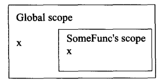
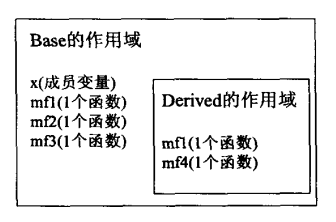
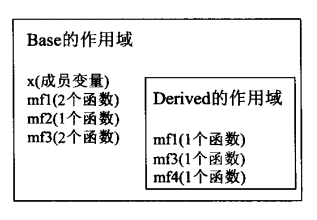
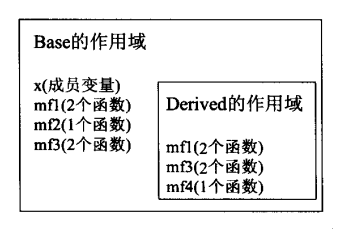
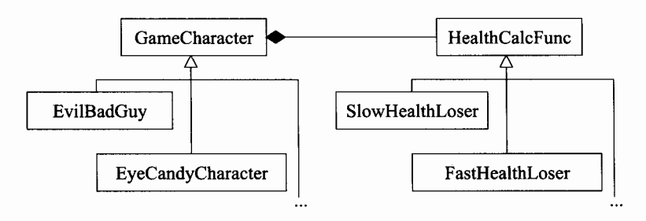

# Effective c++ 改善程序与设计的55个具体做法

<!-- @import "[TOC]" {cmd="toc" depthFrom=1 depthTo=6 orderedList=false} -->
<!-- code_chunk_output -->

- [Effective c++ 改善程序与设计的55个具体做法](#effective-c-改善程序与设计的55个具体做法)
  - [让自己习惯 c++](#让自己习惯-c)
    - [条款 01：视 C++ 为一个语言联邦](#条款-01视-c-为一个语言联邦)
    - [条款 02：尽量以 const,enum,inline 替换 #define](#条款-02尽量以-constenuminline-替换-define)
    - [条款 03：尽可能使用 const](#条款-03尽可能使用-const)
      - [const 成员函数](#const-成员函数)
      - [在 const 和 non-const 成员函数中避免重复](#在-const-和-non-const-成员函数中避免重复)
    - [条款 04：确定对象被使用前已先被初始化](#条款-04确定对象被使用前已先被初始化)
      - [请以 local static 对象替换 non-local static 对象](#请以-local-static-对象替换-non-local-static-对象)
  - [构造/析构/赋值运算](#构造析构赋值运算)
    - [条款 05：了解 c++ 默默编写并调用的哪些函数](#条款-05了解-c-默默编写并调用的哪些函数)
    - [条款 06：若不想使用编译器自动生成的函数，就该明确拒绝](#条款-06若不想使用编译器自动生成的函数就该明确拒绝)
    - [条款 07：为多态基类声明 virtual 析构函数](#条款-07为多态基类声明-virtual-析构函数)
    - [条款 08：别让异常逃离析构函数](#条款-08别让异常逃离析构函数)
    - [条款 09：绝不在构造和析构过程中调用 virtual 函数](#条款-09绝不在构造和析构过程中调用-virtual-函数)
    - [条款 10：令 operator= 返回一个 reference to * this](#条款-10令-operator-返回一个-reference-to-this)
    - [条款 11：在 operator= 中处理“自我赋值”](#条款-11在-operator-中处理自我赋值)
    - [条款 12：复制对象时务忘其每一个成分](#条款-12复制对象时务忘其每一个成分)
  - [资源管理](#资源管理)
    - [条款 13：以对象管理资源](#条款-13以对象管理资源)
    - [条款 14：在资源管理类中小心 copying 行为](#条款-14在资源管理类中小心-copying-行为)
    - [条款 15：在资源管理类中提供对原始资源的访问](#条款-15在资源管理类中提供对原始资源的访问)
    - [条款 16：成对使用 new 和 delete 时要采取相同形式](#条款-16成对使用-new-和-delete-时要采取相同形式)
    - [条款 17：以独立语句将 newed 对象置入智能指针](#条款-17以独立语句将-newed-对象置入智能指针)
  - [设计与声明](#设计与声明)
    - [条款 18：让接口容易被正确使用，不易被误用](#条款-18让接口容易被正确使用不易被误用)
    - [条款 19：设计 class 犹如设计 type](#条款-19设计-class-犹如设计-type)
    - [条款 20：宁以 pass-by-reference-to-const 替换 pass-by-value](#条款-20宁以-pass-by-reference-to-const-替换-pass-by-value)
    - [条款 21：必须返回对象时，别妄想返回其 reference](#条款-21必须返回对象时别妄想返回其-reference)
    - [条款 22：将成员变量声明为 private](#条款-22将成员变量声明为-private)
    - [条款 23：宁以 non-member、non-friend 替换 member 函数](#条款-23宁以-non-member-non-friend-替换-member-函数)
    - [条款 24：若所有参数皆需类型转换，请为此采用 non-member 函数](#条款-24若所有参数皆需类型转换请为此采用-non-member-函数)
    - [条款 25：考虑写出一个不抛出异常的 swap 函数](#条款-25考虑写出一个不抛出异常的-swap-函数)
  - [实现](#实现)
    - [条款 26： 尽可能延后变量定义式的出现时间](#条款-26-尽可能延后变量定义式的出现时间)
    - [条款 27：尽量少做转型动作](#条款-27尽量少做转型动作)
    - [条款 28：避免返回 handles 指向对象内部成分](#条款-28避免返回-handles-指向对象内部成分)
    - [条款 29：为 “异常安全”而努力是值得的](#条款-29为-异常安全而努力是值得的)
    - [条款 30：透彻了解 inlining 的里里外外](#条款-30透彻了解-inlining-的里里外外)
    - [条款 31：将文件的编译依存关系将至最低](#条款-31将文件的编译依存关系将至最低)
  - [继承与面向对象设计](#继承与面向对象设计)
    - [条款 32：确定你的 public 继承塑模出 is-a 关系](#条款-32确定你的-public-继承塑模出-is-a-关系)
    - [条款 33：避免遮掩继承而来的名称](#条款-33避免遮掩继承而来的名称)
    - [条款 34：区分接口继承和实现继承](#条款-34区分接口继承和实现继承)
    - [条款 35：考虑 virtual 函数以外的其他选择](#条款-35考虑-virtual-函数以外的其他选择)
      - [藉由 Non-Virtual Interface 手法实现 Template Method 模式](#藉由-non-virtual-interface-手法实现-template-method-模式)
      - [藉由 Function Pointers 实现 Strategy 模式](#藉由-function-pointers-实现-strategy-模式)
      - [藉由 std::function 完成 Strategy 模式](#藉由-stdfunction-完成-strategy-模式)
      - [古典的 Strategy 模式](#古典的-strategy-模式)
    - [条款 36：绝不重新定义继承而来的 non-virtual 函数](#条款-36绝不重新定义继承而来的-non-virtual-函数)
    - [条款 37：绝不重新定义继承而来的缺省参数值](#条款-37绝不重新定义继承而来的缺省参数值)
    - [条款 38：通过复合塑造出 has-a 或 “根据某物实现出”](#条款-38通过复合塑造出-has-a-或-根据某物实现出)
    - [条款 39：明智而审慎地使用 Private 继承](#条款-39明智而审慎地使用-private-继承)

<!-- /code_chunk_output -->

## 让自己习惯 c++

### 条款 01：视 C++ 为一个语言联邦

为了理解 C++，你必须认识其主要的次语言。幸运的是总共只有四个：

- `C`：说到底 C++ 仍是以 C 为基础。
- `Object-Oriented C++` :这部分是面向对象设计之古典守则在 C++ 上的最直接实施。
- `Template C++`:模板
- `STL`

因此，C++ 并不是一个带有一组守则的一体语言；它是从四个次语言组成的联邦政府，每个次语言都有自己的规约。记住这四个次语言你就会发现 C++ 容易了解得多。

请注意：

- C++ 高效编程守则视状况而变化，取决于你使用 C++ 的那一部分。

### 条款 02：尽量以 const,enum,inline 替换 #define

宏只是一个简单的替换，你需要小心的使用它,并且使用宏不好调试

请记住：

- 对于单纯常量，最好以 `const` 对象或 `enum` 替换 `#define`
- 对于形似函数的宏(macros)（注：该方式不会招致函数调用带来的额外开销）,最好改用 `inline` 函数替换 `#define`

### 条款 03：尽可能使用 const

const 的一件奇妙的事情是，它允许你指定一个语义约束（也就是指定一个 “不该被改动”的对象），而编译器会强制实施这项约束。它允许你告诉编译器和其他程序员某值应该保持不变。只要这（某值保持不变）是事实，你就该明确说出来，因为说出来可以获得编译器的相助，确保这条约束不被违反。

关于 const 的使用可以参考之前写的文章 [const 限定符](const.md)

#### const 成员函数

将 const 实施于成员函数的目的，是为了确认该成员函数可作用于 const 对象身上。这一类函数之所以重要，基于两个理由：

- 他们使 class 接口比较容易被理解。
- 他们使 “操作 const 对象”成为可能。这对编写高效率代码是个关键。

两个成员函数如果只是常量性(constness) 不同，可以被重载。考虑以下 class:

```c++
class TextBlock{
public:
 ...
 const char & operator [] (std::size_t position) const
 {
  return text[position];
 }
 char & operator[] (std::size_t position)
 {
  return text[position];
 }
private:
 std::string text;
}
```

TextBlock 的 operator[] s 可被这么使用：

```c++
TextBlock tb("Hello");
std::cout<<tb[0]; // 调用 no-const operator []

const TextBlock ctb("World");
std::cout<<ctb[0]; // 调用 const operator []
```

上述的例子太过造作，下面这个比较真实：

```c++
void print(const TextBlock & ctb)
{
 std::cout<<ctb[0]; // 调用 const operator []
 ...
}
```

```c++
tb[0]='x'; //没问题
ctb[0]='x'; //错误 ！
```

也清注意，non-const operator [] 的返回类型是个 reference to char,不是 char 。如果 operator [] 只是返回一个 char ,下面这样的句子就无法通过编译：

```c++
tb[0]='x';
```

那是因为，如果函数的返回值是个内置类型，那么改动函数返回值从来就不合法。纵使合法， c++ 以 by value 返回对象这一事实意味被改动的其实是 tb.text[0] 的一个副本，不是 tb.text[0] 自身，那不会是你想要的行为。

成员函数如果是 const 意味着什么 ？ 这又两个流行概念： bitwise constness (又称为  physical constness) 和 logical constness。

bitwise 阵营的人相信，成员函数只有在不更改对象之任何成员变量 （static 除外）时才可以说是 const。

不幸的是许多成员函数虽然不十足具备 const 性质却能通过 bitwise 测试。

看下面的例子：

```c++
class CTextBlock {
private:
 char * pText;

public:
 ...
 char & operator [] (std::size_t position) const
 {
  return pText[position];
 }
};
```

这个 class 不适当的将其 operator [] 声明为 const 成员函数，而该函数却返回一个 reference 指向对象内部值。

编译器允许这样：

```c++
const CTextBlock cctb("Hello");
char * pc=&cctb[0];

*pc ='J'; // cctb 现在有了 "Jello" 这样的内容
```

这种情况导出了所谓i的 logical constness。这一派拥护者主张，一个 const 成员函数可以修改它所处理的对象内的某些 bits，但只有在客户端侦测不出的情况下才得如此。

参考下面的例子：

```c++
class CTextBlock {
private:
 char * pText;
 mutable std::size_t textLength;
 mutable bool lengthIsVaild;

public:
 ...
 std::size_t length() const;
};

std::size_t CTextBlock::length() const
{
 if(!lengthIsVaild)
 {
  textLength=std::strlen(pText);
  lengthIsVaild=true;
 }
 return textLength;
}
```

#### 在 const 和 non-const 成员函数中避免重复

对于 “bitwise-constness 非我所欲”的问题， mutable 是个解决办法，但它不能解决所有的 const 相关难题。举个例子：

```c++
class TextBlock
{
public:
 ...
 const char & operator [] (std::size_t position) const
 {
  ... //bounds checking
  ... //log access data
  ... //verify data integrity
  return text[position];
 }

 char & operator [] (std::size_t position) const
 {
  ... //bounds checking
  ... //log access data
  ... //verify data integrity
  return text[position];
 }
private:
 std::string text;
};
```

可以用如下代码代替：

```c++
class TextBlock
{
 ...
 const char & operator [] (std::size_t position) const // 一如既往
 {
  ...
  ...
  ...
  return text[position];
 }

 char & operator [] (std::size_t position) //现在只调用 const op[]
 {
  return
  const_cast<char &>( //将 op[] 返回值的 const 移除
   static_cast<const TextBlock&>(this) // 为i * this 加上 const
   [position] // 调用 const op[]
  );
 }

 ...
}
```

值的了解的是，反向做法 ：令 const 版本调用 non-cast 版本以避免重复-并不是你该做的事情。

请记住：

- 将某些东西声明为 const 可帮助编译器侦测出错误用法。
- 编译器强制实施 bitwise constness,但你编写程序应该使用 “概念上的常量性” (conceptual constness)
- 当 const 和 non-const 成员函数有着实质等价的实现时，令 non-const 版本调用 const 版本可避免代码重复。

### 条款 04：确定对象被使用前已先被初始化

读取未初始化的值会导致不明确的行为。

这个规则很容易奉行，重要的是别混淆了赋值(assignment)和初始化(initalization)。考虑一个用来表现通讯簿的 class ,其构造函数如下：

```c++
class PhoneNumber {...};
class ABEntry {
private:
 std::string theName;
 std::string theAddress;
 std::list<PhoneNumber> thePhones;
 int numTimesConsulted;

public:
 ABEntry (const std::string &name,const std::string & address,const std::list<PhoneNumber>&phones);
};

ABEntry::ABEntry(const std::string &name,const std::string & address,const std::list<PhoneNumber>&phones)
{
 theName=name;
 theAddress=address;
 thePhones=phones;
 numTimesConsulted=0;
 //以上都是 赋值 ，而非 初始化
}
```

ABEntry 构造函数的一个较佳的写法是，使用所谓的 member initalization list(成员初值列) 替换赋值动作：

```c++
ABEntry::ABEntry(const std::string &name,const std::string & address,const std::list<PhoneNumber>&phones):theName(name),
theAddress(address),thePhones(phones),numTimesConsulted(0)
{}
```

#### 请以 local static 对象替换 non-local static 对象

`编译单元`是指产出单一目标文件(single object file) 的那些源码。基本上它是单一源码文件加上其所包含入的头文件 (#include files)。

[C++编译器compliler与链接器Linker工作原理](https://www.jianshu.com/p/5b3aa1b55cb4)

现在，我们关心的问题涉及至少两个源码文件，每一个内含至少一个 non-local static 对象。
参考如下示例：

```c++
class FileSystem{
public:
 ...
 std::size_t numDisks() const;
 ...
};
extern FileSystem tfs; //预备给客户使用的对象
```

在另一个源码文件中：

```c++
class Directory{
public:
 Directory(params);
 ...
};
Directory::Directory(params)
{
 ...
 std::size_t disks=tfs.numDisks(); //使用 tfs 对象
 ...
}
```

进一步假设，这些客户决定创建一个 Directory 对象，用来放置临时文件；

```c++
Directory tempDir(params); //为临时文件而做出的目录
```

现在，初始化次序的重要性显现出来了：除非tfs在 tempDir 之前先被初始化，否则 tempDir 的构造函数可能会用到尚未初始化的 tfs。但 tfs 和 tempDir 是不同的人在不同的时间于不同的源码文件建立起来的，它们是定义于不同编译单元内的 non-local static 对象。

如何确定 tfs 会在 tempDir 之前先被初始化？

```highlight
喔，你无法确定。再说一次，C++ 对 “定义于不同编译单元内的 non-local static 对象” 的初始化相对次序并无明确的定义。
```

幸运的是一个小小的设计便可完全消除这个问题。就像 Singleton 模式的一种实现那样。这种手法的基础在于:c++ 保证，函数内的 local static 对象会在 “该函数被调用期间” “首次遇上该对象之定义式”时会被初始化。

```c++
class FileSystem{...};
FileSystem &tfs()
{
 static FileSystem fs;
 return fs;
}
class Directory {...};
Directory::Directory(params)
{
 ...
 std::size_t disks=tfs.numDisks();
 ...
}
Directory &tempDir()
{
 static Directory td;
 return td;
}
```

请注意：

- 为内置型对象进行手工初始化，因为 C++ 不保证初始化它们。
- 构造函数最好使用成员初值列(member initialization list),而不要在构造函数本体内使用赋值操作 (assignment)。初值列列出的成员变量，其排列次序应该和它们在 class 中的声明次序相同。
- 为免除 “跨编译单元之初始化次序”问题，请以 local static 对象替换 non-local static 对象。

## 构造/析构/赋值运算

### 条款 05：了解 c++ 默默编写并调用的哪些函数

什么时候 empty class （空类） 不再是个 empty class 呢？ 当 c++ 处理过它之后。是的，如果你自己没声明，编译器就会为它声明（编译器版本的）一个 copy 构造函数、一个 copy assignment 操作符和一个析构函数。此外如果你没有声明任何构造函数，编译器也会为你声明一个 default 构造函数。所有这些函数都是 Public 且 inline(见条款 30)。因此，如果你写下：

```c++
class Empty{};
```

这就好像你写下：

```c++
class Empty
{
public:
 Empty() {...}
 Empty(const Empty & rhs) {...}
 ~Empty() {...}

 Empty & operator=(const Empty& rhs){...}
};
```

至于 copy 构造函数和 copy assignment 操作符，编译器创建的版本只是单纯地将来源对象的每一个 non-static 成员拷贝到目标对象。

### 条款 06：若不想使用编译器自动生成的函数，就该明确拒绝

为驳回编译器自动（暗自）提供的机能，这又两种方法：

1. 可将相应的成员函数声明为 private并且不予实现；

```c++
class Sample{
public:
 ...
private:
 ...
 //只有声明
 Sample(const Sample &);
 Sample & operator=(const Sample &);
};
```

2. 使用 Uncopyable 这样的 base class；

```c++
class Uncopyable
{
protected: //允许 derived 对象构造和析构
 Uncopyable(){}
 ~Uncopyable{}
private: //但组织 copying
 Uncopyable(const Uncopyable&);
 Uncopyable& operator=(const Uncopyable&);
};
```

为求阻止 Sample 对象被拷贝，我们唯一需要做的就是继承 Uncopyable:

```c++
class Sample:private Uncopyable
{
 ...
};
```

这行的通，因为只要任何人-甚至是 member 函数 或 friend 函数 -- 尝试拷贝 Sample 对象，编译器便试着生成一个 copy 构造函数和 copy assignment操作符，而正如条款 12 所说，这些函数的“编译器生成版”会尝试调用其 base class 的对应的兄弟，那些调用会被编译器拒绝，因为其 base class 的拷贝函数是 private。
也可以使用 boost 提供的版本，那个 class 名为 [noncopyable](https://www.boost.org/doc/libs/1_63_0/libs/core/doc/html/core/noncopyable.html).

### 条款 07：为多态基类声明 virtual 析构函数

参见如下示例：

```c++
#include <iostream>
#include <string>

using namespace std;

class A {
public:
  A() { cout << "A create" << endl; }
  ~A() { cout << "A delete" << endl; }
  void show() { cout << "A show" << endl; }
};

class B : public A {
public:
  B() { cout << "B create" << endl; }
  ~B() { cout << "B delete" << endl; }

  void show() { cout << "B show" << endl; }
};

int main(int argc, char const *argv[]) {
  A * newB = new B();
  newB->show();
  delete newB;

  return 0;
}

```

output:

```
A create
B create
A show
A delete
```

添加virtual

```c++
#include <iostream>
#include <string>

using namespace std;

class A {
public:
  A() { cout << "A create" << endl; }
  virtual ~A() { cout << "A delete" << endl; }
  void show() { cout << "A show" << endl; }
};

class B : public A {
public:
  B() { cout << "B create" << endl; }
  ~B() { cout << "B delete" << endl; }

  void show() { cout << "B show" << endl; }
};

int main(int argc, char const *argv[]) {
  A * newB = new B();
  newB->show();
  delete newB;

  return 0;
}
```

output:

```
A create
B create
A show
B delete
A delete
```

请记住：

- polymorphic(带多态性质的) base classes 应该声明一个 virtual 析构函数。如果 class 带有任何 virtual 函数，他就应该拥有一个 virtual 析构函数。
- classes 的设计目的如果不是作为 base classes 使用，或不是为了具备多态性(polymorphic),就不应该声明 virtual 析构函数。

### 条款 08：别让异常逃离析构函数

c++ 并不禁止析构函数吐出异常，但它不鼓励你这样做。这是由理由的，考虑以下代码：

```c++
class Widget {
public:
  ~Widget (){...} // 假设这个可能吐出一个异常
};

void doSomething()
{
 std::vector<Widget> v;
 ...
}
```

当 vector v 被销毁，它有责任销毁其内含的所有 Widgets. 假设 v 内含10个 Widget,而在析构第一个元素期间，有个异常被抛出。其他 9 个 Widget 还是应该被销毁，因此 v 应该调用它们各个析构函数。

若析构函数吐出异常，程序可能过早结束或出现不明确行为。是的，c++ 不喜欢析构函数吐出异常！

假设你使用一个 class 负责数据库连接：

```c++
class DBConnection{
public:
 ...
 static DBConnection create();

 void close(); //关闭联机；失败则抛出异常
};
```

为确保客户不忘记在 DBConnection 对象上调用 close(),一个合理的想法是创建一个用来管理 DBConnection 资源的 class,并在其析构函数中调用 close.

```c++
class DBConn{
public:
 ...
 ~DBConn()
 {
  db.close();
 }
private:
 DBConnection db;
};
```

这便允许客户写出这样的代码：

```c++
{
 DBConn dbc(DBConnection::create());

 ...
}
```

只要调用 close 成功，一切都美好。但如果该调用导致异常, DBConn 析构函数会传播该异常，也就是允许它离开这个析构函数。那会造成问题，因为那就是抛出了难以驾驭的麻烦。
两个办法可以避免这一问题。DBConn 的析构函数可以：

1. 如果 close 抛出异常就结束程序。通常通过调用 abort 完成。

```c++
DBConn::~DBConn()
{
 try
 {
  db.close();
 }
 catch(...)
 {
  writeErrInfo2Log(); //制作运转记录，记下对 close 的调用失败；
  std::abort();
 }
}
```

如果程序遭遇一个“于析构期间发生的错误”后无法继续执行，“强迫结束程序”是个合理选项。毕竟它可以阻止异常从析构函数传播出去（那会导致不明确的行为）。也就是说调用 abort 可以抢先制“不明确行为”于死地。

2. 吞下因调用 close 而发生的异常：

```c++
DBConn::~DBConn()
{
 try
 {
  db.close();
 }
 catch(...)
 {
  writeErrInfo2Log(); //制作运转记录，记下对 close 的调用失败；
 }
}
```

一般而言，将异常吞掉是个坏主意，因为它压制了“某些动作失败”的重要信息！然而有时候吞下异常也比负担“草率结束程序”或“不明确行为带来的风险”好。为了让这成为一个可行方案，程序必须能够继续可靠地执行，即使在遭遇并忽略一个错误之后。

上述的办法没有什么吸引力。问题在于两者都无法对“导致 close 抛出异常”的情况做出反应。

一个较佳策略是重新设计 DBConn 接口，使其客户有机会对可能出现的问题做出反应。就像这样：

```c++
class DBConn
{
public:
 ...
 void close() // 供客户使用的新函数
 {
  db.close();
  closed=true;
 }

 ~DBConn()
 {
  if(!closed)
  {
   try
   {
    db.close();
   }
   catch(...)
   {
    writeErrInfo2Log(); //制作运转记录，记下对 close 的调用失败；
    ...
   }
  }
 }

private:
 DBConnection db;
 bool closed;
};
```

把调用 close 的责任从 DBConn 析构函数手上移到 DBConn 客户手上。如果真有错误发生--如果 close 的确抛出异常-- 而且 DBConn 吞下该异常或结束程序，客户没有立场抱怨，毕竟它们曾有机会第一手处理问题，而他们选择了放弃。

请记住：

- 析构函数绝不要吐出异常。如果一个被析构函数调用的函数可能抛出异常，析构函数应该捕捉任何异常，然后吞下它们（不传播）或结束程序；
- 如果客户需要对某个操作函数运行期间抛出的异常做出反应，那么 class 应该提供一个普通函数（而非在析构函数中）执行该操作。

### 条款 09：绝不在构造和析构过程中调用 virtual 函数

本条款开始之前先阐述重点：你不应该在构造函数和析构函数期间调用 virtual 函数，因为这样的调用不会带来你预想的结果，就算有你也不会高兴。如果你同时也是一位 java 或 c# 程序uan，请更加注意本条款，因为这是 C++ 与它们不相同的一个地方。

请看下面的一个例子：

```c++
#include <iostream>

class Transaction{
public:
 Transaction();
 virtual void logTransaction() const =0;
};

Transaction::Transaction()
{
 logTransaction();
}

class BuyTransaction:public Transaction{
public:
 virtual void logTransaction() const
  {}
};

class SellTransaction:public Transaction
{
public:
 virtual void logTransaction() const
  {}
};

int main(int argc, char const *argv[]) {
  BuyTransaction test;
  return 0;
}

```

生成执行文件:

```sh
# 使用g++ 8.2.1 ，生成执行文件失败；
# 编译出现警告
... : In constructor ‘Transaction::Transaction()’:
... :warning: pure virtual ‘virtual void Transaction::logTransaction() const’ called from constru
ctor
  logTransaction();
                 ^
# 链接错误
/usr/bin/ld: /tmp/ccE9rBeB.o: in function `Transaction::Transaction()`:
... :(.text+0x20): undefined reference to `Transaction::logTransaction() const \`
collect2: error: ld returned 1 exit status
```

base class 构造期间 virtual 函数绝不会下降到 derived classes 阶层。取而代之的是，对象的作为就像隶属 base 类型一样。非正式的说法或许比较传神：在 base class 构造期间，virtual 函数不是 virtual 函数。

这一似乎反直觉的行为有个好理由。由于 base class 构造函数的执行更早于 derived class 构造函数，当 base class 构造函数执行时 derived class 的成员变量尚未初始化。如果此期间调用 virtual 函数下降至 derived classes 阶层，要知道 derived class 的函数几乎必然取用 local 成员变量，而这些成员变量尚未初始化。这将是一张通往不明确行为和彻夜调试大会串的直达车票。“要求使用对象内部尚未初始化的成分”是危险的代名词，所以 c++ 不会让你走这条路。

对象在 derived class 构造函数开始执行之前不会成为一个 derived class 对象。

相同道理也适用于析构函数。一旦 derived class 析构函数开始执行，对象内的 derived class成员变量便呈现未定义值，所以 c++ 视他们仿佛不再存在。进入 base class 析构函数后对象就成为了一个 base class 对象，而 c++ 的任何部分包括 virtual 函数、 dynamic_casts 等等也就这么看待它。

上述示例中的问题，某些编译器会为此发出一些警告信息。

再看下面的例子：

```c++
#include <iostream>

class Transaction{
public:
 Transaction();
 virtual void logTransaction() const =0;
private:
  void init()
  {
    logTransaction(); //这里调用 virtual
  }
};

Transaction::Transaction()
{
 init(); // 调用 non-virtual
}

class BuyTransaction:public Transaction{
public:
 virtual void logTransaction() const
  {}
};

class SellTransaction:public Transaction
{
public:
 virtual void logTransaction() const
  {}
};

int main(int argc, char const *argv[]) {
  BuyTransaction test;
  return 0;
}
```

使用 g++ 生成执行文件，并不会有警告及错误信息；但是运行

```sh
pure virtual method called
terminate called without an active exception
Aborted (core dumped)
```

这段代码概念上和稍早版本相同，但它比较潜藏并且暗中为害，因为它通常不会引发编译器和连接器的抱怨。此时由于 logTransaction 是 Transaction 内的一个 pure virtual 函数，当 pure virtual 函数被调用，大多执行系统会中止程序（通常对此结果发出一个信息）。

很显然，在构造函数里面调用 virtual 函数是一个错误的错法。

其他方案可以解决这个问题。像这样：

```c++
class Transaction
{
 public:
 explicit Transaction(const std::string& logInfo);
 void logTransaction(const std::string& logInfo) const ; // non-virtual function
 ...
};

Transaction::Transaction(const std::string& logInfo)
{
 ...
 logTransaction(logInfo); // non-virtual 调用
}

class BuyTransaction:public Transaction
{
 public：
 BuyTransaction(params)
 :Transaction(createLogString(params))
 {
  ...
 }
 ...
 private:
 static std::string createLogString(params);
}
```

### 条款 10：令 operator= 返回一个 reference to * this

关于赋值，有趣的是你可以把它们写成连锁形式：

```c++
int x,y,z;
x=y=z=15; //赋值连锁形式
```

同样有趣的是，赋值采用右结合律，所以上述连锁赋值被解析为：

```c++
x=(y=(z=15));
```

为了实现“连锁赋值”，赋值操作符必须返回一个 reference 指向操作符的左侧实参。这是你为 classes 实现赋值操作符时应该遵循的协议：

```c++
class Widgets{
public:
 ...

 Widget& operator=(const Widget &rhs)
 {
  ...
  return * this;
 }
 ...
};
```

这个协议不仅适用于以上标准赋值形式，也适用于所有赋值相关运算，例如：

```c++
class Widget
{
public:
 ...
 Widget& operator+=(const Widget &rhs)
 {
  ...
  return * this;
 }

 Widget& operator=(int rhs)
 {
  ...
  return * this;
 }
 ...
};
```

注意，这只是个协议，并无强制性。如果不遵循它，代码一样可以通过编译。然而这份协议被 STL 提供的诸如 string,vector,complex,tr1::shared_ptr 等类型共同遵守。因此除非你有一个非常标新立异的好理由，不然还是随众吧。

### 条款 11：在 operator= 中处理“自我赋值”

”自我赋值” 发生在对象被赋值给自己时：

```c++
class Widget{...};
Widget w;
...
w=w;
```

这看起来有点愚蠢，但他合法，所以不要认定客户决不会这么做。此外赋值操作并不总是那么可被一眼辨识出来，例如：

```c++
// 潜在的自我赋值
a[i]=a[j]; // if i==j
*px=*py; // 如果 px 和 py 恰巧指向同一个东西
```

```c++
class Base{...};
class Derived:public Base{...};
void doSomething(const Base& rb,Derived* pd);
// rb 和 *pd 有可能其实是同一对象
```

示例：

```c++
class Bitmap{...};
class Widget{
 ...
private:
 Bitmap * pb; // pointer to object by new
};
```

让我们来看一份不安全的 operator= 实现版本：

```c++
Widget& Widget::operator=(const Widget& rhs)
{
 delete pb;
 pb=new Bitmap(* rhs.pb);
 return * this;
}
```

这里自我赋值的问题时，operator 函数内的 * this 和 rhs 有可能时同一个对象。果真如此 delete 就不只是销毁当前对象的 bitmap,它也销毁 rhs 的 bitmap。在函数末尾， Widget -- 它原本不该被自我赋值动作改变的--发现自己持有一个指针指向一个已被删除的对象！
阻止这种错误，可以这样：

```c++
Widget& Widget::operator=(const Widget& rhs)
{
 if (this == &rhs) {
  return * this;
 }
 delete pb;
 pb=new Bitmap(* rhs.pb);
 return * this;
}
```

但这个版本仍然存在异常方面的麻烦。更明确地说，如果“new BitMap”导致异常（不论时因为分配时内存不足或因为 Bitmap 的 copy 构造函数抛出异常），Widget 最终持有一个指针指向一块被删除的 bitmap。这样的指针有害。
你可以这样处理：

```c++
class Widget
{
 ...
 void swap(Widget & rhs); //交换 * this 和 rhs 数据；详见条款 29
 ...
};
```

```c++
Widget& Widget::operator=(const Widget &rhs)
{
 Widget tmp(rhs);
 swap(temp);
 return * this;
}
```

or

```c++
Widget& Widget::operator=(Widget rhs)
{
 swap(rhs);
 return * this;
}
```

注：作者比较忧虑第二种做法，认为它为了伶俐巧妙的修补而牺牲了清晰性，然而将"copy动作"从函数体内移至“函数参数构造阶段”却可令编译器有时生成更高效的代码。

请记住：

- 确保当对象自我赋值时 operator= 有良好的行为。其中技术包括比较“来源对象”和“目标对象”的地址、精心周到的语句顺序、以及 copy-and-swap;
- 确定任何函数如果操作一个以上的对象，而其中多个对象时同一个对象时，其行为仍然正确。

### 条款 12：复制对象时务忘其每一个成分

设计良好之面向对象系统会将对象的内部封装起来，只留两个函数负责对象拷贝（复制），那便是带着适切名称的 copy 构造函数和 copy assignment 操作符，作者称其为 copying 函数。

如果你声明自己的 copying 函数，便拒绝了编译器生成的缺省 copying 函数。编译器仿佛被冒犯似的，会以一种奇怪的方式回敬：当你的实现代码几乎必然出错却不告诉你。
考虑如下示例：

```c++
void logCall(const std::string& funcName);
class Customer{
public:
 ...
 Customer (const Customer& rhs);
 Customer& operator=(const Customer& rhs);
 ...
private:
 std::string name;
};

Customer::Customer(const Customer& rhs):name(rhs.name)
{
 logCall("Customer copy constructor");
}

Customer& Customer::operator=(const Customer& rhs)
{
 logCall("Customer copy assignment operator");
 name=rhs.name;
 return * this;
}
```

这里的每一件事情看起来都很好，而实际上每件事情也的确都好，直到另一个成员变量加入战局：

```c++
class Date {...};
class Customer
{
public:
 ...
private:
 std::string name;
 Date lastTransaction; // other val
}
```

这时的既有 copying 函数执行的是局部拷贝:它们的确复制了name,但是没有复制新添加的 lastTransaction。大多数编译器对此不出任何怨言-即使在最高等警告级别中。

结论很明显：如果你为 calss 添加一个成员变量，你必须同时修改 copying 函数。（你也需要修改 class 的所有构造函数(见条款 4 和 45)以及任何非标准形式的 operator= 。如果你忘记，编译器不太可能提醒你）。

另外一旦发生继承，可能会造成此一主题最暗中肆虐的一个潜藏危机。请考虑：

```c++
class PriorityCustomer:public Customer
{
public:
 ...
 PriorityCustomer(const PriorityCustomer& rhs);
 PriorityCustomer& operator=(const PriorityCustomer& rhs);
 ...
private:
 int priority;
}
PriorityCustomer::PriorityCustomer(const PriorityCustomer& rhs):priority(rhs.priority)
{
 logCall("PriorityCustomer copy constructor");
}

PriorityCustomer& PriorityCustomer::operator=(const PriorityCustomer& rhs)
{
 logCall("PriorityCustomer copy assignment operator");
 priority=rhs.priority;
 return * this;
}
```

PriorityCustomer 的 copying 函数看起来好像复制了 PriorityCustomer 内的每一样东西，但是请再看一眼。是的，它们复制了 PriorityCustomer 声明的成员变量，但每个 PriorityCustomer 还内含它所继承的 Customer 成员变量副本，而那些成员变量却未被复制。

以上事态在 PriorityCustomer 的 copy assignment 操作符身上只是轻微不同。它不曾企图修改其 base class 的成员变量，所以那些成员变量保持不变。
任何时候只要你承担起"为 derived class 撰写 copying 函数"的重责大任，必须很小心地也复制其 base class 成分。那些成分往往是 private,所以你无法直接访问它们，你应该让 derived class 的 copying 函数调用相应的 base class 函数：

```c++
PriorityCustomer::PriorityCustomer(const PriorityCustomer& rhs):
 Customer(rhs), // 调用 base class copy 构造函数
 priority(rhs.priority)
{
 logCall("PriorityCustomer copy constructor");
}

PriorityCustomer& PriorityCustomer::operator=(const PriorityCustomer& rhs)
{
 logCall("PriorityCustomer copy assignment operator");
 Customer::operator=(rhs); // 对 base class 成分进行赋值操作
 priority=rhs.priority;
 return * this;
}
```

请记住：

- copying 函数应该确保复制“对象内的所有成员变量”及“所有 base class 成分”。
- 你不该令 copy assignment 操作符调用 copy 构造函数；同样不该令 copy 构造函数调用 copy assignment 操作符。
- 不要尝试以某个 copying 函数实现另一个 copying 函数。应该将共同机能放进第三个函数中，并由两个 copying 函数共同调用。

## 资源管理

所谓资源就是，一旦用了它，将来必须还给系统。如果不这样，糟糕的事情就会发生。C++ 程序最常使用的资源就是动态分配内存。其他常见的资源还包括 文件描述器(file descriptors)、 互斥锁(mutex locks) 、图形界面中的字型和笔刷、数据库连接、以及网络 sockets 。不论那一种资源，重要的是，当你不再使用它时，必须将它还给系统。

尝试在任何运用情况下都确保以上所言，是件困难的事，但当你考虑到异常、函数内多重回传路径、程序维护员改动软件却没能充分理解随之而来的冲击，态势就很明显了：资源管理的特殊手段还不很充分够用。

本章一开始是一个直接而易懂且基于对像(object-based) 的资源管理办法，建立在 c++ 对构造函数、析构函数、copying 函数的基础上。经验显示，经过训练后严守这些做法，可以几乎消除资源管理问题。

### 条款 13：以对象管理资源

```c++
class Investment {...}; // “投资类型” 继承体系中的 root class
```

进一步假设，这个程序库系通过一个工厂函数供应我们某特定的 Investment 对象：

```c++
Investment * createInvestment();
// 返回指针，指向 Investment 集成体系内动态分配的对象。调用者有责任删除它。
// 这里为了简化，刻意不写参数。
```

```c++
void f()
{
 Investment * pInv = createInvestment();

 ...

 delete pInv;
}
```

这看起来妥当，但若干情况下 f 可能无法删除它得自 createInvestment 的投资对象(...)。无论 delete 如何被略过去，我们泄漏的不只是内含投资对象的那块内存，还包括那些投资对象所保存的任何资源。

当然了，谨慎的编写程序可以防止这一类错误，但你必须想想，代码可能会在时间渐渐过去后被修改。单纯依赖“f总是会执行其 delete 语句”是行不通的。

为确保 createInvestment 返回的资源总是被释放，我们需要将资源放进对象内，当控制流离开 f ，该对象的析构函数会自动释放那些资源。实际上这正是隐身于本条款背后的半边想法：把资源放进对象内，我们便可依赖 c++ 的 “析构函数自动调用机制”确保资源被释放。（稍后讨论另半边想法。）

许多资源被动态分配于 heap 内而后被用于单一区块或者函数内。它们应该在控制流离开那个区块或函数时被释放。 [auto_ptr](https://en.cppreference.com/w/cpp/memory/auto_ptr) 正是针对这种形式而设计的特制产品。

eg:

```c++
void f()
{
 std::auto_ptr<Investment> pInv(createInvestment());

 ...
}
```

这个简单的例子示范“以对象管理资源”的两个关键想法：

- 获得资源后立刻放进管理对象内。
- 管理对象运用析构函数确保资源被释放。

由于 auto_ptr 被销毁时会自动删除它所指之物，所以一定要注意别让多个 auto_ptr 同时指向同一对象。如果真是那样，对象会被删除一次以上，而那会使你的程序搭上驶向“未定义行为”的快速列车上。为了预防这个问题，auto_ptrs 有一个不寻常的特性：若通过 copy 构造函数或 copy assignment 操作符复制它们，它们就会变成 null ,而复制所得的指针将取得资源的唯一拥有权！

这一诡异的复制行为，副加上其底层条件： “受 auto_ptrs 管理的资源必须绝对没有一个以上的 auto_ptr 同时指向它”，意味着 auto_ptrs 并非管理动态分配资源的神兵利器。举个例子，STL 容器要求其元素发挥 “正常的”复制行为，因此这些容器容不得 auto_ptr。

auto_ptr 的替代方案是 "引用计数型智慧指针 (reference-counting smart pointer ,RCSP)"。所谓 RCSP 也是个智能指针，持续追踪共有多少对象指向某笔资源，并在无人指向它时自动删除该资源。 RCSPs 提供的行为类似垃圾回收，不同的是 RCSPs 无法打破环状引用，例如两个其是已经没被使用的对象彼此互指，因而好像还处在 “被使用” 状态。

[shared_ptr](https://en.cppreference.com/w/cpp/memory/shared_ptr) 就是个 RCSP.

```c++
void f()
{
 std::shared_ptr<Investment> pInv(createInvestment());
 ...
}
```

这段代码看起来几乎和使用 auto_ptr 的那个版本相同，但 shared_ptr 的复制行为正常多了。

由于 shared_ptr 的复制行为 “一如预期”，它们可被用于 STL 容器以及其他 “auto_ptr 之非正统复制行为并不适用” 的语境上。

auto_ptr 和 shared_ptr 两者都在其析构函数内做 delete 而不是 delete[] 动作。那意味着在动态分配而得到的 array 身上使用 auto_ptr 或 shared_ptr 是个馊主意。尽管如此，可叹的是，那么做仍能够通过编译：

```c++
// 馊主意，oops
std::auto_ptr<std::string> aps(new std::string[10]);

std::shared_ptr<int> spi(new int[1024]);
```

如果你还是认为拥有针对数组而设计，类似 auto_ptr 和 shared_ptr 那样的 classes 较好，看看 boost 吧， [boost::scoped_array](https://www.boost.org/doc/libs/1_61_0/libs/smart_ptr/scoped_array.htm)
和 [boost::shared_array](https://www.boost.org/doc/libs/1_61_0/libs/smart_ptr/shared_array.htm)

本条款也建议：如果你打算手工释放资源，容易发生错误。罐装式的资源管理类如 auto_ptr 和 shared_ptr 往往是比较能够轻松遵循本条款忠告，但有时候你所使用的资源是目前这些预制式 classes 无法妥善管理的。既然如此就需要精巧制作你自己的资源管理类。那并不是非常困难，但的确设计若干你需要考虑的细节。

请记住：

- 为防止资源泄漏，请使用 RAII 对象，它们在构造函数中获得资源并在析构函数中释放资源。
- 两个常被使用的 RAII classes 分别是 shared_ptr 和 auto_ptr(在 c++ 11 中被标记为弃用)。前者通常是较佳的选择，因为其 copy 行为比较直观。若选择 auto_ptr ，复制动作会使它（被复制物） 指向 null。

### 条款 14：在资源管理类中小心 copying 行为

假如建立一个自己的资源管理类 Lock:

```c++
class Lock{
public:
 explicit Lock(Mutex* pm):mutexPtr(pm)
 {
  lock(mutexPtr);
 }
 ~Lock()
 {
  unlock(mutexPtr);
 }
private:
 Mutex * mutexPtr；
};
```

客户对 Lock 的用法符合 RAII 方式：

```c++
Mutex m;
...

{
 Lock m1(&m);
 ...
}
```

这很好，但如果 Lock 对象被复制，会发生什么事？

```c++
Lock ml1(&m); // 锁定 m
Lock ml2(ml1); // oops
```

这是一个一般化问题的特定例子，那个一般问题是每一位 RAII class 作者一定需要面对的： “当一个 RAII 对象被复制，会发生什么事？” 大多数你会选择以下两种可能：

- 禁止复制。如果复制动作对 RAII class 并不合理，你便应该禁止之。eg：

```c++
class Lock:private Uncopyable
{
 ...
};
```

- 对底层资源祭出 “引用计数法”
比如这样：

```c++
class Lock{
public:
 // 以某个 Mutex 初始化 shared_ptr 并以 unlock 函数为删除器
 explicit Lock(Mutex * pm):mutexPtr(pm,unlock)
 {
  lock(mutexPtr.get());
 }
private:
 std::shared_ptr<Mutex> mutexPtr;
};
```

- 复制底部资源（复制资源管理对象时，进行的是 “深度拷贝”。就像字符串深度拷贝那样）
- 转移底部资源的拥有权。某些罕见场合下你可能希望确保永远只有一个 RAII 对象指向一个未加工资源，即使 RAII 对象被复制依然如此。此时资源的拥有权会从被复制物转移到目标物。这是 auto_ptr 奉行的复制的意义。

请记住：

- 复制 RAII 对象必须一并复制它所管理的资源，所以资源的 copying 行为决定 RAII 对象的 copying 行为。
- 普遍而常见的 RAII class copying 行为是：抑制 copying、施行引用计数法。不过其他行为也可能被实现。

### 条款 15：在资源管理类中提供对原始资源的访问

```c++
std::shared_ptr<Investment> pInv(createInvestment());
```

假设你希望以某个函数处理 Investment 对象，像这样：

```c++
int daysHeld(const Investment* p); //返回投资天数
```

这时候你需要一个函数可以将 RAII class 对象转换为其所内含之原始资源。有两个做法可以达成目标：

- 显式转换
- 隐式转换

std::shared_ptr 和 auto_ptr 都提供一个 get 成员函数，用来执行显示转换，也就是它返回智能指针内部的原始指针：

```c++
int days = daysHeld(pInv.get());
```

就像（几乎）所有智能指针一样，shared_ptr 和 auto_ptr 也重载了指针取值(pointer defeferencing) 操作符 (operator-> 和 operator*) ,它们允许隐式转换至底部原始指针。

由于有时候还是必须取得 RAII 对象内的原始资源，某些 RAII class 设计者于是联想到 "将油脂涂在滑轨上"，做法是提供一个隐式转换函数。考虑下面：

```c++
FontHandle getFont(); // 这是个 c API

void releaseFont(FontHandle fh);

class Font{
public:
  explicit Font(FontHandle fh):f(fh)
  {

  }
  ~Font()
  {
    releaseFont(f);
  }

private:
  FontHandle f; // 原始字体资源
};
```

假设有大量的与字体相关的 c API ，它们处理的是 FontHandle,那么 “将 Font 对象转换为 FontHandle”会是一种很频繁的需求。Font class 可为此提供一个显式转换函数：

```c++
class Font{
public:
  ...
  FontHandle get() const
  {
    return f;
  }

  ...
};
```

不幸的是这使得客户每当想要使用 API 时就必须调用 get:

```c++
void changeFontSize(FontHandle f,int newSize); // C API

Font f(getFont());
int newFontSize =0;
...
changeFontSize(f.get(),newFontSize);
```

某些程序员可能会认为，如此这般地到处要求显式转换，足以使人们倒尽胃口，不再愿意使用这个 class ，从而增加了泄漏字体地可能性，而 Font class 的主要设计目的就是为了防止资源泄漏。

另一种方法是令 Font 提供隐式转换函数，转型为 FontHandle:

```c++
class Font{
public:
  ...
  operator FontHandle() const //  隐式转换函数
  {
    return f;
  }
};
```

这使得客户调用 C API 时比较轻松且自然：

```c++
Font f(getFont());
int newFontSize =0;
...
changeFontSize(f,newFontSize);
```

但这个隐式转换会增加错误发生机会。假如各户可能会在需要 Font 时意外创建一个 FontHandle:

```c++
Font f1(getFont());
...
FontHandle f2 = f1; // oops!原意是要拷贝一个 Font 对象
//，却反而将 f1 隐式转换为其底部的 FontHandle 然后再复制它。
```

这几乎不会有好下场。

是否该提供一个显式转换函数将 RAII class 隐式转换为其底部的资源，或是应该提供隐式转换，答案主要取决于 RAII class 被设计执行的特定工作，以及它被使用的情况。通常显式转换函数是比较受欢迎的路子，因为它将“非故意之类型转换”的可能性最小化了。然而有时候，隐式转换所带来的“自然用法”也会引发天平倾斜。

请记住：

- APIs 往往要求访问原始资源，所以每一个 RAII class 应该提供一个 “取得其所管理之资源” 的办法。
- 对原始资源的访问可能经由显式转换或隐式转换。一般而言显式转换比较安全，但隐式转换对客户比较方便。

### 条款 16：成对使用 new 和 delete 时要采取相同形式

以下动作有什么错？

```c++
std::string * stringArray = new std::string[100];

...

delete stringArray;
```

delete 的最大问题在于：即将被删除的内存之内究竟存有多少个对象？

实际上这个问题可以更简单些：即将被删除的那个指针，所指的是单一对象或者对象数组？这是个比不可缺的问题，因为单一对象的内存布局一般而言不同于数组的内存布局。

```c++
std::string * sp1 = new std::string;
std::string * sp2 = new std::string[100];

...
delete sp1;
delete [] sp2;
```

游戏规则很简单：如果你调用 new 时使用 [],你必须在对应调用 delete 时也使用 []。如果你调用 new 时没有使用 [],那么也不该在对应调用 delete 时使用 [].

这个规则对于希望使用 typedef 的人也很重要，比如这个：

```c++
typedef std::string AddressLines[4];

std::string * pa1 = new AddressLines;
```

那就必须匹配“数组形式”的 delete:

```c++
delete pa1; // oops,行为未定义
delete [] pa1; // good
```

为避免诸如此类问题，最好尽量不要对数组形式做 typedef 动作。这很容易达成，因为 c++ STL 含有 string,vector等 template，可将数组的需求降至几乎为0。例如可以：

```c++
typedef std::vector<string> AddressLines;
```

请记住：

- 如果你调用 new 时使用 [],必须在对应调用 delete 时也使用 []。如果你调用 new 时没有使用 [],一定不要在相应的 delete 表达式中使用 []

### 条款 17：以独立语句将 newed 对象置入智能指针

```c++
int priority(); // 处理优先级
void processWidget(std::shared_ptr<Widget> pw,int priority); // 在动态分配所得的 Widget 上进行某些带优先级的处理
```

现在考虑调用 processWidget

```c++
processWidget(new Widget,priority()); // 等等，这不能通过编译。
```

如果写成这样就可以通过编译：

```c++
processWidget(std::shared_ptr<Widget>(new Widget),priority());
```

令人惊讶的是，虽然我们在此使用“对象管理式资源”，上述调用取可能泄漏资源。

编译器产出一个 processWidget 调用码之前，必须首先核算即将被传递的各个实参。上述第二个参数只是一个单纯的对 priority 函数的调用，但第一个实参 shared_ptr<Widget>(new Widget) 有两部分组成：

- 执行 "new Widget" 表达式
- 调用 shared_ptr 构造函数

于是在调用 processWidget 之前，编译器必须创建代码，做以下三件事：

- 调用 priority
- 执行 "new Widget" 表达式
- 调用 shared_ptr 构造函数

c++ 编译器以什么样的次序完成这些事情呢？弹性很大。这和其他语言如 Jave 和 c# 不同，那两种语言总是以特定次序完成函数参数的核算。可以确定的是 “ new Widget” 一定执行于 shared_ptr 构造函数被调用之前，因为这个表达式的结果还要传递作为 shared_ptr 构造函数的一个实参，但对 priority 的调用可以排在第一或第二或第三执行。如果编译器选择以第二顺位执行它（说不定可因此生成更高效的代码，谁知道！），最终获得这样的操作序列：

- 执行 "new Widget" 表达式
- 调用 priority
- 调用 shared_ptr 构造函数

现在请你想想，万一对 priority 调用导致异常，会发生什么事情？（oops，将会发生内存泄漏）

避免这类问题的方法很简单：

```c++
// 在单独语句内以智能指针存储 newed 所得对象。
std::shared_ptr<Widget> pw(new Widget);

// 这个调用绝不至于造成泄漏
processWidget(pw,priority());
```

以上代码之所以行得通，因为编译器对于 “跨越语句的各项操作” 没有重新排列的自由（只有在语句内它才拥有那个自由度）。

请记住：

- 以独立语句将 newed 对象存储于智能指针内。如果不这样做，一旦异常被抛出，有可能导致难以察觉的资源泄漏。

## 设计与声明

所谓软件设计，是“令软件做出你希望它做的事情”的步骤和方法，通常以颇为一般性的构想开始，最终演变成十足的细节，以允许特殊接口(interfaces) 的开发。这些接口而后必须转化为 c++ 的声明式。本章将对良好 c++ 接口的设计和声明发起攻势。以或许最重要、适合任何接口设计的一个准则作为开端：“让接口容易被正确使用，不容易被误用”。这个准则设立了一个舞台，让其他更专精的准则对付一个大范围的题目，包括正确性、高效性、封装性、维护性、延展性，以及协议的一致性。

以下准备的材料并不覆盖你需要知道的优良接口设计的每一件事，但它强调某些最重要的考虑，对某些最频繁出现的错误提出警告，为 class 、 function 和 template 设计者经常遭遇的问题提供解答。

### 条款 18：让接口容易被正确使用，不易被误用

c++ 在接口之海漂浮。 function 接口、 class 接口 、 template 接口 ... 每一种接口都是客户与你的代码互动的手段。理想上，如果客户企图使用某个接口而却没有获得他所预期的行为，这个代码不该通过编译；如果代码通过了编译，它的作为就该是客户所想要的。

欲开发一个“容易被正确使用，不易被误用”的接口，首先必须考虑客户会做出什么样的错误。假设你为一个用来表现日期的 class 设计构造函数：

```c++
class Date{
public:
  Date(int month,int day,int year);
  ...
};
```

乍见之下这个接口通情达理（至少在美国如此），但他的客户很容易犯下至少两个错误。

```c++
// 1. 以错误的次序传递参数
Date d(30,3,1995); // oops，应该是 "3,30" 而不是 "30,3"
// 2. 它们可能传递一个无效的月份或天数
Date d(2,30,1995); // oops,应该是 "3,30" 而不是 "2,30"
```

许多客户端错误可以因为导入新类型而获得预防。真的，在防范“不值得拥有的代码”上，类型系统（type system） 是你主要的同盟国。既然这样，就让我们导入简单的外覆类型(wrapper types) 来区别天数、月份和年份，然后于 Date 构造函数中使用这些类型：

```c++
struct Day{
  explicit Day(int d):val(d) {}
  int val;
};
struct Month{
  explicit Month(int m):val(m) {}
  int val;
};
struct Year{
  explicit Year(int y):val(y) {}
  int val;
};

class Date{
public:
  Date(const Month& m,const Day& d,const Year& y);
  ...
};
Date d(30,3,1995); // 错误！不正确的类型
Date d(Day(30),Month(3),Year(1995)); // 错误！不正确的类型
Date d(Month(3),Day(30),Year(1995)); // Ok
```

令 Day,Month和 Year 成为成熟且经充分锻炼的 classes 并封装其内数据，比简单使用上述的 struct 好。但即使 struct 也已经足够示范：明智而审慎地导入新类型对预防“接口被误用”有神奇疗效。

一旦正确的类型就定位，限制其值有时候是通情达理的。例如一年只有 12 个有效月份，所以 Month 应该反映这一事实。办法之一是利用 enum 表现月份，但 enum 不具备我们希望拥有的类型安全性，例如 enum 可被拿来当一个 int 使用。比较安全的解法是预先定义所有有效的 Month:

```c++
class Month{
public:
  static Month Jan() {return Month(1);}
  static Month Feb() {return Month(2);}
  ...
  static Month Dec() {return Month(12);}
  ...
private:
  explicit Month(int m); // 阻止生成新的月份。
  ...                     // 这是月份专属数据
};

Date d(Month::Mar(),Day(30),Year(1995));
```

预防客户错误的另一个办法是，限制类型内什么事可以做，什么事不可以做。常见的限制是加上 const 。例如条款3曾经说明为什么 “以 const 修饰 operator * 的返回类型”可阻止客户因“用户自定义类型”而犯错：

```c++
if (a * b = c) ... // oops,原意其实是要做一次比较动作！
```

下面是另一个一般性准则“让 type 容易被正确使用，不容易被误用”的表现形式：“除非有好理由，否则应该尽量令你的 type 的行为和内置 type 一致”。客户已经知道像 int 这样的 type 有些什么行为，所以你应该努力让你的 type 在合样合理的前提下也有相同的表现。

避免无端与内置类型不兼容，真正的理由是为了提供行为一致的接口。很少有其他性质比得上“一致性”更能导致“接口容易被正确使用”，也很少有其他性质比得上“不一致”更加剧接口的恶化。STL 容器的接口十分一致（虽然不是完美地一致），这使它们非常容易被使用。
任何接口如果要求客户必须记得做某些事情，就是有着“不正确使用”的倾向，因为客户可能会忘记做那件事。例如条款13 导入了一个 factory 函数，他返回一个指针值向 Investment 继承体系内的一个动态分配对象：

```c++
Investment * createInvestment();
```

为避免资源泄漏， createInvestment 返回的指针最终必须被删除，但那至少开启了两个客户错误机会：没有删除指针，或删除同一指针超过一次。

许多时候，较佳接口的设计原则是先发制人，eg：

```c++
std::shared_ptr<Investment> createInvestment();
```

实际上，返回 std::shared_ptr<Investment> 让接口设计者得以阻止一大群客户犯下资源泄漏的错误。

假设 class 设计者期许那些 “从 createInvestment 取得 Investment * 指针”的客户将该指针传递给一个名为 getRidOfInvestment 函数，而不是直接在它身上动刀（使用 delete ）。这样一个接口又开启通往另一个客户错误的大门，该错误是“企图使用错误的资源析构机制”（也就是那 delete 替换 getRidOfInvestment）.

createInvestment 的设计者可以针对此问题先发制人：返回一个“将 getRidOfInvestment 绑定为删除器” 的 shared_ptr.

可以这样：

```c++
std::shared_ptr<Investment> pInv(static_cast<Investment * >(0),getRidOfInvestment);
```

因此，如果我们要实现 createInvestment 使它返回 shared_ptr 并夹带 getRidOfInvestment 函数作为删除器，代码看起来像这样：

```c++
std::shared_ptr<Investment> createInvestment()
{
  std::shared_ptr<Investment> retVal(static_cast<Investment * >(0),
          getRidOfInvestment);
  retVal = ...; // 令 retVal 指向正确对象
  return retVal;
}
```

std::shared_ptr 有一个特别好的性质是：它会自动使用它的“每个指针专属的删除器”，因而消除另一个潜在的客户错误：所谓的 "cross-DLL problem".这个问题发生于“对象在动态连接程序库（DLL）中被new 创建，却在另一个  DLL 内被 delete销毁”。在许多平台上，这一类 “跨 DLL 之 new/delete 成对运用”会导致运行期错误。而 shared_ptr 没有这个问题，因为它缺省的删除器来自 “shared_ptr 诞生所在的那个 DLL”的delete。eg：

```c++
std::shared_ptr<Investment> createInvestment()
{
  // Stock 派生自 Investment
  return std::shared_ptr<Investment>(new Stock);
}
```

返回的那个 std::shared_ptr 可被传递给任何其他DLL,无需在意 "cross-DLL problem"。

请记住：

- 好的接口很容易被正确使用，不容易被误用。你应该在你的所有接口中努力达成这些性质。
- “促进正确使用” 的办法包括接口的一致性，以及与内置类型的行为兼容。
- “阻止误用”的办法包括建立新类型、限制类型上的操作，束缚对象值，以及消除客户的资源管理责任。
- std::shared_ptr 支持自定义删除器。这可防范 DLL 问题，可被用来自动解除互斥锁等等。

### 条款 19：设计 class 犹如设计 type

C++ 就像在其他 OOP 语言一样，当你定义了一个新的 class，也就定义了一个新的 type 。身为 c++ 程序员，你的许多时间主要用于扩张你的类型系统（type system）。这意味着你并不是一个 class 设计者，还是 type 设计者。

设计优秀的 classes 是一项艰巨的工作，因为设计好的 types 是一项艰巨的工作。

那么，如何设计高效的 classes 呢？首先必须了解你面对的问题。几乎每一个 classes 都要求你面对以下提问，而你的回答往往导致你的设计规范：

- 新 type 的对象应该如何被创建和被销毁？
- 对象的初始化和对象的赋值该有什么样的差别？
- 新 type 的对象如果被 passed by value,意味着什么？
- 什么是新 type 的 “合法值”？
- 你的新的 type 需要配合某个继承体系吗？
- 你的新 type 需要什么样的转换？
- 什么样的操作符和函数对此新 type 而言是合理的？
- 什么样的标准函数应该被驳回？
- 谁该取用新 type 的成员？这个提问可以帮助你决定哪个成员为 public ,哪个为 protected ,哪个为 private。它也帮助你决定哪一个 classes 和/或 functions 应该是 friends,以及将它们嵌套于另外一个之内是否合理。
- 什么是新 type 的 “未说明接口”（undeclared interface）?它对效率、异常安全性以及资源利用提供何种保证？你在这些方面体提供的保证将为你所实现 classes 实现代码加上相应的约束条件。
- 你的新 type 有多么一般化？或许你其实并非定义一个新的 type ,而是定义一整个 types 家族。果真如此你就不该定义一个新 class,而是应该定义一个新的 class template.
- 你真的需要一个新的 type 吗？如果只是定义新的 derived class 以便为即有的 class 添加机能，那么说不定单纯定义一个或多个 non-member 函数或 template ，更能够达到目标。

这些问题不容易回答，所以定义出高效的 classes 是一种挑战。然而如果能够设计出至少像 c++ 内置类型一样好的用户自定义(user-defined)classes,一切汗水便都值得。

请记住：

- Class 的设计就是 type 的设计。在定义一个新 type 之前，请确认你已经考虑过本条款覆盖的所有讨论主题。

### 条款 20：宁以 pass-by-reference-to-const 替换 pass-by-value

缺省情况下 c++ 以 by value 的方式传递对象至函数。除非你另外指定，否则函数参数都是以实际实参的副本为初值，而调用端所获得的亦是函数返回值的一个副本。这些副本系由对象的 copy 构造函数产出，这可能使得 pass-by-value 成为费时的操作。考虑一下 class 继承体系：

```c++
class Person {
private:
  std::string name;
  std::string address;

public:
  Person ();
  virtual ~Person ();
  ...
};

class Student:public Person {
private:
  std::string schoolName;
  std::string schoolAddress;

public:
  Student (arguments);
  virtual ~Student ();
  ...
};
```

```c++
bool validateStudent(Student s);
{
  ...
}
```

```c++
Student plato;
bool platoIsOk = validateStudent(plato);
```

上述函数被调用，将会发生：
Student 的 copy 构造函数会被调用，以 plato 为蓝本将 s 初始化。同样明显地，当 validateStudent 返回 s 会被销毁。因此，对此函数而言，参数的传递成本是 "一次 Student copy 构造函数调用，加上一次 Student 析构函数调用"

为了避免上述昂贵的操作：

```c++
bool validateStudent(const Student& s);
{
  ...
}
```

以 by reference 方式传递参数也可以避免 slicing （对象切割）问题。当一个 derived class 对象以 by value 方式传递并被视为一个 base class 对象，base class 的 copy 构造函数会被调用，而“造成此对象的行为像个 derived class 对象” 的那些特化性质全被切割掉了，仅仅留下了一个 base class 对象。这实在不怎么让人惊讶，因为正是 base class 构造函数建立了它。但这几乎绝不会是你想要的。eg：

```c++
class Window {
public:
  ...
  std::string name() const;
  virtual void display() const;
};

class WindowWithScrollBars:public Window {
public:
  ...
  virtual void display() const;
};
```

```c++
void printNameAndDisplay(Window w) // 不正确！参数可能会被切割
{
  std::cout << w.name();
  w.display();
}
```

```c++
WindowWithScrollBars wwsb;
printNameAndDisplay(wwsb);
```

上述在 printNameAndDisplay 内调用 display 调用的总是 Window::display(),绝不会是 WindowWithScrollBars::display().

解决切割 (slicing) 的方法：

```c++
void printNameAndDisplay(const Window& w)
{
  std::cout << w.name();
  w.display();
}
```

如果窥视 C++ 编译器的底层，你会发现，reference 往往以指针实现出来，因此 pass by reference 通常意味真正传递的是指针。因此如果你有个对象属于内置类型(例如 int),pass by value 往往比 pass by reference 的效率高一些。对内置类型而言，当你有机会采用 pass-by-value 或者 pass-by-reference-to-const 时，选择 pass-by-value 并非没有道理。这个忠告也适用于 STL 的迭代器和函数对象，因为习惯上它们都被设计为 passed by value 。的迭代器和函数对象的实践者有责任看看它们是否高效且不受切割问题 (slicing problem) 的影响。这是 "规则之改变取决于你使用那一部分 c++ (见条款 1)" 的一个例子。

内置类型都相当小，因此有人认为，所有小型 types 都是 pass-by-value 的合格候选人，甚至它们是用户自定义的 class 亦然。这是个不可靠的推论。对象小并不意味着其 copy 构造函数不昂贵。许多对象 - 包括大多数 STL 容器 - 内含的东西只比一个指针多一些，但复制这种对象却需承担 “复制那些指针所指的每一样东西”。那将非常昂贵。

即使小型对象拥有并不昂贵的 copy 构造函数，还是可能有效率上的争议。某些编译器对待 “内置类型” 和 “用户自定义类型” 的态度截然不同，纵使两者拥有相同的底层描述。举个例子，某些编译器拒绝把只由一个 double 组成的对象放进缓存器内，却很乐意在一个正规基础上对光秃秃的 double 那样做。当这种事发生，你更应该以 by reference 的方式传递此等对象，因为编译器当然会将指针放进缓存器内，绝无问题。

“小型的用户自定义类型不必然成为 pass-by-value 优良候选人”的另一个理由：作为一个用户自定义类型，其大小容易有所变化。甚至当你改用另一个 c++ 编译器都有可能改变 type 的大小。举个例子，在作者下笔此刻，某些标准程序库实现版本中的 string 类型比其他版本大 7 倍。

一般而言，你可以合理假设 “pass-by-value 并不昂贵”的唯一对象就是内置类型和 STL 的迭代器和函数对象。至于其他任何东西都请遵守本条款的忠告，尽量以 pass-by-reference-to-const 替换 pass-by-value.

请记住：

- 尽量以 pass-by-reference-to-const 替换 pass-by-value。前者通常比较高效，并可避免切割问题(slicing problem)
- 以上规则并不适用于内置类型，以及 STL 的迭代器和函数对象。对它们而言，pass-by-value 往往比较适当。

### 条款 21：必须返回对象时，别妄想返回其 reference

一旦程序员领悟了 pass-by-value 的效率牵连层面，往往变成十字军战士，一心一意根除 pass-by-value 带来的种中邪恶。在鉴定追求 pass-by-reference 的纯度中，它们一定会犯下一个致命错误：开始传递一些 references 指向其实并不存在的对象。这可不是件好事。

```c++
class Rational {
private:
  int n,d; // 分子 (numerator) 分母 (denominator)
  friend const Rational operator * (const Rational& lhs,const Rational& rhs);

public:
  // 条款 24 说明为什么这个构造函数不声明为 explicit
  Rational (int numerator = 0,int denominator = 1);
  ...
  virtual ~Rational ();
};
```

唔，如果可以改而传递 reference ,就不需要付出代价。

考虑下面的方法：

```c++
const Rational& operator * (const Rational& lengthIsVaild,const Rational& rhs)
{
  // 糟糕的代码
  Rational result(lhs.n * rhs.n,lhs.d * rhs.d);
  return result;
}
```

这个函数调用了 构造函数，且更严重的是：这个函数返回了一个 reference 指向一个 local 对象，而 local 对象在函数退出前就被销毁了。

```c++
const Rational& operator * (const Rational& lengthIsVaild,const Rational& rhs)
{
  // 警告！更糟糕的写法
  Rational * result = new Rational(lhs.n * rhs.n,lhs.d * rhs.d);
  return * result;
}
```

唔，你还是必须付出一个 “构造函数调用”代价，且出现了新的问题，如何阻止内存泄漏。

```c++
// 这绝对会导致内存泄漏
Rational w,x,y,z;
w = x*y*z;
```

或者这样？

```c++
const Rational& operator * (const Rational& lengthIsVaild,const Rational& rhs)
{
  // 警告！又一堆烂代码。static 对象，此函数将返回其 reference.

  static Rational result;

  result = ...; // 将 lhs 乘以 rhs,并将结果置于 result 内。
  return result;
}
```

就像所有用上 static 对象的设计一样，着一个也立刻造成我们对多线程安全性的考虑。不过那还只是显而易见的弱点。如果想看看更深层的瑕疵，考虑以下代码：

```c++
bool operator == (const Rational& lhs,const Rational& rhs);

Rational a,b,c,d;
...
if ((a * b) == (c * d)) {
  ...
}
else
{
  ...
}
```

表达式 `(a * b) == (c * d)`总是被核算为 true，不论a,b,c,d 的值是什么!!!
一旦将代码重新写为等价的函数形式，很容易就可以了解除了什么意外：

```c++
if (operator==(operator*(a,b),operator*(c,d)));
```

这应该足够说服你，欲令诸如 operator * 这样的函数返回 reference，只是浪费时间而已，但现在或许又有些人这样想：“唔，如果一个 static 不够，或许一个 static array 可以得分 ...”(oops,又是一个糟糕的想法)。

一个“必须返回新对象”的函数的正确写法是：就让那个函数返回一个新对像。

```c++
const Rational operator * (const Rational& lengthIsVaild,const Rational& rhs)
{
  return Rational(lhs.n * rhs.n ,lhs.d * rhs.d);
}
```

当然，你需要承受 operator *返回值的构造成本和析构成本，然而长远来看那只是为了获得正确行为而付出的一个小小代价。但万一账单很恐怖，你承受不起，别忘了 C++ 程序和所有编程语言一样，允许编译器实现者施行最优化，用以改善产出码的效率却不改变其可观察的行为。因此某些情况下 operator* 返回值的构造和析构函数可被安全地消除。如果编译器运用这一事实（它们也往往如此），你的程序将继续保持它们该有的行为，而执行起来又比预期的更快。

我把以上的讨论总结为：当你必须在 “返回一个 reference 和返回一个 object”之间抉择时，你的工作就是挑出行为正确的那个。就让编译器厂商为 “尽可能降低成本”鞠躬尽瘁吧，你可以享受你的生活。

请记住：

- 绝不要返回 pointer 或 reference 指向一个 local stack 对象，或返回 reference 指向一个 heap-allocated 对象，或返回 pointer 或 reference 指向一个 local static 对象而有可能需要多个这样的对象，条款 4 已经为 “在单线程环境中合理返回 reference 指向一个 local static对象”提供了一份设计实例。

### 条款 22：将成员变量声明为 private

首先来看看 public 成员变量。为什么不采用它呢？

让我们从语法一致性开始（见条款 18）。如果成员变量不是 public，客户唯一能够访问对象的办法就是通过成员函数。如果 public 接口内的每样东西都是函数，客户就不需要在打算访问 class 成员时迷惑地记住是否该使用小括号。它们只要做就是了，因为每样东西都是函数。就生命而言，这至少可以省下许多搔首弄耳的时间。

或许你不认为一致性的理由足以令人信服，来看另一个事实：使用函数可以让你对成员变量的处理有更精确的控制。

```c++
class AccessLevels {
private:
  int noAccess; // 对此 int 无任何访问动作
  int readOnly;
  int readWrite;
  int writeOnly;

public:
  ...
  int getReadOnly() const {return readOnly;}
  void setReadWrite(int value) {readWrite = value;}
  int getReadWrite() const {return readWrite;}
  void setWriteOnly(int value) {writeOnly=value;}
};
```

还是不够说服你？是端出大口径武器的时候了：封装。如果你通过函数访问成员变量，日后可改以某个计算替换这个成员变量，而 class 客户一点也不会知道 class 的内部实现已经起了变化。

eg：

```c++
class SpeedDataCollection {
private:
  ...

public:
  void addValue(int speed); // 添加一笔新数据
  double averageSoFar() const; // 返回平均速度
};
```

现在让我们考虑成员函数 averageSoFar.做法之一是在 class 内设计一个成员变量，记录至今以来所有速度的平均值。当 averageSoFar 被调用，只需返回那个成员变量就好。另一个做法是令 averageSoFar 每次被调用时重新计算平均值，此函数有权利调取收集器内的每一笔速度值。

置于哪一个比较好？这需要对应用场景进行分析。重点是，由于通过成员函数来访问平均值（也就是封装了它），你得以替换不同的实现方式，客户最多只需要重新编译。

在成员变量隐藏在函数接口的背后，可以为“所有可能的实现”提供弹性。

封装的重要性比你最初见到它时还重要。如果你对客户隐藏成员变量（也就是封装它们），你可以确保 class 的约束条件总是会获得维护，因为只有成员函数可以影响它们。犹有进者，你保留了日后变更实现的权利。。如果你不隐藏它们，你很快会发现，即使拥有 class 原始码，改变任何 public 事物的能力还是极端收到束缚，因为那会破坏太多客户码。public 意味不封装，而几乎可以说，不封装意味着不可改变，特别是对被广泛使用的 classes 而言。被广泛使用的 classes 是最需要封装的一个族群，因为它们最能够从 “改采用一个较佳实现版本”中获益。

protected 成员变量的论点十分相似。“语法一致性”和“细微划分之访问控制”等理由显然也适用于 protected 数据，就像对 public 一样适用。但封装呢？ protected 成员变量的封装性是不是高过 public 成员变量？答案令人惊讶：并非如此。

条款 23 会告诉你，某些东西的封装性与 “当其内容改变时可能造成的代码破坏量”成反比。因此，成员变量的封装性与 “成员变量的内容改变时所破环的代码数量”成反比。所谓改变，也许是从 class 中移除它。

假设我们有一个 public 成员变量，而我们最终取消了它。多少代码可能会被破坏呢？唔，所有适用它的客户码都会被破坏，而那是一个不可知的大量。因此 public 成员变量完全没有封装性。假设我们有一个 protected 成员变量，而我们最终取消了它，有多少代码被破坏？唔，所有使用它的 derived classes 都会被破坏，那往往也是个不可知的大量。因此，protected 成员变量就像 public 成员变量一样缺乏封装性，因为在这两种情况下，如果成员变量被改变，都会有不可预知的大量代码受到破坏。虽然这个结论有点违反直观，但经验丰富的程序库作者会告诉你，它是真的。一旦你将成员变量声明为 public 或 protected 而客户开始使用它，就很难改变那个成员变量所涉及到的一切。太多代码需要重写、重新测试、重新编写文档、重新编译。从封装的角度来看，其是只有两种访问权限：private（提供封装）和其他（不提供封装）。

请记住：

- 切记将成员变量声明为 private。这可赋予客户访问数据的一致性、可细微划分访问控制、允诺约束条件获得保证，并提供 class 作者以充分的实现弹性。
- protected 并不比 public 更具封装性。

### 条款 23：宁以 non-member、non-friend 替换 member 函数

```c++
class WebBrowser{
 public:
 ...
 void clearCache();
 void clearHistory();
 void removeCookies();
 ...
};
```

也提供一个这样的函数：

```c++
class WebBrowser{
 public:
 ...
 void clearEverything(); // 调用 clearCache,clearHistory 和 removeCookies
 ...
};
```

当然，这一机能也可由一个 non-member 函数调用适当的 member 函数而提供出来：

```c++
void clearBrowser(WebBrowser& wb)
{
 wb.clearCache();
 wb.clearHistory();
 wb.removeCookies();
}
```

那么，哪一个比较好呢？是 member 函数 clearEverything 还是 non-member 函数 clearBrowser?

面向对象守则要求，数据以及操作数据的那些函数应该被绑定在一块，这意味它建议 member 函数是较好的选择。不幸的是这个建议不正确。这是基于对面向对象真实意义的一个误解。面向对象守则要求数据尽可能被封装，然而与直观相反地， member 函数 clearEverything 带来的封装性比 non-member 函数 clearBrowser 底。此外，提供 non-member 函数可允许对 webBrowser 相关机能有较大的包裹弹性 (packaging flexibility),而那最终导致较低的编译相侬度，增加 WebBrowser 的可延展性。因此在许多方面 non-member 做法比 member 做法好。重要的是，我们必须了解其原因。

让我们从封装开始讨论。如果某些东西被封装，它就不再可见。越多东西被封装，越少人可以看到它。而越少人看到它，我们就有越大的弹性去改变它，因为我们的改变仅仅影响看到改变的那些人事物。因此，越多东西被封装，我们改变那些东西的能力也就越大。这就是我们首先推崇封装的原因：它使我们能够改变事物而只影响有限客户。

现在考虑对象内的数据。越少代码可以看到数据（也就是访问它），越多数据可被封装，而我们就越能自由地改变数据。`如何测量 “有多少代码可以看到某一块数据” 呢？我们计算能够访问该数据的函数数量，作为一个粗糙的量测。越多函数可访问它，数据的封装性就越低。`

条款 22 曾说过，成员变量应该是 private，因为如果它们不是，就有无限量的函数可以访问它们，它们就毫无封装性。能够访问 private 成员变量的函数只有 class 的 member 函数加上 friend 函数而已。如果要你在一个 member 函数（它不只能够访问 class 内的 private 数据，也可以取用 private 函数,enums,typedefs 等等）和一个 non-member、non-friend 函数（它无法访问上述任何东西）之间做抉择，而且两者提供相同机能，那么，导致较大封装性的是 non-member、non-friend 函数，因为它并不增加 “能够访问 class 内之 private 成分”的函数数量。这就解释了为什么是 clearBrowser 比 clearEverything 更受欢迎的原因：它导致 webBrowser class 有较大的封装性。

在这一点上有两件事值得注意：

1. 这个论述只是适用于 non-member、non-friend 函数。friends 函数对于 class private 成员的访问权力和 member 函数相同，因此两者对封装的冲击力道也相同。从封装的角度来看，这里的选择关键不在于 member 和 non-member 函数之间。而是在 member 和 non-member、non-friend 函数之间。（当然，封装并非唯一考虑。条款 24 解释当我们考虑隐式类型转换，应该在 member 和 non-member 函数之间抉择。）
2. 只因在意封装性而让函数”成为 class 的 non-member“,并不意味着它 “不可以是另一个 class 的 member”.这对那些习惯于 "所有函数都必须定义于 class 内"的语言的程序员而言，可能是一个温暖的慰藉。例如我们可以令 clearBrowser 成为某个工具类的一个 statcic member 函数。只要它不是 webBrowser 的一部分（或成为其 friend） ，就不会影响 webBrowser 的  private 成员封装性。

在 C++ 中，比较自然的做法：

```c++
namespace WebBrowserStuff {
 class webBrowser {...};
 void clearBrowser(webBrowser& wb);
 ...
}
```

然而这不只是为了看起来自然而已。要知道，namespace 和 classes 不同，前者可以跨越多个源码文件而后者不能。这很重要，因为像  clearBrowser 这样的函数是个 “提供便利的函数”，如果它既不是 member 也不是 friends,就没有对 webBrowser 的特殊访问权力，也就不能提供 "webBrowser 客户无法以其他方式取得"的机能。

一个像  webBrowser 这样的 class 可能拥有大量便利函数... 通常大多数客户只对其中某些感兴趣。分离它们的最直接做法就是这样：

```c++
// 头文件  "webbrowser.h" 这个针对于 class webbrowser 自身 及 webBrowser 核心机能
namespace WebBrowserStuff{
 class webBrowser{ ... };
 ... // 核心机能,例如几乎所有客户都需要的 non-member 函数
}

// 头文件 "webbrowserbookmasrks.h"
namespace WebBrowserStuff{
 ... // 与书签相关的便利函数
}

// 头文件 "webbrowsercookies.h"
namespace WebBrowserStuff{
 ... // 与 cookie 相关的便利函数
}
```

注意，这正是 c++ 标准程序库的组织方式。标准程序库并不是拥有单一、整体、庞大的 <c++StandardLibrary> 头文件并在其中内含 std 命名空间内的每一样东西，而是有数十个头文件(<vector>,<algorithm>,<memory>等等)，每个头文件声明 std 的某些机能。

将所有便利函数放在多个头文件内但隶属于同一个命名空间，意味客户可以轻松扩展这一组便利函数。它们需要做的就是添加更多 non-member、non-friend 函数到此命名空间内。举个例子，如果某个 WebBrowser 客户决定写些与影像下载相关的便利函数，它只需要在 WebBrowserStuff 命名空间内建立一个头文件，内含那些函数的声明即可。新函数就像其他旧有的便利函数那样可用且整合为一体。这是 class 无法提供的另一个性质，因为 class 定义式对客户而言是不能扩展的。当然啦，客户可以派生出新的 classes ，但 derived classes 无法访问 base class 中被封装的(private) 成员，于是如此的 “扩展机能” 拥有的只是次级身份。此外一如 条款 7 所说，并非所有 classes 都被设计用来作为 base classes.

请记住：

- 宁可拿 non-member、non-friend 函数替换 member 函数。这样做可以增加封装性、包裹弹性（packaging flexibility） 和机能扩充性。

### 条款 24：若所有参数皆需类型转换，请为此采用 non-member 函数

在之前的导读中提过，令 classes 支持隐式转换通常是一个糟糕的注意。当然这条规则有个例外，最常见的例外是在建立数值类型时。假设你设计一个 class 用来表现有理数，允许整数 “隐式转换”为有理数似乎颇为合理。假设你这样开始你的 Rational class:

```c++
class Rational{
public:
    Rational(int numerator = 0, // 构造函数刻意不为 explicit
    int denominator =1); // 允许 int-to-Rational 隐式转换
    int numerator() const; // 分子
    int denominator() const; // 分母
private:
 ...
};
```

你想支持算术运算诸如加法、乘法等，但你不确定是否该由 member 函数、 non-member 函数，或可能的话由 non-member friend 函数来实现它们。
我们不妨先研究下将 operator * 写成 Rational 成员函数：

```c++
class Rational{
 public:
 ...
 const Rational operator * (const Rational& rhs) const;
};
```

这个设计使你能够将两个有理数以最轻松自在的方式相乘：

```c++
Rational oneEighth(1,8);
Rational oneHalf(1,2);
Rational result = oneHalf * oneEighth; // good
result = result * oneEighth; // good
```

但你还不满足。你希望支持混合式运算，也就是拿 Rational 和 ... 嗯 ... 例如 ints 相乘。毕竟很少有什么东西会比两个数值相乘更自然了-即使是两个不同类型的数值。

然而当你尝试混合式算术，你发现只有一半行得通：

```c++
result = oneHalf * 2; // good
result = 2 * oneHalf; // error
```

这不是一个好兆头。乘法应该满足交换律，不是吗？
以函数形式重写上述式子,问题便一目了然了：

```c++
result = oneHalf.operator*(2); // good
result = 2.operator*(oneHalf); // error
```

再次看看之前成功的那个调用。这里发生了所谓的隐式转换(implicit type conversion).类似这样：

```c++
const Rational temp(2);
result = oneHalf * temp;
```

当然，只因为涉及 non-explicit 构造函数，编译器才会这样做。如果 Rational 构造函数是 explicit ，以下语句没有一个可通过编译：

```c++
result = oneHalf * 2; // error
result = 2 * oneHalf; // error
```

这就很难让 Rational class 支持混合式算术运算了，不过至少上述两个句子的行为从此一致。

然而你的目标不仅在一致性，也要支持混合式算术运算，也就是希望有个设计能让以上语句通过编译。这把我们带回到上述两个语句，为什么即使 Rational 构造函数不是 explicit,仍然只有一个通过编译，另一个不可以.

结论是，只有当参数被列于参数列(parameter list)内,这个参数才是隐式类型转换的合格参与者。地位相当于 “被调用之成员函数所隶属的那个对象”-即 this 对象 - 的那个隐喻参数，绝不是隐式转换的合格参与者。

然而你一定也会想要支持混合式算术运算。可以这样：让 operator * 成为一个 non-member 函数，并允许编译器在每一个实参身上执行隐式类型转换：

```c++
class Rational{
   ...  // 不包括 operator *
};

const Rational operator * (const Rational& lhs,
                          const Rational& rhs){
   return Rational(lhs.numerator() * rhs.numerator(),
                  lhs.denominator()* rhs.denominator());
}

Rational oneFourth(1,4);
Rational result;
result = oneFourth * 2; // ok
result = 2 * oneFourth; // ok
```

这当然是一个快乐的结局，不过有一点必须操心： operator * 是否该成为 Rational class 的一个 friend 函数呢？

就本例而言答案是否定的，因为 operator * 可以完全藉由 Rational 的 public 接口完成任务，上面的代码已表明此种做法。这导出了一个重要的观察：member 函数的反面是 non-member 函数，不是 friend 函数。无论何时如果你可以避免 friend 函数就该避免，因为就像真实世界一样，朋友带来的麻烦往往多过其价值。当然有时候 friend 有其正当性，但这个事实依然存在：不能够只因函数不该成为 member ，就自动让它成为 friend。

本条款内含真理，但却不是全部的真理。当你从 Object-Oriented c++ 跨进 Template c++ 并让 Rational 成为一个 class template 而非 class,又有一些需要考虑的新争议、新解法、以及一些令人惊讶的设计牵连。这些争议、解法和设计牵连形成了条款 46。

请记住：

- 如果你需要为某个函数的所有参数（包括 this 指针所指的那个隐喻参数）进行类型转换，那么这个函数必须是个 non-member 。

### 条款 25：考虑写出一个不抛出异常的 swap 函数

swap 是一个有趣的函数。原本它只是 STL 的一部分，而后成为异常安全性编程(exception-safe programming) 的脊柱，以及用来处理自我赋值可能性的一种常见机制。

缺省情况下 swap 动作可由标准程序库提供的 swap 算法完成。其典型实现完全如你所预期：

```c++
namespace std {
 template<typename T>
 void swap(T& a,T& b)
 {
  T temp(a);
  a=b;
  b=temp;
 }
}
```

只要类型 T 支持 copying ,缺省的 swap 实现代码就会帮你置换类型为 T 的对象，你不需要为此另外再做任何工作。

但如果是 “以指针指向一个对象，内含真正数据”(pimpl,pointer to implementation)那种类型。eg：

```c++
class WidgetImpl{ // 针对 Widget 数据而设计的类
 public:
 ...
 private:
 int a,b,c;   // 可能有很多数据，
 std::vector<double> v; // 意味复制时间很长。
 ...
};

class Widget{
 public:
 Widget(const Widget& rhs);
 Widget& operator=(const Widget& rhs)
 {
  ...
  *pImpl = *(rhs.pImpl);
  ...
 }
 private:
 WidgetImpl * pImpl;
};
```

一旦要置换两个 Widget 对象值，我们唯一需要做的就是置换其 pImpl,但缺省的 swap 算法不知道这一点。
我们希望能够告诉 std::swap;当 Widgets 被置换是真正该做的是置换其内部的 pImpl 指针。确切实践这个思路的一个做法是：将 std::swap 针对 Widget 特化。下面是基本构想，但目前这个形式无法通过编译：

```c++
namespace std{
 template<>
 void swap<Widget>(Widget& a,Widget& b)
 {
  swap(a.pImpl,b.pImpl);
 }
}
```

这个函数无法通过编译。因为它企图访问 a 和 b 的 pImpl 指针，而那确实 private。我们可以这样：

```c++
class Widget{
public:
   ...
   void swap(Widget& other){
    using std::swap;  // 这个声明之所以必要，稍后解释；
    swap(pImpl,other.pImpl);
   }
};

namespace std{
 template<>
 void swap<Widget>(Widget& a,Widget& b)
 {
  a.swap(b);
 }
}
```

这种做法不只能够通过编译，还与 STL 容器有一致性，因为所有的 STL 容器也都提供有 public swap 成员函数和 std::swap 特化版本（用以调用前者）。

然而假设 Widget 和 WidgetImpl 都是 class template ，也许我们可以试试将 WidgetImpl 内的数据类型加以参数化：

```c++
template <typename T>
class WidgetImpl{ ... };
template <typename T>
class Widget { ... };
```

在 Widget 中放个 swap 成员函数就像以往一样简单，但我们却在特化 std::swap 式遇上了乱流。我们想这样：

```c++
namespace std{
 template<typename T>
 void swap<Widget<T>>(Widget<T>& a,Widget<T>& b) // error
 {
  a.swap(b);
 }
}
```

当你打算偏特化一个 function template 时，惯常的做法是简单地为他添加一个重载版本，就像这样：

```c++
namespace std{
 template<typename T>
 void swap(Widget<T>& a,Widget<T>& b)
 {
  a.swap(b);
 }
}
```

一般而言，重载 function template 没有问题，但 std 是一个特殊的命名空间，其管理规则也比较特殊。客户可以全特化 std 内的 templates,但不可以添加新的 templates(或 classes 或 functions 或其他任何东西)到 std 里头。std 的内容完全由 c++ 标准委员会决定，标准委员会禁止我们膨胀那些已经声明好的东西。啊呀，所谓 “禁止” 可能会让你沮丧，其时跨越红线的程序几乎仍可编译和执行，但他们的行为没有明确定义。如果你希望你的软件有可预期的行为，请不要添加任何新东西到 std 里头。

那该如何是好？
我们可以声明一个 non-member swap 让它调用 member swap,但不再将那个 non-member swap 声明为 std::swap 的特例版本或重载版本。eg：

```c++
namespace WidgetStuff{
 ...
 template<typename T>
 class Widget { ... }; // 同前，内含 swap 成员函数
 ...
 template <typename T> // non-member swap 函数；
 void swap(Widget<T>& a,Widget<T>& b) // 不属于 std 命名空间
 {
  a.swap(b);
 }
}
```

假设你正在写一个 function template,其内需要置换两个对象值：

```c++
template <typename T>
void doSomething(T& obj1,T& obj2)
{
 ...
 swap(obj1,obj2);
 ...
}
```

应该调用哪个 swap? 是std 即有的哪个一般化版本？还是某个存在的特化版本？抑或是一个可能存在的 T 专属版本而且可能栖身于某个命名空间（但当然不可以是 std）内？你希望的应该是调用 T 专属版本，并在该版本不存在的情况下调用 std 内的一般化版本。下面是你希望发生的事：

```c++
template <typename T>
void doSomething(T& obj1,T& obj2)
{
 using std::swap; // 令 std::swap 在此函数内可用
 ...
 swap(obj1,obj2); // 为 T 型对象调用最佳 swap 版本
 ...
}
```

总结：
首先，如果 swap 的缺省实现码对你的 class 或 class template 提供可接受的效率，你不需要额外做任何事。任何尝试置换 (swap) 那种对象的人都会取得缺省版本，而那将有良好的运作。

其次，如果 swap 缺省版本的效率不足（那几乎总是意味着你的 class 或 template 使用了某种 pimpl 手法），试者做以下事情：

1. 提供一个 public swap 成员函数，让他高效的置换你的类型的两个对象值。且这个函数绝不该抛出异常。
2. 在你的 class 或 template 所在的命名空间内提供一个 non-member swap ,并令他调用上述 swap 成员函数。
3. 如果你正编写一个 class (而非 class template)，为你的class 特化 std::swap。并令他调用你的 swap 成员函数。

最后，如果你调用 swap ，请确保包含一个 using 声明式，以便让 std::swap 在你的函数内曝光可见，然后不加任何 namespace 修饰符，赤裸裸地调用 swap。

成员版 swap 绝不可抛出异常。那是因为 swap 的一个最好的应用是帮助 classes （和 class templates） 提供强烈的异常安全性保障。条款 29 对此主题提供了所有细节，但此技术基于一个假设：成员版的 swap 绝不抛出异常。这一约束只施行于成员版，因为 swap 缺省版本是以 copy 构造函数和 copy assignment 操作符为基础，而一般情况下两者都允许抛出异常。因此当你写一个自定义版本的 swap ,往往提供的不只是高效置换对象值的方法，而且不抛出异常。一般而言这两个 swap 特性都是连在一起的，因为高效的 swaps 几乎总是基于对内置类型的操作(eg: pimpl 手法的底层指针)，而内置类型上的操作绝不会抛出异常。

请记住：

- 当 std::swap 对你的类型效率不高时，提供一个 swap 成员函数，并确定这个函数不抛出异常。
- 如果你提供一个 member swap ，也该提供一个 non-member swap 来调用前者。对于 classes (而非 templates) ,也请特化 std::swap 。
- 调用 swap 时应针对 std::swap 使用 using 声明式，然后调用 swap 并且不带任何 “命名空间资格修饰符”。
- 为 “用户定义类型”进行 std templates 全特化是好的，但千万不要尝试在 std 内加入某些对 std 而言全新的东西。

## 实现

大多数情况下，适当提出你的 classes（和 class templates） 定义以及 functions(和 function templates) 声明，是花费最多心力的两件事。一旦正确完成它们，相应的实现大多直截了当。尽管如此，还是有些东西需要小心。

- 太快定义变量可能造成效率上的拖延；
- 过度使用转型(casts)可能导致代码变满又难以维护，又招来微妙难解的错误；
- 返回对象“内部数据之号码牌（handles）” 可能会破坏封装并留给客户虚吊号码牌(dangling handles);
- 未考虑异常带来的冲击则可能导致资源泄漏和数据败坏；
- 过度热心地 inlining 可能引起代码膨胀；
- 过度耦合(couping) 则可能导致让人不满意的冗长建置时间(build times)。

### 条款 26： 尽可能延后变量定义式的出现时间

只要你定义了一个变量而其类型带有一个构造函数或析构函数，那么当程序的控制流(control flow) 到达这个变量定义式时，你便得承受构造成本；当这个变量离开这个作用域的时候，你便得承受其析构成本。即使这个变量最终并未被使用，仍需耗费这些成本，所以你应该尽可能避免这种情形。

eg:

```c++
// 这个函数过早定义变量 "encrypted"
std::string encryptPassword(const std::string& password){
 using namespace std;
 string encrypted;
 if(password.length() < MinimumPasswordLength){
  throw logic_error("Password is too short");
 }
 ... // 必要动作，能将一个加密后的密码置入变量 encrypted 内
 return encrypted;
}
```

对象 encrypted 在此函数中并非完全没有使用，但如果有个异常被丢出，它就真的没被使用。所以最好延后 encrypted 的定义式，直到确实需要它：

```c++
// 这个函数延后定义变量 "encrypted"，直到真正需要它
std::string encryptPassword(const std::string& password){
 using namespace std;
 if(password.length() < MinimumPasswordLength){
  throw logic_error("Password is too short");
 }
 string encrypted;
 ... // 必要动作，能将一个加密后的密码置入变量 encrypted 内
 return encrypted;
}
```

条款四曾解释为什么“通过 default 构造函数构造出一个对象然后对他赋值”比“直接在构造时指定初值”效率差。哪个分析当然也适用于此。
eg：

```c++
// 这个函数延后定义变量 "encrypted"，直到真正需要它
// 但此函数仍然有着不该有的效率低落
std::string encryptPassword(const std::string& password){
 ... // 检查 length,如前
 std::string encrypted; // default-construct encrypted
 encrypted = password; // 赋值给 encrypted
 encrypt(encrypted);
 return encrypted;
}
```

->:

```c++
// 终于，这是定义并初始化 encrypted 的最佳做法
std::string encryptPassword(const std::string& password){
 ... // 检查 length,如前
 std::string encrypted(password); // 通过 copy 构造函数定义并初始化
 encrypt(encrypted);
 return encrypted;
}
```

这让我们联想起本条款所谓“尽可能延后”的真正意义。你不只应该延后变量的定义，直到非得使用该变量的前一刻为止，甚至应该尝试延后这份定义直到能够给它初值实参为止。如果这样，不仅能够避免构造（和析构）非必要对象，还可以避免无意义的 default 构造行为。更深一层说，以“具明显意义之初值”将变量初始化，还可以附带说明变量的目的。

“但循环怎么办”？
eg：

```c++
//方法A：定义于循环外
Widget w;
for(int i=0;i < n;++i){
 w = 取决于 i 的某个值；
 ...
}
```

```c++
// 方法 B ：定义于循环内
for(int i=0;i<n;++i){
 Widget w(取决于 i 的某个值);
 ...
}
```

在 Widget 函数内部，以上两种写法的成本如下:

- 做法A：一个构造函数 + 1个析构函数 + n个赋值操作
- 做法B：n个构造函数 + n个析构函数

如果 classes 的一个赋值成本低于一组构造+析构成本，做法 A 大体而言比较高效。尤其当 n 值很大的时候。否则做法 B 或许较好。此外做法 A 造成名称 w 的作用域（覆盖整个循环）比做法 B 更大，有时那对程序的可理解性和易维护性造成冲突。因此除非（1） 你知道赋值成本比“构造+析构”成本底，（2）你正在处理代码中效率高度敏感(performance-sensitive) 的部分，否则你应该使用做法 B。

请记住：

- 尽可能延后变量定义式的出现时间。这样做可以增加程序的清晰度并改善程序效率。

### 条款 27：尽量少做转型动作

C++ 规则的设计目的之一是，保证 “类型错误”绝不可能发生。理论上如果你的程序很“干净地”通过编译，就表示它并不企图在任何对象身上执行任何不安全，无意义、愚蠢荒谬的操作。这是一个极具价值的保证，可别草率地放弃它。

不幸的是，转型(casts)破环了类型系统(type system)。那可能导致任何种类的麻烦，有些容易辨识，有些非常隐晦。

C 风格的转型动作：

```c++
// 将 expression 转型为 T
(T)expression
//or
T(expression)
```

C++ 提供了四种新式转型：

- [const_cast](https://en.cppreference.com/w/cpp/language/const_cast) 通常被用来将对象的常量性移除（const away the constness）。它也是唯一有此能力的 C++ style 转型操作符。
- [dynamic_cast](https://en.cppreference.com/w/cpp/language/dynamic_cast)  主要用来执行“安全向下转型”。它是唯一无法由旧式语法执行的动作，也是唯一可能耗费重大运行成本的转型动作（稍后细谈）
- [reinterpret_cast](https://en.cppreference.com/w/cpp/language/reinterpret_cast) 意图执行底级转型，实际动作（及结果）可能取决于编译器，这也就表示它不可移植。
- [static_cast](https://en.cppreference.com/w/cpp/language/static_cast) 用来强迫隐式转换。例如将 pointer-to-base 转为 pointer-to-derived 。

注意:[Regular cast vs. static_cast vs. dynamic_cast](https://stackoverflow.com/questions/28002/regular-cast-vs-static-cast-vs-dynamic-cast)

旧式转换仍然合法，但新式转型较受欢迎。原因是：

1. 他们很容易在代码中辨识出来
2. 各转型动作的目标愈窄化，编译器愈可能诊断出错误的运用。

许多程序员相信，转型其实什么都没做，只是告诉编译器把某种类型视为另一种类型。这是错误的观念。任何一个类型转换往往真的令编译器编译处运行期间执行的码：
eg:

```c++
int x,y;
...
double d = static_cast<double>(x)/y;
```

下一个例子就有可能让你稍微睁大眼睛了：

```c++
class Base{...};
class Derived:public Base{...};
Derived d;
Base * pb = &d; // 隐喻地将 Derived * 转换为 Base *
```

这里我们不过是建立一个 base class 指针指向一个 derived class 对象，但有时候上述的两个指针值并不相同。这种情况下会有个偏移量(offset) 在运行期被施行于 Derived *指针上，用以取得正确的 Base* 指针值。

上个例子表明，单一对象（例如一个类型为 Derived 的对象）可能拥有一个以上的地址（例如“以 Base*指向它”时的地址和“以 Derived* 指向它”时的地址。c 不可能发生这种事，java 不可能发生这种事，c# 也不可能发生这种事。但 C++ 可能！ 实际上一旦使用多重继承，这事几乎一直发生着。即使在单一继承中也可能发生。虽然这还有2其他意涵，但至少意味着你通常应该避免做出 “对象在 C++ 中如何布局”的假设。当然更不该以此假设为基础执行任何转型动作。例如，将对象地址转型为 char * 指针然后在他们身上进行指针算术，几乎总是导致不明确的行为）。

但请注意：对象的布局方式和它们的地址计算方式随编译器的不同而不同，那意味 “由于知道对象如何布局”而设计的转型，在某一平台行得通，在其他平台并不一定行得通。这个世界有许多悲惨的程序员，它们历经千辛万苦才学到这堂课。

另一个关于转型的有趣事情是：我们很容易写出某些似是而非的代码（在其他语言中也许是对的）。

```c++
class Window{
  public:
  virtual void onResize() {...}
};

class SpecialWindow:public Window{
  virtual void onResize(){
    // 调用基类的 onResize
    static_cast<Window>(*this).onResize(); // 这不可行
    ... // 这里进行 SpecialWindow 专属行为
  }
}
```

上面的转换是在 “当前对象之 base class 成分”的副本上调用 Window::onResize,然后在当前对象上执行 SpecialWindow 专属动作。

应该这样写：

```c++
class SpecialWindow：public Window{
  public:
  virtual void onResize(){
    Window::onResize();
    ...
  }
}
```

这个例子也说明，如果你发现你自己打算转型，那活脱是个警告信号：你可能正在将局面发展成错误的方向上。如果你用的是 dynamic_cast 更是如此。

在探究 dynamic_cast 设计意涵之前，值得注意的是， dynamic_cast 的许多实现版本执行速度相当慢。深度继承或多重继承的成本更高！某些实现版本这样做有其原因（它们必须支持动态连接）。然而还是要强调的是，除了对一般转型保持机敏与猜疑，更应该在注重效率的代码中对 dynamic_cast 保持机敏与猜疑。

之所以需要 dynamic_cast ,通常是因为你想再一个你认定为 derived class 对象身上执行 derived class 操作函数，但你的手上却只有一个 "指向base"的 pointer 或 reference,你只能靠它们来处理对象。有两个一般性做法可以避免这个问题：

第一：使用容器并在其中存储直接指向 derived class 对象的指针。试着不要这样做：

```c++
class Window{...};
  class SpecialWindow:public Window{
  public:
    void blink();
    ...
};

typedef std::vector<std::shared_ptr<Window>> VPW;

VPW winPtrs;

for(auto p:winPtrs){
  if(SpecialWindow * psw = dynamic_cast<SpecialWindow*>(p.get())){
    psw->blink();
  }
}
```

应该改而这样做：

```c++
typedef std::vector<std::shared_ptr<SpecialWindow>> VPSW;
VPSW winPtrs;
for(auto p:winPtrs){
  p->blink();
}
```

当然啦，这种做法使你无法在同一个容器内存储指针 “指向所有可能之各种 Window 派生类”。如果真要处理多种窗口类型，你可能需要多个容器，它们都必须具备类型安全性。

另一种做法可让你通过 base class 接口处理 “所有之各种 Window 派生类”，那就是在 base class 内提供 virtual 函数做你想对各个 Window 派生类做的事。
比如：

```c++
class Window{
public:
  virtual void blink(){}
  ...

};

class SpecialWindow：public Window{
  public:
  virtual void blink(){...}
  ...
};

typedef std::vector<std::shared_ptr<Window>> VPW;

VPW winPtrs;
... // 所有可能的 Window 类型

for(auto p:winPtrs){
  p->blink();
}
```

无论是上面两种的哪一种写法，都并非放之四海皆准，但在许多情况下它们都提供一个可行的 dynamic_cast 替代方案。当它们有此功效时，你应该欣然拥抱它们。

绝对必须避免的一件事时所谓的 “连串 dynamic_cast”,就像这样：

```c++
class Window{...};
...
typedef std::vector<std::shared_ptr<Window>> VPW;
VPW winPtrs;
...

for(auto p:winPtrs){
  if(SpecialWindow1 * psw1 = dynamic_cast<SpecialWindow1 * >(p.get())){...}
  else if(SpecialWindow2 * psw2 = dynamic_cast<SpecialWindow2 * >(p.get())){...}
  else if(SpecialWindow3 * psw3 = dynamic_cast<SpecialWindow3 * >(p.get())){...}
  ...
}
```

这样产生出来的代码又大又慢，而且基础不稳，因为每次 Window 继承体系一有改变，所有这一类代码都必须再次检阅看看是否需要修改。例如一旦加入新的 derived class ,或许上述连串判断中需要加入新的条件分支。这样的代码应该总是以某些 “基于 virtual 函数调用”的东西取而代之。

请记住：

- 如果可以，尽量避免转型，特别是在注重效率的代码中避免 dynamic_cast 。如果有个设计需要转型动作，试着发展无需转型的替代设计。
- 如果转型是必要的，试着将他隐藏于某个函数背后。客户随后可以调用该函数，而不需要将转型放进他们自己的代码内。
- 宁可使用 c++-style(新式)转型，不要使用旧式转型。前者很容易辨识出来，而且也比较有着分门别类的职掌。

### 条款 28：避免返回 handles 指向对象内部成分

假设你的的程序涉及矩形。

```c++
class Point{
  public:
  Point(int x,int y);
  ...
  void setX(int newVal);
  void setY(int newVal);
  ...
};

struct RectData{
  Point ulhc; // upper left-hand conrner (左上角)
  Point lrhc;// lower right-hand corner (右下角)
};

class Rectangle{
  public:
  ...
  private:
  std::shared_ptr<RectData> pData;
};
```

提供一些函数返回 reference:

```c++
class Rectangle{
  public:
  ...
  Point& upperLeft() const{
    return pData->ulhc;
  }
  Point& lowerRight() const{
    return pData->lrhc;
  }
  ...
};
```

这样的设计可以通过编译，但却是错误的。实际上它是自相矛盾的。一方面 upperLeft 和 lowerRight 被声明为 const 成员函数，因为它们的目的只是为了提供一个得知 Rectangle 相关坐标点的方法，而不是让客户修改 Rectangle 。 另一方面两个函数却都返回 reference 指向 private 内部数据，调用者于是可通过这些 reference 更改内部数据。例如：

```c++
Point coord1(0,0);
Point coord2(100,100);
const Rectangle rec(coord1,coord2);

rec.upperLeft().setX(50); //warning,更改成员
```

这立刻带给我们两个教训：

1. 成员的封装性最多等于“返回其 reference” 的函数的访问级别。本例虽然 ulhc 和 lrhc 都被声明为了 private，它们实际上却是 public。
2. 如果 const 成员函数传出一个 reference ，后者所指数据与对象自身有关联，而它又被存储于对象之外，那么这个函数的调用者可以修改那一笔数据。

如果它们返回的是指针或者迭代器，相同的情况还是会发生，原因也相同。Reference 、 指针 、和迭代器都是所谓的 handles (号码牌，用来取得某个对象)；而返回一个 “代表对象内部数据”的 handle，随之而来的便是 “降低对象封装性”的风险。同时，它也可能导致 “虽然调用 const 成员函数却造成对象状态被更改”。

通常我们认为，对象的“内部”就是指它的成员变量，但其实不被公开使用的成员函数(protected 或 private)也是对象 “内部” 的一部分。因此也应该留心不要返回它们的 handles。这意味这你绝对不该令成员函数返回一个指针指向 “访问级别较低”的成员函数。

我们可以去除上述函数所遭遇的两个问题，就像这样：

```c++
class Rectangle{
  public:
  ...
  const Point& upperLeft() const{
    return pData->ulhc;
  }
  const Point& lowerRight() const{
    return pData->lrhc;
  }
  ...
};
```

但即使如此，upperLeft 和 lowerRight 还是返回了 "代表对象内部"的 handles，有可能在其他场合带来问题。更明确地说，它可能导致 dangling handles(空悬的号码牌)：这种 handles 所指东西不复存在。这种“不复存在的对象”最常见的来源就是函数返回值。例如：

```c++
class GUIObject{
  ...
};

const Rectangle boundingBox(const GUIObject& obj);
```

现在客户有可能这么使用这个函数：

```c++
GUIObject * pgo; // 让 pgo 指向某个 GUIObject
...

const Point * pUpperLeft = &(boundingBox(*pgo).upperLeft());
```

对 boundingBox 的调用获得一个新的、暂时的 Rectangle 对象。一旦产出 pUpperLeft 的哪个语句结束，pUpperLeft 也就变成空悬、虚吊(dangling)！

这就是为什么函数如果“返回一个 handle 代表对象内部成分”总是危险的原因。不论这所谓的 handle 是个指针或迭代器或 reference，也不论这个 handle 是否为 const ，也不论那个返回 handle 的成员函数是否为 const 。这里的唯一关键是，有个 handle 被传出去了，一旦如此你就是暴露在 “handle 比其所指对象更长寿”的风险下。

这并不意味着你绝对不可以让成员函数返回 handle。有时候你必须这样做。例如 operator[] 就允许你 “摘采” strings 和 vector 的个别元素，而这些 operator[]s 就是返回 reference 指向 “容器内的数据”，那些数据会随着容器被销毁而销毁。尽管如此，这样的函数毕竟是例外，不是常态。

请记住：

- 避免返回 handles (包括 references、指针、迭代器)指向对象内部。遵守这个条款可增加封装性，帮助 const 成员函数的行为像个 const ，并将发生 “虚吊号码牌”(dangling handles) 的可能性降至最低。

### 条款 29：为 “异常安全”而努力是值得的

假设有个 class：

```c++
class PrettyMenu{
  public:
  ...
  void changeBackground(std::istream& imgSrc); 
  ...
  private:
  std::mutex mtx;
  Image * bgImage;
  int imageChanges;
};
```

下面是 PrettyMenu 的 changeBackground 函数的一个可能实现：

```c++
void PrettyMenu::changeBackground(std::istream& imgSrc){
  mtx.lock();
  delete bgImage;
  ++imageChanges;
  bgImage = new Image(imgSrc);
  mtx.unlock();
}
```

从“异常安全性”的观点来看，这个函数很糟。“异常安全”有两个条件，而这个函数都没有满足：
当异常被抛出时，带有异常安全性的函数会：

- 不泄露任何资源。上述代码没有做到这一点，因为一旦 “new Image(imgSrc)” 导致异常，对 unlock 的调用就绝不会执行，于是互斥器就永远被把持住了。

- 不允许数据败坏。如果 “new Image(imgSrc)” 抛出异常，bgImage 就是执行一个已被删除的对象，imageChanges 也已被累加，而其实并没有新的图像被成功安装起来。

解决资源泄漏的问题很容易：

```c++
void PrettyMenu::changeBackground(std::istream& imgSrc){
  std::lock_guard<std::mutex> lg(mtx);
  delete bgImage;
  ++imageChanges;
  bgImage = new Image(imgSrc);
}
```

异常安全函数(Exception-safe functions) 提供以下三个保证之一：

- 基本承诺：如果异常被抛出，程序中的任何事物仍然保持在有效状态下。没有任何对象或数据结构会因此而败坏，所有对象都处于一种内部前后一致的状态。
- 强烈保证：如果异常被抛出，程序状态不变。调用这样的函数需有这样的认知：如果函数成功，就是完全成功，如果函数失败，程序会回复到“调用函数之前”的状态。
- 不抛掷(nothrow) 保证，承诺绝不抛出异常，因为它们总是能够完成它们原先承诺的功能。作用于内置类型(例如 ints,指针等等)身上的所有操作都是提供 nothrow 保证。

```c++
int doSomething() throw(); // 注意：“空白的异常明细”
// empty exception spec 
```

注意：这并不是说 doSomething 绝不会抛出异常，而是说如果 doSomething 抛出异常，将是严重错误，会有你意想不到的函数被调用。

异常安全码（exception-safe code） 必须提供上述三种保证之一。如果它不这样做，它就不具备异常安全性。因此，我们的抉择是，该为我们所写的每一个函数提供哪一种保证？

一般而言你应该会提供可实施之最强烈保证。从异常安全性的角度来看， nothrow 函数很棒，但我们很难在 C part of c++ 领域中完全没有调用任何一个可能抛出异常的函数。可能的话请提供 nothrow 保证，但对大部分函数而言，抉择往往落在基本保证和强烈保证之间。

对于 changeBackground 而言，提供清冽保证几乎不困难。

```c++
class PrettyMenu{
  ...
  std::shared_ptr<Image> bgImage;
  ...
};

void PrettyMenu::changeBackground(std::istream& imgSrc){
  std::lock_guard<std::mutex> lg(mtx);
  bgImage.reset(new Image(imgSrc));
  ++imageChanges;
}
```

有个一般化的设计策略很典型地会导致强烈保证，很值得熟悉它。这个策略被称为 "copy and swap".原则很简单：为你打算修改的对象（原件）做出一份副本，然后在这个副本身上做一切必要修改。若有任何修改动作抛出异常，原对象仍保持未改变状态。待所有改变都成功后，再将修改过的那个副本和原对象在一个不抛出异常的操作中置换 (swap).

实现上通常是将所有 “隶属对象的数据”从原对象放进另一个对象内，然后赋予原对象一个指针，指向那个所谓的实现对象(implementation object,即副本)。这种手法常被称为 pimpl idiom ，典型的写法如下：

```c++
struct PMImpl{
  std::shared_ptr<Image> bgImage;
  int imageChanges;
};

class PrettyMenu{
  ...
  private:
  std::mutex mtx;
  std::shared_ptr<PMImpl> pImpl;
};

void PrettyMenu::changeBackground(std::istream& imgSrc){
  using std::swap;
  std::lock_guard<std::mutex> lg(mtx);
  std::shared_ptr<PMImpl> pNew(new PMImpl(*pImpl));

  pNew->bgImage.reset(new Image(imgSrc));
  ++pNew->imageChanges;
  swap(pImpl,pNew); 
}

```

“copy and swap”策略是对对象状态做出的“全有或全无“改变的一个很好办法，但一般而言它并不保证整个函数有强烈的异常安全性。为了了解原因，让我们考虑 changeBackground 的一个抽象概念: someFunc。它使用 copy-and-swap 策略，但函数内还包括对另外两个函数 f1 和 f2 的调用：

```c++
void someFunc(){
  ... // 对 local 状态做一份副本
  f1();
  f2();
  ... // 将修改后的状态置换过来
}
```

很显然，如果 f1 或 f2 的异常安全性比“强烈保证”低，就很难让 someFunc 成为 “强烈异常安全”。
如果 f1 和 f2 都是 “强烈异常安全”，情况并不就此好转。毕竟如果 f1 圆满结束，程序状态在任何方面都可能有所改变，因此如果 f2 随后抛出异常，程序状态和 someFunc 被调用前并不相同，甚至当 f2 没有改变任何东西时也是如此。
问题出在 “连带影响 (side effects)” 。如果函数只操作局部性状态(local state),便相对容易地提供强烈保证。但是当函数对“非局部数据”(non-local data)有连带影响时，提供强烈保证就困难得多。

这些议题想必会阻止你为函数提供强烈保证- 即使你想那么做。另一个主题时效率。

当“强烈保证”不切实际时，你就必须提供 “基本保证”。

请记住：

- 异常安全函数 (exception-safe functions) 即使发生异常也不会泄漏资源或允许任何数据结构败坏。这样的函数分为三种可能的保证：基本型、强烈型、不抛异常型。
- “强烈保证”往往能够以 copy-and-swap 实现出来，但“强烈保证”并非对所有函数都可实现或具备现实意义。
- 函数提供“异常安全保证”通常最高只等于其所调用之各个函数的“异常安全保证”中的最弱者。

### 条款 30：透彻了解 inlining 的里里外外

Inline 函数，多棒的点子！它们看起来像函数，动作像函数，比宏好得多，可以调用它们又不需要蒙受函数调用所招致的额外开销。你还能要求更多吗？

你实际获得的比想到的还多，因为 “免除函数调用成本”只是故事的一部分而已。编译器最优化机制通常被设计用来浓缩那些 “不含函数调用”的代码，所以当你 inline 某个函数，或许编译器就因此有能力对它（函数本体）执行语境相关最优化。大部分编译器绝不会对着一个 "outlined 函数调用"动作执行如此之最优化。

然而编写程序就像现实生活一样，没有白吃的午餐。inline 函数也不例外。inline 函数背后的整体观念是，`将“对此函数的每一个调用”都以函数本体替换之。这样做可能增加你的目标码(object code)大小。`在一台内存有限的机器上，过渡热衷 inlining 会造成程序体积太大（对可用空间而言）。即使拥有虚内存，inline 造成的代码膨胀亦会导致额外的换页行为 (paging)，降低指令高速缓存装置的击中率(instruction cache hit rate)，以及伴随这些而来的效率损失。

`换个角度说，如果 inline 函数的本体很小，编译器针对“函数本体”所产出的目标码可能比针对“函数调用”所产出的码更小。果真如此，将函数 inlining 确实可能导致较小的目标码和较高的指令高速缓存装置的击中率！`

记住，inline 只是对编译器的一个申请，不是强制命令。这项申请可以隐喻提出，也可以明确提出。隐喻方式是将函数定义于 class 定义式内：

```c++
class Person{
  public:
    ...
    int age() const {return theAge;} // 一个隐喻的 inline 申请
  private:
    int theAge; 
};
```

这样的函数通常是成员函数，但 friend 函数也可被定义于 class 内，如果真是那样，它们也是被隐喻声明为 inline。

明确声明 inline 函数的做法是在其定义式前加上关键字 inline 。

```c++
template<typename T>
inline const T& std::max(const T& a,const T& b){
  return a<b ? b:a;
}
```

`大部分编译器拒绝将太过复杂（例如带有循环或递归）的函数 inlining ，而所有对 virtual 函数的调用（除非是最平淡无奇的）也都会使 inlining 落空。`

`一个表面看似 inline 的函数是否真是 inline，取决于你的建置环境，主要取决于编译器`。幸运的是大多数编译器提供了一个诊断级别：如果它们无法将你要求的函数 inline 化，会给你一个警告信息。

有时候虽然编译器有意愿 inlininig 某个函数，还是可能为该函数生成一个函数本体。比如，编译器通常不对“通过函数指针而进行的调用”实施 inlining ，着意味对 inline 函数的调用有可能被 inlined ，也可能不被 inlined，取决于该调用方式：

```c++
inline void f() {...} // 假设编译器有意愿 inline “对 f 的调用”
void (*pf)() = f; 
...
f(); // 这个函数将被 inlined ,因为它是一个正常的调用
pf(); // 这个函数或许不被 inlined ，因为它通过函数指针达成。
```

即使你从未使用函数指针，“未被成功 inlined ”的 inline 函数还是有可能缠住你，因为程序员并非唯一要求函数指针的人。有时候编译器会生成构造函数和析构函数的 outline 副本，如此一来它们就可以获得指针指向那些函数，在 array 内部元素的构造和析构过程中使用。

实际上构造函数和析构函数往往是 inlining 的糟糕候选人 - 虽然漫不经心的情况下你不会这么认为。考虑 Derived class 构造函数:

```c++
class Base{
public:
  ...
private:
  std::string bm1,bm2;
};

class Derived:public Base{
public:
  Derived(){} // Derived 的构造函数是空的，哦，是吗？
  ...
private:
  std::string dm1,dm2,dm3;
};
```

这个构造函数看起来是 inlining 的绝佳候选人，因为它根本不含任何代码。但是你的眼睛可能会欺骗你。

c++ 对于“对象被创建和被销毁时发生了什么事”做了各式各样的保证。... 。如果有个异常在对象构造期间被抛出，该对象已构造好的那一部分会被自动销毁。在这些情况中 C++ 描述了什么一定会发生，但没有说如何发生。“事情如何发生”是编译器实现者的权责，不过至少有一点很清楚，那就是它们不可能凭空发生。你的程序内一定有某些代码让那些事情发生，而那些代码 - 由编译器于编译期间代为产生并安插到你的程序中的代码 - 肯定存在于某个地方。有时候就放在你的构造函数和析构函数内，所以我们可以想象，编译器为稍早说的那个表面上看起来为空的 Deribed 构造函数所产生的代码，相当于以下所列：

```c++
Derived::Derived()
{
  Base::Base();
  try{dm1.std::string::string();}
  catch(...){
    Base::~Base();
    throw;
  }
  try{dm2.std::string::string();}
  catch(...){
    dm1.std::string::~string();
    Base::~Base();
    throw;
  }
  try{dm3.std::string::string();}
  catch(...){
    dm2.std::string::~string();
    dm1.std::string::~string();
    Base::~Base();
    throw;
  }
}
```

这段代码并不能代表编译器真正制造出来的代码，因为真正的编译器会以更精致复杂的做法来处理异常。尽管如此，这已能准确反映 Derived 的空白构造函数必须提供的行为。不论编译器在其内所做的异常处理多么精致复杂，Derived 构造函数至少一定会陆续调用其成员变量和 base class 两者的构造函数，而那些调用会影响编译器是否对此空白函数 inlining。

相同理由也适用于 Base 构造函数，所以如果它被 inlined,所有替换 "Base 构造函数调用"而插入的代码也会被插入到 "Derived 构造函数调用"内。现在或许很清楚了，“是否将 Derived 构造函数 inline 化”并非是个轻松的决定。类似思考也适用于 Derived 析构函数。

程序库设计这必须评估“将函数声明为 inline”的冲击：inline 函数无法随着程序库的升级而升级。换句话说如果 f 是程序库内的一个 inline 函数，客户将 "f 函数本体"编进其程序中，一旦程序库设计者决定改变 f,所有用到 f 的客户端程序都必须重新编译。这往往是大家不愿见到的。然而如果 f 是 non-inline 函数，一旦它有任何修改，客户端这需重新连接就好，远比重新编译的负担少很多。如果程序库采取动态连接，升级版函数甚至可以不知不觉地被应用程序吸纳。

对程序开发而言，将上述所有考虑牢记在心很重要，但或从纯粹实用观点出发，有一个事实比其他因素更重要：大部分调试器面对 inline 函数都束手无策。

这使我们在决定哪些函数该被声明为 inline 而那些函数不该时，掌握一个合乎逻辑的策略。一开始先不要将任何函数声明为 inline ，或至少将 inlining 施行范围局限在那些 “一定成为 inline” 或 "十分平淡无奇"的函数身上。慎重使用 inline 便是对日后使用调试器带来帮助，不过这么一来也等于把自己推向手工最优化之路。不要忘记 80-20 经验法则：平均而言一个程序往往将 80% 的执行时间花费在 20% 的代码上头。这是一个重要的法则，因为它提醒你，作为一个软件开发者，你的目标是找出这可以有效增进程序整体效率的 20% 代码，然后将它 inline 或竭尽所能地将它瘦身。但除非你选对目标，否则一切都是虚功。

请记住：

- 大多数 inlining 限制在 小型、被频繁调用的函数身上。这可使日后的调试过程和二进制升级更容易，也可使潜在的代码膨胀问题最小化，使程序的速度提升机会最大化。
- 不要只因为 function templates 出现在头文件，就将它们声明为 inline。

### 条款 31：将文件的编译依存关系将至最低

假设你对 c++ 程序的某个 class 实现文件做出了些轻微修改。注意，修改的不是 class 接口，而是实现，而且只改了 Private 部分。然后重新建置这个程序，并预计只是花费几秒就好了。毕竟只有一个 class 被修改。你开始构置，然后大吃一惊，然后感到窘困，因为你意识到整个世界都被重新编译和连接了！！！

问题出现在 C++ 并没有将“把接口从实现中分离”这事做得很好。Class 的定义式不只详细叙述了 class 接口，还包括了十足的实现细目。eg：

```c++
class Person{
public:
  Person(const std::string& name,const Date& birthday
  ,const Addresss& addr);
  std::string name() const;
  std::string birthDate() const ;
  std::string address() const;
  ...
private:
  std::string theName; //实现细目
  Date theBirthData; //实现细目
  Address theAddress; //实现细目
};
```

Person 定义文件的最上方很可能存在这样的东西：

```c++
#include <string>
#include "date.h"
#include "address.h"
```

不幸的是，这么一来便在 Person 定义文件和其含入文件之间形成了一种编译依存关系(compilation dependency)。如果这些头文件中有任何一个被改变，或这些头文件所依赖的其他头文件有任何改变，那么每一个含入 Person class 的文件就得重新编译，任何使用 Person class 的文件也必须重新编译。这样的连串编译依存关系会对许多项目造成难以形容的灾难。

那为什么不这样定义 Person,将实现细目分开叙述？

```c++
namespace std{
  class tring; // 前置声明（不正确，详下）
}
class Date;
class Address;
class Person{
public:
   Person(const std::string& name,const Date& birthday
  ,const Addresss& addr);
  std::string name() const;
  std::string birthDate() const ;
  std::string address() const;
  ...
};
```

但这个想法存在两个问题：

1. string 不是一个 class ，它是个 typedef (basic_string<char>)。因此前置声明不正确；正确的前置声明比较复杂。然而那并不要紧，因为你本来就不该尝试手工声明一部分标准程序库。你应该仅仅使用适当的 #include 完成目的。
2. 编译器必须在编译期间知道对象的大小。eg：

```c++
int main(){
  int x;
  Person p(params);
}
```

编译器必须获取放置一个 Person 所需的空间，其唯一办法就是询问 class 定义式。然而如果 class 定义式可以合法地不列出实现细目，编译器如何知道该分配多少空间呢？

此问题在 Smalltalk,Java 等语言上不存在的，因为当我们以那种语言定义对象时，编译器只分配足够空间给一个指针使用。就像这样：

```c++
int main(){
  int x;
  Person * p ;
}
```

我们可以自己“将对象实现细目隐藏于一个指针背后”，eg:

```c++
#include <string>
#include <memory>

class PersonImpl; // Person 实现类的前置声明
class Date;
class Address;

class Person{
public:
   Person(const std::string& name,const Date& birthday
  ,const Addresss& addr);
  std::string name() const;
  std::string birthDate() const ;
  std::string address() const;
  ...
private:
  std::shared_ptr<PersonImpl> pImpl; 
};

```

在这里，Person 只内含一个指针成员，指向其实现类。这种设计常被称为 pimpl(pointer to implementation) idiom。

上述方法真正是“接口与实现分离”

这个分离的关键在与 “声明的依存性”替换“定义的依存性”，那正是编译依存性最小化的本质：现实中让头文件自我满足，万一做不到，则让它与其他文件内的声明式相依。其他每一件事都源自于这个简单的设计策略：

- 如果使用 object references 或 object pointers 可以完成任务，就不要使用 objects。
- 如果能够，尽量以 class 声明式替换 class 定义式。eg:

```c++
class Date; // 声明式
Date today();
void clearAppointments(Date d); 
```

- 为声明式和定义式提供不同的头文件。eg:

```c++
#include "datefwd.h" // 这个头文件声明（但未定义） class Date。
Date today();
void clearAppointments(Date d);
```

头文件 "datefwd.h"，命名方式取自c++ 标准库头文件 的 [<iosfwd>](https://en.cppreference.com/w/cpp/header/iosfwd),iosfwd 内含 iostream 各组件的声明式。
<iosfwd>深具启发意义的另一个原因是，它分外彰显“本条款适用于 templates 也适用于 non-templates”。

像 Person 这样使用 pimpl idiom 的 classes ,往往被称为 Handle classes 。想让其正常工作，办法是将它们的所有的函数转交给相应的实现类(implementation classes)并由后者完成实际工作。eg:

```c++
#include "Person.h"
#include "PersonImpl.h"

Person::Person(const std::string& name
,const Date& birthday,const Address& addr)
:pImpl(new PersonImpl(name,birthday,addr))
{}

std::string Person::name() const {
  return pImpl->name();
}
```

另一个接口实现分离的办法是，令 Person 成为一中特殊的 abstract base class （抽象基类），称为 Interface class。这种 class 的目的是详细一一描述 derived classes 的接口，因此它通常不带成员变量，也没有构造函数，只有一个 virtual 析构函数以及一组 pure virtual 函数，用来叙述整个接口。eg：

```c++
class Person{
public:
  virtual ~Person();
  virtual std::string name() const =0;
  virtual std::string birthDate() const =0;
  virtual std::string address() const =0;
  ...
};
```

此外 Interface class 还需提供一个函数，用于创建 derived class 的实例对象。

```c++
class Person{
  public:
  ...
  static std::shared_ptr<Person> create(const std::string& name
  ,const Date& birthday
  ,const Address& addr);
  ...
};
```

客户可以这样使用：

```c++
std::string name;
Date dateOfBirth;
Address address;

...

auto person(Person::create(name,dateOfBirth,address));
...
std::cout<<person->name()
<< " was born on "
<< person->birthDate()
<< " and now lives at "
<<person->address();
...
```

假设有个 具象的 derived class RealPerson ：

```c++
class RealPerson:public Person{
public:
  RealPerson(const std::string name
  ,const Date& birthday
  ,const Address& addr):
  theName(name),theBirthData(birthday)
  ,theAddress(addr){}

  virtual ~RealPerson(){}
  std::string name() const override;
  std::string birthDate() const override;
  std::string address() const override;
private:
  std::string theName; 
  Date theBirthData; 
  Address theAddress; 
};
```

然后 Person::create 函数：

```c++
std::shared_ptr<Person> Person::create(const std::string& name
  ,const Date& birthday
  ,const Address& addr){
    return std::shared_ptr<Person>(new RealPerson(name,birthday,addr));
  }
```

Handle classes 和 interfaces classes 解除了接口和实现之间的耦合关系，从而降低了文件间的编译依存性。那么“所有这些戏法得付出多少代价呢？”答案是：它使你在运行期丧失若干速度，又让你为每个对象付出若干内存。

然而，如果只因为若干额外成本便不考虑 Handle classes 和 interface classes ，将是严重的错误。你应该以渐进方式使用这些技术。在程序发展过程中使用 Handle classes 和 interface classes 以求实现码有所变化时对其客户带来最小冲击。而当它们导致速度和/或大小差异过于重大以至于 classes 之间的耦合相形之下不成为关键时，就以具象类(concrete classes)替换 Handle classes 和 interface classes。

请记住：

- 支持“编译依存性最小化”的一般构思是：相依于声明式，不要依于定义式。基于此构思的两个手段是 Handle classes 和 interface classes。
- 程序库头文件应该以“完全且仅有声明式”(full and declaration-only forms) 的形式存在。这种做法不论是否涉及 templates 都适用。

## 继承与面向对象设计

### 条款 32：确定你的 public 继承塑模出 is-a 关系

如果你令 class D(Derived) 以public 形式继承 class B(Base),你便是告诉 c++ 编译器（以及你的代码读者）说，每一个类型为 D 的对象同时也是一个类型为 B 的对象，反之不成立。

考虑如下例子：

```c++
class Person{...};
class Student:public Person{...};
```

使用：

```c++
void eat(const Person& p);  // 任何人都会吃
void study(const Student& s); //只有学生才到校学习
Person p; //p 是人
Student s; // s 是学生
eat(p); // 没问题，p 是人
eat(s); // 没问题，s 是学生，而学生也是 (is-a) 人
study(s); // 没问题，s 是个学生
study(p); //错误！p 不是学生
```

public 继承和 is-a 之间的等价关系听起来颇为简单，但有时候你的直觉可能会误导你。eg：企鹅(penguin) 是一种鸟，这是事实。鸟可以飞，这也是事实。如果我们这样：

```c++
class Bird{
public:
  virtual void fly(); 
  ...
};

class Penguin:public Bird{ // 企鹅是一种鸟
  ...
};
```

突然间我们遇上了乱流，因为这个继承体系说企鹅可以飞，oops.
我们可以这样：

```c++
class Bird{
  ... // 没有声明 fly 函数
};
class FlyingBird:public Bird{
public:
  virtual void fly();
  ...
}
class Pengunin:public Bird{
  ... // 没有声明 fly 函数
};
```

这样的继承体系比原先的设计更能忠实反映我们真正的意思。
但，世界上并不存在一个“适用于所有软件”的完美设计。所谓最佳设计，取决于系统希望做什么事，包括现在与未来。如果你的程序对飞行一无所知，而且也不打算未来对飞行“有所知”，那么不去区分会飞的鸟和不会飞的鸟，不失为一个完美而有效的设计。

另有一种思想处理所谓的“所有鸟都会飞，企鹅是鸟，但是企鹅不会飞，喔欧”的问题，就是为企鹅重新定义 fly 函数，令它产生一个运行期错误：

```c++
void error(const std::string msg); // 定义与另外某处
class Penguin:public Bird{
public:
  virtual void fly() {error("Attempt to make a penguin fly!");}
  ...
};
```

这里是说“企鹅会飞，但尝试那么做是一个错误”。

更好的设计：

```c++
class Bird{
  ... // 没有声明 fly 函数
};

class Penguin:public Bird{
  ... // 没有声明 fly 函数
};
```

现在，如果你试图让企鹅飞，编译器会对你的背信加以谴责：

```c++
Penguin p;
p.fly(); // 错误！
```

这和采取“令程序于运行期发生错误”的解法极为不同。若以那种做法，编译器不会对 p.fly 调用式发出任何抱怨。条款18说过：好的接口可以防止无效的代码通过编译，因此，你应该宁可采取“在编译器拒绝企鹅飞行”的设计，而不是“只在运行期才能侦测它们”的设计。

再来一个例子：class Square（正方形） 应该以 public 形式继承 class Rectangle（矩形） 吗？
考虑这段代码：

```c++
class Rectangle{
public:
  virtual void setHeight(int newHeight);
  virtual void setWidth(int newWidth);
  virtual int height() const;
  virtual int width() const;
  ...
};

void makeBigger(Rectangle& r){
  int oldHeight = r.height();
  r.setWidth(r.width()+10);
  assert(r.height() == oldHeight);
}
```

现在考虑这段代码，其中使用pulic 继承，允许正方形被视为一种矩形：

```c++
class Square:public Rectangle{...};
Square s;
...

assert(s.width() == s.height()); // 这对所有的正方形一定为真。
makeBigger(s); // 增加面积
assert(s.width() == s.height()); // 对所有正方形应该仍然为真。oops!!!!
```

但，现在我们遇到了问题。

本例的根本困难是，某些可施行于矩形身上的事情（例如宽度可以独立于其高度被外界修改）却不可施行于正方形上。但是 public 继承主张，能够施行于 base class 对象身上的每件事情，每件事情唷，也可以施行于 derived class 对象身上。在上述的正方形和矩形的例子中（另一个类似的例子是条款 38 的 sets 和 lists），那样的主张无法保持，所以以 public 继承塑模它们之间的关系并不正确。

请记住：

- public继承 意味着 is-a。适用于 base classes 身上的每一件事情也适用于 derived classes 身上，因为每一个 derived class 对象也都是一个 base class 对象。

### 条款 33：避免遮掩继承而来的名称

考虑如下代码：

```c++
int x; // global 变量
void someFunc(){
  double x; // local 变量
  std::cin >> x;  // 读一个新值赋予 local 变量 x
}
```

这个读取数据的语句指涉的是 local 变量x，而不是 global 变量 x,因为内层作用域的名称会遮掩外围作用域的名称。



现在导入继承。我们知道，当位于一个 derived class 成员函数内指涉(refer to) base class 内的某物（也许是个成员函数、typedef 或成员变量）时，编译器可以找出我们所指涉的东西，因为 derived classes 继承了声明于 base classes 内的所有东西。实际运作方式时，derived class 作用域被嵌套在 base class 作用域内，eg:

```c++
class Base{
private:
  int x;
public:
  virtual void mf1()=0;
  virtual void mf2();
  void mf3();
  ...
};

class Derived:public Base{
public:
  virtual void mf1();
  void mf4();
  ...
};
```



假设 derived class 内的 mf4 的实现代码像这样：

```c++
void Derived::mf4(){
  ...
  mf2();
  ...
}
```

当编译器看到这里使用名称 mf2，必须估算它指涉(refer to) 什么东西。编译器的做法就是查找各作用域,查找规则如下
`local作用域(即 mf4 覆盖的作用域) -> class Derived 覆盖的作用域 -> base class -> 内含 Base 的那个 namespace 的作用域(如果有的话) -> global 作用域`,直到找到 mf2 或查找完毕依旧未能查找到的话，便停止查找。当然，本例查找到的为 Base::mf2()。

那如果这样，我们重载 mf1 和 mf3,并且添加一个新版的 mf3 到 Derived 去。那将会使整个设计立刻显得疑云重重。

```c++
class Base{
private:
  int x;
public:
  virtual void mf1()=0;
  virtual void mf1(int);
  virtual void mf2();
  void mf3();
  void mf3(double);
  ...
};

class Derived:public Base{
public:
  virtual void mf1();
  void mf3();
  void mf4();
  ...
};
```



以作用域为基础的“名称遮掩规则”并没有改变，因此 base class 内所有名为 mf1 和 mf3 的函数都被 derived class 内的 mf1 和 mf3 函数遮掩掉了。从名称查找观点来看，Base::mf1 和 Base::mf3 不再被 Derived 继承！

```c++
Derived d;
int x;
...
d.mf1(); // ok
d.mf1(x); //错误，因为 Derived::mf1 遮掩了 Base::mf1
d.mf2(); //ok
d.mf3(); //ok
d.mf3(x); //错误，因为 Derived::mf3 遮掩了 Base::mf3
```

如你所见，上述规则都适用，即使 base classes 和 derived classes 内的函数有不同的参数类型也适用，而且不论函数是 virtual 或 non-virtual 一体适用。

这些行为的背后的基本原理是为了防止你在程序库或应用框架内建立新的 derived class 时附带地从疏远的 base classes 继承重载函数。不幸的是你通常会想继承重载函数。实际上如果你正在使用 public 继承而又不继承那些重载函数的话，就是违反了 base 和 derived class 之间的 is-a 关系。

你可以使用 using 声明式来达成目标：

```c++
class Base{
private:
  int x;
public:
  virtual void mf1()=0;
  virtual void mf1(int);
  virtual void mf2();
  void mf3();
  void mf3(double);
  ...
};

class Derived:public Base{
public:
  using Base::mf1; // 让 Base class 内名为 mf1 和 mf3 的所有东西
  using Basse::mf3; // 在 Derived 作用域内都可见(并且 public)
  virtual void mf1();
  void mf3();
  void mf4();
  ...
};
```



```c++
Derived d;
int x;
...
d.mf1(); // ok
d.mf1(x); //ok
d.mf2(); //ok
d.mf3(); //ok
d.mf3(x); //ok
```

假设 Derived 以 private 形式继承 Base,而 Derived 唯一想继承的 mf1 是那个无参数版本。using 声明式在这里派不上用场，因为 using 声明式会令继承而来的某给定名称之所有同名函数在 derived class 中都可见。不，我们需要不同的技术，即一个简单的转交函数(forwarding function):

```c++
class Base{
public:
  virtual void mf1()=0;
  virtual void mf1(int);
  ... // 与前同
};

class Derived:private Base{
public:
  virtual void mf1() // forwarding funciton
  {
    Base::mf1(); // inline
  }
  ...
};

...

Derived d;
int x;
d.mf1(); // ok
d.mf1(x); // 错误！ Base::mf1() 被遮掩了
```

inline 转交函数的另一用途是为那些不支持 using 声明式的老旧编译器另辟一条新路，将继承而来的名称汇入 derived class 作用域内。

请记住：

- derived classes 内的名称会遮掩 base classes 内的名称。在 public 继承下从来没有人希望如此。
- 为了让被遮掩的名称重见天日，可使用 using 声明式或转交函数(forwarding functions)。

### 条款 34：区分接口继承和实现继承

表面上直接了当的 public 继承概念，经过更严密的检查之后，发现它由两部分组成：

- 函数接口(function interfaces)继承
- 函数实现(function implementations)继承

身为 class 设计者：

- 有时候你会希望 derived classes 只继承成员函数的接口（也就是声明）；
- 有时候你又会希望 derived classes 同时继承函数和接口和实现，但又希望能够覆写(override) 它们所继承的实现；
- 又有时候你希望 derived classes 同时继承函数的接口和实现，并且不允许覆写任何东西。

eg：

```c++
class Shape{
public:
  virtual void draw() const =0;
  virtual void error(const std::string& msg);
  int objectID()const;
  ...
};

class Rectangle:public Shape{...};
class Ellipse:public Shape{...};
```

Shape 强烈影响了所有以 public 继承它的 derived clasess,因为：

- 成员函数的接口总是会被继承。

Shape class 声明了三个函数，每个函数的声明方式都不相同：draw是个 pure virtual 函数；error 是个简朴的（非纯） impure virtual 函数；objectID 是个 non-virtual 函数。这些不同的声明带来什么样的暗示呢？
首先考虑 pure virtual 函数 draw：

```c++
class Shape{
public:
  virtual void draw() const =0;
  ...
};
```

pure virtual 函数有两个最突出的特性：它们必须被任何“继承了它们”的具象 class 重新声明，而且通常它们在抽象 class 中通常没有定义。把这两个性质摆在一起，你就会明白：

- 声明一个 pure virtual 函数的目的是为了 derived classes 只继承接口。
令人意外的是，我们竟然可以为 pure virtual 函数提供定义。也就是说你可以为 Shape::draw 供应一份实现代码，c++ 并不会发出怨言，但调用它的唯一途径是“调用时明确指出其 class 名称”:

```c++
Shape * ps = new Shape; // 错误！ Shape 是抽象的
Shape * ps1 = new Rectangle; // ok
ps1->draw(); // ok
Shape * ps2 = new Ellipse; // ok
ps2->draw(); // ok
ps1->Shape::draw(); // 调用 Shape::draw
ps2->Shape::draw(); // 调用 Shape::draw
```

一般而言这项性质用途有限。但是一如稍后你将看到，它可以实现一种机制，为简朴的（非纯） impure virtual 函数提供更平常更安全的缺省实现。

- 声明简朴的(飞纯)的 impure virtual 函数的目的，是让 derived classes 继承该函数的接口和缺省实现。

```c++
class Shape{
public:
  virtual void error(const std::string& msg);
  ...
};
```

但是，允许 impure virtual 函数同时指定函数声明和函数缺省行为，却有可能造成危险。让我们考虑 XYZ 航空公司涉及的飞机继承体系。

```c++
class Airport{...};
class Airplane{
public:
  virtual void fly(const Airport& destination);
  ...
};

void Airplane::fly(const Airport& destination){
  //缺省代码，将飞机飞至指定的目的地
}

class ModelA:public Airplane{...};
class ModelB:public Airplane{...};
```

现在，假设 XYZ 决定购买一中新式 C 型飞机。且目的地不同。于是该公司的程序员添加了一个新的类 ModelC,但由于它们急着让新飞机上线服务，竟忘了重新定义其 fly 函数：

```c++
class ModelC:public Airplane{
  ... // 为声明 fly 函数
};
```

然后代码中有一些诸如此类的动作：

```c++
Airport dst(...);
Airplane * pa = new ModelC;
...
pa->fly(dst); //调用 Airplane::fly
```

这将酿成大灾难,oops。

问题不在 Airplane::fly 有缺省行为，而在于 ModelC 在未明白说出“我要”的情况下就继承了该缺省行为。幸运的是我们可以轻易做到“提供缺省实现给 derived classes，但除非它们明白要求否则免谈”。此间伎俩在于切断“virtual 函数接口”和其“缺省实现”之间的连接。下面是一种做法：

```c++
class Airplane{
public:
  virtual void fly(const Airport& destination) = 0;
  ...
protected:
  void defaultFly(const Airport& destination);
};

void Airplane::defaultFly(const Airport& destination){
  //缺省代码，将飞机飞至指定的目的地
}

// derived classes 实现
class ModelA:public Airplane{
public:
  void fly(const Airport& destination) override{
    defaultFly(destination);
  }
  ...
};
class ModelB:public Airplane{
public:
  void fly(const Airport& destination) override{
    defaultFly(destination);
  }
  ...
};
class ModelC:public Airplane{
public:
  void fly(const Airport& destination) override;
  ...
};

void ModelC::fly(const Airport& destination){
  //将 C 型飞机飞至指定的目的地
}
```

这个方案并非安全无虞，程序员还是可能因为剪贴代码而招来麻烦，但它的确比原先的设计更值得依赖。

我们可以利用“pure virtual 函数必须在 derived classes 中重新声明，但它们也可以拥有自己的实现”这一事实，来做出第二种方法：

```c++
class Airplane{
public:
  virtual void fly(const Airport& destination) = 0;
  ...
};

void Airplane::fly(const Airport& destination) // pure virtual 函数实现
{
  //缺省代码，将飞机飞至指定的目的地
}

// derived classes 实现
class ModelA:public Airplane{
public:
  void fly(const Airport& destination) override{
    Airplane::fly(destination);
  }
  ...
};
class ModelB:public Airplane{
public:
  void fly(const Airport& destination) override{
    Airplane::fly(destination);
  }
  ...
};
class ModelC:public Airplane{
public:
  void fly(const Airport& destination) override;
  ...
};

void ModelC::fly(const Airport& destination){
  //将 C 型飞机飞至指定的目的地
}
```

这几乎和前一个设计一模一样。本质上，现在的 fly 被分割为两个基本要素：其声明部分表现的是接口，其定义的部分则表现出缺省行为（那是 derived classes 可能使用的，但只有在它们明确提出申请才是）。

最后，让我们看看 Shape 的 non-virtual 函数 objectID:

```c++
class Shape{
public:
  int objectID()const;
  ...
};
```

如果成员函数是个 non-virtual 函数，意味着它并不打算在 derived classes 中有不同的行为。实际上一个 non-virtual 成员函数所表现的不变性 (invariant) 凌驾于特异性(specialization),因为它表示不论 derived class 变得多么特异化，它的行为都不可以改变。就其自身而言：

- 声明 non-virtual 函数的目的是为了令 derived classes 继承函数的接口以及一份强制性实现。

pure virtual 函数、simple(impure) virtual 函数、non-virtual 函数之间此的差异，使你得以精准你想要 derived classes 继承的东西：

- 只继承接口
- 继承接口和一份缺省实现
- 继承接口和一份强制实现

如果你确定履行上述规则，应该能够能够避免经验不足的 class 设计者最常犯的两个错误：

1. 将所有成员函数声明为 non-virtual 。这使得 derived classes 没有余裕空间进行特化工作。
2. 将所有成员函数声明为 virtual。有时候这样做是正确的，例如条款31 的 interface classes.然而这也可能是 class 设计者缺乏坚定立场的前兆。

请记住：

- 接口继承和实现继承不同，在 Public 继承下，derived classes 总是继承 base class 的接口。
- pure virtual 函数只具体指定接口继承。
- 简朴的(非纯) impure virtual 函数具体指定接口继承及缺省实现继承。
- non-virtual 函数具体指定接口继承以及强制性实现继承。

### 条款 35：考虑 virtual 函数以外的其他选择

考虑如下例子：

```c++
class GameCharacter{
public:
  virtual int healthValue() const; // 返回人物的健康指数
  ...
};
```

这的确是再明白不过的设计，但是从某个角度来说却反而成了它的弱点。由于这个设计如此明显，你可能因此没有认真考虑其他替代方案。为了帮助你跳脱面向对象设计路上的常轨，让我们考虑其他一些解法。

#### 藉由 Non-Virtual Interface 手法实现 Template Method 模式

我们从一个有趣的思想流派开始，这个流派主张 virtual 函数应该几乎总是 pravate。这个流派的拥护者建议，较好的设计是保留 healthValue 为 Public 成员函数，但让它成为 non-virtual ，并调用一个 private virtual 函数进行实际工作：

```c++
class GameCharacter{
public:
  int healthValue() const // derived classes 不重新定义它。
  {
    ... // 做一些事前工作
    int retVal = doHealthValue(); // 做真正的工作
    ... // 做一些事后工作
    return retVal;
  }
  ...
private:
  virtual int doHealthValue() const // derived classes 可重新定义它。 
  {
    ... // 缺省算法，计算健康指数
  }
};
```

这一基本设计，也就是“令客户通过 public non-virtual 成员函数间接调用 private virtual 函数”，称为 non-virtual interface （NVI） 手法。它是所谓 Template Method 设计模式(与 c++ templates 并无关联)的一个独特表现形式。

NVI 手法的一个优点隐身在上述代码注释“做一些事前工作”和“做一些事后工作”之中。

在 NVI 手法下其实没有必要让 virtual 函数一定是 private。某些 class 继承体系要求 derived class 在 virtual 函数的实现内必须调用其 base class 的对应兄弟，而为了这样的调用合法，virtual 函数必须是 protected,不能是 private。

[详见设计模式/模板方法](./design_patterns.md#template-method模板方法-模式)

#### 藉由 Function Pointers 实现 Strategy 模式

NVI 手法对 public virtual 函数而言是一个有趣的替代方案，但从某种设计角度观之，它只比窗饰花样更强一些而已。我们可以这样做：

```c++
class GameCharacter;
int defaultHealthCalc(const GameCharacter& gc);

class GameCharacter{
public:
  typedef int  (* HealthCalcFunc)(const GameCharacter&);
  explicit GameCharacter(HealthCalcFunc hcf = defaultHealthCalc):healthFunc(hcf){}
  int healthValue() const{
      return healthFunc(*this);
  }
  ...
private:
  HealthCalcFunc healthFunc;
};
```

这个做法是常见的 Strategy 设计模式的简单应用。拿它和“植基于 GameCharacter 继承体系内之 virtual 函数”的做法比较，它提供了某些有趣弹性：

- 同一人物类型之不同实体可以有不同的健康计算函数。

```c++
class EvilBadGuy:public GameCharacter{
public:
    explicit EvilBadGuy(HealthCalcFunc hcf = defaultHealthCalc):GameCharacter(hcf){
        ...
    }
    ...
};

int loseHealthQuickly(const GameCharacter&);
int loseHealthSlowly(const GameCharacter&);

EvilBadGuy ebg1(loseHealthQuick ly);
EvilBadGuy ebg2(loseHealthSlowly);
```

- 某已知人物之健康指数可在运行期变更。例如 GameCharacter 可提供一个成员函数 setHealthCalculator,用来替换当前的健康指数计算函数。

如果人物的健康可纯粹根据该人物 public 接口得来的信息加以计算，这就没有问题，但如果需要 non-public 信息进行精确计算，那就有问题了。

一般而言，唯一能够解决“需要以 non-member 函数访问 class 的 non-public 成分”的办法就是：弱化 class 的封装。例如 class 可声明那个 non-member 函数为 friends,或是为其实现的某一部分提供 public 访问函数。运用函数指针替换 virtual 函数，其优点是否足以弥补缺点，是你必须根据每个设计情况的不同而抉择的。

#### 藉由 std::function 完成 Strategy 模式

```c++
class GameCharacter;
int defaultHealthCalc(const GameCharacter& gc);

class GameCharacter{
public:
  typedef std::function<int(const GameCharacter&)> HealthCalcFunc;
  explicit GameCharacter(HealthCalcFunc hcf = defaultHealthCalc):healthFunc(hcf){}
  int healthValue() const{
      return healthFunc(*this);
  }
  ...
private:
  HealthCalcFunc healthFunc;
};

 //注意其返回类型为 non-int
short calcHealth(const GameCharacter&); 

struct HealthCalculator{
    int operator()(const GameCharacter&)const{
        ...
    }
};

class GameLevel{
public:
    //注意其返回类型为 non-int
    float health(const GameCharacter&) const 
    {
        ...
    }
};
class EvilBadGuy:public GameCharacter{
    ...
};
class EyeCandyCharacter:public GameCharacter{
    ...
};

EvilBadGuy ebg1(calcHealth);
EyeCandyCharacter ecc1(HealthCalculator());
GameLevel currentLevel;
...
EvilBadGuy ebg2(std::bind(&GameCharacter::health
      ,currentLevel,_1));
```

若以 std::function 替换函数指针，吾人将因此允许客户在计算人物健康指数时使用任何兼容的可调用物(callable entity)。如果这还不酷，什么是酷呢？

#### 古典的 Strategy 模式

UML图如下所示：



代码如下：

```c++
class GameCharacter;
class HealthCalcFunc{
public:
    ...
    virtual int calc(const GameCharacter& gc) const{
        ...
    }
    ...
};

HealthCalcFunc defaultHealthCalc;
class GameCharacter{
public:
    explicit GameCharacter(HealthCalcFunc * phcf = &defaultHealthCalc):pHealthCalc(phcf)
    {}
    int healthValue() const{
        return pHealthCalc->calc(*this);
    }

private:
    HealthCalcFunc * pHealthCalc;
};
```

这个解法的吸引力在于，熟悉标准 Strategy 模式的人很容易辨认它，而且它还提供“将一个即有的健康算法纳入使用”的可能性-只要为 HealthCalcFunc 继承体系添加一个 derived class 即可。

[详见 设计模式/Strategy(策略) 模式](./design_patterns.md#strategy策略-模式)

摘要
本条款的根本忠告是，当你为解决问题而寻找某种设计方法时，不妨考虑 virtual 函数的替代方案。

- 使用 non-virtual interface (NVI) 手法，那是 Template Method 设计模式的一种特殊形式。它以 public non-virtual 成员函数包裹较低访问性(private 或 Protected)的 virtual 函数。
- 将 virtual 函数替换为 "函数指针成员变量"，这是 Strategy 设计模式的一种分解表现形式。
- 以 std::function 成员变量替换 virtual 函数，因此允许使用任何可调用物(callable entity) 搭配一个兼容于需求的签名式，这也是 Strategy 设计模式的某种形式。
- 将继承体系的 virtual 函数替换为另一个继承体系的 virtual 函数。这是 Strategy 设计模式的传统实现手法。

以上并未彻底而详尽地列出 virtual 函数的所用替换方案，但应该足够让你知道的确有不少替换方案。此外，它们各有其相对的优点和缺点，你应该把它们全部列入考虑。

请记住：

- virtual 函数的替代方案包括 NVI 手法及 Strategy 设计模式的多种形式。NVI 手法自身是一个特殊形式的 Template Method 设计模式。
- 将机能从成员函数移到 class 外部函数，带来一个缺点是，非成员函数无法访问 class 的 non-public 成员。
- std::function 对象的行为就像一般函数指针。这样的对象可接纳“与给定之目标签名式(target signature)兼容”的所有可调用物(callable entities)。
  
### 条款 36：绝不重新定义继承而来的 non-virtual 函数

考虑如下例子：

```c++
class B{
public:
    void mf();
    ...
};

class D:public B{
public:
    void mf(); // 遮掩(hides)了 B::mf;
    ...
};

D x;
B * pB = &x;
D * pD = &x;
// 如下两个调用，行为相异
pB->mf(); // 调用 B::mf
pD->mf(); // 调用 D::mf
```

造成此一两面行为的原因是，non-virtual 函数加 B::mf 和 D::mf 都是静态绑定(staticlly bound，见条款 37)。
但另一方面，virtual 函数确实动态绑定(dynamically bound,见条款 37)，所以他们不受这个问题之苦。

条款 32 已经说过，所谓 public 继承意味 is-a 的关系。条款 34 则描述为什么在 class 内声明一个 non-virtual 会为该 class 建立起一个不变性(invariant)，凌驾其特异性(specialization)。如果你将这两个观点施行于两个 classes B 和 D 以及 non-virtual 函数成员 B::mf 身上，那么：

- 适用于对象 B 的每一件事，也适用于 D对象，因为每个 D 对象都是一个B对象；
- B 的dervied classes 一定会继承 mf 的接口和实现，因为 mf 是 B 的一个 non-virtual 函数。

现在，如果D 重新定义 mf ，你的设计便出现矛盾。
不论哪一个观点，结论都一样：任何情况下都不该重新定义一个继承而来的 non-virtual 函数。

就本质而言，条款7是本条款的一个特殊案例，尽管它也足够重要到单独成为一个条款。

请记住：

- 绝对不要重新定义继承而来的 non-virtual 函数。

### 条款 37：绝不重新定义继承而来的缺省参数值

因为条款 36，我们可以安全地将本条款讨论局限于“继承一个带有缺省参数值的 virtual 函数”。

这种情况下，本条款成立的理由就非常直接而明确了：virtual 函数 系动态绑定(dynamically bound),而缺省值确是静态绑定(staticlly bound)。

- 静态类型就是它在程序中被声明时采用的类型
- 动态类型则是指“目前所指对象的类型”

考虑如下例子：

```c++
// 一个用来描述几何形状的 class 
class Shape{
public:
    enum ShapeColor{Red,Green,Blue};
    //所有形状都必须提供一个函数，用来绘出自己
    virtual void draw(ShapeColor color = ShapeColor::Red) const = 0;
    ...
};

class Rectangle:public Shape{
public:
    // 注意，赋予不同的缺省参数值，这真糟糕
    virtual void draw(ShapeColor color = ShapeColor::Green) const;
    ...
};

class Circle:public Shape{
public:
    virtual void draw(ShapeColor color) const;
    //请注意，以上这么写则当客户以对象调用此函数，一定要指定参数值。
    //  因为静态绑定下这个函数并不从 base 继承缺省参数值。 
    //  但若以指针(或 reference) 调用此函数，可以不指定参数值。   
    //  因为动态绑定下这个函数会从 base 继承缺省参数值。 
};
```

```c++
Shape * ps;
Shape * pc = new Circle;
Shape * pr = new Rectangle;
```

这样使用很清晰：

```c++
pc->draw(Shape::Red); // 调用 Circle::draw(Shape::Red)
pr->draw(Shape::Red); // 调用 Rectangle::draw(Shape::Red)
```

但这样：

```c++
pr->draw(); // 调用 Rectangle::draw(Shape::Red) !
```

oops。 Rectangle::draw 函数的缺省参数是 Green，但由于 Pr 的静态类型是 Shape * ,所以此一调用的缺省参数来自 Shape class 而非 Rectangle class ！ 结局是这个函数调用用着奇怪并且几乎绝对没人预料得到的组合，由 Shape class 和 Rectangle class 的 draw 声明式各出一半力。

为什么 c++ 坚持以这种乖张的方式来运作呢？`答案在于运行效率`。

如果你试着遵守这条规则，并且同时提供缺省参数给 base 和 derived classes 用户，又会发生什么呢？

```c++
class Shape{
public:
    enum ShapeColor{Red,Green,Blue};
    virtual void draw(ShapeColor color = ShapeColor::Red) const = 0;
    ...
};

class Rectangle:public Shape{
public:
    virtual void draw(ShapeColor color = ShapeColor::Red) const;
    ...
};
```

oops,代码重复。更糟的是，代码重复又带有相依性：如果 Shape 内的缺省参数值改变了，所有“重复给定缺省参数值”的那些 derived classes 也必须改变，否则他们最终会导致“重复定义一个继承而来的缺省参数值”。怎么办？

我们可以使用 NVI (non-virtual interface) 手法来做：

```c++
class Shape{
public:
    enum ShapeColor{Red,Green,Blue};
    void draw(ShapeColor color = ShapeColor::Red) const {
        doDraw(color);
    }
    ...
private:
    virtual void doDraw(ShapeColor color) const =0;
};

class Rectangle:public Shape{
public:
...
private:
    virtual void doDraw(ShapeColor color) const; // 注意，不须指定缺省参数值
    ...
};
```

由于 non-virtual 函数应该绝对不会被 derived class 覆写（见条款 36），这个设计很清楚地使得 draw 函数的 color 缺省参数值总是 Red。

请记住：

- 绝对不要重新定义继承而来的的缺省参数值，因为缺省参数值是静态绑定，而 virtual 函数 -- 你唯一应该覆写的东西 -- 却是动态绑定。

### 条款 38：通过复合塑造出 has-a 或 “根据某物实现出”

复合(composition)是类型之间的一种关系，当某种类型的对象内含它种类型的对象，便是这种关系。eg：

```c++
class Address {...};
class PhoneNumber {...};
class Person{
public:
    ...
private:
    std::string name; //合成成分物(composed object)
    Address address; // 同上
    PhoneNumber voiceNumber; // 同上
    PhoneNumber faxNumber; // 同上
};
```

当然，在程序员之间复合(composition)这个术语有很多同义词，包括 layering (分层),containment(内含),aggregation(聚合)和 embedding(内嵌).

复合意味着：

- has-a （有一个）
- is-implemented-in-terms-of (根据某物实现出)

有两个意义是因为你打算在软件中处理两个不同的领域(domains)。程序中对象其实相当于你所塑造的世界中的某些事务，例如人、汽车、一张张视频画面等等。这样的对象属于应用域(application domain)部分。其他对象则纯粹是实现细节上的人工制品，像是缓冲区、互斥器、查找树等等。这些对象相当于你的软件的实现域(implementation domain)。当复合发生于应用域对象时，表现出 has-a 的关系；当它发生于实现域内则是表现 is-implemented-in-terms-of 的关系。

大多数人不会对 is-a 和 has-a 感到困惑。
比较麻烦的是区分 is-a 和 is-implemented-in-terms-of 这两种对象关系。

假设，你想要重写一个 Set 类，并在底层采用 linked lists。像这样写：

```c++
template <typename T> // 将 list 应用于 Set。错误做法
class Set:public std::list<T> {...};
```

每件事看起来都很好，但实际上有些东西完全错误。一如条款 32 所说，如果 D 是一种 B，对 B为真的每一件事情对 D也都应该为真。但 list 可以内含重复元素，但 Set 不可以内含重复元素。因此 “Set 是一种 list”并不为真，因此对 list 对象为真的某些事情对 Set 对象并不为真。

它们的关系并非 is-a，而是 is-implemented-in-terms-of ,故正确的做法示例：

```c++
template <typename T>
class Set{
public:
    bool member(const T& item) const;
    void insert(const T& item);
    void remove(const T& item);
    std::size_t size() const;
private:
    std::list<T> rep;
};

template<typename T>
bool Set<T>::member(const T& item) const 
{
    return std::find(rep.begin(),rep.end(),item) != rep.end();
}

template<typename T>
void Set<T>::insert(const T& item)
{
    if(!member(item)){
        rep.push_back(item);
    }
}

template<typename T>
void Set<T>::remove(const T& item)
{
    typename std::list<T>::iterator it =
        std::find(rep.begin(),rep.end(),item); // 见条款 42 对 typename 的讨论
    if(it != rep.end()){
        rep.erase(it);
    }
}

template<typename T>
std::size_t Set<T>::size() const 
{
    return rep.size();
}
```

请记住：

- 复合(composition) 的意义和 public 继承完全不同。
- 在应用域(application domain)，复合意味着 has-a（有一个）。在实现域(implementation domain),复合意味着 is-implemented-in-terms-of （根据某物实现出）。

### 条款 39：明智而审慎地使用 Private 继承

考虑下面的例子：

```c++
class Person{...};
class Student:private Person{...};
void eat(const Person& p);  // 任何人都会吃
void study(const Student& s); //只有学生才到校学习
Person p; //p 是人
Student s; // s 是学生
eat(p); // 没问题，p 是人
eat(s); // 错误！吓，难道学生不是人？
```

显然 private 继承并不意味着 is-a 关系。那么它意味着什么？

现在让我们开始讨论其意义。private 继承纯粹只是一种实现技术。 private 继承意味着 implemented-in-terms-of(根据某物实现出)，这个事实有点令人不安，因为条款 38 才刚指出复合(composition)的意义也是这样。你如何在两者之间取合？

- 主要是当 protected 成员和/或 virtual 函数牵扯进来的时候；
- 当空间方面的利害关系足以踢翻 private 继承的支柱的时候（激进情况）；

假如我们有这样的一个类：

```c++
class Timer{
public:
    explicit Timer(int tickFrequency);
    virtual void onTick() const; //定时器每滴答一次
                                //，此函数就被自动调用一次
    ...
};
```

假设我们需要让 Widget 使用 Timer 的功能。我们这样做：

```c++
// 我们必须以 private 形式继承 Timer
// pubic 继承在此例并不合适，因为 Widget 并不是个 Timer 
class Widget:private Timer{
private:
    //若把 onTick 放进 public 接口内会误导客户端
    //以为他们可以调用它，那就违反了条款 18.
    virtual void onTick() const;
    ...
};
```

这是个好设计，但不值几文钱，因为 private 继承并非必要。如果我们决定以复合(composition)取而代之，是可以的。eg：

```c++
class Widget{
private:
    class WidgetTimer:public Timer{
    public:
        virtual void onTick() const;
        ...
    }; 
    WidgetTimer timer;
    ...
};
```

这个设计比只是使用 private 继承要复杂一些，为什么你可能愿意（或说应该）选择这样的 public 继承加复合，而不是选择原先的 private 继承设计：

- 你或许会想设计 Widget 使它得以拥有 derived classes，但同时你可能会想阻止 derived classes 重新定义 onTick。如果 Widget 继承自 Timer ，上面的想法就不可能实现，即使是 private 继承也不可能(`注意：c++11 后，c++ 支持 final 关键字用于阻止继承或重新定义它的 virtual 函数` - [final specifier (since C++11)](https://en.cppreference.com/w/cpp/language/final))
- 你或许会想将 Widget 的编译依存性降至最低。如果 Widget 继承 Timer ，当 Widget 被编译时 Timer 的定义必须可见，所以定义 Widget 的那个头文件恐怕必须包含 Timer.h。但如果 WidgetTimer 移除 Widget 之外而 Widget 内含指针指向一个 WidgetTimer,Widget 可以只是带有一个简单的 WidgetTimer 声明式，那么Widget头文件中不再需要包含任何与 Timer 有关的头文件。对于大型系统而言，如此的解耦(decouplings)可能是重要的措施。

考虑如下例子：

```c++
class Empty{}; // 没有数据，所以其对象应该不使用任何内存

class HoldsAnInt{
private:
    int x;
    Empty e; // 应该不需要任何内存
};
```

`你会发现 sizeof(HoldsAnInt) > sizeof(int)。`oops，一个 Empty 成员变量竟然要求内存。在大多数编译器中 sizeof(Empty) 获得 1 ，因为面对“大小为0之独立（非附属）对象”，通常 c++ 官方勒令默默安插一个 char 到空对象内。

但如果你这样：

```c++
class HoldsAnInt:private Empty{
private:
    int x;
};
```

几乎可以确定 sizeof(HoldsAnInt) == sizeof(int)。这是所谓的 EBO (Empty base optimization; 空白基类最优化).另外还有一个值得知道，EBO 一般只在单一继承（而非多重继承）下才可行，统治 c++ 对象布局的那些规则通常表示 EBO 无法被施行于“拥有多个 base”的 derived classes 身上。

尽管如此，让我们回到根本。大多数 classes 并非 empty,所以 EBO 很少
成为 private 继承的正当理由。更进一步，大多数继承相当于 is-a,不是 private继承。复合和 private继承 都意味着 implemented-in-terms-of，但复合比较容易理解，所以无论什么时候，只要可以，你还是应该选择复合。

请记住：

- private继承意味着 implemented-in-terms-of(根据某物实现出)。它通常比复合 (composition)的级别底。但是当 derived class 需要访问 protected base class 的成员，或需要重新定义继承而来的 virtual 函数，这么设计是合理的。
- 和复合(composition)不和，private 继承可以造成 empty base 最优化。这对于致力于“对象尺寸最小化”的程序库开发者而言，可能很重要。

- [上一级](README.md)
- 上一篇 -> [do_while_false的功用](do_while_false.md)
- 下一篇 -> [函数参数入栈的顺序](function_arg_stack.md)
