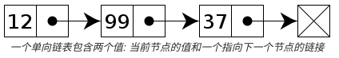

# 链表


<!-- @import "[TOC]" {cmd="toc" depthFrom=1 depthTo=6 orderedList=false} -->
<!-- code_chunk_output -->

* [链表](#链表)
	* [单链表](#单链表)
	* [双链表](#双链表)
	* [参考链接](#参考链接)

<!-- /code_chunk_output -->


[链表（Linked list）](https://zh.wikipedia.org/wiki/%E9%93%BE%E8%A1%A8)是一种常见的基础数据结构，是一种线性表，但是并不会按线性的顺序存储数据，而是在每一个节点里存到下一个节点的指针(Pointer)。由于不必须按顺序存储，链表在插入的时候可以达到O(1)的复杂度，比另一种线性表顺序表快得多，但是查找一个节点或者访问特定编号的节点则需要O(n)的时间，而顺序表相应的时间复杂度分别是O(logn)和O(1)。

## 单链表

链表中最简单的一种是单向链表，它包含两个域，一个信息域和一个指针域。这个链接指向列表中的下一个节点，而最后一个节点则指向一个空值。



下面程序实现了单链表的建立、测长、删除节点、插入节点、节点排序、链表逆置等功能：

```c++
#include <iostream>

using namespace std;

struct node {
  int data;
  node * next = nullptr;
};

class List {
private:
  node * head;
  void createList();

public:
  List() { createList(); }
  int length();
  void printNode();
  void delNode(int number);
  void insertNode(int number);
  void sortNode();
  void reverseNode();
  void removeHead();

  virtual ~List();
};

void List::createList() {
  node * p = nullptr, * s = nullptr;
  int x, cycle = 1;
  head = new node;
  p = head;
  while (cycle) {
    std::cout << "please input the data:" << '\n';
    cin >> x; // please handle exception
    if (x != 0) {
      s = new node;
      s->data = x;
      std::cout << s->data << ',';
      p->next = s;
      p = p->next;
    } else
      cycle = 0;
  }
  node * tmp = head;
  head = head->next;
  delete tmp;
}

int List::length() {
  int n = 0;
  node * p = nullptr;
  p = head;
  while (p != nullptr) {
    p = p->next;
    n++;
  }
  return n;
}

void List::printNode() {
  node * p;
  int n;
  n = length();
  std::cout << "now,these " << n << " records are :" << '\n';
  p = head;
  if (head != nullptr)
    while (p != nullptr) {
      std::cout << p->data << "->";
      p = p->next;
    }
  std::cout << "nullptr" << '\n';
}

void List::delNode(int number) {
  std::cout << "delNode: " << number << '\n';

  if (nullptr==head)
    return;

  node * p1, * p2;
  p1 = head;
  while (number != p1->data && p1->next != NULL) {
    p2 = p1;
    p1 = p1->next;
  }

  if (number == p1->data) {
    if (p1 == head) {
      head = p1->next;
      delete (p1);
    } else {
      p2->next = p1->next;
      delete p1;
    }
  } else
    std::cout << number << " could not been found" << '\n';
  printNode();
}

void List::insertNode(int number) {
  std::cout << "insertNode: " << number << '\n';

  if (head == nullptr) {
    head = new node;
    head->data = number;
    head->next = nullptr;
    return;
  }
  node * p0, * p1, * p2;
  p1 = head;
  p0 = new node;
  p0->data = number;
  while (p0->data > p1->data && p1->next != nullptr) {
    p2 = p1;
    p1 = p1->next;
  }

  if (p0->data <= p1->data) {
    if (head == p1) {
      p0->next = p1;
      head = p0;
    } else {
      p2->next = p0;
      p0->next = p1;
    }
  } else {
    p1->next = p0;
    p0->next = nullptr;
  }
  printNode();
}

void List::sortNode() {
  std::cout << "sortNode:" << '\n';
  node * p;
  int n;
  int tmp;
  n = length();
  if (head == nullptr || head->next == nullptr)
    return;

  for (int j = 1; j < n; j++) {
    p = head;
    for (int i = 0; i < n - j; i++) {
      if (p->data > p->next->data) {
        tmp = p->data;
        p->data = p->next->data;
        p->next->data = tmp;
      }
      p = p->next;
    }
  }
  printNode();
}

void List::reverseNode() {
  std::cout << "reverseNode: " << '\n';
  node * p1, * p2, * p3;

  if (head == nullptr || head->next == nullptr)
    return;

  p1 = head, p2 = p1->next;

  while (p2) {
    p3 = p2->next;
    p2->next = p1;
    p1 = p2;
    p2 = p3;
  }

  head->next = nullptr;
  head = p1;
  printNode();
}

void List::removeHead() {
  if (head == nullptr)
    return;
  node * p;
  p = head;
  head = p->next;
  delete p;
}

List::~List() {
  while (head != nullptr) {
    removeHead();
  }
}

int main(int argc, char const *argv[]) {
  List a;
  a.delNode(3);
  a.insertNode(3);
  a.sortNode();
  a.reverseNode();
  return 0;
}

```

## 双链表

一种更复杂的链表是“双向链表”或“双面链表”。每个节点有两个连接：一个指向前一个节点，（当此“连接”为第一个“连接”时，指向空值或者空列表）；而另一个指向下一个节点，（当此“连接”为最后一个“连接”时，指向空值或者空列表）


下面程序实现了双链表的建立、删除节点、插入节点等功能：

```c++
#include <iostream>

using namespace std;

struct node {
  int data;
  node * prev = nullptr;
  node * next = nullptr;
};

class DoubleList {
private:
  void createDoubleList();
  node * head = nullptr;

public:
  DoubleList() { createDoubleList(); }
  void delNode(int number);
  void insertNode(int number);
  void printNode();
  void removeHead();
  virtual ~DoubleList();
};

void DoubleList::createDoubleList() {
  std::cout << "createDoubleList:" << '\n';
  node * p, * s;
  int x, cycle = 1;
  head = new node;
  p = head;

  while (cycle) {
    std::cout << "please input the data: " << '\n';
    cin >> x;
    if (x != 0) {
      s = new node;
      s->data = x;
      p->next = s;
      s->prev = p;
      p = p->next;
    } else
      cycle = 0;
  }
  node * tmp = head;
  head = head->next;
  head->prev = nullptr;
  p->next = nullptr;
  delete tmp;
  printNode();
}

void DoubleList::delNode(int number) {
  std::cout << "delNode:" << '\n';

  if (nullptr == head) {
    return;
  }

  node * p1;
  p1 = head;
  while (number != p1->data && p1->next != nullptr) {
    p1 = p1->next;
  }

  if (number == p1->data) {
    if (p1 == head) {
      head = head->next;
      if (nullptr != head)
        head->prev = nullptr;
      delete p1;
    } else if (p1->next == nullptr) {
      p1->prev->next = nullptr;
      delete p1;
    } else {
      p1->next->prev = p1->prev;
      p1->prev->next = p1->next;
      delete p1;
    }
  } else
    std::cout << number << " could not been found" << '\n';

  printNode();
}

void DoubleList::insertNode(int number) {
  std::cout << "insertNode:" << '\n';
  if (head == nullptr) {
    head = new node;
    head->data = number;
    head->prev = nullptr;
    head->next = nullptr;
    return;
  }

  node * p0, * p1;
  p1 = head;
  p0 = new node;
  p0->data = number;

  while (p0->data > p1->data && p1->next != nullptr) {
    p1 = p1->next;
  }

  if (p0->data <= p1->data) {
    if (head == p1) {
      p0->next = p1;
      p1->prev = p0;
      head = p0;
    } else {
      p1->prev->next = p0;
      p0->next = p1;
      p0->prev = p1->prev;
      p1->prev = p0;
    }
  } else {
    p1->next = p0;
    p0->prev = p1;
    p0->next = nullptr;
  }
  printNode();
}

void DoubleList::printNode() {
  node * p;
  p = head;
  if (head != nullptr)
    while (p != nullptr) {
      std::cout << p->data << "->";
      p = p->next;
    }
  std::cout << "nullptr" << '\n';
}

void DoubleList::removeHead() {
  if (nullptr == head)
    return;
  node * p;
  p = head;
  head = p->next;
  delete p;
}

DoubleList::~DoubleList() {
  while (head != nullptr) {
    removeHead();
  }
}

int main(int argc, char const *argv[]) {
  DoubleList a;
  a.delNode(3);
  a.insertNode(3);

  return 0;
}
```


## 参考链接

[链表 wikipedia](https://zh.wikipedia.org/wiki/%E9%93%BE%E8%A1%A8)

[上一级](README.md)
[上一篇](inner_class.md)
[下一篇](log4cplus.md)
