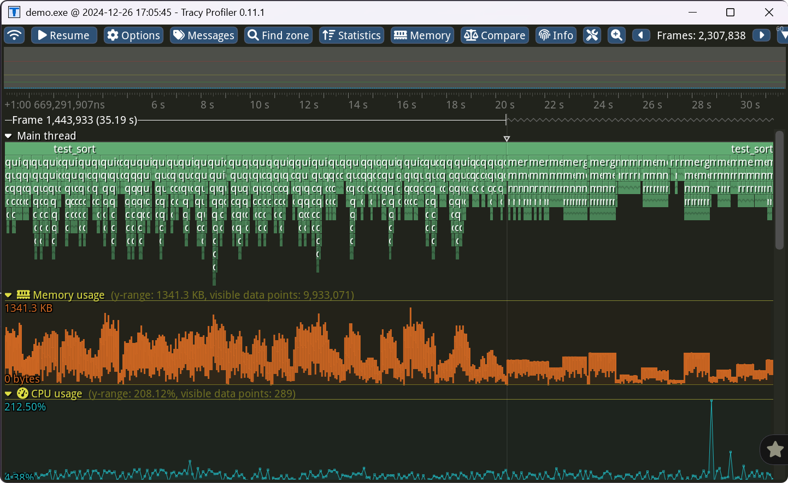

<!-- 使用 tracy 工具做性能分析 -->

# Tracy 简介

[Tracy](https://github.com/wolfpld/tracy) 是一款实时、纳秒级分辨率的混合帧和采样剖析器，可用于远程或嵌入式遥测游戏和其他应用程序。它可以对 CPU（C、C++11、Lua）、GPU（OpenGL、Vulkan、Direct3D 11/12、OpenCL）和内存进行剖析。它还能监控线程所持有的锁，并显示竞争发生的位置。Tracy 可以像其他统计分析工具（如 VTune、perf 或 Very Sleepy）一样，对取样的调用堆栈数据进行统计分析，但它主要侧重于对源代码进行手动标记，以便逐帧检查程序的执行情况。你将能清楚地看到哪些函数被调用，在这些函数中花费了多少时间，以及它们在多线程环境中是如何相互影响的。相比之下，统计分析可能会让你看到代码中的hot spots，但却无法准确找出每隔几秒就会出现的半随机帧卡顿的根本原因。尽管 Tracy 以帧剖析为目标，重点分析实时应用程序（如游戏）中的帧时间，但它也适用于不使用帧概念的实用程序

github上也提供了详细的文档说明，也有一个[在线demo](https://tracy.nereid.pl/) 可预览该程序的功能

# 一个简单的 demo

备注：这里使用的 版本为 0.11.1

CMakeLists.txt:

```cmake
cmake_minimum_required(VERSION 3.10)

project(demo)

set(THREADS_PREFER_PTHREAD_FLAG ON)
find_package(Threads REQUIRED)

add_executable(demo main.cpp)

add_library(TracyClient STATIC ../../public/TracyClient.cpp
        ../../public/tracy/Tracy.hpp)
target_include_directories(TracyClient PUBLIC ../../public/tracy)
target_compile_definitions(TracyClient PUBLIC TRACY_ENABLE=1)
target_compile_definitions(TracyClient PUBLIC TRACY_VERBOSE=1)

target_link_libraries(demo PUBLIC  TracyClient ${CMAKE_DL_LIBS} Threads::Threads)
```

main.cpp

```c++
// show call stack infomation
#define TRACY_CALLSTACK


#include <Tracy.hpp>
#include <algorithm>
#include <cassert>
#include <functional>
#include <iostream>
#include <random>
#include <vector>


using namespace std;
const int TRACY_MAX_CALLSTACK_DEPTH = 3;

// show memory profiling , begin
void * operator new(std::size_t count) {
    auto ptr = malloc(count);
    TracyAllocS(ptr, count,TRACY_MAX_CALLSTACK_DEPTH);
    return ptr;
}

void operator delete(void * ptr) noexcept {
    TracyFreeS(ptr,TRACY_MAX_CALLSTACK_DEPTH);
    free(ptr);
}
// show memory profiling , end

int partition( vector<int>& arr, int low, int high )
{
    ZoneScopedS(TRACY_MAX_CALLSTACK_DEPTH);
    int pivot = arr[high];
    int i = low - 1;
    for( int j = low; j < high; j++ )
    {
        if( arr[j] < pivot )
        {
            i++;
            swap( arr[i], arr[j] );
        }
    }
    swap( arr[i + 1], arr[high] );
    return i + 1;
}

void printSortInfo( const std::string& sortName, vector<int>& pre, vector<int>& after )
{
    ZoneScopedS(TRACY_MAX_CALLSTACK_DEPTH);
    auto printInfo = []( const std::string& sortName, vector<int>& arr )
    {
        std::cout << sortName.c_str() << " [ ";
        //        for( int i = 0; i < arr.size(); i++ )
        //        {
        //            cout << arr[i] << ",";
        //        }

        std::cout << " ] " << std::endl;
    };
    printInfo( sortName + " before", pre );
    printInfo( sortName + " after", after );
}

void quick_sort( vector<int>& arr, int low, int high )
{
    ZoneScopedS(TRACY_MAX_CALLSTACK_DEPTH);
    auto before = arr;
    if( low < high )
    {
        int pivot_index = partition( arr, low, high );
        quick_sort( arr, low, pivot_index - 1 );
        quick_sort( arr, pivot_index + 1, high );
    }
    printSortInfo( "quick_sort", before, arr );
}

void merge( vector<int>& arr, int low, int mid, int high )
{
    ZoneScopedS(TRACY_MAX_CALLSTACK_DEPTH);
    vector<int> temp( high - low + 1 );
    int i = low;
    int j = mid + 1;
    int k = 0;
    while( i <= mid && j <= high )
    {
        if( arr[i] < arr[j] )
        {
            temp[k++] = arr[i++];
        }
        else
        {
            temp[k++] = arr[j++];
        }
    }
    while( i <= mid )
    {
        temp[k++] = arr[i++];
    }
    while( j <= high )
    {
        temp[k++] = arr[j++];
    }
    for( int l = 0; l < temp.size(); l++ )
    {
        arr[low + l] = temp[l];
    }
}

void merge_sort( vector<int>& arr, int low, int high )
{
    ZoneScopedS(TRACY_MAX_CALLSTACK_DEPTH);
    vector<int> beforeArr = arr;
    if( low < high )
    {
        int mid = low + ( high - low ) / 2;
        FrameMark;
        merge_sort( arr, low, mid );
        FrameMark;
        merge_sort( arr, mid + 1, high );
        FrameMark;
        merge( arr, low, mid, high );
    }
    printSortInfo( "merge_sort", beforeArr, arr );
}

void test_sort( std::function<void( vector<int>&, int, int )> sort_func, int size, int max_val )
{
    ZoneScopedS(TRACY_MAX_CALLSTACK_DEPTH);
    random_device rd;
    mt19937 gen( rd() );
    uniform_int_distribution<int> dis( 0, max_val );
    for( int i = 0; i < size; i++ )
    {
        vector<int> arr( dis( gen ) );
        for( int j = 0; j < arr.size(); j++ )
        {
            arr[j] = dis( gen );
        }
        sort_func( arr, 0, arr.size() - 1 );
        assert( is_sorted( arr.begin(), arr.end() ) );
    }
}

int main( int argc, char** argv )
{
    // give me test code ,test quick sort and merge sort
    while( true )
    {
        TracyMessageS("quick sort",20,TRACY_MAX_CALLSTACK_DEPTH);
        test_sort( quick_sort, 100, 10000 );
        FrameMark;
        TracyMessageS("begin merge sort",50,TRACY_MAX_CALLSTACK_DEPTH);
        test_sort( merge_sort, 100, 10000 );
        FrameMark;
    }

    return 0;
}

```


使用配套的profiler 即可远程显示信息



---


- [上一级](README.md)
- 上一篇 -> [以stream完成I/O](stream_IO.md)
- 下一篇 -> [在使用晚绑定的时候，要注意对基类的析构函数加virtual](vir_del.md)
