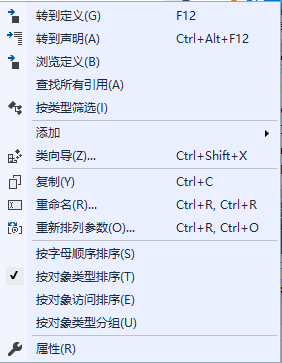

<!-- VC++ 学习 -->


<!-- @import "[TOC]" {cmd="toc" depthFrom=1 depthTo=6 orderedList=false} -->
<!-- code_chunk_output -->

- [Windows 程序内部运行机制](#windows-程序内部运行机制)
  - [句柄](#句柄)
  - [消息与消息队列](#消息与消息队列)
    - [消息](#消息)
    - [消息队列](#消息队列)
    - [进队和不进队消息](#进队和不进队消息)
  - [WinMain 函数](#winmain-函数)
    - [窗口的创建](#窗口的创建)
    - [消息循环](#消息循环)
    - [编写窗口过程函数](#编写窗口过程函数)
  - [动手写第一个 windows 程序](#动手写第一个-windows-程序)
  - [匈牙利表示法](#匈牙利表示法)
- [MFC 框架程序剖析](#mfc-框架程序剖析)
  - [MFC AppWizard](#mfc-appwizard)
  - [添加一个 button 示例](#添加一个-button-示例)

<!-- /code_chunk_output -->

## Windows 程序内部运行机制

### 句柄

[句柄 wikipedia](https://zh.wikipedia.org/wiki/%E5%8F%A5%E6%9F%84)

在 windows 程序中，有各种各样的资源（窗口、图表、光标等），系统在创建这些资源时会为它们分配内存，并返回标识这些资源的标识号，即句柄。

### 消息与消息队列

#### 消息

在 windows 中，不仅用户程序可以调用系统的 API 函数，反过来，系统也会调用用户程序，这个调用时通过消息来进行的。

windows 程序设计时一种完全不同于传统的 DOS 方式的程序设计方法。它是一种事件驱动方式的程序设计模式，主要是基于消息的。例如，当用户在窗口中画图的时候，按下鼠标左键，此时，操作系统会感知这一事件，于是将这个事件包装成一个消息，投递到应用程序的消息队列中，然后应用程序从消息队列中取出消息并响应。在这个处理过程中，操作系统也会给应用程序 “发送消息”。所谓 “发送消息”，实际上是操作系统调用程序中一个专门负责处理消息的函数，这个函数称为窗口过程。

[MSG structure](https://msdn.microsoft.com/en-us/library/windows/desktop/ms644958(v=vs.85).aspx)

#### 消息队列

每一个 windows 程序开始执行后，系统都会为该程序创建一个消息队列，这个消息队列用来存放该程序创建的窗口的消息。例如，当我们按下鼠标左键的时候，将会产生 WM_LBUTTONDOWN 消息，，系统会将这个消息放到窗口所属的应用程序的消息队列中，等待应用程序的处理。 Windows 将产生的消息依次放到消息队列中，而应用程序则通过一个消息循环不断地从消息队列中取出消息，并进行响应。这种消息机制，就是 windows 程序运行的机制。

#### 进队和不进队消息

windows 程序中的消息可以分为 “进队消息” 和 “不进队消息”。
* 进队消息将由系统放入到应用程序的消息队列中，然后由应用程序取出并发送。
* 不进队消息在系统调用窗口过程时直接发送个窗口。

不管是进队消息还是不进队消息，最终都由系统调用窗口过程函数对消息进行处理。


### WinMain 函数

该函数是 windows 应用程序的基础。当 windows 操作系统启动一个程序时，它调用的就是该程序的 WinMain 函数（实际是由插入到可执行文件中启动代码调用的）。 WinMain 是 windows 程序的入口点函数，与 DOS 程序的入口点函数 main 的作用相同，当 WinMain 函数结束或返回时， windows 应用程序结束。

下面，让我们来看一个完整的 win32 程序，该程序实现的功能时创建一个窗口，并在该窗口中响应键盘及鼠标消息，程序实现的步骤为：
* WinMain 函数的定义
* 创建一个窗口
* 进行消息循环
* 编写窗口过程函数

[WinMain entry point](https://msdn.microsoft.com/en-us/library/windows/desktop/ms633559(v=vs.85).aspx)

#### 窗口的创建

[WNDCLASS structure](https://msdn.microsoft.com/en-us/library/windows/desktop/ms633576(v=vs.85).aspx)

[RegisterClass function](https://msdn.microsoft.com/en-us/library/windows/desktop/ms633586(v=vs.85).aspx)

[CreateWindow function](https://msdn.microsoft.com/en-us/library/windows/desktop/ms632679(v=vs.85).aspx)

[ShowWindow function](https://msdn.microsoft.com/en-us/library/windows/desktop/ms633548(v=vs.85).aspx)

#### 消息循环

[GetMessage function](https://msdn.microsoft.com/en-us/library/windows/desktop/ms644936(v=vs.85).aspx)

[TranslateMessage function](https://msdn.microsoft.com/en-us/library/windows/desktop/ms644955(v=vs.85).aspx)

[DispatchMessage function](https://msdn.microsoft.com/en-us/library/windows/desktop/ms644934(v=vs.85).aspx)

windows 应用程序的消息处理机制：


* 操作系统接收到应用程序的窗口消息，将消息投递到该应用程序的消息队列中
* 应用程序在消息循环中调用 GetMessage 函数从消息队列中取出一条一条的消息。取出消息后，应用程序可以队消息进行一些预处理，例如，放弃对某些消息的响应，或者调用 TranslateMessage 产生新的消息
* 应用程序调用 DispatchMessage ，将消息回传给操作系统。消息是由 MSG 结构体对象来表示的，其中就包含了接收消息的窗口的句柄。因此，DispatchMessage 函数总能进行正确的传递。
* 系统利用 WNDCLASS 结构体中的 lpfnWndProc 成员保存的窗口过程函数的指针调用窗口过程，队消息进行处理（即“系统给应用程序发送了消息”）。


#### 编写窗口过程函数

[WindowProc callback function](https://msdn.microsoft.com/en-us/library/windows/desktop/ms633573(v=vs.85).aspx)

### 动手写第一个 windows 程序

在 visual studio 中创建一个空项目：

winMain.cpp:

```c++
#include <windows.h>
#include <iostream>

LRESULT CALLBACK WinProc
(
	HWND hwnd, //handle to window
	UINT uMsg, // message identifier
	WPARAM wParam, //first message parameter
	LPARAM lParam // second message parameter
);


int WINAPI WinMain(
	HINSTANCE hInstance, //handle to current instance
	HINSTANCE hPrevInstatance, //handle to previous instance
	LPSTR lpCmdLine, //command line
	int nCmdShow //show state
)
{
	WNDCLASS wndcls;
	wndcls.cbClsExtra = 0;
	wndcls.cbWndExtra = 0;
	wndcls.hbrBackground = (HBRUSH)GetStockObject(BLACK_BRUSH);
	wndcls.hCursor = LoadCursor(NULL, IDC_CROSS);
	wndcls.hIcon = LoadIcon(NULL, IDC_CROSS);
	wndcls.hInstance = hInstance;
	wndcls.lpfnWndProc = WinProc;
	wndcls.lpszClassName = "hello2018";
	wndcls.lpszMenuName = NULL;
	wndcls.style = CS_HREDRAW | CS_VREDRAW;
	RegisterClass(&wndcls);

	HWND hwnd;
	hwnd = CreateWindow("hello2018", "this is test window", WS_OVERLAPPEDWINDOW, 0, 0, 600, 400, NULL, NULL, hInstance, NULL);

	ShowWindow(hwnd, SW_SHOWNORMAL);
	UpdateWindow(hwnd);

	MSG msg;
	BOOL bRet;
	while (bRet=GetMessage(&msg, NULL, 0, 0))
	{
		if (bRet == -1)
		{
			return -1;
		}
		else
		{
			TranslateMessage(&msg);
			DispatchMessage(&msg);
		}

	}
	return msg.wParam;
}

LRESULT CALLBACK WinProc
(
	HWND hwnd, //handle to window
	UINT uMsg, // message identifier
	WPARAM wParam, //first message parameter
	LPARAM lParam // second message parameter
)
{
	switch (uMsg)
	{
	case WM_CHAR:
		char szChar[20];
		std::cout << szChar << "char code is " << wParam;
		MessageBox(hwnd, szChar, "char", 0);
		break;
	case WM_LBUTTONDOWN:
		MessageBox(hwnd, "mouse clicked", "message", 0);
		HDC hdc;
		hdc = GetDC(hwnd);
		TextOut(hdc, 0, 50, "helloworld", strlen("helloworld"));
		ReleaseDC(hwnd, hdc);
		break;
	case WM_PAINT:
		HDC hDc;
		PAINTSTRUCT ps;
		hDc = BeginPaint(hwnd, &ps);
		TextOut(hDc, 0, 50, "helloworld", strlen("helloworld"));
		EndPaint(hwnd, &ps);
		ReleaseDC(hwnd, hDc);

	case WM_CLOSE:
		if (IDYES == MessageBox(hwnd, "exit?", "message", MB_YESNO))
		{
			DestroyWindow(hwnd);
		}
		break;

	case WM_DESTROY:
		PostQuitMessage(0);
		break;
	default:
		return DefWindowProc(hwnd, uMsg, wParam, lParam);

	}
	return 0;
}
```

```highlight
Run it:
```


### 匈牙利表示法

| 前缀  | 含义                             |
|-------|----------------------------------|
|  a    | 数组                             |
| b     | 布尔值(int)                      |
| by    | 无符号字符（字节）               |
| c     | 字符（字节）                     |
| cb    | 字节计数                         |
| rgb   | 保存 RGB 颜色的长整型            |
| cx,cy | 短整形（计算x，y的长度）         |
| dw    | 无符号长整形                     |
| fn    | 函数                             |
| h     | 句柄                             |
| i     | 整数（integer）                  |
| m_    | 类的数据成员                     |
| n     | 短整形或整形                     |
| np    | 近指针                           |
| p     | 指针                             |
| l     | 长整形                           |
| lp    | 长指针                           |
| s     | 字符串                           |
| sz    | 以零结束的字符串                 |
| tm    | 正文大小                         |
| w     | 无符号整形                       |
| x，y  | 无符号整形（表示 x 或 y 的坐标） |

## MFC 框架程序剖析

### MFC AppWizard

MFC AppWizard 是一个辅助我们生成源代码的向导工具，它可以帮助我们自动生成基于 MFC框架的源代码。该向导的每一个步骤，我们都可以根据需要来选择各种特性，从而实现定制应用程序。

在这，我们创建一个基于 MFC的单文档界面应用程序。


Run it：


MFC 程序的运行过程：
* 首先利用全局应用程序对象 theApp 启动应用程序。正是产生了这个全局对象，基类 CWinApp 中的 this 指针才能指向这个对象。如果没有这个全局对象，程序在编译时不会出错，但在运行时就会出错。
* 调用全局应用程序对象的构造函数，从而就会先调用其基类 CWinApp 的构造函数。后者完成应用程序的一些初始化工作，并将应用程序对象的指针保存起来。
* 进入 winMain 函数。在 AfxWinMain 函数中可以获取子类 （对 Test 程序来说，就是 CTestApp类）的指针，利用此指针调用虚函数： InitInstance ,根据多态性原理，实际上调用的是子类 (CTestApp类) 的 InitInstance 函数。后者完成应用程序的一些初始化工作，包括窗口类的注册、创建、窗口的显示和更新。期间会多次调用 CreateEx 函数，因为一个单文档 MFC 应用程序有多个窗口，包括框架窗口、工具条、状态条等。
* 进入消息循环。虽然也设置了默认的窗口过程函数，但是，MFC 应用程序实际上是采用消息映射机制来处理各种消息的。当收到 WM_QUIT 消息时，退出消息循环，程序结束。

[MFC消息映射机制详解](https://blog.csdn.net/ocean2006/article/details/5498265)

消息映射示例：

```c++
BEGIN_MESSAGE_MAP(CTestApp, CWinAppEx)
	ON_COMMAND(ID_APP_ABOUT, &CTestApp::OnAppAbout)
	// 基于文件的标准文档命令
	ON_COMMAND(ID_FILE_NEW, &CWinAppEx::OnFileNew)
	ON_COMMAND(ID_FILE_OPEN, &CWinAppEx::OnFileOpen)
	// 标准打印设置命令
	ON_COMMAND(ID_FILE_PRINT_SETUP, &CWinAppEx::OnFilePrintSetup)
END_MESSAGE_MAP()
```

### 添加一个 button 示例

为 TestView 类添加消息处理函数：

在 visual studio 右侧切换到类视图，指向 TestView 类并右键：




选中 类向导：


在 TestView.h 中添加：
```c++
private:
	CButton m_btn;
```
在 TestView.cpp 中的 OnCreate 函数 中添加：
```c++
m_btn.Create(_T("按钮"), WS_CHILD | BS_DEFPUSHBUTTON | WS_VISIBLE, CRect(200, 200, 300, 300), GetParent(), 123);
```

[CRect Class](https://msdn.microsoft.com/en-us/library/h58f4c7y.aspx)

Run it:


参考链接：
* 《VC ++ 深入详解》


---
- [上一级](README.md)
- 上一篇 -> [在使用晚绑定的时候，要注意对基类的析构函数加virtual](vir_del.md)
- 下一篇 -> [c++ Web 编程](webProgramming.md)
