<!-- c++ Web 编程 -->


<!-- @import "[TOC]" {cmd="toc" depthFrom=1 depthTo=6 orderedList=false} -->
<!-- code_chunk_output -->

- [CGI（通用网关接口）](#cgi通用网关接口)
- [网页浏览](#网页浏览)
- [CGI 架构图](#cgi-架构图)
- [安装 Web 服务器](#安装-web-服务器)
- [Web 服务器配置](#web-服务器配置)
- [helloWorld CGI](#helloworld-cgi)
- [HTTP/HTTPS 协议](#httphttps-协议)
  - [请求方法](#请求方法)
- [CGI 环境变量](#cgi-环境变量)
  - [列出所有的CGI变量](#列出所有的cgi变量)
- [C ++ CGI库](#c-cgi库)
  - [简单的 FORM 例子](#简单的-form-例子)
    - [GET Method](#get-method)
    - [POST Method](#post-method)
    - [将复选框数据传递给CGI程序](#将复选框数据传递给cgi程序)
    - [将单选按钮数据传递给CGI程序](#将单选按钮数据传递给cgi程序)
    - [将文本区域数据传递给CGI程序](#将文本区域数据传递给cgi程序)
    - [将下拉框数据传递给CGI程序](#将下拉框数据传递给cgi程序)
    - [在CGI中使用Cookie](#在cgi中使用cookie)
    - [设置Cookie](#设置cookie)
    - [检索Cookies](#检索cookies)
    - [文件上传示例](#文件上传示例)

<!-- /code_chunk_output -->

## CGI（通用网关接口）

[通用网关接口 wikipedia](https://zh.wikipedia.org/wiki/%E9%80%9A%E7%94%A8%E7%BD%91%E5%85%B3%E6%8E%A5%E5%8F%A3)

通用网关接口（CGI）是一组定义如何在 Web 服务器和自定义脚本之间交换信息的标准。

CGI规范目前由NCSA维护，NCSA对CGI的定义：
* 通用网关接口（即CGI）是外部网关程序与HTTP服务器等信息服务器连接的标准。

## 网页浏览

为了理解CGI的概念，让我们看看当我们点击一​​个超链接来浏览特定的网页或URL时会发生什么。

* 您的浏览器联系HTTP Web服务器并要求输入URL即。文件名。

* Web服务器将解析URL并查找文件名。如果它找到请求的文件，则Web服务器将该文件发送回浏览器，否则会发送一条错误消息，指示您请求了错误的文件。

* Web浏览器从Web服务器获取响应，并根据收到的响应显示接收到的文件或错误消息。

但是，有可能以这样的方式设置HTTP服务器，即每当请求某个目录中的文件时，该文件不被发回; 而是作为一个程序执行，并从程序生成的输出被发送回您的浏览器进行显示。

通用网关接口（CGI）是一种标准协议，用于使应用程序（称为CGI程序或CGI脚本）与Web服务器和客户端进行交互。这些CGI程序可以用Python，Perl，Shell，C或C ++等编程语言。

Web 服务器以两种不同的方式向客户端提供内容：
* 取一个磁盘文件，并将它的内容返回给客户端。磁盘文件称为 静态内容，而返回文件给客户端的过程称为 ```服务静态内容```.
* 运行一个可执行文件，并将它的输出返回给客户端。运行时可执行文件产生的输出称为动态内容，而运行程序并返回它的输出到客户端的过程称为 ```服务动态内容```。

## CGI 架构图

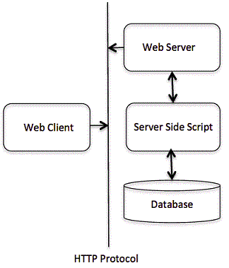

## 安装 Web 服务器

Web 服务器可以选择 Apache,nginx 等，我这里安装 Apache：
```sh
dnf install httpd
```

start Apache:
```sh
sudo systemctl start httpd
```

[How to Install Apache on Fedora 21](https://www.liquidweb.com/kb/how-to-install-apache-on-fedora-21/)


## Web 服务器配置
在继续进行CGI编程之前，请确保您的Web服务器支持CGI并将其配置为处理CGI程序。所有由HTTP服务器执行的CGI程序都保存在预先配置的目录中。这个目录被称为CGI目录，按照惯例它被命名为/ var / www / cgi-bin。按照惯例CGI文件的扩展名为.cgi，尽管它们是C ++ 可执行文件。

默认情况下，Apache Web Server被配置为在 /var/www/cgi-bin中运行CGI程序。如果您想要指定任何其他目录来运行您的CGI脚本，您可以修改 /etc/httpd/confhttpd.conf 文件。

## helloWorld CGI

```c++
#include <iostream>
using namespace std;

int main () {
   cout << "Content-type:text/html\r\n\r\n";
   cout << "<html>\n";
   cout << "<head>\n";
   cout << "<title>Hello World - First CGI Program</title>\n";
   cout << "</head>\n";
   cout << "<body>\n";
   cout << "<h2>Hello World! This is my first CGI program</h2>\n";
   cout << "</body>\n";
   cout << "</html>\n";

   return 0;
}
```

```sh
sudo g++ helloWorld.cpp -o /var/www/cgi-bin/helloWorld.cgi
# 确保 CGI 程序是可执行文件
# chmod 755 helloWorld.cgi
```

在浏览器地址栏输入：
```url
http://127.0.0.1/cgi-bin/helloWorld.cgi
```

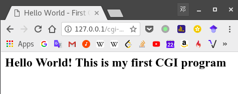

## HTTP/HTTPS 协议

[超文本传输协议 wikipedia](https://zh.wikipedia.org/wiki/%E8%B6%85%E6%96%87%E6%9C%AC%E4%BC%A0%E8%BE%93%E5%8D%8F%E8%AE%AE)

[超文本传输安全协议 wikipedia](https://zh.wikipedia.org/wiki/%E8%B6%85%E6%96%87%E6%9C%AC%E4%BC%A0%E8%BE%93%E5%AE%89%E5%85%A8%E5%8D%8F%E8%AE%AE)

[传输层安全性协议(TLS) wikipedia](https://zh.wikipedia.org/wiki/%E5%82%B3%E8%BC%B8%E5%B1%A4%E5%AE%89%E5%85%A8%E6%80%A7%E5%8D%94%E5%AE%9A)

超文本传输协议（英文：HyperText Transfer Protocol，缩写：HTTP）是一种用于分布式、协作式和超媒体信息系统的应用层协议[1]。HTTP是万维网的数据通信的基础。

超文本传输安全协议（英语：Hypertext Transfer Protocol Secure，缩写：HTTPS，常称为HTTP over TLS，HTTP over SSL或HTTP Secure）是一种通过计算机网络进行安全通信的传输协议。HTTPS经由HTTP进行通信，但利用SSL/TLS来加密数据包。HTTPS开发的主要目的，是提供对网站服务器的身份认证，保护交换数据的隐私与完整性。这个协议由网景公司（Netscape）在1994年首次提出，随后扩展到互联网上。

### 请求方法

* GET:
向指定的资源发出“显示”请求。使用GET方法应该只用在读取数据，而不应当被用于产生“副作用”的操作中，例如在Web Application中。其中一个原因是GET可能会被网络蜘蛛等随意访问。
* HEAD:
与GET方法一样，都是向服务器发出指定资源的请求。只不过服务器将不传回资源的本文部分。它的好处在于，使用这个方法可以在不必传输全部内容的情况下，就可以获取其中“关于该资源的信息”（元信息或称元数据）。
* POST:
向指定资源提交数据，请求服务器进行处理（例如提交表单或者上传文件）。数据被包含在请求本文中。这个请求可能会创建新的资源或修改现有资源，或二者皆有。
* PUT:
向指定资源位置上传其最新内容。
* DELETE:
请求服务器删除Request-URI所标识的资源。
* TRACE:
回显服务器收到的请求，主要用于测试或诊断。
* OPTIONS:
这个方法可使服务器传回该资源所支持的所有HTTP请求方法。用 '\*' 来代替资源名称，向Web服务器发送OPTIONS请求，可以测试服务器功能是否正常运作。
* CONNECT:
HTTP/1.1协议中预留给能够将连接改为管道方式的代理服务器。通常用于SSL加密服务器的链接（经由非加密的HTTP代理服务器）。


方法名称是区分大小写的。当某个请求所针对的资源不支持对应的请求方法的时候，服务器应当返回状态码405（Method Not Allowed），当服务器不认识或者不支持对应的请求方法的时候，应当返回状态码501（Not Implemented）。

HTTP服务器至少应该实现GET和HEAD方法，其他方法都是可选的。

## CGI 环境变量

所有的CGI程序都可以访问下列环境变量。这些变量在编写任何CGI程序时发挥重要作用。

| CONTENT_TYPE    | 内容的数据类型，在客户端将附加内容发送到服务器时使用。例如文件上传等                |
|-----------------|-------------------------------------------------------------------------------------|
| CONTENT_LENGTH  | 查询信息的长度仅适用于POST请求                                                      |
| HTTP_COOKIE     | 以键值对的形式返回设置的cookie                                                      |
| HTTP_USER_AGENT | 用户代理请求标题字段包含关于发起请求的用户代理的信息。它是Web浏览器的名称           |
| PATH_INFO       | CGI脚本的路径                                                                       |
| QUERY_STRING    | 通过GET方法请求发送的URL编码信息                                                    |
| REMOTE_ADDR     | 发出请求的远程主机的IP地址。这对于日志记录或验证目的可能很有用                      |
| REMOTE_HOST     | 发出请求的主机的完全限定名称。如果这个信息不可用，那么REMOTE_ADDR可以用来获得IR地址 |
| REQUEST_METHOD  | 用于提出请求的方法。最常用的方法是GET和POST                                         |
| SCRIPT_FILENAME | CGI脚本的完整路径                                                                   |
| SCRIPT_NAME     | CGI脚本的名称                                                                       |
| SERVER_NAME     | 服务器的主机名或IP地址                                                              |
| SERVER_SOFTWARE | 服务器运行的软件的名称和版本                                                        |

### 列出所有的CGI变量

```c++
#include <iostream>
#include <stdlib.h>
using namespace std;

const string ENV[24] = {"COMSPEC",
                        "DOCUMENT_ROOT",
                        "GATEWAY_INTERFACE",
                        "HTTP_ACCEPT",
                        "HTTP_ACCEPT_ENCODING",
                        "HTTP_ACCEPT_LANGUAGE",
                        "HTTP_CONNECTION",
                        "HTTP_HOST",
                        "HTTP_USER_AGENT",
                        "PATH",
                        "QUERY_STRING",
                        "REMOTE_ADDR",
                        "REMOTE_PORT",
                        "REQUEST_METHOD",
                        "REQUEST_URI",
                        "SCRIPT_FILENAME",
                        "SCRIPT_NAME",
                        "SERVER_ADDR",
                        "SERVER_ADMIN",
                        "SERVER_NAME",
                        "SERVER_PORT",
                        "SERVER_PROTOCOL",
                        "SERVER_SIGNATURE",
                        "SERVER_SOFTWARE"};

int main() {
  cout << "Content-type:text/html\r\n\r\n";
  cout << "<html>\n";
  cout << "<head>\n";
  cout << "<title>CGI Environment Variables</title>\n";
  cout << "</head>\n";
  cout << "<body>\n";
  cout << "<table border = \"0\" cellspacing = \"2\">";

  for (int i = 0; i < 24; i++) {
    cout << "<tr><td>" << ENV[i] << "</td><td>";

    // attempt to retrieve value of environment variable
    char * value = getenv(ENV[i].c_str());
    if (value != 0) {
      cout << value;
    } else {
      cout << "Environment variable does not exist.";
    }
    cout << "</td></tr>\n";
  }

  cout << "</table><\n";
  cout << "</body>\n";
  cout << "</html>\n";

  return 0;
}
```

Run it:

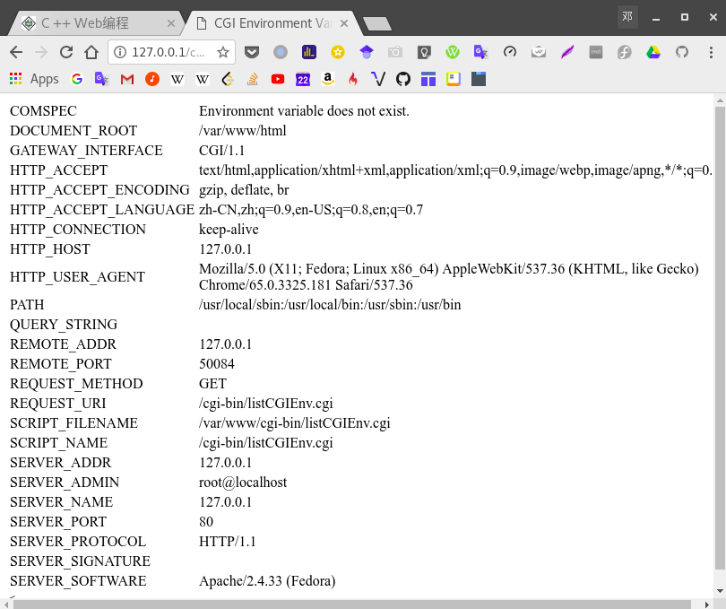

## C ++ CGI库

对于真实的例子，你需要通过你的CGI程序进行很多操作。有一个为C ++程序编写的CGI库

[下载 cgicc ](http://ftp.gnu.org/gnu/cgicc/)

编译安装：
```sh
$tar xzf cgicc-X.X.X.tar.gz
$cd cgicc-X.X.X/
$./configure --prefix=/usr
$make
$make install
```

[cgicc Documentation](https://www.gnu.org/software/cgicc/doc/index.html)


### 简单的 FORM 例子

cpp_get.cpp:

```c++
#include <iostream>
#include <stdio.h>
#include <stdlib.h>
#include <string>
#include <vector>

#include <cgicc/CgiDefs.h>
#include <cgicc/Cgicc.h>
#include <cgicc/HTMLClasses.h>
#include <cgicc/HTTPHTMLHeader.h>

using namespace std;
using namespace cgicc;

int main() {
  Cgicc formData;

  cout << "Content-type:text/html\r\n\r\n";
  cout << "<html>\n";
  cout << "<head>\n";
  cout << "<title>Using GET and POST Methods</title>\n";
  cout << "</head>\n";
  cout << "<body>\n";

  form_iterator fi = formData.getElement("first_name");
  if (!fi->isEmpty() && fi != (*formData).end()) {
    cout << "First name: " << ** fi << endl;
  } else {
    cout << "No text entered for first name" << endl;
  }

  cout << "<br/>\n";
  fi = formData.getElement("last_name");
  if (!fi->isEmpty() && fi != (*formData).end()) {
    cout << "Last name: " << ** fi << endl;
  } else {
    cout << "No text entered for last name" << endl;
  }

  cout << "<br/>\n";
  cout << "</body>\n";
  cout << "</html>\n";

  return 0;
}
```

```sh
g++ get.cpp -lcgicc -o cpp_get.cgi
```

#### GET Method

1. create html file:
```html
<form action = "/cgi-bin/cpp_get.cgi" method = "get">
   First Name: <input type = "text" name = "first_name">  <br />

   Last Name: <input type = "text" name = "last_name" />
   <input type = "submit" value = "Submit" />
</form>
```

2. copy the html file to ```/var/www/html```

3. 在浏览器上输入相应的 URL

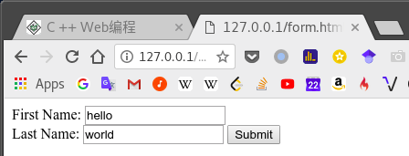

4. Submit

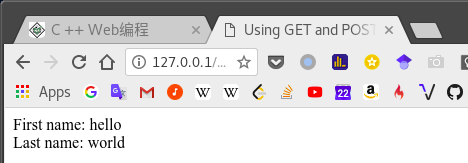

#### POST Method

通常更可靠的将信息传递给CGI程序的方法是POST方法。这与使用GET方法完全相同的方式打包信息，但不是将它作为文本字符串发送后，在URL中将其作为单独的消息发送。此消息以标准输入的形式进入CGI脚本。

html code:
```html
<form action = "/cgi-bin/cpp_get.cgi" method = "post">
   First Name: <input type = "text" name = "first_name"><br />
   Last Name: <input type = "text" name = "last_name" />

   <input type = "submit" value = "Submit" />
</form>
```

显示结果同上

#### 将复选框数据传递给CGI程序

html code :
```html
<form action = "/cgi-bin/cpp_checkbox.cgi" method = "POST" target = "_blank">
   <input type = "checkbox" name = "maths" value = "on" /> Maths
   <input type = "checkbox" name = "physics" value = "on" /> Physics
   <input type = "submit" value = "Select Subject" />
</form>
```

c++ cgi:
```c++
#include <iostream>
#include <vector>  
#include <string>  
#include <stdio.h>  
#include <stdlib.h>

#include <cgicc/CgiDefs.h>
#include <cgicc/Cgicc.h>
#include <cgicc/HTTPHTMLHeader.h>
#include <cgicc/HTMLClasses.h>

using namespace std;
using namespace cgicc;

int main () {
   Cgicc formData;
   bool maths_flag, physics_flag;

   cout << "Content-type:text/html\r\n\r\n";
   cout << "<html>\n";
   cout << "<head>\n";
   cout << "<title>Checkbox Data to CGI</title>\n";
   cout << "</head>\n";
   cout << "<body>\n";

   maths_flag = formData.queryCheckbox("maths");
   if( maths_flag ) {  
      cout << "Maths Flag: ON " << endl;  
   } else {
      cout << "Maths Flag: OFF " << endl;  
   }
   cout << "<br/>\n";

   physics_flag = formData.queryCheckbox("physics");
   if( physics_flag ) {  
      cout << "Physics Flag: ON " << endl;  
   } else {
      cout << "Physics Flag: OFF " << endl;  
   }

   cout << "<br/>\n";
   cout << "</body>\n";
   cout << "</html>\n";

   return 0;
}
```

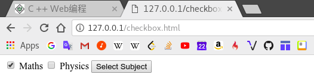

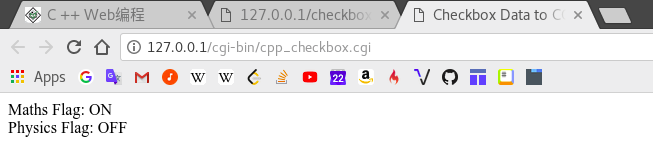

#### 将单选按钮数据传递给CGI程序

html code:
```html
<form action = "/cgi-bin/cpp_radiobutton.cgi" method = "post" target = "_blank">
   <input type = "radio" name = "subject" value = "maths" checked = "checked"/> Maths
   <input type = "radio" name = "subject" value = "physics" /> Physics
   <input type = "submit" value = "Select Subject" />
</form>
```

```c++
#include <iostream>
#include <vector>  
#include <string>  
#include <stdio.h>  
#include <stdlib.h>

#include <cgicc/CgiDefs.h>
#include <cgicc/Cgicc.h>
#include <cgicc/HTTPHTMLHeader.h>
#include <cgicc/HTMLClasses.h>

using namespace std;
using namespace cgicc;

int main () {
   Cgicc formData;

   cout << "Content-type:text/html\r\n\r\n";
   cout << "<html>\n";
   cout << "<head>\n";
   cout << "<title>Radio Button Data to CGI</title>\n";
   cout << "</head>\n";
   cout << "<body>\n";

   form_iterator fi = formData.getElement("subject");  
   if( !fi->isEmpty() && fi != (*formData).end()) {  
      cout << "Radio box selected: " << ** fi << endl;  
   }

   cout << "<br/>\n";
   cout << "</body>\n";
   cout << "</html>\n";

   return 0;
}
```

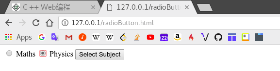

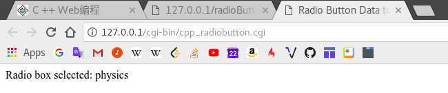

#### 将文本区域数据传递给CGI程序

html code:
```html
<form action = "/cgi-bin/cpp_textarea.cgi" method = "post" target = "_blank">
   <textarea name = "textcontent" cols = "40" rows = "4">
      Type your text here...
   </textarea>
   <input type = "submit" value = "Submit" />
</form>
```

```c++
#include <iostream>
#include <vector>  
#include <string>  
#include <stdio.h>  
#include <stdlib.h>

#include <cgicc/CgiDefs.h>
#include <cgicc/Cgicc.h>
#include <cgicc/HTTPHTMLHeader.h>
#include <cgicc/HTMLClasses.h>

using namespace std;
using namespace cgicc;

int main () {
   Cgicc formData;

   cout << "Content-type:text/html\r\n\r\n";
   cout << "<html>\n";
   cout << "<head>\n";
   cout << "<title>Text Area Data to CGI</title>\n";
   cout << "</head>\n";
   cout << "<body>\n";

   form_iterator fi = formData.getElement("textcontent");  
   if( !fi->isEmpty() && fi != (*formData).end()) {  
      cout << "Text Content: " << ** fi << endl;  
   } else {
      cout << "No text entered" << endl;  
   }

   cout << "<br/>\n";
   cout << "</body>\n";
   cout << "</html>\n";

   return 0;
}
```

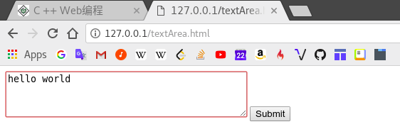

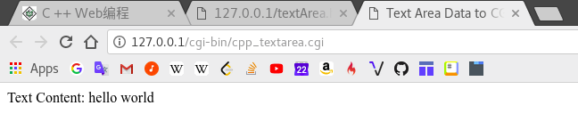

#### 将下拉框数据传递给CGI程序

html code:
```html
<form action = "/cgi-bin/cpp_dropdown.cgi" method = "post" target = "_blank">
   <select name = "dropdown">
      <option value = "Maths" selected>Maths</option>
      <option value = "Physics">Physics</option>
   </select>

   <input type = "submit" value = "Submit"/>
</form>
```

```c++
#include <iostream>
#include <vector>  
#include <string>  
#include <stdio.h>  
#include <stdlib.h>

#include <cgicc/CgiDefs.h>
#include <cgicc/Cgicc.h>
#include <cgicc/HTTPHTMLHeader.h>
#include <cgicc/HTMLClasses.h>

using namespace std;
using namespace cgicc;

int main () {
   Cgicc formData;

   cout << "Content-type:text/html\r\n\r\n";
   cout << "<html>\n";
   cout << "<head>\n";
   cout << "<title>Drop Down Box Data to CGI</title>\n";
   cout << "</head>\n";
   cout << "<body>\n";

   form_iterator fi = formData.getElement("dropdown");  
   if( !fi->isEmpty() && fi != (*formData).end()) {  
      cout << "Value Selected: " << ** fi << endl;  
   }

   cout << "<br/>\n";
   cout << "</body>\n";
   cout << "</html>\n";

   return 0;
}
```

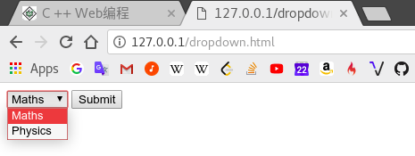

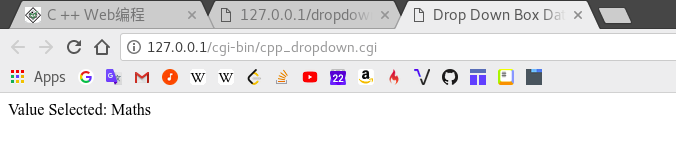

#### 在CGI中使用Cookie

[Cookie wikipedia](https://zh.wikipedia.org/wiki/Cookie)

Cookies是包含5个可变长度字段的纯文本数据记录:

* 到期 - 显示cookie将过期的日期。如果此项为空，则Cookie将在访问者退出浏览器时过期。

* 域名 - 这显示您的网站的域名。

* 路径 - 这显示了设置cookie的目录或网页的路径。如果你想从任何目录或页面检索cookie，这可能是空白的。

* 安全 - 如果此字段包含“安全”字样，则只能使用安全服务器检索cookie。如果此字段为空，则不存在此类限制。

* 名称=值 - Cookie以键和值对的形式设置和检索。

#### 设置Cookie

```c++
#include <iostream>
using namespace std;

int main () {
   cout << "Set-Cookie:UserID = XYZ;\r\n";
   cout << "Set-Cookie:Password = XYZ123;\r\n";
   cout << "Set-Cookie:Domain = www.tutorialspoint.com;\r\n";
   cout << "Set-Cookie:Path = /perl;\n";
   cout << "Content-type:text/html\r\n\r\n";

   cout << "<html>\n";
   cout << "<head>\n";
   cout << "<title>Cookies in CGI</title>\n";
   cout << "</head>\n";
   cout << "<body>\n";

   cout << "Setting cookies" << endl;  

   cout << "<br/>\n";
   cout << "</body>\n";
   cout << "</html>\n";

   return 0;
}
```

#### 检索Cookies

检索所有设置的Cookie很容易。Cookies存储在CGI环境变量HTTP_COOKIE中，它们将具有以下形式。

```high
key1 = value1; key2 = value2; key3 = value3....
```

```c++
#include <iostream>
#include <vector>  
#include <string>  
#include <stdio.h>  
#include <stdlib.h>

#include <cgicc/CgiDefs.h>
#include <cgicc/Cgicc.h>
#include <cgicc/HTTPHTMLHeader.h>
#include <cgicc/HTMLClasses.h>

using namespace std;
using namespace cgicc;

int main () {
   Cgicc cgi;
   const_cookie_iterator cci;

   cout << "Content-type:text/html\r\n\r\n";
   cout << "<html>\n";
   cout << "<head>\n";
   cout << "<title>Cookies in CGI</title>\n";
   cout << "</head>\n";
   cout << "<body>\n";
   cout << "<table border = \"0\" cellspacing = \"2\">";

   // get environment variables
   const CgiEnvironment& env = cgi.getEnvironment();

   for( cci = env.getCookieList().begin();
   cci != env.getCookieList().end();
   ++cci ) {
      cout << "<tr><td>" << cci->getName() << "</td><td>";
      cout << cci->getValue();                                 
      cout << "</td></tr>\n";
   }

   cout << "</table><\n";
   cout << "<br/>\n";
   cout << "</body>\n";
   cout << "</html>\n";

   return 0;
}
```

#### 文件上传示例

html code:
```html
<html>
   <body>
      <form enctype = "multipart/form-data" action = "/cgi-bin/cpp_uploadfile.cgi"
         method = "post">
         <p>File: <input type = "file" name = "userfile" /></p>
         <p><input type = "submit" value = "Upload" /></p>
      </form>
   </body>
</html>
```

```c++
#include <iostream>
#include <stdio.h>
#include <stdlib.h>
#include <string>
#include <vector>

#include <cgicc/CgiDefs.h>
#include <cgicc/Cgicc.h>
#include <cgicc/HTMLClasses.h>
#include <cgicc/HTTPHTMLHeader.h>

using namespace std;
using namespace cgicc;

int main() {
  Cgicc cgi;

  cout << "Content-type:text/html\r\n\r\n";
  cout << "<html>\n";
  cout << "<head>\n";
  cout << "<title>File Upload in CGI</title>\n";
  cout << "</head>\n";
  cout << "<body>\n";

  // get list of files to be uploaded
  const_file_iterator file = cgi.getFile("userfile");
  if (file != cgi.getFiles().end()) {
    // send data type at cout.
    cout << HTTPContentHeader(file->getDataType());
    // write content at cout.
    file->writeToStream(cout);
  }
  cout << "<File uploaded successfully>\n";
  cout << "</body>\n";
  cout << "</html>\n";

  return 0;
}
```

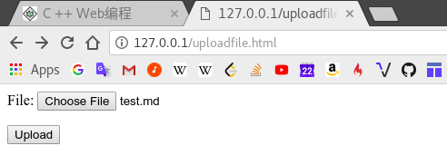

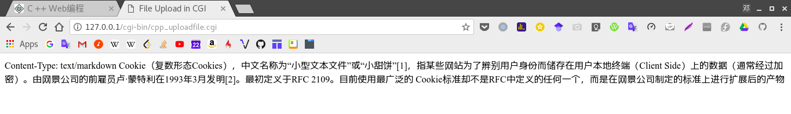

参见：

* [tutorialspoint C++ Web Programming ](https://www.tutorialspoint.com/cplusplus/cpp_web_programming.htm)

---
- [上一级](README.md)
- 上一篇 -> [VC++ 学习](visualC++.md)
- 下一篇 -> [wxWidget](wxWidget.md)
