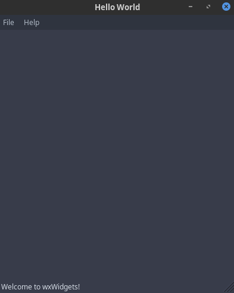

# wxWidget


<!-- @import "[TOC]" {cmd="toc" depthFrom=1 depthTo=6 orderedList=false} -->
<!-- code_chunk_output -->

* [wxWidget](#wxwidget)
	* [在linux下编译安装 wxWidget](#在linux下编译安装-wxwidget)
	* [hello world example](#hello-world-example)
	* [Link](#link)

<!-- /code_chunk_output -->


[wxWidget](https://www.wxwidgets.org/)

wxWidget，是一个跨平台的标准的C++库，和Qt一样庞大。它的语法看上去和MFC类似，有大量的宏。据说，一个MFC程序员可以很容易的转换到wxWidget上面来。wxWidget有一个很大的优点，就是它的界面都是原生风格的。这是其他的库所不能做到的。wxWidget的运行效率很高，据说在Windows平台上比起微软自家的MFC也不相上下。[原文链接](http://blog.51cto.com/devbean/193918)

## 在linux下编译安装 wxWidget

1. 下载 wxWidget 源码
[Download](https://www.wxwidgets.org/downloads/)

2. ```./configure --enable-unicode --enable-debug --with-opengl --prefix=/home/breap/software/wxWidget/```

3. ```make```
4. ```make install ```
5. ```export PATH=/home/breap/software/wxWidget:$PATH```

## hello world example

test.cpp:

```c++
// wxWidgets "Hello World" Program
// For compilers that support precompilation, includes "wx/wx.h".
#include <wx/wxprec.h>
#ifndef WX_PRECOMP
    #include <wx/wx.h>
#endif
class MyApp : public wxApp
{
public:
    virtual bool OnInit();
};
class MyFrame : public wxFrame
{
public:
    MyFrame();
private:
    void OnHello(wxCommandEvent& event);
    void OnExit(wxCommandEvent& event);
    void OnAbout(wxCommandEvent& event);
};
enum
{
    ID_Hello = 1
};
wxIMPLEMENT_APP(MyApp);
bool MyApp::OnInit()
{
    MyFrame * frame = new MyFrame();
    frame->Show(true);
    return true;
}
MyFrame::MyFrame()
    : wxFrame(NULL, wxID_ANY, "Hello World")
{
    wxMenu * menuFile = new wxMenu;
    menuFile->Append(ID_Hello, "&Hello...\tCtrl-H",
                     "Help string shown in status bar for this menu item");
    menuFile->AppendSeparator();
    menuFile->Append(wxID_EXIT);
    wxMenu * menuHelp = new wxMenu;
    menuHelp->Append(wxID_ABOUT);
    wxMenuBar * menuBar = new wxMenuBar;
    menuBar->Append(menuFile, "&File");
    menuBar->Append(menuHelp, "&Help");
    SetMenuBar( menuBar );
    CreateStatusBar();
    SetStatusText("Welcome to wxWidgets!");
    Bind(wxEVT_MENU, &MyFrame::OnHello, this, ID_Hello);
    Bind(wxEVT_MENU, &MyFrame::OnAbout, this, wxID_ABOUT);
    Bind(wxEVT_MENU, &MyFrame::OnExit, this, wxID_EXIT);
}
void MyFrame::OnExit(wxCommandEvent& event)
{
    Close(true);
}
void MyFrame::OnAbout(wxCommandEvent& event)
{
    wxMessageBox("This is a wxWidgets Hello World example",
                 "About Hello World", wxOK | wxICON_INFORMATION);
}
void MyFrame::OnHello(wxCommandEvent& event)
{
    wxLogMessage("Hello world from wxWidgets!");
}
```

Building apps with wxWidgets:
```sh
g++ test.cpp `wx-config --cxxflags --libs` -o test
```

Running wxWidgets projects:
```sh
./test:error while loading shared libraries: libwx_baseu-3.0.so.0: cannot open shared object file: No such file or directory
```
出现该错误的解决办法:

```sh
export LD_LIBRARY_PATH=$LD_LIBRARY_PATH:/home/breap/software/wxWidget/lib
```

Run it:



## Link

[Compiling and getting started](https://wiki.wxwidgets.org/Compiling_and_getting_started)


[上一级](README.md)
[上一篇](webProgramming.md)
