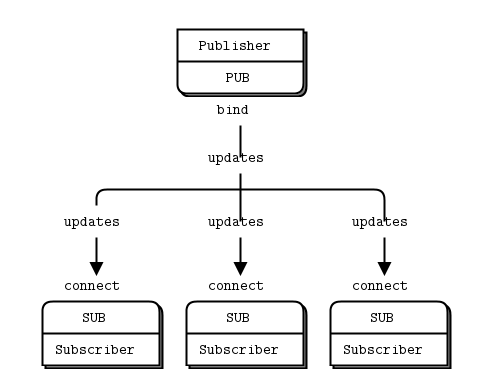
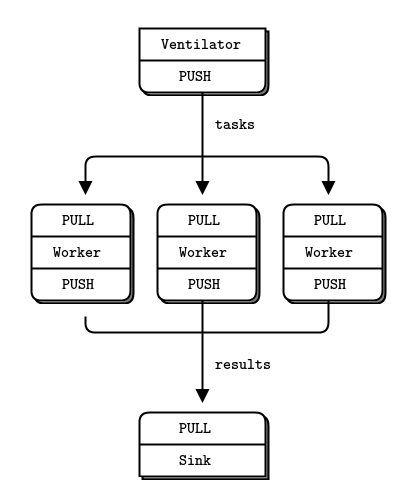

# ZeroMQ


<!-- @import "[TOC]" {cmd="toc" depthFrom=1 depthTo=6 orderedList=false} -->

<!-- code_chunk_output -->

- [ZeroMQ](#zeromq)
  - [简介](#简介)
  - [Programming with ZeroMQ](#programming-with-zeromq)
  - [ZeroMQ Socket Types](#zeromq-socket-types)
  - [ZeroMQ guide](#zeromq-guide)
  - [构建](#构建)
    - [构建 libZmq](#构建-libzmq)
    - [构建 cppzmq](#构建-cppzmq)
  - [简要说明 及 cppzmq 示例](#简要说明-及-cppzmq-示例)
    - [inproc](#inproc)
    - [request/reply](#requestreply)
    - [Publish/Subscribe](#publishsubscribe)
    - [Push/Pull](#pushpull)
      - [Parallel Pipeline](#parallel-pipeline)
- [Link](#link)

<!-- /code_chunk_output -->


## 简介 
[ZeroMQ](https://zeromq.org/) (also spelled ØMQ, 0MQ or ZMQ) is a high-performance asynchronous messaging library, aimed at use in distributed or concurrent applications. It provides a message queue, but unlike message-oriented middleware, a ZeroMQ system can run without a dedicated message broker.

ZeroMQ supports common messaging patterns (pub/sub, request/reply, client/server and others) over a variety of transports (TCP, in-process, inter-process, multicast, WebSocket and more), making inter-process messaging as simple as inter-thread messaging. This keeps your code clear, modular and extremely easy to scale.

ZeroMQ is developed by a large community of contributors. There are third-party bindings for many popular programming languages and native ports for C# and Java.

## Programming with ZeroMQ
ZeroMQ as a library works through sockets by following certain network communication patterns. It is designed to work asynchronously, and that’s where the MQ suffix to its name comes - from thread queuing messages before sending them.

## ZeroMQ Socket Types
ZeroMQ differs in the way its sockets work. Unlike the synchronous way the regular sockets work, ZeroMQ’s socket implementation “present an abstraction of an asynchronous message queue”.

The way these sockets work depend on the type of socket chosen. And flow of messages being sent depend on the chosen patterns, of which there are four:

* Request/Reply Pattern: Used for sending a request and receiving subsequent replies for each one sent.
* Publish/Subscribe Pattern: Used for distributing data from a single process (e.g. publisher) to multiple recipients (e.g. subscribers).
* Pipeline Pattern: Used for distributing data to connected nodes.
* Exclusive Pair Pattern: Used for connecting two peers together, forming a pair.

## ZeroMQ guide
[ØMQ - The Guide](http://zguide.zeromq.org/) - 包含 zeroMsg 说明和多种编程语言的例子

## 构建
### 构建 libZmq 
1. 下载 [libzmq](https://github.com/zeromq/libzmq/releases) 最新版源码
2. 使用 cmake 生成 Visual studio solution 
    ```sh
    cd $libZmq_dir
    mkdir vs 
    cd vs
    cmake -G "Visual Studio 14 2015" ../
    ```
3. 打开生成的 ZeroMQ.sln ,生成相关的库

附注：使用的版本为 zeromq-4.3.2


### 构建 cppzmq
1. 下载 [cppzmq](https://github.com/zeromq/cppzmq/releases)
2. 以管理员权限打开 VisualStudio2015,打开上面生成的 libzmq 解决方案
3. 生成其中的 INSTALL 项目（将会安装 libzmq）
4. 使用 cmake 生成 Visual studio solution 
    ```sh
    cd $cppzmq_dir
    mkdir vs 
    cd vs
    # set -DCPPZMQ_BUILD_TESTS=OFF ,否则会出现 - Unknown CMake command "catch_discover_tests".
    cmake -G "Visual Studio 14 2015" ../ -DCPPZMQ_BUILD_TESTS=OFF
    ```
5. 打开生成的 ZeroMQ.sln ,生成相关的库

附注：使用的版本为 cppzmq-4.6.0

## 简要说明 及 cppzmq 示例
说明大多来自 [How To Work with the ZeroMQ Messaging Library](https://www.digitalocean.com/community/tutorials/how-to-work-with-the-zeromq-messaging-library#zeromq-transport-types) 和 [ØMQ - The Guide](http://zguide.zeromq.org/)

下面的例子大多来自 [zguide/examples/C++/](https://github.com/booksbyus/zguide/tree/master/examples/C%2B%2B)，更多用法可参考其 examples 和 文档 

### inproc
```c++
#include <iostream>
#include <zmq_addon.hpp>

int main()
{
	zmq::context_t ctx;
	zmq::socket_t sock1(ctx, zmq::socket_type::pair);
	zmq::socket_t sock2(ctx, zmq::socket_type::pair);
	sock1.bind("inproc://test");
	sock2.connect("inproc://test");

	std::array<zmq::const_buffer, 2> send_msgs = {
		zmq::str_buffer("foo"),
		zmq::str_buffer("bar!")
	};
	if (!zmq::send_multipart(sock1, send_msgs))
		return 1;

	std::vector<zmq::message_t> recv_msgs;
	const auto ret = zmq::recv_multipart(
		sock2, std::back_inserter(recv_msgs));
	if (!ret)
		return 1;
	std::cout << "Got " << *ret
		<< " messages" << std::endl;

	for (auto i=0u;i<recv_msgs.size();++i)
	{
		std::cout << "Index "<< i <<" "<<recv_msgs[i].to_string()<<std::endl;
	}

	return 0;
}
```

### request/reply
server:
```c++
#include <iostream>
#include <zmq_addon.hpp>

int main()
{
	zmq::context_t ctx;
	zmq::socket_t server(ctx, zmq::socket_type::rep);
	server.bind("tcp://*:9999");

	while (true)
	{
		std::vector<zmq::message_t> recv_msgs;
		const auto ret = zmq::recv_multipart(
			server, std::back_inserter(recv_msgs));
		if (!ret)
			return 1;
		std::cout << "Got " << *ret
			<< " messages" << std::endl;


		for (auto i = 0u; i < recv_msgs.size(); ++i)
		{
			std::cout << "Index " << i << " " << recv_msgs[i].to_string() << std::endl;
		}
		server.send(zmq::str_buffer("")); // # fixing for recv-send pair
	}
	

	system("pause");

	return 0;
}
```

client:
```c++
#include <iostream>
#include <zmq_addon.hpp>
#include "zmq.hpp"
#include <exception>
#include <thread>
#include <chrono>

int main()
{
	zmq::context_t ctx;
	zmq::socket_t client(ctx, zmq::socket_type::req);
	client.connect("tcp://localhost:9999");

	std::array<zmq::const_buffer, 2> send_msgs = {
		zmq::str_buffer("foo"),
		zmq::str_buffer("bar!")
	};
	while (true)
	{
		try
		{
			if (!zmq::send_multipart(client, send_msgs))
				return 1;
		}
		catch (std::exception& e)
		{
			std::cout << e.what()<<std::endl;
		}
		zmq::mutable_buffer buf;
		client.recv(buf); // # fixing for recv-send pair
		std::this_thread::sleep_for(std::chrono::seconds(1));
	}
	return 0;
}
```
The client creates a socket of type request, connects and starts sending messages.

Both the send and receive methods are blocking (by default). For the receive it is simple: if there are no messages the method will block. For sending it is more complicated and depends on the socket type. For request sockets, if the high watermark is reached or no peer is connected the method will block.

### Publish/Subscribe 
In the case of publish/subscribe pattern, ZeroMQ is used to establish one or more subscribers, connecting to one or more publishers and receiving continuously what publisher sends (or seeds).

A choice to specify a prefix to accept only such messages beginning with it is available with this pattern.



Use-cases:

Publish/subscribe pattern is used for evenly distributing messages across various consumers. Automatic updates for scoreboards and news can be considered as possible areas to use this solution.

Socket type(s) used:
* zmq.PUB
* zmq.SUB

The PUB-SUB socket pair is asynchronous. The client does zmq_recv(), in a loop (or once if that's all it needs). Trying to send a message to a SUB socket will cause an error. Similarly, the service does zmq_send() as often as it needs to, but must not do zmq_recv() on a PUB socket.

Some points about the publish-subscribe (pub-sub) pattern:
* A subscriber can connect to more than one publisher, using one connect call each time. Data will then arrive and be interleaved ("fair-queued") so that no single publisher drowns out the others.
* If a publisher has no connected subscribers, then it will simply drop all messages.
* If you're using TCP and a subscriber is slow, messages will queue up on the publisher. We'll look at how to protect publishers against this using the "high-water mark" later.
* From ZeroMQ v3.x, filtering happens at the publisher side when using a connected protocol (tcp:// or ipc://). Using the epgm:// protocol, filtering happens at the subscriber side. In ZeroMQ v2.x, all filtering happened at the subscriber side.

publisher:
```c++
#include <iostream>
#include <zmq_addon.hpp>
#include <thread>
#include <chrono>

int main()
{
	//  Prepare our context and publisher
	zmq::context_t context(1);
	zmq::socket_t publisher(context, zmq::socket_type::pub);
	publisher.bind("tcp://*:5563");

	while (true)
	{
		try
		{
			//  Write two messages, each with an envelope and content
			publisher.send(zmq::str_buffer("A"),zmq::send_flags::sndmore);
			publisher.send(zmq::str_buffer("We don't want to see this"));
			publisher.send(zmq::str_buffer("B"), zmq::send_flags::sndmore);
			publisher.send(zmq::str_buffer("We would like to see this"));
		}
		catch (std::exception& e)
		{
			std::cout << e.what() << std::endl;
		}
		std::this_thread::sleep_for(std::chrono::seconds(1));
	}

	return 0;
}
```

subscriber:
```c++
#include <iostream>
#include <zmq_addon.hpp>
#include "zmq.hpp"
#include <exception>
#include <thread>
#include <chrono>

int main()
{
	//  Prepare our context and subscriber
	zmq::context_t ctx(1);
	zmq::socket_t subscriber(ctx, zmq::socket_type::sub);
	subscriber.connect("tcp://localhost:5563");
	subscriber.setsockopt(ZMQ_SUBSCRIBE,"B",1);

	while (true)
	{
		//  Read envelope with address
		zmq::message_t address;
		subscriber.recv(address);

		//  Read message contents
		zmq::message_t contents;
		subscriber.recv(contents);

		std::cout << "[" << address.to_string() << "] " << contents.to_string() << std::endl;
	}
	return 0;
}
```

运行 publisher and subscriber ,在 subscribe 上显示如下：
```sh
[B] We would like to see this
[B] We would like to see this
[B] We would like to see this
[B] We would like to see this
[B] We would like to see this
[B] We would like to see this
[B] We would like to see this
[B] We would like to see this
[B] We would like to see this
[B] We would like to see this
[B] We would like to see this
```

### Push/Pull
Very similar in the way it looks to the Publish/Subscribe pattern, the third in line Pipeline pattern comes as a solution to a different kind of problem: distributing messages upon demand.

Use-cases:

Pipelining pattern can be used in cases where are list of queued items need to be routed (i.e. pushed in line) for the one asking for it (i.e. those who pull).

Socket type(s) used:
* zmq.PUSH
* zmq.PULL

#### Parallel Pipeline



taskvent: Parallel task ventilator
```c++
#include <iostream>
#include <thread>
#include <chrono>
#include <zmq.hpp>
#include <cstdlib>
#include <cstdio>
#include <random>

int main()
{
	try
	{
		//  Prepare our context and publisher
		zmq::context_t context(1);
		zmq::socket_t sender(context, zmq::socket_type::push);
		sender.bind("tcp://*:5557");

		// This is a fairly common gotcha in ZeroMQ and there is no easy
		//  solution. The zmq_connect method takes a certain time. So when a set
		//   of workers connect to the ventilator, the first one to successfully 
		//   connect will get a whole load of messages in that short time while 
		//   the others are also connecting. If you don't synchronize the start of
		//   the batch somehow, the system won't run in parallel at all.
		
		std::cout << "Press Enter when the workers are ready: " << std::endl;
		getchar();
		std::cout << "Sending tasks to workers…\n" << std::endl;

		//  The first message is "0" and signals start of batch
		zmq::socket_t sink(context, zmq::socket_type::push);
		sink.connect("tcp://localhost:5558");
		sink.send(zmq::str_buffer("0"));

		auto within = [](int begin, int end)->int
		{
			std::random_device rd; // obtain a random number from hardware
			std::mt19937 gen(rd()); // seed the generator
			std::uniform_int_distribution<> distr(begin, end); // define the range
			return distr(gen);
		};

		auto totalMsec = 0; // Total expected const in msecs
		for (auto taskIndex=0;taskIndex<100;++taskIndex)
		{
			// Random workload from 1 to 100 msecs
			auto workload = within(1, 100);
			totalMsec += workload;

			sender.send(zmq::buffer(std::to_string(workload)));
		}
		std::cout << "Total expected cost: " << totalMsec << " msec" << std::endl;
		std::this_thread::sleep_for(std::chrono::seconds(1)); //  Give 0MQ time to deliver
	}
	catch (std::exception& e)
	{
		std::cout << e.what() << std::endl;
	}

	return 0;
}
```

Here is the worker application(taskwork). It receives a message, sleeps for that number of seconds, and then signals that it's finished:
```c++
#include <iostream>
#include "zmq.hpp"
#include <exception>
#include <thread>
#include <chrono>

int main()
{
	try
	{
		zmq::context_t context(1);

		//  Socket to receive messages on
		zmq::socket_t receiver(context, zmq::socket_type::pull);
		receiver.connect("tcp://localhost:5557");

		//  Socket to send messages to
		zmq::socket_t sender(context, zmq::socket_type::push);
		sender.connect("tcp://localhost:5558");

		//  Process tasks forever
		while (true)
		{
			//  Read envelope with address
			zmq::message_t msg;
			receiver.recv(msg);

			auto workLoad = std::stoi(msg.to_string());

			// Do the work 
			std::this_thread::sleep_for(std::chrono::milliseconds(workLoad));

			// Send results to sink 
			sender.send(msg,zmq::send_flags::none);

			// Simple progress indicator for the viewer
			std::cout << "." << std::flush;
		}
	}
	catch (std::exception& e)
	{
		std::cout << e.what() << std::endl;
	}
	return 0;
}
```
Here is the sink application(tasksink). It collects the 100 tasks, then calculates how long the overall processing took, so we can confirm that the workers really were running in parallel if there are more than one of them:
```c++
#include <iostream>
#include <thread>
#include <chrono>
#include <zmq.hpp>
#include <ctime>
#include <random>

int main()
{
	try
	{
		//  Prepare our context and socket
		zmq::context_t context(1);
		zmq::socket_t receiver(context, zmq::socket_type::pull);
		receiver.bind("tcp://*:5558");

		//  Wait for start of batch
		zmq::message_t message;
		receiver.recv(message);

		// Start our clock now 
		auto clockBegin = std::chrono::steady_clock::now();

		// Process 100 confirmations
		auto totalMsec = 0;
		for (auto taskIndex=0;taskIndex<100;++taskIndex)
		{
			receiver.recv(message);
			if((taskIndex / 10) * 10 == taskIndex)
				std::cout << ":" << std::flush;
			else
				std::cout << "." << std::flush;

		}

		//  Calculate and report duration of batch
		auto clockEnd = std::chrono::steady_clock::now();

		totalMsec = std::chrono::duration_cast<std::chrono::milliseconds>(clockEnd - clockBegin).count();
		std::cout << "\nTotal elapsed time: " << totalMsec << " msec\n" << std::endl;
	}
	catch (std::exception& e)
	{
		std::cout << e.what() << std::endl;
	}
	//system("pause");
	return 0;
}
```

Run taskvent:
```sh
Press Enter when the workers are ready:

Sending tasks to workers…

Total expected cost: 4918 msec
```
Run taskwork:
```sh
....................................................................................................
```
Run tasksink:
```sh
:.........:.........:.........:.........:.........:.........:.........:.........:.........:.........
Total elapsed time: 5007 msec
```

The average cost of a batch is 5 seconds. When we start 1, 2, or 4 workers we get results in my computer:
1 worker: total elapsed time: 5007 msecs.
2 workers: total elapsed time: 2737 msecs.
4 workers: total elapsed time: 1550 msecs.

# Link 
* [Unknown CMake command "catch_discover_tests".](https://github.com/zeromq/cppzmq/issues/334)
* [详解报错[zmq.error.ZMQError: Operation cannot be accomplished in current state]](https://blog.csdn.net/ybdesire/article/details/81435291)
* [How To Work with the ZeroMQ Messaging Library](https://www.digitalocean.com/community/tutorials/how-to-work-with-the-zeromq-messaging-library#zeromq-transport-types)


---
- [上一级](README.md)
- 上一篇 -> [wxWidget](wxWidget.md)
