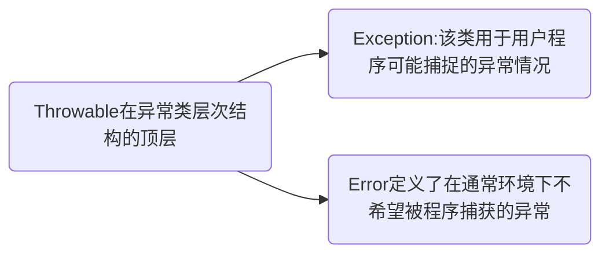
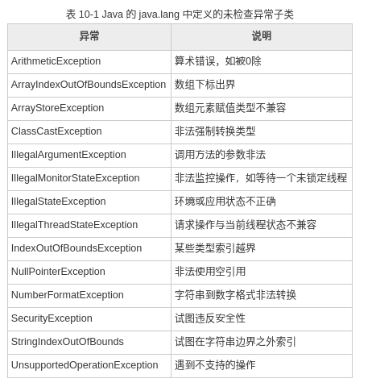
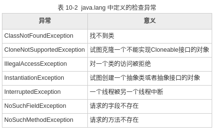
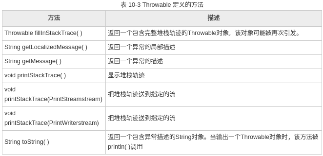

# 初识java

<!-- @import "[TOC]" {cmd="toc" depthFrom=1 depthTo=6 orderedList=false} -->
<!-- code_chunk_output -->

* [初识java](#初识java)
	* [继承和多态](#继承和多态)
		* [访问权限修饰符](#访问权限修饰符)
		* [继承的概念与实现](#继承的概念与实现)
		* [super 关键字](#super-关键字)
		* [多态和动态绑定](#多态和动态绑定)
			* [动态绑定](#动态绑定)
		* [instanceof 运算符](#instanceof-运算符)
		* [多态对象的类型转换](#多态对象的类型转换)
		* [static关键字以及静态变量和静态方法](#static关键字以及静态变量和静态方法)
			* [静态初始器（静态块）](#静态初始器静态块)
			* [静态导入](#静态导入)
		* [final关键字：阻止继承和多态](#final关键字阻止继承和多态)
			* [java内联函数](#java内联函数)
	* [Object类](#object类)
			* [equals()](#equals)
			* [hashCode()](#hashcode)
			* [toString()](#tostring)
	* [面向对象高级特性](#面向对象高级特性)
		* [内部类及其实例化](#内部类及其实例化)
		* [抽象类的概念和使用](#抽象类的概念和使用)
		* [接口](#接口)
			* [作为类型使用](#作为类型使用)
		* [泛型](#泛型)
			* [类型擦除](#类型擦除)
			* [限制泛型的可用类型](#限制泛型的可用类型)
		* [泛型通配符和类型参数的范围](#泛型通配符和类型参数的范围)
			* [借助通配符限制泛型的范围](#借助通配符限制泛型的范围)
	* [异常](#异常)
		* [异常类](#异常类)
		* [显示一个异常的描述](#显示一个异常的描述)
		* [try语句的嵌套](#try语句的嵌套)
		* [异常的抛出](#异常的抛出)
		* [throws子句](#throws子句)
		* [finally](#finally)
		* [内置异常](#内置异常)
			* [未经检查的异常](#未经检查的异常)
			* [受检查的异常](#受检查的异常)
		* [创建自己的异常子类](#创建自己的异常子类)
		* [断言](#断言)
			* [运行时(使用|屏蔽)断言](#运行时使用屏蔽断言)

<!-- /code_chunk_output -->

## 继承和多态

### 访问权限修饰符

Java语言中的访问权限修饰符有4种，但是仅有3个关键字，因为不写访问权限，在Java中被称为默认权限，或同包权限，本文中以（default）代替。下面按照权限从小到大的顺序对4中访问权限分别介绍。
1. 私有权限（private）
private可以修饰数据成员，构造方法，方法成员，不能修饰类（此处指外部类，不考虑内部类）。被private修饰的成员，只能在定义它们的类中使用，在其他类中不能调用。
2. 默认权限（default）
类，数据成员，构造方法，方法成员，都能够使用默认权限，即不写任何关键字。默认权限即同包权限，同包权限的元素只能在定义它们的类中，以及同包的类中被调用。
3. 受保护权限（protected）
protected可以修饰数据成员，构造方法，方法成员，不能修饰类（此处指外部类，不考虑内部类）。被protected修饰的成员，能在定义它们的类中，同包的类中被调用。如果有不同包的类想调用它们，那么这个类必须是定义它们的类的子类。
4. 公共权限（public）
public可以修饰类，数据成员，构造方法，方法成员。被public修饰的成员，可以在任何一个类中被调用，不管同包或不同包，是权限最大的一个修饰符。

* 有关Java语言的修饰符，需要注意的问题有如下几个：
1. 并不是每个修饰符都可以修饰类（指外部类），只有public和default可以。
2. 所有修饰符都可以修饰数据成员，方法成员，构造方法。
3. 为了代码安全起见，修饰符不要尽量使用权限大的，而是适用即可。比如，数据成员，如果没有特殊需要，尽可能用private。
4. 修饰符修饰的是“被访问”的权限。

[link 1 ](http://blog.csdn.net/wuxinliulei/article/details/10823923)

[link 2](http://developer.51cto.com/art/200906/128622.htm)

### 继承的概念与实现

继承是类与类之间的关系，是一个很简单很直观的概念，与现实世界中的继承（例如儿子继承父亲财产）类似。

继承可以理解为一个类从另一个类获取方法和属性的过程。如果类B继承于类A，那么B就拥有A的方法和属性。

继承使用 extends 关键字。

### super 关键字

super 关键字与 this 类似，this 用来表示当前类的实例，super 用来表示父类。

super 可以用在子类中，通过点号(.)来获取父类的成员变量和方法。super 也可以用在子类的子类中，Java 能自动向上层类追溯。

父类行为被调用，就好象该行为是本类的行为一样，而且调用行为不必发生在父类中，它能自动向上层类追溯。

super 关键字的功能：
1. 点取已经覆盖了的方法。
2. 作为方法名表示父类构造方法。
* 在构造方法中调用另一个构造方法，调用动作必须置于最起始的位置。
* 不能在构造方法以外的任何方法内调用构造方法。
* 在一个构造方法内只能调用一个构造方法。

### 多态和动态绑定

在Java中，父类的变量可以引用父类的实例，也可以引用子类的实例

```java
public class Demo {
    public static void main(String[] args){
        Animal obj = new Animal();
        obj.cry();
        obj = new Cat();
        obj.cry();
        obj = new Dog();
        obj.cry();
    }
}
class Animal{
    // 动物的叫声
    public void cry(){
        System.out.println("不知道怎么叫");
    }

}
class Cat extends Animal{
    // 猫的叫声
    public void cry(){
        System.out.println("喵喵~");
    }
}
class Dog extends Animal{
    // 狗的叫声
    public void cry(){
        System.out.println("汪汪~");
    }
}
```

结果：
```
不知道怎么叫
喵喵~
汪汪~
```


* 多态存在的三个必要条件：要有继承、要有重写、父类变量引用子类对象。


#### 动态绑定

为了理解多态的本质，下面讲一下Java调用方法的详细流程。

1) 编译器查看对象的声明类型和方法名。

假设调用 obj.func(param)，obj 为 Cat 类的对象。需要注意的是，有可能存在多个名字为func但参数签名不一样的方法。例如，可能存在方法 func(int) 和 func(String)。编译器将会一一列举所有 Cat 类中名为func的方法和其父类 Animal 中访问属性为 public 且名为func的方法。

这样，编译器就获得了所有可能被调用的候选方法列表。

2) 接下来，编泽器将检查调用方法时提供的参数签名。

如果在所有名为func的方法中存在一个与提供的参数签名完全匹配的方法，那么就选择这个方法。这个过程被称为重载解析(overloading resolution)。例如，如果调用 func("hello")，编译器会选择 func(String)，而不是 func(int)。由于自动类型转换的存在，例如 int 可以转换为 double，如果没有找到与调用方法参数签名相同的方法，就进行类型转换后再继续查找，如果最终没有匹配的类型或者有多个方法与之匹配，那么编译错误。

这样，编译器就获得了需要调用的方法名字和参数签名。

3) 如果方法的修饰符是private、static、final（static和final将在后续讲解），或者是构造方法，那么编译器将可以准确地知道应该调用哪个方法，我们将这种调用方式 称为静态绑定(static binding)。

与此对应的是，调用的方法依赖于对象的实际类型， 并在运行时实现动态绑。例如调用 func("hello")，编泽器将采用动态绑定的方式生成一条调用 func(String) 的指令。

4)当程序运行，并且釆用动态绑定调用方法时，JVM一定会调用与 obj 所引用对象的实际类型最合适的那个类的方法。我们已经假设 obj 的实际类型是 Cat，它是 Animal 的子类，如果 Cat 中定义了 func(String)，就调用它，否则将在 Animal 类及其父类中寻找。

每次调用方法都要进行搜索，时间开销相当大，因此，JVM预先为每个类创建了一个方法表(method lable)，其中列出了所有方法的名称、参数签名和所属的类。这样一来，在真正调用方法的时候，虚拟机仅查找这个表就行了。在上面的例子中，JVM 搜索 Cat 类的方法表，以便寻找与调用 func("hello") 相匹配的方法。这个方法既有可能是 Cat.func(String)，也有可能是 Animal.func(String)。注意，如果调用super.func("hello")，编译器将对父类的方法表迸行搜索。

### instanceof 运算符

多态性带来了一个问题，就是如何判断一个变量所实际引用的对象的类型 。 C++使用runtime-type information(RTTI)，Java 使用 instanceof 操作符。

instanceof 运算符用来判断一个变量所引用的对象的实际类型，注意是它引用的对象的类型，不是变量的类型。请看下面的代码：
```java
public final class Demo{
    public static void main(String[] args) {
        // 引用 People 类的实例
        People obj = new People();
        if(obj instanceof Object){
            System.out.println("我是一个对象");
        }
        if(obj instanceof People){
            System.out.println("我是人类");
        }
        if(obj instanceof Teacher){
            System.out.println("我是一名教师");
        }
        if(obj instanceof President){
            System.out.println("我是校长");
        }

        System.out.println("-----------");  // 分界线

        // 引用 Teacher 类的实例
        obj = new Teacher();
        if(obj instanceof Object){
            System.out.println("我是一个对象");
        }
        if(obj instanceof People){
            System.out.println("我是人类");
        }
        if(obj instanceof Teacher){
            System.out.println("我是一名教师");
        }
        if(obj instanceof President){
            System.out.println("我是校长");
        }
    }
}

class People{ }
class Teacher extends People{ }
class President extends Teacher{ }
```

运行结果：
```
我是一个对象
我是人类
-----------
我是一个对象
我是人类
我是一名教师
```

可以看出，如果变量引用的是当前类或它的子类的实例，instanceof 返回 true，否则返回 false


### 多态对象的类型转换

这里所说的对象类型转换，是指存在继承关系的对象，不是任意类型的对象。当对不存在继承关系的对象进行强制类型转换时，java 运行时将抛出 java.lang.ClassCastException 异常。

在继承链中，我们将子类向父类转换称为“向上转型”，将父类向子类转换称为“向下转型”。

很多时候，我们会将变量定义为父类的类型，却引用子类的对象，这个过程就是向上转型。程序运行时通过动态绑定来实现对子类方法的调用，也就是多态性。

然而有些时候为了完成某些父类没有的功能，我们需要将向上转型后的子类对象再转成子类，调用子类的方法，这就是向下转型。

* 注意：不能直接将父类的对象强制转换为子类类型，只能将向上转型后的子类对象再次转换为子类类型。
* 子类对象必须向上转型后，才能再向下转型。

```java
public class Demo {
    public static void main(String args[]) {
        SuperClass superObj = new SuperClass();
        SonClass sonObj = new SonClass();
        // 下面的代码运行时会抛出异常，不能将父类对象直接转换为子类类型
        // SonClass sonObj2 = (SonClass)superObj;
        // 先向上转型，再向下转型
        superObj = sonObj;
        SonClass sonObj1 = (SonClass)superObj;
    }
}
class SuperClass{ }
class SonClass extends SuperClass{ }
```
将第7行的注释去掉，运行时会抛出异常，但是编译可以通过。

因为向下转型存在风险，所以在接收到父类的一个引用时，请务必使用 instanceof 运算符来判断该对象是否是你所要的子类，请看下面的代码：

```java
public class Demo {
    public static void main(String args[]) {
        SuperClass superObj = new SuperClass();
        SonClass sonObj = new SonClass();
        // superObj 不是 SonClass 类的实例
        if(superObj instanceof SonClass){
            SonClass sonObj1 = (SonClass)superObj;
        }else{
            System.out.println("①不能转换");
        }
        superObj = sonObj;
        // superObj 是 SonClass 类的实例
        if(superObj instanceof SonClass){
            SonClass sonObj2 = (SonClass)superObj;
        }else{
            System.out.println("②不能转换");
        }
    }
}
class SuperClass{ }
class SonClass extends SuperClass{ }
```

结果显示：
```
①不能转换
```

总结：对象的类型转换在程序运行时检查，向上转型会自动进行，向下转型的对象必须是当前引用类型的子类。

### static关键字以及静态变量和静态方法

静态变量和静态方法能够通过类名来访问，不需要创建一个类的对象来访问该类的静态成员，所以static修饰的成员又称作类变量和类方法。静态变量与实例变量不同，实例变量总是通过对象来访问，因为它们的值在对象和对象之间有所不同。


关于静态变量和静态方法的总结：
* 一个类的静态方法只能访问静态变量；
* 一个类的静态方法不能够直接调用非静态方法；
* 如访问控制权限允许，静态变量和静态方法也可以通过对象来访问，但是不被推荐；
* 静态方法中不存在当前对象，因而不能使用 this，当然也不能使用 super；
* 静态方法不能被非静态方法覆盖；
* 构造方法不允许声明为 static 的；
* 局部变量不能使用static修饰。

#### 静态初始器（静态块）

块是由大括号包围的一段代码。静态初始器(Static Initializer)是一个存在于类中、方法外面的静态块。静态初始器仅仅在类装载的时候（第一次使用类的时候）执行一次，往往用来初始化静态变量。

示例代码：
```java
public class Demo {
    public static int i;
    static{
        i = 10;
        System.out.println("Now in static block.");
    }
    public void test() {
        System.out.println("test method: i=" + i);
    }
    public static void main(String[] args) {
        System.out.println("Demo.i=" + Demo.i);
        new Demo().test();
    }
}
```

运行结果:
```
Now in static block.
Demo.i=10
test method: i=10
```

#### 静态导入

静态导入是 Java 5 的新增特性，用来导入类的静态变量和静态方法。


一般我们导入类都这样写：
```java
import packageName.className;  // 导入某个特定的类
//或
import packageName.*;  // 导入包中的所有类

//而静态导入可以这样写：
import static packageName.className.methonName;  // 导入某个特定的静态方法
//或
import static packageName.className.*;  // 导入类中的所有静态成员
```

导入后，可以在当前类中直接用方法名调用静态方法，不必再用 className.methodName 来访问。

对于使用频繁的静态变量和静态方法，可以将其静态导入。静态导入的好处是可以简化一些操作，例如输出语句 System.out.println(); 中的 out 就是 System 类的静态变量，可以通过 import static java.lang.System.*; 将其导入，下次直接调用 out.println() 就可以了。

代码示例：
```java
import static java.lang.System.*;
import static java.lang.Math.random;
public class Demo {
    public static void main(String[] args) {
        out.println("产生的一个随机数：" + random());
    }
}
```

运行结果：
```
0.05800891549018705
```

### final关键字：阻止继承和多态

在 Java 中，声明类、变量和方法时，可使用关键字 final 来修饰。final 所修饰的数据具有“终态”的特征，表示“最终的”意思。具体规定如下：
* final 修饰的类不能被继承。
* final 修饰的方法不能被子类重写。
* final 修饰的变量（成员变量或局部变量）即成为常量，只能赋值一次。
* final 修饰的成员变量必须在声明的同时赋值，如果在声明的时候没有赋值，那么只有 一次赋值的机会，而且只能在构造方法中显式赋值，然后才能使用。
* final 修饰的局部变量可以只声明不赋值，然后再进行一次性的赋值。

final 一般用于修饰那些通用性的功能、实现方式或取值不能随意被改变的数据，以避免被误用，例如实现数学三角方法、幂运算等功能的方法，以及数学常量π=3.141593、e=2.71828 等。

事实上，为确保终态性，提供了上述方法和常量的 java.lang.Math 类也已被定义为final 的。

需要注意的是，如果将引用类型（任何类的类型）的变量标记为 final，那么该变量不能指向任何其它对象。但可以改变对象的内容，因为只有引用本身是 final 的。

final 也可以用来修饰类（放在 class 关键字前面），阻止该类再派生出子类，例如 Java.lang.String 就是一个 final 类。这样做是出于安全原因，因为要保证一旦有字符串的引用，就必须是类 String 的字符串，而不是某个其它类的字符串（String 类可能被恶意继承并篡改）。

方法也可以被 final 修饰，被 final 修饰的方法不能被覆盖；变量也可以被 final 修饰，被 final 修饰的变量在创建对象以后就不允许改变它们的值了。一旦将一个类声明为 final，那么该类包含的方法也将被隐式地声明为 final，但是变量不是。

* 被 final 修饰的方法为静态绑定，不会产生多态（动态绑定），程序在运行时不需要再检索方法表，能够提高代码的执行效率。在Java中，被 static 或 private 修饰的方法会被隐式的声明为 final，因为动态绑定没有意义。

由于动态绑定会消耗资源并且很多时候没有必要，所以有一些程序员认为：除非有足够的理由使用多态性，否则应该将所有的方法都用 final 修饰。

这样的认识未免有些偏激，因为 JVM 中的即时编译器能够实时监控程序的运行信息，可以准确的知道类之间的继承关系。

例如，内联调用 e.getName()将被替换为访问e.name变量。这是一项很有意义的改进，这是由于CPU在处理调用方法的指令时，使用的分支转移会扰乱预取指令的策略，所以，这被视为不受欢迎的。然而，如果 getName() 在另外一个类中被覆盖，那么编译器就无法知道覆盖的代码将会做什么操作，因此也就不能对它进行内联处理了。

#### java内联函数
* java中不需额外关注，jvm会自动进行优化。如果一个方法没有被覆盖并且很短，编译器就能够对它进行优化处理，这个过程为称为内联(inlining)。

```java
int max (int a, int b){
    if (a > b)
        return a;
    else
        return b;
}

void main() {
        .....
    a = max (x, y); // 内联，等价于 "a = (x > y ? x : y);" 直接扩展开了，不再调用方法
        .....
}
```


## Object类

Object 类位于 java.lang 包中，是所有 Java 类的祖先，Java 中的每个类都由它扩展而来。

定义Java类时如果没有显示的指明父类，那么就默认继承了 Object 类。例如：

```java
public class Demo{
    // ...
}
//实际上是下面代码的简写形式：
public class Demo extends Object{
    // ...
}
```

在Java中，只有基本类型不是对象，例如数值、字符和布尔型的值都不是对象，所有的数组类型，不管是对象数组还是基本类型数组都是继承自 Object 类。

Object 类定义了一些有用的方法，由于是根类，这些方法在其他类中都存在，一般是进行了重载或覆盖，实现了各自的具体功能。


#### equals()
Object 类中的 equals() 方法用来检测一个对象是否等价于另外一个对象，语法为：
    public boolean equals(Object obj)

```java
obj1.equals(obj2);
```
在Java中，数据等价的基本含义是指两个数据的值相等。在通过 equals() 和“==”进行比较的时候，引用类型数据比较的是引用，即内存地址，基本数据类型比较的是值。

注意：
* equals()方法只能比较引用类型，“ == ”可以比较引用类型及基本类型。
* 当用 equals() 方法进行比较时，对类 File、String、Date 及包装类来说，是比较类型及内容而不考虑引用的是否是同一个实例。
* 用“==”进行比较时，符号两边的数据类型必须一致（可自动转换的数据类型除外），否则编译出错，而用 equals 方法比较的两个数据只要都是引用类型即可。

#### hashCode()

散列码(hashCode)是按照一定的算法由对象得到的一个数值，散列码没有规律。如果 x 和 y 是不同的对象，x.hashCode() 与 y.hashCode() 基本上不会相同。

hashCode() 方法主要用来在集合中实现快速查找等操作，也可以用于对象的比较。

在 Java 中，对 hashCode 的规定如下：
在同一个应用程序执行期间，对同一个对象调用 hashCode()，必须返回相同的整数结果——前提是 equals() 所比较的信息都不曾被改动过。至于同一个应用程序在不同执行期所得的调用结果，无需一致。
如果两个对象被 equals() 方法视为相等，那么对这两个对象调用 hashCode() 必须获得相同的整数结果。
如果两个对象被 equals() 方法视为不相等，那么对这两个对象调用 hashCode() 不必产生不同的整数结果。然而程序员应该意识到，对不同对象产生不同的整数结果，有可能提升hashTable（后面会学到，集合框架中的一个类）的效率。

简单地说：如果两个对象相同，那么它们的 hashCode 值一定要相同；如果两个对象的 hashCode 值相同，它们并不一定相同。在 Java 规范里面规定，一般是覆盖 equals() 方法应该连带覆盖 hashCode() 方法。

#### toString()

toString() 方法是 Object 类中定义的另一个重要方法，是对象的字符串表现形式，语法为：
* public String toString()
返回值是 String 类型，用于描述当前对象的有关信息。Object 类中实现的 toString() 方法是返回当前对象的类型和内存地址信息，但在一些子类（如 String、Date 等）中进行了 重写，也可以根据需要在用户自定义类型中重写 toString() 方法，以返回更适用的信息。

## 面向对象高级特性

### 内部类及其实例化

在 Java 中，允许在一个类（或方法、语句块）的内部定义另一个类，称为内部类(Inner Class)，有时也称为嵌套类(Nested Class)。

内部类和外层封装它的类之间存在逻辑上的所属关系，一般只用在定义它的类或语句块之内，实现一些没有通用意义的功能逻辑，在外部引用它时必须给出完整的名称。

使用内部类的主要原因有：
* 内部类可以访问外部类中的数据，包括私有的数据。
* 内部类可以对同一个包中的其他类隐藏起来。
* 当想要定义一个回调函数且不想编写大量代码时，使用匿名(anonymous)内部类比较便捷。
* 减少类的命名冲突。

```java
public class Outer {
    private int size;
    public class Inner {
        private int counter = 10;
        public void doStuff() {
            size++;
        }
    }
    public static void main(String args[]) {
        Outer outer = new Outer();
        Inner inner = outer.new Inner();
        inner.doStuff();
        System.out.println(outer.size);
        System.out.println(inner.counter);
        // 编译错误，外部类不能访问内部类的变量
        System.out.println(counter);
    }
}
```

### 抽象类的概念和使用

在自上而下的继承层次结构中，位于上层的类更具有通用性，甚至可能更加抽象。从某种角度看，祖先类更加通用，它只包含一些最基本的成员，人们只将它作为派生其他类的基类，而不会用来创建对象。甚至，你可以只给出方法的定义而不实现，由子类根据具体需求来具体实现。

* 这种只给出方法定义而不具体实现的方法被称为抽象方法，抽象方法是没有方法体的，在代码的表达上就是没有“{}”。

* 包含一个或多个抽象方法的类也必须被声明为抽象类。

使用abstract修饰符来表示抽象方法和抽象类。

* 抽象类除了包含抽象方法外，还可以包含具体的变量和具体的方法。类即使不包含抽象方法，也可以被声明为抽象类，防止被实例化。

抽象类不能被实例化，抽象方法必须在子类中被实现

```java
import static java.lang.System.*;
public final class Demo{
    public static void main(String[] args) {
        Teacher t = new Teacher();
        t.setName("王明");
        t.work();

        Driver d = new Driver();
        d.setName("小陈");
        d.work();
    }
}
// 定义一个抽象类
abstract class People{
    private String name;  // 实例变量

    // 共有的 setter 和 getter 方法
    public void setName(String name){
        this.name = name;
    }
    public String getName(){
        return this.name;
    }

    // 抽象方法
    public abstract void work();
}
class Teacher extends People{
    // 必须实现该方法
    public void work(){
        out.println("我的名字叫" + this.getName() + "，我正在讲课，请大家不要东张西望...");
    }
}
class Driver extends People{
    // 必须实现该方法
    public void work(){
        out.println("我的名字叫" + this.getName() + "，我正在开车，不能接听电话...");
    }
}

```

关于抽象类的几点说明：
* 抽象类不能直接使用，必须用子类去实现抽象类，然后使用其子类的实例。然而可以创建一个变量，其类型是一个抽象类，并让它指向具体子类的一个实例，也就是可以使用抽象类来充当形参，实际实现类作为实参，也就是多态的应用。
* 不能有抽象构造方法或抽象静态方法。


在下列情况下，一个类将成为抽象类：
1. 当一个类的一个或多个方法是抽象方法时；
2. 当类是一个抽象类的子类，并且不能为任何抽象方法提供任何实现细节或方法主体时；
3. 当一个类实现一个接口，并且不能为任何抽象方法提供实现细节或方法主体时；注意：
* 这里说的是这些情况下一个类将成为抽象类，没有说抽象类一定会有这些情况。
* 一个典型的错误：抽象类一定包含抽象方法。 但是反过来说“包含抽象方法的类一定是抽象类”就是正确的。
* 事实上，抽象类可以是一个完全正常实现的类

### 接口

* 接口（interface）中，所有的方法必须都是抽象的，不能有方法体，比抽象类更加“抽象”。

```java
//串行硬盘接口
public interface SataHdd{
    //连接线的数量
    public static final int CONNECT_LINE=4;
    //写数据
    public void writeData(String data);
    //读数据
    public String readData();
}
```

接口有其自身的一些特性，归纳如下。

1. 接口中只能定义抽象方法，这些方法默认为 public abstract 的，因而在声明方法时可以省略这些修饰符。试图在接口中定义实例变量、非抽象的实例方法及静态方法，都是非法的。

2. 接口中没有构造方法，不能被实例化。

3. 一个接口不实现另一个接口，但可以继承多个其他接口。接口的多继承特点弥补了类的单继承。

一个类只能继承一个父类，但却可以实现多个接口。

实现接口的格式如下：
修饰符 class 类名 extends 父类 implements 多个接口 {
    实现方法
}

```java
import static java.lang.System.*;

public class Demo{
  public static void main(String[] args) {
      SataHdd sh1=new SeagateHdd(); //初始化希捷硬盘
      SataHdd sh2=new SamsungHdd(); //初始化三星硬盘
  }
}

//串行硬盘接口
interface SataHdd{
    //连接线的数量
    public static final int CONNECT_LINE=4;
    //写数据
    public void writeData(String data);
    //读数据
    public String readData();
}

// 维修硬盘接口
interface fixHdd{
    // 维修地址
    String address = "北京市海淀区";
    // 开始维修
    boolean doFix();
}

//希捷硬盘
class SeagateHdd implements SataHdd, fixHdd{
    //希捷硬盘读取数据
    public String readData(){
        return "数据";
    }
    //希捷硬盘写入数据
    public void writeData(String data) {
        out.println("写入成功");
    }
    // 维修希捷硬盘
    public boolean doFix(){
        return true;
    }
}
//三星硬盘
class SamsungHdd implements SataHdd{
    //三星硬盘读取数据
    public String readData(){
        return "数据";
    }
    //三星硬盘写入数据
    public void writeData(String data){
        out.println("写入成功");
    }
}
//某劣质硬盘，不能写数据
abstract class XXHdd implements SataHdd{
    //硬盘读取数据
    public String readData() {
        return "数据";
    }
}
```

#### 作为类型使用

接口作为引用类型来使用，任何实现该接口的类的实例都可以存储在该接口类型的变量中，通过这些变量可以访问类中所实现的接口中的方法，Java 运行时系统会动态地确定应该使用哪个类中的方法，实际上是调用相应的实现类的方法

```java
public class Demo{
    public void test1(A a) {
        a.doSth();
    }
    public static void main(String[] args) {
        Demo d = new Demo();
        A a = new B();
        d.test1(a);
    }
}
interface A {
    public int doSth();
}
class B implements A {
    public int doSth() {
        System.out.println("now in B");
        return 123;
    }
}
```
运行结果：
```
now in B
```

### 泛型

```java
public class Demo {
    public static void main(String[] args){
        // 实例化泛型类
        Point<Integer, Integer> p1 = new Point<Integer, Integer>();
        p1.setX(10);
        p1.setY(20);
        int x = p1.getX();
        int y = p1.getY();
        System.out.println("This point is：" + x + ", " + y);
       
        Point<Double, String> p2 = new Point<Double, String>();
        p2.setX(25.4);
        p2.setY("东京180度");
        double m = p2.getX();
        String n = p2.getY();
        System.out.println("This point is：" + m + ", " + n);
    }
}

// 定义泛型类
class Point<T1, T2>{
    T1 x;
    T2 y;
    public T1 getX() {
        return x;
    }
    public void setX(T1 x) {
        this.x = x;
    }
    public T2 getY() {
        return y;
    }
    public void setY(T2 y) {
        this.y = y;
    }
}
```

#### 类型擦除

如果在使用泛型时没有指明数据类型，那么就会擦除泛型类型，请看下面的代码

```java
public class Demo {
    public static void main(String[] args){
        Point p = new Point();  // 类型擦除
        p.setX(10);
        p.setY(20.8);
        int x = (Integer)p.getX();  // 向下转型
        double y = (Double)p.getY();
        System.out.println("This point is：" + x + ", " + y);
    }
}
class Point<T1, T2>{
    T1 x;
    T2 y;
    public T1 getX() {
        return x;
    }
    public void setX(T1 x) {
        this.x = x;
    }
    public T2 getY() {
        return y;
    }
    public void setY(T2 y) {
        this.y = y;
    }
}
```
运行结果：
This point is：10, 20.8

#### 限制泛型的可用类型

在上面的代码中，类型参数可以接受任意的数据类型，只要它是被定义过的。但是，很多时候我们只需要一部分数据类型就够了，用户传递其他数据类型可能会引起错误。例如，编写一个泛型函数用于返回不同类型数组（Integer 数组、Double 数组、Character 数组等）中的最大值：

```java
public <T> T getMax(T array[]){
    T max = null;
    for(T element : array){
        max = element.doubleValue() > max.doubleValue() ? element : max;
    }
    return max;
}
```
上面的代码会报错，doubleValue() 是 Number 类的方法，不是所有的类都有该方法，所以我们要限制类型参数 T，让它只能接受 Number 及其子类（Integer、Double、Character 等）。

通过 extends 关键字可以限制泛型的类型，改进上面的代码：

```java
public <T extends Number> T getMax(T array[]){
    T max = null;
    for(T element : array){
        max = element.doubleValue() > max.doubleValue() ? element : max;
    }
    return max;
}
```

### 泛型通配符和类型参数的范围

现在要求在类的外部定义一个 printPoint() 方法用于输出坐标，怎么办呢？

可以这样来定义方法：

```java
public void printPoint(Point p){
    System.out.println("This point is: " + p.getX() + ", " + p.getY());
}
```


我们知道，如果在使用泛型时没有指名具体的数据类型，就会擦除泛型类型，并向上转型为 Object，这与不使用泛型没什么两样。上面的代码没有指明数据类型，相当于：
```java
public void printPoint(Point<Object, Object> p){
    System.out.println("This point is: " + p.getX() + ", " + p.getY());
}
```
为了避免类型擦除，可以使用通配符(?)：
```
public void printPoint(Point<?, ?> p){
    System.out.println("This point is: " + p.getX() + ", " + p.getY());
}
```

通配符(?)可以表示任意的数据类型。
```java
public class Demo {
    public static void main(String[] args){
        Point<Integer, Integer> p1 = new Point<Integer, Integer>();
        p1.setX(10);
        p1.setY(20);
        printPoint(p1);

        Point<String, String> p2 = new Point<String, String>();
        p2.setX("东京180度");
        p2.setY("北纬210度");
        printPoint(p2);
    }

   // 使用通配符

    public static void printPoint(Point<?, ?> p){  // 使用通配符 使用通配符
        System.out.println("This point is: " + p.getX() + ", " + p.getY());
    }
}
class Point<T1, T2>{
    T1 x;
    T2 y;
    public T1 getX() {
        return x;
    }
    public void setX(T1 x) {
        this.x = x;
    }
    public T2 getY() {
        return y;
    }
    public void setY(T2 y) {
        this.y = y;
    }
}
```

#### 借助通配符限制泛型的范围

```java
public class Demo {
    public static void main(String[] args){
        Point<Integer, Integer> p1 = new Point<Integer, Integer>();
        p1.setX(10);
        p1.setY(20);
        printNumPoint(p1);

        Point<String, String> p2 = new Point<String, String>();
        p2.setX("东京180度");
        p2.setY("北纬210度");
        printStrPoint(p2);
    }

    // 借助通配符限制泛型的范围
    public static void printNumPoint(Point<? extends Number, ? extends Number> p){
        System.out.println("x: " + p.getX() + ", y: " + p.getY());
    }

    public static void printStrPoint(Point<? extends String, ? extends String> p){
        System.out.println("GPS: " + p.getX() + "，" + p.getY());
    }
}
class Point<T1, T2>{
    T1 x;
    T2 y;
    public T1 getX() {
        return x;
    }
    public void setX(T1 x) {
        this.x = x;
    }
    public T2 getY() {
        return y;
    }
    public void setY(T2 y) {
        this.y = y;
    }
}
```

运行结果：
```
x: 10, y: 20
GPS: 东京180度，北纬210度
```

## 异常

Java异常是一个描述在代码段中发生的异常（也就是出错）情况的对象。当异常情况发生，一个代表该异常的对象被创建并且在导致该错误的方法中被抛出（throw）。该方法可以选择自己处理异常或传递该异常。两种情况下，该异常被捕获（caught）并处理。异常可能是由Java运行时系统产生，或者是由你的手工代码产生。被Java抛出的异常与违反语言规范或超出Java执行环境限制的基本错误有关。手工编码产生的异常基本上用于报告方法调用程序的出错状况。

* 异常处理通过5个关键字控制：try、catch、throw、throws和 finally

### 异常类


所有异常类型都是内置类Throwable的子类。因此，Throwable在异常类层次结构的顶层。紧接着Throwable下面的是两个把异常分成两个不同分支的子类。一个分支是Exception。

该类用于用户程序可能捕捉的异常情况。它也是你可以用来创建你自己用户异常类型子类的类。在Exception分支中有一个重要子类RuntimeException。该类型的异常自动为你所编写的程序定义并且包括被零除和非法数组索引这样的错误。

另一类分支由Error作为顶层，Error定义了在通常环境下不希望被程序捕获的异常。Error类型的异常用于Java运行时系统来显示与运行时系统本身有关的错误。堆栈溢出是这种错误的一例。本章将不讨论关于Error类型的异常处理，因为它们通常是灾难性的致命错误，不是你的程序可以控制的。

eg:
```java
class Exc2 {
    public static void main(String args[]) {
        int d, a;
        try { // monitor a block of code.
            d = 0;
            a = 42 / d;
            System.out.println("This will not be printed.");
        } catch (ArithmeticException e) { // catch divide-by-zero error
            System.out.println("Division by zero.");
        }
        System.out.println("After catch statement.");
    }
}
```
* #### 注意
在try块中的对println( )的调用是永远不会执行的。一旦异常被引发，程序控制由try块转到catch块。执行永远不会从catch块“返回”到try块

### 显示一个异常的描述

```java
catch (ArithmeticException e) {
    System.out.println("Exception: " + e);
}
```

show:
```
 Exception: java.lang.ArithmeticException
```

### try语句的嵌套

```java
class NestTry {
    public static void main(String args[]) {
        try {
            int a = args.length;
            /* If no command-line args are present,the following statement will generate a divide-by-zero exception. */
            int b = 42 / a;
            System.out.println("a = " + a);
            try { // nested try block
                /* If one command-line arg is used,then a divide-by-zero exception will be generated by the following code. */
                if(a==1) a = a/(a-a); // division by zero
                /* If two command-line args are used,then generate an out-of-bounds exception. */
                if(a==2) {
                    int c[] = { 1 };
                    c[42] = 99; // generate an out-of-bounds exception
                }
            } catch(ArrayIndexOutOfBoundsException e) {
                System.out.println("Array index out-of-bounds: " + e);
            }
        } catch(ArithmeticException e) {
            System.out.println("Divide by 0: " + e);
        }
    }
}
```

结果：
```
C:\>java NestTry
Divide by 0: java.lang.ArithmeticException: / by zero
C:\>java NestTry One
a = 1
Divide by 0: java.lang.ArithmeticException: / by zero
C:\>java NestTry One Two
a = 2
Array index out-of-bounds: java.lang.ArrayIndexOutOfBoundsException
```

### 异常的抛出

程序可以用throw语句抛出明确的异常

通常形式如下：
  ```  throw ThrowableInstance;```

ThrowableInstance一定是Throwable类类型或Throwable子类类型的一个对象。简单类型，例如int或char，以及非Throwable类，例如String或Object，不能用作异常。有两种可以获得Throwable对象的方法：在catch子句中使用参数或者用new操作符创建。

eg:
```java
class ThrowDemo {
    static void demoproc() {
      try {
         throw new NullPointerException("demo");
      } catch(NullPointerException e) {
         System.out.println("Caught inside demoproc.");
         throw e; // rethrow the exception
      }
   }

   public static void main(String args[]) {
      try {
         demoproc();
      } catch(NullPointerException e) {
         System.out.println("Recaught: " + e);
      }
   }
}
```
show:
```
Caught inside demoproc.
Recaught: java.lang.NullPointerException: demo
```

### throws子句

* 如果一个方法可以导致一个异常但不处理它，它必须指定这种行为以使方法的调用者可以保护它们自己而不发生异常。做到这点你可以在方法声明中包含一个throws子句。

一个 throws 子句列举了一个方法可能抛出的所有异常类型。这对于除Error或RuntimeException及它们子类以外类型的所有异常是必要的。一个方法可以抛出的所有其他类型的异常必须在throws子句中声明。如果不这样做，将会导致编译错误。

下面是包含一个throws子句的方法声明的通用形式：
```
type method-name(parameter-list) throws exception-list{
    // body of method
}
```

```java
// This is now correct.
class ThrowsDemo {
    static void throwOne() throws IllegalAccessException {
      System.out.println("Inside throwOne.");
      throw new IllegalAccessException("demo");
   }
   public static void main(String args[]) {
      try {
         throwOne();
      } catch (IllegalAccessException e) {
         System.out.println("Caught " + e);
      }
   }
}
```

show:
```
inside throwOne
caught java.lang.IllegalAccessException: demo
```

### finally

当异常被抛出，通常方法的执行将作一个陡峭的非线性的转向。依赖于方法是怎样编码的，异常甚至可以导致方法过早返回。这在一些方法中是一个问题。例如，如果一个方法打开一个文件项并关闭，然后退出，你不希望关闭文件的代码被异常处理机制旁路。finally关键字为处理这种意外而设计。

* finally创建一个代码块。该代码块在一个try/catch 块完成之后另一个try/catch出现之前执行。finally块无论有没有异常抛出都会执行。

* 每一个try语句至少需要一个catch或finally子句。

下面的例子显示了3种不同的退出方法。每一个都执行了finally子句：
```java
// Demonstrate finally.
class FinallyDemo {
    // Through an exception out of the method.
    static void procA() {
        try {
           System.out.println("inside procA");
           throw new RuntimeException("demo");
        } finally {
           System.out.println("procA's finally");
        }
    }

    // Return from within a try block.
    static void procB() {
        try {
           System.out.println("inside procB");
           return;
        } finally {
           System.out.println("procB's finally");
        }
    }
    // Execute a try block normally.
    static void procC() {
        try {
           System.out.println("inside procC");
        } finally {
           System.out.println("procC's finally");
        }
    }

    public static void main(String args[]) {
       try {
          procA();
       } catch (Exception e) {
          System.out.println("Exception caught");
       }
       procB();
       procC();
    }
}
```

show:
```
inside procA
procA’s finally
Exception caught
inside procB
procB’s finally
inside procC
procC’s finally
```

### 内置异常

在标准包java.lang中，Java定义了若干个异常类。前面的例子曾用到其中一些。这些异常一般是标准类RuntimeException的子类。
#### 未经检查的异常
* 因为java.lang实际上被所有的Java程序引入，多数从RuntimeException派生的异常都自动可用。而且，它们不需要被包含在任何方法的throws列表中。Java语言中，这被叫做未经检查的异常（unchecked exceptions ）。

因为编译器不检查它来看一个方法是否处理或抛出了这些异常。 java.lang中定义的未经检查的异常列于下表。



#### 受检查的异常
* 这种在编译时被强制检查的异常称为"受检查的异常"。即在方法的声明中声明的异常

 下表列出了java.lang定义的受检查的异常（checked exceptions）。Java定义了几种与不同类库相关的其他的异常类型。




### 创建自己的异常子类

尽管Java的内置异常处理大多数常见错误，你也许希望建立你自己的异常类型来处理你所应用的特殊情况。这是非常简单的：只要定义Exception的一个子类就可以了（Exception当然是Throwable的一个子类）。你的子类不需要实际执行什么——它们在类型系统中的存在允许你把它们当成异常使用。

Exception类自己没有定义任何方法。当然，它继承了Throwable提供的一些方法。因此，所有异常，包括你创建的，都可以获得Throwable定义的方法。这些方法显示在表10-3中。你还可以在你创建的异常类中覆盖一个或多个这样的方法。



下面的例子声明了Exception的一个新子类，然后该子类当作方法中出错情形的信号。它重载了toString( )方法，这样可以用println( )显示异常的描述。

```java
// This program creates a custom exception type.
class MyException extends Exception {
    private int detail;
    MyException(int a) {
        detail = a;
    }

    public String toString() {
        return "MyException[" + detail + "]";
    }
}

class ExceptionDemo {
    static void compute(int a) throws MyException {
        System.out.println("Called compute(" + a + ")");
       if(a > 10)
          throw new MyException(a);
       System.out.println("Normal exit");
    }

    public static void main(String args[]) {
       try {
           compute(1);
           compute(20);
        } catch (MyException e) {
            System.out.println("Caught " + e);
        }
    }
}
```

show:
```
Called compute(1)
Normal exit
Called compute(20)
Caught MyException[20]
```


### 断言

断言有两种方法：
一种是 assert<<布尔表达式>> ；
另一种是 assert<<布尔表达式>> ：<<细节描述>>。

```java
public class AssertExample {
    public static void main(String[] args) {
        int x = 10;
        if (args.length > 0) {
            try {
                x = Integer.parseInt(args[0]);
            } catch (NumberFormatException nfe) {
                /* Ignore */
            }
        }
        System.out.println("Testing assertion that x == 10");
        assert x == 10 : "Our assertion failed";
        System.out.println("Test passed");
    }
}
```

#### 运行时(使用|屏蔽)断言

运行时要屏蔽断言，可以用如下方法：

java –disableassertions 或 java –da 类名

运行时要允许断言，可以用如下方法：

java –enableassertions 或 java –ea类名

[assert link](http://www.cnblogs.com/tianxue/p/3925315.html)

[参考链接_微学苑](http://www.weixueyuan.net/java/)
[上一级](base.md)
