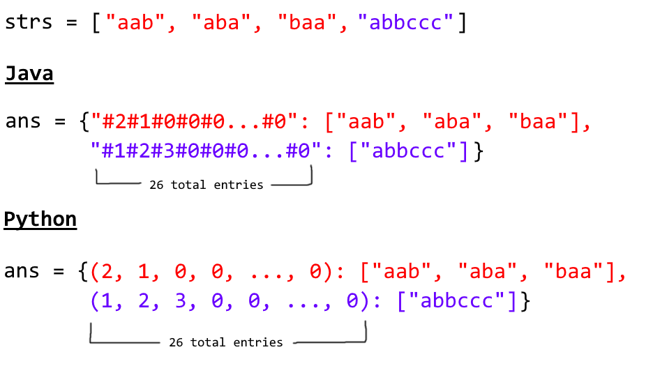

# 组卦

Given an array of strings, group anagrams together.

For example, given: ["eat", "tea", "tan", "ate", "nat", "bat"],
Return:

```
[
  ["ate", "eat","tea"],
  ["nat","tan"],
  ["bat"]
]
```
Note: All inputs will be in lower-case.


## algorithm_0:
```c++
class Solution {
public:
    vector<vector<string>> groupAnagrams(vector<string>& strs) {

        unordered_map<string,vector<string>> map_tmp;

        for (int i=0;i<strs.size();++i)
        {
            string tmp=strs[i];
            sort(tmp.begin(),tmp.end());
            auto iter=map_tmp.find(tmp);
            if (iter!=map_tmp.end())
            {
                iter->second.push_back(strs[i]);
            }
            else
                map_tmp.insert(make_pair(tmp,vector<string> {strs[i]}));
        }

        vector<vector<string>> res;
        for (auto i:map_tmp)
        {
            sort(i.second.begin(),i.second.end());
            res.push_back(i.second);
        }
        return res;
    }
};
```

## algorithm_2:

* Intuition

Two strings are anagrams if and only if their character counts (respective number of occurrences of each character) are the same.

* Algorithm

We can transform each string \text{s}s into a character count, \text{count}count, consisting of 26 non-negative integers representing the number of \text{a}a's, \text{b}b's, \text{c}c's, etc. We use these counts as the basis for our hash map.

In Java, the hashable representation of our count will be a string delimited with '#' characters. For example, abbccc will be #1#2#3#0#0#0...#0 where there are 26 entries total. In python, the representation will be a tuple of the counts. For example, abbccc will be (1, 2, 3, 0, 0, ..., 0), where again there are 26 entries total.



```java
class Solution {
    public List<List<String>> groupAnagrams(String[] strs) {
        if (strs.length == 0) return new ArrayList();
        Map<String, List> ans = new HashMap<String, List>();
        int[] count = new int[26];
        for (String s : strs) {
            Arrays.fill(count, 0);
            for (char c : s.toCharArray()) count[c - 'a']++;

            StringBuilder sb = new StringBuilder("");
            for (int i = 0; i < 26; i++) {
                sb.append('#');
                sb.append(count[i]);
            }
            String key = sb.toString();
            if (!ans.containsKey(key)) ans.put(key, new ArrayList());
            ans.get(key).add(s);
        }
        return new ArrayList(ans.values());
    }
}
```

[solution link](https://leetcode.com/problems/group-anagrams/solution/)


[上一级](base.md)
[上一篇](Combination_Sum_II.md)
[下一篇](Multiply_Strings.md)
