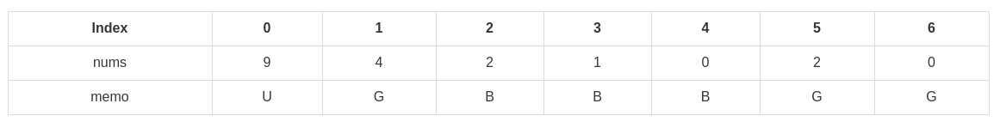

# 跳 游戏

Given an array of non-negative integers, you are initially positioned at the first index of the array.

Each element in the array represents your maximum jump length at that position.

Determine if you are able to reach the last index.

For example:
A = [2,3,1,1,4], return true.

A = [3,2,1,0,4], return false.

## algorithm_0:
*  Time Limit Exceeded(74 / 75 test cases passed.)

```c++
class Solution {
public:
    bool canJump(vector<int>& nums) {
        bool res=false;
        recurive(nums,0,res);
        return res;
    }

private:
    void recurive (vector<int> &nums,int begin,bool &flag)
    {
        if (flag==true)
            return;

        if (begin>=nums.size()-1)
        {
            flag=true;
            return ;
        }

        for (int i=nums[begin];i>0;--i)
        {
            recurive(nums,begin+i,flag);
             // cout<<"begin"<<begin<<endl;
        }
    }
};
```

## algorithm_1_0:

Once we have our code in the bottom-up state, we can make one final, important observation. From a given position, when we try to see if we can jump to a GOOD position, we only ever use one - the first one (see the break statement). In other words, the left-most one. If we keep track of this left-most GOOD position as a separate variable, we can avoid searching for it in the array. Not only that, but we can stop using the array altogether.

Iterating right-to-left, for each position we check if there is a potential jump that reaches a GOOD index (currPosition + nums[currPosition] >= leftmostGoodIndex). If we can reach a GOOD index, then our position is itself GOOD. Also, this new GOOD position will be the new leftmost GOOD index. Iteration continues until the beginning of the array. If first position is a GOOD index then we can reach the last index from the first position.

To illustrate this scenario, we will use the diagram below, for input array nums = [9, 4, 2, 1, 0, 2, 0]. We write G for GOOD, B for BAD and U for UNKNOWN. Let's assume we have iterated all the way to position 0 and we need to decide if index 0 is GOOD. Since index 1 was determined to be GOOD, it is enough to jump there and then be sure we can eventually reach index 6. It does not matter that nums[0] is big enough to jump all the way to the last index. All we need is one way.



```c++
class Solution {
public:
    bool canJump(vector<int>& nums) {

        int lastpos=nums.size()-1;

        for (int pos=nums.size()-1;pos>=0;--pos)
        {
            if (pos+nums[pos]>=lastpos)
                lastpos=pos;
        }
        return lastpos==0;
    }
};
```

[Solution link:four method](https://leetcode.com/problems/jump-game/solution/)
[上一级](README.md)
[上一篇](Group_Anagrams.md)
[下一篇](Merge_Intervals.md)
