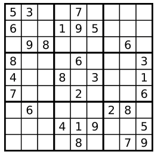

# 有效数独

Determine if a Sudoku is valid, according to: Sudoku Puzzles - The Rules.

The Sudoku board could be partially filled, where empty cells are filled with the character '.'.



A partially filled sudoku which is valid.

Note:
A valid Sudoku board (partially filled) is not necessarily solvable. Only the filled cells need to be validated.


algorithm_1:
```c++
class Solution
{
public:
    bool isValidSudoku(vector<vector<char> > &board)
    {
        int used1[9][9] = {0}, used2[9][9] = {0}, used3[9][9] = {0};

        for(int i = 0; i < board.size(); ++ i)
            for(int j = 0; j < board[i].size(); ++ j)
                if(board[i][j] != '.')
                {
                    int num = board[i][j] - '0' - 1, k = i / 3 * 3 + j / 3;
                    if(used1[i][num] || used2[j][num] || used3[k][num])
                        return false;
                    used1[i][num] = used2[j][num] = used3[k][num] = 1;
                }

        return true;
    }
};
```

algorithm_1_0:
```c++
class Solution {
public:
    bool isValidSudoku(vector<vector<char>>& board) {

        bool used1[9][9],used2[9][9],used3[9][9];

        memset(used1,false,sizeof(used1[0][0])*9*9);
        memset(used2,false,sizeof(used2[0][0])*9*9);
        memset(used3,false,sizeof(used3[0][0])*9*9);


        for (int row=0;row<9;row++)
            for (int column=0;column<9;column++)
            {
                //cout<<typeid(board[row][column]).name();
                if (board[row][column]=='.')
                    continue;
                int number=board[row][column]-'0'-1;
                int sub=row/3 *3 + column/3;
                if ( used1[row][number] || used2[column][number] || used3[sub][number] )
                    return false;
                used1[row][number]=true;
                used2[column][number]=true;
                used3[sub][number]=true;
            }
        return true;
    }
};
```

[source link](https://leetcode.com/problems/valid-sudoku/discuss/)


[上一级](base.md)
[上一篇](Swap_Nodes_in_Pairs.md)
[下一篇](ZigZag_Conversion.md)
