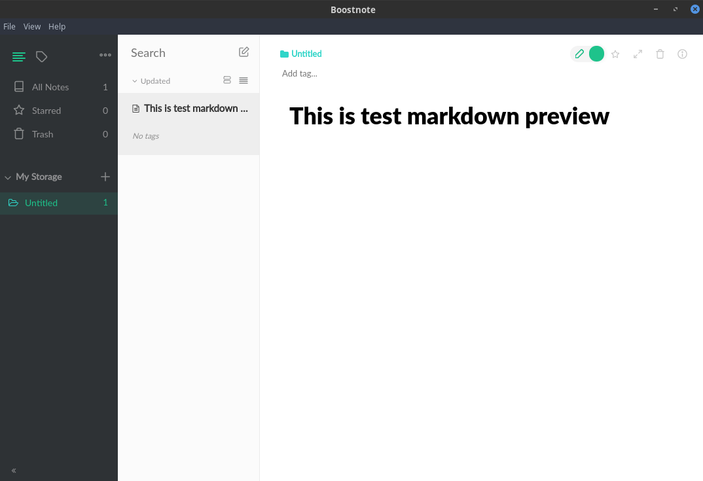

# fedora install boostnote

[Boostnote official](https://boostnote.io/)

1. Download boostnote .deb file
[Download](https://boostnote.io/#download)
2. Install alien
```sh
dnf install alien
```
3. convert .deb to .rpm
```sh
sudo alien -r boostnote.deb
```
4. Install ffmpeg
```sh
dnf install ffmpeg
```
5. Install boostnote
```sh
rpm -ivh boostnote.rpm
# 如果安装了 ffmpeg ，执行 rpm 安装时，依旧提示
# error: Failed dependencies:
# libffmpeg.so()(64bit) is needed by boostnote-0.10.0-2.x86_64

# 可使用
# rpm -ivh --nodeps --force boostnote
```

6. Run



## Link
[Please give instructions to make .rpm package for fedora](https://github.com/BoostIO/Boostnote/issues/304)
[How to Convert From RPM to DEB and DEB to RPM Package Using Alien](https://www.tecmint.com/convert-from-rpm-to-deb-and-deb-to-rpm-package-using-alien/)

---
- [上一级](README.md)
- 上一篇 -> [Install Ubuntu Gnome Desktop on android ](androidInstalUbuntu.md)
- 下一篇 -> [Build openGapps from github](buildOpengapps.md)
