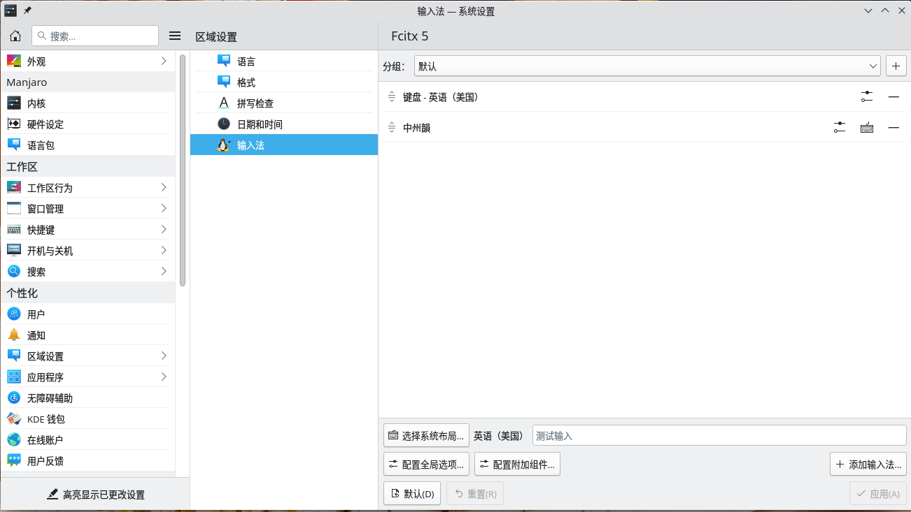

# 自定义 Manjaro 环境 


<!-- @import "[TOC]" {cmd="toc" depthFrom=1 depthTo=6 orderedList=false} -->

<!-- code_chunk_output -->

- [自定义 Manjaro 环境](#自定义-manjaro-环境)
  - [manjaro 简介](#manjaro-简介)
  - [配置及优化](#配置及优化)
    - [基础优化](#基础优化)
      - [换源](#换源)
      - [双系统下系统时间统一（非必须）](#双系统下系统时间统一非必须)
    - [yay](#yay)
      - [通过 yay 安装一些常用的软件](#通过-yay-安装一些常用的软件)
    - [Manjaro 包管理常用命令](#manjaro-包管理常用命令)
    - [配置中文输入法](#配置中文输入法)
    - [安装英伟达独立显卡驱动](#安装英伟达独立显卡驱动)
    - [美化](#美化)
  - [链接](#链接)

<!-- /code_chunk_output -->


## manjaro 简介

[Manjaro Linux](https://zh.wikipedia.org/zh-hk/Manjaro_Linux) 是基於 Arch Linux 的 Linux 發行版，使用 Xfce 、GNOME和 KDE Plasma 作為預設桌面環境，和 Arch 一樣，採用滾動更新。其目標是為 PC 提供易於使用的自由的作業系統。


## 配置及优化

### 基础优化 

#### 换源 

```sh
sudo pacman-mirrors -i -c China -m rank
# 推荐中科大源ustc

sudo echo "[archlinuxcn]\n
Server = https://mirrors.ustc.edu.cn/archlinuxcn/$arch" >> /etc/pacman.conf

sudo pacman -S archlinuxcn-keyring
```

#### 双系统下系统时间统一（非必须）

```sh
timedatectl set-local-rtc 1 --adjust-system-clock
timedatectl set-ntp 0
```

### yay

yay 是优秀的 AUR 包管理工具，可以用来代替 pacman，而且 yay 的语法跟 pacman 一模一样，有时间官方仓库没有想要的软件，就需要通过 yay 来安装。

有了 yay，以后就不用 `sudo pacman` 了

安装 yay ：

```sh
sudo pacman -Sy yay
```

配置镜像（清华镜像）
```sh
yay --aururl "https://aur.tuna.tsinghua.edu.cn" --save
```
#### 通过 yay 安装一些常用的软件 

|     软件名    |          包名          |                   描述                   |
|:-------------:|:----------------------:|:----------------------------------------:|
|     chrome    |      google-chrome     |                                          |
|    火焰截图   |        flameshot       | 还可以设置快捷键，命令/URL flameshot gui |
|   网易云音乐  |   netease-cloud-music  |                                          |
|    FeelUown   |      feeluown-git      |         全平台听歌平台，官方文档         |
|   timeshift   |        timeshift       |               系统备份还原               |
|      微信     |   deepin-wine-wechat   |                  wine版                  |
|      微信     |      freechat-uos      |                electron版                |
| Visual Studio | visual-studio-code-bin |                                          |
|       qq      |       electron-qq      |                                          |
|    有道词典   |       youdao-dict      |                                          |
|      Edge     |   microsoft-edge-dev   |                                          |
|      peek     |          peek          |                 录屏软件                 |

### Manjaro 包管理常用命令

```sh
# 对整个系统进行更新
sudo pacman -Syu

# 升级软件包
sudo pacman -Syu

# 安装或者升级单个软件包，或者一列软件包
sudo pacman -S package_name1 package_name2 ...

# 先同步包数据再执行安装
sudo pacman -Sy package_name

# 安装本地包(其拓展名为pkg.tar.gz或pkg.tar.xz)
sudo pacman -U local_package_name

# 安装一个远程包
sudo pacman -U url

# 在仓库中搜索含关键字的包
sudo pacman -Ss keyword

# 查看已安装软件
sudo pacman -Qs keyword

# 删除单个软件包，保留其全部已经安装的依赖关系
sudo pacman -R package_name

# 删除指定软件包，及其所有没有被其他已安装软件包使用的依赖关系
sudo pacman -Rs package_name

# 清理软件包缓存
sudo pacman -Sc

# 清除所有的缓存文件
sudo pacman -Scc

# 清除系统中无用的包
sudo pacman -$ $(pacman -Qdtq)

# 从 AUR 安装软件包
yay -S package

# yay 删除包
yay -Rns package

# 升级所有已安装的包
yay -Syu

# 打印系统统计信息
yay -Ps

# 检查安装的版本
yay -Qi package 

```

### 配置中文输入法 

```sh 
yay -S fcitx5-im fcitx5-rime rime-cloverpinyin fcitx5-pinyin-zhwiki-rime fcitx5-material-color
```

编辑 `/etc/environment` 并添加如下文本：
```sh
GTK_IM_MODULE=fcitx
QT_IM_MODULE=fcitx
XMODIFIERS=@im=fcitx
SDL_IM_MODULE=fcitx #for some games (like Dota2) that use a vendor-modified version of SDL2 library.
```

选择输入法 :



### 安装英伟达独立显卡驱动

```sh
# 查看已安装的硬件驱动  
mhwd -li

sudo mhwd -i pci video-nvidia
sudo pacman -S linuxXXX-headers acpi_call-dkms xorg-xrandr xf86-video-intel git
# 其中，linuxXXX-header 替换为当前的内核版本，例如 5.10 内核就用 linux510-headers
sudo modprobe acpi_call
```

### 美化 
可使用 variet 自动更换壁纸

## 链接 

- [Manjaro 配置及优化](https://segmentfault.com/a/1190000039901064)
- [manjaro新手入门使用方法](https://www.dhzy.fun/archives/3608.html)
- [安装使用fcitx5输入法](https://blog.51cto.com/u_15076215/3475710)
- [How to install Chinese fonts and input method in Arch Linux](https://slmeng.medium.com/how-to-install-chinese-fonts-and-input-method-in-arch-linux-18b68d2817e7)
- [arch wiki - Fcitx5](https://wiki.archlinux.org/title/Fcitx5#Chinese)

---

- [上一级](README.md)
- 上一篇 -> [ctl + alt + f3 login incorrect](ctrl_alt_f3_login_incorrect.md)
- 下一篇 -> [自定义fedora桌面环境](custom_desktop_env.md)
