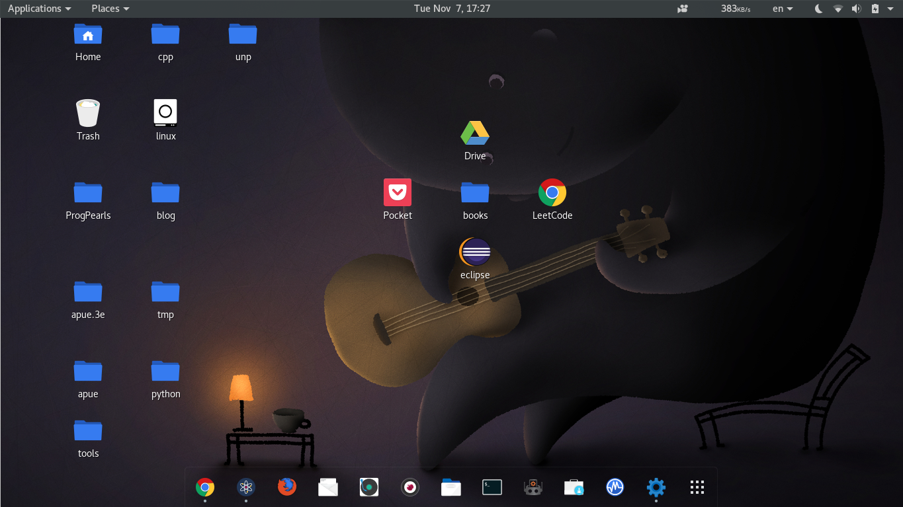
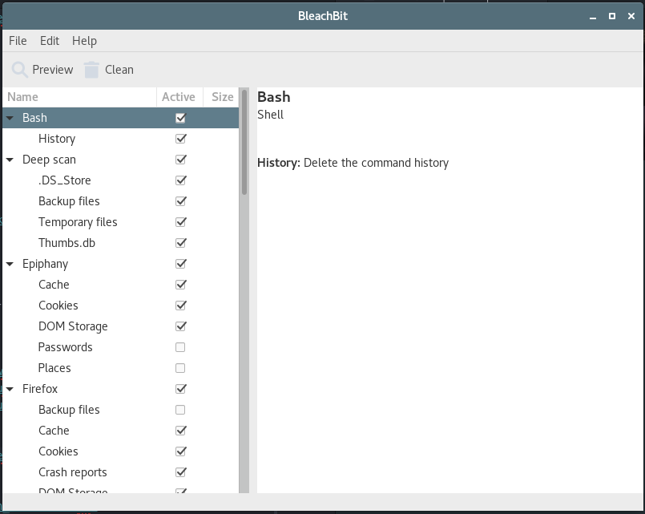
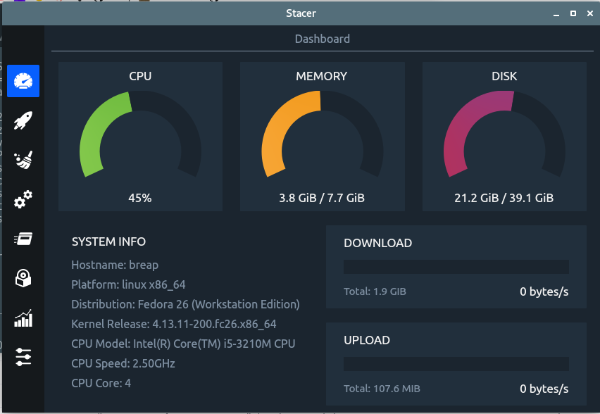
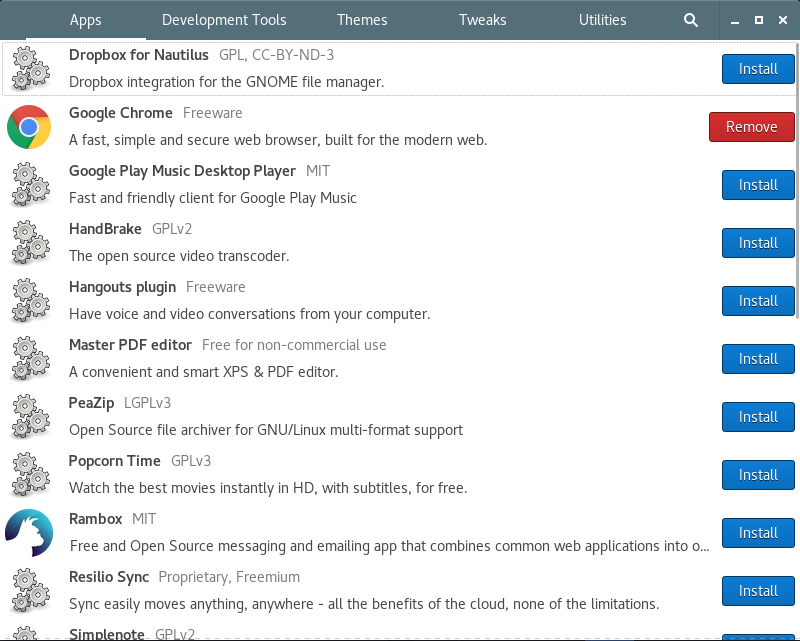
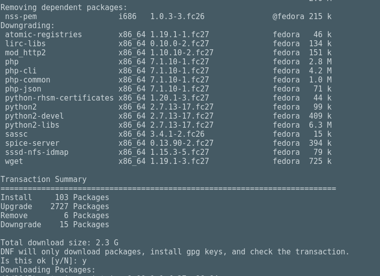
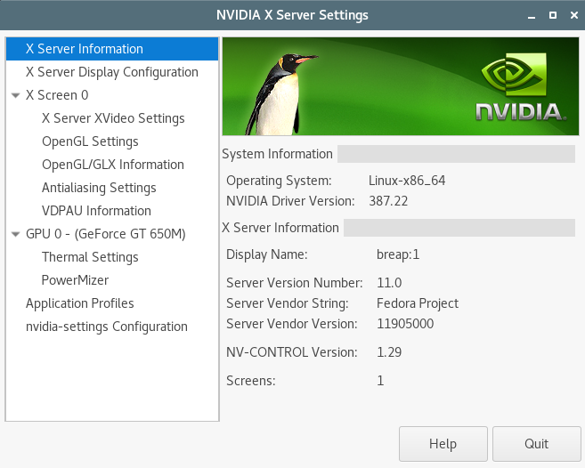

# 自定义fedora桌面环境


<!-- @import "[TOC]" {cmd="toc" depthFrom=1 depthTo=6 orderedList=false} -->
<!-- code_chunk_output -->

* [自定义fedora桌面环境](#自定义fedora桌面环境)
	* [gnome shell extensions](#gnome-shell-extensions)
	* [gnome theme](#gnome-theme)
	* [gnome icons](#gnome-icons)
	* [gnome cusor](#gnome-cusor)
	* [显示效果](#显示效果)
	* [截屏](#截屏)
	* [系统清理工具](#系统清理工具)
	* [utilties](#utilties)
	* [upgrade fedora26 to fedora27](#upgrade-fedora26-to-fedora27)
	* [fedora 27 install nvidia-driver](#fedora-27-install-nvidia-driver)
	* [youtube downloader](#youtube-downloader)
		* [merge video and audio](#merge-video-and-audio)
	* [Change the default boot entry](#change-the-default-boot-entry)
		* [List the default kernel](#list-the-default-kernel)
		* [List all the kernel menu entries](#list-all-the-kernel-menu-entries)
		* [Change the default boot entry](#change-the-default-boot-entry-1)

<!-- /code_chunk_output -->


## gnome shell extensions

1. NetSpeed

2. EasyScreenCast

3. Laine

4. Dash to Dock

5. Gno-Menu

[youtube video link](https://www.youtube.com/watch?v=YFvFo5sUAhw)


## gnome theme

1. [paper-gtk-theme](https://github.com/snwh/paper-gtk-theme)

2. [numix-gtk-theme](https://github.com/numixproject/numix-gtk-theme)

3. [adapta-gtk-theme](https://github.com/adapta-project/adapta-gtk-theme)

4. [arc-theme](https://github.com/horst3180/arc-theme)

5. [minimalism](http://xenlism.github.io/minimalism/)

[youtube video link](https://www.youtube.com/watch?v=o8pfCuBOlXE)

## gnome icons

1. [Flat-Remix](https://github.com/daniruiz/Flat-Remix)

## gnome cusor

1. [Breeze Serie](https://www.gnome-look.org/content/show.php?content=164300)

[youtube link](https://www.youtube.com/watch?v=XKc5DXa8JSs&t=70s)

## 显示效果

采用：
1. NetSpeed
2. EasyScreenCast
3. Dash to Dock
4. paper-gtk-theme
5. Flat-Remix
6. Breeze Serie



## 截屏

实现快捷截取选择屏幕区域:
"alter + a" -> "shutter -s -e"

## 系统清理工具

1. [bleachbit](https://www.bleachbit.org/)



2. [stacer](https://github.com/oguzhaninan/Stacer)



3. [gcleaner](https://launchpad.net/gcleaner)

[youtube link](https://www.youtube.com/watch?v=wdC1n18kv_E&t=283s)

## utilties

1. [fedy](https://www.folkswithhats.org/)



2. [overgrive](https://www.thefanclub.co.za/overgrive)

[youtube link](https://youtu.be/-rnnhcTqgys)

## upgrade fedora26 to fedora27

```sh
dnf install dnf-plugin-system-upgrade
dnf --refresh upgrade
dnf --allowerasing system-upgrade download --releasever=27
dnf system-upgrade reboot
```

历时大约1小时

[link](https://fedoramagazine.org/upgrading-fedora-25-fedora-26/)

## fedora 27 install nvidia-driver
```sh
dnf install xorg-x11-drv-nvidia akmod-nvidia "kernel-devel-uname-r == $(uname -r)"
dnf install xorg-x11-drv-nvidia-cuda
dnf install vulkan
dnf install vdpauinfo libva-vdpau-driver libva-utils
dnf install libvdpau-va-gl
vdpauinfo
reboot
```



[source link](https://rpmfusion.org/Howto/NVIDIA)
[youtube link](https://www.youtube.com/watch?v=oTUMO7gHmXg)


## youtube downloader
```sh
dnf install youtube-dl
```

list-formats:
```sh
youtube-dl -F $httpVideoAdress
```
format:
```sh
format code  extension  resolution note
139          m4a        audio only DASH audio   48k , m4a_dash container, mp4a.40.5@ 48k (22050Hz), 1.20MiB
249          webm       audio only DASH audio   50k , opus @ 50k, 1.25MiB
250          webm       audio only DASH audio   66k , opus @ 70k, 1.62MiB
171          webm       audio only DASH audio  124k , vorbis@128k, 3.05MiB
140          m4a        audio only DASH audio  128k , m4a_dash container, mp4a.40.2@128k (44100Hz), 3.20MiB
251          webm       audio only DASH audio  130k , opus @160k, 3.22MiB
278          webm       256x144    144p  109k , webm container, vp9, 30fps, video only, 2.49MiB
160          mp4        256x144    DASH video  112k , avc1.4d400c, 30fps, video only, 2.24MiB
133          mp4        426x240    DASH video  247k , avc1.4d4015, 30fps, video only, 4.35MiB
242          webm       426x240    240p  261k , vp9, 30fps, video only, 5.84MiB
243          webm       640x360    360p  497k , vp9, 30fps, video only, 10.81MiB
134          mp4        640x360    DASH video  638k , avc1.4d401e, 30fps, video only, 11.08MiB
244          webm       854x480    480p  933k , vp9, 30fps, video only, 19.78MiB
135          mp4        854x480    DASH video 1173k , avc1.4d401f, 30fps, video only, 22.07MiB
247          webm       1280x720   720p 1795k , vp9, 30fps, video only, 39.11MiB
136          mp4        1280x720   720p 2381k , avc1.4d401f, 30fps, video only, 42.24MiB
302          webm       1280x720   720p60 2887k , vp9, 60fps, video only, 66.86MiB
248          webm       1920x1080  1080p 3135k , vp9, 30fps, video only, 69.00MiB
298          mp4        1280x720   DASH video 3498k , avc1.4d4020, 60fps, video only, 73.15MiB
137          mp4        1920x1080  1080p 4398k , avc1.640028, 30fps, video only, 77.22MiB
303          webm       1920x1080  1080p60 4804k , vp9, 60fps, video only, 111.90MiB
299          mp4        1920x1080  DASH video 6725k , avc1.64002a, 60fps, video only, 137.38MiB
264          mp4        2560x1440  DASH video 9238k , avc1.640032, 30fps, video only, 163.66MiB
271          webm       2560x1440  1440p 9910k , vp9, 30fps, video only, 219.95MiB
308          webm       2560x1440  1440p60 13850k , vp9, 60fps, video only, 330.02MiB
313          webm       3840x2160  2160p 20016k , vp9, 30fps, video only, 451.05MiB
266          mp4        3840x2160  DASH video 22466k , avc1.640033, 30fps, video only, 387.77MiB
315          webm       3840x2160  2160p60 27872k , vp9, 60fps, video only, 662.98MiB
17           3gp        176x144    small , mp4v.20.3, mp4a.40.2@ 24k
36           3gp        320x180    small , mp4v.20.3, mp4a.40.2
18           mp4        640x360    medium , avc1.42001E, mp4a.40.2@ 96k
43           webm       640x360    medium , vp8.0, vorbis@128k
22           mp4        1280x720   hd720 , avc1.64001F, mp4a.40.2@192k (best)
```

Download video in the specified format

```sh
youtube-dl -f 266 $httpVideoAdress
```

### merge video and audio

In case of MP4 format (all, except 1440p 60fps & 2160p 60fps):
```sh
ffmpeg -i videoplayback.mp4 -i videoplayback.m4a -c:v copy -c:a copy output.mp4
```

In case of WebM format (1440p 60fps and 2160p 60fps):
```sh
ffmpeg -i videoplayback.webm -i videoplayback.m4a -c:v copy -c:a copy output.mkv
```

[source link](https://kwizzu.com/construct.html)

## Change the default boot entry

### List the default kernel
```sh
[root@breap breap]# grubby --default-kernel
/boot/vmlinuz-4.14.11-300.fc27.x86_64
```

### List all the kernel menu entries

```sh
[root@breap breap]# grubby --info=ALL
index=0
kernel=/boot/vmlinuz-4.14.13-300.fc27.x86_64
args="ro rd.lvm.lv=fedora/root rd.lvm.lv=fedora/swap rhgb quiet LANG=en_US.UTF-8 rd.driver.blacklist=nouveau modprobe.blacklist=nouveau nvidia-drm.modeset=1"
root=/dev/mapper/fedora-root
initrd=/boot/initramfs-4.14.13-300.fc27.x86_64.img
title=Fedora (4.14.13-300.fc27.x86_64) 27 (Workstation Edition)
index=1
kernel=/boot/vmlinuz-4.14.11-300.fc27.x86_64
args="ro rd.lvm.lv=fedora/root rd.lvm.lv=fedora/swap rhgb quiet LANG=en_US.UTF-8 rd.driver.blacklist=nouveau modprobe.blacklist=nouveau nvidia-drm.modeset=1"
root=/dev/mapper/fedora-root
initrd=/boot/initramfs-4.14.11-300.fc27.x86_64.img
title=Fedora (4.14.11-300.fc27.x86_64) 27 (Workstation Edition)
index=2
kernel=/boot/vmlinuz-4.14.8-300.fc27.x86_64
args="ro rd.lvm.lv=fedora/root rd.lvm.lv=fedora/swap rhgb quiet LANG=en_US.UTF-8 rd.driver.blacklist=nouveau modprobe.blacklist=nouveau nvidia-drm.modeset=1"
root=/dev/mapper/fedora-root
initrd=/boot/initramfs-4.14.8-300.fc27.x86_64.img
title=Fedora (4.14.8-300.fc27.x86_64) 27 (Workstation Edition)
index=3
kernel=/boot/vmlinuz-0-rescue-c0d86e2df9d743b0beaed7411a4d0289
args="ro rd.lvm.lv=fedora/root rd.lvm.lv=fedora/swap rhgb quiet rd.driver.blacklist=nouveau modprobe.blacklist=nouveau nvidia-drm.modeset=1"
root=/dev/mapper/fedora-root
initrd=/boot/initramfs-0-rescue-c0d86e2df9d743b0beaed7411a4d0289.img
title=Fedora (0-rescue-c0d86e2df9d743b0beaed7411a4d0289) 26 (Workstation Edition)
index=4
non linux entry
index=5
non linux entry
index=6
non linux entry
```

### Change the default boot entry
```sh
[root@breap breap]# grubby --set-default /boot/vmlinuz-4.14.11-300.fc27.x86_64
```

[Fedora GRUB2 BOOT Loader](https://docs.fedoraproject.org/f26/system-administrators-guide/kernel-module-driver-configuration/Working_with_the_GRUB_2_Boot_Loader.html)


[上一级](base.md)
[上一篇](ctrl_alt_f3_login_incorrect.md)
[下一篇](gen_cpp_bin.md)
