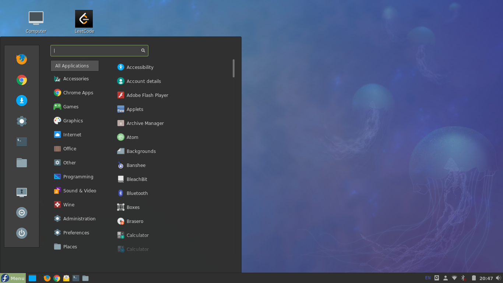
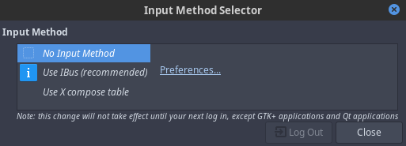
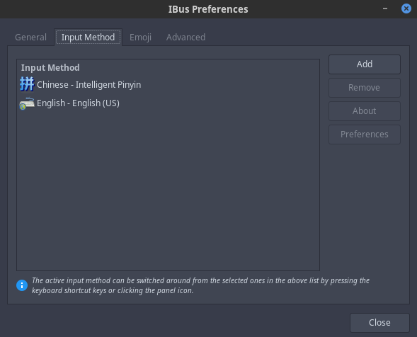

<!-- fedora install cinnamon desktop -->


<!-- @import "[TOC]" {cmd="toc" depthFrom=1 depthTo=6 orderedList=false} -->
<!-- code_chunk_output -->

- [Cinnamon](#cinnamon)
- [Install cinnamon desktop](#install-cinnamon-desktop)
- [Add chinese input](#add-chinese-input)

<!-- /code_chunk_output -->

## Cinnamon



## Install cinnamon desktop

```sh
dnf install @cinnamon-desktop
```

## Add chinese input

Use ibus:

```sh
dnf install imsettings-cinnamon
im-chooser
```


[How to use ibus for inputting Chinese in Cinnamon on Fedora](https://www.systutorials.com/qa/512/how-to-use-ibus-for-inputting-chinese-in-cinnamon-on-fedora)

Ibus add chinese input:

```sh
ibus-setup
```


---
- [上一级](README.md)
- 上一篇 -> [fedora create custom desktop shortcut](fedoraCreateCustomDesktopShortcut.md)
- 下一篇 -> [自动编译并运行cpp程序shell脚本](gen_cpp_bin.md)
