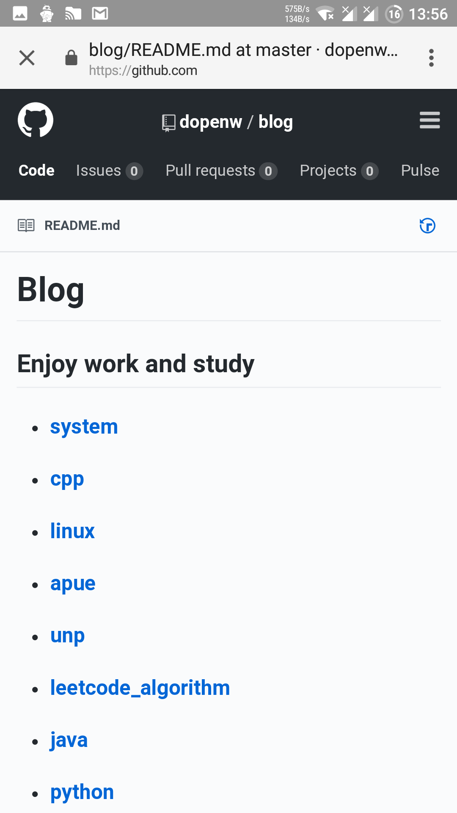
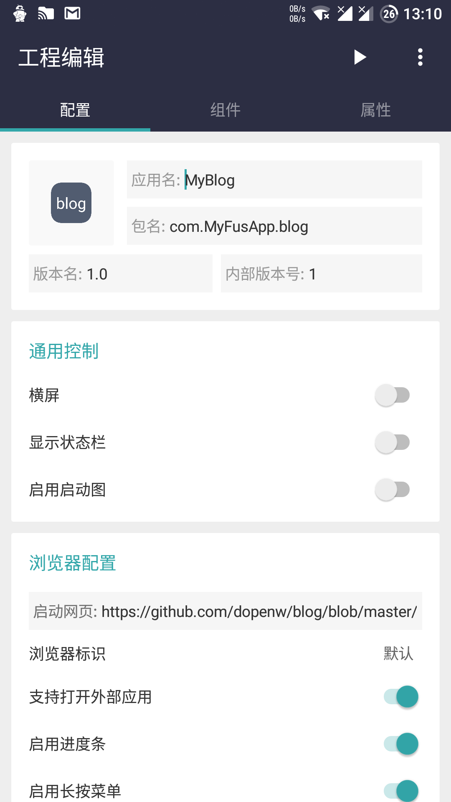
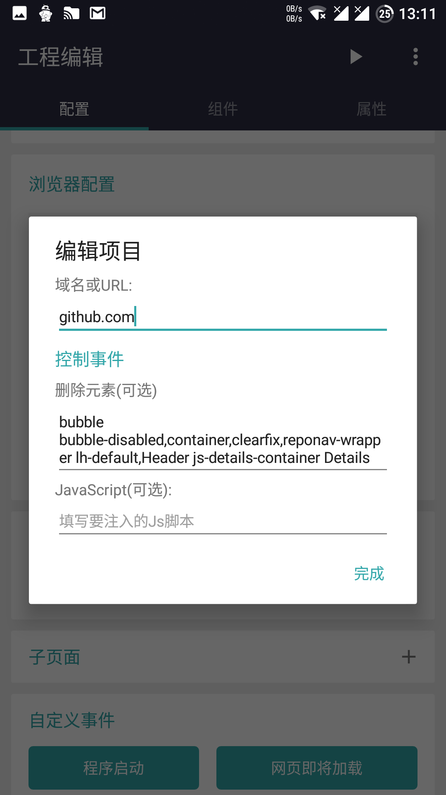
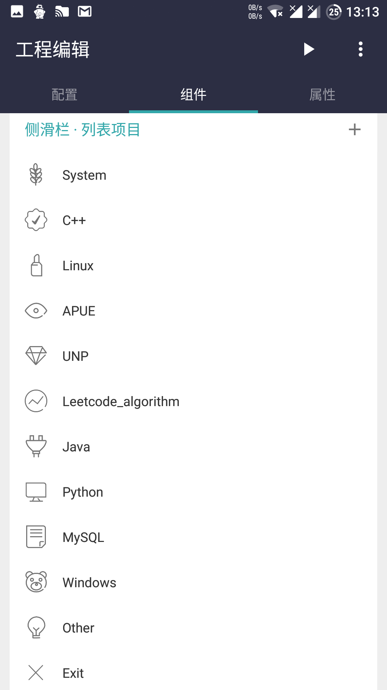
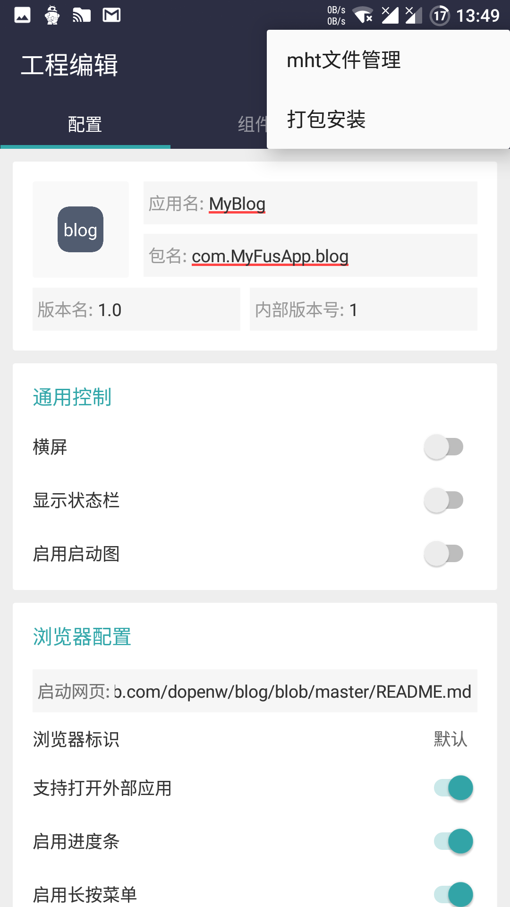
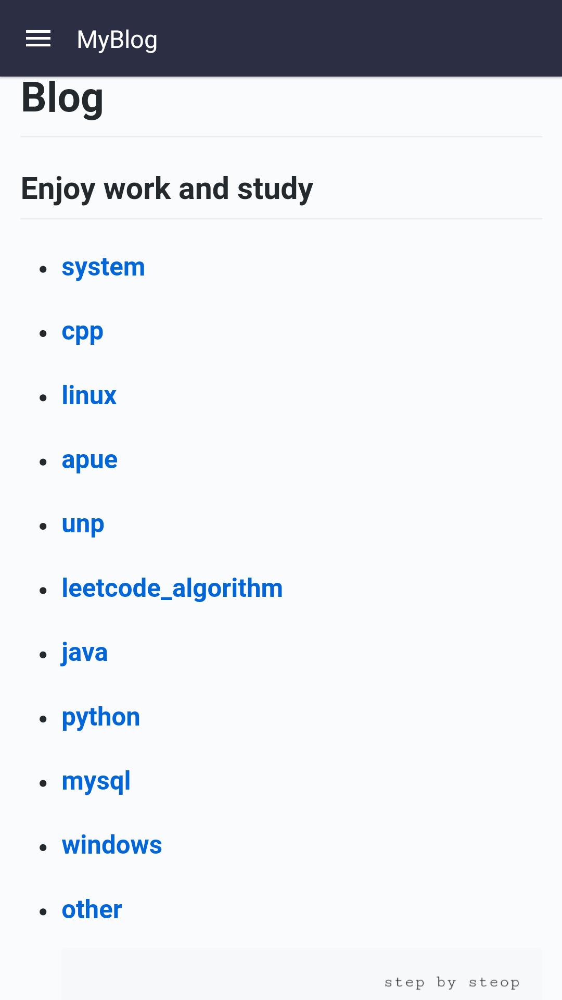
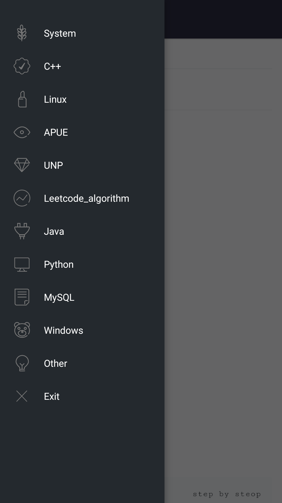
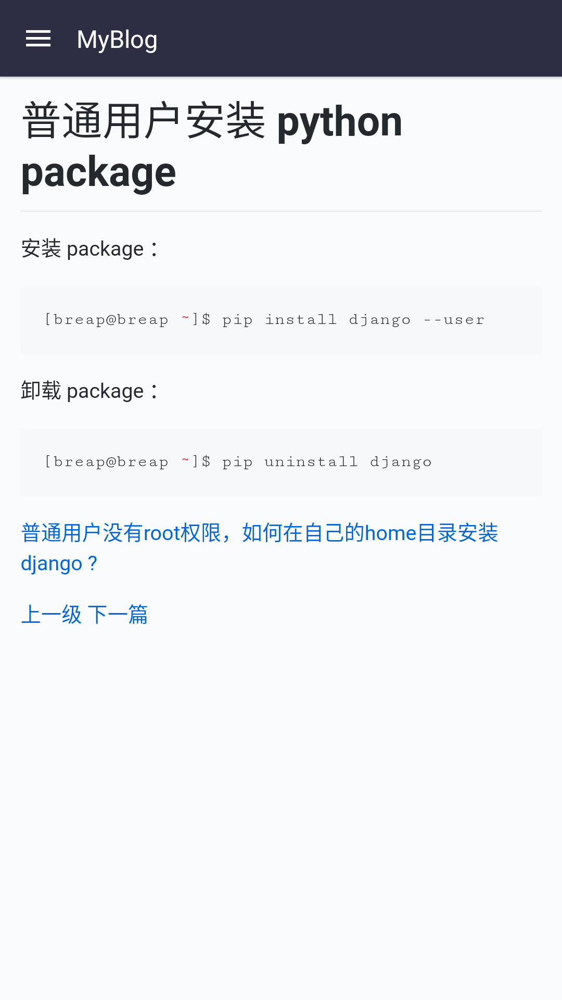

# 利用 Fusion App 创建个人blog安卓客户端


<!-- @import "[TOC]" {cmd="toc" depthFrom=1 depthTo=6 orderedList=false} -->
<!-- code_chunk_output -->

* [利用 Fusion App 创建个人blog安卓客户端](#利用-fusion-app-创建个人blog安卓客户端)
	* [Fusion App 简介](#fusion-app-简介)
	* [手机浏览器预览](#手机浏览器预览)
	* [创建一个顶栏模板](#创建一个顶栏模板)
	* [添加启动网页](#添加启动网页)
	* [添加网页控制](#添加网页控制)
	* [添加侧滑栏](#添加侧滑栏)
		* [设置项目点击事件](#设置项目点击事件)
	* [打包安装 MyBlog](#打包安装-myblog)

<!-- /code_chunk_output -->


## Fusion App 简介

FusionApp是一款新概念"网页转应用"的应用。它可以将网页翻新改造，获得近乎客户端的体验。

* [酷安 Fusion App ](https://www.coolapk.com/apk/cn.coldsong.fusionapp)
* [基础视频演示教程](https://www.bilibili.com/video/av20964863?share_medium=android&share_source=copy_link&bbid=8E9421B2-19DF-4A7F-9D1C-FF7D9557C7BD44884infoc&ts=1521452507641)
* [高级视频演示教程](https://www.bilibili.com/video/av21276227?share_medium=android&share_source=copy_link&bbid=8E9421B2-19DF-4A7F-9D1C-FF7D9557C7BD44884infoc&ts=1522107475891)


## 手机浏览器预览



## 创建一个顶栏模板



## 添加启动网页

```sh
https://github.com/dopenw/blog/blob/master/README.md
```

## 添加网页控制



删除元素：
```sh
bubble bubble-disabled,container,clearfix,reponav-wrapper lh-default,Header js-details-container Details f4 lh-default,breadcrumb blob-breadcrumb
```

## 添加侧滑栏



### 设置项目点击事件

加载网页：
```sh
加载网页("https://github.com/dopenw/blog/blob/master/system/README.md")
```

退出程序：
```sh
退出程序()
```

## 打包安装 MyBlog

点击打包安装：



程序预览：








---
- [上一级](README.md)
- 下一篇 -> [install VS Code in an Android Device](androidRunVsCode.md)
