# Atom

<!-- @import "[TOC]" {cmd="toc" depthFrom=1 depthTo=6 orderedList=false} -->
<!-- code_chunk_output -->

* [Atom](#atom)
	* [Atom 简介](#atom-简介)
	* [优秀的插件](#优秀的插件)
		* [atom-beautify](#atom-beautify)
		* [atom-clock](#atom-clock)
		* [atom-html-preview](#atom-html-preview)
		* [goto-definition](#goto-definition)
		* [highlight-selected](#highlight-selected)
		* [language-lua](#language-lua)
		* [linter-XXX](#linter-xxx)
		* [markdown-preview-enhanced](#markdown-preview-enhanced)
		* [minimap](#minimap)
		* [minimap-highlight-selected](#minimap-highlight-selected)
		* [minimap-linter](#minimap-linter)
		* [platformio-ide-terminal](#platformio-ide-terminal)
		* [symbols-tree-view](#symbols-tree-view)
		* [file-icons](#file-icons)
		* [docblockr](#docblockr)
		* [highlight-line](#highlight-line)
	* [Link](#link)

<!-- /code_chunk_output -->

## Atom 简介

Atom 编辑器是一个优秀、开源、跨平台的文本编辑器，且具有丰富的插件库和主题库。

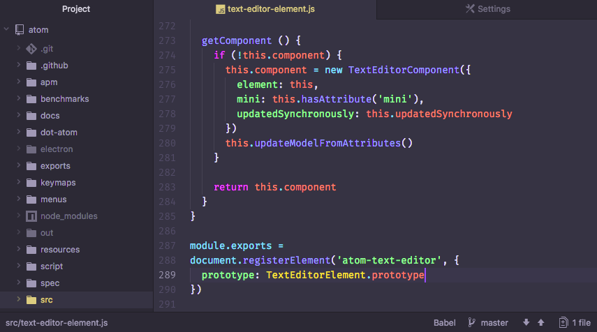

[Atom官网](https://atom.io/)

## 优秀的插件

### atom-beautify

[atom-beautify](https://atom.io/packages/atom-beautify)

atom-beautify 是一个代码美化工具，可以让你保存代码时美化代码。

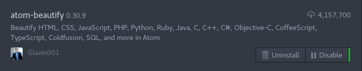

需要安装 clang-format :
* 下载 [LLVM](http://releases.llvm.org/download.html)
* 将上一步中下载好的 Pre-Built Binaries 里面的 bin/clang-format 拷贝到相应的路径下(取决于 atom-beautify 设置里面的执行文件路径)

### atom-clock
[atom-clock](https://atom.io/packages/atom-clock)

### atom-html-preview

[atom-html-preview](https://atom.io/packages/atom-html-preview)

atom-html-preview 是一个 html 预览工具。

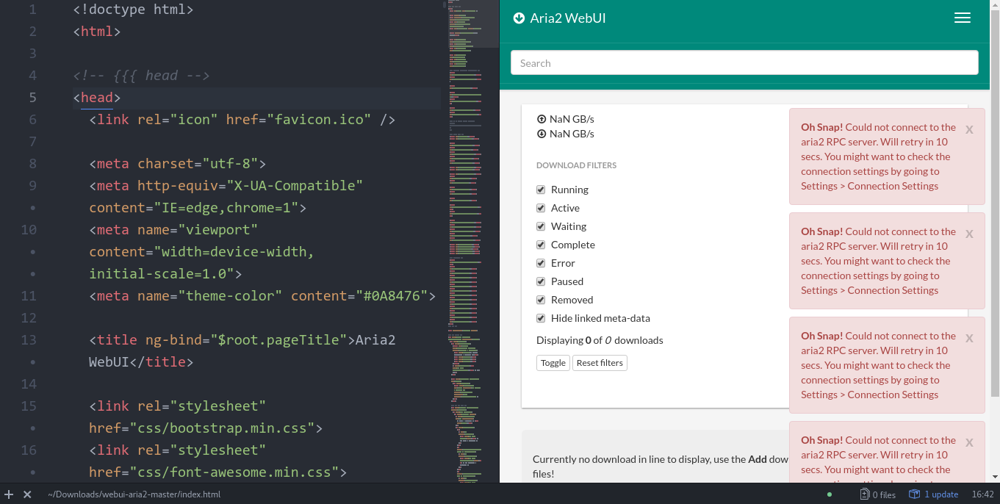

### goto-definition

[goto-definition](https://atom.io/packages/goto-definition)

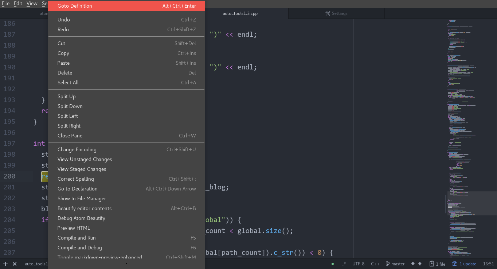

### highlight-selected

[highlight-selected](https://atom.io/packages/highlight-selected)

Highlights the current word selected when double clicking

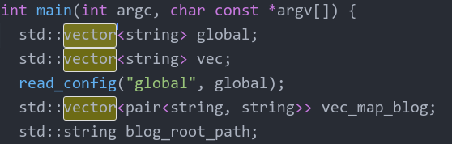

### language-lua

[language-lua](https://atom.io/packages/language-lua)

Add syntax highlighting and snippets to Lua files in Atom

### linter-XXX

检查相关语言有没有语法错误

### markdown-preview-enhanced

[markdown-preview-enhanced](https://atom.io/packages/markdown-preview-enhanced)

markdown-preview-enhanced 是一个增强版的 markdown 预览工具

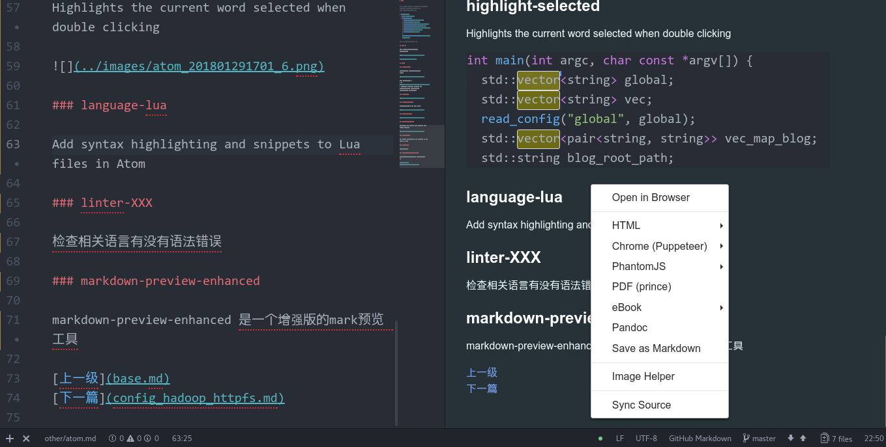

### minimap

[minimap](https://atom.io/packages/minimap)

代码地图

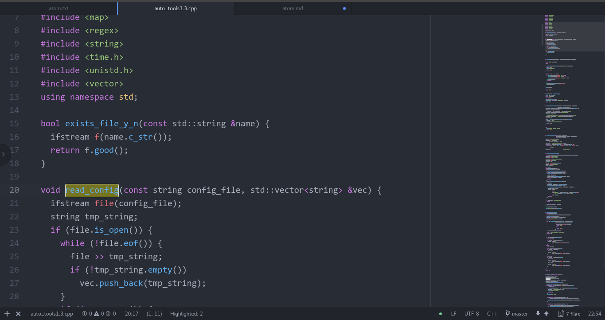

### minimap-highlight-selected

[minimap-highlight-selected](https://atom.io/packages/minimap-highlight-selected)

A minimap binding for the highlight-selected package

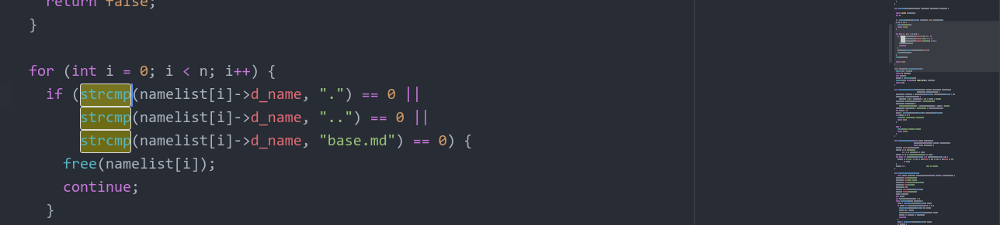

### minimap-linter

[minimap-linter](https://atom.io/packages/minimap-linter)

Minimap display for Linter messages

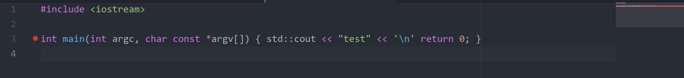

### platformio-ide-terminal

[platformio-ide-terminal](https://atom.io/packages/platformio-ide-terminal)

A terminal package for Atom, complete with themes, API and more for PlatformIO IDE. Fork of terminal-plus.

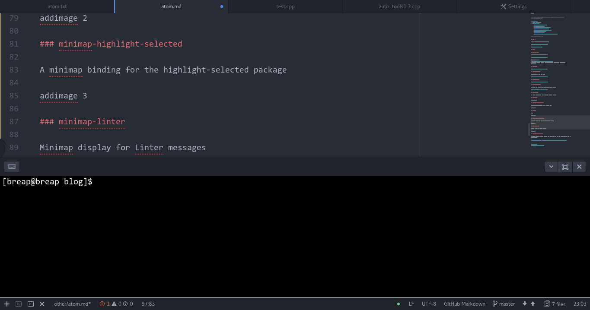

### symbols-tree-view

[symbols-tree-view](https://atom.io/packages/symbols-tree-view)

A symbols view like taglist

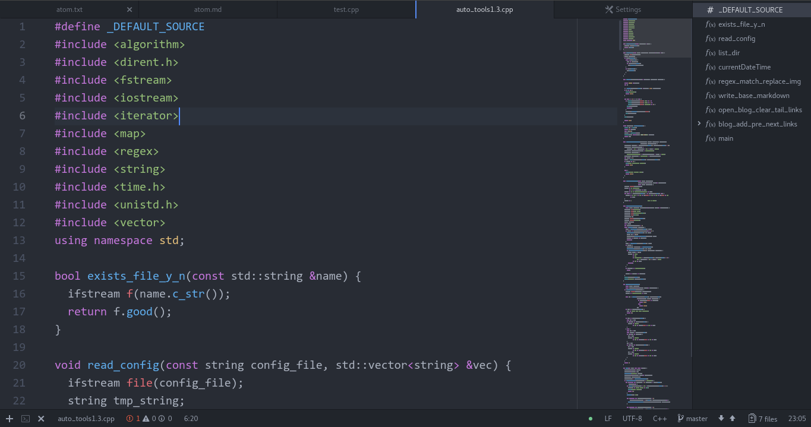

### file-icons

[file-icons](https://atom.io/packages/file-icons)

Assign file extension icons and colours for improved visual grepping

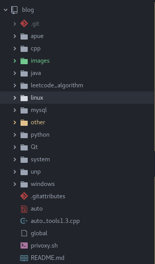

### docblockr

[docblockr](https://atom.io/packages/docblockr)

这个插件可以帮助你快速的生成注释

### highlight-line

[highlight-line ](https://atom.io/packages/highlight-line)

Highlights the current line in the editor

## Link

[开发神器Atom编辑器优秀插件推荐](https://blog.wangjunfeng.com/archives/647)

[上一级](base.md)
[上一篇](UseFusionAppCreateBlogApp.md)
[下一篇](config_hadoop_httpfs.md)
