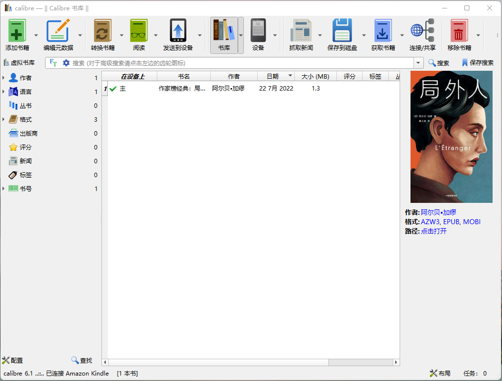

<!-- 查找书籍并发送到 kindle -->

<!-- @import "[TOC]" {cmd="toc" depthFrom=1 depthTo=6 orderedList=false} -->

<!-- code_chunk_output -->

- [书籍网站](#书籍网站)
- [转换为 Kindle 支持的格式](#转换为-kindle-支持的格式)
- [修复 Kindle 电子书封面显示为“暂无图片”的问题](#修复-kindle-电子书封面显示为暂无图片的问题)
- [相关连接](#相关连接)

<!-- /code_chunk_output -->

# 书籍网站 
- [Z-Library 项目的一部分. 全球最大的数字图书馆](https://zh.usa1lib.org/)
- [熊猫搜书（电子书网站导航)](https://xmsoushu.com/#/)

# 转换为 Kindle 支持的格式 

1. 安装并打开 [calibre](https://github.com/kovidgoyal/calibre) 软件
2. 添加下载的书籍 
3. 转换为 mobi/azw3 格式
4. 以 USB 方式连接 Kindle 
5. 保存到磁盘 -> 以单一文件保存到磁盘 -> `${Kindle根目录}`/documents

# 修复 Kindle 电子书封面显示为“暂无图片”的问题
1. 以 USB 方式连接 Kindle 
2. 下载并打开 [Fix-Kindle-Ebook-Cover](https://github.com/bookfere/Fix-Kindle-Ebook-Cover)
3. 待软件找到 Kindle 设备后，点击 "Fix Cover" 按钮即可

# 相关连接 

- [9个免费电子书下载网站，实现电子书自由](https://zhuanlan.zhihu.com/p/444880913)
- [How to read EPUB books on your Kindle](https://www.digitaltrends.com/mobile/how-to-read-epub-books-on-your-kindle/#:~:text=Kindle%20supports%20Amazon's%20proprietary%20format,allow%20you%20to%20do%20this.)
- [如何彻底解决 Kindle 电子书封面显示为“暂无图片”的问题](https://bookfere.com/post/986.html)
- [Fix Kindle Ebook Cover：电子书封面缩略图修复工具](https://bookfere.com/post/994.html)- [上一级](README.md)

---

- 上一篇 -> [fedora install SS libev](fedoraInstallSS.md)
- 下一篇 -> [c/c++面试](find_a_job.md)
