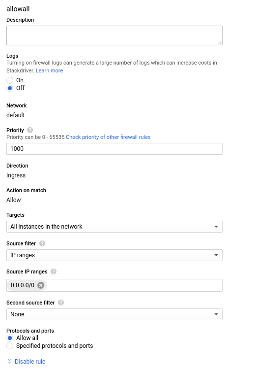

# google cloud 使用

## 设置防火墙
NETWORKING->VPC Network->Filewall rules

eg:

## 设置静态 ip 地址
NETWORKING->VPC Network->External IP addresses

change Type to Static IP

## 创建 vm instance
COMPUTE-> Compute Engine -> VM instances

## Link
* [用Google Cloud Platform搭建服务教程](http://godjose.com/2017/06/14/new-article/)

---
- [上一级](README.md)
- 上一篇 -> [c/c++面试](find_a_job.md)
- 下一篇 -> [google Tips](google_search_tips.md)
