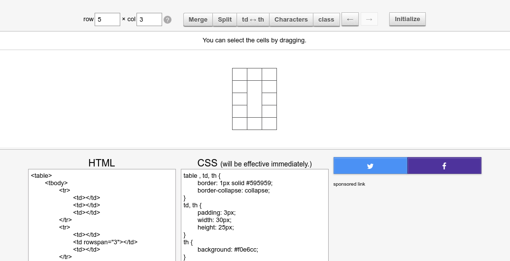

# markdown 嵌入 HTML table，让其具有更多的特性

<!-- @import "[TOC]" {cmd="toc" depthFrom=1 depthTo=6 orderedList=false} -->
<!-- code_chunk_output -->

* [markdown 嵌入 HTML table，让其具有更多的特性](#markdown-嵌入-html-table让其具有更多的特性)
	* [生成合并了单元格的 HTML table](#生成合并了单元格的-html-table)
	* [使用在线工具编辑 HTML table](#使用在线工具编辑-html-table)
	* [借助另外一个online tools，简化前面的步骤(合二为一)](#借助另外一个online-tools简化前面的步骤合二为一)
	* [将编辑好的 HTML table 复制到 md 文件](#将编辑好的-html-table-复制到-md-文件)
	* [参考链接](#参考链接)

<!-- /code_chunk_output -->

## 生成合并了单元格的 HTML table

打开 [merge table cell online tools](https://tabletag.net/)

示例：

## 使用在线工具编辑 HTML table

打开 [html online edit and preview tools ](https://html-online.com/editor/)

示例：

## 借助另外一个online tools，简化前面的步骤(合二为一)

[Tables Generator](https://www.tablesgenerator.com/html_tables)

## 将编辑好的 HTML table 复制到 md 文件

<table style="width: 436px;">
<tbody>
<tr style="text-align: center; height: 15px;">
<td style="width: 137px; height: 15px; text-align: center;">1</td>
<td style="width: 130px; height: 15px;">&nbsp;1</td>
<td style="width: 152px; height: 15px; text-align: center;">1</td>
</tr>
<tr style="text-align: center; height: 15px;">
<td style="width: 137px; text-align: center; height: 15px;">2&nbsp;</td>
<td style="width: 130px; height: 34.6667px;" rowspan="3">merge&nbsp;</td>
<td style="width: 152px; height: 15px;">2&nbsp;</td>
</tr>
<tr style="height: 15px;">
<td style="width: 137px; text-align: center; height: 15px;">3&nbsp;</td>
<td style="width: 152px; height: 15px; text-align: center;">3&nbsp;</td>
</tr>
<tr style="height: 4.66667px;">
<td style="width: 137px; text-align: center; height: 4.66667px;">4&nbsp;</td>
<td style="width: 152px; height: 4.66667px; text-align: center;">4&nbsp;</td>
</tr>
<tr style="height: 15px;">
<td style="width: 137px; text-align: center; height: 15px;">5&nbsp;</td>
<td style="width: 130px; height: 15px; text-align: center;">5&nbsp;</td>
<td style="width: 152px; height: 15px; text-align: center;">5&nbsp;</td>
</tr>
</tbody>
</table>

## 参考链接
[Can I merge table rows in markdown
](https://stackoverflow.com/questions/46621765/can-i-merge-table-rows-in-markdown)
[上一级](README.md)
[上一篇](google_search_tips.md)
[下一篇](openresty_test.md)
