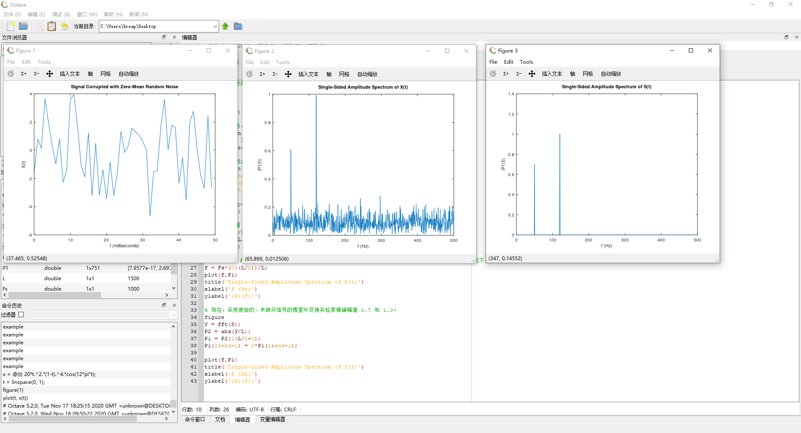

# Octave 的简单使用


<!-- @import "[TOC]" {cmd="toc" depthFrom=1 depthTo=6 orderedList=false} -->

<!-- code_chunk_output -->

- [Octave 的简单使用](#octave-的简单使用)
  - [安装 GNU Octave](#安装-gnu-octave)
  - [一个简单的 FFT demo](#一个简单的-fft-demo)
  - [Link](#link)

<!-- /code_chunk_output -->

## 安装 GNU Octave

[GNU Octave](https://www.gnu.org/software/octave/index) 是一个类似 MATLAB 和 Scilab 的数学软件包，可以进行各种运算，编程。它还有丰富的 C++ 接口可以让用户编程时调用。其配套的绘图工具采用 gnuplot 。Octave 的使用也是基于字符终端模式的，当需要绘图时，将会调用 gnuplot 进行数据绘图，并显示出来。

Octave 是用 C++ 编写的，它内容丰富的库也可以供用户在编写软件时调用。Octave 同时还支持 Fortran 等的调用，GSL 绑定等。可以由用户定制自己的函数、子程序等。

注：需安装 [jre](https://www.oracle.com/java/technologies/javase-jre8-downloads.html)  

[Using Octave](https://wiki.octave.org/Using_Octave)

## 一个简单的 FFT demo
```matlab
%指定信号的参数，采样频率为 1 kHz，信号持续时间为 1.5 秒。
Fs = 1000;            % Sampling frequency                    
T = 1/Fs;             % Sampling period       
L = 1500;             % Length of signal
t = (0:L-1)*T;        % Time vector

%构造一个信号，其中包含幅值为 0.7 的 50 Hz 正弦量和幅值为 1 的 120 Hz 正弦量。
S = 0.7*sin(2*pi*50*t) + sin(2*pi*120*t);
%用均值为零、方差为 4 的白噪声扰乱该信号。
X = S + 2*randn(size(t));

%在时域中绘制含噪信号。通过查看信号 X(t) 很难确定频率分量。
plot(1000*t(1:50),X(1:50)) % 只显示一部分
title('Signal Corrupted with Zero-Mean Random Noise')
xlabel('t (milliseconds)')
ylabel('X(t)')

figure % open new plot window
Y = fft(X);  %计算信号的傅里叶变换

%计算双侧频谱 P2。然后基于 P2 和偶数信号长度 L 计算单侧频谱 P1。
P2 = abs(Y/L);
P1 = P2(1:L/2+1);
P1(2:end-1) = 2*P1(2:end-1);

%定义频域 f 并绘制单侧幅值频谱 P1。与预期相符，由于增加了噪声，幅值并不精确等于 0.7 和 1。一般情况下，较长的信号会产生更好的频率近似值。
f = Fs*(0:(L/2))/L;
plot(f,P1) 
title('Single-Sided Amplitude Spectrum of X(t)')
xlabel('f (Hz)')
ylabel('|P1(f)|')

% 现在，采用原始的、未破坏信号的傅里叶变换并检索精确幅值 0.7 和 1.0。
figure
Y = fft(S);
P2 = abs(Y/L);
P1 = P2(1:L/2+1);
P1(2:end-1) = 2*P1(2:end-1);

plot(f,P1) 
title('Single-Sided Amplitude Spectrum of S(t)')
xlabel('f (Hz)')
ylabel('|P1(f)|')
```

Run it:


参见 mathworks 帮助中心 - [快速傅里叶变换](https://ww2.mathworks.cn/help/matlab/ref/fft.html)


## Link 
* [后MATLAB时代的七种开源替代，一种替代堪称完美！](https://zhuanlan.zhihu.com/p/148059038)[上一级](README.md)


[上一篇](markdownHtmlTable.md)
[下一篇](openresty_test.md)
