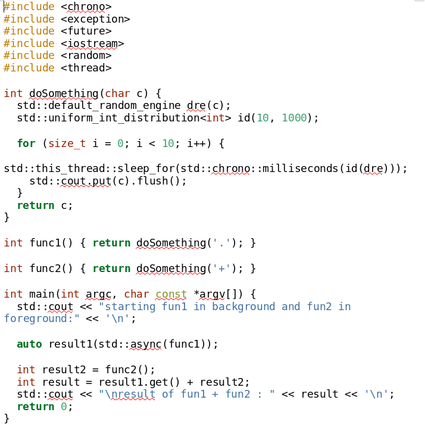
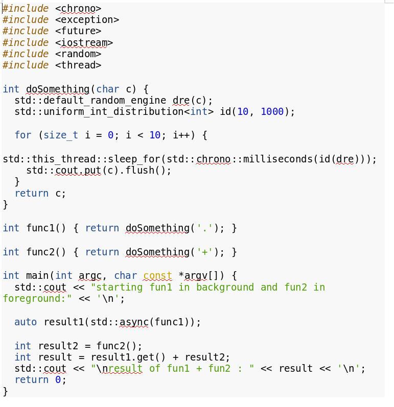
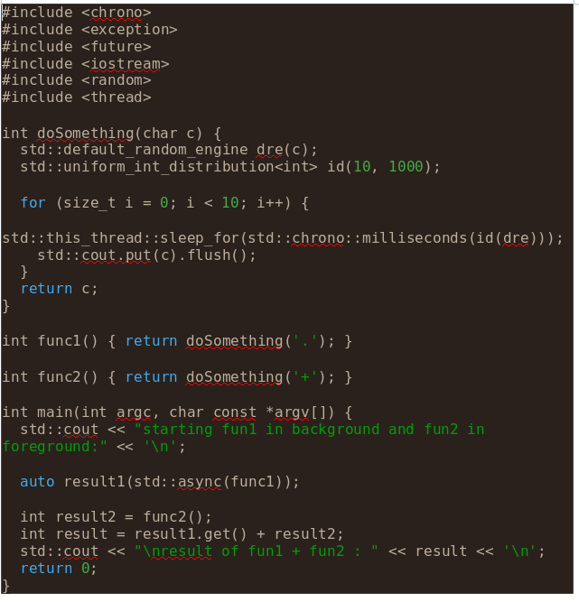
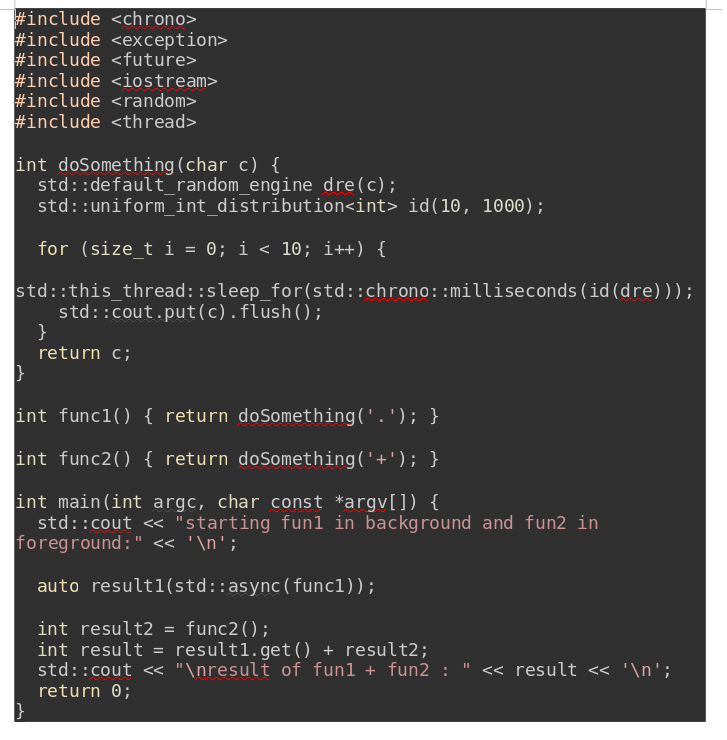
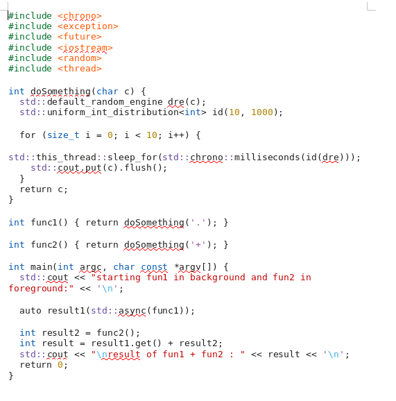
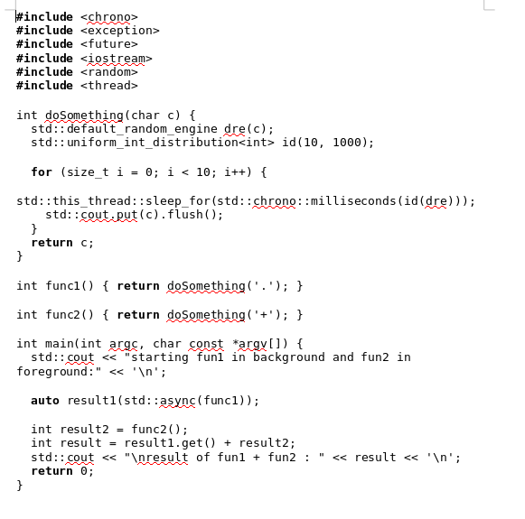
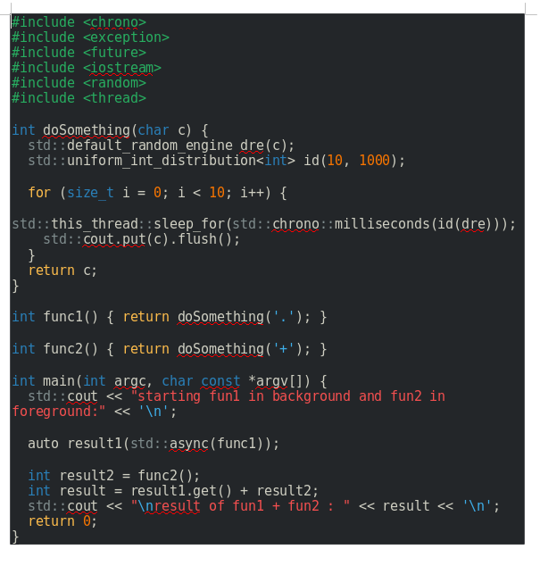
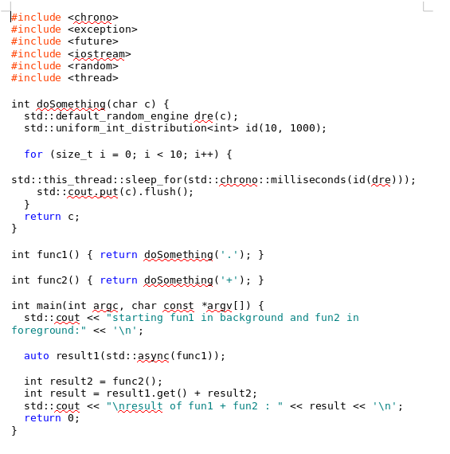

# 利用 Pandoc 转换文档格式


<!-- @import "[TOC]" {cmd="toc" depthFrom=1 depthTo=6 orderedList=false} -->
<!-- code_chunk_output -->

* [利用 Pandoc 转换文档格式](#利用-pandoc-转换文档格式)
	* [Pandoc 简介](#pandoc-简介)
	* [安装 Pandoc](#安装-pandoc)
	* [高亮代码段](#高亮代码段)

<!-- /code_chunk_output -->


## Pandoc 简介

[pandoc official](https://pandoc.org/)

```highlight
If you need to convert files from one markup format into another, pandoc is your swiss-army
knife. Pandoc can convert documents in (several dialects of) Markdown, reStructuredText,
textile, HTML, DocBook, LaTeX, MediaWiki markup, TWiki markup, TikiWiki markup, Creole 1.0,
Vimwiki markup, OPML, Emacs Org-Mode, Emacs Muse, txt2tags, Microsoft Word docx, LibreOffice
ODT, EPUB, or Haddock markup to
```

## 安装 Pandoc

```sh
# fedora
dnf install pandoc
```

## 高亮代码段

```sh
# 高亮风格
[breap@localhost Desktop]$ pandoc --list-highlight-styles
pygments
tango
espresso
zenburn
kate
monochrome
breezedark
haddock
```

```sh
pandoc --highlight-style=breezeDark -s test.md -o test.docx
```
pygments:



tango:



espresso:



zenburn:



kate:



monochrome:



breezedark:



haddock:



[上一级](README.md)
[上一篇 -> openresty测试](openresty_test.md)
[下一篇 -> shadowsocks optimize](shadowsocksOptimize.md)
