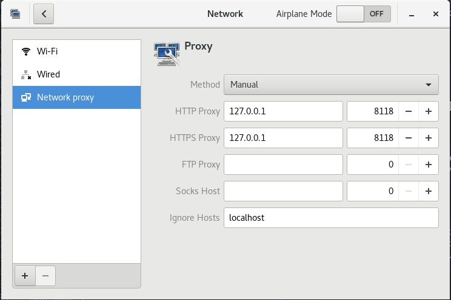

# ss+privoxy实现全局代理

privoxy仅支持 http、https 协议

1. 安装privoxy
```sh
yum -y install privoxy
```


2. privoxy-全局代理
```sh
echo 'forward-socks5 / 127.0.0.1:1080 .' >> /etc/privoxy/config
```

3. 启动privoxy
```sh
systemctl start privoxy
systemctl enable privoxy
```

4. 仅终端使用proxy

```sh
export http_proxy=http://127.0.0.1:8118
export https_proxy=http://127.0.0.1:8118
export no_proxy=localhost
```

5. 设置全局使用proxy



6. proxy 支持过滤规则

- [上一级](README.md)
- 上一篇 -> [一些面试问题](someInterviewQuestions.md)
- 下一篇 -> [Install ss-libev and config v2ray-plugin on ubuntu](ubuntuInstallSSAndV2rayPlugin.md)
