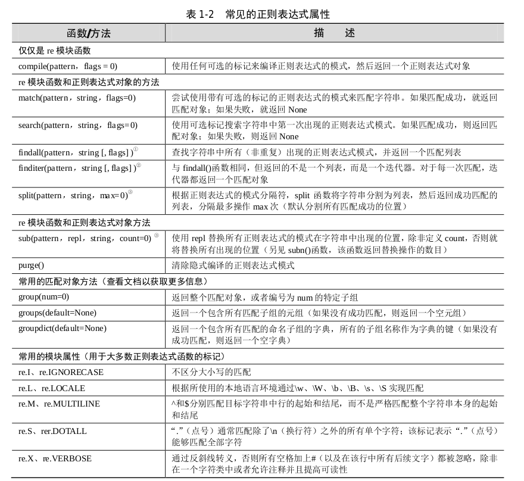

# Python 核心编程:正则表达式

<!-- @import "[TOC]" {cmd="toc" depthFrom=1 depthTo=6 orderedList=false} -->
<!-- code_chunk_output -->

- [Python 核心编程:正则表达式](#python-核心编程正则表达式)
  - [正则表达式](#正则表达式)
    - [简介/动机](#简介动机)
    - [特殊符号和字符](#特殊符号和字符)
      - [扩展表示法示例](#扩展表示法示例)
    - [正则表达式和 Python](#正则表达式和-python)
      - [re 模块：核心函数和方法](#re-模块核心函数和方法)
      - [使用 match() 方法匹配字符串](#使用-match-方法匹配字符串)
      - [使用 search() 在一个字符中查找模式（搜索与匹配的对比）](#使用-search-在一个字符中查找模式搜索与匹配的对比)
      - [匹配多个字符串](#匹配多个字符串)
      - [匹配任何单个字符](#匹配任何单个字符)
      - [创建字符集([ ])](#创建字符集)
      - [重复、特殊字符以及分组](#重复-特殊字符以及分组)
      - [匹配字符串的起始和结尾以及单词边界](#匹配字符串的起始和结尾以及单词边界)
      - [使用 findall()和 finditer()查找每一次出现的位置](#使用-findall和-finditer查找每一次出现的位置)
      - [使用 sub() 和 subn() 搜索与替换](#使用-sub-和-subn-搜索与替换)
      - [在限定模式上使用 split()分隔字符串](#在限定模式上使用-split分隔字符串)
      - [扩展符号](#扩展符号)
    - [杂项](#杂项)

<!-- /code_chunk_output -->

## 正则表达式
### 简介/动机

[正则表达式](https://zh.wikipedia.org/wiki/%E6%AD%A3%E5%88%99%E8%A1%A8%E8%BE%BE%E5%BC%8F)为高级的文本模式匹配、抽取、与/或文本形式的搜索和替换功能提供了基础。

python 通过标准库的 [re](https://docs.python.org/zh-cn/3/library/re.html) 模块来支持正则表达式。

核心提示：搜索和匹配的比较
本章通篇会使用搜索和匹配两个术语。当严格讨论与字符串模式相关的正则表达式时，我们会使用 “匹配”，指的是 “模式匹配”。
在 python 术语中，主要有两种方法完成模式匹配：
* 搜索(searching) - 即在字符串任意部分中搜索匹配的模式
* 匹配(matching) - 是指判断一个字符串能否从起始处全部或者部分的匹配某个模式

总之，当设计模式时，全部使用术语 "匹配"；我们按照 Python 如何完成模式匹配的方式来区分 "搜索"和“匹配”。

西面所示为几个正则表达式和它们所匹配的字符串：

| 正则表达式模式 	| 匹配的字符串 	|
|:--------------:	|:------------:	|
|       foo      	|      foo     	|
|     Python     	|    Python    	|
|     abc123     	|    abc123    	|


### 特殊符号和字符
本节将介绍最常见的特殊字符和字符，即所谓的元字符，只是它给予正则表达式强大的功能和灵活性。

符号：
|     表示法     	|                                      描述                                      	|      正则表达式示例     	|
|:--------------:	|:------------------------------------------------------------------------------:	|:-----------------------:	|
|     literal    	|                         匹配文本字符串的字面值 literal                         	|           foo           	|
|    re1\|re2    	|                            匹配正则表达式 re1 或 re2                           	|         foo\|bar        	|
|        .       	|                           匹配任何字符（除了 \n之外）                          	|           b.b           	|
|        ^       	|                               匹配字符串起始部分                               	|          ^Dear          	|
|        $       	|                               匹配字符串终止部分                               	|        /bin/*sh$        	|
|        *       	|                      匹配 0 次或者多次前面出现的正则表达式                     	|       [A-Za-z0-9]*      	|
|        +       	|                      匹配 1 次或者多次前面出现的正则表达式                     	|       [a-z]+\.com       	|
|        ?       	|                     匹配 0 次或者 1 次前面出现的正则表达式                     	|           goo?          	|
|       {N}      	|                          匹配 N 次前面出现的正则表达式                         	|         [0-9]{3}        	|
|      {M,N}     	|                        匹配 M ~ N 次前面出现的正则表达式                       	|        [0-9]{5,9}       	|
|      [...]     	|                          匹配来自字符集的任意单一字符                          	|         [aeiou]         	|
|    [.x-y..]    	|                         匹配 x ~y 范围中的任意单一字符                         	|      [0-9],[A-Za-z]     	|
|     [^...]     	| 不匹配此字符集中出现的任何一个字符，包括某一范围的字符（如果在此字符集中出现） 	|  [^aeiou],[^A-Za-z0-9]  	|
| (*\|+\|?\|{})? 	|          用于匹配上面频繁出现/重复出现符号的非贪婪版本（*、+、?、{}）          	|         .*?[z-z]        	|
|      (...)     	|                      匹配封闭的正则表达式，然后另存为子组                      	| ([0-9]{3})?,f(oo\|u)bar 	|

特殊字符：
| 表示法 	|                                     描述                                    	| 正则表达式示例 	|
|:------:	|:---------------------------------------------------------------------------:	|:--------------:	|
|   \d   	| 匹配任何十进制数字，与 [0-9]一致（\D）与 \d相反，不匹配任何非数值型的数字） 	|   data\d+.txt  	|
|   \w   	|           匹配任何字母数字字符，与 [a-zA-Z0-9] 相同（\W与之相反）           	|  [a-zA-Z_]\w+  	|
|   \s   	|            匹配任何空格字符，与 [\n\t\r\v\f]相同，（\S与之相反）            	|     of\sthe    	|
|   \b   	|                          匹配任何单词边界(\B 相反)                          	|     \bThe\b    	|
|   \N   	|                    匹配已保存的子组N（参见上面的 (...)）                    	|    price:\16   	|
|   \c   	|      逐字匹配任何特殊字符 c （即，仅按照字面意义匹配，不匹配特殊含义）      	|    \\.,\\\\,\\*    	|
| \A(\Z) 	|               匹配字符串的起始（结束）（另见上面介绍的 ^和$）               	|     \ADear     	|

扩展表示法：
|      表示法      	|                                                  描述                                                 	|  正则表达式示例 	|
|:----------------:	|:-----------------------------------------------------------------------------------------------------:	|:---------------:	|
|     (?iLmsux)    	|                   在正则表达式中嵌入一个或者多个特殊“标记”参数（或者通过函数/方法）                   	|   (?x),(? im)   	|
|      (?:...)     	|                                       表示一个匹配不用保存的分组                                      	|    (?:\w+\\.)*   	|
|   (?P<name>...)  	|                           像一个仅由name 标识而不是数字ID标识的正则分组匹配                           	|    (?P\<data\>)   	|
|     (?P=name)    	|                              在同一字符串中匹配由(?P<name)分组的之前文本                              	|    (?P=data)    	|
|      (?#...)     	|                                       标识注释，所有内容都被忽略                                      	|   (?#comment)   	|
|      (?=...)     	|                匹配条件时如果...出现在之后的位置，而不使用输入字符串：称作正向前视断言                	|     (?=.com)    	|
|     (?=!...)     	|               匹配条件时如果...不出现在之后的位置，而不使用输入字符串：称作负向前视断言               	|     (?!.net)    	|
|     (?<=...)     	|                匹配条件时如果...出现在之前的位置，而不使用输入字符串：称作正向后视断言                	|    (?<=800-)    	|
|     (?<!...)     	|               匹配条件时如果...不出现在之前的位置，而不使用输入字符串：称作负向后视断言               	| (?<!192\\.168\\.) 	|
| (?(id/name)Y\|N) 	| 如果分组所提供的 id 或者 name 存在，就返回正则表达式的条件匹配 Y ，如果不存在，就返回 N；\|N 是可选项 	|    (?(1)y\|x)   	|

#### 扩展表示法示例
| 正则表达式模式  	|                                                  匹配的字符串                                                 	|
|:---------------:	|:-------------------------------------------------------------------------------------------------------------:	|
|    (?:\w+\\.)*   	| 以句点作为结尾的字符串,例如“google.”、“twitter.”、“facebook.” ,但是这些匹配不会保存下来供后续的使用和数据检索 	|
|   (?#comment)   	|                                          此处并不做匹配,只是作为注释                                          	|
|     (?=.com)    	|                        如果一个字符串后面跟着“.com”才做匹配操作,并不使用任何目标字符串                        	|
|     (?!.net)    	|                                  如果一个字符串后面不是跟着“.net”才做匹配操作                                 	|
|    (?<=800-)    	|                   如果字符串之前为“800-”才做匹配,假定为电话号码,同样,并不使用任何输入字符串                   	|
| (?<!192\\.168\\.) 	|                  如果一个字符串之前不是“192.168.”才做匹配操作,假定用于过滤掉一组 C 类 IP 地址                 	|
|    (?(1)y\|x)   	|                             如果一个匹配组 1(\1)存在,就与 y 匹配;否则,就与 x 匹配                             	|

### 正则表达式和 Python
Python 当前使用 [re](https://docs.python.org/zh-cn/3/library/re.html) 模块来支持正则表达式.

re 模块支持更强大而且更通用的 Perl 风格(Perl 5 风格)的正则表达式,该模块允许多个线程共享同一个已编译的正则表达式对象,也支持命名子组。

#### re 模块：核心函数和方法
常见的正则表达式属性：



核心提示：编译正则表达式（编译还是不编译？）
在模式匹配发生之前,正则表达式模式必须编译成正则表达式对象。由于正则表达式在执行过程中将进行多次比较操作,因此强烈建议使用预编译。而且,既然正则表达式的编译是必需的,那么使用预编译来提升执行性能无疑是明智之举。re.compile()能够提供此功能。

其实模块函数会对已编译的对象进行缓存,所以不是所有使用相同正则表达式模式的 search()和 match()都需要编译。即使这样,你也节省了缓存查询时间,并且不必对于相同的字符串反复进行函数调用。在不同的 Python 版本中,缓存中已编译过的正则表达式对象的数目可能不同,而且没有文档记录。purge()函数能够用于清除这些缓存。

尽管推荐预编译,但它并不是必需的。如果需要编译,就使用编译过的方法;如果不需要编译,就使用函数。

#### 使用 match() 方法匹配字符串

```py
>>> import re
>>> m=re.match('foo','foo')
>>> if m is not None:
...     m.group()
...
'foo'
```
```py
>>> m=re.match('foo','bar')
>>> m
>>> m.group()
Traceback (most recent call last):
  File "<stdin>", line 1, in <module>
AttributeError: 'NoneType' object has no attribute 'group'
```
在实际操作中最好这样以避免 AttributeError 异常：

```py
# 如下为一个失败的匹配示例,它返回 None。
>>> m = re.match('foo', 'bar')# 模式并不能匹配字符串
>>> if m is not None: m.group() # (单行版本的 if 语句)
...
>>>
```

只要模式从字符串的起始部分开始匹配,即使字符串比模式长,匹配也仍然能够成功。
```py
>>> m = re.match('foo', 'food on the table') # 匹配成功
>>> m.group()
'foo'
```

甚至可以充分利用 Python 原生的面向对象特性,忽略保存中间过程产生的结果。
```py
>>> re.match('foo', 'food on the table').group()
'foo'
```
注意,在上面的一些示例中,如果匹配失败,将会抛出 AttributeError 异常。

#### 使用 search() 在一个字符中查找模式（搜索与匹配的对比）

其实,想要搜索的模式出现在一个字符串中间部分的概率,远大于出现在字符串起始部分的概率。这也就是 search()派上用场的时候了。search()的工作方式与 match()完全一致,不同之处在于 search()会用它的字符串参数,在任意位置对给定正则表达式模式搜索第一次出现的匹配情况。如果搜索到成功的匹配,就会返回一个匹配对象;否则,返回 None。
```py
>>> m = re.match('foo', 'seafood') # 匹配失败
>>> if m is not None: m.group()
...
>>>
```
```py
>>> m = re.search('foo', 'seafood') # 使用 search() 代替
>>> if m is not None: m.group()
...
'foo' # 搜索成功,但是匹配失败
>>>
```
此外,match()和 search()都使用在可选的标记参数。最后,需注意的是,等价的正则表达式对象方法使用可选的 pos 和 endpos 参数来指定目标字符串的搜索范围。

#### 匹配多个字符串
```py
>>> bt = 'bat|bet|bit'
>>> m = re.match(bt, 'bat')
>>> if m is not None: m.group()
...
'bat'
>>> m = re.match(bt, 'blt') # 对于 'blt' 没有匹配
>>> if m is not None: m.group()
...
>>> m = re.match(bt, 'He bit me!') # 不能匹配字符串
>>> if m is not None: m.group()
...
>>> m = re.search(bt, 'He bit me!') # 通过搜索查找 'bit'
>>> if m is not None: m.group()
...
'bit'
```
#### 匹配任何单个字符
```py
>>> anyend = '.end'
>>> m = re.match(anyend, 'bend')
>>> if m is not None: m.group()
...
'bend'
>>> m = re.match(anyend, 'end')
>>> if m is not None: m.group()
...
>>> m = re.match(anyend, '\nend') # 除了 \n 之外的任何字符
>>> if m is not None: m.group()
...
>>> m = re.search('.end', 'The end.')# 在搜索中匹配 ' '
>>> if m is not None: m.group()
...
' end'
```
#### 创建字符集([ ])
```py
>>> m = re.match('[cr][23][dp][o2]', 'c3po')# 匹配 'c3po'
>>> if m is not None: m.group()
...
'c3po'
>>> m = re.match('[cr][23][dp][o2]', 'c2do')# 匹配 'c2do'
>>> if m is not None: m.group()
...
'c2do'
>>> m = re.match('r2d2|c3po', 'c2do')# 不匹配 'c2do'
>>> if m is not None: m.group()
...
>>> m = re.match('r2d2|c3po', 'r2d2')# 匹配 'r2d2'
>>> if m is not None: m.group()
...
'r2d2'
```
#### 重复、特殊字符以及分组
正则表达式中最常见的情况包括特殊字符的使用、正则表达式模式的重复出现,以及使用圆括号对匹配模式的各部分进行分组和提取操作。
```py
>>> patt = '\w+@(\w+\.)?\w+\.com'
>>> re.match(patt, 'nobody@xxx.com').group()
'nobody@xxx.com'
>>> re.match(patt, 'nobody@www.xxx.com').group()
'nobody@www.xxx.com'
```
```py
>>> patt = '\w+@(\w+\.)*\w+\.com'
>>> re.match(patt, 'nobody@www.xxx.yyy.zzz.com').group()
'nobody@www.xxx.yyy.zzz.com'
```
使用 group()方法访问每个独立的子组以及 groups()方法以获取一个包含所有匹配子组的元组。
```py
>>> m = re.match('(\w\w\w)-(\d\d\d)', 'abc-123')
>>> m.group() # 完整匹配
'abc-123'
>>> m.group(1) # 子组 1
'abc'
>>> m.group(2) # 子组 2
'123'
>>> m.groups() # 全部子组
('abc', '123')
```
分组示例：
```py
>>> m = re.match('ab', 'ab') # 没有子组
>>> m.group() # 完整匹配
'ab'
>>> m.groups() # 所有子组
()
>>>
>>> m = re.match('(ab)', 'ab') # 一个子组
>>> m.group() # 完整匹配
'ab'
>>> m.group(1) # 子组 1
'ab'
>>> m.groups() # 全部子组
('ab',)
>>>
>>> m = re.match('(a)(b)', 'ab') # 两个子组
>>> m.group() # 完整匹配
'ab'
>>> m.group(0)
'ab'
>>> m.group(1) # 子组 1
'a'
>>> m.group(2) # 子组 2
'b'
>>> m.groups() # 所有子组
('a', 'b')
>>>
>>> m = re.match('(a(b))', 'ab') # 两个子组
>>> m.group() # 完整匹配
'ab'
>>> m.group(1) # 子组 1
'ab'
>>> m.group(2) # 子组 2
'b'
>>> m.groups() # 所有子组
('ab', 'b')
```
#### 匹配字符串的起始和结尾以及单词边界
```py
>>> m = re.search('^The', 'The end.') # 匹配
>>> if m is not None: m.group()
...
'The'
>>> m = re.search('^The', 'end. The') # 不作为起始
>>> if m is not None: m.group()
...
# 原始字符串的用法.通常情况下,在正则表达式中使用原始字符串是个好主意。
>>> m = re.search(r'\bthe', 'bite the dog') # 在边界
>>> if m is not None: m.group()
...
'the'
>>> m = re.search(r'\bthe', 'bitethe dog') # 有边界
>>> if m is not None: m.group()
...
>>> m = re.search(r'\Bthe', 'bitethe dog') # 没有边界
>>> if m is not None: m.group()
...
'the'
````

#### 使用 findall()和 finditer()查找每一次出现的位置
findall()查询字符串中某个正则表达式模式全部的非重复出现情况。
```py
>>> re.findall('car', 'car')
['car']
>>> re.findall('car', 'scary')
['car']
>>> re.findall('car', 'carry the barcardi to the car')
['car', 'car', 'car']
```
finditer()函数是一个与 findall()函数类似但是更节省内存的变体。两者之间以及和其他变体函数之间的差异(很明显不同于返回的是一个迭代器还是列表)在于,和返回的匹配字符串相比,finditer()在匹配对象中迭代。

[re.finditer(pattern, string, flags=0)](https://docs.python.org/zh-cn/3/library/re.html#re.finditer)
```py
>>> s = 'This and that.'
>>> re.findall(r'(th\w+) and (th\w+)', s, re.I)
[('This', 'that')]
>>> [g.groups() for g in re.finditer(r'(th\w+) and (th\w+)',
...
s, re.I)]
[('This', 'that')]
```
在单个字符串中执行单个分组的多重匹配
```py
>>> re.findall(r'(th\w+)', s, re.I)
['This', 'that']
>>> [g.group(1) for g in re.finditer(r'(th\w+)', s, re.I)]
['This', 'that']
```

#### 使用 sub() 和 subn() 搜索与替换
[re.sub(pattern, repl, string, count=0, flags=0)](https://docs.python.org/zh-cn/3/library/re.html#re.sub)
有两个函数/方法用于实现搜索和替换功能:sub()和 subn()。两者几乎一样,都是将某字符串中所有匹配正则表达式的部分进行某种形式的替换。用来替换的部分通常是一个字符串,但它也可能是一个函数,该函数返回一个用来替换的字符串。subn()和 sub()一样,但 subn()还返回一个表示替换的总数,替换后的字符串和表示替换总数的数字一起作为一个拥有两个元素的元组返回。
```py
>>> re.sub('X', 'Mr. Smith', 'attn: X\n\nDear X,\n')
'attn: Mr. Smith\012\012Dear Mr. Smith,\012'
>>>
>>> re.subn('X', 'Mr. Smith', 'attn: X\n\nDear X,\n')
('attn: Mr. Smith\012\012Dear Mr. Smith,\012', 2)
>>>
>>> print re.sub('X', 'Mr. Smith', 'attn: X\n\nDear X,\n')
attn: Mr. Smith
Dear Mr. Smith,
>>> re.sub('[ae]', 'X', 'abcdef')
'XbcdXf'
>>> re.subn('[ae]', 'X', 'abcdef')
('XbcdXf', 2)
```
前面讲到,使用匹配对象的 group ()方法除了能够取出匹配分组编号外,还可以使用\N,其中 N 是在替换字符串中使用的分组编号。
```py
>>> re.sub(r'(\d{1,2})/(\d{1,2})/(\d{2}|\d{4})',
...   r'\2/\1/\3', '2/20/91') # Yes, Python is...
'20/2/91'
>>> re.sub(r'(\d{1,2})/(\d{1,2})/(\d{2}|\d{4})',
...   r'\2/\1/\3', '2/20/1991') # ... 20+ years old!
'20/2/1991'
```
#### 在限定模式上使用 split()分隔字符串
[Pattern.split(string, maxsplit=0)](https://docs.python.org/zh-cn/3/library/re.html#re.Pattern.split)
re 模块和正则表达式的对象方法 split()对于相对应字符串的工作方式是类似的,但是与分割一个固定字符串相比,它们基于正则表达式的模式分隔字符串,为字符串分隔功能添加一些额外的威力。如果你不想为每次模式的出现都分割字符串,就可以通过为 max 参数设定一个值(非零)来指定最大分割数。
如果给定分隔符不是使用特殊符号来匹配多重模式的正则表达式,那么 re.split()与str.split()的工作方式相同,如下所示
```py
>>> re.split(':', 'str1:str2:str3')
['str1', 'str2', 'str3']
```
eg：
```py
>>> import re
>>> DATA = (
...
'Mountain View, CA 94040',
...
'Sunnyvale, CA',
...
'Los Altos, 94023',
...
'Cupertino 95014',
...
'Palo Alto CA',
... )
>>> for datum in DATA:
...
print re.split(', |(?= (?:\d{5}|[A-Z]{2})) ', datum)
...
['Mountain View', 'CA', '94040']
['Sunnyvale', 'CA']
['Los Altos', '94023']
['Cupertino', '95014']
['Palo Alto', 'CA']
```
#### 扩展符号
Python 的正则表达式支持大量的扩展符号。让我们一起查看它们中的一些内容,然后展示一些有用的示例。
通过使用 (?iLmsux)系列选项，用户可以直接在正则表达式里面指定一个或多个标记，而不是通过 compile() 或者其他 re 模块函数。下面为一些使用 re.I/IGNORECASE 的示例,最后一个示例在 re.M/MULTILINE 实现多行混合:
```py
>>> re.findall(r'(?i)yes', 'yes? Yes. YES!!')
['yes', 'Yes', 'YES']
>>> re.findall(r'(?i)th\w+', 'The quickest way is through this
tunnel.')
['The', 'through', 'this']
>>> re.findall(r'(?im)(^th[\w ]+)', """
... This line is the first,
... another line,
... that line, it's the best
... """)
['This line is the first', 'that line']
```
在前两个示例中,显然是不区分大小写的。在最后一个示例中,通过使用“多行” ,能够在目标字符串中实现跨行搜索,而不必将整个字符串视为单个实体。注意,此时忽略了实例“the”,因为它们并不出现在各自的行首。
使用 re.S/DOTALL。该标记表明点号(.)能够用来表示 \\n 符号
```py
>>> re.findall(r'th.+', '''
... The first line
... the second line
... the third line
... ''')
['the second line', 'the third line']
>>> re.findall(r'(?s)th.+', '''
... The first line
... the second line
... the third line
... ''')
['the second line\nthe third line\n']
```

re.X/VERBOSE 标记非常有趣;该标记允许用户通过抑制在正则表达式中使用空白符(除了在字符类中或者在反斜线转义中)来创建更易读的正则表达式。此外,散列、注释和井号也可以用于一个注释的起始,只要它们不在一个用反斜线转义的字符类中。

```py
>>> re.search(r'''(?x)
...
\((\d{3})\) # 区号
...
[ ] # 空白符
...
(\d{3}) # 前缀
...
- # 横线
...
(\d{4}) # 终点数字
... ''', '(800) 555-1212').groups()
('800', '555', '1212')
```
(?:...)符号将更流行;通过使用该符号,可以对部分正则表达式进行分组,但是并不会保存该分组用于后续的检索或者应用。当不想保存今后永远不会使用的多余匹配时,这个符号就非常有用。
```py
>>> re.findall(r'http://(?:\w+\.)*(\w+\.com)',
...
'http://google.com http://www.google.com http://code.google.com')
['google.com', 'google.com', 'google.com']
>>> re.search(r'\((?P<areacode>\d{3})\) (?P<prefix>\d{3})-(?:\d{4})',
...
'(800) 555-1212').groupdict()
{'areacode': '800', 'prefix': '555'}
```
读者可以同时一起使用 (?P\<name\>) 和 (?P=name)符号。前者通过使用一个名称标识符而不是使用从 1 开始增加到 N 的增量数字来保存匹配,如果使用数字来保存匹配结果,我们就可以通过使用\1,\2 ...,\N \来检索。如下所示,可以使用一个类似风格的\g<name>来检索它们。
```py
re.sub(r'\((?P<areacode>\d{3})\) (?P<prefix>\d{3})-(?:\d{4})',
...   '(\g<areacode>) \g<prefix>-xxxx', '(800) 555-1212')
'(800) 555-xxxx'
```
使用后者,可以在一个相同的正则表达式中重用模式,而不必稍后再次在(相同)正则表达式中指定相同的模式。例如,在本示例中,假定让读者验证一些电话号码的规范化。如下所示为一个丑陋并且压缩的版本,后面跟着一个正确使用的 (?x),使代码变得稍许易读。

```py
>>> bool(re.match(r'\((?P<areacode>\d{3})\) (?P<prefix>\d{3})-
(?P<number>\d{4}) (?P=areacode)-(?P=prefix)-(?P=number)
1(?P=areacode)(?P=prefix)(?P=number)',
...
'(800) 555-1212 800-555-1212 18005551212'))
True
>>> bool(re.match(r'''(?x)
...
... # match (800) 555-1212, save areacode, prefix, no.
... \((?P<areacode>\d{3})\)[ ](?P<prefix>\d{3})-(?P<number>\d{4})
...
... # space
... [ ]
...
... # match 800-555-1212
... (?P=areacode)-(?P=prefix)-(?P=number)
...
... # space
... [ ]
...
... # match 18005551212
... 1(?P=areacode)(?P=prefix)(?P=number)
...
... ''', '(800) 555-1212 800-555-1212 18005551212'))
True
```
读者可以使用 (?=...) 和 (?!...)符号在目标字符串中实现一个前视匹配,而不必实际上使用这些字符串。前者是正向前视断言,后者是负向前视断言。
```py
>>> re.findall(r'\w+(?= van Rossum)',
... '''
... Guido van Rossum
... Tim Peters
... Alex Martelli
... Just van Rossum
... Raymond Hettinger
... ''')
['Guido', 'Just']
>>> re.findall(r'(?m)^\s+(?!noreply|postmaster)(\w+)',
... '''
... sales@phptr.com
... postmaster@phptr.com
... eng@phptr.com
... noreply@phptr.com
... admin@phptr.com
... ''')
['sales', 'eng', 'admin']
>>> ['%s@aw.com' % e.group(1) for e in \
re.finditer(r'(?m)^\s+(?!noreply|postmaster)(\w+)',
... '''
... sales@phptr.com
... postmaster@phptr.com
... eng@phptr.com
... noreply@phptr.com
... admin@phptr.com
... ''')]
['sales@aw.com', 'eng@aw.com', 'admin@aw.com']
```
展示使用条件正则表达式匹配:
```py
>>> bool(re.search(r'(?:(x)|y)(?(1)y|x)', 'xy'))
True
>>> bool(re.search(r'(?:(x)|y)(?(1)y|x)', 'xx'))
False
```
### 杂项
可能读者会对于正则表达式的特殊字符和特殊 ASCII 符号之间的差异感到迷惑。我们可以使用\n 表示一个换行符,但是我们可以使用\d 在正则表达式中表示匹配单个数字。
如果有符号同时用于 ASCII 和正则表达式,就会发生问题,因此在下面的核心提示中,建议使用 Python 的原始字符串来避免产生问题。另一个警告是:\w 和\W 字母数字字符集同时受 re.L/LOCALE 和 Unicode(re.U/UNICODE)标记所影响.

核心提示：使用 Python 原始字符串
读者可能在之前的一些示例中见过原始字符串的使用。正则表达式对于探索原始字符串有着强大的动力,原因就在于 ASCII 字符和正则表达式的特殊字符之间存在冲突。作为一个特殊符号, \b 表示 ASCII 字符的退格符,但是\b 同时也是一个正则表达式的特殊符号,表示匹配一个单词的边界。对于正则表达式编译器而言,若它把两个\b 视为字符串内容而不是单个退格符,就需要在字符串中再使用一个反斜线转义反斜线,就像这样:\\b。
这样显得略微杂乱,特别是如果在字符串中拥有很多特殊字符,就会让人感到更加困惑。我们在 Core Python Programming 或者 Core Python Language Fundamentals 的 Sequence章节中介绍了原始字符串,而且该原始字符串可以用于(且经常用于)帮助保持正则表达式查找某些可托管的东西。事实上,很多 Python 程序员总是抱怨这个方法,仅仅用原始字
符串来定义正则表达式。
如下所示的一些示例用于说明退格符\b 和正则表达式\b 之间的差异,它们有的使用、有的不使用原始字符串。
```py
>>> m = re.match('\bblow', 'blow') # backspace、no match
>>> if m: m.group()
...
>>> m = re.match('\\bblow', 'blow') # escaped\,now it works
>>> if m: m.group()
...
'blow'
>>> m = re.match(r'\bblow', 'blow') # use raw string instead
>>> if m: m.group()
...
'blow'
```
读者可能回想起来我们在正则表达式中使用\d 而没有使用原始字符串时并未遇到问题,这是因为 ASCII 中没有相应的特殊字符,所以正则表达式的编译器知道你想要表示十进制数字。

### 一些正则表达式示例
下面看一些 Python 正则表达式的示例代码,这将使我们更接近实际应用中的程序。如下所示,以 POSIX(UNIX 风格操作系统,如 Linux、Mac OS X 等)的 who 命令的输出为例,该命令将列出所有登录当前系统中的用户信息。
```sh
$ who
wesley console Jun 20 20:33
wesley pts/9 Jun 22 01:38 (192.168.0.6)
wesley pts/1 Jun 20 20:33 (:0.0)
wesley pts/2 Jun 20 20:33:00 (:0.0)
wesley pts/4 Jun 20 20:33:00 (:0.0)
wesley pts/3 Jun 20 20:33:00 (:0.0)
wesley pts/5 Jun 20 20:33:00 (:0.0)
wesley pts/6 Jun 20 20:33:00 (:0.0)
wesley pts/7 Jun 20 20:33:00 (:0.0)
wesley pts/8 Jun 20 20:33:00 (:0.0)
```
可能我们想要保存一些用户登录信息,诸如登录名、用户登录的终端类型、用户登录的时间和地点。
创建一个名为 rewho.py 的程序：
```py
import re
f = open('whodata.txt', 'r')
for eachLine in f:
  print re.split(r'\s\s+', eachLine)
f.close()
```
```sh
$ who > whodata.txt
$ rewho.py
['wesley', 'console', 'Jun 20 20:33\012']
['wesley', 'pts/9', 'Jun 22 01:38\011(192.168.0.6)\012']
['wesley', 'pts/1', 'Jun 20 20:33\011(:0.0)\012']
['wesley', 'pts/2', 'Jun 20 20:33\011(:0.0)\012']
['wesley', 'pts/4', 'Jun 20 20:33\011(:0.0)\012']
['wesley', 'pts/3', 'Jun 20 20:33\011(:0.0)\012']
['wesley', 'pts/5', 'Jun 20 20:33\011(:0.0)\012']
['wesley', 'pts/6', 'Jun 20 20:33\011(:0.0)\012']
['wesley', 'pts/7', 'Jun 20 20:33\011(:0.0)\012']
['wesley', 'pts/8', 'Jun 20 20:33\011(:0.0)\012']
```
这是非常好的一次尝试。首先,我们不期望单个制表符(ASCII \011)作为输出的一部分(可能看起来像是至少两个空白符),然后可能我们并不真的希望保存\n (ASCII \012)作为每一行的终止符。我们现在将修复这些问题,然后通过一些改进来提高应用的整体质量。
python 2 版本：
```py
#!/usr/bin/env python

import os
import re

f=os.popen('who','r')
for eachLine in f:
  print re.split(r'\s\s+|\t',eachLine.rstrip())
f.close()
```
python3 版本：
```py
#!/usr/bin/env python

import os
import re

# 通过使用 with 语句，拥有上下文管理器的对象变得更容易使用
with os.popen('who','r') as f:
  for eachLine in f:
    print(re.split(r'\s\s+|\t',eachLine.stip()))
```
通用版本：
```py
#!/usr/bin/env python

import os
from distutils.log import warn as printf
import re

with os.popen('who','r') as f:
  for eachLine in f:
    printf(re.split(r'\s\s+|\t',eachLine.stip()))

```
输出结果：
```sh
['wesley', 'console', 'Feb 22 14:12']
['wesley', 'ttys000', 'Feb 22 14:18']
['wesley', 'ttys001', 'Feb 22 14:49']
['wesley', 'ttys002', 'Feb 25 00:13', '(192.168.0.20)']
['wesley', 'ttys003', 'Feb 24 23:49', '(192.168.0.20)']
```
在 Windows 计算机上可以使用 tasklist 命令替代 who 来得到类似的结果。让我们查看该命令的输出结果。
```sh
C:\WINDOWS\system32>tasklist
Image Name  PID Session  Name   Session#  Mem Usage
========================= ====== ================ ======== ============
System Idle Process 0 Console 0 28 K
System 4 Console 0 240 K
smss.exe 708 Console 0 420 K
csrss.exe 764 Console 0 4,876 K
winlogon.exe 788 Console 0 3,268 K
services.exe 836 Console 0 3,932 K
. . .
```
处理 Dos 环境下 tasklist 命令的输出 (retasklist.py)
```py
#!usr/bin/env python

import os
import re

f=os.popen('tasklist /nh','r')
for eachLine in f:
  print re.findall(r'([\w.]+(?:[\w.]+)*)\s\s+(\d+) \w+\s\s+\d+\s\s+([\d,]+ k)'),eachLine.rstrip())
f.close()
```
如果运行这个脚本,就能得到期望(已截断)的输出。
```sh
Z:\corepython\ch1>python retasklist.py
[]
[('System Idle Process', '0', '28 K')]
[('System', '4', '240 K')]
[('smss.exe', '708', '420 K')]
[('csrss.exe', '764', '5,016 K')]
[('winlogon.exe', '788', '3,284 K')]
[('services.exe', '836', '3,932 K')]
. . .
```
### 更长的正则表达式示例
```py
#!/usr/bin/env python

from random import randrange, choice
from string import ascii_lowercase as lc
from sys import maxint
from time import ctime

lds = ('com', 'edu', 'net', 'org', 'gov')
for i in xrange(randrange(5, 11)):
dtint = randrange(maxint) # pick date
dtstr = ctime(dtint) # date string
llen = randrange(4, 8) # login is shorter
login = ''.join(choice(lc) for j in range(llen))
dlen = randrange(llen, 13)
# domain is longer
dom = ''.join(choice(lc) for j in xrange(dlen))
print '%s::%s@%s.%s::%d-%d-%d' % (dtstr, login,
dom, choice(tlds), dtint, llen, dlen)
```
输出结果：
```sh
Thu Jul 22 19:21:19 2004::izsp@dicqdhytvhv.edu::1090549279-4-11
Sun Jul 13 22:42:11 2008::zqeu@dxaibjgkniy.com::1216014131-4-11
Sat May 5 16:36:23 1990::fclihw@alwdbzpsdg.edu::641950583-6-10
Thu Feb 15 17:46:04 2007::uzifzf@dpyivihw.gov::1171590364-6-8
Thu Jun 26 19:08:59 2036::ugxfugt@jkhuqhs.net::2098145339-7-7
Tue Apr 10 01:04:45 2012::zkwaq@rpxwmtikse.com::1334045085-5-10
```
#### 搜索与匹配...还有贪婪

```py
patt = '.+\d+-\d+-\d+'
>>> re.match(patt, data).group() # entire match
'Thu Feb 15 17:46:04 2007::uzifzf@dpyivihw.gov::1171590364-6-8'
```
```py
>>> patt = '.+(\d+-\d+-\d+)'
>>> re.match(patt, data).group(1)
'4-6-8'
```
发生了什么?我们将提取 1171590364-6-8,而不仅仅是 4-6-8。第一个整数的其余部分在哪儿?问题在于正则表达式本质上实现贪婪匹配。这就意味着对于该通配符模式,将对正则表达式从左至右按顺序求值,而且试图获取匹配该模式的尽可能多的字符。在之前的示例中,使用“.+”获取从字符串起始位置开始的全部单个字符,包括所期望的第一个整数字段。\d+仅仅需要一个数字,因此将得到“4”,其中.+匹配了从字符串起始部分到所期望的第一个数字的全部内容:“Thu Feb 15 17:46:04 2007::uzifzf@dpyivihw.gov::117159036”,如下图所示：


其中的一个方案是使用“非贪婪”操作符“?”。读者可以在“*”、“+”或者“?”之后使用该操作符。该操作符将要求正则表达式引擎匹配尽可能少的字符。因此,如果在“.+”之后放置一个“?”,我们将获得所期望的结果。如下图所示：


```py
>>> patt = '.+?(\d+-\d+-\d+)'
>>> re.match(patt, data).group(1) # subgroup 1
'1171590364-6-8'
```
另一个实际情况下更简单的方案,就是把“::”作为字段分隔符。读者可以仅仅使用正则字符串 strip(':: ')方法获取所有的部分,然后使用 strip('-')作为另一个横线分隔符,就能够获取最初想要查询的三个整数。

对于想要更深入研究正则表达式的读者,建议阅读由 Jeffrey E. F. Friedl.编写的 [Mastering Regular Expressions](http://ww2.ii.uj.edu.pl/~tabor/prII09-10/perl/master.pdf)

[上一级](README.md)
[下一篇](noRootUserInstallPackage.md)
