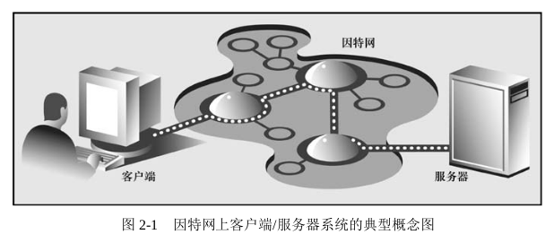

<!-- Python核心编程-网络编程 -->

<!-- TOC depthFrom:1 depthTo:6 withLinks:1 updateOnSave:1 orderedList:0 -->

- [Python核心编程-网络编程](#python核心编程-网络编程)
	- [客户端/服务器架构](#客户端服务器架构)
		- [硬件客户端/服务器架构](#硬件客户端服务器架构)
		- [软件客户端/服务器架构](#软件客户端服务器架构)
		- [银行出纳员作为服务器吗？](#银行出纳员作为服务器吗)
		- [客户端/服务器网络编程](#客户端服务器网络编程)

<!-- /TOC -->

《python核心编程》 读书笔记：

## 客户端/服务器架构
什么是客户端/服务器架构?对于不同的人来说,它意味着不同的东西,这取决于你问谁以及描述的是软件还是硬件系统。在这两种情况中的任何一种下,前提都很简单:服务器就是一系列硬件或软件,为一个或多个客户端(服务的用户)提供所需的“服务”。它存在唯一目的就是等待客户端的请求,并响应它们(提供服务),然后等待更多请求。

另一方面,客户端因特定的请求而联系服务器,并发送必要的数据,然后等待服务器的回应,最后完成请求或给出故障的原因。服务器无限地运行下去,并不断地处理请求;而客户端会对服务进行一次性请求,然后接收该服务,最后结束它们之间的事务。客户端在一段时间后可能会再次发出其他请求,但这些都被当作不同的事务。

示例：




### 硬件客户端/服务器架构
比如：
* 打印(打印机)服务器是硬件服务器
* 文件服务器

### 软件客户端/服务器架构
软件服务器也运行在一块硬件之上,但是没有像硬件服务器那样的专用外围设备(如打印机、磁盘驱动器等)。软件服务器提供的主要服务包括程序执行、数据传输检索、聚合、更新,或其他类型的编程或数据操作。

比如：
* Web 服务器
* 数据库服务器
* 窗体(window)服务器,几乎可以认为这些服务器是硬件服务器。它们运行在一台附带(外接)显示设备(如显示器)的计算机上。窗体客户端其实就是一些程序,这些程序需要一个窗口化的环境来运行。这些通常被当作图形用户界面(GUI)应用程序。如果在没有窗体服务器的情况下执行它们,也即意味着在一个基于文本的环境中,如 DOS 窗口或一个 UNIX shell 中,那么将无法启动它们。一旦能够访问窗体服务器,那么一切都会正常。
在网络领域,这种环境会变得更加有趣。窗体客户端通常的显示设备就是本地计算机上的服务器,但是在一些网络化的窗体环境(如 X Window 系统)中,也可以选择另一台计算机的窗体服务器作为一个显示设备。在这种情况下,你就可以在一台计算机上运行一个 GUI程序,而将它显示在另一台计算机上!

### 银行出纳员作为服务器吗？
想象客户端/服务器架构如何工作的一个方法就是,在你的脑海中创建一个画面,那就是一个银行出纳员,他既不吃不睡,也不休息,服务一个又一个的排队客户,似乎永远不会结束(见图 2-2)。这个队列可能很长,也可能空无一人,但在任何给定的某个时刻,都可能会出现一个客户。当然,在几年前这样的出纳员完全是一种幻想,但是现在的自动取款机(ATM)似乎比较接近这种模型。


当然,出纳员就是一个运行在无限循环中的服务器,而每个客户就是一个客户端,每个客户端都有一个需要解决的需求。这些客户到达银行,并由出纳以“先来先服务”的方式处理。一旦一个事务完成,客户就会离开,而出纳员要么为下一位客户服务,要么坐下来等待,直到下一位客户到来。

为什么所有这些都很重要呢?因为在一般意义上,这种执行风格正是客户端/服务器架构的工作方式。既然现在你已经有了基本的概念,接下来就让我们将它应用到网络编程上,而网络编程正是遵循客户端/服务器架构的软件模型。

### 客户端/服务器网络编程
在服务器响应客户端请求之前,必须进行一些初步的设置流程来为之后的工作做准备。首先会创建一个通信端点,它能够使服务器监听请求。
必须让潜在的客户知道存在这样的服务器来处理他们的需求;否则,服务器将永远不会得到任何请求。

客户端比服务器端更简单,客户端所需要做的只是创建它的单一通信端点,然后建立一个到服务器的连接。然后,客户端就可以发出请求,该请求包括任何必要的数据交换。一旦请求被服务器处理,且客户端收到结果或某种确认信息,此次通信就会被终止。

## 套接字
本节将介绍套接字（socket）,给出有关其起源的一些背景知识，并讨论各种类型的套接字。最后，将讲述如何利用它们使运行在不同（或相同）计算机上的进程相互通信。

### 套接字
套接字是计算机网络数据结构,它体现了上节中所描述的“通信端点”的概念。在任何类型的通信开始之前,网络应用程序必须创建套接字。可以将它们比作电话插孔,没有它将无法进行通信。

套接字的起源可以追溯到 20 世纪 70 年代,它是加利福尼亚大学的伯克利版本 UNIX (称为 BSD UNIX)的一部分。因此,有时你可能会听过将套接字称为伯克利套接字或 BSD 套接字。套接字最初是为同一主机上的应用程序所创建,使得主机上运行的一个程序(又名一个进程)与另一个运行的程序进行通信。这就是所谓的进程间通信 (Inter Process Communication,IPC)。有两种类型的套接字:
* 基于文件的
* 面向网络的

UNIX 套接字是我们所讲的套接字的第一个家族,并且拥有一个“家族名字”AF_UNIX(又名 AF_LOCAL,在 POSIX1.g 标准中指定),它代表地址家族(address family):UNIX。包括 Python 在内的大多数受欢迎的平台都使用术语地址家族及其缩写 AF;其他比较旧的系统可能会将地址家族表示成域(domain)或协议家族(protocol family),并使用其缩写 PF 而非 AF。类似地,AF_LOCAL(在 2000~2001 年标准化)将代替 AF_UNIX。然而,考虑到后向兼容性,很多系统都同时使用二者,只是对同一个常数使用不同的别名。Python 本身仍然在使用 AF_UNIX。

因为两个进程运行在同一台计算机上,所以这些套接字都是基于文件的,这意味着文件系统支持它们的底层基础结构。这是能够说得通的,因为文件系统是一个运行在同一主机上的多个进程之间的共享常量。

第二种类型的套接字是基于网络的,它也有自己的家族名字 AF_INET,或者地址家族:因特网。另一个地址家族 AF_INET6 用于第 6 版因特网协议(IPv6)寻址。此外,还有其他的地址家族,这些要么是专业的、过时的、很少使用的,要么是仍未实现的。在所有的地址家族之中,目前 AF_INET 是使用得最广泛的。

Python 2.5 中引入了对特殊类型的 Linux 套接字的支持。套接字的 AF_NETLINK 家族允许使用标准的 BSD 套接字接口进行用户级别和内核级别代码之间的 IPC。之前那种解决方案比较麻烦,而这个解决方案可以看作一种比前一种更加优雅且风险更低的解决方案,例如,添加新系统调用、/proc 支持,或者对一个操作系统的“IOCTL”.

针对 Linux 的另一种特性(Python 2.6 中新增)就是支持透明的进程间通信(TIPC)协议。TIPC 允许计算机集群之中的机器相互通信,而无须使用基于 IP 的寻址方式。Python 对TIPC 的支持以 AF_TIPC 家族的方式呈现。

总的来说,Python 只支持 AF_UNIX、AF_NETLINK、AF_TIPC 和 AF_INET 家族。因为本章重点讨论网络编程,所以在本章剩余的大部分内容中,我们将使用 AF_INET。

### 套接字地址：主机-端口对
一个网络地址由主机名和端口号对组成,而这是网络通信所
需要的。有效的端口号范围为 0~65535(尽管小于 1024 的端口号预留给了系统)。如果你正在使
用 POSIX 兼容系统(如 Linux、Mac OS X 等),那么可以在`/etc/services` 文件中找到预留端口
号的列表(以及服务器/协议和套接字类型)。[众所周知的端口号列表](http://www.iana.org/assignments/port-numbers)

### 面向连接的套接字与无连接的套接字
不管你采用的是哪种地址家族,都有两种不同风格的套接字连接。
#### 面向连接的套接字
这意味着在进行通信之前必须先建立一个连接,例如,使用电话系统给一个朋友打电话。这种类型的通信也称为`虚拟电路或流套接字`。

面向连接的通信提供序列化的、可靠的和不重复的数据交付,而没有记录边界。这基本上意味着每条消息可以拆分成多个片段,并且每一条消息片段都确保能够到达目的地,然后将它们按顺序组合在一起,最后将完整消息传递给正在等待的应用程序。

实现这种连接类型的主要协议是传输控制协议(TCP)。为了创建 TCP 套接字 ,必须 使用 SOCK_STREAM 作为套接字类型 。TCP 套接字的名字 SOCK_STREAM 基于流套接字的其中一种表示。因为这些套接字(AF_INET)的网络版本使用因特网协议(IP)来搜寻网络中的主机,所以整个系统通常结合这两种协议(TCP 和 IP)来进行(当然,也可以使用 TCP 和本地[非网络的 AF_LOCAL/AF_UNIX]套接字,但是很明显此时并没有使用 IP)。

#### 无连接的套接字
与虚拟电路形成鲜明对比的是数据报类型的套接字,它是一种无连接的套接字。这意味着,在通信开始之前并不需要建立连接。此时,在数据传输过程中并无法保证它的顺序性、可靠性或重复性。然而,数据报确实保存了记录边界,这就意味着消息是以整体发送的,而并非首先分成多个片段,例如,使用面向连接的协议。

使用数据报的消息传输可以比作邮政服务。信件和包裹或许并不能以发送顺序到达。事实上,它们可能不会到达。为了将其添加到并发通信中,在网络中甚至有可能存在重复的消息。

既然有这么多副作用,为什么还使用数据报呢(使用流套接字肯定有一些优势)?由于面向连接的套接字所提供的保证,因此它们的设置以及对虚拟电路连接的维护需要大量的开销。然而,数据报不需要这些开销,即它的成本更加“低廉”。因此,它们通常能提供更好的性能,并且可能适合一些类型的应用程序。

实现这种连接类型的主要协议是用户数据报协议(UDP)。为了创建 UDP 套接字,必须使用 SOCK_DGRAM 作为套接字类型。因为这些套接字也使用因特网协议来寻找网络中的主机,所以这个系统也有一个更加普通的名字,即这两种协议(UDP 和 IP)的组合名字,或 UDP/IP。

## Python 中的网络编程
本节中将使用的主要模块就是 [socket](https://docs.python.org/zh-cn/3/library/socket.html) 模块
.

### socket() 模块函数
要创建套接字，必须使用 socket.socket() 函数，它一般的语法如下：
```py
socket(socket_family, socket_type, protocol=0)
# 其中,socket_family 是 AF_UNIX 或 AF_INET (如前所述)
# ,socket_type 是 SOCK_STREAM或 SOCK_DGRAM(也如前所述)。
# protocol 通常省略,默认为 0。
```
create TCP/IP socket:
```py
tcpSock = socket.socket(socket.AF_INET, socket.SOCK_STREAM)
```
create UDP/IP socket:
```py
udpSock = socket.socket(socket.AF_INET, socket.SOCK_DGRAM)
```

因为有很多 socket 模块属性,所以此时使用 `from module import * `这种导入方式可以接受,不过这只是其中的一个例外。如果使用 `from socket import * ` ,那么我们就把 socket属性引入到了命名空间中。虽然这看起来有些麻烦,但是通过这种方式将能够大大缩短代码,正如下面所示。
```py
tcpSock = socket(AF_INET, SOCK_STREAM)
```

### 套接字对象（内置）方法
下表列出了最常见的套接字方法。在下一节中，我们将使用其中的一些方法创建 TCP 和 UDP 客户端与服务器。虽然我们专注于网络套接字，但这些方法与使用本地/不联网的套接字时有类似的含义。

<style type="text/css">
.tg  {border-collapse:collapse;border-spacing:0;}
.tg td{border-color:black;border-style:solid;border-width:1px;font-family:Arial, sans-serif;font-size:14px;
  overflow:hidden;padding:10px 5px;word-break:normal;}
.tg th{border-color:black;border-style:solid;border-width:1px;font-family:Arial, sans-serif;font-size:14px;
  font-weight:normal;overflow:hidden;padding:10px 5px;word-break:normal;}
.tg .tg-baqh{text-align:center;vertical-align:top}
.tg .tg-0lax{text-align:left;vertical-align:top}
</style>
<table class="tg">
<thead>
  <tr>
    <th class="tg-baqh">名称</th>
    <th class="tg-baqh">描述</th>
  </tr>
</thead>
<tbody>
  <tr>
    <td class="tg-0lax" colspan="2">服务器套接字方法</td>
  </tr>
  <tr>
    <td class="tg-baqh">s.bind()</td>
    <td class="tg-baqh">将地址（主机名、端口号对）绑定到套接字上</td>
  </tr>
  <tr>
    <td class="tg-baqh">s.listen()</td>
    <td class="tg-baqh">设置并启动 TCP 监听器</td>
  </tr>
  <tr>
    <td class="tg-baqh">s.accept()</td>
    <td class="tg-baqh">被动接受 TCP 客户端连接，一直等待直到连接到达（阻塞）</td>
  </tr>
  <tr>
    <td class="tg-0lax" colspan="2">客户端套接字方法</td>
  </tr>
  <tr>
    <td class="tg-baqh">s.connect()</td>
    <td class="tg-baqh">主动发起 TCP 服务器连接</td>
  </tr>
  <tr>
    <td class="tg-baqh">s.connect_ex()</td>
    <td class="tg-baqh">connect() 的扩展版本，此时会以错误码的形式返回问题，而不是抛出一个异常</td>
  </tr>
  <tr>
    <td class="tg-0lax" colspan="2">普通的套接字方法</td>
  </tr>
  <tr>
    <td class="tg-baqh">s.recv()</td>
    <td class="tg-baqh">接受 TCP 消息</td>
  </tr>
  <tr>
    <td class="tg-baqh">s.recv_into()</td>
    <td class="tg-baqh">接受 TCP 消息到指定的缓冲区(python 2.5 新增)</td>
  </tr>
  <tr>
    <td class="tg-baqh">s.send()</td>
    <td class="tg-baqh">发送 TCP 消息</td>
  </tr>
  <tr>
    <td class="tg-baqh">s.sendall()</td>
    <td class="tg-baqh">完整地发送 TCP 消息</td>
  </tr>
  <tr>
    <td class="tg-baqh">s.recvfrom()</td>
    <td class="tg-baqh">接收 UDP 消息</td>
  </tr>
  <tr>
    <td class="tg-baqh">s.recvfrom_into()</td>
    <td class="tg-baqh">接收 UDP 消息到指定地缓冲区(python 2.5 新增)</td>
  </tr>
  <tr>
    <td class="tg-baqh">s.sendto()</td>
    <td class="tg-baqh">发送 UDP 消息</td>
  </tr>
  <tr>
    <td class="tg-baqh">s.getpeername()</td>
    <td class="tg-baqh">连接到套接字(TCP) 的远程地址</td>
  </tr>
  <tr>
    <td class="tg-baqh">s.getsockname()</td>
    <td class="tg-baqh">当前套接字的地址</td>
  </tr>
  <tr>
    <td class="tg-baqh">s.getsockopt()</td>
    <td class="tg-baqh">返回给定套接字选项的值</td>
  </tr>
  <tr>
    <td class="tg-baqh">s.setsockopt()</td>
    <td class="tg-baqh">设置给定套接字选项的值</td>
  </tr>
  <tr>
    <td class="tg-baqh">s.shutdown()</td>
    <td class="tg-baqh">关闭连接</td>
  </tr>
  <tr>
    <td class="tg-baqh">s.close()</td>
    <td class="tg-baqh">关闭套接字</td>
  </tr>
  <tr>
    <td class="tg-baqh">s.detach()</td>
    <td class="tg-baqh">在未关闭文件描述符的情况下关闭套接字，返回文件描述符(python 3.2 新增)</td>
  </tr>
  <tr>
    <td class="tg-baqh">s.ioctl()</td>
    <td class="tg-baqh">控制套接字的模式（仅支持 Windows）(python 2.6 新增，POSIX 系统可以使用 functl 模块函数)</td>
  </tr>
  <tr>
    <td class="tg-0lax" colspan="2">面向阻塞的套接字方法</td>
  </tr>
  <tr>
    <td class="tg-baqh">s.setblocking()</td>
    <td class="tg-baqh">设置套接字的阻塞或非阻塞</td>
  </tr>
  <tr>
    <td class="tg-baqh">s.settimeout()</td>
    <td class="tg-baqh">设置阻塞套接字操作的超时时间(python 2.3 新增)</td>
  </tr>
  <tr>
    <td class="tg-baqh">s.gettimeout()</td>
    <td class="tg-baqh">获取阻塞套接字操作的超时时间(python 2.3 新增)</td>
  </tr>
  <tr>
    <td class="tg-0lax" colspan="2">面向文件的套接字方法</td>
  </tr>
  <tr>
    <td class="tg-baqh">s.fileno()</td>
    <td class="tg-baqh">套接字的文件描述符</td>
  </tr>
  <tr>
    <td class="tg-baqh">s.makefile()</td>
    <td class="tg-baqh">创建与套接字关联的文件对象</td>
  </tr>
  <tr>
    <td class="tg-0lax" colspan="2">数据属性</td>
  </tr>
  <tr>
    <td class="tg-baqh">s.family()</td>
    <td class="tg-baqh">套接字家族(python 2.5 新增)</td>
  </tr>
  <tr>
    <td class="tg-baqh">s.type()</td>
    <td class="tg-baqh"><span style="font-weight:400;font-style:normal">套接字类型(python 2.5 新增)</span></td>
  </tr>
  <tr>
    <td class="tg-baqh">s.proto</td>
    <td class="tg-baqh"><span style="font-weight:400;font-style:normal">套接字协议(python 2.5 新增)</span></td>
  </tr>
</tbody>
</table>

### 创建 TCP 服务器
创建通用 TCP 服务器的一般伪代码如下：
```py
ss = socket()	#创建服务器套接字
ss.bind()	#套接字与地址绑定
ss.listen()	#监听连接
inf_loop:	#服务器无限循环
	cs = ss.accept()	#接受客户端连接
	comm_loop:	#通信循环
		cs.recv()/cs.send()	#对话(接收/发送)
	cs.close()	#关闭客户端套接字
ss.close()	#关闭服务器套接字#(可选)
```

核心提示：多线程客户端请求
我们没在该例子中实现这一点,但将一个客户端请求切换到一个新线程或进程来完成客户端处理也是相当普遍的。[SocketServer](https://docs.python.org/zh-cn/3/library/socketserver.html) 模块是一个以 socket 为基础而创建的高级套接字通信模块,它支持客户端请求的线程和多进程处理。

示例： TCP 时间戳服务器 (tsTserv.py)
```py
#!/usr/bin/env python2

from socket import *
from time import ctime

HOST = ''
PORT = 21567
BUFSIZ = 1024
ADDR = (HOST, PORT)

tcpSerSock = socket(AF_INET, SOCK_STREAM)
tcpSerSock.bind(ADDR)
tcpSerSock.listen(5)

while True:
    print 'waiting for connection ...'
    tcpCliSock,addr = tcpSerSock.accept()
    print '...connected from:',addr

    while True:
        data = tcpCliSock.recv(BUFSIZ)
        if not data:
            break
        tcpCliSock.send('[%s] %s' % (ctime(), data))

    tcpCliSock.close()
tcpSerSock.close()
```

python3 版本：
```py
#!/usr/bin/env python3

from socket import *
from time import ctime

HOST = ''
PORT = 21567
BUFSIZ = 1024
ADDR = (HOST, PORT)

tcpSerSock = socket(AF_INET, SOCK_STREAM)
tcpSerSock.bind(ADDR)
tcpSerSock.listen(5)

while True:
    print ('waiting for connection ...')
    tcpCliSock,addr = tcpSerSock.accept()
    print ('...connected from:',addr)

    while True:
        data = tcpCliSock.recv(BUFSIZ)
        if not data:
            break
        tcpCliSock.send(bytes('[%s] %s' % (ctime(), data.decode('utf-8')), 'utf-8'))

    tcpCliSock.close()
tcpSerSock.close()
```

在 python3 版本中，print 变成了一个函数，并且也将字符串作为一个 ASCII 字节 “字符串”发送，而非 Unicode 编码。本书后面部分我们将讨论 python2 -> python3,以及如何编写出无须修改即可运行与 2.x 版本或 3.x 版本解释器上的代码。

### 创建 TCP 客户端
相关伪代码：
```py
cs = socket() # 创建客户端套接字
cs.connect() # 尝试连接服务器
comm_loop: # 通信循环
	cs.send()/cs.recv() # 对话(发送/接收)
cs.close() # 关闭客户端套接字
```

示例：时间戳客户端 (tsTclnt.py)
```py
#!/usr/bin/env python2

from socket import *

HOST = 'localhost'
PORT = 21567
BUFSIZ = 1024
ADDR = (HOST, PORT)

tcpCliSock = socket(AF_INET,SOCK_STREAM)
tcpCliSock.connect(ADDR)

while True:
    data = raw_input('> ')
    if not data:
        break
    tcpCliSock.send(data)
    data = tcpCliSock.recv(BUFSIZ)
    if not data:
        break
    print data

tcpCliSock.close()
```

python3 版本：
```py
#!/usr/bin/env python3

from socket import *

HOST = 'localhost'
PORT = 21567
BUFSIZ = 1024
ADDR = (HOST, PORT)

tcpCliSock = socket(AF_INET,SOCK_STREAM)
tcpCliSock.connect(ADDR)

while True:
    data = input('> ')
    if not data:
        break
    tcpCliSock.send(bytes(data,'utf-8'))
    data = tcpCliSock.recv(BUFSIZ)
    if not data:
        break
    print(data.decode('utf-8')) # 解码来自服务器端的字 符串

tcpCliSock.close()
```

借助于 `distutils.log.warn()`,很容易将原始脚本转换,使其同时能运行在 Python 2 和 Python3 上,就像第 1 章中的 rewhoU.py 一样。

python2 IPV6 版本：
```py
#!/usr/bin/env python2

from socket import *

HOST = '::1'
PORT = 21567
BUFSIZ = 1024
ADDR = (HOST, PORT)

tcpCliSock = socket(AF_INET6,SOCK_STREAM)
tcpCliSock.connect(ADDR)

while True:
    data = raw_input('> ')
    if not data:
        break
    tcpCliSock.send(data)
    data = tcpCliSock.recv(BUFSIZ)
    if not data:
        break
    print data

tcpCliSock.close()
```

### 执行 TCP 服务器和客户端
首先我们应该先启动服务器（在任何客户端试图连接之前）。

client:
```sh
$ ./tsTclnt.py
> 5
[Thu Jun  4 19:56:18 2020] 5
> 6
[Thu Jun  4 19:56:20 2020] 6
[Thu Jun  4 20:02:44 2020] hgfu
>
$
```

server:
```sh
$ tsTserv.py
waiting for connection...
...connected from: ('127.0.0.1', 51034)
waiting for connection...
```
当客户端发起连接时，将会收到 "...connected from..." 的消息。当继续接收 “服务” 时，服务器会等待新客户端的连接。当从服务器退出时，必须跳出它，这就会导致一个异常。为了避免这种错误，最好的方式就是创建一种更优雅的退出方式，正如我们讨论的那样。

多次运行一个示例，且每次执行之间等待时间过短，可能导致这个错误：
```sh
OSError: [Errno 98] Address already in use
```
这是因为前一次运行使套接字处于 `TIME_WAIT` 状态，无法立即重用。
要防止这种情况，需要设置一个 socket 标志 socket.SO_REUSEADDR：
```py
s = socket.socket(socket.AF_INET, socket.SOCK_STREAM)
s.setsockopt(socket.SOL_SOCKET, socket.SO_REUSEADDR, 1)
s.bind((HOST, PORT))
```
SO_REUSEADDR 标志告诉内核将处于 TIME_WAIT 状态的本地套接字重新使用，而不必等到固有的超时到期。

核心提示：优雅地退出和调用服务器 close() 方法
在开发中，创建这种 “友好的” 退出方式的一种方法就是，将服务器的 while 循环放置在一个 try-except 语句中的 except 子句中，并监控 EOFError 或 keyboardInterrupt 异常，这样你就可以在 except 或 finally 字句中关闭服务器的套接字。在生产环境中，你将想要能够以一种更加自动化的方式启动和关闭服务器。在这些情况下，需要通过使用一个线程或创建一个特殊文件或数据库条目来设置一个标记以关闭服务器。

### 创建 UDP 服务器
UDP 服务器不需要 TCP 服务器那么多的设置，因为它们不是面向连接的。除了等待传入的连接之外，几乎不需要做其他工作,伪代码如下。
```py
ss = socket() #创建服务器套接字
ss.bind() #绑定服务器套接字
inf_loop: #服务器无限循环
	cs = ss.recvfrom()/ss.sendto() #关闭(接收/发送)
ss.close() #关闭服务器套接字
# 请注意 - 优雅或智能退出方案
```

UDP 和 TCP 服务器之间的另一个显著差异是,因为数据报套接字是无连接的,所以就没有为了成功通信而使一个客户端连接到一个独立的套接字“转换”的操作。这些服务器仅仅接受消息并有可能回复数据。

示例： UDP 时间戳服务器 (tsUserv.py)
```py
#!/usr/bin/env python2

from socket import *
from time import ctime

HOST = ''
PORT = 21567
BUFSIZ = 1024
ADDR = (HOST, PORT)

udpSerSock = socket(AF_INET, SOCK_DGRAM)
udpSerSock.bind(ADDR)

while True:
    print 'waiting for message...'
    data,addr = udpSerSock.recvfrom(BUFSIZ)
    udpSerSock.sendto('[%s] %s' % (ctime(), data),addr)
    print '...received from and returned to:', addr

udpSerSock.close()
```

### 创建 UDP 客户端
伪代码如下：
```py
cs = socket() # 创建客户端套接字
comm_loop: # 通信循环
cs.sendto()/cs.recvfrom() # 对话(发送/接收)
cs.close() # 关闭客户端套接字
```

示例： UDP 时间戳服务器 (tsUserv.py)
```py
#!/usr/bin/env python2

from socket import *

HOST = 'localhost'
PORT = 21567
BUFSIZ = 1024
ADDR = (HOST, PORT)

udpCliSock = socket(AF_INET,SOCK_DGRAM)

while True:
    data = raw_input('> ')
    if not data:
        break
    udpCliSock.sendto(data,ADDR)
    data,ADDR = udpCliSock.recvfrom(BUFSIZ)
    if not data:
        break
    print data
udpCliSock.close()
```

### 执行 UDP 服务器和客户端
server:
```sh
$ ./tsUserv.py
waiting for message...
...received from and returned to: ('127.0.0.1', 51089)
waiting for message...
```
client:
```sh
$ ./tsUclnt.py
> fds
[Thu Jun  4 21:45:20 2020] fds
>
$
```

### socket 模块属性
除了现在熟悉的 socket.socket() 函数之外，socket 模块还提供了更多用于网络应用开发的属性。下表列出了一些最受欢迎的属性：

<style type="text/css">
.tg  {border-collapse:collapse;border-spacing:0;}
.tg td{border-color:black;border-style:solid;border-width:1px;font-family:Arial, sans-serif;font-size:14px;
  overflow:hidden;padding:10px 5px;word-break:normal;}
.tg th{border-color:black;border-style:solid;border-width:1px;font-family:Arial, sans-serif;font-size:14px;
  font-weight:normal;overflow:hidden;padding:10px 5px;word-break:normal;}
.tg .tg-c3ow{border-color:inherit;text-align:center;vertical-align:top}
.tg .tg-0pky{border-color:inherit;text-align:left;vertical-align:top}
</style>
<table class="tg">
<thead>
  <tr>
    <th class="tg-c3ow">属性名称</th>
    <th class="tg-c3ow">描述</th>
  </tr>
</thead>
<tbody>
  <tr>
    <td class="tg-0pky" colspan="2">数据属性</td>
  </tr>
  <tr>
    <td class="tg-c3ow">AF_UNIX、AF_INET、AF_INET6、AF_NETLINK 、AF_TIPC</td>
    <td class="tg-c3ow">Python 中支持的套接字地址家族</td>
  </tr>
  <tr>
    <td class="tg-c3ow">SO_STREAM、SO_DGRAM</td>
    <td class="tg-c3ow">套接字类型(TCP=流,UDP=数据报)</td>
  </tr>
  <tr>
    <td class="tg-c3ow">has_ipv6</td>
    <td class="tg-c3ow">指示是否支持 IPv6 的布尔标记</td>
  </tr>
  <tr>
    <td class="tg-0pky" colspan="2">异常</td>
  </tr>
  <tr>
    <td class="tg-c3ow">error</td>
    <td class="tg-c3ow">套接字相关错误</td>
  </tr>
  <tr>
    <td class="tg-c3ow">herror</td>
    <td class="tg-c3ow">主机和地址相关错误</td>
  </tr>
  <tr>
    <td class="tg-c3ow">gaierror</td>
    <td class="tg-c3ow">地址相关错误</td>
  </tr>
  <tr>
    <td class="tg-c3ow">timeout</td>
    <td class="tg-c3ow">超时时间</td>
  </tr>
  <tr>
    <td class="tg-0pky" colspan="2">函数</td>
  </tr>
  <tr>
    <td class="tg-c3ow">socket()</td>
    <td class="tg-c3ow">以给定的地址家族、套接字类型和协议类型(可选)创建一个套接字对象</td>
  </tr>
  <tr>
    <td class="tg-c3ow">socketpair()</td>
    <td class="tg-c3ow">以给定的地址家族、套接字类型和协议类型(可选)创建一对套接字对象</td>
  </tr>
  <tr>
    <td class="tg-c3ow">create_connection()</td>
    <td class="tg-c3ow">常规函数,它接收一个地址(主机名,端口号)对,返回套接字对象</td>
  </tr>
  <tr>
    <td class="tg-c3ow">fromfd()</td>
    <td class="tg-c3ow">以一个打开的文件描述符创建一个套接字对象</td>
  </tr>
  <tr>
    <td class="tg-c3ow">ssl()</td>
    <td class="tg-c3ow">通过套接字启动一个安全套接字层连接;不执行证书验证</td>
  </tr>
  <tr>
    <td class="tg-c3ow">getaddrinfo()</td>
    <td class="tg-c3ow">获取一个五元组序列形式的地址信息</td>
  </tr>
  <tr>
    <td class="tg-c3ow">getnameinfo()</td>
    <td class="tg-c3ow">给定一个套接字地址,返回(主机名,端口号)二元组</td>
  </tr>
  <tr>
    <td class="tg-c3ow">getfqdn()</td>
    <td class="tg-c3ow">返回完整的域名</td>
  </tr>
  <tr>
    <td class="tg-c3ow">gethostname()</td>
    <td class="tg-c3ow">返回当前主机名</td>
  </tr>
  <tr>
    <td class="tg-c3ow">gethostbyname()</td>
    <td class="tg-c3ow">将一个主机名映射到它的 IP 地址</td>
  </tr>
  <tr>
    <td class="tg-c3ow">gethostbyname_ex()</td>
    <td class="tg-c3ow">gethostbyname()的扩展版本,它返回主机名、别名主机集合和 IP 地址列表</td>
  </tr>
  <tr>
    <td class="tg-c3ow">gethostbyaddr()</td>
    <td class="tg-c3ow">将一个 IP 地址映射到 DNS 信息;返回与 gethostbyname_ex()相同的 3 元组</td>
  </tr>
  <tr>
    <td class="tg-c3ow">getprotobyname()</td>
    <td class="tg-c3ow">将一个协议名(如‘tcp’)映射到一个数字</td>
  </tr>
  <tr>
    <td class="tg-c3ow">getservbyname()/getservbyport()</td>
    <td class="tg-c3ow">将一个服务名映射到一个端口号,或者反过来;对于任何一个函数来说,协议名都是可<br>选的</td>
  </tr>
  <tr>
    <td class="tg-c3ow">ntohl()/ntohs()</td>
    <td class="tg-c3ow">将来自网络的整数转换为主机字节顺序</td>
  </tr>
  <tr>
    <td class="tg-c3ow">htonl()/htons()</td>
    <td class="tg-c3ow">将来自主机的整数转换为网络字节顺序</td>
  </tr>
  <tr>
    <td class="tg-c3ow">inet_aton()/inet_ntoa()</td>
    <td class="tg-c3ow">将 IP 地址八进制字符串转换成 32 位的包格式,或者反过来(仅用于 IPv4 地址)</td>
  </tr>
  <tr>
    <td class="tg-c3ow">inet_pton()/inet_ntop()</td>
    <td class="tg-c3ow">将 IP 地址字符串转换成打包的二进制格式,或者反过来(同时适用于 IPv4 和 IPv6 地址)</td>
  </tr>
  <tr>
    <td class="tg-c3ow">getdefaulttimeout()/setdefaulttimeout()</td>
    <td class="tg-c3ow">以秒(浮点数)为单位返回默认套接字超时时间;以秒(浮点数)为单位设置默认套接<br>字超时时间</td>
  </tr>
</tbody>
</table>

其中
* AF_INET6、herror、gaierror、getaddrinfo() Python 2.2 中新增
* AF_NETLINK、 Python 2.5 中新增
* AF_TIPC、 Python 2.6 中新增
* has_ipv6 Python 2.3 中新增
* socketpair()  Python 2.4 中新增
* getfqdn() Python 2.0 中新增

## SocketServer 模块

[SocketServer](https://docs.python.org/zh-cn/2.7/library/socketserver.html) 是标准库中的一个高级模块(Python 3.x 中重命名为 [socketserver](https://docs.python.org/zh-cn/3/library/socketserver.html)),它的目标是简化很多样板代码,它们是创建网络客户端和服务器所必需的代码。

|                      类                     	|                                                                  描述                                                                 	|
|:-------------------------------------------:	|:-------------------------------------------------------------------------------------------------------------------------------------:	|
|                  BaseServer                 	|          包含核心服务器功能和 mix-in 类的钩子;仅用于推导,这样不会创建这个类的实例;可以用 TCPServer 或 UDPServer 创建类的实例          	|
|             TCPServer/UDPServer             	|                                                     基础的网络同步 TCP/UDP 服务器                                                     	|
|     UnixStreamServer/UnixDatagramServer     	|                                                   基于文件的基础同步 TCP/UDP 服务器                                                   	|
|         ForkingMixIn/ThreadingMixIn         	|                        核心派出或线程功能;只用作 mix-in 类与一个服务器类配合实现一些异步性;不能直接实例化这个类                       	|
|      ForkingTCPServer/ForkingUDPServer      	|                                               ForkingMixIn 和 TCPServer/UDPServer 的组合                                              	|
|    ThreadingTCPServer/ThreadingUDPServer    	|                                              ThreadingMixIn 和 TCPServer/UDPServer 的组合                                             	|
|              BaseRequestHandler             	| 包含处理服务请求的核心功能;仅仅用于推导,这样无法创建这个类的实例;可以使用 StreamRequestHandler 或 DatagramRequestHandler 创建类的实例 	|
| StreamRequestHandler/DatagramRequestHandler 	|                                                    实现 TCP/UDP 服务器的服务处理器                                                    	|

应用程序现在是事件驱动的,这意味着只有在系统中的事件发生时,它们才会工作。

事件包括消息的发送和接收。事实上,你会看到类定义只包括一个用来接收客户端消息的事件处理程序。所有其他的功能都来自使用的 SocketServer 类。

在原始服务器循环中,我们阻塞等待请求,当接收到请求时就对其提供服务,然后继续等待。在此处的服务器循环中,并非在服务器中创建代码,而是定义一个处理程序,这样当服务器接收到一个传入的请求时,服务器就可以调用你的函数。

### 创建 SocketServer TCP 服务器 
示例： SocketServer 时间戳 TCP 服务器 (tsTservSS.py)
```python
#!/usr/bin/env python2
# -*- coding: utf-8 -*- 

from SocketServer import (TCPServer as TCP,
    StreamRequestHandler as SRH)
from time import ctime 

HOST = ''
PORT = 21567
ADDR = (HOST, PORT)

class MyRequestHandler(SRH):
  # 重写 handle() 方法
  def handle(self): 
    print '...connected from:', self.client_address
    self.wfile.write('[%s] %s' % (ctime(),self.rfile.readline()))
tcpServ = TCP(ADDR,MyRequestHandler)
print 'waiting for connection...'
tcpServ.serve_forever() # 无限循环地等待并服务于客户端请求
```

StreamRequestHandler 类将输入和输出套接字看作类似文件的对象，因此我们将使用 readline() 来获取客户端消息，并利用 write() 将字符串发送回客户端。

### 创建 SocketServer TCP 客户端
示例： SocketServer 时间戳 TCP 客户端(tsTclntSS.py)
```python
#!/usr/bin/env python2
# -*- coding: utf-8 -*- 

from socket import *

HOST = 'localhost'
PORT = 21567
BUFSIZ = 1024 
ADDR = (HOST, PORT)

while True:
  tcpCliSock = socket(AF_INET, SOCK_STREAM)
  tcpCliSock.connect(ADDR)

  data = raw_input('> ')
  if not data:
      break
  tcpCliSock.send('%s\r\n' % data)
  data = tcpCliSock.recv(BUFSIZ)
  if not data:
      break
  # 当得到从服务器返回的消息时，用 strip()函数
  # 对其进行处理并使用由 print 声明自动提供的换行符。
  print data.strip() 
  tcpCliSock.close()
```

SocketServer 请求处理程序地默认行为是接收连接、获取请求，然后关闭连接。由于这个原因，我们不能在程序整个执行过程中都保持连接，因此每次像服务器发送消息时，都需要创建一个新地套接字。

### 执行 TCP  服务器和客户端

server:
```sh
$ ./tsTservSS.py 
waiting for connection...
...connected from: ('127.0.0.1', 47686)
...connected from: ('127.0.0.1', 47688)
```
client:
```sh
$ ./tsTclntSS.py 
> fds
[Sat Jun  6 16:11:23 2020] fds
> fsdfsdfsd
[Sat Jun  6 16:11:26 2020] fsdfsdfsd
> 
$
```
此时的输出与最初的 TCP 客户端和服务器的输出类似。然而,你应该会发现,我们连接了服务器两次。

附 python 版本：
```sh
$ python2 -V
Python 2.7.18
$ python3 -V
Python 3.8.3
```

---
- [上一级](README.md)
- 上一篇 -> [Python核心编程-数据库编程](corePythonDB.md)
- 下一篇 -> [调试](debug.md)
