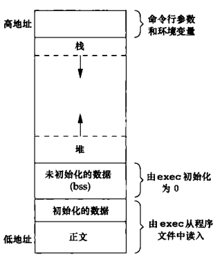

<!-- C 和 C++ 的内存分布 -->

<!-- @import "[TOC]" {cmd="toc" depthFrom=1 depthTo=6 orderedList=false} -->
<!-- code_chunk_output -->

- [C 内存分布](#c-内存分布)
- [C++中内存分布](#c中内存分布)

<!-- /code_chunk_output -->

## C 内存分布

* BSS 段：用来存放程序中未初始化的全局变量。BSS段属于静态内存分配。
* 数据段：用来存放程序中已初始化的全局变量。数据段属于静态内存分配。
* 代码段：用来存放程序执行代码。
* 堆：堆是用于存放进程运行中被动态分配的内存段，它的大小并不固定，可动态扩张或缩减。当进程调用malloc/free等函数分配内存时，新分配的内存就被动态添加到堆上（堆被扩张）/释放的内存从堆中被剔除（堆被缩减）
* 栈：栈又称堆栈， 存放程序的局部变量（但不包括static声明的变量，static意味着在数据段中存放变量）。除此以外，在函数被调用时，栈用来传递参数和返回值。由于栈的先进先出特点，所以栈特别方便用来保存/恢复调用现场。

## C++中内存分布
* 栈：内存由编译器在需要时自动分配和释放。通常用来存储局部变量和函数参数。

* 堆：内存使用new进行分配使用delete或delete[]释放。如果未能对内存进行正确的释放，会造成内存泄漏。但在程序结束时，会由操作系统自动回收。

* 自由存储区：使用malloc进行分配，使用free进行回收。和堆类似。

* 全局/静态存储区：全局变量和静态变量被分配到同一块内存中，C语言中区分初始化和未初始化的，C++中不再区分了。

* 常量存储区：存储常量，不允许被修改 (当然，你要通过非正当手段也可以修改，而且方法很多）

参考链接：
* [C和C++的内存分配细节](http://chenshen.leanote.com/post/C%E5%92%8CC-%E7%9A%84%E5%86%85%E5%AD%98%E5%88%86%E9%85%8D%E7%BB%86%E8%8A%82)
* [C++内存分配方式详解——堆、栈、自由存储区、全局/静态存储区和常量存储区](http://www.cnblogs.com/daocaoren/archive/2011/06/29/2092957.html)

---
- [上一级](README.md)
- 下一篇 -> [设计模式 - 可复用面向对象软件的基础](DesignPatternsBook.md)
