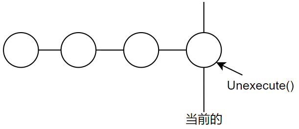
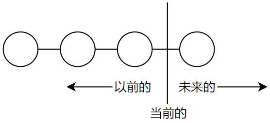

<!-- 设计模式 - 可复用面向对象软件的基础 -->

---
<!-- @import "[TOC]" {cmd="toc" depthFrom=1 depthTo=6 orderedList=false} -->

<!-- code_chunk_output -->

- [第一章 引言](#第一章-引言)
  - [1.1 什么是设计模式](#11-什么是设计模式)
  - [1.2 Smalltalk MVC 中的设计模式](#12-smalltalk-mvc-中的设计模式)
  - [1.3 描述设计模式](#13-描述设计模式)
  - [1.4 设计默认的编目](#14-设计默认的编目)
  - [1.5 组织条目](#15-组织条目)
  - [1.6 设计模式怎样解决设计问题](#16-设计模式怎样解决设计问题)
    - [1.6.1 寻找合适的对象](#161-寻找合适的对象)
    - [1.6.2 决定对象的粒度](#162-决定对象的粒度)
    - [1.6.3 指定对象接口](#163-指定对象接口)
    - [1.6.4 描述对象的实现](#164-描述对象的实现)
    - [1.6.5 运用复用机制](#165-运用复用机制)
      - [继承和组合的比较](#继承和组合的比较)
      - [委托](#委托)
      - [继承和参数化类型的比较](#继承和参数化类型的比较)
    - [1.6.6 关联运行时和编译时的结构](#166-关联运行时和编译时的结构)
    - [1.6.7 设计应支持变化](#167-设计应支持变化)
  - [1.7 怎样选择设计模式](#17-怎样选择设计模式)
  - [1.8 怎样使用设计模式](#18-怎样使用设计模式)
- [第二章 实例研究：设计一个文档编辑器](#第二章-实例研究设计一个文档编辑器)
  - [2.1 设计问题](#21-设计问题)
  - [2.2 文档结构](#22-文档结构)
    - [2.2.1 递归组合](#221-递归组合)
    - [2.2.2 图元](#222-图元)
    - [2.2.3 组合模式](#223-组合模式)
  - [2.3 格式化](#23-格式化)
    - [2.3.1 封装格式化算法](#231-封装格式化算法)
    - [2.3.2 Compositor 和 Compostion](#232-compositor-和-compostion)
    - [2.3.3 策略模式](#233-策略模式)
  - [2.4 修饰用户界面](#24-修饰用户界面)
    - [2.4.1 透明围栏](#241-透明围栏)
    - [2.4.2 Monoglyph](#242-monoglyph)
    - [2.4.3 Decorator 模式](#243-decorator-模式)
  - [2.5 支持多种视感标准](#25-支持多种视感标准)
    - [2.5.1 对象创建的抽象](#251-对象创建的抽象)
    - [2.5.2 工厂和产品类](#252-工厂和产品类)
    - [2.5.3 Abstract Factory 模式](#253-abstract-factory-模式)
  - [2.6 支持多种窗口系统](#26-支持多种窗口系统)
    - [2.6.1 是否可以使用 Abstract Factory 模式](#261-是否可以使用-abstract-factory-模式)
    - [2.6.2 封装实现依赖关系](#262-封装实现依赖关系)
    - [2.6.3 Window 和 WindowImp](#263-window-和-windowimp)
    - [2.6.4 Bridge 模式](#264-bridge-模式)
  - [2.7 用户操作](#27-用户操作)
    - [2.7.1 封装一个请求](#271-封装一个请求)
    - [2.7.2 Command类及其子类](#272-command类及其子类)
    - [2.7.3 撤销和重做](#273-撤销和重做)
    - [2.7.4 命令历史记录](#274-命令历史记录)
    - [2.7.5 Command 模式](#275-command-模式)
  - [2.8 拼写检查和断字处理](#28-拼写检查和断字处理)
    - [2.8.1 访问分散的信息](#281-访问分散的信息)
    - [2.8.2 封装访问和遍历](#282-封装访问和遍历)
    - [2.8.3 Iterator 类及其子类](#283-iterator-类及其子类)
    - [2.8.4 Iterator 模式](#284-iterator-模式)
    - [2.8.5 遍历和遍历过程中的操作](#285-遍历和遍历过程中的操作)
    - [2.8.6 封装分析](#286-封装分析)
    - [2.8.7 Visitor 类及其子类](#287-visitor-类及其子类)
    - [2.8.8 Vistor 模式](#288-vistor-模式)
  - [2.9  小结](#29-小结)
- [第三章 创建型模式](#第三章-创建型模式)
  - [3.1 Abstract Factory (抽象工厂) -- 对象创建型模式](#31-abstract-factory-抽象工厂-对象创建型模式)
    - [1. 意图](#1-意图)
    - [2. 别名](#2-别名)
    - [3. 动机](#3-动机)
    - [4. 适用性](#4-适用性)
    - [5. 结构](#5-结构)
    - [6. 参与者](#6-参与者)
    - [7. 协作](#7-协作)
    - [8. 效果](#8-效果)
    - [9. 实现](#9-实现)
    - [10. 代码示例](#10-代码示例)
    - [11. 已知应用](#11-已知应用)
    - [12. 相关模式](#12-相关模式)
  - [3.2 Builder (生成器) --- 对象创建型模式](#32-builder-生成器-对象创建型模式)
    - [1. 意图](#1-意图-1)
    - [2. 动机](#2-动机)
    - [3. 适用性](#3-适用性)
    - [4. 结构](#4-结构)
    - [5. 参与者](#5-参与者)
    - [6. 协作](#6-协作)
    - [7. 效果](#7-效果)
    - [8. 实现](#8-实现)
    - [9. 代码示例](#9-代码示例)
    - [10. 已知应用](#10-已知应用)
    - [11. 相关模式](#11-相关模式)
  - [3.3 Factory Method (工厂方法) --- 对象创建型模式](#33-factory-method-工厂方法-对象创建型模式)
    - [1. 意图](#1-意图-2)
    - [2. 别名](#2-别名-1)
    - [3. 动机](#3-动机-1)
    - [4. 适用性](#4-适用性-1)
    - [5. 结构](#5-结构-1)
    - [6. 参与者](#6-参与者-1)
    - [7. 协作](#7-协作-1)
    - [8. 效果](#8-效果-1)
    - [9. 实现](#9-实现-1)
    - [10. 代码示例](#10-代码示例-1)
    - [11. 已知应用](#11-已知应用-1)
    - [12. 相关模式](#12-相关模式-1)
  - [3.4 Prototype (原型) --- 对象创建型模式](#34-prototype-原型-对象创建型模式)
    - [1. 意图](#1-意图-3)
    - [2. 动机](#2-动机-1)
    - [3. 适用性](#3-适用性-1)
    - [4. 结构](#4-结构-1)
    - [5.参与者](#5参与者)
    - [6. 协作](#6-协作-1)
    - [7. 效果](#7-效果-1)
    - [8. 实现](#8-实现-1)
    - [9. 代码示例](#9-代码示例-1)
    - [10. 已知应用](#10-已知应用-1)
    - [11. 相关模式](#11-相关模式-1)
  - [3.5 Singleton(单件) --- 对象创建型模式](#35-singleton单件-对象创建型模式)
    - [1. 意图](#1-意图-4)
    - [2. 动机](#2-动机-2)
    - [3. 适用性](#3-适用性-2)
    - [4. 结构](#4-结构-2)
    - [5. 参与者](#5-参与者-1)
    - [6. 协作](#6-协作-2)
    - [7. 效果](#7-效果-2)
    - [8. 实现](#8-实现-2)
    - [9. 代码实例](#9-代码实例)
    - [10. 已知应用](#10-已知应用-2)
    - [11. 相关模式](#11-相关模式-2)
  - [3.6 创建形模式的讨论](#36-创建形模式的讨论)
- [第四章 结构型模式](#第四章-结构型模式)
  - [4.1 Adapter（适配器） - 类对象结构型模式](#41-adapter适配器-类对象结构型模式)
    - [1. 意图](#1-意图-5)
    - [2. 别名](#2-别名-2)
    - [3. 动机](#3-动机-2)
    - [4. 适用性](#4-适用性-2)
    - [5. 结构](#5-结构-2)
    - [6. 参与者](#6-参与者-2)
    - [7. 协作](#7-协作-2)
    - [8. 效果](#8-效果-2)
    - [9. 实现](#9-实现-2)
    - [10. 代码示例](#10-代码示例-2)
    - [11. 已知应用](#11-已知应用-2)
    - [12. 相关模式](#12-相关模式-2)
  - [4.2 Bridge (桥接) - 对象结构型模式](#42-bridge-桥接-对象结构型模式)
    - [1. 意图](#1-意图-6)
    - [2. 别名](#2-别名-3)
    - [3. 动机](#3-动机-3)
    - [4. 适用性](#4-适用性-3)
    - [5. 结构](#5-结构-3)
    - [6. 参与者](#6-参与者-3)
    - [7. 协作](#7-协作-3)
    - [8. 效果](#8-效果-3)
    - [9. 实现](#9-实现-3)
    - [10. 代码示例](#10-代码示例-3)
    - [11. 已知应用](#11-已知应用-3)
    - [12. 相关模式](#12-相关模式-3)
  - [4.3 Composite (组合) - 对象结构型模式](#43-composite-组合-对象结构型模式)
    - [1. 意图](#1-意图-7)
    - [2. 动机](#2-动机-3)
    - [3. 适用性](#3-适用性-3)
    - [结构](#结构)
    - [5. 参与者](#5-参与者-2)
    - [6. 协作](#6-协作-3)
    - [7. 效果](#7-效果-3)
    - [8. 实现](#8-实现-3)
    - [9. 代码示例](#9-代码示例-2)
    - [10. 已知应用](#10-已知应用-3)
    - [11. 相关模式](#11-相关模式-3)
  - [4.4 Decorator - 对象结构型模式](#44-decorator-对象结构型模式)
    - [1. 意图](#1-意图-8)
    - [2. 别名](#2-别名-4)
    - [3. 动机](#3-动机-4)
    - [4. 适用性](#4-适用性-4)
    - [6. 参与者](#6-参与者-4)
    - [7. 协作](#7-协作-4)
    - [8. 效果](#8-效果-4)
    - [9. 实现](#9-实现-4)
    - [10. 代码示例](#10-代码示例-4)
    - [11. 已知应用](#11-已知应用-4)
    - [12. 相关模式](#12-相关模式-4)

<!-- /code_chunk_output -->

---

# 第一章 引言

## 1.1 什么是设计模式

一般而言，一个模式有四个基本要素：

- `模式名`(pattern name)，一个助记名，它用一两个词来描述模式的问题、解决方案和效果。
- `问题`(problem), 描述了应该在何时使用模式。
- `解决方案`(solution)描述了设计的组成部分、他们之间的相互关系及各自的职责和协作方式。
- `效果`(consequence)描述了模式应用的效果及使用模式应权衡的问题。尽管我们描述设计决策时并不总提到模式效果，但它们对于评价设计选择和理解使用模式的代价及好处具有重要的意义。

本书中的设计模式是 `对用来在特定场景下解决一般设计问题的类和相互通信的对象的描述。`

---

## 1.2 Smalltalk MVC 中的设计模式

在 [Smalltalk-80](https://en.wikipedia.org/wiki/Smalltalk) 中，类的模型/视图/控制器（Model/view/Controller）三元组(MVC)被用来构建用户界面。透过 MVC 来看设计模式将帮助我们理解 “模式”这一术语的含义。

若不使用 MVC ，用户界界面设计往往将这些对象混在一起，而 MVC 则将它们分离以提高灵活性和复用性。
MVC 通过建立一个 “订购/通知” 协议来分离视图和模型。视图必须保证它的显示正确地反映了模型的状态。一旦模型的数据发生变化，模型将通知有关的视图，每个视图相应地得到刷新自己的机会。这种方法可以让你为一个模型提供不同的多个视图表现形式，也能够为一个模型创建新的视图而无须重写模型。

下图显示了一个模型和三个视图（为了简单我们省略了控制器）。


表面上看，这个例子反映了将视图和模型分离的设计，然而这个设计还可用于解决更一般的问题：将对象分离，使得一个对象的改变能够影响另一些对象，而这个对象并不需要知道那些被影响的对象的细节。这个更一般的设计被描述成 Observer 模式。

MVC 的另一个特征是视图可以嵌套。例如，按钮控制面板可以用一个嵌套了按钮的复杂视图来实现。MVC 用 view 类的子类 -- compositeView 类来支持嵌套视图。

上例反映了可以将组合视图与其构件平等对待的设计，同样，该设计也适用于更一般的问题：将一些对象划为一组，并将该组对象当作一个对象来使用。这个设计被描述成 Composite 模式。

MVC 允许你在不改变视图外观的情况下改变视图对用户输入的响应方式。例如，你可能希望改变视图对键盘的响应方式，或希望使用弹出菜单而不是原来的命令键方式。MVC 将响应机制封装在 Controller 对象中。存在着一个 Controller 的类层次结构，使得可以方便地对原有 Controller 做适当改变而创建新的 Controller

View-Controller 关系是 Strategy 模式的一个例子。一个策略是一个表述算法的对象。当你想静态或动态地替换一个算法，或你有很多不同的算法，或算法中包含你想封装的复杂数据结构时，策略模式是非常有用的。

MVC 还使用了其他的设计模式，如：用来指定视图默认控制器的 Factory Method 和用来增加视图滚动的 Decorator 。但是 MVC 的主要关系还是 Observer 、 Composite 和 Strategy 三个设计模式给出的。

---

## 1.3 描述设计模式

我们将用统一的格式描述设计模式，有助于你更容易地学习、比较和使用设计模式。

- `模式名和分类`
- `意图`
- `别名`
- `动机`
- `适用性`
- `结构`
- `参与者`，指设计模式中的类和/或对象以及它们各自的职责。
- `协作`，模式的参与者怎样协作以实现它们的职责
- `效果`
- `实现`
- `代码示例`
- `已知应用`
- `相关模式`

---

## 1.4 设计默认的编目

从第三章开始的模式目录中包含23个设计模式。如下所示：

- Abstract Factory(3.1): 提供一个创建一系列相关或相互依赖对象的接口，而无须指定它们具体的类。
- Adapter(4.1): 将一个类的接口转换成客户希望的另外一个接口。Adapter 模式使得原本由于接口不兼容而不能一起工作的那些类可以一起工作。
- Bridge(4.2): 将抽象部分与它的实现部分分离，使它们都可以独立的变化。
- Builder(3.2):将一个复杂对象的构建与它的表示分离，使得同样的构建过程可以创建不同的表示。
- Chain of Responsibility(5.1):解除请求的发送者和接收者之间的耦合，使多个对象都有机会处理这个请求。将这些对象连成一条链，并沿着这条链传递该请求，直到有一个对象处理它。
- Command(5.2): 将一个请求封装为一个对象，从而使你可用不同的请求对客户进行参数化；对请求排队或记录请求日志，以及支持可取消的操作。
- Composite(4.3):将对象组合成树形结构以表示“部分--整体”的层次结构。Composite 使得客户对单个对象和组合对象的使用具有一致性。
- Decorator(4.4):动态地给一个对象添加一些额外的职责。就扩展功能而言，Decorator 模式比生成子类方式更为灵活。
- Facade(4.5):为子系统中的一组接口提供一个一致的界面，Facade 模式定义了一个高层接口，这个接口使得这一子系统更加容易使用。
- Factory Method(3.3)：定义一个用于创建对象的接口，让子类决定将哪一个类实例化。Factory Method 使一个类的实例化延迟到其子类。
- Flyweight(4.6):运用共享技术有效地支持大量细粒度的对象。
- Interpreter(5.3):给定一个语言，定义它的文法的一种表示，并定义一个解释器，该解释器使用该表示来解释语言中的句子。
- Iterator(5.4):提供一种方法顺序访问一个聚合对象中的各个元素，而又不需要暴露该对象的内部表示。
- Mediator(5.5):用一个中介对象来封装一系列的对象交互。中介者使各个对象不用显式地相互调用，从而使其耦合松散，而且可以独立地改变他们之间的交互。
- Memento(5.6):在不破环封装性的前提下，捕获一个对象的内部状态，并在该对象之外保存这个状态。这样以后就可将该对象恢复到保存的状态。
- Observer(5.7):定义对象间的一种一对多的依赖关系，以便当一个对象的状态发生改变时，所有依赖于它的对象都得到通知并自动刷新。
- Prototype(3.4):用原型实例指定创建对象的种类，并且通过拷贝这个原型来创建新的对象。
- Proxy(4.7):为其他对象提供一个代理以控制对这个对象的访问。
- Singleton(3.5):保证一个类仅有一个实例，并提供一个访问它的全局访问点。
- State(5.8):允许一个对象在其内部状态改变时改变它的行为。对象看起来似乎修改了它所属的类。
- Strategy(5.9):定义一系列的算法，把它们一个个封装起来，并且使它们可相互替换。本模式使得算法的变化可独立于使用它的客户。
- Template Method(5.10):定义一个操作中的算法的骨架，而将一些步骤延迟到子类中。Template Method 使得子类不改变一个算法的结构即可重定义该算法的某些特定步骤。
- Vistor(5.11):表示一个作用于某对象结构中的各元素的操作。它使你可以在不改变各元素的类的前提下定义作用于这些元素的新操作。

---

## 1.5 组织条目

<table class="tg">
<thead>
  <tr>
    <th class="tg-g6va" rowspan="2"></th>
    <th class="tg-g6va" rowspan="2"></th>
    <th class="tg-6ltk" colspan="3">目的</th>
  </tr>
  <tr>
    <th class="tg-6ltk">创建型</th>
    <th class="tg-6ltk">结构型</th>
    <th class="tg-6ltk">行为型</th>
  </tr>
</thead>
<tbody>
  <tr>
    <td class="tg-uko8" rowspan="2">范围</td>
    <td class="tg-s4wa">类</td>
    <td class="tg-s4wa">Factory Method</td>
    <td class="tg-s4wa">Adapter</td>
    <td class="tg-s4wa">Interpreter<br>Template Method</td>
  </tr>
  <tr>
    <td class="tg-s4wa">对象</td>
    <td class="tg-s4wa">Abstract Factory<br>Builder<br>Prototype<br>Singleton</td>
    <td class="tg-s4wa">Adapter<br>Bridge<br>Composite<br>Decorator<br>Facade<br>Flyweight<br>Proxy</td>
    <td class="tg-s4wa">Chain of Responsibility<br>Command<br>Iterator<br>Mediator<br>Memento<br>Observer<br>State<br>Strategy<br>Visitor</td>
  </tr>
</tbody>
</table>

我们根据两条准则对模式进行分类。第一条是`目的`准则，即模式是用来完成什么工作的。模式依据其目的可分为：

- 创建型（与对象的创建有关）
- 结构型（处理类与对象的组合）
- 行为型模式（对类或对象怎么交互和怎么分配职责进行描述）。
第二条是`范围`准则，指定模式主要是用于类还是用于对象。`类模式处理类和子类之间的关系，这些关系通过继承建立，是静态的，在编译时便确定下来了`。`对象模式处理对象间的关系,这些关系在运行时是可以变化的，更具动态性。`从某种意义上来说，几乎所有模式都是用继承机制，所以 “类模式”只指那些集中于处理类间关系的模式，而大部分模式都属于对象模式的范畴。

还有一种方式是根据模式的“相关模式”部分所描述的它们怎么互相引用来组织设计模式。如下图所示：


显然，存在着许多组织设计模式的方法。从多角度去思考模式有助于对它们的功能、差异和应用场合的更深入理解。

---

## 1.6 设计模式怎样解决设计问题

设计模式采用多种方法解决面向对象设计者经常碰到的问题。这里给出几个问题以及使用设计模式解决它们的方法。

### 1.6.1 寻找合适的对象

面向对象设计最困难的部分是将系统分解成对象集合。因为要考虑许多因素：封装、粒度、依赖关系、灵活性、性能、演化、复用等，它们都影响着系统的分解，并且这些因素通常还是互相冲突的。
面向对象设计方法学支持许多设计方法。你可以写成一个问题描述，挑出名词和动词，进而创建相应的类和操作；或者，你可以关注系统的协作和职责关系；或者你可以对现实世界建模，再将分析时发现的对象转化至设计中。至于哪一种方法最好，并无定论。

---

### 1.6.2 决定对象的粒度

对象在大小和数目上变化极大。它们能表示下至硬件或上至整个应用的任何事物。那么我们怎样决定一个对象应该是什么呢？
设计模式很好的讲述了这个问题。Facade 模式描述了怎样用对象表示完整的子系统，Flyweight 模式描述了如何支持大量的最小粒度的对象。其他一些设计模式描述了将一个对象分解成许多小对象的特定方法。Abstract Factory 和 Builder 产生那些专门负责生成其他对象的对象。Visitor 和 Command 生成的对象专门负责实现对其他对象或对象组的请求。

---

### 1.6.3 指定对象接口

设计模式通过确定接口的主要组成成分以及经接口发送的数据类型来帮助你定义接口。设计模式也许还会告诉你接口中不应包括哪些东西。Memento 模式是一个很好的例子，它描述了怎样封装和保存对象内部的状态，以便一段时间后对象能恢复到这一状态。它规定了 Memento 对象必须定义两个接口：一个允许客户保持和复制 Memento 的限制接口，一个只有原对象才能使用的用来储存和提取 Memento 中状态的特权接口。
设计模式也指定了接口之间的关系。特别是，它们经常要求一些类具有相似的接口，或它们对一些类的接口做了限制。例如，Decorator 和 Proxy 模式分别要求 Decorator 和 Proxy 对象的接口与被修饰的对象和受委托的对象一致。而 Visitor 模式中，Visitor 接口必须反映出 Visitor 能访问的对象的所有类。

---

### 1.6.4 描述对象的实现

对象的实现是由它的类决定的，类指定了对象的内部数据和表示，也定义了对象所能完成的操作，如下图所示：


我们基于 OMT 的表示法(OMT由Rumbaugh于1991年开发，作为一种广泛用于软件开发的对象建模方法。 OMT被认为是统一建模语言（UML）的前身。 因此，许多OMT建模元素与UML建模元素相似。[Object-modeling technique](https://en.wikipedia.org/wiki/Object-modeling_technique))，将类描述成一个矩形，其中的类名以黑体表示。操作在类名下面，以常规字体表示。类所定义的任何数据都在操作的下面。类名与操作之间以及操作与数据之间用横线分隔。
返回类型和实例变量类型是可选的，因为我们并未假设一定要用具有静态类型的实现语言。
对象通过实例化类来创建，此对象被称为该类的实例。就像这样：


我们以竖线和三角表示子类关系，如下图所示：


抽象类的类名以斜体表示，以与具体类相区别。抽象操作也用斜体表示。图中可以包括实现操作的伪代码，如果这样，则代码将出现在带有褶角的框中，并用虚线将该褶角框与代码所示实现的操作相连，如下图所示：


`混入类`(mixin class)是给其他类提供可选择的接口或功能的类。它与抽象类一样不能实例化。图示如下：


1. 类继承与接口继承的比较
   理解对象的类与对象的类型之间的差别很重要。
   对象的类定义了对象是怎样实现的，同时也定义了对象的内部状态和操作的实现。但是对象的类型只与它的接口有关，接口即对象能响应的请求的集合。一个对象可以有多个类型，不同类的对象可以有相同的类型。

2. 对接口编程而不是对实现编程
    但继承被恰当使用时，所有从抽象类导出的类将共享该抽象类的接口。这意味着子类仅仅添加或重定义操作，而没有隐藏父类的操作。这时，所有的子类都能响应抽象类接口中的请求，从而子类的类型都是抽象类的子类型。
    只是根据抽象类中定义的接口来操纵对象有以下两个好处：
    1. 客户无须知道他们使用对象的特定类型，只需要知道对象有客户所期望的接口。
    2. 客户无须知道他们使用的对象是用什么类来实现的，只需要知道定义接口的抽象类。
    这将极大地减少子系统实现之间的相互依赖关系，也产生了可复用的面向对象设计的如下原则：
    针对接口编程，而不是针对实现编程。

---

### 1.6.5 运用复用机制

理解对象、接口、类和继承之类的概念对大多数人来说并不难，问题的关键在于如何运用它们写出灵活的、可复用的软件。

#### 继承和组合的比较

面向对象系统中功能复用的两种最常用的技术是类继承和对象组合。

- 类继承通过生成子类的复用通常被称为`白箱复用`。术语“白箱”是相对可视性而言的：在继承方式中，父类的内部细节对于子类可见。
- 对象组合是一种通过组装或组合对象的一种更复杂的功能。对象组合要求被组合的对象具有良好定义的接口。这种复用风格被称为`黑箱复用`，因为对象的内部细节是不可见的。

继承和组合各有优缺点。类继承是在编译时静态定义的，且可直接使用，因为程序设计语言直接支持类继承。类继承可以较方便地改变被复用的实现。
但是类也有一些不足之处。首先，因为继承在编译时就定义了，所以无法在运行时改变从父类继承的实现。更糟的是，父类通常至少定义了部分子类的具体表示。因为继承对子类揭示了其父类的实现细节，所以继承常被认为“破坏了封装性”。子类中的实现与它的父类有如此紧密的依赖关系，以至于父类实现中的任何变化必然会导致子类发生变化。
当你需要复用子类时，实现上的依赖就会产生一些问题。如果继承下来的实现不适合解决新的问题，则父类必须重写或被其他更适合的类替换。这种依赖关系限制了灵活性并最终限制了复用性。一个可用的解决方法就是只继承抽象类，因为抽象类通常提供较少的实现。
对象组合是通过获得对其他对象的引用而在运行时动态定义的。组合要求对象遵守彼此的接口约定，进而要求更仔细地定义接口，而这些接口并不妨碍你将一个对象和其他对象一起使用。这还会产生良好的结果：因为对象只能通过接口访问，所以我们并不破环封装性；只要类型一致，运行时还可以用一个对象来替代另一个对象；更进一步，因为对象的实现是基于接口写的，所以实现上存在较少的依赖关系。
对象组合对系统设计还有另一个作用，即优先使用对象组合有助于你保持每一个类被封装，并被集中在单个任务上。这样类和类继承层次会保持较小规模，并且不太可能增长为不可控制的庞然大物。另外，基于对象组合的设计会有更多的对象（而有较少的类），且系统的行为将依赖于对象间的关系而不是被定义在某个类中。
这导出了我们的面向对象设计的第二个原则：
`优先使用对象组合，而不是类继承`

#### 委托

委托(delegation) 是一种组合方法，它使组合具有与继承同样的复用能力。在委托方式下，有两个对象参与处理一个请求，接受请求的对象将操作委托给它的代理者(delegate)。这类似于子类将请求交给它的父类处理。委托方式为了得到同样的效果，接受请求的对象将自己传给被委托者（代理者），使被委托的操作可以引用接受请求的对象。

eg：下面的图显示了窗口类将它的 Area 操作委托给一个矩形实例。


箭头线表示一个类对另一个类实例的引用关系。引用名师可选的，本例为 "rectangle".

委托的主要优点在于它便于运行时组合对象操作以及改变这些操作的组合方式。假定矩形对象和圆对象有相同的类型，我们只需要简单地用圆对象替换矩形对象，得到的窗口就是圆形的。

委托与那些通过对象组合取得软件灵活性的技术一样，具有如下不足之处：动态的、高度参数化的软件比静态软件更难于理解。还有运行低效的问题，不过从长远来看人的低效才是最主要的。只有当委托使设计比较简单而不是更复杂时，它才是好的选择。

有一些模式使用了委托：如 State 、 Strategy 、Visitor 。

委托是对象组合的特例。它告诉你对象组合作为一个代码复用机制可以替代继承。

#### 继承和参数化类型的比较

另一种功能复用技术（并非严格的面向对象技术）是``参数化类型`(parameterized type),也就是`类属`(generic)(Ada、Eiffel)或`模板`(Template)(c++)。

许多设计可以使用这三种技术中的任何一种来实现。实现一个以元素比较操作为可变元的排序例程，可使用如下方法：

1. 通过子类实现该操作(Template Method 的一个应用)
2. 实现要传给排序例程的对象的职责(Strategy)
3. 作为 c++ 模板或 Ada 类属的参数，以指定元素比较操作的名称。

---

### 1.6.6 关联运行时和编译时的结构

一个面向对象程序运行时的结构通常与它的代码结构相差较大。代码结构在编译时就被确定下来了，它由继承关系固定的类组成。而程序的运行结构是由快速变化的通信对象网络组成的。事实上两个结构是彼此独立的。

考虑对象`聚合`(aggregation) 和 `相识`(acquaintance) 的差别以及它们在编译时和运行时的表示有多么不同。聚合意味着一个对象拥有另一个对象或对另一个对象负责。一般我们称一个对象`包含`另一个对象或者是另一个对象的一部分。聚合意味着聚合对象和其所有者具有相同的生命周期。
相识意味着一个对象仅仅知道另一个对象。有时相识也被称为 “关联” 或 “引用” 关系，相识的对象可能请求彼此的操作，但是它们不为彼此负责。相识是一种比聚合要弱的关系，它只是标识了对象间较松散的耦合关系。

在下图中，普通的箭头线表示相识，尾部带有菱形的箭头表示聚合：


聚合和相识很容易混淆，因为它们通常以相同的方法实现。在 C++ 中，聚合可以通过定义表示真正示例的成员变量来实现，但更通常的是将这些成员变量定义为实例指针或引用；相识也是以指针或引用来实现的。

从根本上来讲，是聚合还是相识是由你的意图而不是显式的语言机制决定的。聚合关系使用较少且比相识关系更持久；而相识关系则出现频率较高，但有时只存在于一个操作期间，相识也更具动态性，使得它在源代码中更难被分辨出来。

许多设计模式（特别是那些属于对象范围的）显式地记述了编译时和运行时结构的差别。Composite 和 Decorator 对于构造复杂的运行时结构非常有用。Observer 也与运行时结构有关，但这些结构对于不了解该模式的人来说是很难理解的。Chain of Responsibility 也产生了继承所无法展现的通信模式，总之，只有理解了模式，你才能清楚代码中的运行时结构。

---

### 1.6.7 设计应支持变化

获得最大限度复用的关键在于对新需求和已有需求发生变化时的预见性。要求你的系统设计能够相应地改进。
为了设计适应这种变化且具有健壮性的系统，你必须考虑系统在它的生命周期内会发生怎样的变化。一个不考虑系统变化的设计在将来就有可能需要重新设计。重新设计会影响软件系统的许多方面，并且未曾料到的变化总是代价巨大的。
设计模式可以确保系统以特定方式变化，从而帮助你避免重新设计系统。
下面阐述了一些导致重新设计的一般原因，以及解决这些问题的设计模式：

- `通过显式地指定一个类来创建对象` 在创建对象时指定类名将使你受特定实现的约束而不是特定接口的约束。这会使未来的变化更复杂。要避免这种情况，应该间接地创建对象。
  设计模式： Abstract Factory,Factory Method,Prototype
- `对特殊操作的依赖` 当你为请求指定一个特殊的操作时，完成该请求的方式就固定下来了。为避免请求代码写死，你将可以在编译时或运行时很方便地改变响应请求的方法。
  设计模式： Chain of Responsibility ,Command
- `对硬件和软件平台的依赖` 外部的操作系统接口和应用编程接口(API)在不同的软硬件平台上是不同的。依赖于特定平台的软件将很难移植到其他平台上，甚至很难跟上本地平台的更新。所以设计系统时限制其平台相关性就很重要了。
  设计模式：Abstract Factory,Bridge
- `对对象表示或实现的依赖` 知道对象怎样表示、保存、定位或实现的客户在对象发生变化时可能也需要变化。对客户隐藏这些信息能阻止连锁变化。
  设计模式： Abstract Factory,Bridge,Memento,Proxy
- `算法依赖` 算法在开发和复用时常常被扩展、优化和替代。依赖于某个特定算法的对象在算法发生变化时不得不变化。因此有可能发生变化的算法应该被孤立起来。
  设计模式： Builder,Iterator,Strategy,Template Method,Visitor
- `紧耦合` 紧耦合的类很难独立地被复用，因为它们是互相依赖的。紧耦合产生单块的系统，要改变或删除一个类，你必须理解和改变其他许多类。这样的系统是一个很难学习、移植和维护的密集体。
  松散耦合提高了一个类本身被复用的可能性，并且系统更易于学习、移植、修改和扩展。设计模式使用抽象耦合和分层技术来提高系统的松散耦合性。
  设计模式： Abstract Factory,Command,Facade,Mediator,Observer,Chain of Responsibility
- `通过生成子类来扩充功能` 通常很难通过定义子类来定制对象。每一个新类都有固定的实现开销(初始化、终止处理等)。定义子类还需要对父类有深入的了解。
  一般的对象组合技术和具体的委托技术，是继承之外组合对象行为的另一种灵活方式。另一方面，过多使用对象组合会使设计难于理解。
  设计模式： Bridge,Chain of Responsibility,Composite,Decorator,Observer,Strategy
- `不能方便地对类进行修改` 有时你不得不改变一个难以修改的类。
  设计模式： Adapter,Decorator,Visitor

这些例子放映了使用设计模式有助于增强软件的灵活性。这种灵活性所具有的重要程度取决于你将要建造的软件系统。让我们看一看设计模式在开发如下三类主要软件中所起的作用：应用程序、工具箱和框架。

1. 应用程序
   如果你将要建造像文档编辑器或电子制表软件这样的应用程序，那么它的`内部复用性、可维护性和可扩充性`是要优先考虑的。
2. 工具箱
   一个应用经常会使用来自一个或多个被称为工具箱(toolkit) 的预定义类库中的类。工具箱是一组相关的、可复用的类的集合，这些类提供了通用的功能。工具箱的一个典型例子就是列表、关联表单、堆栈等类的集合，c++ 的 I/O 流库是另一个例子。工具箱强调的是`代码复用`,它们是面向对象环境下的 “子程序库”。
   工具箱的设计比应用设计要难得多，因为它要求对许多应用是可用的和有效的。
3. 框架
   框架是构成一类特定软件的可复用设计的一组相互协作的类。
   框架规定了你的应用的体系结构。它定义了整体结构，类和对象的划分，各部分的主要责任，类和对象怎么协作，以及控制流程。框架与定义了这些设计参数，以便应用设计者或实现者能集中精力于应用本身的特定细节。框架记录了其应用领域的共同的设计决策。因而框架更强调`设计复用`，尽管框架常包括具体的立即可用的子类。
   这个层次的复用导致了应用和它所基于的软件之间的反向控制 (inversion of control).当使用工具箱（或传统的子程序库）时，你需要写应用软件的主体并且调用你想复用的代码。而当使用框架时，你应该复用应用的主体，写主体调用的代码。你不得不以特定的名字和调用约定来写操作的实现，而这会减少你需要做出的设计决策。
   如果说应用程序难以设计，那么工具箱就更难了，而框架则是最难的。框架设计者必须冒险决定一个要适应该领域的所有应用的体系结构。任何对框架设计的实质性修改都会大大降低框架所带来的好处，因为框架对应用的最主要贡献在于它所定义的体系结构。因此设计的框架必须尽可能地灵活、可扩充。
   框架和设计模式有些类似，最主要的不同在于如下三个方面：
   1. `设计模式比框架更抽象`
   2. `设计模式是比框架更小的体系结构元素`
   3. `框架比设计模式更加特例化` 框架总是针对一个特定的应用领域。

---

## 1.7 怎样选择设计模式

这里给出几个不同的方法，以帮助你发现适合你手头问题的设计模式：

- `考虑设计模式是怎样解决设计问题的` 参考[1.6 节](#16-设计模式怎样解决设计问题)的讨论
- `浏览模式的意图部分` [1.4 节](#14-设计默认的编目) 列出了目录中所有模式的意图部分。通读每个模式的意图，找出和你的问题相关的一个或多个模式。你可以使用 [1.5 节](#15-组织条目)表所显示的分类方法缩小你的搜查范围。
- `研究模式怎样互相关联` [1.5 节](#15-组织条目)图以图形的方式显示了设计模式之间的关系。这些关系能指导你获得合适的模式或模式组。
- `研究目的相似的模式` 模式分类描述部分共有三章，一章介绍创建型模式，一章介绍结构型模式，一章介绍行为型模式。每一章以对模式介绍性的评价开始，以一个小节的比较和对照结束。这些小节使你得以洞察具有相似目的的模式之间的共同点和不同点。
- `检查重新设计的原因` 看一看 [1.6.7 设计应支持变化](#167-设计应支持变化)开始讨论的引起重新设计的各种原因，看看你的问题是否与它们有关，然后再找出哪些模式可以帮助你避免这些会导致重新设计的因素。
- `考虑你的设计中哪些是可变的` 这个方法与关注引起重新设计的原因刚好相反。它不是考虑什么会迫使你的设计改变，而是考虑你想要什么变化却又不会引起重新设计。最主要的一点是 `封装变化的概念`，这是许多设计模式的主题。下表列出了设计模式允许你独立变化的方面，你可以改变它们而又不会导致重新设计。

<table class="tg" style="undefined;table-layout: fixed; width: 944px">
<colgroup>
<col style="width: 119px">
<col style="width: 206px">
<col style="width: 619px">
</colgroup>
<thead>
  <tr>
    <th class="tg-baqh">目的</th>
    <th class="tg-baqh">设计模式</th>
    <th class="tg-baqh">可变的方面</th>
  </tr>
</thead>
<tbody>
  <tr>
    <td class="tg-nrix" rowspan="5">创建</td>
    <td class="tg-0lax">Abstract Factory</td>
    <td class="tg-0lax">产品对象家族</td>
  </tr>
  <tr>
    <td class="tg-0lax">Builder</td>
    <td class="tg-0lax">如何创建一个组合对象</td>
  </tr>
  <tr>
    <td class="tg-0lax">Factory Method</td>
    <td class="tg-0lax">被实例化的子类</td>
  </tr>
  <tr>
    <td class="tg-0lax">Prototype</td>
    <td class="tg-0lax">被实例化的类</td>
  </tr>
  <tr>
    <td class="tg-0lax">Singleton</td>
    <td class="tg-0lax">一个类的唯一实例</td>
  </tr>
  <tr>
    <td class="tg-nrix" rowspan="7">结构</td>
    <td class="tg-0lax">Adapter</td>
    <td class="tg-0lax">对象的接口</td>
  </tr>
  <tr>
    <td class="tg-0lax">Bridge</td>
    <td class="tg-0lax">对象的实现</td>
  </tr>
  <tr>
    <td class="tg-0lax">Composite</td>
    <td class="tg-0lax">一个对象的结构和组成</td>
  </tr>
  <tr>
    <td class="tg-0lax">Decorator</td>
    <td class="tg-0lax">对象的职责，不生成子类</td>
  </tr>
  <tr>
    <td class="tg-0lax">Facade</td>
    <td class="tg-0lax">一个子系统的接口</td>
  </tr>
  <tr>
    <td class="tg-0lax">FlyWeight</td>
    <td class="tg-0lax">对象的存储开销</td>
  </tr>
  <tr>
    <td class="tg-0lax">Proxy</td>
    <td class="tg-0lax">如何访问一个对象；该对象的位置</td>
  </tr>
  <tr>
    <td class="tg-nrix" rowspan="11">行为</td>
    <td class="tg-0lax">Chain of Responsibility</td>
    <td class="tg-cly1">满足一个请求的对象</td>
  </tr>
  <tr>
    <td class="tg-0lax">Command</td>
    <td class="tg-0lax">何时、怎样满足一个请求</td>
  </tr>
  <tr>
    <td class="tg-0lax">Interpreter</td>
    <td class="tg-0lax">一个语言的文法及解释</td>
  </tr>
  <tr>
    <td class="tg-0lax">Iterator</td>
    <td class="tg-0lax">如何遍历、访问一个聚合的各元素</td>
  </tr>
  <tr>
    <td class="tg-0lax">Mediator</td>
    <td class="tg-0lax">对象间怎样交互、和谁交互</td>
  </tr>
  <tr>
    <td class="tg-0lax">Memento</td>
    <td class="tg-0lax">一个对象中哪些私有信息存放在该对象之外，以及在什么时候进行存储</td>
  </tr>
  <tr>
    <td class="tg-0lax">Observer</td>
    <td class="tg-0lax">多个对象依赖于另外一个对象，而这些对象又如何保持一致</td>
  </tr>
  <tr>
    <td class="tg-0lax">State</td>
    <td class="tg-0lax">对象的状态</td>
  </tr>
  <tr>
    <td class="tg-0lax">Strategy</td>
    <td class="tg-0lax">算法</td>
  </tr>
  <tr>
    <td class="tg-0lax">Template Method</td>
    <td class="tg-0lax">算法中的某些步骤</td>
  </tr>
  <tr>
    <td class="tg-0lax">Visitor</td>
    <td class="tg-0lax">某些可作用于一个（组）对象上的操作，但不修改这些对象的类</td>
  </tr>
</tbody>
</table>

---

## 1.8 怎样使用设计模式

一旦选择了一个设计模式，该怎么使用它呢？这里给出一个有效应用设计模式的循序渐进的方法。

1. `大致浏览一遍模式` 特别注意其适用性部分和效果部分，确定它适合你的问题
2. `回头研究结构部分、参与者部分和协作部分` 确保你理解这个模式的类和对象以及它们是怎样关联的。
3. `看代码示例部分，看看这个模式代码形式的具体例子` 研究代码将有助于你实现模式。
4. `选择模式参与者的名字，使它们在应用上下文中有意义`
5. `定义类`
6. `定义模式中专用于应用的操作名称` 这里再次体现出名字一般依赖于应用。使用每一个与操作相关联的责任和协作作为指导。还有，你的名字约定要一致。例如，可以使用 "Create-"前缀统一标记 Factory 方法。
7. `实现执行模式中责任和协作的操作` 实现部分提供线索指导你进行实现。代码示例部分的例子也能提供帮助。

关于设计模式，如果不提一下它们的使用限制，那么关于怎样使用它们的讨论就是不完整的。设计模式不能够随意使用。通常你通过引入额外的间接层次获得灵活性和可变性的同时，也使设计变得更复杂/或牺牲了一定的性能。一个设计模式只有当它提供的灵活性是真正需要的时候，才有必要使用。当衡量一个模式的得失时，它的效果部分是最能提供帮助的，如[1.7 怎样选择设计模式](#17-怎样选择设计模式)表所示。

---

# 第二章 实例研究：设计一个文档编辑器

这一章将通过设计一个称为 Lexi 的文档编辑器来介绍设计模式的实际应用。


## 2.1 设计问题

我们将考察 Lexi 设计中的7个问题：

1. 文档结构 - 文档内部表示的选择几乎影响到 Lexi 设计的每个方面
2. 格式化 - 怎样将文本和图形安排到行和列上？哪些对象负责执行不同的格式策略？这些策略是怎样和内部表示相互作用的？
3. 修饰用户界面
4. 支持多种视感(look-and-feel) 标准
5. 支持多种窗口系统
6. 用户操作 - 用户通过不同的用户界面控制 Lexi ，包括按钮和下拉菜单。
7. 拼写检查和连字符

我们将在下面的各节中讨论这些设计问题。

---

## 2.2 文档结构

从根本上来说，一个文档只是对字符、线、多边形和其他图形元素的一种安排。这些元素记录了文档的整个信息内容。然而，文档作者通常并不将这些元素看作图形项，而是看作文档的物理结构 - 行、列、图形、表和其他子结构。而这些子结构也有自己的子结构。
实现的内部表示应支持如下几点：

- 保持文档的物理结构，即将文本和图形安排到行、列、表等。
- 可视化地生成和显示文档。
- 根据显示位置来映射文档内部表示的元素。这可以使 Lexi 根据用户在可视化表示中所点击的某个东西来决定用户所引用的文档元素。

除了这些目标外，还有一些限制条件。

- 首先，我们应该一致地对待文本和图形。否则，我们最后得到的是冗余的格式和操纵机制。
- 其次，我们的实现不应该过分强调内部表示中单个元素和元素组之间的差别。应该能够一致地对待简单元素和组合元素，这样就允许任意复杂的文档。
- 然而，为了检查拼写错误和确定连字符的连接点，需要对文本进行分析。这就与第二个限制条件产生了矛盾。我们通常并不关心一行上的元素是简单对象还是复杂对象，但是文本分析有时候依赖于被分析的对象。文档内部表示设计应该考虑和权衡这种或其他潜在的彼此矛盾的限制条件。

---

### 　2.2.1 递归组合

层次结构信息的表述通常是通过一个称为`递归组合`(recursive composition) 的技术来实现的。递归组合可以由较简单的元素逐渐建立复杂的元素。
eg：


其文本和图形递归组合的对象结构如下：


这里隐含了两个重要的方面。

1. 很明显的是对象需要相应的类
2. 不那么明显的是这些类必须有兼容的接口。

---

### 2.2.2 图元

我们将为出现在文档结构中的所有对象定义一个抽象类Glyph(`图元`)。它的子类即定义了基本的图形元素（像字符和图像），又定义了结构元素（像行和列）。c++ 实现如下所示：

```c++
class Glyph{
  public:
    // 表现 --
    virtual void Draw(Window * w)=0;
    // 返回的是包含该图元的最小矩形区域
    virtual void Bounds(Rect& rect)=0;
    // -- 表现

    // 点击检测.判断一个指定的点是否与图元相交。
    // 任何时候用户点击文档某处时，都能调用该操作
    // 确定鼠标所在的图元或图元结构。
    virtual bool Intersects(const Point& point)=0;

    // 结构 --
    // 在整数索引指定的位置上插入一个图元
    virtual void Insert(Glyph * glyph,int pos)=0;
    // 移除一个指定的子图元
    virtual void Remove(Glyph * glyph)=0;
    virtual Glygh * Child(int pos)=0;
    virtual Glyph * Parent()=0;
    // -- 结构
  private:
    ...
}

```


---

### 2.2.3 组合模式

递归组合不仅可以用来表示文档，还可以用来表示任何复杂的、层次式的结构。 Composite 模式描述了面向对象的递归组合的本质。

---

## 2.3 格式化

我们已经解决了文档物理结构的`表示`问题。接着，我们需要解决的问题是怎样构造一个特殊物理结构，该结构对应于一个恰当地格式化了的文档。
现在我们将“格式化”含义限制为将一个图元集合分解为若干行。下面我们可以互换使用术语“格式化”(formating) 和 “分行”(linebreaking)。下面讨论的技术同样适用于将行分解为列和将列分解为页。

---

### 2.3.1 封装格式化算法

由于所有这些限制条件和许多细节问题，格式化过程不容易被自动化。这里有许多解决方法，实际上人们已经提出了各种各样具有不同能力和缺陷的格式化算法。因为 Lexi 是一个所见即所得的编辑器，所以一个必须考虑的重要权衡之处在于格式化的质量和格式化的速度之间的取舍。
因为格式化算法趋于复杂化，因而可以考虑将它们包含于文档结构之中，但最好是将它们彻底独立于文档结构之外。理想情况下，我们能够自由地增加一个 Glyph 子类而不用考虑格式化算法。反过来，增加一个格式化算法不应要求修改已有的图元类。
这些特征要求我们设计的 Lexi 易于改变格式化算法。我们可以将算法独立出来，并把它封装到对象中使其便于替代。

### 2.3.2 Compositor 和 Compostion

我们为能封装格式化算法的对象定义一个 Compositor 类。 eg：

```c++
class Compositor{
  public:
    void SetComposition(Composition * composition);
    // 何时格式化
    virtual void Compose();
  private:
    ...
}
```


一个未格式化的 Compostion 对象只包含组成文档基本内容的可见图元，它并不包含像行和列这样的决定文档物理结构的图元。


每一个Compositor 子类都能实现一个不同的分行算法。例如，一个 SimpleCompositor 可以执行得很快，而不考虑像文档"色彩"这样深奥的东西。好的色彩意味着文本和空白的平滑分布。一个 TeXCompositor 会实现完全的 TEX 算法[Knu84],会考虑色彩这样的东西，但以较长的格式化时间作为代价。

Compositor-Compostion 类的分离确保了支持文档物理结构的代码和支持不同格式化算法的代码之间的分离。我们能增加新的 Compositor 子类而不触及 Glyph 类，反之亦然。事实上，我们通过给 Composition 的基本图元接口增加一个 SetComposition 操作，即可在运行时改变分行算法。

---

### 2.3.3 策略模式

在对象中封装算法是 Strategy 模式的目的。

---

## 2.4 修饰用户界面

我们针对 Lexi 用户界面考虑两种修饰：

1. 文本编辑区周围加边界以界定文本页
2. 加滚动条让用户能看到同一页的不同部分。
为了便于增加和去除这些修饰，我们不应该通过继承方式将它们加到用户界面中。如果其他用户界面对象不知道存在这些修饰，那么我们就能获得最大的灵活性。这使我们无须改变其他的类就能增加和移去这些修饰。

---

### 2.4.1 透明围栏

`透明围栏`的概念:

1. 单子女（单`组件`）组合模式
2. 兼容的接口
客户通常分辨不出它们是在处理组件还是组件的`围栏`（即这个组件的父对象），特别是当围栏只是代理组件的所有操作时更是如此。但是围栏也能通过在代理操作之前或之后添加一些自己的操作来修改组件的行为。围栏也能有效地为组件添加状态。

---

### 2.4.2 Monoglyph

我们定义 Glyph 的子类 Monoglyph 作为像 Border 这样起修饰作用的图元的抽象类。Monoglyph 保存了指向一个组件的引用并且传递所有的请求给这个组件。


这使得 Monoglyph 缺省情况下对客户完全透明。例如:

```c++
void Monoglyph::Draw(Window * w){
  _component->Draw(w);
}
```

Monoglyph 的子类至少重新实现一个这样的传递操作，eg:

```c++
void Border::Draw(Window * w){
  Monoglyph::Draw(w);
  DrawBorder(w);
}
```

现在我们已经有了给 Lexi 文本编辑区增加边界和滚动界面所需的一切准备。我们可以在一个 Scroller 实例中组合已存在的 Composition 实例以增加滚动界面，然后再把它组合到 Border 实例中。结果对象结构如图 2-8 所示。


---

### 2.4.3 Decorator 模式

Decorator 模式描述了以透明围栏来支持修饰的类和对象的关系。在该模式中，修饰指给一个对象增加职责的事物。

---

## 2.5 支持多种视感标准

获得跨越硬件和软件平台的可移植性时系统设计的主要问题之一。将 Lexi 移植到一个新的平台不应当要求对 Lexi 进行重大的修改，否则的话就失去了移植 Lexi 的价值。我们应当使可能地方便。
移植的一大障碍是不同视感标准之间的差异性。
我们的设计目标就是使 Lexi 符合多个已存在的视感标准，并且在新标准出现时要能很容易地增加对新标准的支持。

---

### 2.5.1 对象创建的抽象

我们假定用两个窗口组件图元集合来实现多个视感标准：

1. 第一个集合是由抽象 Glygh 子类构成的，对每一个窗口组件都有一个抽象 Glygh 子类。例如，抽象子类 ScrollBar 扩充了基本的 Glygh 接口，以便增加通用的滚动操作；Button 是用来增加按钮有关操作的抽象类；等等；
2. 另一个集合是由与抽象子类对应的具体子类构成的，这些具体子类用于实现不同的视感标准。例如，ScrollBar 可能有 MotifScrollBar 和 PMScrollBar 两个子类以实现相应的 Motif 和 PM 风格的滚动条。

Lexi 需要一种方法来确定创建合适窗口组件所需的视感标准。

---

### 2.5.2 工厂和产品类

通常我们可以使用下面的 C++ 代码来创建一个 Motif 滚动条图元实例：

```c++
auto sb = new MotifScrollBar;
```

但如果你想使 Lexi 的视感依赖性最小的话，这种代码要尽量避免。假如我们这样：

```c++
auto sb=guiFactory->CreateScrollBar();
```

图 2-9 显示了 guiFactory 对象的结果类层次结构。


我们说工厂(Factory) 创造了`产品`(Product)对象。更进一步，工厂生产的产品使彼此相关的；这种情况下，产品是相同视感的所有窗口组件。图 2-10 显示了这样一些产品类，工厂产生窗口组件图元时要用到它们。


---

### 2.5.3 Abstract Factory 模式

工厂(Factory) 和产品(Product)是 Abstract Factory 模式的主要参与者。该模式描述了怎样在不直接实例化类的情况下创建一系列相关的产品对象。它最适用于产品对象的数目和种类不变，而具体产品系列之间存在不同的情况。

---

## 2.6 支持多种窗口系统

视感只是众多移植问题之一。另一个移植问题是 Lexi 所运行的窗口环境。我们希望 Lexi 可以在尽可能多的窗口系统上运行，这和 Lexi 要支持多个视感标准是同样的道理。

---

### 2.6.1 是否可以使用 Abstract Factory 模式

乍一看，这似乎又是一个使用 Abstract Factory 模式的情况。但是对窗口系统移植的限制条件与视感的独立性是有极大不同的。

现在我们假设已经有一些不同厂家的类层次结构，每一个类层次对应一个视感标准。当然，这些类层次不太可能有太多兼容之处。因而我们无法给每个窗口组件（滚动条、按钮、菜单等）都创建一个公共抽象产品类。

但是事情还是有换回的余地。像视感标准一样，窗口系统的接口也并非截然不同。因为所有的窗口系统总的来说是做同一件事。我们可对不同的窗口系统做一个统一抽象，再对各窗口系统的实现做一些调整，使之符合公共的接口。

### 2.6.2 封装实现依赖关系

之前我们介绍了显示一个图元或图元结构的 Window 类。Window 类封装了各窗口系统都要做的一些事情：

- 它们提供了画基本几何图形的操作。
- 它们能变成图标或还原成窗口
- 它们能改变自己的大小。
- 它们能够根据需要画出（或者重画出）窗口内容。例如，当它们由图标还原为窗口时，或它们在屏幕空间上重叠、出界的部分重新显示时，都要重画。

Window 类的窗口功能必须跨越不同的窗口系统。让我们考虑两种极端的观点：

1. `功能的交集` Window 类的接口只提供所有窗口系统共有的功能。
2. `功能并集` 创建一个合并了所有已有系统的功能的接口。

以上方法都不切实可行，所以我们的设计将采取折中的办法。Window 类将提供一个支持大多数窗口系统的方便的接口。因为 Lexi 直接处理 Window 类，所以它还必须支持 Lexi 的图元。这意味着 Window 接口必须包括让图元可以在窗口中画出自己的基本图形操作集合。下表列出了 Window 类中的一些操作的接口。

<table class="tg">
<thead>
  <tr>
    <th class="tg-c3ow">责任</th>
    <th class="tg-c3ow">操作</th>
  </tr>
</thead>
<tbody>
  <tr>
    <td class="tg-9wq8" rowspan="6">窗口管理</td>
    <td class="tg-c3ow">virtual void Redraw()</td>
  </tr>
  <tr>
    <td class="tg-c3ow">vritual void Raise()</td>
  </tr>
  <tr>
    <td class="tg-c3ow">virtual void Lower()</td>
  </tr>
  <tr>
    <td class="tg-c3ow">virtual void Iconify()</td>
  </tr>
  <tr>
    <td class="tg-c3ow">virtual void Deiconify()</td>
  </tr>
  <tr>
    <td class="tg-c3ow">...</td>
  </tr>
  <tr>
    <td class="tg-9wq8" rowspan="5">图形</td>
    <td class="tg-c3ow">virual void DrawLine(...)</td>
  </tr>
  <tr>
    <td class="tg-c3ow">virtual void DrawRect(...)</td>
  </tr>
  <tr>
    <td class="tg-c3ow">virtual void DrawPolygon(...)</td>
  </tr>
  <tr>
    <td class="tg-c3ow">virtual void DrawText(...)</td>
  </tr>
  <tr>
    <td class="tg-c3ow">...</td>
  </tr>
</tbody>
</table>

类图如下所示：


现在我们已经为 Lexi 定义了工作的窗口接口，那么真正与平台相关的窗口是从哪里来的？既然我们不能实现自己的窗口系统，那么这个窗口系统抽象必须用目标窗口系统平台来实现。怎样实现？

一种方法是实现 Window 类和他的子类的多个版本，每个版本对应一个窗口平台。
另一种方式是为每一个窗口层次结构中的类创建特定实现的子类，但这同样会产生我们在试图增加修饰是遇到的子类数目爆炸问题。这两种方法都有另一个缺点：没有在编译以后改变所用窗口系统的灵活性。所以我们不得不保持若干不同的可执行程序。

既然这两种方法都没有吸引力，那么我们还能做些什么呢？我们可以：`对变化的概念进行封装`。我们可以通过简单地传递合适的窗口系统封装对象，给窗口系统配置窗口对象。我们甚至能在运行时配置窗口。

### 2.6.3 Window 和 WindowImp

我们将定义一个独立的 WindowImp 类来隐藏不同窗口系统的实现。WindowImp 是一个封装了窗口系统相关代码的对象的抽象类。


1. WindowImp 的子类
   WindowImp 的子类将用户请求转变成特定窗口系统的操作。

   ```c++
   void Rectangle::Draw(Window * w){
     w->DrawRect(_x0,_y0,_x1,_y1);
   }

   void Window::DrawRect(Coord x0,Coor y0,Coord x1,Coord y1){
     _imp->DeviceRect(x0,y0,x1,y1);
   }
   ```

   XWindowImp 的 DeviceRect 的实现可能如下：

   ```c++
    void XWindowImp::DeviceRect(Coord x0,Coord y0,Coord x1,Coord y1){
      int x=round(min(x0,x1));
      int y=round(min(y0,y1));
      int w=round(abs(x0-x1));
      int h=round(abs(y0-y1));
      XDrawRectangle(_dpy,_winid,_gc,x,y,w,h);
    }   
   ```

   PMWindowImp([Presentation Manager](https://en.wikipedia.org/wiki/Presentation_Manager) 的 WindowImp 子类)的 DeviceRect 实现如下所示：

   ```c++
    void PMWindowImp::DeviceRect(Coord x0,Coord y0,Coord x1,Coord y1){
      Coord left=min(x0,x1);
      Coord right=max(x0,x1);
      Coord bottom=min(y0,y1);
      Coord top=max(y0,y1);

      PPOINTL point[4];
      point[0].x=left; point[0].y=top;
      point[1].x=right; point[1].y=top;
      point[2].x=right; point[2].y=bottom;
      point[3].x=left; point[3].y=bottom;

      if(
          (GpiBeginPath(_hps,1L) == false) ||
          (GpiSetCurrentPosition(_hps,&point[3]) == false) ||
          (GpiPolyLine(_hps,4L,point) == GPI_ERROR ) ||
          (GpiEndPath(_hps) == false)
        ){
          // report error
        }else{
          GpiStrokePath(_hps,1L,0L);
        }
    }
   ```

2. 用 WindowImp 来配置窗口
   我们可以使用 Abstract Factory 模式来配置。（当然还有很多种可能）；

   ```c++
    class WindowSystemFactory{
      public:
        virtual WindowImp * CreateWindowImp()=0;
        virtual ColorImp * CreateColorImp()=0;
        virtual FontImp * CreateFontImp()=0;

        ...
    }   
   ```

   现在我们可以为每一个窗口系统定义一个具体的工厂：

   ```c++
    class PMWindowSystemFactory:public WindowSystemFactory{
      public:
        WindowImp * CreateWindowImp() override{
          return new PMWindowImp;
        }
        ...
    }   
    class XWindowSystemFactory:public WindowSystemFactory{
      public:
        WindowImp * CreateWindowImp() override{
          return new XWindowImp;
        }
        ...
    }   
   ```

   Window 基类的构造函数能使用 WindowSystemFactory 接口和合适的窗口就系统的 WindowImp 来初始化成员变量 _imp:

   ```c++
    Window::Window(){
      _imp = windowSystemFactory->CreateWindowImp();
    }   
   ```

### 2.6.4 Bridge 模式

WindowImp 类定义了一个公共窗口系统设施的接口，但它的设计是受不同于 Window 接口的限制条件驱动的。应用程序员不直接处理 WindowImp 的接口，它们只处理 Window 对象。
Window 类是针对应用程序员的，而 WindowImp 接口时针对窗口系统的。将窗口功能分离到 Window 和 WindowImp 类层次中，这样我们可以独立实现这些接口。这些类层次的对象合作实现 Lexi 无须修改就能运行在多窗口系统的目标。
Window 和 WindowImp 的关系是 Bridge 模式的一个例子。Bridge 模式的目的就是允许分离的类层次一起工作，即使它们是独立演化的。我们的设计准则使我们创建了两个分离的类层次，一个支持窗口的逻辑概念，另一个描述了窗口的不同实现。Bridge 模式允许我们保持和加强我们对窗口的逻辑抽象，而不触及窗口系统相关的代码；反之也是一样。

---

## 2.7 用户操作

Lexi 需要支持一些用户操作。比如你可以输入和删除文本，移动插入点，通过指向、单击选择文本区域，也可以在文档中输入文字。另一些功能是通过 Lexi 的下拉菜单、按钮和快捷键来间接得到的。 ...

Lexi 为这些用户操作提供不同的界面。但是我们不希望一个特定的用户操作就关联一个特定的用户界面。再说，这些操作是用不同的类来实现的。我们想要访问这些功能，但又不希望在用户界面的它的实现之间建立过多的依赖关系。否则，最终我们得到的是紧耦合的实现，它难以理解、扩充和维护。更复杂的是我们希望 Lexi 能对大多数功能支持撤销和重做操作。
很明显对用户操作的支持渗透到了应用中。我们所面临的挑战在于提出一个简单、可扩充的机制来满足所有这些要求。

### 2.7.1 封装一个请求

从设计者的角度来看，一个下拉菜单仅仅是包含了其他图元的又一种图元。下拉菜单和其他有子女的图元的差别在于大多数菜单中的图元会响应鼠标点击而做一些操作。

让我们假设这些做事情的图元是一个被称为 MenuItem 的 Glygh 子类的实例，并且它们做一些事情来响应客户的请求。
我们可以为每一个用户定义一个 MenuItem 的子类，然后为每一个子类编码区执行请求。但这并不是正确的方法，我们并不需要为每个请求定义一个 MenuItem 子类，正如我们并不需要为每一个下拉菜单的文本字符串定义一个子类。我们应该使用对象来参数化 MenuItem 。我们可以通过继承扩充和复用请求实现。我们也可以保存状态和实现撤销/重做功能。这里是另一个封装变化概念的例子，即封装请求，我们将在 Command 对象中封装每一个请求。

### 2.7.2 Command类及其子类

首先我们定义一个 Command 抽象类，以提供发送请求的接口。


### 2.7.3 撤销和重做

在交互应用中撤销和重做(Undo/Redo)能力是很重要的。为了撤销和重做一个命令，我们在 Command 接口中增加 Unexecute 操作。另外为了决定一个命令是否可以撤销，我们还会给 Command 接口增加一个抽象的 Reversible 操作，它返回 Boolean 值。

### 2.7.4 命令历史记录

支持任意层次的撤销和重做命令的最后一步是定义一个`命令历史记录`(command history)或已执行命令的列表（或已被撤销的一些命令）。


要撤销最近的命令，我们调用最右的 Command 对象的 Unexecute 操作，如下图所示：



对最近命令调用 Unexecute 之后，我们将 “当前的” 线左移一个 Command 对象的距离。如果用户再次选择撤销操作，则下一个最近发送的命令以相同的方式被撤销，我们可以看到如下图所示的状态。


要重做一个刚刚被撤销的命令，我们只需做上面的逆过程。在“当前的”线右边的命令是以后可以被重做的命令。重做刚被撤销的命令时，我们调用紧靠 “当前的”线右边的 Command 对象的 Execute ：


然后我们将“当前的”线前移，以便接下来的重做能够调用下一个 Command 对象：



当然，如果接下来的操作不是重做而是撤销，那么“当前的”线左边的命令将被撤销。这样当需要从错误中恢复时，用户能有效及时地撤销和重做命令。

### 2.7.5 Command 模式

Lexi 的命令是 Command 模式的应用。该模式描述了怎样封装请求，也描述了一致的发送请求的命令，它允许你配置客户端以处理不同请求。

---

## 2.8 拼写检查和断字处理

最后一个设计问题设计文本分析，这里特别指的是拼写错误的检查和良好格式所需的连字符连接点。
我们要尽量避免将功能和文档结构紧密耦合，此时这个目标甚至被格式化设计时更重要。
事实上这个难题可以分为两部分：

1. 访问需要分析的信息，而它们时被分散在文档结构的图元中的；
2. 分析这些信息。

### 2.8.1 访问分散的信息

许多分析要求逐字检查文本，而我们需要分析的文本时分散在图元对象的层次结构中的。为了检查这种结构的文本，我们需要一种访问机制以知道数据结构中所保存的图元对象。另外我们的访问机制还必须能适应不同的数据结构。

### 2.8.2 封装访问和遍历

假如我们的图元接口使用一个整数索引让客户引用子图元。图元抽象的一个重要作用时隐藏了存储其子图元的数据结构，我们可以在不影响其他类的情况下改变图元类的数据结构。
因而，只有图元自己知道它所使用的数据结构。可以有这样的推论：图元接口不应该偏重于某个数据结构。

我们可以给 Glyph 的接口增加如下的抽象操作来支持这种方法：

```c++
  enum Traversal{
    CHILDREN, // 只遍历图元的直接子图元
    PREORDER, // 以先序方式遍历整个结构
    POSTORDER, // 以后序方式遍历整个结构
    INORDER
  }

  void First(Traversal kind);
  void Next();
  bool IsDone();
  Glyph * GetCurrent();
  void Insert(Glygh *);
```

使用方法如下：

```c++
  Glyph * g;
  for(g->First(PREORDER);!g->IsDone();g->Next()){
    Glyph * current = g->GetCurrent();

    //do some analysis 
  }
```

但是该方法仍然有一些问题。举个例子，它在不扩展枚举值或增加新的操作的条件下不能支持新的遍历方式。
再一个强调，一个好的解决方案是封装那些变化的概念，在本例中我们指的是访问和遍历机制。我们引入一类称为 `迭代器`(Iterator) 的对象，它们的目的是定义这些机制的不同集合。

### 2.8.3 Iterator 类及其子类

使用抽象类 Iterator 为访问和遍历定义一个通用的接口。具体子类如 `ArrayIterator`和 `ListIterator`负责实现该接口，以提供对数组和列表的访问；而 `PreOrderIterator`和 `PostOrderIterator` 以及类似的类负责在指定结构上实现不同的遍历方式。


Iterator 接口提供 First、Next 和 IsDone 操作来控制遍历。ListIterator 类实现的 First 操作指向列表的第一个元素；Next 前进到列表的下一个元素；IsDone 返回列表指针是否指向列表范围以外；CurrentItem 返回 Iterator 所指的图元。ArrayIterator 类的实现类似，只不过它是针对一个图元数组。

现在我们无须知道具体表示也能访问一个图元结构的子女：

```c++
Glygh * g;
Iterator<Glyph *> * i = g->CreateIterator();

for(i->First();!i->IsDone();i->Next()){
  Glygh * child = i->CurrentItem();

  //do something with current child 
}
```

在 缺省情况下 CreateIterator 返回一个 NullIterator 实例。 NullIterator 是一个退化的 Iterator,它适用于叶子图元，即没有子图元的图元。NullIterator 的 IsDone 操作返回 true。

一个有子女的图元子类将重载 CreateIterator,返回不同 Iterator 子类的一个实例，eg：

```c++
Iterator<Glygh *>* Row::CreateIterator(){
  return new ListIterator<Glygh *>(_children);
}
```

### 2.8.4 Iterator 模式

Iterator 模式描述了那些支持访问和遍历对象的技术，它不仅可以用于组合结构，也可用于集合。该模式抽象了遍历算法，对客户隐藏了它所遍历对象的内部结构。Iterator 模式再一次说明了怎样封装变化的概念，有助于我们获得灵活性和复用性。尽管如此，迭代问题的复杂性还是令人吃惊的，Iterator 模式包含的细微差别和权衡比我们这里考虑的更多。

### 2.8.5 遍历和遍历过程中的操作

现在我们有了遍历图元结构的方法，可以进行拼写检查和支持连字符。这两种分析都涉及遍历过程中的信息积累。
为了得到更多的灵活性和复用性，我们应当将分析和遍历分开，那么将分析责任放到什么地方呢？我们知道有许多种分析需要做，，每一种分析将在不同的遍历点做不同的事情。因此，不同的分析过程必然是分析不同的图元。

因而一个给定的分析必须能区别不同种类的图元。很明显的一种做法是将分析能力放到图元类本身。但麻烦的是我们每增加一种新的分析，都必须改变每一个图元类。某些情况下可以使这个问题简化：为 Glygh 类中的抽象操作补充一个缺省的实现。

然而即使缺省实现可以减少需要修改的类的数目，一个隐含的问题依然存在：随着新的分析功能的增加，Glygh 的接口会变得越来越大。众多的分析操作会逐渐模糊基本的 Glygh 接口，从而很难看出图元的主要目的是定义和结构化那些有外观和形状的对象 - 这些接口完全被淹没了。

### 2.8.6 封装分析

所有迹象表明，我们需要在一个独立对象中封装分析方法。我们可以将一个给定的分析封装在一个类中，并把该类的实例和合适的 Iterator 结合来使用。


该方法的基本问题在于：分析对象怎样才能不使用类型检查或强制类型转换也能正常对待各种不同的图元。我们不希望 SpellingChecker 包含类似如下的代码：

```c++
  void SpellingChecker::Check(Glyph * glyph){
    Character * c;
    Row * r;
    Image * i;
    if(c = dynamic_cast<Character *>(glyph)){
      // analyze the character 
    }else if (r = dynamic_cast<Row *>(glyph)){
      // prepare to analyze r's children ;
    }else if(i = dynamic_cast<Image *>(glyph)){
      // do nothing 
    }
  }
```

这段代码相当拙劣。它依赖于比较高深的像类型的安全转换这样的能力，并且难以扩展。
那么我们如何避免这种不成熟的方式呢？我们可以在每一个 Glygh 子类中定义 CheckMe：

```c++
void GlyphSubclassCheckMe(SpellingChecker& checker){
  checker.CheckGlyphSubclass(this);
}
```

SpellingChecker 类的接口包含每一个 Glygh 子类的类似于 CheckGlyphSubclass 的操作：

```c++
class SpellingChecker{
public: 
  SpellingChecker();

  virtual void CheckCharacter(Character * );
  virtual void CheckRow(Row * );
  virtual void CheckImage(Image *);

  // ... and so forth 
  List<char *>& GetMisspellings();

protected:
  virtual bool IsMisspelled(const char *);
private:
  char _currentWord[MAX_WORD_SIZE];
  List<char *> _misspellings;
};
```

SpellingChecker 的检查字符图元的操作可能如下所示：

```c++
void SpellingChecker::CheckCharacter(Character * c){
  const char ch=c->GetCharCode();

  if(isalpha(ch)){
    // append alphabetic character to _currentWord 
  }else{
    // we hit a nonalphabetic character

    if(IsMisspelled(_currentWord)) {
      // add _currentWord to _misspellings
      _misspellings.append(strdup(_currentWord));
    }

    _currentWord[0]='\0';
    //reset _currentWord to check next word 
  }
}
```

现在，我们以拼写检查器为参数调用每个图元的 CheckMe 操作，从而实现对图元结构的遍历。这使得拼写检查器 SpellingChecker 可以有效区分每个图元，并不断推进检查器以检查下面的内容：

```c++
SpellingChecker spellingChecker;
Composition * c;

// ...

Glygh * g;
PreOrderIterator i(c);

for(i.First();!i.IsDone();i.Next()){
  g=i.CurrentItem;
  g->CheckMe(spellingChecker);
}
```

下面交互图展示了字符图元和 spellingChecker 对象是怎样协同工作的：


这种方法适合与找出拼写错误，但怎样才能帮助我们去支持多种分析呢？看上去有点像我们每增加一种新的分析，就不得不为 Glygh 及其子类增加一个类似于 CheckMe(SpellingChecker &) 的操作。但是没有理由说我们不能给所有分析类型一个相同的接口。我们应能够用一个通用参数、与分析无关的操作来替代像 CheckMe(SpellingChecker &) 这种表示特定分析的操作。

### 2.8.7 Visitor 类及其子类

我们使用术语`访问者`(Visitor) 来泛指在遍历过程中“访问”被遍历对象并做适当操作的一类对象。本例中我们使用一个 Vistor 类来定义一个用来访问结构中的图元的抽象接口：

```c++
class Visitor{
public:
  virtual void VisitCharacter(Character * ){}
  virtual void VisitRow(Row * ){}
  virtual void VisitImage(Image * ){} 

  // ... and so forth 
};
```

Visitor 的具体子类做不同的分析，例如：我们可以用一个 SpellingCheckingVisitor 子类来检查拼写；用 HyphenationVistor 子类做连字符分析。SpellingCheckingVisitor 可以像上面的 SpellingChecker 那样实现，只是操作名要反映通用的 Visitor 的接口。 例如，CheckCharacter 应该改成 VisitCharacter。

既然 CheckMe 对于访问者并不合适，因为访问者不检查任何东西，那么我们就使用一个更加通用的名字：Accept。其参数也应该改为 Vistor &,以反映它能接受任何一个访问者这一事实。现在定义一个新的分析只需要定义一个新的 Vistor 子类 --- 我们无须触及任何图元。通过在 Glygh 及其子类中增加这一操作，我们就可以支持以后的所有分析方法。

### 2.8.8 Vistor 模式

我们这里所描述的是一个 Vistor 模式的应用。该模式允许对图元结构的分析数目不受限制地增加而不必改变图元类本身。访问者类地另一个优点是它不局限于像图元结构这样地组合者，也适用于其他任何对象结构，包括集合、列表，甚至无环有向图。

## 2.9  小结

我们在 Lexi 的设计中使用了 8 种不同的模式：

- Composite 表示文档的物理结构
- Strategy 允许不同的格式化算法
- Decorator 修饰用户界面
- Abstract Factory 支持多种视感标准
- Bridge 允许多个窗口平台
- Command 支持撤销用户操作
- Iterator 访问和遍历对象结构
- Vistor 允许无限扩充分析能力而又不会使文档结构的实现复杂化。

以上这些设计要点都不仅仅局限于像 Lexi 这样的文档编辑应用。事实上，很多重要的应用都可以使用这些模式处理不同的事情。一个财务分析应用可能使用 Composite 模式定义由多种类型子文件夹组成的投资文件夹。一个编译程序可能使用 Strategy 模式来 考虑不同目标机上的寄存器分配方案。图形用户界面的应用可能至少要用到 Decorator 和 Command 模式。

在学习其他设计模式的时候，你要考虑怎样才能把它们用在 Lexi 中。最好能考虑在你自己的设计中怎样使用它们。

---

# 第三章 创建型模式

创建型设计模式抽象了实例化过程。它们帮助一个系统独立于如何创建、组合和表示它们的那些对象。一个类创建型模式使用继承改变被实例化的类，而一个对象创建型将实例化委托给另一个对象。

随着系统演化得越来越依赖于对象组合而不是类继承，创建型模式变得更为重要。

在这些模式中由两个不断出现的主旋律：

1. 它们都将关于该系统使用哪些具体的类的信息封装起来。
2. 它们隐藏了这些类的实例是如何被创建和放在一起的。
整个系统关于这些对象所知道的是由抽象类所定义的接口。因此，创建型模式在 `什么` 被创建、`谁` 创建它、它是`怎样`被创建的，以及`何时`创建等方面给予你很大的灵活性。

创建型模式紧密相关，我们将所有5个模式一起研究以突出它们的相似点和差异点。我们将举一个通用的例子 ---- 为一个电脑游戏创建一个迷宫 --- 来说明它们的实现。这个迷宫和游戏将随着各种模式不同而略有区别。

我们将忽略迷宫中的许多细节以及一个游戏迷宫有多少个游戏者。我们仅关注是怎样创建的。我们将一个迷宫定义为一系列房间，一个房间知道它的邻居；可能的邻居要么是一个房间，要么是一堵墙或者是到另一个房间的一扇门。

类 Room 、 Door 和 Wall 定义了我们所有的例子中用到的构件。我们仅定义这些类中对创建一个迷宫起重要作用的那部分。
每一个房间有四面，我们这样定义：f

```c++
enum Direction{
  North,
  South,
  East,
  West
};
```

类 MapSite 是所有迷宫组件的公共抽象类。


```c++
class MapSite{
  public:
  /* Enter 为更复杂的游戏操作提供了一个简单基础。例如，如果你在一个房间中说：“向东走”，游戏只能简单
  地确定直接在东边的是哪一个 MapSite 并对它调用 Enter。特定子类的 Enter 操作将计算出是你的位置发生
  改变，还是你会碰壁。在一个真正的游戏中，Enter 将移动者对象作为一个参数。*/
    virtual void Enter()=0;
};

class Room:public MapSite{
public:
  Room(int roomNo);
  MapSite * GetSide(Direction ) const;
  void SetSide(Direction,MapSite *);
  virtual void Enter();
private:
  MapSite * _sides[4];
  int _roomNumber;
};

class Wall:public MapSite{
public:
  Wall();
  virtual void Enter();
};

class Door:public MapSite{
public:
  Door(Room * = nullptr,Room * = nullptr);
  virtual void Enter();
  Room * OtherSideFrom(Room *);
private:
  Room * _room1;
  Room * _room2;
  bool _isOpen;
};

//我们不仅要知道迷宫的各个部分，还要定义一个用来表示房间集合的 Maze(迷宫) 类。

class Maze{
public:
  Maze();
  void AddRoom(Room * );
  Room * RoomNo(int) const;
private:
  // ...
};
```

我们定义一个用来创建迷宫的类 MazeGame。一个简单直接的方法是使用一系列操作将构建增加到迷宫中，然后连接它们。

```c++
Maze * MazeGame::CreateMaze(){
  Maze * aMaze = new Maze;
  Room * r1 = new Room(1);
  Room * r2 = new Room(2);
  Door * theDoor = new Door(r1,r2);

  aMaze->AddRoom(r1);
  aMaze->AddRoom(r2);

  r1->SetSide(Direction::North,new Wall);
  r1->SetSide(Direction::East,theDoor);
  r1->SetSide(Direction::South ,new Wall);
  r1->SetSide(Direction::West,new Wall);

  r2->SetSide(Direction::North,new Wall);
  r2->SetSide(Direction::East,new Wall);
  r2->SetSide(Direction::South,new Wall);
  r2->SetSide(Direction::West,theDoor);

  return aMaze;
}
```

考虑到这个函数所做的是创建一个有两个房间的迷宫，它是相当复杂的。这个成员函数的真正问题不在于它的大小而在于它 `不灵活`.它对迷宫的布局进行硬编码。
创建型模式可以让这个设计`更灵活`，但未必会更小。它们将便于修改定义迷宫构件的类。
创建型模式提供了多种不同方法，从实例化它们的代码中除去对这些具体类的显示式引用。

- 如果CreateMaze 调用虚函数而不是构造器来创建它需要的房间、墙壁和门，那么你可以创建一个 MazeGame 的子类并重定义这些虚函数，从而改变被实例化的类。这一方法是 Factory Method 模式的一个例子。
- 如果传递一个对象给 CreateMaze 作为参数创建房间、墙壁和门，那么你可以传递不同的参数来改变房间、墙壁和门的类。这是 Abstract Factory 模式的一个例子。
- 如果传递一个对象给 CreateMaze ，这个对象可以在它所创建的迷宫中使用增加房间墙壁和门的操作来全面创建一个新的迷宫，那么你可以使用继承来改变迷宫的一些部分或迷宫的建造方式。这是 Builder 模式的一个例子。
- 如果 CreateMaze 由多种原型的房间、墙壁和门对象参数化，它复制并将这些对象增加到迷宫中，那么你可以用不同对象替换这些原型对象以改变迷宫的构成。这是 Prototype 模式的一个例子。

剩下的创建型模式 Singleton 可以保证每个游戏中仅有一个迷宫而且所有的游戏对象都可以迅速访问它。

---

## 3.1 Abstract Factory (抽象工厂) -- 对象创建型模式

### 1. 意图

提供一个接口以创建相关或相互依赖的对象，而无须指定他们具体的类。

### 2. 别名

Kit

### 3. 动机

考虑一个支持多种视感(look-and-feel)标准的用户界面工具包，例如 Motif 和 Presentation Manager。
不同的视感风格为诸如滚动条、窗口和按钮等用户界面“窗口组件”定义不同的外观和行为。为保证视感风格标准的可移植性，一个应用不应该为一个特定的视感外观硬编码它的窗口组件。在整个应用中实例化特定视感风格的窗口组件类将使得以后很难改变视感风格。
为解决这一问题，我们可以定义一个抽象的 WidgetFactory 类。


每一种视感标准都对应于一个具体的 WidgetFactory 子类。WidgetFactory 也增强了具体窗口组件类之间的依赖关系。

### 4. 适用性

在以下情况下使用 Abstract 模式：

- 一个系统要独立于它的产品的创建、组合和表示。
- 一个系统要由多个产品系列中的一个来配置。
- 要强调一系列相关的产品对象的设计以便进行联合使用。
- 提供一个产品类库，但只想显示它们的接口而不是实现。

### 5. 结构

此模式的结构如下图所示：


### 6. 参与者

- AbstractFactory(WidgetFactory)
  - 声明一个创建抽象产品对象的操作接口 。
- ConcreteFactory(MotifWidgetFactory、PMWidgetFactory)
  - 实现创建具体产品对象的操作。
- AbstractProduct(Window、ScrollBar)
  - 为一类产品对象声明一个接口。
- ConcreteProduct(MotifWindow、MotifScrollBar)
  - 定义一个将被相应的工厂创建的产品对象
  - 实现 AbstractProduct 接口
- Client
  - 仅使用 AbstractFactory 和 AbstractProduct 类声明的接口。

### 7. 协作

- 通常在运行时创建一个 ConcreteFactory 类的实例。这一具体的工厂创建具有特定实现的产品对象。为创建不同的产品对象，客户应使用不同的具体工厂。
- AbstractFactory 将产品对象的创建延迟到它的 ConcreteFactory 子类。

### 8. 效果

AbstractFactory 模式有以下优点和缺点：

1. 它分离了具体的类。
2. 它使得易于交换产品系列。
3. 它有利于产品的一致性。
4. 难以支持新种类的产品

### 9. 实现

下面是实现 AbstractFactory 模式的一些有用技术：

1. 将工厂作为单件
2. 创建产品
3. 定义可扩展的工厂

### 10. 代码示例

我们这里以创建迷宫构件为例：

```c++
class MazeFactory{
public:
  MazeFactory();

  virtual Maze * MakeMaze() const{
    return new Maze;
  } 
  virtual Wall * MakeWall() const{
    return new Wall;
  }
  virtual Room * MakeRoom(int n) const{
    return new Room(n);
  }
  virtual Door * MakeDoor(Room * r1,Room *r2) const{
    return new Door(r1,r2);
  }

};

// 新版本的 CreateMaze
Maze * MazeGame::CreateMaze (MazeFactory & factory){
  Maze * aMaze = factory.MakeMaze();
  Room * r1 = factory.MakeRoom(1);
  Room * r2 = factory.MakeRoom(2);
  Door * theDoor = factory.MakeDoor(r1,r2);

  aMaze->AddRoom(r1);
  aMaze->AddRoom(r2);

  r1->SetSide(Direction::North,new Wall);
  r1->SetSide(Direction::East,theDoor);
  r1->SetSide(Direction::South ,new Wall);
  r1->SetSide(Direction::West,new Wall);

  r2->SetSide(Direction::North,new Wall);
  r2->SetSide(Direction::East,new Wall);
  r2->SetSide(Direction::South,new Wall);
  r2->SetSide(Direction::West,theDoor);

  return aMaze;
}


// 一个创建施了魔法的迷宫的工厂 
class EnchantedMazeFactory:public MazeFactory{
public:
  EnchantedMazeFactory();
其
  virtual Room * MakeRoom(int n) const{
    return new EnchantedRoom(n,CastSpell());
  }

  virtual Door * MakeDoor(Room * r1,Room * r2) const {
    return new DoorNeedingSpell(r1,r2);
  }
protected:
  Spell * CastSpell() const;
};

// 爆炸工厂  
...
Wall * BombedMazeFactory::MakeWall() const{
  return new BombedWall;
}

Room * BombedMazeFactory::MakeRoom(int n) const{
  return new RoomWithABomb(n);
}

// create it 
MazeGame game;
BombedMazeFactory factory;
game.CreateMaze(factory);

```

### 11. 已知应用

[ET++](https://dl.acm.org/doi/abs/10.1145/62084.62089#:~:text=ET%2B%2B%20is%20an%20object,a%20homogeneous%20and%20extensible%20system.) 使用 Abstract Factory 模式达到在不同窗口系统间的可移植性。

### 12. 相关模式

AbstractFactory 类通常用工厂方法(Factory Method)实现，但他们也可以用 Prototype 实现。
一个具体的工厂通常是一个单件(Singleton)。

## 3.2 Builder (生成器) --- 对象创建型模式

### 1. 意图

将一个复杂的构建与它的表示分离，使得同样的构建过程可以创建不同的表示。

### 2. 动机

一个 RTF（Rich Text Format）文档交换格式的阅读器应能将 RTF 转换为多种文本格式。

一个解决办法是用一个可以将 RTF 转换成另一种文本表示的 TextConvert 对象来配置这个 RTFReader 类。


Builder 模式描述了所有这些关系。每一个转换器类在该模式中被称为 `生成器`(Builder),而阅读器则称为`导向器`(director)。

### 3. 适用性

在以下情况下使用 Builder 模式：

- 当创建复杂对象的算法应该独立于该对象的组成部分以及它们的装配方式时。
- 到构造过程必须允许被构造对象有不同表示时。

### 4. 结构

此模式的结构如下图所示：


### 5. 参与者

- Builder(TextConvert)
  - 为创建一个 Product 对象的各个部件指定抽象接口。
- ConcreteBuilder(ASCIIConvert、TexConvert、TextWidgetConvert)
  - 实现 Builder 的接口以构造和转配该产品的各个部件
  - 定义并跟踪它所创建的表示。
  - 提供一个检索产品的接口（例如，GetASCIIText 和 GetTextWidget）。
- Director(RTFReader)
  - 构造一个使用 Builder 接口的对象。
- Product (ASCIIText、TeXText、TextWidget)
  - 表示被构造的复杂对象。ConcreteBuilder 创建该产品的内部表示并定义它的装配过程。
  - 包含定义组成部件的类，包括将这些部件转配成最终产品的接口。

### 6. 协作

客户创建 Director 对象，并用它想要的 Builder 对象进行配置。

- 一旦生成产品部件，导向器就会通知生成器。
- 生成器处理导向器的请求，并将部件添加到该产品中。
- 客户从生成器中检索该产品。

交互图如下：


### 7. 效果

- `它使你可以改变一个产品的内部表示`
- `它将构造代码和表示代码分开`
- `它使你可对构造过程进行更精细的控制`

### 8. 实现

通常有一个抽象的 Builder 类为导向器可能要求创建的每一个构件定义一个操作。这些操作缺省情况下什么都不做。一个 ConcreteBuilder 类对它有兴趣创建的构件重定义这些操作。
这里是其他一些要考虑的问题：

1. `装配和构造接口`
2. `为什么产品没有抽象类`
3. `在 Builder 中缺省的方法为空`

### 9. 代码示例

```c++
class MazeBuilder{
public:
  virtual void BuildMaze(){}
  virtual void BuildRoom(int room){}
  virtual void BuildDorr(int roomFrom,int roomTo) {} 

  virtual Maze * GetMaze() {return nullptr;}
protected:
  MazeBuilder();
};

Maze * MazeGame::CreateMaze(MazeBuilder& builder){
  builder.BuildMaze();

  builder.BuildRoom(1);
  builder.BuildRoom(2);
  builder.BuildDoor(1,2);

  return builder.GetMaze();
}


// 一个简单迷宫的实现 
class StandardMazeBuilder:public MazeBuilder{
public:
  StandardMazeBuilder();

  void BuildMaze() override;
  void BuildRoom(int room) override;
  void BuildDoor(int roomFrom,int roomTo) override;

  Maze * GetMaze() override;
private:
  Direction CommonWall(Room * ,Room *);
  Maze * _currentMaze;
};

Void StandardMazeBuilder::BuildMaze(){
  _currentMaze=new Maze;
}

Maze * StandardMazeBuilder::GetMaze(){
  return _currentMaze;
}

void StandardMazeBuilder::BuildRoom(int n){
  if(!_currentMaze->RoomNo(n)){
    Room * room=new Room(n);
    _currentMaze->AddRoom(room);

    room->SetSide(Direction::North,new Wall);
    room->SetSide(Direction::South,new wall);
    room->SetSide(Direction::East,new wall);
    room->SetSide(Direction::West,new wall);
  }
}

void StandardMazeBuilder::BuildDoor(int n1,int n2){
  Room * r1 = _currentMaze->RoomNo(n1);
  Room * r2 = _currentMaze->RoomNo(n2);
  Door * d = new Door(r1,r2);

  r1->SetSide(CommonWall(r1,r2),d);
  r2->SetSide(CommonWall(r2,r1),d);
}

// 创建迷宫如下：
Maze * maze;
MazeGame game;
StandardMazeBuilder builder;

game.CreateMaze(builder);
maze = builder.GetMaze();


// 一个 不创建迷宫，它仅仅对已被创建的不同种类的构件进行计数 

class CountingMazeBuilder:public MazeBuilder{
public:
  CountingMazeBuilder();

  void BuildMaze() override;
  void BuildRoom(int room) override;
  void BuildDoor(int roomFrom,int roomTo) override;
  virtual void AddWall(int ,Direction);

  void GetCounts(int&,int&) const;
private:
  int _doors;
  int _rooms;
};

CountingMazeBuilder::CountingMazeBuilder(){
  _rooms=_doors=0;
}

void CountingMazeBuilder::BuildRoom(int){
  _rooms++;
}

void CountingMazeBuilder::BuildDoor(int,int){
  _doors++;
}

void CountingMazeBuilder::GetCounts(int &rooms,int& doors) const {
  rooms=_rooms;
  doors=_doors;
}


// 创建迷宫如下：
Maze * maze;
MazeGame game;
CountingMazeBuilder builder;

game.CreateMaze(builder);
int rooms,doors;
builder.GetCount(rooms,doors);

std::cout<<"The maze has "
  <<rooms<<" rooms and "
  <<doors<<" doors"<<std::endl;

```

### 10. 已知应用

RTF 转换器应用来自 [ET++](https://dl.acm.org/doi/abs/10.1145/62084.62089#:~:text=ET%2B%2B%20is%20an%20object,a%20homogeneous%20and%20extensible%20system.) 它的文本生成模板使用一个生成器处理以 RTF 格式存储的文本。

生成器在 Smalltalk-80 中是一个通用模式：

- 编译子系统中的 Parse 类是一个 Director,它以一个 ProgramNodeBuilder 对象作为参数。
- ClassBuilder 是一个生成器，Class 使用它为自己创建子类。
- ByteCodeStream 是一个生成器，它将一个被编译了的方法创建为字节数组。

自适应通信环境(Adaptive Communications Environment) 中的服务配置者(Service Configurator) 框架使用生成器来构造运行时动态连接到服务器的网络服务构件.

### 11. 相关模式

Abstract Factory 与 Builder 相似,因为它也可以创建复杂对象.主要的区别是 Builder 模式着重于一步步构造一个复杂对象.而 Abstract Factory 着重于多个系列的产品对象(简单的或是复杂的).Builder 在最后一步返回产品,而对于 Abstract Factory 来说,产品是立即返回的.
Composite 通常是用 Builder 生成的.

---

## 3.3 Factory Method (工厂方法) --- 对象创建型模式

### 1. 意图

定义一个用于创建对象的接口,让子类决定实例化哪一个类.Factory Method 使一个类的实例化延迟到其子类。

### 2. 别名

虚构造器(virtual constructor).

### 3. 动机

框架使用抽象定义和维护对象之间的关系.这些对象的创建通常也由框架负责.

Factory Method 模式提供了一个解决方案.它封装了哪个 Document 子类将被创建的信息并将这些信息从该框架中分离出来,如下图所示.


### 4. 适用性

在下列情况下可以使用 Factory Method 模式:

- 当一个类不知道它所必须创建的对象的类的时候  
- 当一个类希望由它的子类来指定它所创建的对象的时候.
- 当类将创建对象的职责委托给多个帮助子类中的某一个,并且你希望将哪一个帮助子类是代理者这一信息局部化的时候.

### 5. 结构


### 6. 参与者

- Product(Document)
  - 定义工厂方法所创建的对象的接口。
- ConcreteProduct(MyDocument)
  - 实现 Product 接口
- Creator(Application)
  - 声明工厂方法,该方法返回一个 Product 类型的对象. Creator 也可以定义一个工厂方法的缺省实现,它返回一个缺省的 ConcreteProduct 对象。
  - 可以调用工厂方法以创建一个 Product 对象。
- ConcreteCreator(MyApplication)
  - 重定义工厂方法以返回一个 ConcreteProduct 实例。

### 7. 协作

- Creator 依赖于它的子类来定义工厂方法,所以它返回一个适当的 ConcreteProduct 实例。

### 8. 效果

工厂方法不再将与特定应用有关的类绑定到你的代码中.代码仅处理 Product 接口,因此它可以与用户定义的任何 ConcreteProduct 类一起使用。

工厂方法的一个潜在缺点在于，客户可能仅仅为了创建一个特定的 ConcreteProduct 对象，就不得不创建 Creator 子类。当 Creator 子类不是必需的时，客户现在必然要处理类演化的其他方面。但是当客户无论如何必需创建 Creator 子类时，创建子类也是可行的。

下面是 Factory Method 模式的另外两种效果：

1. `为子类提供钩子(hook)` 用工厂方法在一个类的内部创建对象通常比直接创建对象更灵活。Factory Method 给子类一个钩子以提供对象的扩展版本。
2. `连接平行的类层次`
  当一个类将它的一些职责委托给一个独立的类的时候，就产生了平行类层次。考虑可以被交互操纵的图形，也就是说，可以用鼠标对它们进行伸展、移动或者旋转。实现这样一些交互并不总是那么容易，它通常需要存储和更新在给定时刻记录操纵状态的信息，这个状态仅仅在操纵时需要。因此它不需要被保存在图形对象中。此外，当用户操纵图形时，不同的图形有不同的行为。例如，将直线图形拉长可能会产生一个端点被移动的效果，而伸展文本图形则可能会改变行距。
  有了这些限制，最好使用一个独立的 Manipulator 对象实现交互并保存所需要的任何与特定操纵相关的状态。不同的图形将使用不同的 Manipulator 子类来处理特定的交互。得到的 Manipulator 类层次与 Figure 类层次是平行的（至少部分平行），如下图所示：

  

  Figure 类提供了一个 CreateManipulator 工厂方法，它使得客户可以创建一个与 Figure 相对应的 Manipulator 。Figure 子类重定义该方法以返回一个合适的 Manipulator 子类实例。作为一个选择，Figure 类可以实现 CreateManipulator 以返回一个默认的 Manipulator 实例，而 Figure 子类可以只是继承这个缺省实现。这样的 Figure 类不需要相应的 Manipulator 子类 -- 因此该层次只是部分平行的。

  注意工厂方法是怎样定义两个类层次之间的连接的。它将哪些类应一同工作的信息局部化了。

### 9. 实现

当应用 Factory Method 模式时要考虑下面一些问题：

- `主要有两种不同的情况`
  - Creator 类是一个抽象类并且不提供它所声明的工厂方法的实现;
  - Creator 是一个具体的类并且为工厂方法提供一个缺省的实现。
- `参数化工厂方法` 该模式的另一种情况使得工厂方法可以创建多种产品。工厂方法采用一个标识要被创建的对象种类的参数。eg:

```c++
class Creator{
public:
  virtual Product * Create(ProductId);
};

Product * Creator::Create(ProductId id){
  if( MINE == id){
    return new MyProduct;
  }
  if(YOURS == id){
    return new YourProduct;
  }
  ...

  return nullptr;

}

```

重定义一个参数化的工厂方法使你可以简单而有选择性地扩展或改变一个 Creator 生产的产品。eg：

```c++
Product * Creator::MyCreate(ProductId id){
  if( YOURS == id){
    return new MyProduct;
  }
  if(MINE == id){
    return new YourProduct;
  }
  // switched YOURS and MINE
  if( THEIRS == id){
    return new TheirProduct;
  }

  return Creator::Create(id); // called if all others fail

}
```

- `使用模板以避免创建子类` 正如我们已经提及的，工厂方法另一个潜在的问题是它们可能仅为了创建适当的 Product 对象而迫使你创建 Creator 子类。在 C++ 中另一个解决方法是提供 Creator 的一个模板子类，它使用 Product 类作为模板参数：

```c++
class Creator{
public: 
  virtual Product * CreateProduct() = 0;
};

template<class TheProduct>
class StandardCreator:public Creator{
public:
  virtual Product * CreateProduct();
};

template <class TheProduct>
Product * StandardCreator<TheProduct>::CreateProduct(){
  return new TheProduct;
}

class MyProduct:public Product{
public:
  MyProduct();
  //...
};

StandardCreator<MyProduct> myCreator;
// create product 
auto p = myCreator.CreateProduct();
```

- `命名约定` 使用命名约定是一个好习惯，它可以清楚地说明你正在使用工厂方法。

### 10. 代码示例

```c++

// 工厂方法，提供一些缺省的实现
class MazeGame{
public:
  Maze * CreateMaze();

  // factory methods

  virtual Maze * MakeMaze() const{
    return new Maze;
  }
  virtual Room * MakeRoom(int n) const{
    return new Room(n);
  }
  virtual Wall * MakeWall() const{
    return new Wall;
  }
  virtual Door * MakeDoor(Room * r1, Room * r2) const{
    return new Door(r1,r2);
  }
  Maze * CreateMaze();
};

Maze * MazeGame::CreateMaze(){
  Maze * aMaze = MakeMaze();

  Room * r1 = MakeRoom(1);
  Room * r2 = MakeRoom(2);
  Door * theDoor = MakeDoor(r1,r2);

  aMaze->AddRoom(r1);
  aMaze->AddRoom(r2);

  r1->SetSide(Direction::North,MakeWall());
  r1->SetSide(Direction::East,theDoor);
  r1->SetSide(Direction::South,MakeWall());
  r1->SetSide(Direction::West,MakeWall());

  r2->SetSide(Direction::North,MakeWall());
  r2->SetSide(Direction::East,MakeWall());
  r2->SetSide(Direction::South,MakeWall());
  r2->SetSide(Direction::West,theDoor);
}

// 子类化 MazeGame 以支持创建更多的产品

class BombedMazeGame:public MazeGame{
public:
  BombedMazeGame();

  virtual Wall * MakeWall const override{
    return new BombedWall;
  }

  virtual Room * MakeRoom(int n) const override{
    return new RoomWithABomb(n);
  }
};

class EnchantedMazeGame:public MazeGame{
public:
  EnchantedMazeGame();

  virtual Room * MakeRoom(int n) const override{
    return new EnchantedRoom(n,CastSpell());
  }

  virtual Door * MakeDoor(Room * r1,Room * r2) const override{
    return new DoorNeedingSpell(r1,r2);
  }

protected:
  Spell * CastSpell() const;
}

```

### 11. 已知应用

工厂方法主要用于工具包和框架中。前面的文档例子是 MacApp 和 ET++ 中的一个典型应用。操纵器的例子来自 Unidraw 。

### 12. 相关模式

Abstract factory 经常用工厂方法来实现。 Abstract Factory 模式中动机一节的例子也对 Factory Method 进行了说明。
工厂方法通常在 Template Method 中被调用。
Prototype 不需要创建 Creator 的子类。但是，它们通常要求一个针对 Product 类的 Initialize 操作。Creator 使用 Initialize 来初始化对象，而 Factory Method 不需要这样的操作。

## 3.4 Prototype (原型) --- 对象创建型模式

### 1. 意图

用原型实例指定创建对象的种类，并且通过拷贝这个原型来创建新的对象。

### 2. 动机

你可以通过定制一个通用的图形编辑器框架以及增加一些表示音符、休止符和五线谱的新对象来构造一个乐谱编辑器。这个编辑器框架可能有一个工具选择版用于将这些音乐对象加到乐谱中。这个选择模板可能还包括选择、移动和其他操纵音乐对象的工具。用户可以点击四分音符工具并使用它将四分音符加到乐谱中，或者可以使用移动工具在五线谱上上下移动一个音符，从而改变它的音调。

我们假定该框架为音符和五线谱这样的图形构件提供了一个抽象的 Graphic 类。此外，为定义选择板中的那些工具，还提供了一个抽象类 Tool.该框架还为一些创建图像对象实例并将它们加入文档中的工具预定了一个 GraphicTool 子类。

但 GraphicTool 给框架设计者带来一个问题。音符和五线谱的类特定于我们的应用，而 GraphicTool 类确属于框架。 GraphicTool 不知道如何创建我们的音乐类的实例，并将它们添加到乐谱中。我们可以为每一种音乐对象创建一个 GraphicTool 的子类。但这样会产生大量的子类，这些子类仅仅在它们所初始化的音乐对象的类别上有所不同。我们知道对象组合是比创建子类更灵活的一种选择。问题是，该框架怎样用它来参数化 GraphicTool 的实例，而这些实例是由 Graphic 类所支持创建的。

解决办法是让 GraphicTool 通过拷贝或者“克隆”一个 Graphic 子类的实例来创建新的 Graphic,我们称这个实例为一个 `原型`。 GraphicTool 将它应该克隆和添加到文档中的原型作为参数。如果所有 Graphic 子类都支持 Clone 操作，那么 GraphicTool 可以克隆所有种类的 Graphic ，如下图所示：


因此在我们的音乐编辑器中，用于创建一个音乐对象的每一种工具都是一个用不同原型进行初始化的 GraphicTool 实例。通过克隆一个音乐对象的原型并将这个克隆添加到乐谱中，每个 GraphicTool 实例都会产生一个音乐对象。

我们甚至可以进一步使用 Prototype 模式来减少类的数目。我们使用不同的类来表示。

### 3. 适用性

当一个系统应该独立于它的产品创建、构成和表示时，要使用 Prototype 模式 ;以及

- 当要实例化的类在运行时刻指定时，例如，通过动态装载或者
- 为了避免创建一个与产品层次平行的工厂类层次时;或者
- 当一个类的实例只能有几个不同状态组合中的一种时。建立相应数目的原型并克隆它们可能比每次用合适的状态手工实例化该类更方便一些。

### 4. 结构


### 5.参与者

- Prototype (Graphic)
  - 声明一个克隆自身的接口。
- ConcretePrototype(Staff,WholeNote,HalfNote)
  - 实现一个克隆自身的操作。
- PrototypeClient (GraphicTool)
  - 让一个原型克隆自身从而创建一个新的对象。

### 6. 协作

- 客户请求一个原型克隆自身。

### 7. 效果

Prototype 有许多和 Abstract Factory 和 Builder 一样的效果;它对客户隐藏了具体的产品类，因此减少了客户知道的名字的数目。此外，这些模式使客户无需改变即使用与特定应用相关的类。
下面列出了 Prototype 模式的另外一些优点：

- 运行时刻增加和删除产品  
- 改变值以指定新对象
- 改变结构以支持新对象。例如电路设计编辑器就是由子电路来构造的。
  我们仅需将这个子电路作为一个原型增加到可用的电路元素选择板中。只要复合电路对象将 Clone 实现为一个深拷贝(deep copy),具有不同结构的电路就是原型了。
- 减少子类的构造
- 用类动态配置应用

### 8. 实现

当实现原型时，要考虑下面一些问题：

- 使用一个原型管理器
  原型管理器是一个关联存储器，它返回一个与给定关键字相匹配的原型。它有一些操作可以用来通过关键字注册原型和解除注册。客户可以在运行时更改甚或浏览这个注册表。这使得客户无需编写代码就可以扩展并得到系统清单。
- 实现克隆操作
- 初始化克隆对象

### 9. 代码示例

```c++
class MazePrototypeFactory:public MazeFactory{
public:
  MazePrototypeFactory(Maze * ,Wall * ,Room * ,Door *);

  virtual Maze * MakeMaze() const;
  virtual Room * MakeRoom(int) const;
  virtual Wall * MakeWall() const;
  virtual Door * MakeDoor(Room *,Room *) const;

private:
  Maze * _prototypeMaze;
  Room * _prototypeRoom;
  Wall * _PrototypeWall;
  Door * _prototypeDoor;
};

MazePrototypeFactory::MazePrototypeFactory(Maze * m,Wall * w,Room *r,Door *d){
  _prototypeMaze=m;
  _prototypeRoom=r;
  _PrototypeWall=w;
  _prototypeDoor=d;
}

Wall * MazePrototypeFactory::MakeWall() const{
  return _PrototypeWall->Clone();
}

Door * MazePrototypeFactory::MakeDoor(Room * r1,Room * r2) const {
  Door * door = _prototypeDoor->Clone();
  door->Initialize(r1,r2);
  return door;
}
```

```c++
// create Maze example
MazeGame game;
MazePrototypeFactory simpleMazeFactory(new Maze,new Wall,new Room,new Door);

Maze * maze=game.CreateMaze(simpleMazeFactory);

// Use difference prototype set 
MazePrototypeFactory bombedMazeFactory(new Maze,new BombedWall,new RoomWithABomb,new Door);
```

```c++
class Door:public MapSite{
public:
  Door();
  Door(const Door&);
  virtual void Initialize(Room *,Room *);
  virtual Door* Clone() const;
  virtual void Enter();
  Room * OtherSideFrom(Room *);
private:
  Room * _room1;
  Room * _room2;
};

Door::Door(const Door& other){
  _room1=other._room1;
  _room2=other._room2;
}

void Door:Initialize(Room * r1,Room * r2){
  _room1=r1;
  _room2=r2;
}

Door * Door::Clone() const{
  return new Door(*this);
}
```

```c++
class BombedWall::public Wall{
public:
  BombedWall();
  BombedWall(const BombedWall&);

  virtual Wall * Clone() const;
  bool HasBomb();
private:
  bool _bomb;
};

BombedWall::BombedWall(const BombedWall& other):Wall(other){
  _bomb=other._bomb;
}

Wall * BombedWall::Clone() const{
  return new BombedWall(*this);
}
```

### 10. 已知应用

- Ivan Sutherland 的 [Sketchpad](https://en.wikipedia.org/wiki/Sketchpad) 系统中。
- etgdb - 一个基于 ET++ 的调试器前端，它为不同的行导向调试器提供了一个点触式接口。
- Mode Composer 中的 “交互技术库” (interaction technique library) 存储了支持多种交互的对象的原型。

### 11. 相关模式

正如我们在这一章结尾所讨论的那样，Prototype 和 Abstract Factory 模式在某种方面是相互竞争的。但是它们也可以一起使用。Abstract Factory 可以存储一个被克隆的原型的集合，并且返回产品对象。
大量使用 Composite 和 Decorator 模式的设计通常也可从 Prototype 模式处获益。

## 3.5 Singleton(单件) --- 对象创建型模式

### 1. 意图

保证一个类仅有一个实例，并提供一个访问它的全局访问点。

### 2. 动机

对一些类，只有一个实例是很重要的。

### 3. 适用性

在下面的情况下可以使用 Singleton 模式：

- 当类只能有一个实例而且客户可以从一个众所周知的访问点访问它时。
- 当这个唯一实例应该是通过子类化可扩展的，并且客户应该无需更改代码就能使用一个扩展的实例时。

### 4. 结构


### 5. 参与者

- Singleton
  - 定义一个 Instance 操作，允许客户访问它的唯一实例。
  - 可能负责创建它自己的唯一实例。

### 6. 协作

- 客户只能通过 Singleton 的Instance操作访问一个 Singleton 的实例。

### 7. 效果

Singleton 模式有许多优点：

- 对唯一实例的受控访问
- 缩小名空间
- 允许对操作和表示的精化
- 允许可变数目的实例
- 比类操作更灵活

### 8. 实现

下面是使用 Singleton 模式所要考虑的实现问题：

- 保证一个唯一的实例

```c++
class Singleton{
public:
  static Singleton* Instance();
protected:
  Singleton();
private:
  static Singleton* _instance;
};


Singleton * Singleton::_instance= nullptr;
Singleton * Singleton::Instance(){
  if(nullptr == _instance){
    _instance=new Singleton;
  }
  return _instance;
}
```

- 创建 Singleton 类的子类
  主要问题与其说是定义子类不如说是建立它的唯一实例，这样客户就可以使用它。方法1：使用环境变量决定要使用那个单件；方法二：将 Instance 的实现从父类中分离出来并将它放入子类。

  一个更为灵活的方法是使用一个`单件注册表`(registry of singleton)。可能的 Singleton 类的集合不是由 Instance 定义的，Singleton 类可以根据名字在一个众所周知的注册表中注册它们的单件实例。
  这个注册表在字符串名字和单件之间建立映射。当 Instance 需要一个单件时，它参考注册表，根据名字请求单件。

  ```c++
  class Singleton{
  public:
    static void Register(const char * name,Singleton *);
    static Singleton * Instance();
  protected:
    static Singleton * Lookup(const char * name);
  private:
    static Singleton* _instance;
    static List<NameSingletonPair>* _registry; 
  };

  // 我们假定一个环境变量指定了所需要的单件的名字。
  Singleton * Singleton::Instance(){
    if(nullptr == _instance){
      const char * singletonName = getenv("SINGLETON");
      // user or environment supplies this at startup 

      _instance = Lookup(singletonName);
      // Lookup return nullptr if there's no such singleton 
    }
    return _instance;
  }
  ```

  使用方法:

  ```c++
    MySingleton::MySingleton(){
      // ... 
      Singleton::Register("MySingleton",this);
    }  

    // 定义变量，保证调用该类的构造函数注册实例
    static MySingleton theSingleton;
  ```

---

### 9. 代码实例

```c++
class MazeFactory{
public:
  static MazeFactory * Instance();

  // existing interface goes here 
protected:
  MazeFactory();
private:
  static MazeFactory* _instance;
};

MazeFactory * MazeFactory::_instance = nullptr;

MazeFactory* MazeFactory::Instance(){
  if(nullptr == _instance){
    const char * mazeStyle = getenv("MAZESTRYLE");

    if(0 == strcmp(mazeStyle,"bombed")){
      _instance = new BombedMazeFactory;
    }else if(0 == strcmp(mazeStyle,"enchanted")){
      _instance = new EnchantedMazeFactory;
    }

    // ... other possible subclasses

    else {
      _instance = new MazeFactory;
    }
  }
  return _instance;
}
```

### 10. 已知应用

InterViews 用户界面工具箱使用 Singleton 模式在其他类中访问 Session 和 WidgetKit 类的唯一实例。

### 11. 相关模式

很多模式可以使用 Singleton 模式实现。参见 Abstract Factory,Builder和 Prototype。

## 3.6 创建形模式的讨论

用一个系统创建的那些对象的类对系统进行参数化有两种方法。一种是生成创建对象的类的子类（Factory Method模式）。这种方式的主要缺点是，仅为了改变产品类，就可能需要创建一个新的子类。这样的改变可能是级联的。例如，如果产品的创建者本身是一个工厂方法创建的，那么你也必须重定义它的创建者。

另一种对系统进行参数化的方法更多的依赖于对象复合：定义一个对象负责明确该产品对象的类，并将它作为该系统的参数。这是 Abstract Factory,Builer,Prototype 模式的关键特征。所有这三个模式都涉及到创建一个新的负责该产品对象的 “工厂对象”。Abstract Factory 由这个工厂对象产生多个类的对象。Builder 由这个对象使用一个相对复杂的协议，逐步创建一个复杂产品。Prototype 由该工厂对象通过拷贝原型对象来创建产品对象。在这种情况下，因为原型负责返回产品对象，所以工厂对象和原型是同一个对象。

考虑在 Prototype 模式中描绘的绘图编辑器框架。可以有多种方法通过产品类来参数化 GraphicTool ：

- 使用 Factory Method 模式，将为选择版板中的每个 Graphic 的子类创建一个 GraphicTool 的子类。GraphicTool 将有一个 NewGraphic 操作，每个 GraphicTool 的子类都会重定义它。
- 使用 Abstract Factory 模式，将有一个 GraphicsFactory 类层次对应于每个 Graphic 的子类。在这种情况每个工厂仅创建一个产品：CircleFactory 将创建 Circle ，LineFactory 将创建 Line,等等。GraphicTool 将创建合适种类 Graphic 的工厂作为参数。
- 使用 Prototype 模式，每个 Graphic 的子类将实现 Clone 操作，并且 GraphicTool 将以它所创建的 Graphic 的原型作为参数。

究竟哪一种模式最好取决于诸多因素。在我们的绘图编辑器框架中，第一眼看来，Factory Method 模式是最简单的。它易于定义一个新的 GraphicTool 的子类，并且仅当选择板被定义的时候，GraphicTool 的实例才被创建。它的主要缺点在于 GraphicToo 子类数目的激增，并且他们都没有做很多事情。

Abstract Factory 并没有很大的改进，因为它需要一个同样庞大的 GraphicsFactory 类层次。只有当早已存在一个 GraphicsFactory 类层次时，Abstract Factory 才比 Factory Method 更好一点 --- 或是因为编译器自动提供（像在 Smalltalk 或是 Objective C 中）或是因为系统的其他部分需要这个 GraphicFactory 类层次。

总的来说，Prototype 模式对绘图编辑器框架可能是最好的，因为它仅需要为每个 Graphics 类实现一个 Clone 操作。这就减少了类的数目，并且 Clone 可以用于其他目的而不仅仅是纯粹的实例化（例如 ，一个 Duplicate 菜单操作）。

Factory Method 使一个设计可以定制且只略微有一些复杂。其他设计模式需要新的类，而 Factory Method 只需要一个新的操作。人们通常将 Factory Method 作为一种标准的创建对象的方法。但是当被实例化的类根本不发生变化或当实例化出现在子类可以很容易重定义的操作中（比如初始化操作中）时，这就并不必要了。

使用 Abstract Factory,Prototype 或 Builer 的设计甚至比使用 Factory Method 的那些设计更灵活，但它们也更加复杂。通常，设计以使用 Factory Method 开始，并且当设计者发现需要更大的灵活性时，设计便会向其他创建者模式演化。但你在设计标准之间进行权衡的时候，了解多个模式可以给你提供更多的选择余地。

---

# 第四章 结构型模式

结构型模式涉及到如何组合类和对象以获得更大的结构。结构型模式采用继承机制来组合接口或实现。

- 一般来说，适配器使得一个接口(adaptee 的接口)与其他接口兼容，从而给出了多个不同接口的统一抽象。为此，类适配器对一个 adaptee 类进行私有继承。这样，适配器就可以用 adaptee 的接口表示它的接口。
- Composite 模式是结构型模式的一个实例。它描述了如何构造一个类层次式结构，这一结构由两种类型的对象（基元对象和组合对象）所对应的类组成。其中的组合对象使得你可以组合基元对象以及其他的组合对象，从而形成任意的复杂结构。
- 在 Proxy 模式中，proxy 对象作为其他对象的一个方便的替代或占位符。它的使用可以有多种实现。Proxy 模式还提供了对对象的一些特有性质的一定程度上的简接访问，从而可以限制、增强或修改这些性质。
- Flyweight 模式为了共享对象定义了一个结构。至少有两个原因要求对象共享：效率和一致性。
- Facade 模式则描述了如何使用单个对象表示整个子系统。模式中的 facade 用来表示一组对象，facade 的职责是将消息转发给它所表示的对象。
- Bridge 模式将对象的抽象和其实现分离，从而可以独立地改变它们。
- Decorator 模式描述了如何动态地为对象添加职责。该模式采用递归方式组合对象，从而允许你添加任意多的对象职责。

## 4.1 Adapter（适配器） - 类对象结构型模式

### 1. 意图

将一个类的接口转换成客户希望的另外一个接口。

### 2. 别名

包装器 Wrapper。

### 3. 动机

有时，为复用而设计的工具箱类不能够被复用的原因仅仅是因为它的接口与专业应用领域所需要的接口不匹配。

例如，有一个绘图编辑器，这个编辑器允许用户绘制和排列基本图元生成图表和图片。图形对象的接口由一个称为 Shape 的抽象类定义。绘图编辑器为每一种图形对象定义了一个 Shape 的子类： LineShape 类对应于直线，PolygonShape 类对应于多边形，等等。

对于可以显示和编辑文本的 TextShape 的子类来说，实现比较困难。如果有一个 TextView 提供了该功能，那我们可以复用这个 TextView 类以实现 TextShape 类，但是工具箱的设计者当时并没有考虑 Shape 的存在，因此 TextView 和 Shape 对象不能互换。

我们可以定义一个 TextShape 类，由它来适配 TextView 的接口和 Shape 的接口。我们可以用两种方法做这件事：

1. 继承 Shape类的接口和 TextView 的实现
2. 将一个TextView 实例作为 TextShape 的组成部分，并且使用 TextView 的接口实现 TextShape。 这两种方法对应于 Adapter 模式的类和对象版本。我们将 TextShape 称之为适配器 Adapter。


### 4. 适用性

以下情况使用 Adapter 模式：

- 你想要使用一个已经存在的类，而它的接口不符合你的需求
- 你想创建一个可以复用的类，该类可以与其他不相关的类或不可预见的类协同工作。
- （仅使用于对象 Adapter）你想要使用一些已经存在的子类，但是不可能对每一个都进行子类化以匹配它们的接口。对象适配器可以适配它的父类接口。

### 5. 结构

类适配器使用多重继承对一个接口与另一个接口进行匹配，如下图所示：


对象匹配器依赖于对象组合，如下图所示：


### 6. 参与者

- Target（Shape）
  - 定义 Client 使用的与特定领域相关的接口。
- Client（DrawingEditor）
  - 与符合条件 Target 接口的对象协同
- Adaptee（TextView）
  - 定义一个已经存在的接口，这个接口需要适配。
- Adapter（TextShape）
  - 对 Adaptee 的接口与 Target 接口进行适配。

### 7. 协作

- Client 在 Adapter 实例上调用一些操作。接着适配器用 Adaptee的操作实现这个请求。

### 8. 效果

类适配器和对象适配器有不同权衡。类适配器：

- 用一个具体的 Adapter 类对 Adaptee 和 Target 进行匹配。结果是当我们想要匹配一个类以及所有它的子类时，类 Adapter 将不能胜任工作。
- 使得 Adapter 可以重定义 Adaptee 的部分行为。
- 仅仅引入一个对象，并不需要额外的指针以间接得到 adaptee。

对象适配器则：

- 允许一个 Adapter 与多个 Adaptee。Adapter 也可以一次给所有的 Adaptee 添加功能。
- 使得重定义 Adaptee 的行为比较困难。这就需要生成 Adaptee 的子类并且使得 Adapte 引用这个子类而不是引用 Adaptee 本身。

使用Adapter模式时需要考虑的其他一些因素有：

- Adapter 的匹配程度。
- 可插入的Adapter - 当其他的类使用一个类时，如果所需的假定条件越少，这个类就更具可复用性。
- 使用双向适配器提供透明操作
考虑一个双向适配器，它将图形编辑器框架 Unidraw 与约束求解工具箱QOCA集成起来。这两个系统都有一些类，这些类显式地表示变量。


### 9. 实现

尽管 Adapter 模式的实现方式通常简单直接，但是仍需要注意以下一些问题：

1. 使用 C++ 实现适配器类 在使用C++ 实现适配器类时，Adapter 类应该采用公共方式继承 Target 类，并且私有方式继承 Adaptee 类。因此，Adapter 类应该是 Target 的子类型，但不是 Adaptee 的子类型。
2. 可插入的适配器
首先为 Adaptee 找到一个 “窄” 接口，即可用于适配的最小操作集。
对于窄接口，有以下三种实现途径：

- 使用抽象操作
- 使用代理对象
- 参数化适配器

### 10. 代码示例

```c++
class Shape{
public:
  Shape();
  virtual void BoundingBox(Point& bottomLeft,Point& topRight )const;
  virtual Manipulator * CreateManipulator() const;
};

class TextView{
public:
  TextView();
  void GetOrigin(Coord& x,Coord& y) const;
  void GetExtent(Coord& width,Coord& height) const;
  virtual bool IsEmpty() const;
};
```

类适配器采用多重继承适配接口。通常 C++ 这样做：用公共方式继承
接口；用私有方式继承接口实现。

```c++
class TextShape:public Shape,private TextView{
public:
  TextShape();

  virtual void BoundingBox(Point& bottomLeft,Point& topRight )const;
  virtual Manipulator * CreateManipulator() const;
  virtual bool IsEmpty() const;
};

void TextShape::BoundingBox(Point& bottomLeft,Point& topRight )const{
  Coord bottom,left,width,height;

  GetOrigin(bottom,left);
  GetExtent(width,height);

  bottomLeft = Point(bottom,left);
  topRight=Point(bottom + height,left + width);
}

bool TextShape::IsEmpty() const{
  return TextView::IsEmpty();
}

Manipulator * TextShape::CreateManipulator() const{
  return new TextManipulator(this);
}
```

对象适配器采用对象组合的方法将具有不同接口的类组合在一起。

```c++
class TextShape:public Shape{
public:
  TextShape(TextView *);

  virtual void BoundingBox(Point& bottomLeft,Point& topRight )const;
  virtual Manipulator * CreateManipulator() const;
  virtual bool IsEmpty() const;
private:
  TextView * _text;
};

TextShape::TextView(TextView * t){
  _text=t;
}

void TextShape::BoundingBox(Point& bottomLeft,Point& topRight )const{
  Coord bottom,left,width,height;

  _text->GetOrigin(bottom,left);
  _text->GetExtent(width,height);

  bottomLeft = Point(bottom,left);
  topRight=Point(bottom + height,left + width);
}

bool TextShape::IsEmpty() const{
  return _text->IsEmpty();
}

Manipulator * TextShape::CreateManipulator() const{
  return new TextManipulator(this);
}
```

将这段代码与类适配器的相应代码进行比较，可以看出编写对象适配器代码相对麻烦一些，但是它比较灵活。

### 11. 已知应用

- ET++ Draw
- InterView2
- NeXT - AppKit

### 12. 相关模式

- 模式 Bridge 的结构与对象适配器类似，但是 Bridge 模式的出发点不同；Bridge 目的是将接口部分和实现部分分离，从而对它们可以较为容易也相对独立的加以改变。而 Adapter 则意味着改变一个已有对象的接口。
- Decorator 模式增强了其他对象的功能而同时又不改变它的接口。因此 Decorator 对应用程序的透明性比适配器要好。结果是 Decorator 支持递归组合，而纯粹使用适配器是不可能实现这一点的。
- 模式 Proxy 在不改变它的接口的条件下，为另一个对象定义了一个代理。

## 4.2 Bridge (桥接) - 对象结构型模式

### 1. 意图

将抽象部分与它的实现部分分离，使它们可以独立的变化。

### 2. 别名

Handle/Body

### 3. 动机

当一个抽象可能有多个实现时，通常用继承来协调它们。抽象类定义对该抽象的接口，而具体的子类则用不同的方式加以实现。但是此方法有时不够灵活。继承机制将抽象部分与它的实现部分固定在一起，使得难以对抽象部分独立地进行修改、扩充和重用。
让我们考虑再一个用户界面工具箱中，一个可移植的 Window 抽象部分的实现。例如，这一抽象部分应该允许用户开发一些在 X Window system 和 IBM 的 Presentation Manager(PM) 系统中都可以使用的应用程序。运用继承机制，我们可以定义 Windows 抽象类和它的两个子类 XWindow 与  PMWindow ，由它们分别实现不同平台上的 Window 界面。但是继承机制有两个不足之处：

1. 扩展 Window 抽象使之适用于不同种类的窗口或新系统很不方便。
2. 继承机制使得客户代码与平台相关。
客户在创建窗口时应该不涉及到其具体实现部分。仅仅是窗口的实现部分依赖于应用运行的平台。这样客户代码在创建窗口时就不应涉及到特定的平台。

Bridge 模式解决以上问题的方法是，将 Window 抽象和它的实现部分分别放在独立的类层次结构中。其中一个类层次结构针对窗口接口 (Window,IconWindow,TransientWindow)，另外一个独立的类层次结构针对平台相关的窗口实现部分，这个类层次结构的根类为 WindowImp。

对 Window 子类的所有操作都是用  WindowImp 接口中的抽象操作实现的。这就将窗口的抽象与系统平台相关的实现部分分离开来。因此，我们将 Window 与 WindowImp 之间的关系称为桥接，因为它在抽象类与它的实现之间起到了桥梁作用，使它们可以独立地变化。


### 4. 适用性

- 你不希望在抽象和它的实现部分之间有一个固定的绑定关系。
- 类的抽象以及它的实现都应该可以通过生成子类的方法加以扩充。
- 对一个抽象的实现部分的修改应对客户不产生影响，即客户的代码不必重新编译。
- （C++）你想对客户完全隐藏抽象的实现部分。
- 正如在意图一节的第一个类图中所示的那样，有许多类要生成。这样一种类层次结构说明你必须将一个对象分解成两个部分。Rumbaugh 称这种类层次结构为 "嵌套的普化" (nested generalizations)。
- 你想在多个对象间共享实现（可能是引用计数），但同时要求客户并不知道这一点。一个简单的例子便是 Coplien 的 string 类，在这个类中多个对象共享同一个字符串表示 (StringRep)。

### 5. 结构


### 6. 参与者

- Abstract(Window)
  - 定义抽象类的接口
  - 维护一个指向 Implementor 类型对象的指针。
- RefinedAbstraction (IconWindow)
  - 扩充由 Abstraction 定义的接口
- Implementor（WindowImp）
  - 定义实现类的接口，该接口不一定要与 Abstraction 的接口完全一致；事实上这两个接口可以完全不同。一般来讲，Implementor 仅提供基本操作，而 Abstraction 则定义了基于这些基本操作的较高层次的操作。
- ConcreteImplementor (XWindowImp,PMWindowImp)
  - 实现 Implementor 接口并定义它的具体实现。

### 7. 协作

- Abstraction 将 Client 的请求转发给它的 Implementor 对象。

### 8. 效果

优点：

- 分离接口及其实现部分
- 提高可扩充性
- 对客户隐藏实现细节

### 9. 实现

- 仅有一个 Implementor 在仅有一个实现的时候，没有必要创建一个抽象的  Implementor 类。这是 Bridge 模式的退化情况；
- 创建正确的 Implementor 对象 当村在多个 Implementor 类的时候，可以通过传递给构造器的参数确定实例化哪一个类。
- 共享 Implementor 对象 Coplien 阐明了如何用 C++ 常用的 Handle/Body 方法在多个对象间共享一些实现。eg:

```c++
Handle& Handle::operator=(const Handle& other){
  other._body->Ref();
  _body->Unref();

  if(0 == _body_RefCount()){
    delete _body;
  }

  _body = other._body;

  return * this;
}
```

- 采用多重继承机制 在 C++ 中使用多重继承机制将抽象接口和它的实现部分结合起来。但是由于这种方法依赖静态继承，它将实现与接口固定不变的绑定在一起。因此不可能使用多重继承的方法实现真正的 Bridge 模式 - 至少 C++ 不行。

### 10. 代码示例

```c++
class Window{
public:
  Window(View * Contents);

  //requests handled by window 
  virtual void DrawContents();

  virtual void Open();
  virtual void Close();
  virtual void Iconify();
  virtual void Deiconify();

  // requests forwarded to implementation 
  virtual void SetOrigin(const Point& at);
  virtual void SetExtent(const Point& extent);
  virtual void Raise();
  virtual void Lower();
  virtual void DrawLine(const Point& ,const Point& );
  virtual void DrawRect(const Point& ,const Point& );
  virtual void DrawPolygon(const Point[],int n);
  virtual void DrawText(const char * ,const Point&);

protected:
  WindowImp * GetWindowImp();
  View * GetView();
private:
  WindowImp * _imp;
  View * _contents; // the window's contents 
};

WindowImp * Window::GetWindowImp(){
  if(nullptr == _imp){
    _imp= WindowSystemFactory::Instance()->MakeWindowImp();
  }
  return _imp;
}

class WindowImp{
public:
  virtual void ImpTop()=0;
  virtual void ImpBottom()=0;
  virtual void ImpSetExtent(const Point&)=0;
  virtual void ImpSetOrigin(const Point&)=0;

  virtual void DeviceRect(Coord,Coord,Coord,Coord)=0;
  virtual void DeviceText(const char*,Coord,Coord)=0;
  virtual void DeviceBitmap(const char *,Coord,Coord)=0;

  // lots more functions for drawing on windows ... 
protected:
  WindowImp();
};

class ApplicationWindow:public Window{
public:
  // ...
  virtual void DrawContents(){
    GetView()->DrawOn(this);
  }
};

class IconWindow:public Window{
public:
  // ...
  virtual void DrawContents(){
    WindowImp * imp = GetWindowImp();
    if(imp){
      imp->DeviceBitmap(_bitmapName,0.0,0.0);
    }
  }
private:
  const char * _bitmapName;
};

void Window::DrawRect(const Point& p1,const Point& p2){
  WindowImp * imp = GetWindowImp();
  imp->DeviceBitmap(p1.x(),p1.y(),p2.x(),p2.y());
}
```

具体的 WindowImp 子类可支持不同的窗口系统.

```c++
class XWindowImp:public WindowImp{
public:
  XWindowImp();

  virtual void DeviceRect(Coord,Coord,Coord,Coord);
  // remainder of public interface ...
private:
  // lots of X window system-specific state,including 
  Display * _dpy;
  Drawable _winid; // window id 
  GC _gc; // window graphic context 
};

class PMWindowImp:public WindowImp{
public:
  PMWindowImp();

  virtual void DeviceRect(Coord,Coord,Coord,Coord);
  // remainder of public interface ...
private:
  // lots of PM window system-specific state,including 
  HPS _hps;
};

void XWindowImp::DeviceRect(Coord x0,Coord x1,Coord x2,Coord x3){
  int x=round(min(x0,x1));
  int y=round(min(y0,y1));
  int w=round(abs(x0-x1));
  int h=round(abs(y0-y1));
  XDrawRectangle(_dpy,_winid,_gc,x,y,w,h);
}

void PMWindowImp::DeviceRect(Coord x0,Coord x1,Coord x2,Coord x3){
  Coord left=min(x0,x1);
  Coord right=max(x0,x1);
  Coord bottom=min(y0,y1);
  Coord top=max(y0,y1);

  PPOINTL point[4];
  point[0].x=left; point[0].y=top;
  point[1].x=right; point[1].y=top;
  point[2].x=right; point[2].y=bottom;
  point[3].x=left; point[3].y=bottom;

  if(
      (GpiBeginPath(_hps,1L) == false) ||
      (GpiSetCurrentPosition(_hps,&point[3]) == false) ||
      (GpiPolyLine(_hps,4L,point) == GPI_ERROR ) ||
      (GpiEndPath(_hps) == false)
    ){
      // report error
    }else{
      GpiStrokePath(_hps,1L,0L);
    }
}

```

### 11. 已知应用

- ET++
- Coplien 和 Stroustrup 都提及 Handle 类并给出了一些例子。这些例子集中处理一些内存管理问题，例如共享字符床表达式以及支持大小可变的对象等。我们主要关心它怎样支持对一个抽象和它的实现进行独立地扩展。
- libg++[Lea88] 类库定义了一些类用于实现公共的数据结构，例如 Set LinkedSet HashSet LinkedList 和 HashTable 。
- NeXT‘s AppKit 在图像生成和显示中使用了 Bridge 模式。

### 12. 相关模式

- AbstractFactory 模式可以用来创建和配置一个特定的 Bridge 模式。
- Adapter 模式用来帮助无关的类协同工作，它通常在设计完成之后被使用。然而，Bridge 模式则在系统开始时就被使用，它使得抽象接口和实现部分可以独立进行改变。

## 4.3 Composite (组合) - 对象结构型模式

### 1. 意图

将对象组合成树形结构以表示 “部分 - 整体” 的层次结构。Composite 使得用户对单个对象和组合对象的使用具有一致性。

### 2. 动机

在绘图编辑器和图形捕捉系统这样的图形引用程序中，用户可以使用简单的组件创建复杂的图表。用户可以组合多个简单组件以形成一些较大的组件，这些组件又可以组合成更大的组件。


下图是一个典型的由递归组合的 Graphic 对象组成的组合对象结构。


### 3. 适用性

- 你想表示对象的部分 - 整体层次结构
- 你希望用户忽略组合对象与单个对象的不同，用户将统一地使用组合结构中的所有对象。

### 结构


典型的 Composite 对象结构如下图所示:


### 5. 参与者

- Component（Graphic）
  - 为组合中的对象声明接口
  - 在适当的情况下，实现所有类共有接口的缺省行为
  - 声明一个接口用于访问和管理 Component 的子组件。
  - （可选） 在递归结构中定义一个接口，用于访问一个父部件，并在合适的情况下实现它。
- Leaf(Rectangle Line Text 等)
  - 在组合中表示叶节点对象，叶节点没有子节点
  - 在组合中定义图元对象的行为。
- Composite (Picture)
  - 定义有子部件的那些部件的行为。
  - 存储子部件
  - 在 Component 接口中实现与子部件有关的操作。
- Client
  - 通过 Component 接口操纵组合部件的对象。

### 6. 协作

用户使用 Component 类接口与组合结构中的对象进行交互。

### 7. 效果

- 定义了包含基本对象和组合对象的类层次结构
- 简化客户代码 - 客户可以一致地使用组合结构和单个对象。
- 使得更容易增加新类型的组件。
- 使你的设计变得更加一般化。

### 8. 实现

需要考虑以下几个问题：

1. 显式的父部件引用 保持从子部件到父部件的引用能简化组合结构的遍历和管理。父部件引用可以简化结构上的上移和组件的删除，同时父部件引用也支持 Chain of Responsibility 模式。
2. 共享组件
3. 最大化 Component 接口
4. 声明管理子部件的操作 虽然 Composite 类实现了 Add 和 Remove 操作用于管理子部件，但在 Composite 模式中的一个重要问题是：在 Composite 类层次结构中哪一些类声明这些操作。我们是应该在 Component 中声明这些操作，并使这些操作对 Leaf 类有意义呢，还是只应该在 Composite 和它的子类中声明并定义这些操作呢？
  这需要在安全性和透明性作出权衡选择（在这一模式中，相对于安全性，我们比较强调透明性）：
    - 在类层次结构的根部定义子节点管理接口的方法具有透明性，因为你可以一致的使用所有组件。
    - 在 Composite 类中定义管理子部件的方法具有良好的安全性。
  
5. Component 是否应该实现一个 Component 列表。在基类中存放子类指针，对叶节点来说会导致空间浪费，因为叶节点根本没有子节点。只有当该结构中子类数目相对较少时，才值得使用这种方法。
6. 子部件排序
7. 使用高速缓冲存贮改善性能 如果你需要对组合进行频繁的遍历或查找，Composite 类可以缓冲存储对它的子节点进行遍历或查找的相关信息。
8. 应该由谁删除 Component
9. 存贮组件最好用哪一种数据结构 取决于效率和其他方面的权衡。

### 9. 代码示例

计算机和立体声组合音响这样的设备经常被组装成 部分 - 整体 层次结构或者是容器层次结构。我们以此为例：

```c++
class Equipment{
public:
  virtual ~Equipment();

  const char * Name() {return _name;}

  virtual Watt Power();
  virtual Currency NetPrice();
  virtual Currency DiscountPrice();

  virtual void Add(Equipment *);
  virtual void Remove(Equipment *);
  virtual Iterator<Equipment *> * CreateIterator();
protected:
  Equipment(const char*);
private:
  const char * _name;
};

class FloppyDisk:public Equipment{
public:
  FloppyDisk(const char*);
  virtual ~FloppyDisk();

  virtual Watt Power();
  virtual Currency NetPrice();
  virtual Currency DiscountPrice(); 
};

// CompositeEquipment 是包含其他设备的基类。

class CompositeEquipment:public Equipment{
public:
  virtual ~CompositeEquipment();

  virtual Watt Power();
  virtual Currency NetPrice();
  virtual Currency DiscountPrice();

  virtual void Add(Equipment *);
  virtual void Remove(Equipment *);
  virtual Iterator<Equipment *> * CreateIterator();
protected:
  CompositeEquipment (const char*);
private:
  List<Equipment*> _equipment;
};

//缺省实现来累加子设备的实际价格
Currency CompositeEquipment::NetPrice(){
  auto i = CreateIterator();
  Currency total =0;

  for(i->First();!i->IsDone();i->Next()){
    total+=i->CurrentItem()->NetPrice();
  }

  delete i; 
  return total;
}

// Chassis 计算机的底盘 
class Chassis:public CompositeEquipment{
public:
  Chassis(const char*);
  virtual ~Chassis();

  virtual Watt Power();
  virtual Currency NetPrice();
  virtual Currency DiscountPrice();
};

```

使用示例：

```c++
auto cabinet = new Cabinet("PC Cabinet");
auto chassis = new Chassis("PC Chassis");

cabinet->Add(chassis);

Bus * bus = new Bus("MCA Bus");
bus->Add(new Card("16Mbs Token Ring"));

chassis->Add(bus);
chassis->Add(new FloppyDisk("3.5in FloppyDisk"));

std::cout<<"The net price is "<< chassis->NetPrice() << std::endl; 
```

### 10. 已知应用

几乎在所有面向对象的系统中都有 Composite 模式的应用实例。

- 在 Smalltalk 中的 Model/View/Controller 结构中，原始 View 类就是一个 Composite,几乎每个用户界面工具箱或框架都遵循这些步骤。
- RTL Smalltalk 编译器框架中大量地使用了 Composite 模式。

### 11. 相关模式

通常部件-父部件连接用于 Responsibility of Chain 模式。
Decorator 模式经常与 Composite 模式一起使用。当装饰和组合一起使用时，它们通常有一个公共的父类。因此装饰必须具有 Add 、 Remove 和 GetChild 操作的 Component 接口。
Flyweight 让你共享组件，但不再引用它们的父部件。
Iterator 可用来遍历 Composite.
Visitor 将本来应该分布在 Composite 和 Leaf 类中的操作和行为局部化。

## 4.4 Decorator - 对象结构型模式

### 1. 意图

动态地给一个对象添加一些额外的职责。就增加功能来说，Decorator 模式比生成子类更为灵活。

### 2. 别名

包装器 Wrapper

### 3. 动机

有时我们希望给某个对象而不是整个类添加一些功能。例如，一个图形用户界面工具箱允许你对任意一个用户界面组件添加一些特性，例如边框，或是一些行为，例如窗口滚动。
使用继承机制是添加功能的一种有效 途径，但这种方法不够灵活。
一种较为灵活的方式是将组件嵌入另一个对象中，由这个对象添加边框。我们称这个嵌入的对象为装饰。这个装饰与它所装饰的组件接口一致，因此对使用该组件的客户透明。它将客户请求转发给该组件，并且可能在转发前后执行一些额外的动作（例如画一个边框）。透明性使得你可以递归的嵌套多个装饰，从而可以添加任意多的功能，如下图所示。


### 4. 适用性

- 在不影响其他对象的情况下，以动态、透明的方式给单个对象添加职责。
- 处理那些可以撤销的职责。
- 当不能采用生成子类的方法进行扩充时。一种情况是，可能有大量独立的扩展，为支持每一种组合将产生大量的子类，使得子类数目呈爆炸性增长。另一种情况可能是因为类定义被隐藏，或类定义不能用于生成子类。


### 6. 参与者

- Component （VisualComponent）
  - 定义一个对象接口，可以给这些对象动态地添加职责
- ConcreteComponent （TextView）
  - 定义一个对象，可以给这个对象添加一些职责
- Decorator
  - 维持一个指向 Component 对象的指针，并定义一个与 Component 接口一致的接口。
- ConcreteDecorator（BorderDecoator，ScrollDecorator）
  - 向组件添加职责

### 7. 协作

Decorator 将请求转发给它的 Component 对象，并有可能在转发请求前后执行一些附加的动作。

### 8. 效果

该模式至少有两个主要的优点和两个缺点：

1. 比静态继承更灵活
2. 避免在层次结构高层的类有太多的特征
3. Decorator 与它的 Component 不一样 Decorator 是一个透明的包装。如果我们从对象标识的观点出发，一个被装饰了的组件与这个组件是有差别的，因此，使用装饰时不应该依赖对象标识。
4. 有许多小对象

### 9. 实现

使用 Decorator 模式应该注意以下几点：

1. 接口的一致性 装饰对象的接口必须与它所装饰的 Component 的接口是一致的。
2. 省略抽象的 Decorator 类  当你需要添加一个职责时，没有必要定义抽象 Decorator 类。你通常需要处理现存的类层次结构而不是设计一个新系统，这时你可以把 Decorator 向 Component 转发请求的职责合并到 ConcreteComponent 中 。
3. 保持 Component 类的简单性
4. 改变对象外壳与对象内核 我们可以将 Decorator 看作一个对象的外壳，它可以改变这个对象的行为。另外一种方法是改变对象的内核。例如，Strategy 就是一个用于改变内核的很好的模式。
当 Component 模式原本就很庞大的时候，使用 Decorator 的代价太高，Strategy 模式相对更好一些。在 Strategy 模式中，组件将它的一些行为转发给一个独立的策略对象，我们可以替换 Strategy 对象，从而改变或扩充组件的功能。
由于 Decorator 模式仅从外部改变组件，因此组件无需对它的装饰任何了解；也就是说，这些装饰对该组件是透明的，如下图所示：


在 Strategy 模式中，Component 组件本身知道可能进行哪些扩充，因此它必须引用并维护相应的策略，如下图所示：


### 10. 代码示例

```c++
class VisualComponent{
public:
  VisualComponent();

  virtual void Draw();
  virtual void Resize();
  // ...
};

class Decorator:public VisualComponent{
public:
  Decorator(VisualComponent *);

  virtual void Draw();
  virtual void Resize();
  // ...
private:
  VisualComponent * _component;
};

void Decorator::Draw(){
  _component->Draw();
}

void Decorator::Resize(){
  _component->Resize();
}

class BorderDecoator::public Decorator{
public:
  BorderDecoator(VisualComponent *,int borderWidth);

  virtual void Draw();
private:
  void DrawBorder(int);
private:
  int _width;
};

void BorderDecorator::Draw(){
  Decorator::Draw();
  DrawBorder(_width);
}

```

现在我们组合这些类的实例以提供不同的装饰效果，以下代码展示了如何使用 Decorator 创建一个具有边界的可滚动 TextView。

首先我们将一个可视组件放入窗口对象中。假设 Window 类为此已经提供了一个 SetContents 操作:

```c++
void Window::SetContents(VisualComponent * contents){
  // ...
}

```

示例：

```c++
Window * window = new Window;
TextView * textView = new TextView;

// TextView 是一个 VisualComponent
window->SetContents(TextView);

//我们想要一个有边界的可以滚动的 TextView ，可以这样 
window->SetContents(
  new BorderDecorator(new ScrollDecorator(textView),1)
);
```

### 11. 已知应用

许多面向对象的用户界面工具箱使用装饰为窗口组件添加图形装饰，例如 InterViews,ET++，ObjectWorks\Smalltalk 类库。
但是 Decorator 模式不仅仅局限于图形用户界面，基于 ET++ 的 streaming 类也使用了该模式。

### 12. 相关模式

- Adapter 模式： Decorator 模式不同于 Adapter 模式，因为装饰仅改变对象的职责而不改变它的接口；而适配器将给对象一个全新的接口。
- Composite 模式： 可以将装饰视为一个退化的、仅有一个组件的组合。然而，装饰仅给对象添加一些额外的职责 - 它的目的不在于对象聚集。
- Strategy 模式： 用一个装饰你可以改变对象的外表；而 Strategy 模式使得你可以改变对象的内核。这就是改变对象的两种途径。

---

- [上一级](README.md)
- 上一篇 -> [#C 和 C++ 的内存分布](CAndC++MemoryDistribution.md)
- 下一篇 -> [贪心算法](GreedyAlgorithms.md)
