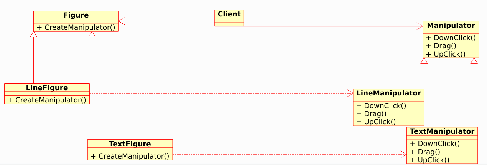
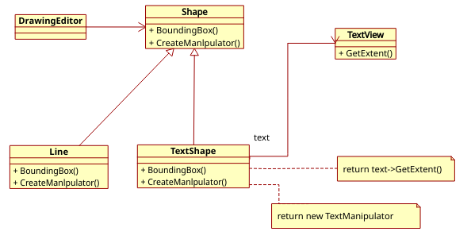
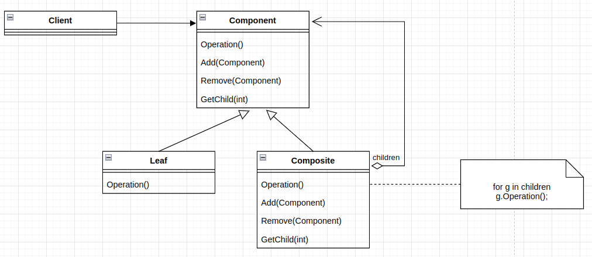
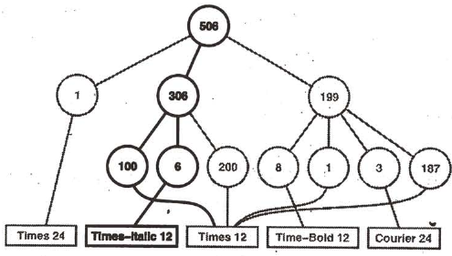
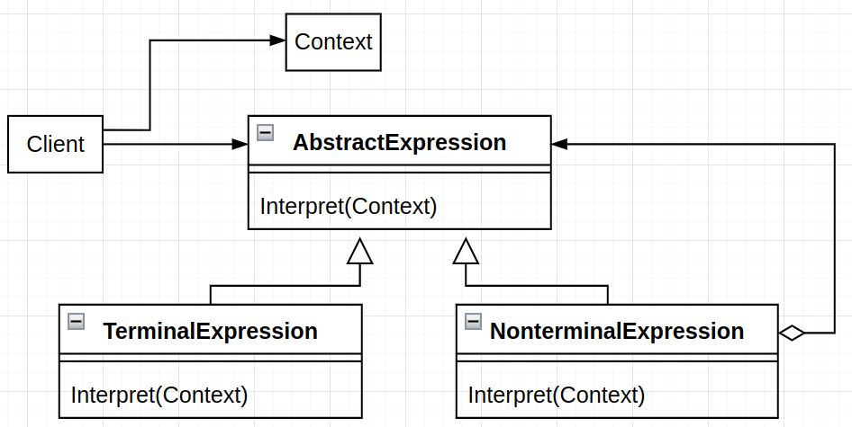

<!-- 设计模式 - 可复用面向对象软件的基础 -->

---
<!-- @import "[TOC]" {cmd="toc" depthFrom=1 depthTo=6 orderedList=false} -->

<!-- code_chunk_output -->

- [第一章 引言](#第一章-引言)
  - [1.1 什么是设计模式](#11-什么是设计模式)
  - [1.2 Smalltalk MVC 中的设计模式](#12-smalltalk-mvc-中的设计模式)
  - [1.3 描述设计模式](#13-描述设计模式)
  - [1.4 设计默认的编目](#14-设计默认的编目)
  - [1.5 组织条目](#15-组织条目)
  - [1.6 设计模式怎样解决设计问题](#16-设计模式怎样解决设计问题)
    - [1.6.1 寻找合适的对象](#161-寻找合适的对象)
    - [1.6.2 决定对象的粒度](#162-决定对象的粒度)
    - [1.6.3 指定对象接口](#163-指定对象接口)
    - [1.6.4 描述对象的实现](#164-描述对象的实现)
    - [1.6.5 运用复用机制](#165-运用复用机制)
      - [继承和组合的比较](#继承和组合的比较)
      - [委托](#委托)
      - [继承和参数化类型的比较](#继承和参数化类型的比较)
    - [1.6.6 关联运行时和编译时的结构](#166-关联运行时和编译时的结构)
    - [1.6.7 设计应支持变化](#167-设计应支持变化)
  - [1.7 怎样选择设计模式](#17-怎样选择设计模式)
  - [1.8 怎样使用设计模式](#18-怎样使用设计模式)
- [第二章 实例研究：设计一个文档编辑器](#第二章-实例研究设计一个文档编辑器)
  - [2.1 设计问题](#21-设计问题)
  - [2.2 文档结构](#22-文档结构)
    - [　2.2.1 递归组合](#221-递归组合)
    - [2.2.2 图元](#222-图元)
    - [2.2.3 组合模式](#223-组合模式)
  - [2.3 格式化](#23-格式化)
    - [2.3.1 封装格式化算法](#231-封装格式化算法)
    - [2.3.2 Compositor 和 Compostion](#232-compositor-和-compostion)
    - [2.3.3 策略模式](#233-策略模式)
  - [2.4 修饰用户界面](#24-修饰用户界面)
    - [2.4.1 透明围栏](#241-透明围栏)
    - [2.4.2 Monoglyph](#242-monoglyph)
    - [2.4.3 Decorator 模式](#243-decorator-模式)
  - [2.5 支持多种视感标准](#25-支持多种视感标准)
    - [2.5.1 对象创建的抽象](#251-对象创建的抽象)
    - [2.5.2 工厂和产品类](#252-工厂和产品类)
    - [2.5.3 Abstract Factory 模式](#253-abstract-factory-模式)
  - [2.6 支持多种窗口系统](#26-支持多种窗口系统)
    - [2.6.1 是否可以使用 Abstract Factory 模式](#261-是否可以使用-abstract-factory-模式)
    - [2.6.2 封装实现依赖关系](#262-封装实现依赖关系)
    - [2.6.3 Window 和 WindowImp](#263-window-和-windowimp)
    - [2.6.4 Bridge 模式](#264-bridge-模式)
  - [2.7 用户操作](#27-用户操作)
    - [2.7.1 封装一个请求](#271-封装一个请求)
    - [2.7.2 Command类及其子类](#272-command类及其子类)
    - [2.7.3 撤销和重做](#273-撤销和重做)
    - [2.7.4 命令历史记录](#274-命令历史记录)
    - [2.7.5 Command 模式](#275-command-模式)
  - [2.8 拼写检查和断字处理](#28-拼写检查和断字处理)
    - [2.8.1 访问分散的信息](#281-访问分散的信息)
    - [2.8.2 封装访问和遍历](#282-封装访问和遍历)
    - [2.8.3 Iterator 类及其子类](#283-iterator-类及其子类)
    - [2.8.4 Iterator 模式](#284-iterator-模式)
    - [2.8.5 遍历和遍历过程中的操作](#285-遍历和遍历过程中的操作)
    - [2.8.6 封装分析](#286-封装分析)
    - [2.8.7 Visitor 类及其子类](#287-visitor-类及其子类)
    - [2.8.8 Vistor 模式](#288-vistor-模式)
  - [2.9  小结](#29--小结)
- [第三章 创建型模式](#第三章-创建型模式)
  - [3.1 Abstract Factory (抽象工厂)](#31-abstract-factory-抽象工厂)
  - [3.2 Builder (生成器)](#32-builder-生成器)
  - [3.3 Factory Method (工厂方法)](#33-factory-method-工厂方法)
  - [3.4 Prototype (原型)](#34-prototype-原型)
  - [3.5 Singleton(单件)](#35-singleton单件)
  - [3.6 创建形模式的讨论](#36-创建形模式的讨论)
- [第四章 结构型模式](#第四章-结构型模式)
  - [4.1 Adapter（适配器）](#41-adapter适配器)
  - [4.2 Bridge (桥接)](#42-bridge-桥接)
  - [4.3 Composite (组合)](#43-composite-组合)
  - [4.4 Decorator](#44-decorator)
  - [4.5 Facade（外观）](#45-facade外观)
  - [4.6 FlyWeight (享元)](#46-flyweight-享元)
  - [4.7 Proxy (代理)](#47-proxy-代理)
  - [4.8  结构型模式的讨论](#48--结构型模式的讨论)
    - [4.8.1 Adapter 和 Bridge](#481-adapter-和-bridge)
    - [4.8.2 Composite ,Decorator 和 Proxy](#482-composite-decorator-和-proxy)
- [第五章 行为模式](#第五章-行为模式)
  - [5.1 Chain Of Responsibility (职责连)](#51-chain-of-responsibility-职责连)
  - [5.2 Command (命令)](#52-command-命令)
  - [5.3 Interpreter (解释器)](#53-interpreter-解释器)
  - [5.4 Iterator(迭代器)](#54-iterator迭代器)
  - [5.5 Mediator(中介者)](#55-mediator中介者)
  - [5.6 Memento (备忘录)](#56-memento-备忘录)
  - [5.7 Observer（观察者）](#57-observer观察者)
  - [5.8 State (状态)](#58-state-状态)
  - [5.9 Strategy (策略)](#59-strategy-策略)
  - [5.10 Template method （模板方法）](#510-template-method-模板方法)
  - [5.11 Visitor (访问者)](#511-visitor-访问者)

<!-- /code_chunk_output -->

---

# 第一章 引言

## 1.1 什么是设计模式

一般而言，一个模式有四个基本要素：

- `模式名`(pattern name)，一个助记名，它用一两个词来描述模式的问题、解决方案和效果。
- `问题`(problem), 描述了应该在何时使用模式。
- `解决方案`(solution)描述了设计的组成部分、他们之间的相互关系及各自的职责和协作方式。
- `效果`(consequence)描述了模式应用的效果及使用模式应权衡的问题。尽管我们描述设计决策时并不总提到模式效果，但它们对于评价设计选择和理解使用模式的代价及好处具有重要的意义。

本书中的设计模式是 `对用来在特定场景下解决一般设计问题的类和相互通信的对象的描述。`

---

## 1.2 Smalltalk MVC 中的设计模式

在 [Smalltalk-80](https://en.wikipedia.org/wiki/Smalltalk) 中，类的模型/视图/控制器（Model/view/Controller）三元组(MVC)被用来构建用户界面。透过 MVC 来看设计模式将帮助我们理解 “模式”这一术语的含义。

若不使用 MVC ，用户界界面设计往往将这些对象混在一起，而 MVC 则将它们分离以提高灵活性和复用性。
MVC 通过建立一个 “订购/通知” 协议来分离视图和模型。视图必须保证它的显示正确地反映了模型的状态。一旦模型的数据发生变化，模型将通知有关的视图，每个视图相应地得到刷新自己的机会。这种方法可以让你为一个模型提供不同的多个视图表现形式，也能够为一个模型创建新的视图而无须重写模型。

下图显示了一个模型和三个视图（为了简单我们省略了控制器）。


表面上看，这个例子反映了将视图和模型分离的设计，然而这个设计还可用于解决更一般的问题：将对象分离，使得一个对象的改变能够影响另一些对象，而这个对象并不需要知道那些被影响的对象的细节。这个更一般的设计被描述成 Observer 模式。

MVC 的另一个特征是视图可以嵌套。例如，按钮控制面板可以用一个嵌套了按钮的复杂视图来实现。MVC 用 view 类的子类 -- compositeView 类来支持嵌套视图。

上例反映了可以将组合视图与其构件平等对待的设计，同样，该设计也适用于更一般的问题：将一些对象划为一组，并将该组对象当作一个对象来使用。这个设计被描述成 Composite 模式。

MVC 允许你在不改变视图外观的情况下改变视图对用户输入的响应方式。例如，你可能希望改变视图对键盘的响应方式，或希望使用弹出菜单而不是原来的命令键方式。MVC 将响应机制封装在 Controller 对象中。存在着一个 Controller 的类层次结构，使得可以方便地对原有 Controller 做适当改变而创建新的 Controller

View-Controller 关系是 Strategy 模式的一个例子。一个策略是一个表述算法的对象。当你想静态或动态地替换一个算法，或你有很多不同的算法，或算法中包含你想封装的复杂数据结构时，策略模式是非常有用的。

MVC 还使用了其他的设计模式，如：用来指定视图默认控制器的 Factory Method 和用来增加视图滚动的 Decorator 。但是 MVC 的主要关系还是 Observer 、 Composite 和 Strategy 三个设计模式给出的。

---

## 1.3 描述设计模式

我们将用统一的格式描述设计模式，有助于你更容易地学习、比较和使用设计模式。

- `模式名和分类`
- `意图`
- `别名`
- `动机`
- `适用性`
- `结构`
- `参与者`，指设计模式中的类和/或对象以及它们各自的职责。
- `协作`，模式的参与者怎样协作以实现它们的职责
- `效果`
- `实现`
- `代码示例`
- `已知应用`
- `相关模式`

---

## 1.4 设计默认的编目

从第三章开始的模式目录中包含23个设计模式。如下所示：

- Abstract Factory(3.1): 提供一个创建一系列相关或相互依赖对象的接口，而无须指定它们具体的类。
- Adapter(4.1): 将一个类的接口转换成客户希望的另外一个接口。Adapter 模式使得原本由于接口不兼容而不能一起工作的那些类可以一起工作。
- Bridge(4.2): 将抽象部分与它的实现部分分离，使它们都可以独立的变化。
- Builder(3.2):将一个复杂对象的构建与它的表示分离，使得同样的构建过程可以创建不同的表示。
- Chain of Responsibility(5.1):解除请求的发送者和接收者之间的耦合，使多个对象都有机会处理这个请求。将这些对象连成一条链，并沿着这条链传递该请求，直到有一个对象处理它。
- Command(5.2): 将一个请求封装为一个对象，从而使你可用不同的请求对客户进行参数化；对请求排队或记录请求日志，以及支持可取消的操作。
- Composite(4.3):将对象组合成树形结构以表示“部分--整体”的层次结构。Composite 使得客户对单个对象和组合对象的使用具有一致性。
- Decorator(4.4):动态地给一个对象添加一些额外的职责。就扩展功能而言，Decorator 模式比生成子类方式更为灵活。
- Facade(4.5):为子系统中的一组接口提供一个一致的界面，Facade 模式定义了一个高层接口，这个接口使得这一子系统更加容易使用。
- Factory Method(3.3)：定义一个用于创建对象的接口，让子类决定将哪一个类实例化。Factory Method 使一个类的实例化延迟到其子类。
- Flyweight(4.6):运用共享技术有效地支持大量细粒度的对象。
- Interpreter(5.3):给定一个语言，定义它的文法的一种表示，并定义一个解释器，该解释器使用该表示来解释语言中的句子。
- Iterator(5.4):提供一种方法顺序访问一个聚合对象中的各个元素，而又不需要暴露该对象的内部表示。
- Mediator(5.5):用一个中介对象来封装一系列的对象交互。中介者使各个对象不用显式地相互调用，从而使其耦合松散，而且可以独立地改变他们之间的交互。
- Memento(5.6):在不破环封装性的前提下，捕获一个对象的内部状态，并在该对象之外保存这个状态。这样以后就可将该对象恢复到保存的状态。
- Observer(5.7):定义对象间的一种一对多的依赖关系，以便当一个对象的状态发生改变时，所有依赖于它的对象都得到通知并自动刷新。
- Prototype(3.4):用原型实例指定创建对象的种类，并且通过拷贝这个原型来创建新的对象。
- Proxy(4.7):为其他对象提供一个代理以控制对这个对象的访问。
- Singleton(3.5):保证一个类仅有一个实例，并提供一个访问它的全局访问点。
- State(5.8):允许一个对象在其内部状态改变时改变它的行为。对象看起来似乎修改了它所属的类。
- Strategy(5.9):定义一系列的算法，把它们一个个封装起来，并且使它们可相互替换。本模式使得算法的变化可独立于使用它的客户。
- Template Method(5.10):定义一个操作中的算法的骨架，而将一些步骤延迟到子类中。Template Method 使得子类不改变一个算法的结构即可重定义该算法的某些特定步骤。
- Vistor(5.11):表示一个作用于某对象结构中的各元素的操作。它使你可以在不改变各元素的类的前提下定义作用于这些元素的新操作。

---

## 1.5 组织条目

<table class="tg">
<thead>
  <tr>
    <th class="tg-g6va" rowspan="2"></th>
    <th class="tg-g6va" rowspan="2"></th>
    <th class="tg-6ltk" colspan="3">目的</th>
  </tr>
  <tr>
    <th class="tg-6ltk">创建型</th>
    <th class="tg-6ltk">结构型</th>
    <th class="tg-6ltk">行为型</th>
  </tr>
</thead>
<tbody>
  <tr>
    <td class="tg-uko8" rowspan="2">范围</td>
    <td class="tg-s4wa">类</td>
    <td class="tg-s4wa">Factory Method</td>
    <td class="tg-s4wa">Adapter</td>
    <td class="tg-s4wa">Interpreter<br>Template Method</td>
  </tr>
  <tr>
    <td class="tg-s4wa">对象</td>
    <td class="tg-s4wa">Abstract Factory<br>Builder<br>Prototype<br>Singleton</td>
    <td class="tg-s4wa">Adapter<br>Bridge<br>Composite<br>Decorator<br>Facade<br>Flyweight<br>Proxy</td>
    <td class="tg-s4wa">Chain of Responsibility<br>Command<br>Iterator<br>Mediator<br>Memento<br>Observer<br>State<br>Strategy<br>Visitor</td>
  </tr>
</tbody>
</table>

我们根据两条准则对模式进行分类。第一条是`目的`准则，即模式是用来完成什么工作的。模式依据其目的可分为：

- 创建型（与对象的创建有关）
- 结构型（处理类与对象的组合）
- 行为型模式（对类或对象怎么交互和怎么分配职责进行描述）。
第二条是`范围`准则，指定模式主要是用于类还是用于对象。`类模式处理类和子类之间的关系，这些关系通过继承建立，是静态的，在编译时便确定下来了`。`对象模式处理对象间的关系,这些关系在运行时是可以变化的，更具动态性。`从某种意义上来说，几乎所有模式都是用继承机制，所以 “类模式”只指那些集中于处理类间关系的模式，而大部分模式都属于对象模式的范畴。

还有一种方式是根据模式的“相关模式”部分所描述的它们怎么互相引用来组织设计模式。如下图所示：


显然，存在着许多组织设计模式的方法。从多角度去思考模式有助于对它们的功能、差异和应用场合的更深入理解。

---

## 1.6 设计模式怎样解决设计问题

设计模式采用多种方法解决面向对象设计者经常碰到的问题。这里给出几个问题以及使用设计模式解决它们的方法。

### 1.6.1 寻找合适的对象

面向对象设计最困难的部分是将系统分解成对象集合。因为要考虑许多因素：封装、粒度、依赖关系、灵活性、性能、演化、复用等，它们都影响着系统的分解，并且这些因素通常还是互相冲突的。
面向对象设计方法学支持许多设计方法。你可以写成一个问题描述，挑出名词和动词，进而创建相应的类和操作；或者，你可以关注系统的协作和职责关系；或者你可以对现实世界建模，再将分析时发现的对象转化至设计中。至于哪一种方法最好，并无定论。

---

### 1.6.2 决定对象的粒度

对象在大小和数目上变化极大。它们能表示下至硬件或上至整个应用的任何事物。那么我们怎样决定一个对象应该是什么呢？
设计模式很好的讲述了这个问题。Facade 模式描述了怎样用对象表示完整的子系统，Flyweight 模式描述了如何支持大量的最小粒度的对象。其他一些设计模式描述了将一个对象分解成许多小对象的特定方法。Abstract Factory 和 Builder 产生那些专门负责生成其他对象的对象。Visitor 和 Command 生成的对象专门负责实现对其他对象或对象组的请求。

---

### 1.6.3 指定对象接口

设计模式通过确定接口的主要组成成分以及经接口发送的数据类型来帮助你定义接口。设计模式也许还会告诉你接口中不应包括哪些东西。Memento 模式是一个很好的例子，它描述了怎样封装和保存对象内部的状态，以便一段时间后对象能恢复到这一状态。它规定了 Memento 对象必须定义两个接口：一个允许客户保持和复制 Memento 的限制接口，一个只有原对象才能使用的用来储存和提取 Memento 中状态的特权接口。
设计模式也指定了接口之间的关系。特别是，它们经常要求一些类具有相似的接口，或它们对一些类的接口做了限制。例如，Decorator 和 Proxy 模式分别要求 Decorator 和 Proxy 对象的接口与被修饰的对象和受委托的对象一致。而 Visitor 模式中，Visitor 接口必须反映出 Visitor 能访问的对象的所有类。

---

### 1.6.4 描述对象的实现

对象的实现是由它的类决定的，类指定了对象的内部数据和表示，也定义了对象所能完成的操作，如下图所示：


我们基于 OMT 的表示法(OMT由Rumbaugh于1991年开发，作为一种广泛用于软件开发的对象建模方法。 OMT被认为是统一建模语言（UML）的前身。 因此，许多OMT建模元素与UML建模元素相似。[Object-modeling technique](https://en.wikipedia.org/wiki/Object-modeling_technique))，将类描述成一个矩形，其中的类名以黑体表示。操作在类名下面，以常规字体表示。类所定义的任何数据都在操作的下面。类名与操作之间以及操作与数据之间用横线分隔。
返回类型和实例变量类型是可选的，因为我们并未假设一定要用具有静态类型的实现语言。
对象通过实例化类来创建，此对象被称为该类的实例。就像这样：


我们以竖线和三角表示子类关系，如下图所示：


抽象类的类名以斜体表示，以与具体类相区别。抽象操作也用斜体表示。图中可以包括实现操作的伪代码，如果这样，则代码将出现在带有褶角的框中，并用虚线将该褶角框与代码所示实现的操作相连，如下图所示：


`混入类`(mixin class)是给其他类提供可选择的接口或功能的类。它与抽象类一样不能实例化。图示如下：


1. 类继承与接口继承的比较
   理解对象的类与对象的类型之间的差别很重要。
   对象的类定义了对象是怎样实现的，同时也定义了对象的内部状态和操作的实现。但是对象的类型只与它的接口有关，接口即对象能响应的请求的集合。一个对象可以有多个类型，不同类的对象可以有相同的类型。

2. 对接口编程而不是对实现编程
    但继承被恰当使用时，所有从抽象类导出的类将共享该抽象类的接口。这意味着子类仅仅添加或重定义操作，而没有隐藏父类的操作。这时，所有的子类都能响应抽象类接口中的请求，从而子类的类型都是抽象类的子类型。
    只是根据抽象类中定义的接口来操纵对象有以下两个好处：
    1. 客户无须知道他们使用对象的特定类型，只需要知道对象有客户所期望的接口。
    2. 客户无须知道他们使用的对象是用什么类来实现的，只需要知道定义接口的抽象类。
    这将极大地减少子系统实现之间的相互依赖关系，也产生了可复用的面向对象设计的如下原则：
    针对接口编程，而不是针对实现编程。

---

### 1.6.5 运用复用机制

理解对象、接口、类和继承之类的概念对大多数人来说并不难，问题的关键在于如何运用它们写出灵活的、可复用的软件。

#### 继承和组合的比较

面向对象系统中功能复用的两种最常用的技术是类继承和对象组合。

- 类继承通过生成子类的复用通常被称为`白箱复用`。术语“白箱”是相对可视性而言的：在继承方式中，父类的内部细节对于子类可见。
- 对象组合是一种通过组装或组合对象的一种更复杂的功能。对象组合要求被组合的对象具有良好定义的接口。这种复用风格被称为`黑箱复用`，因为对象的内部细节是不可见的。

继承和组合各有优缺点。类继承是在编译时静态定义的，且可直接使用，因为程序设计语言直接支持类继承。类继承可以较方便地改变被复用的实现。
但是类也有一些不足之处。首先，因为继承在编译时就定义了，所以无法在运行时改变从父类继承的实现。更糟的是，父类通常至少定义了部分子类的具体表示。因为继承对子类揭示了其父类的实现细节，所以继承常被认为“破坏了封装性”。子类中的实现与它的父类有如此紧密的依赖关系，以至于父类实现中的任何变化必然会导致子类发生变化。
当你需要复用子类时，实现上的依赖就会产生一些问题。如果继承下来的实现不适合解决新的问题，则父类必须重写或被其他更适合的类替换。这种依赖关系限制了灵活性并最终限制了复用性。一个可用的解决方法就是只继承抽象类，因为抽象类通常提供较少的实现。
对象组合是通过获得对其他对象的引用而在运行时动态定义的。组合要求对象遵守彼此的接口约定，进而要求更仔细地定义接口，而这些接口并不妨碍你将一个对象和其他对象一起使用。这还会产生良好的结果：因为对象只能通过接口访问，所以我们并不破环封装性；只要类型一致，运行时还可以用一个对象来替代另一个对象；更进一步，因为对象的实现是基于接口写的，所以实现上存在较少的依赖关系。
对象组合对系统设计还有另一个作用，即优先使用对象组合有助于你保持每一个类被封装，并被集中在单个任务上。这样类和类继承层次会保持较小规模，并且不太可能增长为不可控制的庞然大物。另外，基于对象组合的设计会有更多的对象（而有较少的类），且系统的行为将依赖于对象间的关系而不是被定义在某个类中。
这导出了我们的面向对象设计的第二个原则：
`优先使用对象组合，而不是类继承`

#### 委托

委托(delegation) 是一种组合方法，它使组合具有与继承同样的复用能力。在委托方式下，有两个对象参与处理一个请求，接受请求的对象将操作委托给它的代理者(delegate)。这类似于子类将请求交给它的父类处理。委托方式为了得到同样的效果，接受请求的对象将自己传给被委托者（代理者），使被委托的操作可以引用接受请求的对象。

eg：下面的图显示了窗口类将它的 Area 操作委托给一个矩形实例。


箭头线表示一个类对另一个类实例的引用关系。引用名师可选的，本例为 "rectangle".

委托的主要优点在于它便于运行时组合对象操作以及改变这些操作的组合方式。假定矩形对象和圆对象有相同的类型，我们只需要简单地用圆对象替换矩形对象，得到的窗口就是圆形的。

委托与那些通过对象组合取得软件灵活性的技术一样，具有如下不足之处：动态的、高度参数化的软件比静态软件更难于理解。还有运行低效的问题，不过从长远来看人的低效才是最主要的。只有当委托使设计比较简单而不是更复杂时，它才是好的选择。

有一些模式使用了委托：如 State 、 Strategy 、Visitor 。

委托是对象组合的特例。它告诉你对象组合作为一个代码复用机制可以替代继承。

#### 继承和参数化类型的比较

另一种功能复用技术（并非严格的面向对象技术）是``参数化类型`(parameterized type),也就是`类属`(generic)(Ada、Eiffel)或`模板`(Template)(c++)。

许多设计可以使用这三种技术中的任何一种来实现。实现一个以元素比较操作为可变元的排序例程，可使用如下方法：

1. 通过子类实现该操作(Template Method 的一个应用)
2. 实现要传给排序例程的对象的职责(Strategy)
3. 作为 c++ 模板或 Ada 类属的参数，以指定元素比较操作的名称。

---

### 1.6.6 关联运行时和编译时的结构

一个面向对象程序运行时的结构通常与它的代码结构相差较大。代码结构在编译时就被确定下来了，它由继承关系固定的类组成。而程序的运行结构是由快速变化的通信对象网络组成的。事实上两个结构是彼此独立的。

考虑对象`聚合`(aggregation) 和 `相识`(acquaintance) 的差别以及它们在编译时和运行时的表示有多么不同。聚合意味着一个对象拥有另一个对象或对另一个对象负责。一般我们称一个对象`包含`另一个对象或者是另一个对象的一部分。聚合意味着聚合对象和其所有者具有相同的生命周期。
相识意味着一个对象仅仅知道另一个对象。有时相识也被称为 “关联” 或 “引用” 关系，相识的对象可能请求彼此的操作，但是它们不为彼此负责。相识是一种比聚合要弱的关系，它只是标识了对象间较松散的耦合关系。

在下图中，普通的箭头线表示相识，尾部带有菱形的箭头表示聚合：


聚合和相识很容易混淆，因为它们通常以相同的方法实现。在 C++ 中，聚合可以通过定义表示真正示例的成员变量来实现，但更通常的是将这些成员变量定义为实例指针或引用；相识也是以指针或引用来实现的。

从根本上来讲，是聚合还是相识是由你的意图而不是显式的语言机制决定的。聚合关系使用较少且比相识关系更持久；而相识关系则出现频率较高，但有时只存在于一个操作期间，相识也更具动态性，使得它在源代码中更难被分辨出来。

许多设计模式（特别是那些属于对象范围的）显式地记述了编译时和运行时结构的差别。Composite 和 Decorator 对于构造复杂的运行时结构非常有用。Observer 也与运行时结构有关，但这些结构对于不了解该模式的人来说是很难理解的。Chain of Responsibility 也产生了继承所无法展现的通信模式，总之，只有理解了模式，你才能清楚代码中的运行时结构。

---

### 1.6.7 设计应支持变化

获得最大限度复用的关键在于对新需求和已有需求发生变化时的预见性。要求你的系统设计能够相应地改进。
为了设计适应这种变化且具有健壮性的系统，你必须考虑系统在它的生命周期内会发生怎样的变化。一个不考虑系统变化的设计在将来就有可能需要重新设计。重新设计会影响软件系统的许多方面，并且未曾料到的变化总是代价巨大的。
设计模式可以确保系统以特定方式变化，从而帮助你避免重新设计系统。
下面阐述了一些导致重新设计的一般原因，以及解决这些问题的设计模式：

- `通过显式地指定一个类来创建对象` 在创建对象时指定类名将使你受特定实现的约束而不是特定接口的约束。这会使未来的变化更复杂。要避免这种情况，应该间接地创建对象。
  设计模式： Abstract Factory,Factory Method,Prototype
- `对特殊操作的依赖` 当你为请求指定一个特殊的操作时，完成该请求的方式就固定下来了。为避免请求代码写死，你将可以在编译时或运行时很方便地改变响应请求的方法。
  设计模式： Chain of Responsibility ,Command
- `对硬件和软件平台的依赖` 外部的操作系统接口和应用编程接口(API)在不同的软硬件平台上是不同的。依赖于特定平台的软件将很难移植到其他平台上，甚至很难跟上本地平台的更新。所以设计系统时限制其平台相关性就很重要了。
  设计模式：Abstract Factory,Bridge
- `对对象表示或实现的依赖` 知道对象怎样表示、保存、定位或实现的客户在对象发生变化时可能也需要变化。对客户隐藏这些信息能阻止连锁变化。
  设计模式： Abstract Factory,Bridge,Memento,Proxy
- `算法依赖` 算法在开发和复用时常常被扩展、优化和替代。依赖于某个特定算法的对象在算法发生变化时不得不变化。因此有可能发生变化的算法应该被孤立起来。
  设计模式： Builder,Iterator,Strategy,Template Method,Visitor
- `紧耦合` 紧耦合的类很难独立地被复用，因为它们是互相依赖的。紧耦合产生单块的系统，要改变或删除一个类，你必须理解和改变其他许多类。这样的系统是一个很难学习、移植和维护的密集体。
  松散耦合提高了一个类本身被复用的可能性，并且系统更易于学习、移植、修改和扩展。设计模式使用抽象耦合和分层技术来提高系统的松散耦合性。
  设计模式： Abstract Factory,Command,Facade,Mediator,Observer,Chain of Responsibility
- `通过生成子类来扩充功能` 通常很难通过定义子类来定制对象。每一个新类都有固定的实现开销(初始化、终止处理等)。定义子类还需要对父类有深入的了解。
  一般的对象组合技术和具体的委托技术，是继承之外组合对象行为的另一种灵活方式。另一方面，过多使用对象组合会使设计难于理解。
  设计模式： Bridge,Chain of Responsibility,Composite,Decorator,Observer,Strategy
- `不能方便地对类进行修改` 有时你不得不改变一个难以修改的类。
  设计模式： Adapter,Decorator,Visitor

这些例子放映了使用设计模式有助于增强软件的灵活性。这种灵活性所具有的重要程度取决于你将要建造的软件系统。让我们看一看设计模式在开发如下三类主要软件中所起的作用：应用程序、工具箱和框架。

1. 应用程序
   如果你将要建造像文档编辑器或电子制表软件这样的应用程序，那么它的`内部复用性、可维护性和可扩充性`是要优先考虑的。
2. 工具箱
   一个应用经常会使用来自一个或多个被称为工具箱(toolkit) 的预定义类库中的类。工具箱是一组相关的、可复用的类的集合，这些类提供了通用的功能。工具箱的一个典型例子就是列表、关联表单、堆栈等类的集合，c++ 的 I/O 流库是另一个例子。工具箱强调的是`代码复用`,它们是面向对象环境下的 “子程序库”。
   工具箱的设计比应用设计要难得多，因为它要求对许多应用是可用的和有效的。
3. 框架
   框架是构成一类特定软件的可复用设计的一组相互协作的类。
   框架规定了你的应用的体系结构。它定义了整体结构，类和对象的划分，各部分的主要责任，类和对象怎么协作，以及控制流程。框架与定义了这些设计参数，以便应用设计者或实现者能集中精力于应用本身的特定细节。框架记录了其应用领域的共同的设计决策。因而框架更强调`设计复用`，尽管框架常包括具体的立即可用的子类。
   这个层次的复用导致了应用和它所基于的软件之间的反向控制 (inversion of control).当使用工具箱（或传统的子程序库）时，你需要写应用软件的主体并且调用你想复用的代码。而当使用框架时，你应该复用应用的主体，写主体调用的代码。你不得不以特定的名字和调用约定来写操作的实现，而这会减少你需要做出的设计决策。
   如果说应用程序难以设计，那么工具箱就更难了，而框架则是最难的。框架设计者必须冒险决定一个要适应该领域的所有应用的体系结构。任何对框架设计的实质性修改都会大大降低框架所带来的好处，因为框架对应用的最主要贡献在于它所定义的体系结构。因此设计的框架必须尽可能地灵活、可扩充。
   框架和设计模式有些类似，最主要的不同在于如下三个方面：
   1. `设计模式比框架更抽象`
   2. `设计模式是比框架更小的体系结构元素`
   3. `框架比设计模式更加特例化` 框架总是针对一个特定的应用领域。

---

## 1.7 怎样选择设计模式

这里给出几个不同的方法，以帮助你发现适合你手头问题的设计模式：

- `考虑设计模式是怎样解决设计问题的` 参考[1.6 节](#16-设计模式怎样解决设计问题)的讨论
- `浏览模式的意图部分` [1.4 节](#14-设计默认的编目) 列出了目录中所有模式的意图部分。通读每个模式的意图，找出和你的问题相关的一个或多个模式。你可以使用 [1.5 节](#15-组织条目)表所显示的分类方法缩小你的搜查范围。
- `研究模式怎样互相关联` [1.5 节](#15-组织条目)图以图形的方式显示了设计模式之间的关系。这些关系能指导你获得合适的模式或模式组。
- `研究目的相似的模式` 模式分类描述部分共有三章，一章介绍创建型模式，一章介绍结构型模式，一章介绍行为型模式。每一章以对模式介绍性的评价开始，以一个小节的比较和对照结束。这些小节使你得以洞察具有相似目的的模式之间的共同点和不同点。
- `检查重新设计的原因` 看一看 [1.6.7 设计应支持变化](#167-设计应支持变化)开始讨论的引起重新设计的各种原因，看看你的问题是否与它们有关，然后再找出哪些模式可以帮助你避免这些会导致重新设计的因素。
- `考虑你的设计中哪些是可变的` 这个方法与关注引起重新设计的原因刚好相反。它不是考虑什么会迫使你的设计改变，而是考虑你想要什么变化却又不会引起重新设计。最主要的一点是 `封装变化的概念`，这是许多设计模式的主题。下表列出了设计模式允许你独立变化的方面，你可以改变它们而又不会导致重新设计。

<table class="tg" style="undefined;table-layout: fixed; width: 944px">
<colgroup>
<col style="width: 119px">
<col style="width: 206px">
<col style="width: 619px">
</colgroup>
<thead>
  <tr>
    <th class="tg-baqh">目的</th>
    <th class="tg-baqh">设计模式</th>
    <th class="tg-baqh">可变的方面</th>
  </tr>
</thead>
<tbody>
  <tr>
    <td class="tg-nrix" rowspan="5">创建</td>
    <td class="tg-0lax">Abstract Factory</td>
    <td class="tg-0lax">产品对象家族</td>
  </tr>
  <tr>
    <td class="tg-0lax">Builder</td>
    <td class="tg-0lax">如何创建一个组合对象</td>
  </tr>
  <tr>
    <td class="tg-0lax">Factory Method</td>
    <td class="tg-0lax">被实例化的子类</td>
  </tr>
  <tr>
    <td class="tg-0lax">Prototype</td>
    <td class="tg-0lax">被实例化的类</td>
  </tr>
  <tr>
    <td class="tg-0lax">Singleton</td>
    <td class="tg-0lax">一个类的唯一实例</td>
  </tr>
  <tr>
    <td class="tg-nrix" rowspan="7">结构</td>
    <td class="tg-0lax">Adapter</td>
    <td class="tg-0lax">对象的接口</td>
  </tr>
  <tr>
    <td class="tg-0lax">Bridge</td>
    <td class="tg-0lax">对象的实现</td>
  </tr>
  <tr>
    <td class="tg-0lax">Composite</td>
    <td class="tg-0lax">一个对象的结构和组成</td>
  </tr>
  <tr>
    <td class="tg-0lax">Decorator</td>
    <td class="tg-0lax">对象的职责，不生成子类</td>
  </tr>
  <tr>
    <td class="tg-0lax">Facade</td>
    <td class="tg-0lax">一个子系统的接口</td>
  </tr>
  <tr>
    <td class="tg-0lax">FlyWeight</td>
    <td class="tg-0lax">对象的存储开销</td>
  </tr>
  <tr>
    <td class="tg-0lax">Proxy</td>
    <td class="tg-0lax">如何访问一个对象；该对象的位置</td>
  </tr>
  <tr>
    <td class="tg-nrix" rowspan="11">行为</td>
    <td class="tg-0lax">Chain of Responsibility</td>
    <td class="tg-cly1">满足一个请求的对象</td>
  </tr>
  <tr>
    <td class="tg-0lax">Command</td>
    <td class="tg-0lax">何时、怎样满足一个请求</td>
  </tr>
  <tr>
    <td class="tg-0lax">Interpreter</td>
    <td class="tg-0lax">一个语言的文法及解释</td>
  </tr>
  <tr>
    <td class="tg-0lax">Iterator</td>
    <td class="tg-0lax">如何遍历、访问一个聚合的各元素</td>
  </tr>
  <tr>
    <td class="tg-0lax">Mediator</td>
    <td class="tg-0lax">对象间怎样交互、和谁交互</td>
  </tr>
  <tr>
    <td class="tg-0lax">Memento</td>
    <td class="tg-0lax">一个对象中哪些私有信息存放在该对象之外，以及在什么时候进行存储</td>
  </tr>
  <tr>
    <td class="tg-0lax">Observer</td>
    <td class="tg-0lax">多个对象依赖于另外一个对象，而这些对象又如何保持一致</td>
  </tr>
  <tr>
    <td class="tg-0lax">State</td>
    <td class="tg-0lax">对象的状态</td>
  </tr>
  <tr>
    <td class="tg-0lax">Strategy</td>
    <td class="tg-0lax">算法</td>
  </tr>
  <tr>
    <td class="tg-0lax">Template Method</td>
    <td class="tg-0lax">算法中的某些步骤</td>
  </tr>
  <tr>
    <td class="tg-0lax">Visitor</td>
    <td class="tg-0lax">某些可作用于一个（组）对象上的操作，但不修改这些对象的类</td>
  </tr>
</tbody>
</table>

---

## 1.8 怎样使用设计模式

一旦选择了一个设计模式，该怎么使用它呢？这里给出一个有效应用设计模式的循序渐进的方法。

1. `大致浏览一遍模式` 特别注意其适用性部分和效果部分，确定它适合你的问题
2. `回头研究结构部分、参与者部分和协作部分` 确保你理解这个模式的类和对象以及它们是怎样关联的。
3. `看代码示例部分，看看这个模式代码形式的具体例子` 研究代码将有助于你实现模式。
4. `选择模式参与者的名字，使它们在应用上下文中有意义`
5. `定义类`
6. `定义模式中专用于应用的操作名称` 这里再次体现出名字一般依赖于应用。使用每一个与操作相关联的责任和协作作为指导。还有，你的名字约定要一致。例如，可以使用 "Create-"前缀统一标记 Factory 方法。
7. `实现执行模式中责任和协作的操作` 实现部分提供线索指导你进行实现。代码示例部分的例子也能提供帮助。

关于设计模式，如果不提一下它们的使用限制，那么关于怎样使用它们的讨论就是不完整的。设计模式不能够随意使用。通常你通过引入额外的间接层次获得灵活性和可变性的同时，也使设计变得更复杂/或牺牲了一定的性能。一个设计模式只有当它提供的灵活性是真正需要的时候，才有必要使用。当衡量一个模式的得失时，它的效果部分是最能提供帮助的，如[1.7 怎样选择设计模式](#17-怎样选择设计模式)表所示。

---

# 第二章 实例研究：设计一个文档编辑器

这一章将通过设计一个称为 Lexi 的文档编辑器来介绍设计模式的实际应用。


## 2.1 设计问题

我们将考察 Lexi 设计中的7个问题：

1. 文档结构 - 文档内部表示的选择几乎影响到 Lexi 设计的每个方面
2. 格式化 - 怎样将文本和图形安排到行和列上？哪些对象负责执行不同的格式策略？这些策略是怎样和内部表示相互作用的？
3. 修饰用户界面
4. 支持多种视感(look-and-feel) 标准
5. 支持多种窗口系统
6. 用户操作 - 用户通过不同的用户界面控制 Lexi ，包括按钮和下拉菜单。
7. 拼写检查和连字符

我们将在下面的各节中讨论这些设计问题。

---

## 2.2 文档结构

从根本上来说，一个文档只是对字符、线、多边形和其他图形元素的一种安排。这些元素记录了文档的整个信息内容。然而，文档作者通常并不将这些元素看作图形项，而是看作文档的物理结构 - 行、列、图形、表和其他子结构。而这些子结构也有自己的子结构。
实现的内部表示应支持如下几点：

- 保持文档的物理结构，即将文本和图形安排到行、列、表等。
- 可视化地生成和显示文档。
- 根据显示位置来映射文档内部表示的元素。这可以使 Lexi 根据用户在可视化表示中所点击的某个东西来决定用户所引用的文档元素。

除了这些目标外，还有一些限制条件。

- 首先，我们应该一致地对待文本和图形。否则，我们最后得到的是冗余的格式和操纵机制。
- 其次，我们的实现不应该过分强调内部表示中单个元素和元素组之间的差别。应该能够一致地对待简单元素和组合元素，这样就允许任意复杂的文档。
- 然而，为了检查拼写错误和确定连字符的连接点，需要对文本进行分析。这就与第二个限制条件产生了矛盾。我们通常并不关心一行上的元素是简单对象还是复杂对象，但是文本分析有时候依赖于被分析的对象。文档内部表示设计应该考虑和权衡这种或其他潜在的彼此矛盾的限制条件。

---

### 　2.2.1 递归组合

层次结构信息的表述通常是通过一个称为`递归组合`(recursive composition) 的技术来实现的。递归组合可以由较简单的元素逐渐建立复杂的元素。
eg：


其文本和图形递归组合的对象结构如下：


这里隐含了两个重要的方面。

1. 很明显的是对象需要相应的类
2. 不那么明显的是这些类必须有兼容的接口。

---

### 2.2.2 图元

我们将为出现在文档结构中的所有对象定义一个抽象类Glyph(`图元`)。它的子类即定义了基本的图形元素（像字符和图像），又定义了结构元素（像行和列）。c++ 实现如下所示：

```c++
class Glyph{
  public:
    // 表现 --
    virtual void Draw(Window * w)=0;
    // 返回的是包含该图元的最小矩形区域
    virtual void Bounds(Rect& rect)=0;
    // -- 表现

    // 点击检测.判断一个指定的点是否与图元相交。
    // 任何时候用户点击文档某处时，都能调用该操作
    // 确定鼠标所在的图元或图元结构。
    virtual bool Intersects(const Point& point)=0;

    // 结构 --
    // 在整数索引指定的位置上插入一个图元
    virtual void Insert(Glyph * glyph,int pos)=0;
    // 移除一个指定的子图元
    virtual void Remove(Glyph * glyph)=0;
    virtual Glygh * Child(int pos)=0;
    virtual Glyph * Parent()=0;
    // -- 结构
  private:
    ...
}

```


---

### 2.2.3 组合模式

递归组合不仅可以用来表示文档，还可以用来表示任何复杂的、层次式的结构。 Composite 模式描述了面向对象的递归组合的本质。

---

## 2.3 格式化

我们已经解决了文档物理结构的`表示`问题。接着，我们需要解决的问题是怎样构造一个特殊物理结构，该结构对应于一个恰当地格式化了的文档。
现在我们将“格式化”含义限制为将一个图元集合分解为若干行。下面我们可以互换使用术语“格式化”(formating) 和 “分行”(linebreaking)。下面讨论的技术同样适用于将行分解为列和将列分解为页。

---

### 2.3.1 封装格式化算法

由于所有这些限制条件和许多细节问题，格式化过程不容易被自动化。这里有许多解决方法，实际上人们已经提出了各种各样具有不同能力和缺陷的格式化算法。因为 Lexi 是一个所见即所得的编辑器，所以一个必须考虑的重要权衡之处在于格式化的质量和格式化的速度之间的取舍。
因为格式化算法趋于复杂化，因而可以考虑将它们包含于文档结构之中，但最好是将它们彻底独立于文档结构之外。理想情况下，我们能够自由地增加一个 Glyph 子类而不用考虑格式化算法。反过来，增加一个格式化算法不应要求修改已有的图元类。
这些特征要求我们设计的 Lexi 易于改变格式化算法。我们可以将算法独立出来，并把它封装到对象中使其便于替代。

### 2.3.2 Compositor 和 Compostion

我们为能封装格式化算法的对象定义一个 Compositor 类。 eg：

```c++
class Compositor{
  public:
    void SetComposition(Composition * composition);
    // 何时格式化
    virtual void Compose();
  private:
    ...
}
```


一个未格式化的 Compostion 对象只包含组成文档基本内容的可见图元，它并不包含像行和列这样的决定文档物理结构的图元。


每一个Compositor 子类都能实现一个不同的分行算法。例如，一个 SimpleCompositor 可以执行得很快，而不考虑像文档"色彩"这样深奥的东西。好的色彩意味着文本和空白的平滑分布。一个 TeXCompositor 会实现完全的 TEX 算法[Knu84],会考虑色彩这样的东西，但以较长的格式化时间作为代价。

Compositor-Compostion 类的分离确保了支持文档物理结构的代码和支持不同格式化算法的代码之间的分离。我们能增加新的 Compositor 子类而不触及 Glyph 类，反之亦然。事实上，我们通过给 Composition 的基本图元接口增加一个 SetComposition 操作，即可在运行时改变分行算法。

---

### 2.3.3 策略模式

在对象中封装算法是 Strategy 模式的目的。

---

## 2.4 修饰用户界面

我们针对 Lexi 用户界面考虑两种修饰：

1. 文本编辑区周围加边界以界定文本页
2. 加滚动条让用户能看到同一页的不同部分。
为了便于增加和去除这些修饰，我们不应该通过继承方式将它们加到用户界面中。如果其他用户界面对象不知道存在这些修饰，那么我们就能获得最大的灵活性。这使我们无须改变其他的类就能增加和移去这些修饰。

---

### 2.4.1 透明围栏

`透明围栏`的概念:

1. 单子女（单`组件`）组合模式
2. 兼容的接口
客户通常分辨不出它们是在处理组件还是组件的`围栏`（即这个组件的父对象），特别是当围栏只是代理组件的所有操作时更是如此。但是围栏也能通过在代理操作之前或之后添加一些自己的操作来修改组件的行为。围栏也能有效地为组件添加状态。

---

### 2.4.2 Monoglyph

我们定义 Glyph 的子类 Monoglyph 作为像 Border 这样起修饰作用的图元的抽象类。Monoglyph 保存了指向一个组件的引用并且传递所有的请求给这个组件。


这使得 Monoglyph 缺省情况下对客户完全透明。例如:

```c++
void Monoglyph::Draw(Window * w){
  _component->Draw(w);
}
```

Monoglyph 的子类至少重新实现一个这样的传递操作，eg:

```c++
void Border::Draw(Window * w){
  Monoglyph::Draw(w);
  DrawBorder(w);
}
```

现在我们已经有了给 Lexi 文本编辑区增加边界和滚动界面所需的一切准备。我们可以在一个 Scroller 实例中组合已存在的 Composition 实例以增加滚动界面，然后再把它组合到 Border 实例中。结果对象结构如图 2-8 所示。


---

### 2.4.3 Decorator 模式

Decorator 模式描述了以透明围栏来支持修饰的类和对象的关系。在该模式中，修饰指给一个对象增加职责的事物。

---

## 2.5 支持多种视感标准

获得跨越硬件和软件平台的可移植性时系统设计的主要问题之一。将 Lexi 移植到一个新的平台不应当要求对 Lexi 进行重大的修改，否则的话就失去了移植 Lexi 的价值。我们应当使可能地方便。
移植的一大障碍是不同视感标准之间的差异性。
我们的设计目标就是使 Lexi 符合多个已存在的视感标准，并且在新标准出现时要能很容易地增加对新标准的支持。

---

### 2.5.1 对象创建的抽象

我们假定用两个窗口组件图元集合来实现多个视感标准：

1. 第一个集合是由抽象 Glygh 子类构成的，对每一个窗口组件都有一个抽象 Glygh 子类。例如，抽象子类 ScrollBar 扩充了基本的 Glygh 接口，以便增加通用的滚动操作；Button 是用来增加按钮有关操作的抽象类；等等；
2. 另一个集合是由与抽象子类对应的具体子类构成的，这些具体子类用于实现不同的视感标准。例如，ScrollBar 可能有 MotifScrollBar 和 PMScrollBar 两个子类以实现相应的 Motif 和 PM 风格的滚动条。

Lexi 需要一种方法来确定创建合适窗口组件所需的视感标准。

---

### 2.5.2 工厂和产品类

通常我们可以使用下面的 C++ 代码来创建一个 Motif 滚动条图元实例：

```c++
auto sb = new MotifScrollBar;
```

但如果你想使 Lexi 的视感依赖性最小的话，这种代码要尽量避免。假如我们这样：

```c++
auto sb=guiFactory->CreateScrollBar();
```

图 2-9 显示了 guiFactory 对象的结果类层次结构。


我们说工厂(Factory) 创造了`产品`(Product)对象。更进一步，工厂生产的产品使彼此相关的；这种情况下，产品是相同视感的所有窗口组件。图 2-10 显示了这样一些产品类，工厂产生窗口组件图元时要用到它们。


---

### 2.5.3 Abstract Factory 模式

工厂(Factory) 和产品(Product)是 Abstract Factory 模式的主要参与者。该模式描述了怎样在不直接实例化类的情况下创建一系列相关的产品对象。它最适用于产品对象的数目和种类不变，而具体产品系列之间存在不同的情况。

---

## 2.6 支持多种窗口系统

视感只是众多移植问题之一。另一个移植问题是 Lexi 所运行的窗口环境。我们希望 Lexi 可以在尽可能多的窗口系统上运行，这和 Lexi 要支持多个视感标准是同样的道理。

---

### 2.6.1 是否可以使用 Abstract Factory 模式

乍一看，这似乎又是一个使用 Abstract Factory 模式的情况。但是对窗口系统移植的限制条件与视感的独立性是有极大不同的。

现在我们假设已经有一些不同厂家的类层次结构，每一个类层次对应一个视感标准。当然，这些类层次不太可能有太多兼容之处。因而我们无法给每个窗口组件（滚动条、按钮、菜单等）都创建一个公共抽象产品类。

但是事情还是有换回的余地。像视感标准一样，窗口系统的接口也并非截然不同。因为所有的窗口系统总的来说是做同一件事。我们可对不同的窗口系统做一个统一抽象，再对各窗口系统的实现做一些调整，使之符合公共的接口。

### 2.6.2 封装实现依赖关系

之前我们介绍了显示一个图元或图元结构的 Window 类。Window 类封装了各窗口系统都要做的一些事情：

- 它们提供了画基本几何图形的操作。
- 它们能变成图标或还原成窗口
- 它们能改变自己的大小。
- 它们能够根据需要画出（或者重画出）窗口内容。例如，当它们由图标还原为窗口时，或它们在屏幕空间上重叠、出界的部分重新显示时，都要重画。

Window 类的窗口功能必须跨越不同的窗口系统。让我们考虑两种极端的观点：

1. `功能的交集` Window 类的接口只提供所有窗口系统共有的功能。
2. `功能并集` 创建一个合并了所有已有系统的功能的接口。

以上方法都不切实可行，所以我们的设计将采取折中的办法。Window 类将提供一个支持大多数窗口系统的方便的接口。因为 Lexi 直接处理 Window 类，所以它还必须支持 Lexi 的图元。这意味着 Window 接口必须包括让图元可以在窗口中画出自己的基本图形操作集合。下表列出了 Window 类中的一些操作的接口。

<table class="tg">
<thead>
  <tr>
    <th class="tg-c3ow">责任</th>
    <th class="tg-c3ow">操作</th>
  </tr>
</thead>
<tbody>
  <tr>
    <td class="tg-9wq8" rowspan="6">窗口管理</td>
    <td class="tg-c3ow">virtual void Redraw()</td>
  </tr>
  <tr>
    <td class="tg-c3ow">vritual void Raise()</td>
  </tr>
  <tr>
    <td class="tg-c3ow">virtual void Lower()</td>
  </tr>
  <tr>
    <td class="tg-c3ow">virtual void Iconify()</td>
  </tr>
  <tr>
    <td class="tg-c3ow">virtual void Deiconify()</td>
  </tr>
  <tr>
    <td class="tg-c3ow">...</td>
  </tr>
  <tr>
    <td class="tg-9wq8" rowspan="5">图形</td>
    <td class="tg-c3ow">virual void DrawLine(...)</td>
  </tr>
  <tr>
    <td class="tg-c3ow">virtual void DrawRect(...)</td>
  </tr>
  <tr>
    <td class="tg-c3ow">virtual void DrawPolygon(...)</td>
  </tr>
  <tr>
    <td class="tg-c3ow">virtual void DrawText(...)</td>
  </tr>
  <tr>
    <td class="tg-c3ow">...</td>
  </tr>
</tbody>
</table>

类图如下所示：


现在我们已经为 Lexi 定义了工作的窗口接口，那么真正与平台相关的窗口是从哪里来的？既然我们不能实现自己的窗口系统，那么这个窗口系统抽象必须用目标窗口系统平台来实现。怎样实现？

一种方法是实现 Window 类和他的子类的多个版本，每个版本对应一个窗口平台。
另一种方式是为每一个窗口层次结构中的类创建特定实现的子类，但这同样会产生我们在试图增加修饰是遇到的子类数目爆炸问题。这两种方法都有另一个缺点：没有在编译以后改变所用窗口系统的灵活性。所以我们不得不保持若干不同的可执行程序。

既然这两种方法都没有吸引力，那么我们还能做些什么呢？我们可以：`对变化的概念进行封装`。我们可以通过简单地传递合适的窗口系统封装对象，给窗口系统配置窗口对象。我们甚至能在运行时配置窗口。

### 2.6.3 Window 和 WindowImp

我们将定义一个独立的 WindowImp 类来隐藏不同窗口系统的实现。WindowImp 是一个封装了窗口系统相关代码的对象的抽象类。


1. WindowImp 的子类
   WindowImp 的子类将用户请求转变成特定窗口系统的操作。

   ```c++
   void Rectangle::Draw(Window * w){
     w->DrawRect(_x0,_y0,_x1,_y1);
   }

   void Window::DrawRect(Coord x0,Coor y0,Coord x1,Coord y1){
     _imp->DeviceRect(x0,y0,x1,y1);
   }
   ```

   XWindowImp 的 DeviceRect 的实现可能如下：

   ```c++
    void XWindowImp::DeviceRect(Coord x0,Coord y0,Coord x1,Coord y1){
      int x=round(min(x0,x1));
      int y=round(min(y0,y1));
      int w=round(abs(x0-x1));
      int h=round(abs(y0-y1));
      XDrawRectangle(_dpy,_winid,_gc,x,y,w,h);
    }   
   ```

   PMWindowImp([Presentation Manager](https://en.wikipedia.org/wiki/Presentation_Manager) 的 WindowImp 子类)的 DeviceRect 实现如下所示：

   ```c++
    void PMWindowImp::DeviceRect(Coord x0,Coord y0,Coord x1,Coord y1){
      Coord left=min(x0,x1);
      Coord right=max(x0,x1);
      Coord bottom=min(y0,y1);
      Coord top=max(y0,y1);

      PPOINTL point[4];
      point[0].x=left; point[0].y=top;
      point[1].x=right; point[1].y=top;
      point[2].x=right; point[2].y=bottom;
      point[3].x=left; point[3].y=bottom;

      if(
          (GpiBeginPath(_hps,1L) == false) ||
          (GpiSetCurrentPosition(_hps,&point[3]) == false) ||
          (GpiPolyLine(_hps,4L,point) == GPI_ERROR ) ||
          (GpiEndPath(_hps) == false)
        ){
          // report error
        }else{
          GpiStrokePath(_hps,1L,0L);
        }
    }
   ```

2. 用 WindowImp 来配置窗口
   我们可以使用 Abstract Factory 模式来配置。（当然还有很多种可能）；

   ```c++
    class WindowSystemFactory{
      public:
        virtual WindowImp * CreateWindowImp()=0;
        virtual ColorImp * CreateColorImp()=0;
        virtual FontImp * CreateFontImp()=0;

        ...
    }   
   ```

   现在我们可以为每一个窗口系统定义一个具体的工厂：

   ```c++
    class PMWindowSystemFactory:public WindowSystemFactory{
      public:
        WindowImp * CreateWindowImp() override{
          return new PMWindowImp;
        }
        ...
    }   
    class XWindowSystemFactory:public WindowSystemFactory{
      public:
        WindowImp * CreateWindowImp() override{
          return new XWindowImp;
        }
        ...
    }   
   ```

   Window 基类的构造函数能使用 WindowSystemFactory 接口和合适的窗口就系统的 WindowImp 来初始化成员变量 _imp:

   ```c++
    Window::Window(){
      _imp = windowSystemFactory->CreateWindowImp();
    }   
   ```

### 2.6.4 Bridge 模式

WindowImp 类定义了一个公共窗口系统设施的接口，但它的设计是受不同于 Window 接口的限制条件驱动的。应用程序员不直接处理 WindowImp 的接口，它们只处理 Window 对象。
Window 类是针对应用程序员的，而 WindowImp 接口时针对窗口系统的。将窗口功能分离到 Window 和 WindowImp 类层次中，这样我们可以独立实现这些接口。这些类层次的对象合作实现 Lexi 无须修改就能运行在多窗口系统的目标。
Window 和 WindowImp 的关系是 Bridge 模式的一个例子。Bridge 模式的目的就是允许分离的类层次一起工作，即使它们是独立演化的。我们的设计准则使我们创建了两个分离的类层次，一个支持窗口的逻辑概念，另一个描述了窗口的不同实现。Bridge 模式允许我们保持和加强我们对窗口的逻辑抽象，而不触及窗口系统相关的代码；反之也是一样。

---

## 2.7 用户操作

Lexi 需要支持一些用户操作。比如你可以输入和删除文本，移动插入点，通过指向、单击选择文本区域，也可以在文档中输入文字。另一些功能是通过 Lexi 的下拉菜单、按钮和快捷键来间接得到的。 ...

Lexi 为这些用户操作提供不同的界面。但是我们不希望一个特定的用户操作就关联一个特定的用户界面。再说，这些操作是用不同的类来实现的。我们想要访问这些功能，但又不希望在用户界面的它的实现之间建立过多的依赖关系。否则，最终我们得到的是紧耦合的实现，它难以理解、扩充和维护。更复杂的是我们希望 Lexi 能对大多数功能支持撤销和重做操作。
很明显对用户操作的支持渗透到了应用中。我们所面临的挑战在于提出一个简单、可扩充的机制来满足所有这些要求。

### 2.7.1 封装一个请求

从设计者的角度来看，一个下拉菜单仅仅是包含了其他图元的又一种图元。下拉菜单和其他有子女的图元的差别在于大多数菜单中的图元会响应鼠标点击而做一些操作。

让我们假设这些做事情的图元是一个被称为 MenuItem 的 Glygh 子类的实例，并且它们做一些事情来响应客户的请求。
我们可以为每一个用户定义一个 MenuItem 的子类，然后为每一个子类编码区执行请求。但这并不是正确的方法，我们并不需要为每个请求定义一个 MenuItem 子类，正如我们并不需要为每一个下拉菜单的文本字符串定义一个子类。我们应该使用对象来参数化 MenuItem 。我们可以通过继承扩充和复用请求实现。我们也可以保存状态和实现撤销/重做功能。这里是另一个封装变化概念的例子，即封装请求，我们将在 Command 对象中封装每一个请求。

### 2.7.2 Command类及其子类

首先我们定义一个 Command 抽象类，以提供发送请求的接口。


### 2.7.3 撤销和重做

在交互应用中撤销和重做(Undo/Redo)能力是很重要的。为了撤销和重做一个命令，我们在 Command 接口中增加 Unexecute 操作。另外为了决定一个命令是否可以撤销，我们还会给 Command 接口增加一个抽象的 Reversible 操作，它返回 Boolean 值。

### 2.7.4 命令历史记录

支持任意层次的撤销和重做命令的最后一步是定义一个`命令历史记录`(command history)或已执行命令的列表（或已被撤销的一些命令）。


要撤销最近的命令，我们调用最右的 Command 对象的 Unexecute 操作，如下图所示：


对最近命令调用 Unexecute 之后，我们将 “当前的” 线左移一个 Command 对象的距离。如果用户再次选择撤销操作，则下一个最近发送的命令以相同的方式被撤销，我们可以看到如下图所示的状态。


要重做一个刚刚被撤销的命令，我们只需做上面的逆过程。在“当前的”线右边的命令是以后可以被重做的命令。重做刚被撤销的命令时，我们调用紧靠 “当前的”线右边的 Command 对象的 Execute ：


然后我们将“当前的”线前移，以便接下来的重做能够调用下一个 Command 对象：


当然，如果接下来的操作不是重做而是撤销，那么“当前的”线左边的命令将被撤销。这样当需要从错误中恢复时，用户能有效及时地撤销和重做命令。

### 2.7.5 Command 模式

Lexi 的命令是 Command 模式的应用。该模式描述了怎样封装请求，也描述了一致的发送请求的命令，它允许你配置客户端以处理不同请求。

---

## 2.8 拼写检查和断字处理

最后一个设计问题设计文本分析，这里特别指的是拼写错误的检查和良好格式所需的连字符连接点。
我们要尽量避免将功能和文档结构紧密耦合，此时这个目标甚至被格式化设计时更重要。
事实上这个难题可以分为两部分：

1. 访问需要分析的信息，而它们时被分散在文档结构的图元中的；
2. 分析这些信息。

### 2.8.1 访问分散的信息

许多分析要求逐字检查文本，而我们需要分析的文本时分散在图元对象的层次结构中的。为了检查这种结构的文本，我们需要一种访问机制以知道数据结构中所保存的图元对象。另外我们的访问机制还必须能适应不同的数据结构。

### 2.8.2 封装访问和遍历

假如我们的图元接口使用一个整数索引让客户引用子图元。图元抽象的一个重要作用时隐藏了存储其子图元的数据结构，我们可以在不影响其他类的情况下改变图元类的数据结构。
因而，只有图元自己知道它所使用的数据结构。可以有这样的推论：图元接口不应该偏重于某个数据结构。

我们可以给 Glyph 的接口增加如下的抽象操作来支持这种方法：

```c++
  enum Traversal{
    CHILDREN, // 只遍历图元的直接子图元
    PREORDER, // 以先序方式遍历整个结构
    POSTORDER, // 以后序方式遍历整个结构
    INORDER
  }

  void First(Traversal kind);
  void Next();
  bool IsDone();
  Glyph * GetCurrent();
  void Insert(Glygh *);
```

使用方法如下：

```c++
  Glyph * g;
  for(g->First(PREORDER);!g->IsDone();g->Next()){
    Glyph * current = g->GetCurrent();

    //do some analysis 
  }
```

但是该方法仍然有一些问题。举个例子，它在不扩展枚举值或增加新的操作的条件下不能支持新的遍历方式。
再一个强调，一个好的解决方案是封装那些变化的概念，在本例中我们指的是访问和遍历机制。我们引入一类称为 `迭代器`(Iterator) 的对象，它们的目的是定义这些机制的不同集合。

### 2.8.3 Iterator 类及其子类

使用抽象类 Iterator 为访问和遍历定义一个通用的接口。具体子类如 `ArrayIterator`和 `ListIterator`负责实现该接口，以提供对数组和列表的访问；而 `PreOrderIterator`和 `PostOrderIterator` 以及类似的类负责在指定结构上实现不同的遍历方式。


Iterator 接口提供 First、Next 和 IsDone 操作来控制遍历。ListIterator 类实现的 First 操作指向列表的第一个元素；Next 前进到列表的下一个元素；IsDone 返回列表指针是否指向列表范围以外；CurrentItem 返回 Iterator 所指的图元。ArrayIterator 类的实现类似，只不过它是针对一个图元数组。

现在我们无须知道具体表示也能访问一个图元结构的子女：

```c++
Glygh * g;
Iterator<Glyph *> * i = g->CreateIterator();

for(i->First();!i->IsDone();i->Next()){
  Glygh * child = i->CurrentItem();

  //do something with current child 
}
```

在 缺省情况下 CreateIterator 返回一个 NullIterator 实例。 NullIterator 是一个退化的 Iterator,它适用于叶子图元，即没有子图元的图元。NullIterator 的 IsDone 操作返回 true。

一个有子女的图元子类将重载 CreateIterator,返回不同 Iterator 子类的一个实例，eg：

```c++
Iterator<Glygh *>* Row::CreateIterator(){
  return new ListIterator<Glygh *>(_children);
}
```

### 2.8.4 Iterator 模式

Iterator 模式描述了那些支持访问和遍历对象的技术，它不仅可以用于组合结构，也可用于集合。该模式抽象了遍历算法，对客户隐藏了它所遍历对象的内部结构。Iterator 模式再一次说明了怎样封装变化的概念，有助于我们获得灵活性和复用性。尽管如此，迭代问题的复杂性还是令人吃惊的，Iterator 模式包含的细微差别和权衡比我们这里考虑的更多。

### 2.8.5 遍历和遍历过程中的操作

现在我们有了遍历图元结构的方法，可以进行拼写检查和支持连字符。这两种分析都涉及遍历过程中的信息积累。
为了得到更多的灵活性和复用性，我们应当将分析和遍历分开，那么将分析责任放到什么地方呢？我们知道有许多种分析需要做，，每一种分析将在不同的遍历点做不同的事情。因此，不同的分析过程必然是分析不同的图元。

因而一个给定的分析必须能区别不同种类的图元。很明显的一种做法是将分析能力放到图元类本身。但麻烦的是我们每增加一种新的分析，都必须改变每一个图元类。某些情况下可以使这个问题简化：为 Glygh 类中的抽象操作补充一个缺省的实现。

然而即使缺省实现可以减少需要修改的类的数目，一个隐含的问题依然存在：随着新的分析功能的增加，Glygh 的接口会变得越来越大。众多的分析操作会逐渐模糊基本的 Glygh 接口，从而很难看出图元的主要目的是定义和结构化那些有外观和形状的对象 - 这些接口完全被淹没了。

### 2.8.6 封装分析

所有迹象表明，我们需要在一个独立对象中封装分析方法。我们可以将一个给定的分析封装在一个类中，并把该类的实例和合适的 Iterator 结合来使用。


该方法的基本问题在于：分析对象怎样才能不使用类型检查或强制类型转换也能正常对待各种不同的图元。我们不希望 SpellingChecker 包含类似如下的代码：

```c++
  void SpellingChecker::Check(Glyph * glyph){
    Character * c;
    Row * r;
    Image * i;
    if(c = dynamic_cast<Character *>(glyph)){
      // analyze the character 
    }else if (r = dynamic_cast<Row *>(glyph)){
      // prepare to analyze r's children ;
    }else if(i = dynamic_cast<Image *>(glyph)){
      // do nothing 
    }
  }
```

这段代码相当拙劣。它依赖于比较高深的像类型的安全转换这样的能力，并且难以扩展。
那么我们如何避免这种不成熟的方式呢？我们可以在每一个 Glygh 子类中定义 CheckMe：

```c++
void GlyphSubclassCheckMe(SpellingChecker& checker){
  checker.CheckGlyphSubclass(this);
}
```

SpellingChecker 类的接口包含每一个 Glygh 子类的类似于 CheckGlyphSubclass 的操作：

```c++
class SpellingChecker{
public: 
  SpellingChecker();

  virtual void CheckCharacter(Character * );
  virtual void CheckRow(Row * );
  virtual void CheckImage(Image *);

  // ... and so forth 
  List<char *>& GetMisspellings();

protected:
  virtual bool IsMisspelled(const char *);
private:
  char _currentWord[MAX_WORD_SIZE];
  List<char *> _misspellings;
};
```

SpellingChecker 的检查字符图元的操作可能如下所示：

```c++
void SpellingChecker::CheckCharacter(Character * c){
  const char ch=c->GetCharCode();

  if(isalpha(ch)){
    // append alphabetic character to _currentWord 
  }else{
    // we hit a nonalphabetic character

    if(IsMisspelled(_currentWord)) {
      // add _currentWord to _misspellings
      _misspellings.append(strdup(_currentWord));
    }

    _currentWord[0]='\0';
    //reset _currentWord to check next word 
  }
}
```

现在，我们以拼写检查器为参数调用每个图元的 CheckMe 操作，从而实现对图元结构的遍历。这使得拼写检查器 SpellingChecker 可以有效区分每个图元，并不断推进检查器以检查下面的内容：

```c++
SpellingChecker spellingChecker;
Composition * c;

// ...

Glygh * g;
PreOrderIterator i(c);

for(i.First();!i.IsDone();i.Next()){
  g=i.CurrentItem;
  g->CheckMe(spellingChecker);
}
```

下面交互图展示了字符图元和 spellingChecker 对象是怎样协同工作的：


这种方法适合与找出拼写错误，但怎样才能帮助我们去支持多种分析呢？看上去有点像我们每增加一种新的分析，就不得不为 Glygh 及其子类增加一个类似于 CheckMe(SpellingChecker &) 的操作。但是没有理由说我们不能给所有分析类型一个相同的接口。我们应能够用一个通用参数、与分析无关的操作来替代像 CheckMe(SpellingChecker &) 这种表示特定分析的操作。

### 2.8.7 Visitor 类及其子类

我们使用术语`访问者`(Visitor) 来泛指在遍历过程中“访问”被遍历对象并做适当操作的一类对象。本例中我们使用一个 Vistor 类来定义一个用来访问结构中的图元的抽象接口：

```c++
class Visitor{
public:
  virtual void VisitCharacter(Character * ){}
  virtual void VisitRow(Row * ){}
  virtual void VisitImage(Image * ){} 

  // ... and so forth 
};
```

Visitor 的具体子类做不同的分析，例如：我们可以用一个 SpellingCheckingVisitor 子类来检查拼写；用 HyphenationVistor 子类做连字符分析。SpellingCheckingVisitor 可以像上面的 SpellingChecker 那样实现，只是操作名要反映通用的 Visitor 的接口。 例如，CheckCharacter 应该改成 VisitCharacter。

既然 CheckMe 对于访问者并不合适，因为访问者不检查任何东西，那么我们就使用一个更加通用的名字：Accept。其参数也应该改为 Vistor &,以反映它能接受任何一个访问者这一事实。现在定义一个新的分析只需要定义一个新的 Vistor 子类 --- 我们无须触及任何图元。通过在 Glygh 及其子类中增加这一操作，我们就可以支持以后的所有分析方法。

### 2.8.8 Vistor 模式

我们这里所描述的是一个 Vistor 模式的应用。该模式允许对图元结构的分析数目不受限制地增加而不必改变图元类本身。访问者类地另一个优点是它不局限于像图元结构这样地组合者，也适用于其他任何对象结构，包括集合、列表，甚至无环有向图。

## 2.9  小结

我们在 Lexi 的设计中使用了 8 种不同的模式：

- Composite 表示文档的物理结构
- Strategy 允许不同的格式化算法
- Decorator 修饰用户界面
- Abstract Factory 支持多种视感标准
- Bridge 允许多个窗口平台
- Command 支持撤销用户操作
- Iterator 访问和遍历对象结构
- Vistor 允许无限扩充分析能力而又不会使文档结构的实现复杂化。

以上这些设计要点都不仅仅局限于像 Lexi 这样的文档编辑应用。事实上，很多重要的应用都可以使用这些模式处理不同的事情。一个财务分析应用可能使用 Composite 模式定义由多种类型子文件夹组成的投资文件夹。一个编译程序可能使用 Strategy 模式来 考虑不同目标机上的寄存器分配方案。图形用户界面的应用可能至少要用到 Decorator 和 Command 模式。

在学习其他设计模式的时候，你要考虑怎样才能把它们用在 Lexi 中。最好能考虑在你自己的设计中怎样使用它们。

---

# 第三章 创建型模式

创建型设计模式抽象了实例化过程。它们帮助一个系统独立于如何创建、组合和表示它们的那些对象。一个类创建型模式使用继承改变被实例化的类，而一个对象创建型将实例化委托给另一个对象。

随着系统演化得越来越依赖于对象组合而不是类继承，创建型模式变得更为重要。

在这些模式中由两个不断出现的主旋律：

1. 它们都将关于该系统使用哪些具体的类的信息封装起来。
2. 它们隐藏了这些类的实例是如何被创建和放在一起的。
整个系统关于这些对象所知道的是由抽象类所定义的接口。因此，创建型模式在 `什么` 被创建、`谁` 创建它、它是`怎样`被创建的，以及`何时`创建等方面给予你很大的灵活性。

创建型模式紧密相关，我们将所有5个模式一起研究以突出它们的相似点和差异点。我们将举一个通用的例子 ---- 为一个电脑游戏创建一个迷宫 --- 来说明它们的实现。这个迷宫和游戏将随着各种模式不同而略有区别。

我们将忽略迷宫中的许多细节以及一个游戏迷宫有多少个游戏者。我们仅关注是怎样创建的。我们将一个迷宫定义为一系列房间，一个房间知道它的邻居；可能的邻居要么是一个房间，要么是一堵墙或者是到另一个房间的一扇门。

类 Room 、 Door 和 Wall 定义了我们所有的例子中用到的构件。我们仅定义这些类中对创建一个迷宫起重要作用的那部分。
每一个房间有四面，我们这样定义：f

```c++
enum Direction{
  North,
  South,
  East,
  West
};
```

类 MapSite 是所有迷宫组件的公共抽象类。


```c++
class MapSite{
  public:
  /* Enter 为更复杂的游戏操作提供了一个简单基础。例如，如果你在一个房间中说：“向东走”，游戏只能简单
  地确定直接在东边的是哪一个 MapSite 并对它调用 Enter。特定子类的 Enter 操作将计算出是你的位置发生
  改变，还是你会碰壁。在一个真正的游戏中，Enter 将移动者对象作为一个参数。*/
    virtual void Enter()=0;
};

class Room:public MapSite{
public:
  Room(int roomNo);
  MapSite * GetSide(Direction ) const;
  void SetSide(Direction,MapSite *);
  virtual void Enter();
private:
  MapSite * _sides[4];
  int _roomNumber;
};

class Wall:public MapSite{
public:
  Wall();
  virtual void Enter();
};

class Door:public MapSite{
public:
  Door(Room * = nullptr,Room * = nullptr);
  virtual void Enter();
  Room * OtherSideFrom(Room *);
private:
  Room * _room1;
  Room * _room2;
  bool _isOpen;
};

//我们不仅要知道迷宫的各个部分，还要定义一个用来表示房间集合的 Maze(迷宫) 类。

class Maze{
public:
  Maze();
  void AddRoom(Room * );
  Room * RoomNo(int) const;
private:
  // ...
};
```

我们定义一个用来创建迷宫的类 MazeGame。一个简单直接的方法是使用一系列操作将构建增加到迷宫中，然后连接它们。

```c++
Maze * MazeGame::CreateMaze(){
  Maze * aMaze = new Maze;
  Room * r1 = new Room(1);
  Room * r2 = new Room(2);
  Door * theDoor = new Door(r1,r2);

  aMaze->AddRoom(r1);
  aMaze->AddRoom(r2);

  r1->SetSide(Direction::North,new Wall);
  r1->SetSide(Direction::East,theDoor);
  r1->SetSide(Direction::South ,new Wall);
  r1->SetSide(Direction::West,new Wall);

  r2->SetSide(Direction::North,new Wall);
  r2->SetSide(Direction::East,new Wall);
  r2->SetSide(Direction::South,new Wall);
  r2->SetSide(Direction::West,theDoor);

  return aMaze;
}
```

考虑到这个函数所做的是创建一个有两个房间的迷宫，它是相当复杂的。这个成员函数的真正问题不在于它的大小而在于它 `不灵活`.它对迷宫的布局进行硬编码。
创建型模式可以让这个设计`更灵活`，但未必会更小。它们将便于修改定义迷宫构件的类。
创建型模式提供了多种不同方法，从实例化它们的代码中除去对这些具体类的显示式引用。

- 如果CreateMaze 调用虚函数而不是构造器来创建它需要的房间、墙壁和门，那么你可以创建一个 MazeGame 的子类并重定义这些虚函数，从而改变被实例化的类。这一方法是 Factory Method 模式的一个例子。
- 如果传递一个对象给 CreateMaze 作为参数创建房间、墙壁和门，那么你可以传递不同的参数来改变房间、墙壁和门的类。这是 Abstract Factory 模式的一个例子。
- 如果传递一个对象给 CreateMaze ，这个对象可以在它所创建的迷宫中使用增加房间墙壁和门的操作来全面创建一个新的迷宫，那么你可以使用继承来改变迷宫的一些部分或迷宫的建造方式。这是 Builder 模式的一个例子。
- 如果 CreateMaze 由多种原型的房间、墙壁和门对象参数化，它复制并将这些对象增加到迷宫中，那么你可以用不同对象替换这些原型对象以改变迷宫的构成。这是 Prototype 模式的一个例子。

剩下的创建型模式 Singleton 可以保证每个游戏中仅有一个迷宫而且所有的游戏对象都可以迅速访问它。

---

## 3.1 Abstract Factory (抽象工厂)

**1. 意图**

提供一个接口以创建相关或相互依赖的对象，而无须指定他们具体的类。

**2. 别名**

Kit

**3. 动机**

考虑一个支持多种视感(look-and-feel)标准的用户界面工具包，例如 Motif 和 Presentation Manager。
不同的视感风格为诸如滚动条、窗口和按钮等用户界面“窗口组件”定义不同的外观和行为。为保证视感风格标准的可移植性，一个应用不应该为一个特定的视感外观硬编码它的窗口组件。在整个应用中实例化特定视感风格的窗口组件类将使得以后很难改变视感风格。
为解决这一问题，我们可以定义一个抽象的 WidgetFactory 类。


每一种视感标准都对应于一个具体的 WidgetFactory 子类。WidgetFactory 也增强了具体窗口组件类之间的依赖关系。

**4. 适用性**

在以下情况下使用 Abstract 模式：

- 一个系统要独立于它的产品的创建、组合和表示。
- 一个系统要由多个产品系列中的一个来配置。
- 要强调一系列相关的产品对象的设计以便进行联合使用。
- 提供一个产品类库，但只想显示它们的接口而不是实现。

**5. 结构**

此模式的结构如下图所示：


**6. 参与者**

- AbstractFactory(WidgetFactory)
  - 声明一个创建抽象产品对象的操作接口 。
- ConcreteFactory(MotifWidgetFactory、PMWidgetFactory)
  - 实现创建具体产品对象的操作。
- AbstractProduct(Window、ScrollBar)
  - 为一类产品对象声明一个接口。
- ConcreteProduct(MotifWindow、MotifScrollBar)
  - 定义一个将被相应的工厂创建的产品对象
  - 实现 AbstractProduct 接口
- Client
  - 仅使用 AbstractFactory 和 AbstractProduct 类声明的接口。

**7. 协作**

- 通常在运行时创建一个 ConcreteFactory 类的实例。这一具体的工厂创建具有特定实现的产品对象。为创建不同的产品对象，客户应使用不同的具体工厂。
- AbstractFactory 将产品对象的创建延迟到它的 ConcreteFactory 子类。

**8. 效果**

AbstractFactory 模式有以下优点和缺点：

1. 它分离了具体的类。
2. 它使得易于交换产品系列。
3. 它有利于产品的一致性。
4. 难以支持新种类的产品

**9. 实现**

下面是实现 AbstractFactory 模式的一些有用技术：

1. 将工厂作为单件
2. 创建产品
3. 定义可扩展的工厂

**10. 代码示例**

我们这里以创建迷宫构件为例：

```c++
class MazeFactory{
public:
  MazeFactory();

  virtual Maze * MakeMaze() const{
    return new Maze;
  } 
  virtual Wall * MakeWall() const{
    return new Wall;
  }
  virtual Room * MakeRoom(int n) const{
    return new Room(n);
  }
  virtual Door * MakeDoor(Room * r1,Room *r2) const{
    return new Door(r1,r2);
  }

};

// 新版本的 CreateMaze
Maze * MazeGame::CreateMaze (MazeFactory & factory){
  Maze * aMaze = factory.MakeMaze();
  Room * r1 = factory.MakeRoom(1);
  Room * r2 = factory.MakeRoom(2);
  Door * theDoor = factory.MakeDoor(r1,r2);

  aMaze->AddRoom(r1);
  aMaze->AddRoom(r2);

  r1->SetSide(Direction::North,new Wall);
  r1->SetSide(Direction::East,theDoor);
  r1->SetSide(Direction::South ,new Wall);
  r1->SetSide(Direction::West,new Wall);

  r2->SetSide(Direction::North,new Wall);
  r2->SetSide(Direction::East,new Wall);
  r2->SetSide(Direction::South,new Wall);
  r2->SetSide(Direction::West,theDoor);

  return aMaze;
}


// 一个创建施了魔法的迷宫的工厂 
class EnchantedMazeFactory:public MazeFactory{
public:
  EnchantedMazeFactory();
其
  virtual Room * MakeRoom(int n) const{
    return new EnchantedRoom(n,CastSpell());
  }

  virtual Door * MakeDoor(Room * r1,Room * r2) const {
    return new DoorNeedingSpell(r1,r2);
  }
protected:
  Spell * CastSpell() const;
};

// 爆炸工厂  
...
Wall * BombedMazeFactory::MakeWall() const{
  return new BombedWall;
}

Room * BombedMazeFactory::MakeRoom(int n) const{
  return new RoomWithABomb(n);
}

// create it 
MazeGame game;
BombedMazeFactory factory;
game.CreateMaze(factory);

```

**11. 已知应用**

[ET++](https://dl.acm.org/doi/abs/10.1145/62084.62089#:~:text=ET%2B%2B%20is%20an%20object,a%20homogeneous%20and%20extensible%20system.) 使用 Abstract Factory 模式达到在不同窗口系统间的可移植性。

**12. 相关模式**

AbstractFactory 类通常用工厂方法(Factory Method)实现，但他们也可以用 Prototype 实现。
一个具体的工厂通常是一个单件(Singleton)。

## 3.2 Builder (生成器)

**1. 意图**

将一个复杂的构建与它的表示分离，使得同样的构建过程可以创建不同的表示。

**2. 动机**

一个 RTF（Rich Text Format）文档交换格式的阅读器应能将 RTF 转换为多种文本格式。

一个解决办法是用一个可以将 RTF 转换成另一种文本表示的 TextConvert 对象来配置这个 RTFReader 类。


Builder 模式描述了所有这些关系。每一个转换器类在该模式中被称为 `生成器`(Builder),而阅读器则称为`导向器`(director)。

**3. 适用性**

在以下情况下使用 Builder 模式：

- 当创建复杂对象的算法应该独立于该对象的组成部分以及它们的装配方式时。
- 到构造过程必须允许被构造对象有不同表示时。

**4. 结构**

此模式的结构如下图所示：


**5. 参与者**

- Builder(TextConvert)
  - 为创建一个 Product 对象的各个部件指定抽象接口。
- ConcreteBuilder(ASCIIConvert、TexConvert、TextWidgetConvert)
  - 实现 Builder 的接口以构造和转配该产品的各个部件
  - 定义并跟踪它所创建的表示。
  - 提供一个检索产品的接口（例如，GetASCIIText 和 GetTextWidget）。
- Director(RTFReader)
  - 构造一个使用 Builder 接口的对象。
- Product (ASCIIText、TeXText、TextWidget)
  - 表示被构造的复杂对象。ConcreteBuilder 创建该产品的内部表示并定义它的装配过程。
  - 包含定义组成部件的类，包括将这些部件转配成最终产品的接口。

**6. 协作**

客户创建 Director 对象，并用它想要的 Builder 对象进行配置。

- 一旦生成产品部件，导向器就会通知生成器。
- 生成器处理导向器的请求，并将部件添加到该产品中。
- 客户从生成器中检索该产品。

交互图如下：


**7. 效果**

- `它使你可以改变一个产品的内部表示`
- `它将构造代码和表示代码分开`
- `它使你可对构造过程进行更精细的控制`

**8. 实现**

通常有一个抽象的 Builder 类为导向器可能要求创建的每一个构件定义一个操作。这些操作缺省情况下什么都不做。一个 ConcreteBuilder 类对它有兴趣创建的构件重定义这些操作。
这里是其他一些要考虑的问题：

1. `装配和构造接口`
2. `为什么产品没有抽象类`
3. `在 Builder 中缺省的方法为空`

**9. 代码示例**

```c++
class MazeBuilder{
public:
  virtual void BuildMaze(){}
  virtual void BuildRoom(int room){}
  virtual void BuildDorr(int roomFrom,int roomTo) {} 

  virtual Maze * GetMaze() {return nullptr;}
protected:
  MazeBuilder();
};

Maze * MazeGame::CreateMaze(MazeBuilder& builder){
  builder.BuildMaze();

  builder.BuildRoom(1);
  builder.BuildRoom(2);
  builder.BuildDoor(1,2);

  return builder.GetMaze();
}


// 一个简单迷宫的实现 
class StandardMazeBuilder:public MazeBuilder{
public:
  StandardMazeBuilder();

  void BuildMaze() override;
  void BuildRoom(int room) override;
  void BuildDoor(int roomFrom,int roomTo) override;

  Maze * GetMaze() override;
private:
  Direction CommonWall(Room * ,Room *);
  Maze * _currentMaze;
};

Void StandardMazeBuilder::BuildMaze(){
  _currentMaze=new Maze;
}

Maze * StandardMazeBuilder::GetMaze(){
  return _currentMaze;
}

void StandardMazeBuilder::BuildRoom(int n){
  if(!_currentMaze->RoomNo(n)){
    Room * room=new Room(n);
    _currentMaze->AddRoom(room);

    room->SetSide(Direction::North,new Wall);
    room->SetSide(Direction::South,new wall);
    room->SetSide(Direction::East,new wall);
    room->SetSide(Direction::West,new wall);
  }
}

void StandardMazeBuilder::BuildDoor(int n1,int n2){
  Room * r1 = _currentMaze->RoomNo(n1);
  Room * r2 = _currentMaze->RoomNo(n2);
  Door * d = new Door(r1,r2);

  r1->SetSide(CommonWall(r1,r2),d);
  r2->SetSide(CommonWall(r2,r1),d);
}

// 创建迷宫如下：
Maze * maze;
MazeGame game;
StandardMazeBuilder builder;

game.CreateMaze(builder);
maze = builder.GetMaze();


// 一个 不创建迷宫，它仅仅对已被创建的不同种类的构件进行计数 

class CountingMazeBuilder:public MazeBuilder{
public:
  CountingMazeBuilder();

  void BuildMaze() override;
  void BuildRoom(int room) override;
  void BuildDoor(int roomFrom,int roomTo) override;
  virtual void AddWall(int ,Direction);

  void GetCounts(int&,int&) const;
private:
  int _doors;
  int _rooms;
};

CountingMazeBuilder::CountingMazeBuilder(){
  _rooms=_doors=0;
}

void CountingMazeBuilder::BuildRoom(int){
  _rooms++;
}

void CountingMazeBuilder::BuildDoor(int,int){
  _doors++;
}

void CountingMazeBuilder::GetCounts(int &rooms,int& doors) const {
  rooms=_rooms;
  doors=_doors;
}


// 创建迷宫如下：
Maze * maze;
MazeGame game;
CountingMazeBuilder builder;

game.CreateMaze(builder);
int rooms,doors;
builder.GetCount(rooms,doors);

std::cout<<"The maze has "
  <<rooms<<" rooms and "
  <<doors<<" doors"<<std::endl;

```

**10. 已知应用**

RTF 转换器应用来自 [ET++](https://dl.acm.org/doi/abs/10.1145/62084.62089#:~:text=ET%2B%2B%20is%20an%20object,a%20homogeneous%20and%20extensible%20system.) 它的文本生成模板使用一个生成器处理以 RTF 格式存储的文本。

生成器在 Smalltalk-80 中是一个通用模式：

- 编译子系统中的 Parse 类是一个 Director,它以一个 ProgramNodeBuilder 对象作为参数。
- ClassBuilder 是一个生成器，Class 使用它为自己创建子类。
- ByteCodeStream 是一个生成器，它将一个被编译了的方法创建为字节数组。

自适应通信环境(Adaptive Communications Environment) 中的服务配置者(Service Configurator) 框架使用生成器来构造运行时动态连接到服务器的网络服务构件.

**11. 相关模式**

Abstract Factory 与 Builder 相似,因为它也可以创建复杂对象.主要的区别是 Builder 模式着重于一步步构造一个复杂对象.而 Abstract Factory 着重于多个系列的产品对象(简单的或是复杂的).Builder 在最后一步返回产品,而对于 Abstract Factory 来说,产品是立即返回的.
Composite 通常是用 Builder 生成的.

---

## 3.3 Factory Method (工厂方法)

**1. 意图**

定义一个用于创建对象的接口,让子类决定实例化哪一个类.Factory Method 使一个类的实例化延迟到其子类。

**2. 别名**

虚构造器(virtual constructor).

**3. 动机**

框架使用抽象定义和维护对象之间的关系.这些对象的创建通常也由框架负责.

Factory Method 模式提供了一个解决方案.它封装了哪个 Document 子类将被创建的信息并将这些信息从该框架中分离出来,如下图所示.


**4. 适用性**

在下列情况下可以使用 Factory Method 模式:

- 当一个类不知道它所必须创建的对象的类的时候  
- 当一个类希望由它的子类来指定它所创建的对象的时候.
- 当类将创建对象的职责委托给多个帮助子类中的某一个,并且你希望将哪一个帮助子类是代理者这一信息局部化的时候.

**5. 结构**


**6. 参与者**

- Product(Document)
  - 定义工厂方法所创建的对象的接口。
- ConcreteProduct(MyDocument)
  - 实现 Product 接口
- Creator(Application)
  - 声明工厂方法,该方法返回一个 Product 类型的对象. Creator 也可以定义一个工厂方法的缺省实现,它返回一个缺省的 ConcreteProduct 对象。
  - 可以调用工厂方法以创建一个 Product 对象。
- ConcreteCreator(MyApplication)
  - 重定义工厂方法以返回一个 ConcreteProduct 实例。

**7. 协作**

- Creator 依赖于它的子类来定义工厂方法,所以它返回一个适当的 ConcreteProduct 实例。

**8. 效果**

工厂方法不再将与特定应用有关的类绑定到你的代码中.代码仅处理 Product 接口,因此它可以与用户定义的任何 ConcreteProduct 类一起使用。

工厂方法的一个潜在缺点在于，客户可能仅仅为了创建一个特定的 ConcreteProduct 对象，就不得不创建 Creator 子类。当 Creator 子类不是必需的时，客户现在必然要处理类演化的其他方面。但是当客户无论如何必需创建 Creator 子类时，创建子类也是可行的。

下面是 Factory Method 模式的另外两种效果：

1. `为子类提供钩子(hook)` 用工厂方法在一个类的内部创建对象通常比直接创建对象更灵活。Factory Method 给子类一个钩子以提供对象的扩展版本。
2. `连接平行的类层次`
  当一个类将它的一些职责委托给一个独立的类的时候，就产生了平行类层次。考虑可以被交互操纵的图形，也就是说，可以用鼠标对它们进行伸展、移动或者旋转。实现这样一些交互并不总是那么容易，它通常需要存储和更新在给定时刻记录操纵状态的信息，这个状态仅仅在操纵时需要。因此它不需要被保存在图形对象中。此外，当用户操纵图形时，不同的图形有不同的行为。例如，将直线图形拉长可能会产生一个端点被移动的效果，而伸展文本图形则可能会改变行距。
  有了这些限制，最好使用一个独立的 Manipulator 对象实现交互并保存所需要的任何与特定操纵相关的状态。不同的图形将使用不同的 Manipulator 子类来处理特定的交互。得到的 Manipulator 类层次与 Figure 类层次是平行的（至少部分平行），如下图所示：

  

  Figure 类提供了一个 CreateManipulator 工厂方法，它使得客户可以创建一个与 Figure 相对应的 Manipulator 。Figure 子类重定义该方法以返回一个合适的 Manipulator 子类实例。作为一个选择，Figure 类可以实现 CreateManipulator 以返回一个默认的 Manipulator 实例，而 Figure 子类可以只是继承这个缺省实现。这样的 Figure 类不需要相应的 Manipulator 子类 -- 因此该层次只是部分平行的。

  注意工厂方法是怎样定义两个类层次之间的连接的。它将哪些类应一同工作的信息局部化了。

**9. 实现**

当应用 Factory Method 模式时要考虑下面一些问题：

- `主要有两种不同的情况`
  - Creator 类是一个抽象类并且不提供它所声明的工厂方法的实现;
  - Creator 是一个具体的类并且为工厂方法提供一个缺省的实现。
- `参数化工厂方法` 该模式的另一种情况使得工厂方法可以创建多种产品。工厂方法采用一个标识要被创建的对象种类的参数。eg:

```c++
class Creator{
public:
  virtual Product * Create(ProductId);
};

Product * Creator::Create(ProductId id){
  if( MINE == id){
    return new MyProduct;
  }
  if(YOURS == id){
    return new YourProduct;
  }
  ...

  return nullptr;

}

```

重定义一个参数化的工厂方法使你可以简单而有选择性地扩展或改变一个 Creator 生产的产品。eg：

```c++
Product * Creator::MyCreate(ProductId id){
  if( YOURS == id){
    return new MyProduct;
  }
  if(MINE == id){
    return new YourProduct;
  }
  // switched YOURS and MINE
  if( THEIRS == id){
    return new TheirProduct;
  }

  return Creator::Create(id); // called if all others fail

}
```

- `使用模板以避免创建子类` 正如我们已经提及的，工厂方法另一个潜在的问题是它们可能仅为了创建适当的 Product 对象而迫使你创建 Creator 子类。在 C++ 中另一个解决方法是提供 Creator 的一个模板子类，它使用 Product 类作为模板参数：

```c++
class Creator{
public: 
  virtual Product * CreateProduct() = 0;
};

template<class TheProduct>
class StandardCreator:public Creator{
public:
  virtual Product * CreateProduct();
};

template <class TheProduct>
Product * StandardCreator<TheProduct>::CreateProduct(){
  return new TheProduct;
}

class MyProduct:public Product{
public:
  MyProduct();
  //...
};

StandardCreator<MyProduct> myCreator;
// create product 
auto p = myCreator.CreateProduct();
```

- `命名约定` 使用命名约定是一个好习惯，它可以清楚地说明你正在使用工厂方法。

**10. 代码示例**

```c++

// 工厂方法，提供一些缺省的实现
class MazeGame{
public:
  Maze * CreateMaze();

  // factory methods

  virtual Maze * MakeMaze() const{
    return new Maze;
  }
  virtual Room * MakeRoom(int n) const{
    return new Room(n);
  }
  virtual Wall * MakeWall() const{
    return new Wall;
  }
  virtual Door * MakeDoor(Room * r1, Room * r2) const{
    return new Door(r1,r2);
  }
  Maze * CreateMaze();
};

Maze * MazeGame::CreateMaze(){
  Maze * aMaze = MakeMaze();

  Room * r1 = MakeRoom(1);
  Room * r2 = MakeRoom(2);
  Door * theDoor = MakeDoor(r1,r2);

  aMaze->AddRoom(r1);
  aMaze->AddRoom(r2);

  r1->SetSide(Direction::North,MakeWall());
  r1->SetSide(Direction::East,theDoor);
  r1->SetSide(Direction::South,MakeWall());
  r1->SetSide(Direction::West,MakeWall());

  r2->SetSide(Direction::North,MakeWall());
  r2->SetSide(Direction::East,MakeWall());
  r2->SetSide(Direction::South,MakeWall());
  r2->SetSide(Direction::West,theDoor);
}

// 子类化 MazeGame 以支持创建更多的产品

class BombedMazeGame:public MazeGame{
public:
  BombedMazeGame();

  virtual Wall * MakeWall const override{
    return new BombedWall;
  }

  virtual Room * MakeRoom(int n) const override{
    return new RoomWithABomb(n);
  }
};

class EnchantedMazeGame:public MazeGame{
public:
  EnchantedMazeGame();

  virtual Room * MakeRoom(int n) const override{
    return new EnchantedRoom(n,CastSpell());
  }

  virtual Door * MakeDoor(Room * r1,Room * r2) const override{
    return new DoorNeedingSpell(r1,r2);
  }

protected:
  Spell * CastSpell() const;
}

```

**11. 已知应用**

工厂方法主要用于工具包和框架中。前面的文档例子是 MacApp 和 ET++ 中的一个典型应用。操纵器的例子来自 Unidraw 。

**12. 相关模式**

Abstract factory 经常用工厂方法来实现。 Abstract Factory 模式中动机一节的例子也对 Factory Method 进行了说明。
工厂方法通常在 Template Method 中被调用。
Prototype 不需要创建 Creator 的子类。但是，它们通常要求一个针对 Product 类的 Initialize 操作。Creator 使用 Initialize 来初始化对象，而 Factory Method 不需要这样的操作。

## 3.4 Prototype (原型)

**1. 意图**

用原型实例指定创建对象的种类，并且通过拷贝这个原型来创建新的对象。

**2. 动机**

你可以通过定制一个通用的图形编辑器框架以及增加一些表示音符、休止符和五线谱的新对象来构造一个乐谱编辑器。这个编辑器框架可能有一个工具选择版用于将这些音乐对象加到乐谱中。这个选择模板可能还包括选择、移动和其他操纵音乐对象的工具。用户可以点击四分音符工具并使用它将四分音符加到乐谱中，或者可以使用移动工具在五线谱上上下移动一个音符，从而改变它的音调。

我们假定该框架为音符和五线谱这样的图形构件提供了一个抽象的 Graphic 类。此外，为定义选择板中的那些工具，还提供了一个抽象类 Tool.该框架还为一些创建图像对象实例并将它们加入文档中的工具预定了一个 GraphicTool 子类。

但 GraphicTool 给框架设计者带来一个问题。音符和五线谱的类特定于我们的应用，而 GraphicTool 类确属于框架。 GraphicTool 不知道如何创建我们的音乐类的实例，并将它们添加到乐谱中。我们可以为每一种音乐对象创建一个 GraphicTool 的子类。但这样会产生大量的子类，这些子类仅仅在它们所初始化的音乐对象的类别上有所不同。我们知道对象组合是比创建子类更灵活的一种选择。问题是，该框架怎样用它来参数化 GraphicTool 的实例，而这些实例是由 Graphic 类所支持创建的。

解决办法是让 GraphicTool 通过拷贝或者“克隆”一个 Graphic 子类的实例来创建新的 Graphic,我们称这个实例为一个 `原型`。 GraphicTool 将它应该克隆和添加到文档中的原型作为参数。如果所有 Graphic 子类都支持 Clone 操作，那么 GraphicTool 可以克隆所有种类的 Graphic ，如下图所示：


因此在我们的音乐编辑器中，用于创建一个音乐对象的每一种工具都是一个用不同原型进行初始化的 GraphicTool 实例。通过克隆一个音乐对象的原型并将这个克隆添加到乐谱中，每个 GraphicTool 实例都会产生一个音乐对象。

我们甚至可以进一步使用 Prototype 模式来减少类的数目。我们使用不同的类来表示。

**3. 适用性**

当一个系统应该独立于它的产品创建、构成和表示时，要使用 Prototype 模式 ;以及

- 当要实例化的类在运行时刻指定时，例如，通过动态装载或者
- 为了避免创建一个与产品层次平行的工厂类层次时;或者
- 当一个类的实例只能有几个不同状态组合中的一种时。建立相应数目的原型并克隆它们可能比每次用合适的状态手工实例化该类更方便一些。

**4. 结构**


**5. 参与者**

- Prototype (Graphic)
  - 声明一个克隆自身的接口。
- ConcretePrototype(Staff,WholeNote,HalfNote)
  - 实现一个克隆自身的操作。
- PrototypeClient (GraphicTool)
  - 让一个原型克隆自身从而创建一个新的对象。

**6. 协作**

- 客户请求一个原型克隆自身。

**7. 效果**

Prototype 有许多和 Abstract Factory 和 Builder 一样的效果;它对客户隐藏了具体的产品类，因此减少了客户知道的名字的数目。此外，这些模式使客户无需改变即使用与特定应用相关的类。
下面列出了 Prototype 模式的另外一些优点：

- 运行时刻增加和删除产品  
- 改变值以指定新对象
- 改变结构以支持新对象。例如电路设计编辑器就是由子电路来构造的。
  我们仅需将这个子电路作为一个原型增加到可用的电路元素选择板中。只要复合电路对象将 Clone 实现为一个深拷贝(deep copy),具有不同结构的电路就是原型了。
- 减少子类的构造
- 用类动态配置应用

**8. 实现**

当实现原型时，要考虑下面一些问题：

- 使用一个原型管理器
  原型管理器是一个关联存储器，它返回一个与给定关键字相匹配的原型。它有一些操作可以用来通过关键字注册原型和解除注册。客户可以在运行时更改甚或浏览这个注册表。这使得客户无需编写代码就可以扩展并得到系统清单。
- 实现克隆操作
- 初始化克隆对象

**9. 代码示例**

```c++
class MazePrototypeFactory:public MazeFactory{
public:
  MazePrototypeFactory(Maze * ,Wall * ,Room * ,Door *);

  virtual Maze * MakeMaze() const;
  virtual Room * MakeRoom(int) const;
  virtual Wall * MakeWall() const;
  virtual Door * MakeDoor(Room *,Room *) const;

private:
  Maze * _prototypeMaze;
  Room * _prototypeRoom;
  Wall * _PrototypeWall;
  Door * _prototypeDoor;
};

MazePrototypeFactory::MazePrototypeFactory(Maze * m,Wall * w,Room *r,Door *d){
  _prototypeMaze=m;
  _prototypeRoom=r;
  _PrototypeWall=w;
  _prototypeDoor=d;
}

Wall * MazePrototypeFactory::MakeWall() const{
  return _PrototypeWall->Clone();
}

Door * MazePrototypeFactory::MakeDoor(Room * r1,Room * r2) const {
  Door * door = _prototypeDoor->Clone();
  door->Initialize(r1,r2);
  return door;
}
```

```c++
// create Maze example
MazeGame game;
MazePrototypeFactory simpleMazeFactory(new Maze,new Wall,new Room,new Door);

Maze * maze=game.CreateMaze(simpleMazeFactory);

// Use difference prototype set 
MazePrototypeFactory bombedMazeFactory(new Maze,new BombedWall,new RoomWithABomb,new Door);
```

```c++
class Door:public MapSite{
public:
  Door();
  Door(const Door&);
  virtual void Initialize(Room *,Room *);
  virtual Door* Clone() const;
  virtual void Enter();
  Room * OtherSideFrom(Room *);
private:
  Room * _room1;
  Room * _room2;
};

Door::Door(const Door& other){
  _room1=other._room1;
  _room2=other._room2;
}

void Door:Initialize(Room * r1,Room * r2){
  _room1=r1;
  _room2=r2;
}

Door * Door::Clone() const{
  return new Door(*this);
}
```

```c++
class BombedWall::public Wall{
public:
  BombedWall();
  BombedWall(const BombedWall&);

  virtual Wall * Clone() const;
  bool HasBomb();
private:
  bool _bomb;
};

BombedWall::BombedWall(const BombedWall& other):Wall(other){
  _bomb=other._bomb;
}

Wall * BombedWall::Clone() const{
  return new BombedWall(*this);
}
```

**10. 已知应用**

- Ivan Sutherland 的 [Sketchpad](https://en.wikipedia.org/wiki/Sketchpad) 系统中。
- etgdb - 一个基于 ET++ 的调试器前端，它为不同的行导向调试器提供了一个点触式接口。
- Mode Composer 中的 “交互技术库” (interaction technique library) 存储了支持多种交互的对象的原型。

**11. 相关模式**

正如我们在这一章结尾所讨论的那样，Prototype 和 Abstract Factory 模式在某种方面是相互竞争的。但是它们也可以一起使用。Abstract Factory 可以存储一个被克隆的原型的集合，并且返回产品对象。
大量使用 Composite 和 Decorator 模式的设计通常也可从 Prototype 模式处获益。

## 3.5 Singleton(单件)

**1. 意图**

保证一个类仅有一个实例，并提供一个访问它的全局访问点。

**2. 动机**

对一些类，只有一个实例是很重要的。

**3. 适用性**

在下面的情况下可以使用 Singleton 模式：

- 当类只能有一个实例而且客户可以从一个众所周知的访问点访问它时。
- 当这个唯一实例应该是通过子类化可扩展的，并且客户应该无需更改代码就能使用一个扩展的实例时。

**4. 结构**


**5. 参与者**

- Singleton
  - 定义一个 Instance 操作，允许客户访问它的唯一实例。
  - 可能负责创建它自己的唯一实例。

**6. 协作**

- 客户只能通过 Singleton 的Instance操作访问一个 Singleton 的实例。

**7. 效果**

Singleton 模式有许多优点：

- 对唯一实例的受控访问
- 缩小名空间
- 允许对操作和表示的精化
- 允许可变数目的实例
- 比类操作更灵活

**8. 实现**

下面是使用 Singleton 模式所要考虑的实现问题：

- 保证一个唯一的实例

```c++
class Singleton{
public:
  static Singleton* Instance();
protected:
  Singleton();
private:
  static Singleton* _instance;
};


Singleton * Singleton::_instance= nullptr;
Singleton * Singleton::Instance(){
  if(nullptr == _instance){
    _instance=new Singleton;
  }
  return _instance;
}
```

- 创建 Singleton 类的子类
  主要问题与其说是定义子类不如说是建立它的唯一实例，这样客户就可以使用它。方法1：使用环境变量决定要使用那个单件；方法二：将 Instance 的实现从父类中分离出来并将它放入子类。

  一个更为灵活的方法是使用一个`单件注册表`(registry of singleton)。可能的 Singleton 类的集合不是由 Instance 定义的，Singleton 类可以根据名字在一个众所周知的注册表中注册它们的单件实例。
  这个注册表在字符串名字和单件之间建立映射。当 Instance 需要一个单件时，它参考注册表，根据名字请求单件。

  ```c++
  class Singleton{
  public:
    static void Register(const char * name,Singleton *);
    static Singleton * Instance();
  protected:
    static Singleton * Lookup(const char * name);
  private:
    static Singleton* _instance;
    static List<NameSingletonPair>* _registry; 
  };

  // 我们假定一个环境变量指定了所需要的单件的名字。
  Singleton * Singleton::Instance(){
    if(nullptr == _instance){
      const char * singletonName = getenv("SINGLETON");
      // user or environment supplies this at startup 

      _instance = Lookup(singletonName);
      // Lookup return nullptr if there's no such singleton 
    }
    return _instance;
  }
  ```

  使用方法:

  ```c++
    MySingleton::MySingleton(){
      // ... 
      Singleton::Register("MySingleton",this);
    }  

    // 定义变量，保证调用该类的构造函数注册实例
    static MySingleton theSingleton;
  ```

---

9. 代码实例

```c++
class MazeFactory{
public:
  static MazeFactory * Instance();

  // existing interface goes here 
protected:
  MazeFactory();
private:
  static MazeFactory* _instance;
};

MazeFactory * MazeFactory::_instance = nullptr;

MazeFactory* MazeFactory::Instance(){
  if(nullptr == _instance){
    const char * mazeStyle = getenv("MAZESTRYLE");

    if(0 == strcmp(mazeStyle,"bombed")){
      _instance = new BombedMazeFactory;
    }else if(0 == strcmp(mazeStyle,"enchanted")){
      _instance = new EnchantedMazeFactory;
    }

    // ... other possible subclasses

    else {
      _instance = new MazeFactory;
    }
  }
  return _instance;
}
```

**10. 已知应用**

InterViews 用户界面工具箱使用 Singleton 模式在其他类中访问 Session 和 WidgetKit 类的唯一实例。

**11. 相关模式**

很多模式可以使用 Singleton 模式实现。参见 Abstract Factory,Builder和 Prototype。

## 3.6 创建形模式的讨论

用一个系统创建的那些对象的类对系统进行参数化有两种方法。一种是生成创建对象的类的子类（Factory Method模式）。这种方式的主要缺点是，仅为了改变产品类，就可能需要创建一个新的子类。这样的改变可能是级联的。例如，如果产品的创建者本身是一个工厂方法创建的，那么你也必须重定义它的创建者。

另一种对系统进行参数化的方法更多的依赖于对象复合：定义一个对象负责明确该产品对象的类，并将它作为该系统的参数。这是 Abstract Factory,Builer,Prototype 模式的关键特征。所有这三个模式都涉及到创建一个新的负责该产品对象的 “工厂对象”。Abstract Factory 由这个工厂对象产生多个类的对象。Builder 由这个对象使用一个相对复杂的协议，逐步创建一个复杂产品。Prototype 由该工厂对象通过拷贝原型对象来创建产品对象。在这种情况下，因为原型负责返回产品对象，所以工厂对象和原型是同一个对象。

考虑在 Prototype 模式中描绘的绘图编辑器框架。可以有多种方法通过产品类来参数化 GraphicTool ：

- 使用 Factory Method 模式，将为选择版板中的每个 Graphic 的子类创建一个 GraphicTool 的子类。GraphicTool 将有一个 NewGraphic 操作，每个 GraphicTool 的子类都会重定义它。
- 使用 Abstract Factory 模式，将有一个 GraphicsFactory 类层次对应于每个 Graphic 的子类。在这种情况每个工厂仅创建一个产品：CircleFactory 将创建 Circle ，LineFactory 将创建 Line,等等。GraphicTool 将创建合适种类 Graphic 的工厂作为参数。
- 使用 Prototype 模式，每个 Graphic 的子类将实现 Clone 操作，并且 GraphicTool 将以它所创建的 Graphic 的原型作为参数。

究竟哪一种模式最好取决于诸多因素。在我们的绘图编辑器框架中，第一眼看来，Factory Method 模式是最简单的。它易于定义一个新的 GraphicTool 的子类，并且仅当选择板被定义的时候，GraphicTool 的实例才被创建。它的主要缺点在于 GraphicToo 子类数目的激增，并且他们都没有做很多事情。

Abstract Factory 并没有很大的改进，因为它需要一个同样庞大的 GraphicsFactory 类层次。只有当早已存在一个 GraphicsFactory 类层次时，Abstract Factory 才比 Factory Method 更好一点 --- 或是因为编译器自动提供（像在 Smalltalk 或是 Objective C 中）或是因为系统的其他部分需要这个 GraphicFactory 类层次。

总的来说，Prototype 模式对绘图编辑器框架可能是最好的，因为它仅需要为每个 Graphics 类实现一个 Clone 操作。这就减少了类的数目，并且 Clone 可以用于其他目的而不仅仅是纯粹的实例化（例如 ，一个 Duplicate 菜单操作）。

Factory Method 使一个设计可以定制且只略微有一些复杂。其他设计模式需要新的类，而 Factory Method 只需要一个新的操作。人们通常将 Factory Method 作为一种标准的创建对象的方法。但是当被实例化的类根本不发生变化或当实例化出现在子类可以很容易重定义的操作中（比如初始化操作中）时，这就并不必要了。

使用 Abstract Factory,Prototype 或 Builer 的设计甚至比使用 Factory Method 的那些设计更灵活，但它们也更加复杂。通常，设计以使用 Factory Method 开始，并且当设计者发现需要更大的灵活性时，设计便会向其他创建者模式演化。但你在设计标准之间进行权衡的时候，了解多个模式可以给你提供更多的选择余地。

---

# 第四章 结构型模式

结构型模式涉及到如何组合类和对象以获得更大的结构。结构型模式采用继承机制来组合接口或实现。

- 一般来说，适配器使得一个接口(adaptee 的接口)与其他接口兼容，从而给出了多个不同接口的统一抽象。为此，类适配器对一个 adaptee 类进行私有继承。这样，适配器就可以用 adaptee 的接口表示它的接口。
- Composite 模式是结构型模式的一个实例。它描述了如何构造一个类层次式结构，这一结构由两种类型的对象（基元对象和组合对象）所对应的类组成。其中的组合对象使得你可以组合基元对象以及其他的组合对象，从而形成任意的复杂结构。
- 在 Proxy 模式中，proxy 对象作为其他对象的一个方便的替代或占位符。它的使用可以有多种实现。Proxy 模式还提供了对对象的一些特有性质的一定程度上的简接访问，从而可以限制、增强或修改这些性质。
- Flyweight 模式为了共享对象定义了一个结构。至少有两个原因要求对象共享：效率和一致性。
- Facade 模式则描述了如何使用单个对象表示整个子系统。模式中的 facade 用来表示一组对象，facade 的职责是将消息转发给它所表示的对象。
- Bridge 模式将对象的抽象和其实现分离，从而可以独立地改变它们。
- Decorator 模式描述了如何动态地为对象添加职责。该模式采用递归方式组合对象，从而允许你添加任意多的对象职责。

## 4.1 Adapter（适配器）

**1. 意图**

将一个类的接口转换成客户希望的另外一个接口。

**2. 别名**

包装器 Wrapper。

**3. 动机**

有时，为复用而设计的工具箱类不能够被复用的原因仅仅是因为它的接口与专业应用领域所需要的接口不匹配。

例如，有一个绘图编辑器，这个编辑器允许用户绘制和排列基本图元生成图表和图片。图形对象的接口由一个称为 Shape 的抽象类定义。绘图编辑器为每一种图形对象定义了一个 Shape 的子类： LineShape 类对应于直线，PolygonShape 类对应于多边形，等等。

对于可以显示和编辑文本的 TextShape 的子类来说，实现比较困难。如果有一个 TextView 提供了该功能，那我们可以复用这个 TextView 类以实现 TextShape 类，但是工具箱的设计者当时并没有考虑 Shape 的存在，因此 TextView 和 Shape 对象不能互换。

我们可以定义一个 TextShape 类，由它来适配 TextView 的接口和 Shape 的接口。我们可以用两种方法做这件事：

1. 继承 Shape类的接口和 TextView 的实现
2. 将一个TextView 实例作为 TextShape 的组成部分，并且使用 TextView 的接口实现 TextShape。 这两种方法对应于 Adapter 模式的类和对象版本。我们将 TextShape 称之为适配器 Adapter。



**4. 适用性**

以下情况使用 Adapter 模式：

- 你想要使用一个已经存在的类，而它的接口不符合你的需求
- 你想创建一个可以复用的类，该类可以与其他不相关的类或不可预见的类协同工作。
- （仅使用于对象 Adapter）你想要使用一些已经存在的子类，但是不可能对每一个都进行子类化以匹配它们的接口。对象适配器可以适配它的父类接口。

**5. 结构**

类适配器使用多重继承对一个接口与另一个接口进行匹配，如下图所示：


对象匹配器依赖于对象组合，如下图所示：


**6. 参与者**

- Target（Shape）
  - 定义 Client 使用的与特定领域相关的接口。
- Client（DrawingEditor）
  - 与符合条件 Target 接口的对象协同
- Adaptee（TextView）
  - 定义一个已经存在的接口，这个接口需要适配。
- Adapter（TextShape）
  - 对 Adaptee 的接口与 Target 接口进行适配。

**7. 协作**

- Client 在 Adapter 实例上调用一些操作。接着适配器用 Adaptee的操作实现这个请求。

**8. 效果**

类适配器和对象适配器有不同权衡。类适配器：

- 用一个具体的 Adapter 类对 Adaptee 和 Target 进行匹配。结果是当我们想要匹配一个类以及所有它的子类时，类 Adapter 将不能胜任工作。
- 使得 Adapter 可以重定义 Adaptee 的部分行为。
- 仅仅引入一个对象，并不需要额外的指针以间接得到 adaptee。

对象适配器则：

- 允许一个 Adapter 与多个 Adaptee。Adapter 也可以一次给所有的 Adaptee 添加功能。
- 使得重定义 Adaptee 的行为比较困难。这就需要生成 Adaptee 的子类并且使得 Adapte 引用这个子类而不是引用 Adaptee 本身。

使用Adapter模式时需要考虑的其他一些因素有：

- Adapter 的匹配程度。
- 可插入的Adapter - 当其他的类使用一个类时，如果所需的假定条件越少，这个类就更具可复用性。
- 使用双向适配器提供透明操作
考虑一个双向适配器，它将图形编辑器框架 Unidraw 与约束求解工具箱QOCA集成起来。这两个系统都有一些类，这些类显式地表示变量。


**9. 实现**

尽管 Adapter 模式的实现方式通常简单直接，但是仍需要注意以下一些问题：

1. 使用 C++ 实现适配器类 在使用C++ 实现适配器类时，Adapter 类应该采用公共方式继承 Target 类，并且私有方式继承 Adaptee 类。因此，Adapter 类应该是 Target 的子类型，但不是 Adaptee 的子类型。
2. 可插入的适配器
首先为 Adaptee 找到一个 “窄” 接口，即可用于适配的最小操作集。
对于窄接口，有以下三种实现途径：

- 使用抽象操作
- 使用代理对象
- 参数化适配器
  
**10. 代码示例**

```c++
class Shape{
public:
  Shape();
  virtual void BoundingBox(Point& bottomLeft,Point& topRight )const;
  virtual Manipulator * CreateManipulator() const;
};

class TextView{
public:
  TextView();
  void GetOrigin(Coord& x,Coord& y) const;
  void GetExtent(Coord& width,Coord& height) const;
  virtual bool IsEmpty() const;
};
```

类适配器采用多重继承适配接口。通常 C++ 这样做：用公共方式继承
接口；用私有方式继承接口实现。

```c++
class TextShape:public Shape,private TextView{
public:
  TextShape();

  virtual void BoundingBox(Point& bottomLeft,Point& topRight )const;
  virtual Manipulator * CreateManipulator() const;
  virtual bool IsEmpty() const;
};

void TextShape::BoundingBox(Point& bottomLeft,Point& topRight )const{
  Coord bottom,left,width,height;

  GetOrigin(bottom,left);
  GetExtent(width,height);

  bottomLeft = Point(bottom,left);
  topRight=Point(bottom + height,left + width);
}

bool TextShape::IsEmpty() const{
  return TextView::IsEmpty();
}

Manipulator * TextShape::CreateManipulator() const{
  return new TextManipulator(this);
}
```

对象适配器采用对象组合的方法将具有不同接口的类组合在一起。

```c++
class TextShape:public Shape{
public:
  TextShape(TextView *);

  virtual void BoundingBox(Point& bottomLeft,Point& topRight )const;
  virtual Manipulator * CreateManipulator() const;
  virtual bool IsEmpty() const;
private:
  TextView * _text;
};

TextShape::TextView(TextView * t){
  _text=t;
}

void TextShape::BoundingBox(Point& bottomLeft,Point& topRight )const{
  Coord bottom,left,width,height;

  _text->GetOrigin(bottom,left);
  _text->GetExtent(width,height);

  bottomLeft = Point(bottom,left);
  topRight=Point(bottom + height,left + width);
}

bool TextShape::IsEmpty() const{
  return _text->IsEmpty();
}

Manipulator * TextShape::CreateManipulator() const{
  return new TextManipulator(this);
}
```

将这段代码与类适配器的相应代码进行比较，可以看出编写对象适配器代码相对麻烦一些，但是它比较灵活。

**11.  已知应用**

- ET++ Draw
- InterView2
- NeXT - AppKit

**12. 相关模式**

- 模式 Bridge 的结构与对象适配器类似，但是 Bridge 模式的出发点不同；Bridge 目的是将接口部分和实现部分分离，从而对它们可以较为容易也相对独立的加以改变。而 Adapter 则意味着改变一个已有对象的接口。
- Decorator 模式增强了其他对象的功能而同时又不改变它的接口。因此 Decorator 对应用程序的透明性比适配器要好。结果是 Decorator 支持递归组合，而纯粹使用适配器是不可能实现这一点的。
- 模式 Proxy 在不改变它的接口的条件下，为另一个对象定义了一个代理。

## 4.2 Bridge (桥接)

**1. 意图**

将抽象部分与它的实现部分分离，使它们可以独立的变化。

**2. 别名**

Handle/Body

**3. 动机**

当一个抽象可能有多个实现时，通常用继承来协调它们。抽象类定义对该抽象的接口，而具体的子类则用不同的方式加以实现。但是此方法有时不够灵活。继承机制将抽象部分与它的实现部分固定在一起，使得难以对抽象部分独立地进行修改、扩充和重用。
让我们考虑再一个用户界面工具箱中，一个可移植的 Window 抽象部分的实现。例如，这一抽象部分应该允许用户开发一些在 X Window system 和 IBM 的 Presentation Manager(PM) 系统中都可以使用的应用程序。运用继承机制，我们可以定义 Windows 抽象类和它的两个子类 XWindow 与  PMWindow ，由它们分别实现不同平台上的 Window 界面。但是继承机制有两个不足之处：

1. 扩展 Window 抽象使之适用于不同种类的窗口或新系统很不方便。
2. 继承机制使得客户代码与平台相关。
客户在创建窗口时应该不涉及到其具体实现部分。仅仅是窗口的实现部分依赖于应用运行的平台。这样客户代码在创建窗口时就不应涉及到特定的平台。

Bridge 模式解决以上问题的方法是，将 Window 抽象和它的实现部分分别放在独立的类层次结构中。其中一个类层次结构针对窗口接口 (Window,IconWindow,TransientWindow)，另外一个独立的类层次结构针对平台相关的窗口实现部分，这个类层次结构的根类为 WindowImp。

对 Window 子类的所有操作都是用  WindowImp 接口中的抽象操作实现的。这就将窗口的抽象与系统平台相关的实现部分分离开来。因此，我们将 Window 与 WindowImp 之间的关系称为桥接，因为它在抽象类与它的实现之间起到了桥梁作用，使它们可以独立地变化。


**4. 适用性**

- 你不希望在抽象和它的实现部分之间有一个固定的绑定关系。
- 类的抽象以及它的实现都应该可以通过生成子类的方法加以扩充。
- 对一个抽象的实现部分的修改应对客户不产生影响，即客户的代码不必重新编译。
- （C++）你想对客户完全隐藏抽象的实现部分。
- 正如在意图一节的第一个类图中所示的那样，有许多类要生成。这样一种类层次结构说明你必须将一个对象分解成两个部分。Rumbaugh 称这种类层次结构为 "嵌套的普化" (nested generalizations)。
- 你想在多个对象间共享实现（可能是引用计数），但同时要求客户并不知道这一点。一个简单的例子便是 Coplien 的 string 类，在这个类中多个对象共享同一个字符串表示 (StringRep)。

**5. 结构**


**6. 参与者**

- Abstract(Window)
  - 定义抽象类的接口
  - 维护一个指向 Implementor 类型对象的指针。
- RefinedAbstraction (IconWindow)
  - 扩充由 Abstraction 定义的接口
- Implementor（WindowImp）
  - 定义实现类的接口，该接口不一定要与 Abstraction 的接口完全一致；事实上这两个接口可以完全不同。一般来讲，Implementor 仅提供基本操作，而 Abstraction 则定义了基于这些基本操作的较高层次的操作。
- ConcreteImplementor (XWindowImp,PMWindowImp)
  - 实现 Implementor 接口并定义它的具体实现。

**7. 协作**

- Abstraction 将 Client 的请求转发给它的 Implementor 对象。

**8. 效果**

优点：

- 分离接口及其实现部分
- 提高可扩充性
- 对客户隐藏实现细节

**9. 实现**

- 仅有一个 Implementor 在仅有一个实现的时候，没有必要创建一个抽象的  Implementor 类。这是 Bridge 模式的退化情况；
- 创建正确的 Implementor 对象 当村在多个 Implementor 类的时候，可以通过传递给构造器的参数确定实例化哪一个类。
- 共享 Implementor 对象 Coplien 阐明了如何用 C++ 常用的 Handle/Body 方法在多个对象间共享一些实现。eg:

```c++
Handle& Handle::operator=(const Handle& other){
  other._body->Ref();
  _body->Unref();

  if(0 == _body_RefCount()){
    delete _body;
  }

  _body = other._body;

  return * this;
}
```

- 采用多重继承机制 在 C++ 中使用多重继承机制将抽象接口和它的实现部分结合起来。但是由于这种方法依赖静态继承，它将实现与接口固定不变的绑定在一起。因此不可能使用多重继承的方法实现真正的 Bridge 模式 - 至少 C++ 不行。

**10. 代码示例**

```c++
class Window{
public:
  Window(View * Contents);

  //requests handled by window 
  virtual void DrawContents();

  virtual void Open();
  virtual void Close();
  virtual void Iconify();
  virtual void Deiconify();

  // requests forwarded to implementation 
  virtual void SetOrigin(const Point& at);
  virtual void SetExtent(const Point& extent);
  virtual void Raise();
  virtual void Lower();
  virtual void DrawLine(const Point& ,const Point& );
  virtual void DrawRect(const Point& ,const Point& );
  virtual void DrawPolygon(const Point[],int n);
  virtual void DrawText(const char * ,const Point&);

protected:
  WindowImp * GetWindowImp();
  View * GetView();
private:
  WindowImp * _imp;
  View * _contents; // the window's contents 
};

WindowImp * Window::GetWindowImp(){
  if(nullptr == _imp){
    _imp= WindowSystemFactory::Instance()->MakeWindowImp();
  }
  return _imp;
}

class WindowImp{
public:
  virtual void ImpTop()=0;
  virtual void ImpBottom()=0;
  virtual void ImpSetExtent(const Point&)=0;
  virtual void ImpSetOrigin(const Point&)=0;

  virtual void DeviceRect(Coord,Coord,Coord,Coord)=0;
  virtual void DeviceText(const char*,Coord,Coord)=0;
  virtual void DeviceBitmap(const char *,Coord,Coord)=0;

  // lots more functions for drawing on windows ... 
protected:
  WindowImp();
};

class ApplicationWindow:public Window{
public:
  // ...
  virtual void DrawContents(){
    GetView()->DrawOn(this);
  }
};

class IconWindow:public Window{
public:
  // ...
  virtual void DrawContents(){
    WindowImp * imp = GetWindowImp();
    if(imp){
      imp->DeviceBitmap(_bitmapName,0.0,0.0);
    }
  }
private:
  const char * _bitmapName;
};

void Window::DrawRect(const Point& p1,const Point& p2){
  WindowImp * imp = GetWindowImp();
  imp->DeviceBitmap(p1.x(),p1.y(),p2.x(),p2.y());
}
```

具体的 WindowImp 子类可支持不同的窗口系统.

```c++
class XWindowImp:public WindowImp{
public:
  XWindowImp();

  virtual void DeviceRect(Coord,Coord,Coord,Coord);
  // remainder of public interface ...
private:
  // lots of X window system-specific state,including 
  Display * _dpy;
  Drawable _winid; // window id 
  GC _gc; // window graphic context 
};

class PMWindowImp:public WindowImp{
public:
  PMWindowImp();

  virtual void DeviceRect(Coord,Coord,Coord,Coord);
  // remainder of public interface ...
private:
  // lots of PM window system-specific state,including 
  HPS _hps;
};

void XWindowImp::DeviceRect(Coord x0,Coord x1,Coord x2,Coord x3){
  int x=round(min(x0,x1));
  int y=round(min(y0,y1));
  int w=round(abs(x0-x1));
  int h=round(abs(y0-y1));
  XDrawRectangle(_dpy,_winid,_gc,x,y,w,h);
}

void PMWindowImp::DeviceRect(Coord x0,Coord x1,Coord x2,Coord x3){
  Coord left=min(x0,x1);
  Coord right=max(x0,x1);
  Coord bottom=min(y0,y1);
  Coord top=max(y0,y1);

  PPOINTL point[4];
  point[0].x=left; point[0].y=top;
  point[1].x=right; point[1].y=top;
  point[2].x=right; point[2].y=bottom;
  point[3].x=left; point[3].y=bottom;

  if(
      (GpiBeginPath(_hps,1L) == false) ||
      (GpiSetCurrentPosition(_hps,&point[3]) == false) ||
      (GpiPolyLine(_hps,4L,point) == GPI_ERROR ) ||
      (GpiEndPath(_hps) == false)
    ){
      // report error
    }else{
      GpiStrokePath(_hps,1L,0L);
    }
}

```

**11. 已知应用**

- ET++
- Coplien 和 Stroustrup 都提及 Handle 类并给出了一些例子。这些例子集中处理一些内存管理问题，例如共享字符床表达式以及支持大小可变的对象等。我们主要关心它怎样支持对一个抽象和它的实现进行独立地扩展。
- libg++[Lea88] 类库定义了一些类用于实现公共的数据结构，例如 Set LinkedSet HashSet LinkedList 和 HashTable 。
- NeXT‘s AppKit 在图像生成和显示中使用了 Bridge 模式。

**12. 相关模式**

- AbstractFactory 模式可以用来创建和配置一个特定的 Bridge 模式。
- Adapter 模式用来帮助无关的类协同工作，它通常在设计完成之后被使用。然而，Bridge 模式则在系统开始时就被使用，它使得抽象接口和实现部分可以独立进行改变。

## 4.3 Composite (组合)

**1. 意图**

将对象组合成树形结构以表示 “部分 - 整体” 的层次结构。Composite 使得用户对单个对象和组合对象的使用具有一致性。

**2. 动机**

在绘图编辑器和图形捕捉系统这样的图形引用程序中，用户可以使用简单的组件创建复杂的图表。用户可以组合多个简单组件以形成一些较大的组件，这些组件又可以组合成更大的组件。


下图是一个典型的由递归组合的 Graphic 对象组成的组合对象结构。


**3. 适用性**

- 你想表示对象的部分 - 整体层次结构
- 你希望用户忽略组合对象与单个对象的不同，用户将统一地使用组合结构中的所有对象。

**4. 结构**



典型的 Composite 对象结构如下图所示:


**5. 参与者**

- Component（Graphic）
  - 为组合中的对象声明接口
  - 在适当的情况下，实现所有类共有接口的缺省行为
  - 声明一个接口用于访问和管理 Component 的子组件。
  - （可选） 在递归结构中定义一个接口，用于访问一个父部件，并在合适的情况下实现它。
- Leaf(Rectangle Line Text 等)
  - 在组合中表示叶节点对象，叶节点没有子节点
  - 在组合中定义图元对象的行为。
- Composite (Picture)
  - 定义有子部件的那些部件的行为。
  - 存储子部件
  - 在 Component 接口中实现与子部件有关的操作。
- Client
  - 通过 Component 接口操纵组合部件的对象。

**6. 协作**

用户使用 Component 类接口与组合结构中的对象进行交互。

**7. 效果**

- 定义了包含基本对象和组合对象的类层次结构
- 简化客户代码 - 客户可以一致地使用组合结构和单个对象。
- 使得更容易增加新类型的组件。
- 使你的设计变得更加一般化。

**8. 实现**

需要考虑以下几个问题：

1. 显式的父部件引用 保持从子部件到父部件的引用能简化组合结构的遍历和管理。父部件引用可以简化结构上的上移和组件的删除，同时父部件引用也支持 Chain of Responsibility 模式。
2. 共享组件
3. 最大化 Component 接口
4. 声明管理子部件的操作 虽然 Composite 类实现了 Add 和 Remove 操作用于管理子部件，但在 Composite 模式中的一个重要问题是：在 Composite 类层次结构中哪一些类声明这些操作。我们是应该在 Component 中声明这些操作，并使这些操作对 Leaf 类有意义呢，还是只应该在 Composite 和它的子类中声明并定义这些操作呢？
  这需要在安全性和透明性作出权衡选择（在这一模式中，相对于安全性，我们比较强调透明性）：
    - 在类层次结构的根部定义子节点管理接口的方法具有透明性，因为你可以一致的使用所有组件。
    - 在 Composite 类中定义管理子部件的方法具有良好的安全性。
  
5. Component 是否应该实现一个 Component 列表。在基类中存放子类指针，对叶节点来说会导致空间浪费，因为叶节点根本没有子节点。只有当该结构中子类数目相对较少时，才值得使用这种方法。
6. 子部件排序
7. 使用高速缓冲存贮改善性能 如果你需要对组合进行频繁的遍历或查找，Composite 类可以缓冲存储对它的子节点进行遍历或查找的相关信息。
8. 应该由谁删除 Component
9. 存贮组件最好用哪一种数据结构 取决于效率和其他方面的权衡。

**9. 代码示例**

计算机和立体声组合音响这样的设备经常被组装成 部分 - 整体 层次结构或者是容器层次结构。我们以此为例：

```c++
class Equipment{
public:
  virtual ~Equipment();

  const char * Name() {return _name;}

  virtual Watt Power();
  virtual Currency NetPrice();
  virtual Currency DiscountPrice();

  virtual void Add(Equipment *);
  virtual void Remove(Equipment *);
  virtual Iterator<Equipment *> * CreateIterator();
protected:
  Equipment(const char*);
private:
  const char * _name;
};

class FloppyDisk:public Equipment{
public:
  FloppyDisk(const char*);
  virtual ~FloppyDisk();

  virtual Watt Power();
  virtual Currency NetPrice();
  virtual Currency DiscountPrice(); 
};

// CompositeEquipment 是包含其他设备的基类。

class CompositeEquipment:public Equipment{
public:
  virtual ~CompositeEquipment();

  virtual Watt Power();
  virtual Currency NetPrice();
  virtual Currency DiscountPrice();

  virtual void Add(Equipment *);
  virtual void Remove(Equipment *);
  virtual Iterator<Equipment *> * CreateIterator();
protected:
  CompositeEquipment (const char*);
private:
  List<Equipment*> _equipment;
};

//缺省实现来累加子设备的实际价格
Currency CompositeEquipment::NetPrice(){
  auto i = CreateIterator();
  Currency total =0;

  for(i->First();!i->IsDone();i->Next()){
    total+=i->CurrentItem()->NetPrice();
  }

  delete i; 
  return total;
}

// Chassis 计算机的底盘 
class Chassis:public CompositeEquipment{
public:
  Chassis(const char*);
  virtual ~Chassis();

  virtual Watt Power();
  virtual Currency NetPrice();
  virtual Currency DiscountPrice();
};

```

使用示例：

```c++
auto cabinet = new Cabinet("PC Cabinet");
auto chassis = new Chassis("PC Chassis");

cabinet->Add(chassis);

Bus * bus = new Bus("MCA Bus");
bus->Add(new Card("16Mbs Token Ring"));

chassis->Add(bus);
chassis->Add(new FloppyDisk("3.5in FloppyDisk"));

std::cout<<"The net price is "<< chassis->NetPrice() << std::endl; 
```

**10. 已知应用**

几乎在所有面向对象的系统中都有 Composite 模式的应用实例。

- 在 Smalltalk 中的 Model/View/Controller 结构中，原始 View 类就是一个 Composite,几乎每个用户界面工具箱或框架都遵循这些步骤。
- RTL Smalltalk 编译器框架中大量地使用了 Composite 模式。

**11. 相关模式**

通常部件-父部件连接用于 Responsibility of Chain 模式。
Decorator 模式经常与 Composite 模式一起使用。当装饰和组合一起使用时，它们通常有一个公共的父类。因此装饰必须具有 Add 、 Remove 和 GetChild 操作的 Component 接口。
Flyweight 让你共享组件，但不再引用它们的父部件。
Iterator 可用来遍历 Composite.
Visitor 将本来应该分布在 Composite 和 Leaf 类中的操作和行为局部化。

## 4.4 Decorator

**1. 意图**

动态地给一个对象添加一些额外的职责。就增加功能来说，Decorator 模式比生成子类更为灵活。

**2. 别名**

包装器 Wrapper

**3. 动机**

有时我们希望给某个对象而不是整个类添加一些功能。例如，一个图形用户界面工具箱允许你对任意一个用户界面组件添加一些特性，例如边框，或是一些行为，例如窗口滚动。
使用继承机制是添加功能的一种有效 途径，但这种方法不够灵活。
一种较为灵活的方式是将组件嵌入另一个对象中，由这个对象添加边框。我们称这个嵌入的对象为装饰。这个装饰与它所装饰的组件接口一致，因此对使用该组件的客户透明。它将客户请求转发给该组件，并且可能在转发前后执行一些额外的动作（例如画一个边框）。透明性使得你可以递归的嵌套多个装饰，从而可以添加任意多的功能，如下图所示。


**4. 适用性**

- 在不影响其他对象的情况下，以动态、透明的方式给单个对象添加职责。
- 处理那些可以撤销的职责。
- 当不能采用生成子类的方法进行扩充时。一种情况是，可能有大量独立的扩展，为支持每一种组合将产生大量的子类，使得子类数目呈爆炸性增长。另一种情况可能是因为类定义被隐藏，或类定义不能用于生成子类。


**6. 参与者**

- Component （VisualComponent）
  - 定义一个对象接口，可以给这些对象动态地添加职责
- ConcreteComponent （TextView）
  - 定义一个对象，可以给这个对象添加一些职责
- Decorator
  - 维持一个指向 Component 对象的指针，并定义一个与 Component 接口一致的接口。
- ConcreteDecorator（BorderDecoator，ScrollDecorator）
  - 向组件添加职责

**7. 协作**

Decorator 将请求转发给它的 Component 对象，并有可能在转发请求前后执行一些附加的动作。

**8. 效果**

该模式至少有两个主要的优点和两个缺点：

1. 比静态继承更灵活
2. 避免在层次结构高层的类有太多的特征
3. Decorator 与它的 Component 不一样 Decorator 是一个透明的包装。如果我们从对象标识的观点出发，一个被装饰了的组件与这个组件是有差别的，因此，使用装饰时不应该依赖对象标识。
4. 有许多小对象

**9. 实现**

使用 Decorator 模式应该注意以下几点：

1. 接口的一致性 装饰对象的接口必须与它所装饰的 Component 的接口是一致的。
2. 省略抽象的 Decorator 类  当你需要添加一个职责时，没有必要定义抽象 Decorator 类。你通常需要处理现存的类层次结构而不是设计一个新系统，这时你可以把 Decorator 向 Component 转发请求的职责合并到 ConcreteComponent 中 。
3. 保持 Component 类的简单性
4. 改变对象外壳与对象内核 我们可以将 Decorator 看作一个对象的外壳，它可以改变这个对象的行为。另外一种方法是改变对象的内核。例如，Strategy 就是一个用于改变内核的很好的模式。
当 Component 模式原本就很庞大的时候，使用 Decorator 的代价太高，Strategy 模式相对更好一些。在 Strategy 模式中，组件将它的一些行为转发给一个独立的策略对象，我们可以替换 Strategy 对象，从而改变或扩充组件的功能。
由于 Decorator 模式仅从外部改变组件，因此组件无需对它的装饰任何了解；也就是说，这些装饰对该组件是透明的，如下图所示：


在 Strategy 模式中，Component 组件本身知道可能进行哪些扩充，因此它必须引用并维护相应的策略，如下图所示：


**10. 代码示例**

```c++
class VisualComponent{
public:
  VisualComponent();

  virtual void Draw();
  virtual void Resize();
  // ...
};

class Decorator:public VisualComponent{
public:
  Decorator(VisualComponent *);

  virtual void Draw();
  virtual void Resize();
  // ...
private:
  VisualComponent * _component;
};

void Decorator::Draw(){
  _component->Draw();
}

void Decorator::Resize(){
  _component->Resize();
}

class BorderDecoator::public Decorator{
public:
  BorderDecoator(VisualComponent *,int borderWidth);

  virtual void Draw();
private:
  void DrawBorder(int);
private:
  int _width;
};

void BorderDecorator::Draw(){
  Decorator::Draw();
  DrawBorder(_width);
}

```

现在我们组合这些类的实例以提供不同的装饰效果，以下代码展示了如何使用 Decorator 创建一个具有边界的可滚动 TextView。

首先我们将一个可视组件放入窗口对象中。假设 Window 类为此已经提供了一个 SetContents 操作:

```c++
void Window::SetContents(VisualComponent * contents){
  // ...
}

```

示例：

```c++
Window * window = new Window;
TextView * textView = new TextView;

// TextView 是一个 VisualComponent
window->SetContents(TextView);

//我们想要一个有边界的可以滚动的 TextView ，可以这样 
window->SetContents(
  new BorderDecorator(new ScrollDecorator(textView),1)
);
```

**11. 已知应用**

许多面向对象的用户界面工具箱使用装饰为窗口组件添加图形装饰，例如 InterViews,ET++，ObjectWorks\Smalltalk 类库。
但是 Decorator 模式不仅仅局限于图形用户界面，基于 ET++ 的 streaming 类也使用了该模式。

**12. 相关模式**

- Adapter 模式： Decorator 模式不同于 Adapter 模式，因为装饰仅改变对象的职责而不改变它的接口；而适配器将给对象一个全新的接口。
- Composite 模式： 可以将装饰视为一个退化的、仅有一个组件的组合。然而，装饰仅给对象添加一些额外的职责 - 它的目的不在于对象聚集。
- Strategy 模式： 用一个装饰你可以改变对象的外表；而 Strategy 模式使得你可以改变对象的内核。这就是改变对象的两种途径。

## 4.5 Facade（外观）

**1. 意图**

对子系统中的一组接口提供一个一致的界面，Facade 模式定义了一个高层接口，这个接口使得这一子系统更加容易使用。

**2. 动机**

将一个系统划分成若干个子系统有利于降低系统的复杂性。一个常见的设计目标是使子系统间的通信和相互依赖关系达到最小。达到该目标的途径之一就是引入一个外观对象，它为子系统中较一般的设施提供了一个单一而简单的界面。


例如有一个编程环境，它允许应用程序访问它的编译子系统。这个编译子系统包含了若干个类，如 Scanner,Parser,ProgramNode,BytecodeStream和 ProgramNodeBuilder，用于实现这一编译器有些特殊应用程序需要直接访问这些类，但是大多数编译器的用户并不关心语法分析和代码生成这样的细节；他们只是希望编译一些代码。对这些用户，编译子系统中那些功能强大但层次较低的接口只会使他们的任务复杂化。

为了提供一个高层的接口并且对客户屏蔽这些类，编译子系统还包括一个 Complier 类。这个类定义了一个编译器功能统一接口。Complier 类是一个外观，它为用户提供了一个单一而简单的子系统接口。它无需完全隐藏编译功能的那些类，即可将它们结合在一起。编译器的外观可方便大多数程序员使用，同时对少数懂得如何使用底层功能的人，它并不隐藏这些功能，如下图所示：


**3. 适用性**

- 当你要为一个复杂子系统提供一个简单接口时。
- 客户程序与抽象类的实现部分之间存在着很大的依赖性。引入 Facade 将这个子系统与客户以及其他的子系统分离，可以提高子系统的独立性和可移植性。
- 当你需要构建一个层次接口的子系统时，使用 Facade 模式定义子系统中每层的入口点。如果子系统之间使相互依赖的，你可以让它们仅仅通过 Facade 进行通讯，从而简化了它们之间的依赖关系。

**4. 结构**


**5. 参与者**

- Facade (Complier)
  - 知道哪些子系统类负责处理请求
  - 将客户的请求代理给适当的子系统对象。
- Subsystem classes (Scanner,Parser,ProgramNode 等)
  - 实现子系统的功能
  - 处理由 Facade 对象指派的任务
  - 没有 facade 的任何相关信息；即没有指向 facade 的指针。

**6. 协作**

- 客户程序通过发送请求给 facade 的方式与子系统通讯，Facade 将这些消息转发给适当的子系统对象。尽管是子系统中的有关对象在做实际工作，但 Facade 模式本身也必须将它的接口转换成子系统的接口。
- 使用 Facade 的客户程序不需要直接访问子系统对象。

**7. 效果**

优点：

- 它对客户屏蔽子系统组件，因而减少了客户处理的对象的数目并使得子系统使用起来更加方便。
- 它实现了子系统与客户之间的松耦合关系，而子系统内部的功能组件往往是紧耦合的。
- 如果应用需要，它并不限制它们使用子系统类。因此你可以在系统易用性和通用性之间加以选择。

**8. 实现**

需要注意以下几点：

- 降低客户 - 子系统之间的耦合度
- 公共子系统类与私有子系统类
  - 子系统的公共接口包含所有的客户程序可以访问的类；私有接口仅用于对子系统进行扩充。

**9. 代码示例**

让我们仔细观察如何在一个编译器子系统中使用 Facade
编译子系统定义了一个 ByteCodeStream 类，它实现了一个 Bytecode 对象流。Bytecode 对象封装一个字节码，这个字节码可用于指定机器指令。该子系统中还定义了一个 Token 类，它封装了编程语言中的标识符。

Scanner 类接收字符流并产生一个标识符流，一次产生一个标识符(token)。

```c++
class Scanner{
public:
  Scanner(istream&);
  virtual ~Scanner();

  virtual Token& Scan();

private:
  istream _inputStream;
};
```

用 ProgramNodeBuilder,Parser 类由Scanner 生成的标识符构建一棵语法分析树。

```c++
class Parser{
public:
  Parser();
  virtual ~Parser();

  virual void Parse(Scanner&,ProgramNodeBuilder&);
};
```

Parse 回调 ProgramNodeBuilder 逐步建立语法分析树，这些类遵循 Builder 模式进行交互操作。

```c++
class ProgramNodeBuilder{
public:
  ProgramNodeBuilder();

  virtual ProgramNode * NewVariable{
    const char* variableName
  ) const;

  virtual ProgramNode * NewAssignmeng(
    ProgramNode * variable,ProgramNode * expression
  )const;

  virtual ProgramNode * NewReturnStatement(
    ProgramNode * value
  )const;

  virtual ProgramNode* NewCondition(
    ProgramNode * condition,
    ProgramNode * truePart,ProgramNode * falsePart
  )const;

  // ... 

  ProgramNode * GetRootNode();
private:
  ProgramNode * _node;
};
```

语法分析树由 ProgramNode 子类的实例构成。ProgramNode 层次结构是 Composite 模式的一个应用实例。ProgramNode 定义了一个接口用于操作程序节点和它的子节点(如果有的话)。

```c++
class ProgramNode{
public:
  virtual void GetSourcePosition(int& line,int& index);
  // ... 

  // child manipulation 
  virtual void Add(ProgramNode*);
  virtual void Remove(ProgramNode*);

  // ... 

  virtual void Traverse(CodeGenerator&);

protected:
  ProgramNode();
};
```

Traverse 操作以一个 CodeGenerator 对象为参数， ProgramNode 子类使用这个对象产生机器代码，机器代码格式为 ByteCodeStream中的 Bytecode 对象。其中 CodeGenerator 类是一个访问者。

```c++
class CodeGenerator{
public:
  virtual void Visit(StatementNode *);
  virtual void Visit(ExpressionNode *);
  // ... 

protected:
  CodeGenerator(ByteCodeStream&);

protected:
  ByteCodeStream& _output;
};
```

例如 CodeGenerator 类有两个子类 StackMachineCodeGenerator 和 RISCCodeGenerator,分别为不同的硬件体系结构生成机器代码。

ProgramNode 的每一个子类在实现 Traverse 时，对它的 ProgramNode 子对象调用 Traverse 。每个子类依次对它的子节点做同样的动作，这样一直递归下去。例如，ExpressionNode 像这样定义 Traverse:

```c++
void ExpressionNode::Traverse(CodeGenerator& cg){
  cg.Visit(this);

  ListIterator<ProgramNode *> i(_children);

  for(i.First();!i.IsDone（）；i.Next()){
    i.CurrentItem()->Traverse(cg);
  }
}
```

我们上述讨论的类构成了编译子系统，现在我们引入 Complier 类，Complier 类是一个 Facade,它将所有部件集成一起。 Complier 提供了一个简单的接口用于为特定的机器编译源代码并生成可执行代码。

```c++
class Complier{
public:
  Complier();

  virtual void Complie(istream&,BytecodeStream&);
};

void Complier::Complie(istream& input,BytecodeStream& output){
  Scanner scanner(input);
  ProgramNodeBuilder builder;
  Parser parser;

  parser.Parse(scanner,builder);

  RISCCodeGenerator generator(output);
  ProgramNode * parseTree = builder.GetRootNode();
  parseTree->Traverse(generator);
}
```

上面的实现在代码中股定了要使用的代码生成器的种类，因此程序员不需要指定目标机的结构。在仅有一种目标机的情况下，这是合理的。如果有多种目标机，我们可能希望改变 Compiler 构造函数使之能接受 CodeGenerator 为参数，这样程序员可以在实例化 Compiler 时指定要使用的生成器。编译器的 facade 还可以增加参数化以增加系统的灵活性，但是这并非 Facade 模式的主要任务，它的主要任务时为一般情况简化接口。

**10. 已知应用**

- ET++
- Choices 操作系统


**11. 相关模式**

- AbstractFactory 模式可以与 Facade 模式一起使用以提供一个接口，这一接口可用来以一种子系统独立的方式创建子系统对象。AbstractFactory 也可以代替 Facade 模式隐藏那些与平台相关的类。

- Mediator 模式与 Facade 模式的相似之处是，它抽象了一些已有的类的功能。然而，Mediator 的目的是对同事之间的任意通讯进行抽象，通常集中不属于任何单个对象的功能。Mediator 的同事对象知道中介者并与它通信，而不是直接与其他同类对象通信。相对而言，Facade 模式仅对子系统对象的接口进行抽象，从而使它们更容易使用；它并不定义新功能，子系统也不知道 facade 的存在。

- 通常来讲，仅需要一个 Facade 对象，因此 Facade 对象通常属于 Singleton 模式。

## 4.6 FlyWeight (享元)

**1. 意图**

运用共享技术有效地支持大量细粒度的对象。

**2. 动机**

有些程序得益于在其整个设计过程中采用对象技术，但简单化的实现代价极大。
例如，大多数文档编辑器的实现都有文本格式化和编辑功能，这些功能在一定程度上是模块化的。面向对象的文档编辑器通常使用对象来表示嵌入的部分，例如表格和图形。尽管用对象来表示文档中的每个字符会极大地提高应用程序的灵活性，但是这些编辑器通常并不这样做。字符和嵌入成分可以在绘制和格式化时统一处理，从而在不影响其他功能的情况下能对应用程序进行扩展，支持新的字符集。应用程序的对象结构可以模拟文档的物理结构。下图显示了一个文档编辑器怎样使用对象来表示字符。


但这种设计的缺点在于代价太大。即使是一个中等大小的文档也可能要求成百上千字的字符对象，这会耗费大量内存，产生难以接受的运行开销。FlyWeight 模式描述了如何共享对象，使得可以细粒度地使用它们而无需高昂的代价。

FlyWeight 是一个共享对象，它可以同时在多个场景(context)中使用，并且在每个场景中 FlyWeight 都可以作为一个独立的对象 - 这一点与非共享对象的实例没有区别。FlyWeight 不能对它所运行的场景作出任何假设，这里关键的概念是 `内部状态`和 `外部状态`之间的区别。内部状态存储于 FlyWeight 中，它包含了 FlyWeight 场景的信息，这些信息使得 FlyWeight 可以被共享 。而外部状态取决于 FlyWeight 场景，并根据场景变化，因此不可共享。用户对象负责在必要的时候将外部状态传递给 FlyWeight。

FlyWeight 模式对那些因为数量太大而难以用对象表示的概念或实体进行建模。例如，文档编辑器可以为字母表中的每一个字母创建一个 FlyWeight。 每个 FlyWeight 存储一个字符代码，但它在文档中的位置和排版风格可以在字符出现时由正文排版算法和使用的格式化命令决定。字符代码是内部状态，而其他的信息则是外部状态。
逻辑上，文档中的给定字符每次出现都有一个对象与其对应，如下图所示：


然而，物理上每个字符共享一个 FlyWeight 对象，而这个对象出现在文档结构中的不同地方。一个特定字符对象的每次出现都指向同一个实例，这个实例位于 FlyWeight 对象的共享池中。
这些对象的类结构如下图所示。Glyph 是图形对象的抽象类，其中有些对象可能是 FlyWeight。基于外部状态的那些操作将外部状态作为参数传递给它们。例如，Draw 和 Insersects 在执行之前，必须知道 glyph 所在的场景。


表示字母 ‘a’ 的 flyweight 只存储相应的字符代码；它不需要存储字符的位置或字体。用户提供与场景相关的信息，根据此信息 flyweight 绘制出它自己。

**3. 适用性**

flyweight 模式的有效性很大程度上取决于如何使用它以及在何处使用它。当以下情况都成立时使用 flyweight 模式：

- 一个应用程序使用了大量的对象。
- 完全由于使用大量的对象，造成很大的存储开销。
- 对象的大多数状态都可变为外部状态。
- 如果删除对象的外部状态，那么可以用相对较少的共享对象取代很多组对象。
- 应用程序不依赖于对象标识。由于 flyweight 对象可以被共享，对于概念上明显有别的对象，标识测试将返回真值。

**4. 结构**


下面的对象图说明了如何共享 flyweight。


**5. 参与者**

- FlyWeight（Glyph）
  - 描述一个接口，通过这个接口 flyweight 可以接受并作用于外部状态。
- ConcreteFlyweight(Character)
  - 实现 flyweight 接口，并为内部状态（如果有的话）增加存储空间。ConcreteFlyweight 对象必须是可享的。它所存储的状态必须是内部的；即，它必须独立于 ConcreteFlyweight 对象的场景。
- UnsharedConcreteFlyweight（Row，Column）
  - 并非所有的 FlyWeight 子类都需要被共享。Flyweight 接口使共享称为可能，但它并不强制共享。在 FlyWeight 对象结构的某些层次，UnsharedConcreteFlyweight（Row，Column） 对象通常将 ConcreteFlyweight 对象作为子节点（Row和 Column 就是这样）。
- FlyWeightFactory
  - 创建并管理 flyweight 对象。
  - 确保合理地共享 flyweight .当用户请求一个 flyweight 时，FlyWeightFactory 对象提供一个已创建的实例或者创建一个（如果不存在的话）。
- Client
  - 维持一个对 flyweight 的引用。
  - 计算或存储一个（多个） flyweight 的外部状态。

**6. 协作**

- Flyweight 执行时所需的状态必定时内部的或外部的。内部状态存储于 ConcreteFlyweight 对象之中；而外部对象则有 Client 对象存储或计算。当用户调用 flyweight 对象的操作时，将该状态传递给它。
- 用户不应直接对 ConcreteFlyweight 类进行实例化，而只能从 FlyWeightFactory 对象得到 ConcreteFlyweight 对象，这可以保证对它们适当地进行共享。

**7. 效果**

使用 flyweight 模式时，传输、查找和/或计算机外部状态都会产生运行时的开销，尤其当 flyweight 原先被存储为内部状态时。然而，空间上的节省抵消了这些开销。共享的 flyweight 越多，空间节省也就越大。

存储节约由以下几个因素决定：

- 因为共享，实例总数减少的数目
- 对象内部状态的平均数目
- 外部状态是计算的还是存储的

共享的 FlyWeight 越多，存储节约也就越多。

FlyWeight 模式经常和 Composite 模式结合起来表示一个层次结构，这一层次式结构是一个共享叶节点的图。共享的结果是，FlyWeight 的叶节点不能存储指向父节点的指针。而父节点的指针将传给 FlyWeight 作为它的外部状态的一部分。这对于该层次结构中对象之间相互通讯的方式将产生很大的影响。

**8. 实现**

在实现 FlyWeight 模式时，注意以下几点：

- `删除外部状态`    该模式的可用性在很大程度上取决于是否容易识别外部状态并将它从共享对象中删除。如果不同种类的外部状态和共享前对象的数目相同的话，删除外部状态不会降低存储消耗。理想的情况是，外部状态可以由一个单独的对象结构计算得到，且该结构的存储要求非常小。
  - 例如，在我们的文档编辑器中，我们可以用一个单独的结构存储排版布局信息，而不是存储每一个字符对象的字体和类型信息，布局图保持了带有相同排版信息的字符的运行轨迹。当某个字符绘制自己的时候，作为绘图遍历的副作用它接收排版信息。因为通常文档使用的字体和类型数量有限，将该信息作为外部信息来存储，要比内部存储高效得多。

- `管理共享对象`    因为对象是共享的，用户不能直接对它进行实例化，因此 FlyWeightFactory 可以帮助用户查找某个特定的 Flyweight 对象。

**9. 代码实例**

```c++
class Glygh{
public:
  virtual ~Glygh();
  virual void Draw(Window * ,GlyphContext&);

  virtual void setFont(Font * ,GlyphContext&);
  virtual Font * GetFont(GlyphContext&);

  virtual void First(GlyphContext&);
  virtual void Next(GlyphContext&);
  virtual bool IsDone(GlyphContext&);
  virtual Glyph * Cureent(GlyphContext&);

  virtual void Insert(Glygh * ,GlyphContext&);
  virtual void Remove(GlyphContext&);

protected:
  Glygh();
};
```

Character 存储一个字符代码：

```c++
class character:public Glygh{
public:
  character(char);

  virtual void Draw(Window * ,GlyphContext&);
private:
  char _charcode;
};
```

为了避免给每一个 Glyph 的字体属性都分配空间，我们可以将该属性外部存储于 GlyphContext 对象中。GlyphContext 是一个外部状态的存储库，它维持 Glyph 与字体（以及其他一些可能的图形属性）之间一种简单的映射关系。

```c++
class GlyphContext{
public:
  GlyphContext();
  virtual ~GlyphContext();
  
  virtual void Next(int step = 1);
  virtual void Insert (int quantity = 1);

  virtual Font * GetFont();
  virtual void SetFont(Font * ,int span = 1);
private:
  int _index;
  BTree * _fonts;
};
```

GlyghContext::GetFocus 将索引作为 BTree 结构的关键字，BTree 结构存储 glyph 到字体的映射。树中的每个节点都标有字符串的长度，而它给这个字符串字体信息。树中的叶节点指向一种字体，而内部的字符串分成了很多子字符串，每一个对应一种子节点。

内部节点定义 Glyph 索引的范围。但字体改变或者在 Glyph 结构中添加或删除 Glyph 时，BTree将相应地被更新。例如，假定我们遍历到索引 102，以下代码将单词 “except” 的每个字符的


字体设置为它周围的正文字体（即，Time 12 字体，12-point Times Roman 的一个实例）：


```c++
GlyghContext gc;
Font * times12 = new Font("Times-Roman-12");
Font * timesItalic12 = new Font("Times-Italic-12");
// ...

gc.SetFont(times12,6);
```

新 BTree 结构如下图所示（黑体显示变化）：


假设我们要在单词 "expect" 前用 12-point Times Italic 字体添加一个单词 “Don't " 。假定gc仍旧在索引位置 102，以下代码通知gc 这个事件：

```c++
gc.Insert(6);
gc.SetFont(timesItalic12,6);
```

BTree 变为：



这棵树相对于 Glyph 结构较小。这将使得存储耗费较小，同时也不会过多的增加查询时间。

FlyWeightFactory 是我们需要的最后一个对象，它负责创建 Glyph 并确保对它们进行合理共享。GlyphFactory 类将实例化 Character 和其他类型 的 Glygh。我们只共享 Character 对象；组合的  Glyph 要小得多，并且它们的重要状态必定时内部的。

```c++
const int NCHARCODES = 128;

class GlyphFactory{
public:
  GlyphFactory();
  virtual ~ GlyphFactory();
  virtual Character * CreateCharacter(char);
  virtual Row * CreateRow();
  virtual Column * CreateColumn();
  //...

private:
  Character * _character[NCHARCODES];
};

GlyphFactory::GlyphFactory(){
  for(auto i=0;i<NCHARCODES;++i){
    _character=nullptr;
  }
}

Character * GlyphFactory::CreateCharacter(char c){
  if(!_character[c]){
    _character[c] = new Character(c);
  }
  return _character[c];
}

Row * GlyphFactory::CreateRow(){
  return new Row;
}

Column * GlyphFactory::CreateColumn(){
  return new Column;
}

```

**10 . 已知应用**

FlyWeight 的概念最先是在 InterView 3.0 中提出并作为一种设计技术得到研究。它的开发者构建了一个强大的文档编辑器 Doc，作为 flyweight 概念的论证。Doc 使用符号对象来标识文档中的每一个字符。编辑器为每一个特定类型的字符创建一个 Glyph 实例；所以，一个字符的内部状态包括字符代码和类型信息（类型表和索引）。这意味着只有位置时外部状态，这就使得 Doc 运行很快。文档由类 Document 表示，它同时也是一个 FlyWeightFactory。对 Doc 的测试表明共享 Flyweight 字符是高效的。通常，一个包含 180 000 个字符的文档只要求分配大约 480 个字符对象。

ET++ 使用 Flyweight 来支持视觉风格独立性。

- 若每个 widget 类都有一个 Layout 类与之对应，使用单独的 Layout 对象会使用户界面对象成倍增加，因为对每个用户界面对象，都会有一个附加的 Layout 对象。为了避免这种开销，可用 FlyWeight 实现 Layout 对象。用 Flyweight 的效果很好，因为它们主要处理行为定义，而且很容易将一些较小的外部状态传递给它们，它们需要用这些状态安排一个对象的位置或者对它进行绘制。
- 对象 Layout 由 Look 对象创建和管理。Look 类是一个 Abstract Factory ，它用 GetButtonLayout 和 GetMenuBarLayout 这样的操作来检索一个特定的 Layout 对象。对于每一个视觉风格标准，都有一个相应的 Look 子类提供相应的 Layout 对象。

**11.  相关模式**

FlyWeight 模式通常和 Composite 模式结合起来，用共享叶结点的有向无环图实现一个逻辑上的层次结构。

通常，最好用 FlyWeight 实现 State 和 Strategy 对象。

## 4.7 Proxy (代理)

**1. 意图**
为其他对象提供一种代理以控制对这个对象的访问。

**2. 别名**
Surrogate

**3.动机**
对一个对象进行访问控制的一个原因是为了只有在我们确实需要这个对象时才对它进行创建和初始化。我们考虑一个可以在文档中嵌入图形对象的文档编辑器。有些图形对象（如大型光缆图像）的创建开销很大。但是打开文档必须很迅速，因此我们在打开文档时应避免一次性创建所有开销很大的对象。因为并非所有这些对象在文档中都同时可见，所以也没有必要同时创建这些对象。
这一限制条件意味着，对于每一个开销很大的对象，应该根据需要进行创建，当一个图像变为可见时会产生这样的需要。但是在文档中我们用什么来代替这个图像呢？我们又如何才能隐藏需要创建图像这一事实，从而不会使得编辑器的实现复杂化呢？
问题的解决方案时使用另一种对象，及图像 Proxy，替代那个真正的图像。


以下的类图更详细地阐述了这个例子。
文档编辑器通过抽象的 Graphic 类定义的接口访问嵌入的图像。ImageProxy 是那些根据需要创建的图像的类。ImageProxy 还存储了这个图像的边框以及真正的Image 实例的指引，直到代理实例化真正的图像时，这个指引才有效。


**4. 适用性**
在需要用比较通用和复杂的对象指针代替简单的指针的时候，使用 Proxy 模式。常见情况：

1. `远程代理` 为一个对象在不同的地址空间提供局部代表。
2. `虚代理` 根据需要创建开销很大的对象。
3. `保护代理` 控制对原始对象的访问。保护代理用于对象应该有不同的访问权限的时候。
4. `智能指引` 取代了简单的指针，它在访问对象时执行一些附加操作。

**5. 结构**


**6. 参与者**

- Proxy(ImageProxy)
  - 保存一个引用使得代理可以访问实体。若 RealSubject 和 Subject 的接口相同，Proxy 会引用 Subject。
  - 提供一个与 Subject 的接口相同的接口，这样代理就可以用来替代实体。
  - 控制对实体的存取，并可能负责创建和删除它。
  - 其他功能依赖于代理的类型
- Subject (Graphic)
  - 定义 RealSubject 和 Proxy 的共用接口，这样就在任何使用 RealSubject 的地方都可以使用 Proxy。
- RealSubject(Image)
  - 定义 Proxy所代表的实体。

**7. 协作**

- 代理根据其种类，在适当的时候向 RealSubject 转发请求。
  
**8. 效果**
Proxy 模式在访问对象时引入了一定程度的间接性。根据代理的类型，附加的间接性有多种用途：

1. Remote Proxy 可以隐藏一个对象存在于不同地址空间的事实。
2. Virtual Proxy 可以进行最优化，例如根据要求创建对象。
3. Protection Proxies 和 Smart Reference 都允许在访问一个对象时有一些附加的内务处理(Housekeeping task)。
   Proxy 模式还可以对用户隐藏另一种称为 copy-on-write 的优化方式，该优化与根据需要创建对象有关。例如 [Qt 的容器](https://doc.qt.io/qt-6/implicit-sharing.html)

**9. 实现**
Proxy 模式可以利用以下一些语言特性：

1. 重载 C++ 中的存取运算符。这一点可以用于实现某些种类的代理；代理的作用就像一个指针。

```c++
class Image;
exter Image * LoadAnImageFile(const char *);

class ImagePtr{
public:
  ImagePtr(const char * imageFile);
  Virtual ~ImagePtr();

  virual Image * operator->();
  Virtual Image& operator*();
private:
  Image * LoadImage();
  Image * _image;
  const char * _imageFile;
};

//...

ImagePtr image("anImageFileName");
image->Draw(Point(50,100));

```

2. 使用 Smalltalk 中的doesNotUnderstand Smalltalk 提供一个 hook 方法可以用来自动转发请求。当用户向接收者发送一个消息，但是这个接收者并没有相关方法的时候，Smalltalk 调用方法 doesNotUnderstand:amessge。Proxy 类可以重定义 doesNotUnderstand 以便向它的实体转发这个消息。
3. Proxy 并不总是需要知道实体的类型

**10.代码示例**

1. virtual Proxy

```c++
class Graphic{
public:
  virtual ~Graphic();

  virtual void Draw(const Point& at)=0;
  virtual void HandleMouse(Event& event)=0;

  virtual const Point& GetExtent()=0;

  virtual void Load(istream& from) =0;
  virtual void Save(ostream& to)=0;
protected:
  Graphic();
};

class Image:public Graphic{
public:
  Image(const char * file); //loads image from a file 
  virtual ~Image();

  virtual void Draw(const Point& at);
  virtual void HandleMouse(Event& event);

  virtual const Point& GetExtent();

  virtual void Load(istream& from);
  virtual void Save(ostream& to);
private:
  // ...
};

class ImageProxy:public Graphic{
public:
  ImageProxy(const char* imageFile);
  virtual ~ImageProxy();

  virtual void Draw(const Point& at);
  virtual void HandleMouse(Event& event);

  virtual const Point& GetExtent();

  virtual void Load(istream& from);
  virtual void Save(ostream& to);
protected:
  Image * GetImage();
private:
  Image * _image;
  Point _extent;
  char * _fileName;

};

ImageProxy::ImageProxy(const char * fileName{
  _fileName=strdup(fileName);
  _extent = Point::Zero;
  _image = nullptr;
}

Image * ImageProxy::GetImage(){
  if(nullptr == _image){
    _image = new Image(_fileName);
  }
  return _image;
}

const Point& ImageProxy::GetExtent(){
  if(Point::Zero == _extent){
    _extent=GetImage()->GetExtent();
  }
  return _extent;
}

void ImageProxy::Draw(const Point& at){
  GetImage()->Draw(at);
}

void ImageProxy::HandleMouse(Event& event){
  GetImage()->HandleMouse(event);
}

void ImageProxy::Save(ostream& to){
  to << _extent << _fileName;
}

void ImageProxy::Load (istream& from){
  from >> _extent >> _fileName;
}

class TextDocument{
public:
  TextDocument();

  void Insert(Graphic*);
  // ...
};


TextDocument * text = new TextDocument;
// ... 
text->Insert(new ImageProxy("anImageFileName"));

```

2. 使用 doesNotUnderstand 的 Proxy  在 Smalltalk 中，你可以定义超类为 nil 的类，同时定义 doesNotUnderstand: 方法处理消息，这样构建一些通用的代理。
...

**11. 已知应用**

- 动机一节中 virtual proxy 的例子来自于 ET++ 的文本构建块类。
- NEXTSTEP 使用代理作为可分布对象的本地代表，当客户请求远程对象时，服务器为这些对象创建代理。

**12. 相关模式**

- Adapter : 适配器 Adapter 为它所适配的对象提供了一个不同的接口。相反，代理提供了与它的实体相同的接口。然而，用于访问保护的代理可能会拒绝执行实体会执行的操作，因此，它的接口实际上可能只是实体接口的一个子集。
- Decorator: 尽管 Decorator 的实现部分与代理相似，但 Decorator 的目的不一样。Decorator 为对象添加一个或多个功能，而代理则控制对对象的访问。
- 代理的实现与 Decorator 的实现类似，但是在相似的程度上有所差别。Protection Proxy 的实现可能与 Decorator 的实现差不多。另一方面，Remote Proxy 不包含对实体的直接引用，而只是一个间接引用，如“主机 ID，主机上的局部地址”。virtual Proxy 开始的时候使用一个间接引用，例如一个文件名，但最终将获取并使用一个直接引用。

## 4.8  结构型模式的讨论

你可能已经注意到了结构型之间的相似性，尤其是它们的参与者和协作之间的相似性。在本节中，我们将对比这些结构型模式，使你对它们各自的优点有所了解。

### 4.8.1 Adapter 和 Bridge

Adapter 模式和 Bridge 模式有一些共同特征。它们都给另一个对象提供了一定程度的间接性，因而有利于系统的灵活性。它们都涉及到从自身以外的一个接口向这个对象转发请求。

这些模式的不同之处主要在于它们各自的用途。Adapter 模式主要是为了解决两个已有接口之间不匹配的问题。它不考虑这些接口时怎样实现的，也不考虑它们各自可能会如何演化。这种方式不需要对两个独立设计的类中的任一个进行重新设计，就能够使它们协同工作。另一方面，Bridge 模式则对抽象接口与它的 （可能是多个）实现部分进行桥接。虽然这一模式允许你修改实现它的类，它仍然为用户提供了一个稳定的接口。Bridge 模式也会在系统演化时适应新的实现。

由于这些不同的点，Adapter 和 Bridge 模式通常被用于软件生命周期的不同阶段。但你发现两个不兼容的类必须同时工作时，就有必要使用 Adapter 模式，其目的一般是为了避免代码重复。此处耦合不可预见。相反，Bridge 的使用者必须事先知道：一个抽象将有多个实现部分，并且抽象和实现两者是独立变化的。Adapter 模式在类已经设计好后实施；而 Bridge 模式在设计类之前实施。这并不意味着 Adapter 模式不如 Bridge 模式，只是因为它们针对了不同的问题。

你可能认为 facade 是另一组对象的适配器。但这种解释忽视了一个事实：即 Facade 定义一个新的接口，而 Adapter 则复用一个原有的接口。记住，适配器使两个已有的接口协同工作，而不是定义一个全新的接口。

### 4.8.2 Composite ,Decorator 和 Proxy

Composite 模式和 Decorator 模式具有类似的结构图，这说明它们都基于递归组合来组织可变数目的对象。这一共同点可能会使你认为，Decorator 对象是一个退化的 Composite ，但这一观点没有领会 Decorator 模式要点。相似点仅止于递归组合，同样，这是因为两个模式的目的不同。

Decorator 旨在使你能够不需要生成子类即可给对象添加职责。这就避免了静态实现所有功能组合，从而导致子类急剧增加。Compposite 则有不同的目的，它旨在构造类，使多个相关的对象能够以统一的方式处理，而多重对象可以被当作一个对象来处理。它的重点不在于修饰，而在于表示。

尽管它们的目的截然不同，但却有互补性。因此 Composite 和 Decorator 模式通常协同使用。在使用这两种模式进行设计时，我们无需定义新的类，仅需将一些对象插接在一起即可构建应用。这时系统中将会有一个抽象类，它有一些 Composite 子类和 Decorator 子类，还有一些实现系统的基本构建模块。此时，Composite 和 Decorator 将拥有相同的接口。从 Decorator 模式的角度看，Composite 是一个 ConcreteComponent 。而从 Composite 模式的角度看，Decorator 则是一个 Leaf。当然，它们不一定要同时使用，正如我们所见，它们的目的有很大的差别。

另一种与 Decorator 模式结构相似的模式是 Proxy 。这两种模式都描述了怎样为对象提供一定程度上的间接引用，Proxy 和 Decorator 对象的实现部分都保留了指向另一个对象的指针，它们向这个对象发送请求。然而同样，它们具有不同的设计目的。

像 Decorator 模式一样， Proxy 模式构成了一个对象并为用户提供一致的接口。但与 Decorator 模式不同的是， Proxy 模式不能动态地添加或分离性质，它也不是为递归组合而设计的。它的目的是，当直接访问一个实体不方便或不符合需要时，为这个实体提供一个替代者，例如，实体在远程设备上，访问受到限制或者实体是持久存储的。

在 Proxy 模式中，实体定义了关键功能，而 Proxy 提供（或拒绝）对它的访问。在 Decorator 模式中，组件仅提供了部分功能，而一个或多个 Decorator 负责完成其他功能。Decorator 模式适用于编译时不能（至少不方便）确定对象的全部功能的情况。这种开放性使递归组合成为 Decorator 模式中必不可少的部分。而在 Proxy 模式中则不是这样的，因为Proxy 模式强调一种关系(Proxy 与它的实体之间的关系)，这种关系可以静态的表达。

模式之间的差异非常重要，因为它们针对面向对象设计过程中一些特定的经常发生问题的解决方法。但这并不意味着这些模式不能结合使用。可以设想一个 Proxy-Decorator,它可以给 Proxy 添加功能，或是一个 Decorator-proxy 用来修饰一个远程对象。尽管这种混用可能有用（我们手边还没有现成的例子），但它们可以分割成一些有用的模式。

---

# 第五章 行为模式

行为模式涉及到算法和对象间职责的分配。行为模式不仅描述对象或类的模式，还描述它们之间的通信模式。这些模式刻划了在运行时难以追踪的复杂的控制流。它们将你的注意力从控制流转移到对象间的联系方式上来。

`行为类模式`使用继承机制在类间分派行为。本章包括两个这样的模式：

1. Template Method 较为简单和常用
2. Interpreter ，将一个文法表示为一个类层次，并实现一个解释器作为这些类的实例上的一个操作。

`行为对象模式`使用对象复合而不是继承。一些行为对象模式描述了一组对等的对象怎样相互协作以完成其中任一个对象都无法单独完成的任务。这里的一个重要的问题是对等的对象如何互相了解对方。对等对象可以保持显式的对对方的引用，但那会增加它们的偶合度。在极端情况下，每一个对象都要了解所有其他的对象。Mediator 在对等对象间引入一个 mediator 对象以避免这种情况的出现。mediator 提供了松耦合所需的间接性。

Chain of Responsibility 提供更松的耦合。它让你通过一条对象链隐式的向一个对象发送请求。根据运行时刻情况任一候选者都可以响应相应的请求。候选者的数目是任意的，你可以在运行时刻决定哪些候选者参与到链中。

Observer 模式定义并保持对象间的依赖关系。典型的 Observer 的例子是 Smalltalk 中的 模型/视图/控制器，其中一旦模型的状态发生变化，模型中的所有视图都会得到通知。

其他的行为对象模式常将行为封装在一个对象中并将请求指派给它。Strategy 模式将算法封装在对象中，这样可以方便地指定和改变一个对象所使用的算法。Command 模式将请求封装在对象中，这样它就可以作为参数来传递，也可以被存储在历史列表中，或者以其他方式使用。 State 模式封装一个对象的状态，使得当这个对象的状态对象变化时，该对象可以改变它的行为。Visitor 封装分布于多个类之间的行为，而 Iterator 则抽象了访问和遍历一个集合中的对象的方式。

## 5.1 Chain Of Responsibility (职责连)

**1. 意图**

使多个对象都有机会处理请求，从而避免请求的发送者和接受者之间的耦合关系。将这些对象链成一条链，并沿着这条链传递该请求，知道有一个对象处理它为止。
**2. 动机**
考虑一个图形用户界面的上下文有关的帮助机制。用户在界面的任一部分上点击就可以得到帮助信息，所提供的帮助依赖于点击的是界面的哪一部分以及其上下文。例如，对话框中的按钮帮助信息就可能和主窗口中类似的按钮不同。如果对那一部分界面没有特定的帮助信息，那么帮助系统应该显示一个关于当前上下文的较一般的帮助信息 --- 比如说，整个对话框。

因此很自然的，应根据普遍性即从最特殊到最普遍的顺序来组织帮助信息。而且，很明显，在这些用户界面对象中会有一个对象来处理帮助请求；至于是哪一个对象则取决于上下文以及可用的帮助具体到何种程度。

我们要有一个中方法将提交帮助请求的对象与可能提供帮助信息的对象解耦。Chain Of Responsibility 将告诉我们应该怎样做。
这一模式的想法是，给多个对象处理一个请求的机会，从而解耦发送者和接受者。该请求沿对象链传递直至其中一个对象处理它，如图所示：


从第一个对象开始，链中收到的请求对象要么亲自处理它，要么转发给链中的下一个候选者。提交请求的对象并不明确知道哪一个对象将会处理它 --- 我们说该请求有一个隐式的接受者。

要沿着链转发请求，并保证接受者为隐式的，每个链上的对象都有一致的处理请求和访问链上`后继者`的接口。例如帮助系统可定义一个带有相应的 HandleHelp 操作的 HelpHandler 类。HelpHandler 可为所有候选对象类的父类，或者它可被定义为一个混入类。这样想处理帮助请求的类就可将 HelpHandler 作为其一个父类，如下图。

按钮、对话框，和应用类都使用 HelpHandler 操作哦来处理帮助请求。HelpHandler 的 HandleHelp 操作缺省的是将请求转发给后继。子类可重定义这一操作以在适当的情况下提供帮助；否则它们可使用缺省实现转发该请求。


**3. 适用性**

- 有多个对象可以处理一个请求，哪个对象处理该请求运行时刻自动确定。
- 你想在不明确指定接受者的情况下，向多个对象中的一个提交一个请求。
- 可处理一个请求的对象集合应被动态指定。

**4. 结构**


**5. 参与者**

- Handler （如 HelpHandler）
  - 定义一个处理请求的接口。
  - （可选） 实现后继链。
- ConcreteHandler （如 PritButton 和 PrintDialog）
  - 处理它所负责的请求
  - 可访问它的后继者
  - 如果可处理该请求，就处理之；否则将该请求转发给它的后继者。

- Client
  - 向链上的具体处理者（ConcreteHandler） 对象提交请求。

**6. 协作**

- 当客户提交一个请求时，请求沿链传递直至有一个 ConcreteHandler 对象负责处理它。

**7. 效果**
优缺点：

- `降低耦合度` 该模式使得一个对象无需知道是其他哪个对象处理其请求。对象仅需知道该请求会被“正确”地处理。接受者和发送者都没有对方的明确信息，且链中的对象不需要知道链的结构。
结果是，职责链可简化对象的相互连接。它们仅需要保持一个指向后继者的引用，而不需要保持它所有的候选接受者的引用。
- `增强了给对象指派职责的灵活性` 你可以通过在运行时刻对该链进行动态的增加或修改来增加或改变处理一个请求的那些职责。你可以将这种机制与静态的特例化处理对象的继承机制结合起来使用。
- `不保证被接受` 既然一个请求没有明确的接收者，那么就不能保证它一定会被处理。

**8. 实现**
要考虑的实现问题：

1. 实现后继者链
   - 定义新的链接（通常在 Handler 中定义，但也可由 ConcreteHandlers 来定义）
    - 使用已有的链接。
2. `连接后继者` 如果没有已有的引用可定义一个链，那么你必须自己引入它们。这种情况下 Handler 不仅定义该请求的接口，通常也维护后继链接。这样 Handler 就提供了 HandleRequest 的缺省实现：HandleRequest 向后继者（如果有的话）转发请求。如果 ConcreteHandler 子类对该请求不感兴趣，它不需重新定义转发操作，因为它的缺省实现进行无条件的转发。

```c++
class HelpHandler{
public:
  HelpHandler(HelpHandler * s):_successor(s){}
  virtual void HandleHelp();
private:
  HelpHandler * _successor;
};

void HelpHandler::HandleHelp{
  if(_successor){
    _successor->HandleHelp();
  }
}
```

3. `表示请求` 可以有不同的方法表示请求。
    - 最简单的形式，比如在HandleHelp 的例子中，请求是一个硬编码的操作调用。这个简单安全，但你只能转发 Handler 类定义的固定的一组请求。
    - 使用一个处理函数，这个函数以一个请求码为参数。
      - 为了更灵活更安全，我们可以使用独立的请求对象来封装请求参数。Request 类可明确地描述请求，而新类型的请求可用它的子类来定义。

    ```c++
    void Handler::HanleRequest(Request * theRequest){
      switch(theRequest->GetKind()){
        case Help:
          //cast argument to appropriate type 
          HandleHelp((HelpRequest * ) theRequest);
          break;
        case Print:
          HandlePrint((PrintRequest *) theRequest);
          // ... 
          break; 
        default:
          // ... 
          break; 
      }
    }

    class ExtendedHandler:public Handler{
    public:
      virtual void HandleRequest(Request * theRequest);
      // ... 
    };

    void ExtendedHandler::HandleRequest(Request * theRequest){
      switch(theRequest->GetKind()){
        case Preview:
          // handle the preview request 
          break;
        default:
          // let handler handle other requests
          Handler::HandleRequest(theRequest);
      }
    }
    ```

**9. 代码示例**

下面的例子举例说明了在一个像前面描述的在线帮助系统中，职责链是如何处理请求的。帮助请求是一个显式的操作。我们将使用在窗口组件层次中的已有父构件引用来在链中的窗口组件间传递请求，并且我们将在 Handler 类中定义一个引用以在链中的非窗口组件间传递帮助请求。

```c++
typedef int Topic ;
const Topic NO_HELP_TOPIC = -1;

class HelpHandler{
public:
  HelpHandler(HelpHandler * = nullptr,Topic = NO_HELP_TOPIC);
  virual bool HasHelp();
  virual void SetHandler(HelpHandler*,Topic);
  virual void HandleHelp();
private:
  HelpHandler * _successor;
  Topic _ topic;
};

HelpHandler::HelpHandler(HelpHandler * h,Topict):
_successor(h),_topic(t){

}

bool HelpHandler::HasHelp(){
  return _topic != NO_HELP_TOPIC;
}

void HelpHandler::HandleHelp(){
  if(_successor){
    _successor->HandleHelp();
  }
}

class Widget:public HelpHandler{
protected:
  Widget(Widget * parent,Topic t = NO_HELP_TOPIC);
private:
  Widget * _parent;
};

Widget::Widget(Widget * w,Topic t):HelpHandler(w,t){
  _paretn=w;
};

class Button:public Widget{
public:
  Button(Widget * parent,Topic t = NO_HELP_TOPIC);

  virtual void HandleHelp();
};

Button::Button(Widget * h,Topic t):Widget(h,t){

}

void Button::HandleHelp(){
  if(HasHelp()){
    // offer help on the button 
  }else{
    HelpHandler::HandleHelp();
  }
}


class Dialog:public Widget{
public:
  Button(HelpHandler * h,Topic t = NO_HELP_TOPIC);

  virtual void HandleHelp();
};

Dialog::Dialog(HelpHandler * h,Topic t):Widget(nullptr){
  SetHandler(h,t);
}

void Dialog::HandleHelp(){
  if(HasHelp()){
    // offer help on the dialog 
  }else{
    HelpHandler::HandleHelp();
  }
}

class Application:public HelpHandler{
public:
  Application(Topic t):HelpHandler(nullptr,t){}

  virtual void HandleHelp();
};

void Application::HandleHelp(){
  // show a list of help topics
}

```

下面代码创建并连接这些对象.

```c++
const Topic PRINT_TOPIC = 1;
const Topic PAPER_ORIENTATION_TOPIC = 2;
const Topic APPLICATION_TOPIC = 3;

Application * application = new Application(APPLICATION_TOPIC);
Dialog * dialog = new Dialog(application,PRINT_TOPIC);
Button * button = new Button(dialog,PAPER_ORIENTATION_TOPIC);
```

我们可对链上的任意对象调用 HandleHelp 以触发相应的帮助请求。eg：

```c++
button->HandleHelp();
```

在这种情况下，按钮会立即处理该请求。注意任何 HelpHandler 类都可作为 Dialog 的后继者。此外，它的后继者可以被动态地改变。因此不管对话框被用在何处，你都可以得到它正确的与上下文的关系。

**10. 已知应用**
许多类库使用职责链模式处理用户事件。对 Handler 类它们使用不同的名字，但思想是一样的：当用户点击鼠标或按键盘，一个事件产生并沿链传播。MacApp 和 ET++ 称之为 “事件处理者”，Symantec 的 TCL 库称之为 “Bureaucrat”，而 NeXT 的 AppKit 命名为 “Responder”。

图形编辑器框架 Unidraw 定义了 Command 对象，它封装了发给 Component 和 ComponentView 对象的请求。一个构件或构件视图可解释为一个命令以进行一个操作，这里“命令”就是请求。这对应于在实现一节中描述的 “对象作为请求” 的方法。构件和构件视图可以组织为层次式的结构。一个构件或构件视图可将命令解释转发给它的父构件，而父构件依次可将它转发给它的父构件，如此类推，就形成了一个职责链。

ET++ 使用职责链来处理图形的更新。当一个图形必须更新它的外观的一部分时，调用 InvalidateRect 操作。一个图形对象自己不能处理 InvalidateRect ，因为它对它的上下文了解不够。例如，一个图形对象可被包装在一些类似滚动条或放大器的对象中，这些对象变换它的坐标系统。那就是说，对象可被滚动或放大以至它有一部分在视区外。因此缺省的 InvalidateRect 的实现转发请求给包装的容器对象。转发链中的最后一个对象是一个窗口(Window) 实例。当窗口收到请求时，保证失效矩形被正确变换。窗口通知窗口系统接口并请求更新，从而处理 InvalidateRect。

**11. 相关模式**
职责链常与 Composite 一起使用。这种情况下，一个构件的父构件可作为它的后继。

## 5.2 Command (命令)

**1. 意图**

将一个请求封装成一个对象，从而使你可用不同的请求对客户进行参数化；对请求排队或记录请求日志，以及支持可撤销的操作。

**2.别名**

动作（Action），事务（Transaction）

**3.动机**

有时必须向某对象提交请求，但并不知道关于被请求的操作或请求的接受者的任何信息。例如，用户界面工具箱包括按钮和菜单这样的对象，它们执行请求响应用户输入。但工具箱不能显式的在按钮或者菜单中实现该请求，因为只有使用工具箱的应用知道该由哪个对象做哪个操作。而工具箱的设计者无法知道请求的接受者或执行的操作。

命令模式通过将请求本身变成一个对象来使工具箱对象可向未指定的应用对象提出请求。这一模式的关键是一个抽象的 Command 类。其简单的形式是一个抽象的Execute 操作。具体的 Command 子类将接受者作为其一个实例变量，并实现 Execute 操作，指定接受者采取的动作。而接受者有执行该请求所需的具体信息。


Command 子类里存放者请求的接受者，而 Excute 操作将调用该接受者的一个或多个操作。

例如，PasteCommand 支持从剪贴板向一个文档（Document）粘贴正文。


OpenCommand 的 Excute 操作却有所不同：它提示用户输入一个文档名，创建一个相应的文档对象，将其作为接收者的应用对象中，并打开该文档。


有时一个 MenuItem 需要执行一系列的命令。我们还可以创建一个 MacroCommand 类，让其执行一个命令序列。


请注意这些例子中 Command 模式是怎样解耦调用操作的对象和具有执行该操作所需信息的哪个对象的。这使得我们在设计用户界面时拥有很大的灵活性。

**4.适用性**

- 像上面讨论的 MenuItem 对象那样，抽象出待执行的动作以参数化某对象。你可用工程语言中的回调函数来表达这种参数化机制。Command 模式是回调机制的一个面向对象的替代品。
- 在不同的时刻指定、排列和执行请求。
- 支持取消操作。Command 接口必须添加一个 Unexecute 操作，该操作取消上一次 Execute 调用的效果。执行的命令被存储在一个历史列表中。可通过向后和向前遍历这一列表并分别调用 Unexecute 和 Execute 来实现重数不限的“取消”和“重做”。
- 支持修改日志，这样当系统崩溃时，这些修改可以被重做一遍。在 Command 接口中添加装载操作和存储操作，可以用来保持变动的一个一致的修改日志。
- 用构建在原语操作上的高层操作构造一个系统。这样一种结构在支持事务（transcation）的信息系统中很常见。一个事务封装了对数据的一组变动。

**5. 结构**


**6. 参与者**

- Command
  - 声明执行操作的接口。
- ConcreteCommand （PasteCommand,OpenCommand)
  - 将一个接收者对象绑定于一个动作。
  - 调用接收者相应的操作，以实现 Execute。
- Client (Application)
  - 创建一个具体命令对象并设定它的接收者。
- Invoker(MenuItem)
  - 要求该命令执行这个请求。
- Receiver (Document,Application)
  - 知道如何实施与执行一个请求相关的操作。任何类都可能作为一个接收者。

**7.协作**

- Client 创建一个 ConcreteCommand 对象并指定它的 Receiver 对象。
- 某 Invoker 对象存储该 ConcreteCommand 对象。
- 该 Invoker 通过调用 Command 对象的 Execute 操作来提交一个请求。若该命令时可撤销的，ConcreteCommand 就在执行Execute 操作之前存储当前状态以用于取消该命令。
- ConcreteCommand对象调用它的 Receiver 的一些操作以执行该请求。

下图展示了这些对象之间的交互。说明了 Command 是如何将调用者和接收者（以及它执行的请求）解耦的。


**8. 效果**

1. Command 模式将调用操作的对象与知道如何实现该操作的对象解耦。
2. Command 是头等的对象。它们可像其他的对象一样被操纵和扩展。
3. 你可将多个命令装配成一个复合命令。例如是前面描述的 MacroCommand 类。一般来说，复合命令是 Composite 模式的一个应用实例。
4. 增加新的 Command 很容易，因这无需改变已有的类。

**9. 实现**

需要考虑以下几个问题：

1. `一个命令对象应达到何种智能程度` 命令对象的能力可大可小。一个极端是它仅确定一个接收者和执行该请求的动作。另一个极端是它自己实现所有功能，根本不需要额外的接收者对象。
2. `支持取消和重做` 如果Command 提供方法逆转它们操作的执行，就可支持取消和重做功能。为达到这个目的，ConcreteCommand 类可能需要存储额外的状态信息。这个状态包括：
    - 接收者对象，它真正执行处理该请求的各操作。
    - 接收者上执行操作的参数。
    - 如果处理请求的操作会改变接收者对象中的某些值，那么这些值也必须先存储起来。接收者还必须提供一些操作，以使该命令可将接收者恢复到它先前的状态。

    若应用只是支持一次取消操作，那么只需存储最近一次被执行的命令。而若要支持多级的取消和重做，就需要有一个已被执行命令的历史列表(history list),该列表的最大长度决定了取消和重做的级数。

    有时可能不得不将一个可撤销的命令在它可以被放入历史列表中拷贝下来。这是因为执行原来的请求的命令对象将在稍后执行其他请求。如果命令的状态在各次调用之间会发生变化，那就必须进行拷贝以区分相同命令的不同调用。
3. `避免取消操作过程中的错误积累` 在实现一个可靠的、能保持原先语义的取消/重做机制时，可能会遇到滞后影响的问题。由于命令重复的执行、取消执行，和重执行的过程可能会积累错误，以至一个应用的状态最终偏离初始值。这就有必要在 Command 中存入更多的信息以保证这些对象可被精确地复原成它们的初始状态。这里可使用 Memento 模式来让该 Command 访问这些信息而不暴露其他对象的内部信息。
4. `使用 C++ 模板` 对（1）不能被取消 （2）不需要参数的命令，我们可以使用 C++ 模板来实现，这样可以避免为每一种动作和接收者都创建一个 Command 子类。

**10. 代码示例**

```c++
class Command{
public:
  virtual ~Command();
  virtual void Execute() =0;

protected:
  Command();
};

class OpenCommand:public Command{
public:
  OpenCommand(Application *);
  void Execute() override;

protected:
  virtual const char * AskUser();
private:
  Application * _application;
  char * _response;
};

OpenCommand::OpenCommand(Application * a){
  _application=a;
}

void OpenCommand::Execute(){
  auto name = AskUser();

  if(name){
    auto document=new Document(name);
    _application->Add(document);
    document->Open();
  }
}

class PasteCommand:public Command{
public:
  PasteCommand(Document *);

  void Execute() override;
private:
  Document * _document;
};

PasteCommand::PasteCommand(Document * doc):
  _document(doc){

}

void PasteCommand::Execute(){
  _document->Paste();
}

```

对于简单的不能取消和不需要参数的命令，可以用一个类模板来参数化该命令的接收者。

```c++
template <class Receiver>
class SimleCommand:public Command{
public:
  typedef void (Receiver::* Action)();
  SimleCommand(Receiver * r,Action a):
    _receiver(r),_action(a){}
  
  void Execute() override;
private:
  Action _action;
  Receiver * _receiver;
}

template<class Receiver>
void SimpleCommand<Receiver>::Execute(){
  (_receiver->*_action)();
}

```

```c++
MyClass * receiver = new MyClass;
//...
auto aCommand = new SimleCommand<MyClass>(receiver,&MyClass::Action);
//...
aCommand->Execute();
```

MacroCommand 管理一个子命令序列，它提供了增加和删除子命令的操作。

```c++
class MacroCommand::public Command{
public:
  MacroCommand();
  virtual ~MacroCommand();

  virtual void Add(Command *);
  virtual void Remove(Command*);

  virtual void Execute();
private:
  std::list<Command*>* _cmds;
};

void MacroCommand::Execute(){
  for(auto i=_cmds.begin();i!=_cmds.end();++i){
    auto c = i.CurrentItem();
    c->Execute();
  }
}

void MacroCommand::Add(Command * c){
  _cmds.push_bask(c);
}

void MacroCommand::Remove(Command * c){
  _cmds.pop_back();
}
```

注意，如果 MacroCommand 实现取消操作，那么它的子命令必须相对于 Execute 的实现相反的顺序执行各子命令的取消操作。

**11. 已知应用**

MacApp 使实现可撤销操作的命令这一说法被普遍接受。而 ET++ ，InterViews ，和 Unidraw 也都定义了复合 Command 模式的类。InterViews定义了一个Action 抽象类，它提供命令功能。它还定义了一个 ActionCallback 模板，这个模板以Action 方法为参数，可自动生成 Command 子类。

THINK 类库也使用了 Command 模式支持可撤销的操作。THINK 中的命令被称为 “任务”。任务对象沿着一个 Chain of Responsibility 传递以供消费。

Unidraw 的命令对象很特别，它的行为就像一个消息。一个 Unidraw 命令可被送给另一个对象去解释，而解释的结果因接受的对象而异。此外，接收者可以委托另一个对象来进行解释，典型的情况是委托给一个较大的结构中（比如在一个职责链中）接收者的父构件。这样，Unidraw 命令的接收者是计算出来的而不是预先存储的。Unidraw 的解释机制依赖于运行时的类型信息。

Coplien 在 C++ 中描述了 C++ 中怎样实现 functor。Functors 是一个实际上是用起来像函数的对象。它通过重载函数调用操作符号达到了一定程度的使用透明性。命令模式不同，它着重于维护接收者和函数（即动作）之间的绑定，而不仅是维护一个函数。

**12.相关模式**

- Composite 可被用来实现宏命令。
- Memento 模式 可用来保持某个状态，命令用这一状态来取消它的效果。在被放入历史列表前必须被拷贝的命令起到一种原型的作用。

## 5.3 Interpreter (解释器)

**1.意图**

给定一个语言，定义它的文法的一种表示，并定义一个解释器，这个解释器使用该表示来解释语句中的句子。

**2.动机**

如果一中特定类型的问题发生的频率足够高，那么可能就值得将该问题的各个实例表述为一个简单语句中的句子。这样就可以构建一个解释器，该解释器通过解释这些句子来解决该问题。

例如，搜索匹配一个模式的字符串是一个常见的问题。正则表达式是描述字符串模式的一种标准语言。与其为每一个模式都构造一个特定的算法，不如使用一种通用的搜索算法来解释执行一个正则表达式，该正则表达式定义了待匹配字符串的集合。

考虑以下文法定义正则表达式：

```
expression :: = literal | alternation | sequence| repetition | '(' expression ')'
alternation ::= expression '|' expression
sequence ::= expression '&' expression 
repetition ::= expression '*'
literal ::= 'a' | 'b' | 'c' | ... {'a' | 'b' | 'c' | ...}*
```

符号 expression 是开始符号， literal 是定义简单字的终结符。

解释器模式使用类来表示每一条文法规则。上面的文法可用五个类来表示：


每个用这个文法定义的正则表达式都被表示为一个由这些类的实例构成的抽象语法树。例如：


表示正则表达式：`raining & (dogs | cats) *`

如果我们为 RegularExpression 的每一子类都定义解释操作，那么就得到了为这些正则表达式的一个解释器。解释器将该表达式的上下文做为一个参数。上下文包含输入字符串和关于目前它已有多少已经被匹配等信息。为匹配输入字符串的下一部分，每一 RegularExpression 的子类都在当前上下文的基础上实现解释操作。例如：

- literalExpression 将检查输入是否匹配它定义的字 (literal)
- AlternationExpression 将检查输入是否匹配它的任意一个选择项。
- RepetitionExpression 将检查输入是否含有多个它所重复的表达式。

**3. 适用性**

当有一个语言需要解释执行，并且你可将该语言中的句子表示为一个抽象语法树时，可使用解释器模式。而当存在以下情况时该模式效果最好：

- 该文法简单。 对于复杂的文法，文法的类层次变得庞大而无法管理。此时语法分析程序生成器这样的工具是更好的选择。它们无需构建抽象语法树即可解释表达式，这样可以节省空间而且还可能节省时间。
  - [语法分析程序生成器对比（Comparison of parser generators）](https://en.wikipedia.org/wiki/Comparison_of_parser_generators)
- 效率不是一个关键问题，最高效的解释器通常不是通过直接解释语法分析树来实现的，而是首先将它们转换成另一种形式。例如，正则表达式通常被转换成状态机。但即使在这种情况下，转换器仍可用解释器模式实现，该模式仍是有用的。

**4.结构**



**5. 参与者**

- AbstractExpression(抽象表达式，如 RegularExpression)
  - 声明一个抽象的解释操作，这个接口为抽象语法树中所有的节点所共享。
- TerminalExpression (终结符表达式，如 LiteralExpression)
  - 实现与文本中的终结符相关联的解释操作。
  - 一个句子中的每个终结符都需要该类的一个实例。
- NonterminalExpression（非终结符表达式，如 AlternationExpression,RepetitionExpression,SequenceExpression）
  - 对文法中的每一条规则 `R` ::= `R1` `R2` `...` `Rn` 都需要一个 NonterminalExpression类
  - 为从 `R1` 到 `Rn` 的每个符号都维护一个 AbstractExpression 类型的实例变量。
  - 为文法中的非终结符实现解释操作。解释一般要递归地调用表示 `R1` 到 `Rn` 的那些对象的解释操作。
- Context（上下文）
  - 包含解释器之外的一些全局信息
- Client(客户)
  - 构建（或被给定）表示该文法定义的语言中一个特定的句子的抽象语法树。该抽象语法树由 NonterminalExpression 和 TerminalExpression 的实例装配而成。
  - 调用解释操作。

**6. 协作**

- Client构建（或被给定）一个句子，它是 NonterminalExpression 和 TerminalExpression 的实例的一个抽象语法树，然后初始化上下文并调用解释操作。
- 每一个非终结符表达节点定义相应子表达式的解释操作。而各终结符表达式的解释操作构成了递归的基础。
- 每一节点的解释操作用上下文来存储和访问解释器的状态。

**7.效果**

优点和不足：

- `易于改变和扩展文法` 因为该模式使用类来表示文法规则，你可以使用继承来改变或扩展文法。
- `也易于实现文法`
- `复杂的文法难以维护` 解释器模式为文法的每一条规则至少定义了一个类（使用 BNF 定义的文法规则需要更多的类）。因此包含许多规则的文法可能难以管理和维护。可应用其他的设计模式来缓解这一问题。但当文本非常复杂时，其他的技术如语法分析程序或编译生成器更为适合。
- `增加了新的解释表达式的方式` 解释器模式使得新表达式`计算` 变得容易。例如，你可以在表达式类上定义一个新的操作以支持优美打印或表达式的类型检查。如果你经常创建新的解释表达式的方式，那么可以考虑使用 Visitor 模式来避免修改这些代表文法的类。

**8. 实现**

Interpreter 和 Composite 模式在实现上有许多相同的地方。下面是 Interpreter 所要考虑的一些特殊问题：

1. `创建抽象语法树` 解释器模式并未解释如何创建一个抽象的语法树。换言之，它不涉及语法分析。抽象语法树可用一个表驱动的语法分析程序来生成，也可用于手写的（通常为 [递归下降法](https://www.geeksforgeeks.org/recursive-descent-parser/)）语法分析程序创建，或直接由 Client 提供。

2. `定义解释操作` 并不一定要在表达式类中定义解释操作。如果经常要创建一种新的解释器，那么使用 Visitor 模式将解释放入一个独立的 “访问者” 对象更好一些。例如，一个程序设计语言的会有许多在抽象语法树上的操作，比如类型检查、优化、代码生成，等等。恰当的做法时使用一个访问者以避免在每一个类上都定义这些操作。

3. `与 FlyWeight 模式共享终结符` 在一些文法中，一个句子可能多次出现同一终结符。此时最好共享那个符号的单个拷贝。

**9. 代码示例**

这里实现对布尔表达式进行操作和求值。
文法定义如下：

```
BooleanExp ::= VariableExp | Constant | OrExp | AndExp | NotExp | '(' BooleanExp ')'
AndExp ::= BooleanExp 'and' BooleanExp
OrExp ::= BooleanExp 'or' BooleanExp
NotExp ::= 'not' BooleanExp
Constant ::= 'true' | 'false'
VariableExp ::= 'A' | 'B' | ... | 'x' | 'y' | 'z'
```

这里我们定义布尔表达式上的两个操作。

- 第一个操作是求值（evaluate），即在上下文中求一个布尔表达式的值。
- 第二个操作是替换 (replace),即用一个表达式来替换一个变量以产生一个新的布尔表达式。
此处我们仅给出 BooleanExp,VariableExp和 AndExp 类的细节。类 OrExp 和 NotExp 与 AndExp 相似。Constant 类表示布尔常量。

BooleanExp 为所有定义一个布尔表达式的类定义了一个接口：

```c++
class BooleanExp{
public:
  BooleanExp();
  virtual ~BooleanExp();

  virtual bool Evaluate(Context&) = 0;
  virtual BooleanExp * Replace(const char*,BooleanExp&)=0;
  virual BooleanExp* copy() const=0;
};
```

类 Context 定义从变量到布尔值的一个映射，这些布尔值我们可用C++ 中的常量 true 和 false 来表示。Context 有以下接口：

```c++
class Context{
public:
  bool Lookup(const char *) const;
  void Assign(VariableExp*,bool);
};

//有名变量
class VariableExp:public BooleanExp{
public:
  VariableExp(const char*);
  virtual ~VariableExp();

  virtual bool Evaluate(Context&);
  virtual BooleanExp * Replace(const char*,BooleanExp&);
  virtual BooleanExp * Copy() const;
private:
  char * _name;
};

VariableExp::VariableExp(const char * name){
  _name=strdup(name);
}

bool VariableExp::Evaluate(Context& aContext){
  return aContext.Lookup(_name);
}

BooleanExp * VariableExp::Copy() const{
  return new VariableExp(_name);
}

BooleanExp * VariableExp::Replace(
  const char * name,BooleanExp& exp 
){
  if(strcmp(name,_name)==0){
    return exp.Copy();
  }else{
    return new VariableExp(_name);
  }
}
```

AndExp 表示有两个布尔表达式与操作得到的表达式：

```c++
class AndExp:public BooleanExp{
public:
  AndExp(BooleanExp*,BooleanExp*);
  virtual ~AndExp();

  virtual bool Evaluate(Context&);
  virtual BooleanExp * Replace(const char*,BooleanExp&);
  virtual BooleanExp * Copy() const;
private:
  BooleanExp * _operand1;
  BooleanExp * _operand2;
};

AndExp::AndExp(BooleanExp* op1,BooleanExp* op2){
  _operand1=op1;
  _operand2=op2;
}

bool AndExp::Evaluate(Context& aContext){
  return 
    _operand1->Evaluate(aContext) &&
    _operand2->Evaluate(aContext);
}

BooleanExp * AndExp::Copy() const{
  return new AndExp(_operand1->Copy()
  ,_operand2->Copy());
}

BooleanExp * AndExp::Replace(const char * name,BooleanExp& exp){
  return new AndExp(_operand1->Replace(name,exp)
  ,_operand2->Replace(name,exp));
}
```

现在我们可以定义布尔表达式：

```
(true and x) or (y and (not x))
```

并对给定的以 true 或 false 赋值的 x 和 y 求这个表达式值：

```c++
Context context;
auto x = new VariableExp("x");
auto y = new VariableExp("y");

auto expression = new OrExp(
  new AndExp(new Constant(true),x),
  new AndExp(y,new NotExp(x))
);

context.Assign(x,false);
context.Assign(y,true);

auto result = expression->Evaluate(context);

auto z = new VariableExp("z");
NotExp not_z(z);

auto replacement = expression->Replace("Y",not_z);
context.Assign(z,true);
result = replacement->Evaluate(context);
```

这个例子说明了解释器模式一个很重要的特点：可以用多种操作来 “解释” 一个句子。在为 BooleanExp 定义的三种操作中，Evaluate 最切合我们关于一个解释器应该做什么的想法- 即，它解释了一个程序或表达式并返回一个简单的结果。但是，替换操作也可被视为一个解释器。这个解释器的上下文是被替换变量的名字和替换它的表达式，而它的结果是一个新的表达式。甚至拷贝也被视为一个上下文为空的解释器。将替换和拷贝视为解释器可能有点怪，因为它们仅仅是树上的基本操作。Visitor 中的例子说明了这三个操作都可以被重新组织为独立的 “解释器”访问者，从而显示了它们之间深刻的相似性。

**10. 已知应用**

解释器模式在使用面向对象语言实现的编译器中得到了广泛应用，如 Smalltalk 编译器。SPECTalk 使用该模式解释输入文件格式的描述。QOCA 约束一求解工具使用它对约束进行计算。

在最宽泛的概念下，几乎每个使用复合模式的系统也都使用了解释器模式。但是一般只有用一个类层次来定义某个语言时，才强调使用解释器模式。

**11.相关模式**

- Composite 模式： 抽象语法树是一个复合模式的实例。
- FlyWeight 模式： 说明了如何在抽象语法树中共享终结符。
- Iterator 模式： 解释器可用一个迭代器遍历该结构。
- Visitor 模式: 可用来在一个类中维护抽象语法树中的各节点的行为。

## 5.4 Iterator(迭代器)

**1. 意图**

提供一种方法顺序访问一个聚合对象中的各个元素，而又不需暴露该对象的内部表示。

**2. 别名**

游标(Cursor)

**3. 动机**

一个聚合对象，如列表（List），应该提供一种方法来让别人可以访问它的元素，而又不需暴露它的内部结构。

这一模式的关键思想是将列表的访问和遍历从列表中分离出来并放入一个`迭代器`(iterator) 对象中。

例如，一个列表 (List) 可能需要一个列表迭代器(ListIterator),它们之间的关系如下图：


将遍历机制与列表对象分离使我们可以定义不同的迭代器来实现不同的遍历策略，而无需在列表接口中列举它们。

注意迭代器和列表是耦合在一起的，而且客户对象必须知道遍历的是一个列表而不是其他聚合结构。最好能有一种办法使得不需改变客户代码即可改变该聚合类。可以通过将迭代器的概念推广到 `多态迭代` 来达到这个目标。

例如，假定我们还有一个列表的特殊实现，比如说 SkipList 。SkipList 是一种具有类似于平衡树性质的随机数据结构。我们希望我们的代码对 List 和 SkipList 都适用。

首先，定义一个抽象列表类 AbstractList，它提供操作列表的公共接口。类似地，我们也需要一个抽象的迭代器类 Iterator，它定义了公共的迭代接口。然后我们可以为每一个不同的列表实现定义具体的Iterator 子类。这样迭代机制就与具体的聚合类无关了。


余下的问题是如何创建迭代器。这需要列表对象提供 CreateIterator 这样的操作，客户请求调用该操作以获得一个迭代器对象。

创建迭代器是一个 Factory Method 模式的例子。我们这里用它来使得一个客户可向一个列表对象请求合适的迭代器。

**4.适用性**

- 访问一个聚合对象的内容而无需暴露它的内部表示。
- 支持对聚合对象的多种遍历。
- 为遍历不同的聚合结构提供一个统一的接口（即，支持多态迭代）

**5.结构**


**6. 参与者**

- Iterator(迭代器)
  - 迭代器定义访问和遍历元素的接口。
- ConcreteIterator（具体迭代器）
  - 具体迭代器实现迭代器接口。
  - 对该聚合遍历时跟踪当前位置。
- Aggregate （聚合）
  - 聚合定义创建相应迭代器对象的接口。
- ConcreteAggregate（具体聚合）
  - 具体聚合实现创建相应迭代器的接口，该操作返回 ConcreteIterator 的一个适当的实例。

**7. 协作**

- ConcreteIterator 跟踪聚合中的当前对象，并能够计算出待遍历的后继对象。

**8. 效果**

三个重要作用：

1. 它支持以不同的方式遍历一个聚合 （例如，顺序，倒序遍历）
2. 迭代器简化了聚合的接口。
3. 在同一个聚合上可以有多个遍历。

**9.实现**

迭代器在实现上有许多变化和选择。下面是一些较重要的实现。

1. `谁控制该迭代`   一个基本的问题是决定由哪一方来控制该迭代，是迭代器还是使用该迭代器的客户。当由客户来控制迭代时，该迭代器称为一个 `外部迭代器`（external Iterator）,而当由迭代器控制迭代时，该迭代器称为一个 `内部迭代器`（internal iterator）。使用外部迭代器的客户必须主动推进遍历的步伐，显式地向迭代器请求下一个元素。相反的，若使用内部迭代器，客户只需向其提交一个待执行的操作，而迭代器将对聚合中的每一个元素实施该操作。
  外部迭代器比内部迭代器更灵活。但另一方面，内部迭代器的使用较为容易，因为它们已经定义好了迭代逻辑。

2. `谁定义遍历算法` 迭代器不是唯一可定义遍历算法的地方。聚合本身也可以，并在遍历过程中用迭代器来存储当前迭代的状态。我们称这种迭代器为一个 `游标`（cursor），因为它仅用来指示当前位置。客户会以这个游标为一个参数调用该聚合的Next 操作，而 Next 操作将改变这个指示器的状态。
  如果迭代器负责遍历算法，那么将易于在相同的聚合上使用不同的迭代算法，同时也易于在不同的聚合上重用相同的算法。从另一个方面来说，遍历算法可能需要访问聚合的私有变量。如果这样，将遍历算法放入迭代器中会破坏聚合的封装性。

3. `迭代器健壮程度如何`  在遍历一个聚合同时更改这个聚合可能是危险的。如果在遍历聚合的时候增加或删除该聚合元素，可能会导致两次访问同一个元素或者遗漏掉某个元素。一个简单的解决方法是拷贝该聚合，并对该拷贝实施遍历，但一般来说这样做的代价太高。
一个健壮的迭代器保证插入和删除操作不会干扰遍历，且不需拷贝该聚合。
4. 附加的迭代器操作 迭代器的最小接口由 First、Next、IsDone和 CurrenItem 操作组成。
5. `迭代器可有特权访问` 迭代器可被堪为创建它的聚合的一个扩展。迭代器和聚合紧密耦合。在 C++ 中我们可让迭代器作为它的聚合的一个友元（friend） 来表示这种紧密的关系。这样你就不需要在聚合类中定义一些仅为迭代器所使用的操作。
但是，这样的特权访问可能使定义新的遍历变得很难，因为它将要求该聚合的接口增加另一个友元。为避免这一问题，迭代器类可包含一些 Protected 操作来访问聚合类的重要非公共可见的成员。迭代器在类（且只有迭代器子类）可使用这些 Protected 操作来得到该聚合的特权访问。
6. `用于复合对象的迭代器` 在Composite 模式上的那些递归聚合结构上，外部迭代器可能难以实现，因为在该结构中不同对象处于嵌套的多个不同层次，因此一个外部迭代器必须为跟踪当前的对象存储一条纵贯该 Composite 的路径。有时使用一个内部迭代器会更容易些。它仅需递归地调用自己即可，这样就隐式地将路径存储在调用栈中，而无需显式地维护当前对象位置。
如果复合中的节点有一个接口可以从一个节点移到它的兄弟节点、父节点、子节点，那么基于游标的迭代器是个更好的选择。
7. `空迭代器` - 一个退化的迭代器，有助于处理边界条件。根据定义，一个 NullIterator 总是已经完成了遍历：即，它的IsDone 操作总是返回 true。

**10. 代码示例**

我们看一个简单的 List 类的实现。

1. 列表和迭代器的接口

```c++
template <class Item>
class List{
public:
  List(long size = DEFAULT_LIST_CAPACITY);

  long Count() const;
  Item& Get(long index) const;
  //...
};

template<class Item>
class Iterator{
public:
  virtual void First() = 0;
  virtual void Next() = 0;
  virtual bool IsDone() const = 0;
  virtual Item CurrentItem() const = 0;
protected:
  Iterator();
};
```

2. 迭代器的子类实现

```c++
template<class Item>
class ListIterator:public Iterator<Item>{
public:
  ListIterator(const List<Item>* aList);
  void First() override;
  void Next() override;
  bool IsDone() const override;
  Item CurrentItem() const override;
private:
  const List<Item> * _list;
  long _current;
};

template<class Item>
ListIterator<Item>::ListIterator(const List<Item>* aList):_list(aList),_current(0){

}

template<class Item>
void ListIterator<Item>::First(){
  _current=0;
}

template<class Item>
void ListIterator<Item>::Next(){
  _current++;
}

template<class Item>
void ListIterator<Item>::IsDone() const{
  return _current >= _list->Count();
}

template<class Item>
void ListIterator<Item>::CurrentItem() const{
  if(IsDone()){
    throw IteratorOutOfBounds;
  }
  return _list->Get(_current);
}
```

ReverseListIterator 的实现几乎是一样的，只不过它的 First 操作将 _current 置于列表的末尾，而 Next 操作将_current 减一，向表头的方向前进一步。

3. 使用迭代器 假定有一个雇员对象的List，而我们想要打印出列表包含的所有雇员的信息。Employee 类用一个Print 操作来打印本身的信息。

```c++
void PrintEmployees(Iterator<Employee*>& i){
  for(i.First();!i.IsDone();i.Next()){
    i.CurrenItem()->Print();
  }
}
```

不同遍历如下：

```c++
List<Employee*> * Employees;
//...
ListIterator<Employee*> forward(employees);
ReverseListIterator<Employee*> backward(employees);
PrintEmployees(forward);
PrintEmployees(backward);
```

4. 避免限定于一种特定的列表实现 考虑一个List变体 SkipList 会对迭代器代码产生什么影响。

```c++
SkipList<Employee*> * Employees;
//...
SkipListIterator<Employee*> iterator(employees);
PrintEmployees(iterator);
```

我们还可以支持多态迭代。我们可以在 AbstractList 中定义一个 Factory Method，称为 CreateIterator。

```c++
template <class Item>
class AbstractList{
public:
  virtual Iterator<Item>* CreateIterator() const = 0;
  // ...
};

//List 重写这个方法
template <class Item>
Iterator<Item>* List<Item>::CreateIterator() const{
  return new ListIterator<Item>(this);
}
```

现在我们可以写出不依赖于具体列表表示的打印雇员信息的代码：

```c++
AbstractList<Employee*>* employees;
//...
auto it = employees->CreateIterator();
PrintEmployees(it);
delete it;
```

5. 保证迭代器被删除 这里 CreateIterator 返回的是动态分配的迭代器对象。为了避免内存泄漏，我们可以提供一个 IteratorPtr 作为迭代器的代理。保证在 Iterator 对象离开作用域的时候清除它。

```c++
template<class Item>
class IteratorPtr{
public:
  iterator(Iterator<Item>* i):_i(i){}
  ~Iterator() {delete _i;}

  Iterator<Item>* operator->() {return _i;}
  Iterator<Item>* operator*() {return *_i;}
private:
  //disallow copy and assignment to avoid 
  // multiple deletions of _i;

  IteratorPtr(const IteratorPtr&);
  IteratorPtr& operator=(const IteratorPtr&);
private:
  Iterator<Item>* _i;
};
```

eg:

```c++
AbstractList<Employee*>* employees;
//...
IteratorPtr<Employee*> iterator(employees->CreateIterator());
PrintEmployees(*iterator);
```

6. 一个内部的 ListIterator 。最后，让我们看看一个内部的或者被动的 ListIterator 是怎样实现的。此时由迭代器控制迭代，并对列表中的每一个元素进行同一操作。

```c++
template<class Item>
class ListTraverser{
public:
  ListTraverser(List<Item>* aList);
  bool Traverse();
protected:
  virtual bool ProcessItem(const Item&)=0;
private:
  ListIterator<Item> _iterator;
};

template<class Item>
ListTraverser<Item>::ListTraverser(List<Item>* aList):
  _iterator(aList){}

template<class Item>
bool ListTraverser<Item>::Traverse(){
  bool result = false;

  for(_iterator.First();!_iterator.IsDone();_iterator.Next()){
    result = ProcessItem(_iterator.CurrentItem());
    if(!result){
      break;
    }
  }
  return result;
}

class PrintNEmployees:public ListTraverser<Employee*>{
public:
  PrintNEmployees(List<Employee*>* aList,int n):
    ListTraverser<Employee*>(aList),
    _total(n),_count(0){

    }
protected:
  bool ProcessItem(Employee* const &);
private:
  int _total;
  int _count;
};

bool PrintNEmployees::ProcessItem(Employee* const& e){
  _count++;
  e->Print();
  return _count < _total;
}
```

使用示例：  

```c++
List<Employee*> * employees;
//...
PrintNEmployees pa(employees,10);
pa.Traverse();
```

与使用外部迭代器比较：

```c++
ListIterator<Employee*> i(employees);

int count=0;
for(i.First();!i.IsDone();i.Next()){
  count++;
  i.CurrentItem()->Print();

  if(count >= 10){
    break;
  }
}
```

内部迭代器可以封装不同类型的迭代。例如，FilterListTraverser 封装的迭代仅处理能通过测试的那些列表元素：

```c++
template<class Item>
class FilterListTraverser{
public:
  FilterListTraverser(List<Item>* aList);
  bool Traverse();
protected:
  virtual bool ProcessItem(const Item&) = 0;
  virtual bool TestItem(const Item&) = 0;
private:
  ListIterator<Item> _iterator;
};

template<class Item>
void FilterListTraverser<Item>::Traverse(){
  bool result = false;

  for(_iterator.First();!_iterator.IsDone();_iterator.Next()){
    if(TestItem(_iterator.CurrenItem())){
      result = ProcessItem(_iterator.CurrentItem());
      if(!result){
        break;
      }
    }
    
  }
  return result; 
}
```

**11.已知应用**

迭代器在面向对象中很普遍。大多数结合类库都以不同的形式提供了迭代器。

**12. 相关模式**

- Composite: 迭代器常被应用到像复合这样的递归结构上。
- Factory Method： 多态迭代器靠 Factory Method 来实例化适当的迭代器子类。
- Memento：常与迭代器模式一起使用。迭代器可使用一个 memento 来捕获一个迭代的状态。迭代器在其内部存储 memento。

## 5.5 Mediator(中介者)

**1. 意图**

用一个中介对象来封装一系列的对象交互。中介者使各对象不需要显式地相互调用，从而使其耦合松散，而且可以独立地改变他们之间的交互。

**2. 动机**

面向对象设计鼓励将行为分布到各个对象中。这种分布可能会导致对象间有许多连接。在最坏的情况下，每一个对象都知道其他所有对象。
虽然将一个系统分割成许多对象通常可以增强可复用性，但是对象间相互连接的激增又会降低其可复用性。大量的相互连接使得一个对象似乎不太可能在没有其他对象的支持下工作-系统表现为一个不可分割的整体。而且，对系统的行为进行任何较大的改动都十分困难，因为行为被分布在许多对象中。结果是，你可能不得不定义很多子类以定制系统的行为。

例如，考虑一个图形用户界面中对话框的实现。对话框使用一个窗口来展现一系列的窗口组件，如 按钮、菜单和输入域等，如下图所示。


通常对话框中的窗口组件间存在依赖关系。例如，当一个特定的输入域为空时，某个按钮不能使用。等等...

不同的对话框会有不同的窗口组件间的依赖关系。因此即使对话框显示相同类型的窗口组件，也不能简单地重用已有的窗口组件类；而必须定制它们以反映特定对话框的依赖关系。由于涉及多个类，用逐个生成子类的方式来定制它们会很冗长。

可以通过将集体行为封装在一个单独的中介者对象中来避免这种问题。中介者负责控制和协调一组对象间的交互。中介者充当一个中介以使组中的对象不再相互显式调用。这些对象仅知道中介者，从而减少了相互连接的数目。

例如，FontDialogDirector 可作为一个对话框中的窗口组件的中介者。FontDialogDirector 对象知道对话框中的各窗口组件，并协调它们之间的交互。它充当窗口组件通信的中转中心，如下图所示：


下面交互图说明了各对象如何协作处理一个列表框中选项的变化。


这里展示 FontDialogDirector 抽象怎样被集成到一个类库中，如下图所示：


**3. 使用性**

- 一组对象定义良好但是复杂的方式进行通信。产生相互依赖关系结构混乱且难以理解。
- 一个对象引用其他很多对象并且直接与这些对象通信，导致难以复用该对象。
- 想定制一个分布在多个类中的行为，而又不想生成太多的子类。

**4. 结构**


**5. 参与者**

- Mediator（中介者，如 DialogDirector）
  - 中介者定义一个接口用于各同事（Colleague） 对象通信。
- ConcreteMediator（具体中介者，如 FontDialogDirector）
  - 具体中介者通过协调各同事对象实现协作行为。
  - 了解并维护它的各个同事。
- Colleague class （同事类，如 ListBox，EntryField）
  - 每一个同事类都知道它的中介者对象
  - 每一个同事对象在需与其他的同事通信的时候，与它的中介者通信。


**6. 协作**

- 同事向一个中介者发送和接收请求。中介者在各同事间适当地转发请求以实现协作行为。

**7. 效果**

优缺点：

- 减少了子类生成
- 它将各 Colleague 解耦
- 它简化了对象协议
- 它对对象如何协作进行了抽象
- 它使控制集中化
  - 中介者模式将交互的复杂性变为中介者的复杂性。因为中介者封装了协议，它可能变得比任一个 Colleague 都复杂。这可能使得中介者自身成为一个难以维护的庞然大物。

**8. 实现**

一些实现问题：

- 忽略抽象的 Mediator 类
  - 各 Colleague 仅与一个 Mediator 一起工作时，没有必要定义一个抽象 Mediator 类。Mediator 类提供的抽象耦合已经使各 Colleague 可与不同的 Mediator 子类一起工作，反之亦然。
- Colleague - Mediator 通信
  - 当一个感兴趣的事件发生时，Colleague 必须与其 Mediator 通信。一种实现方法是使用 Observer 模式，将 Mediator 实现为一个 Observer，各 Colleague 作为 Subject，一旦状态改变就发送通知给 Mediator。 Mediator 作出的响应是将状态改变的结构传播给其他 Colleague。
  另一个方法是在 Mediator 中定义一个特殊的通知接口，各 Colleague 在通信时直接调用该接口。

**9. 代码示例**

我们将使用一个 DialogDirector 来实现动机一节中所示的字体对话框。抽象类 DialogDirector 为导控者定义了一个接口：

```c++
class DialogDirector{
public:
  virtual ~DialogDirector();

  vritual void ShowDialog();
  virtual void WidgetChanged(Widget*)=0;

protected:
  DialogDirector();
  virtual void CreateWidgets()=0;
};

class Widget{
public:
  Widget(DialogDirector*);
  virtual void Changed();

  virtual void HandleMouse(MouseEvent& event);
  //...
private:
  DialogDirector * _director;
};

void Widget::Changed(){
  _director->WidgetChanged(this);
}

class ListBox:public Widget{
public:
  ListBox(DialogDirector*);

  virtual const char * GetSelection();
  virtual void SetList(List<char*> listItems);
  virtual void HandleMouse(MouseEvent& event);
  // ...
};

class EntryField:public Widget{
public:
  EntryField(DialogDirector*);

  virtual void SetText(const char* text);
  virtual const char* GetText();
  virtual void HandleMouse(MouseEvent& event);
  //...
};

class Button:public Widget{
public:
  Button(DialogDirector*);

  virtual void setText(const char* text);
  virtual void HandleMouse(MouseEvent& event);
  //...
};

void Button::HandleMouse(MouseEvent& event){
  //...
  Changed();
}

class FontDialogDirector:public DialogDirector{
public:
  FontDialogDirector();
  virtual ~FontDialogDirector();
  virtual void WidgetChanged(Widget*);
protected:
  virtual void CreateWidgets();

private:
  Button* o_ok;
  Button* _cancel;
  ListBox * _fontList;
  EntryField* _fontName;
};

void FontDialogDirector::CreateWidgets(){
  _ok = new Button(this);
  _cancel = new Button(this);
  _fontList = new ListBox(this);
  _fontName = new EntryField(this);

  // fill the listBox with the available font names 
  // assemble the widgets in the dialog 
}

void FontDialogDirector::WidgetChanged(Widget* theChangedWidget){
  if(theChangedWidget ==_fontList){
    _fontName->setText(_fontList->GetSelection());
  }else if(theChangedWidget == _ok){
    // apply font change and dismiss dialog 
  }else if(theChangedWidget == _cancel){
    // dismiss dialog 
  }
}
```

**10. 已知应用**

- ET++ 和 THINK C 类库 都在对话框中使用类似导控者的对象作为窗口组件间的中介者。
- Windows 下的 Smalltalk/V 的应用结构基于中介者结构。
- 还可以用于协调复杂的更新。一个例子是 Observer(5.7) 一节中所提到的 ChangeManager 类。
- Unidraw 绘图框架，它使用一个称为 CSolver 的类来实现“连接器”间的连接约束。

**11. 相关模式**

- Facade 与中介者的不同之处在于它是对一个对象子系统进行抽象，从而提供了一个更为方便的接口。它的协议是单向的，即 Facade 对象对这个子系统类提出请求，但反之则不行。相反，Mediator 提供了各 Colleague 对象不支持或不能支持的协作行为，而且协议是多向的。

- Colleague 可使用 Observer 模式与 Mediator 通信。

## 5.6 Memento (备忘录)

**1.意图**

在不破坏封装的情况下，捕获一个对象的内部状态，并在该对象之外保存这个状态。这样以后就可以将该对象恢复到原先保存的状态。

**2.别名**

Token

**3. 动机**

有时有必要记录一个对象的内部状态。为了允许用户取消不确定的操作或从错误中恢复过来，需要实现检查点和取消机制，而要实现这些机制，你必须事先将状态保存在某处，这样才能将对象恢复到他们先前的状态。但是对象通常封装了部分或所有的状态信息，使得其状态不能被其他对象访问，也就不可能在该对象之外保存其状态。而暴露其内部状态又将违反封装的原则，可能有损应用的可靠性和可扩展性。

例如，考虑一个图形编辑器，它支持图形对象间的连线。用户可用一条直线连接两个矩形，而当用户移动任意一个矩形时，这两个矩形仍能保持连接。在移动过程中，编辑器自动伸展这条直线以保存该连接。


一个`备忘录`(memento)是一个对象，它存储另一个对象在某个瞬间的内部状态，而后者称为备忘录的`原发器`(originator)。当需要设置原发器的检查点时，取消操作机制会向原发器请求一个备忘录。原发器用描述当前状态的信息初始化该备忘录。只有原发器可以向备忘录中存取信息，备忘录对其他对象 “不可见”。

**4. 适用性**

- 必须保存一个对象在某一时刻的（部分）状态，这样以后需要时才能恢复到先前的状态。
- 如果用一个接口来让其他对象直接得到这些状态，将会暴露对象的实现细节并破坏对象的封装性。

**5. 结构**


**6. 参与者**

- Memonto(备忘录，如 SloverState)
  - 备忘录存储原发器对象的内部对象。原发器根据需要决定备忘录存储原发器的哪些内部状态
  - 防止原发器以外的其他对象访问备忘录。
- Originator(原发器，如 ConstraintSolover)
  - 原发器创建一个备忘录，用以记录当前时刻它的内部状态。
  - 使用备忘录恢复内部状态。
- Caretaker（负责人，如 undo mechanism）
  - 负责保存好备忘录
  - 不能对备忘录的内容进行操作或检查。

**7. 协作**

- 管理器向原发器请求一个备忘录，保留一段时间后，将其返回给原发器，如下面的交互图所示：


有时管理者不会将备忘录返回给原发器，因为原发器可能根本不需要退到先前的状态。

- 备忘录是被动的。只有创建备忘录的原发器会对它的状态进行赋值和检索。

**8.效果**

- 保持封装边界
  - 可以避免暴露一些只应由原发器管理却又必须存储在原发器之外的信息。
- 它简化了原发器
- 使用备忘录可能代价很高
  - 如果原发器在生成备忘录时必须拷贝并存储大量的信息，或者客户非常频繁地创建备忘录和恢复原发器状态，可能会导致非常大的开销。除非封装和恢复 Originator 状态的开销不大，否则该模式可能并不合适。
- 定义窄接口和宽接口
  - 在一些语言中可能难以保证只有原发器可访问备忘录的状态。
- 维护备忘录的潜在代价
  - 管理器负责删除它所维护的备忘录。然而，管理器不知道备忘录中有多少个状态。因此当存储备忘录时，一个本来很小的管理器，可能会产生大量的存储开销。

**9.实现**

下面是当实现备忘录模式时应该考虑的两个问题：

1. 语言支持
  备忘录有两个接口： 一个为原发器所使用的宽接口，一个为其他对象所使用的窄接口。理想的实现语言应可支持两级的静态保护。在 C++ 中，可将 Originator 作为 Memento 的一个友元，并使 Memento 宽接口为私有的。只有窄接口应该被声明为公共的。例如：

  ```c++
  class State;

  class Originator{
  public:
    Memento * CreateMemento();
    void setMemento(const Memento*);
    // ...
  private:
    State * _state; // internal data structures 
    // ...
  };

  class Memento{
  public:
    //narrow public interface 
    virtual ~Memento();
  private:
    //private members accessible only to originator 
    friend class originator;
    Memento();

    void SetState(State * );
    State * GetState();
    // ...
  private:
    State * _state;
    // ...
  };
  ```

2. 存储增量式改变
  如果备忘录的创建及返回（给它们的原发器）的顺序是可预测的，备忘录可以仅存储原发器内部的增量改变。

**10. 代码示例**

此处给出的 C++ 代码展示的是前面讨论的 ConstraintSolover 的例子。我们使用 MoveCommand 命令对象来执行（取消）一个图形对象从一个位置到另一个位置的移动变换。图形编辑器调用命令对象的 Excute 来移动一个图形对象，而用 Unexecute 来取消该移动。命令对象存储它的目标、移动的距离和一个  ConstraintSoloverMemento 的实例，它是一个包含约束解释器状态的备忘录。

```c++
class Graphic;
//base class for graphical objects in the graphical editor 

class MoveCommand{
public:
  MoveCommand(Graphic * target,const Point& delta);
  void Execute();
  void Unexecute();
private:
  ConstraintSoloverMemento * _state;
  Point _delta;
  Graphic * _target;
};

class ConstraintSolover{
public:
  static ConstraintSolover* Instance();

  void Solve();
  void AddConstraint(Graphic * startConnection
        ,Graphic * endConnection);
  void RemoveConstraint(Graphic * startConnection
        ,Graphic * endConnection);
  ConstraintSoloverMemento * CreateMemento();
  void setMemento(ConstraintSoloverMemento*);
private:
  // nontrivial state and operations for enforcing 
  // connectivity semantics 
};

class ConstraintSoloverMemento{
public:
  virtual ~ConstraintSoloverMemento();
private:
  friend class ConstraintSolover;
  ConstraintSoloverMemento();

  //private constraint solver state 
};

void MoveCommand::Execute(){
  ConstraintSolover * solver = ConstraintSolover::Instance();
  _state = solver->CreateMemento();
  _target->Move(_delta);
  solver->Slove();
}

void MoveCommand::Unexecute(){
  auto solver = ConstraintSolover::Instance();
  _target->Move(- _delta);
  solver->setMemento(_state);// restore solver state
  solver->Solve();
}

```

**11. 已知应用**

- 前面的代码示例是来自于 Unidraw 中通过 CSolver 类的实现的对连接的支持。
- QOCA 约束解释工具在备忘录中存储增量信息。

**12.相关模式**

- Command: 命令可使用备忘录来为可撤销的操作维护状态。
- Iterator：如前所述备忘录可用于迭代。

## 5.7 Observer（观察者）

**1. 意图**

定义对象间的一种一对多的依赖关系，以便当一个对象的状态发生改变时，所有依赖于它的对象都得到通知并被自动更新。

**2. 别名**

依赖(Dependents),发布-订阅(Publish-Subscribe)

**3. 动机**

将一个系统分割成一系列相互协作的类有一个常见的副作用：需要维护相关对象间的一致性。我们不希望为了维护一致性而使各类紧密耦合，因为这样降低了它们的可重用性。
例如，许多图形用户界面工具箱将用户应用的界面表示与底下的应用数据分离。定义应用数据的类和负责界面表示的类可以各自独立地复用。当然它们也可以一起工作。


Observer 模式描述了如何建立这种关系。这一模式中的关键对象是`目标`(Subject) 和`观察者`(Observer)。一个目标可以有任意数目的依赖它的观察者。一旦目标的状态发生改变，所有的观察者都得到通知。作为对这个通知的响应，每个观察者都将查询目标以使其状态与目标的状态同步。

这种交互也成为 `发布-订阅`(Publish-Subscribe)。目标是通知的发布者。它发出通知时并不需要知道谁是它的观察者。可以有任意数目的观察者订阅并接收通知。

**4. 适用性**

- 当一个抽象模型有两个方面，其中一个方面依赖于另一个方面。将这二者封装在独立的对象中以使它们可以各自独立的改变和复用。
- 当一个对象的改变需要同时改变其他对象，而不知道具体有多少对象有待改变。
- 当一个对象必须通知其他对象，而又不能假定其他对象是谁。换言之，你不希望这些对象使紧密耦合的。

**5. 结构**


**6. 参与者**

- Subject(目标)
  - 目标知道它的观察者。可以有任意多个观察者观察同一个目标。
  - 提供注册和删除观察者对象的接口。
- Observer（观察者）
  - 为那些在目标发生改变时需获得通知的对象定义一个更新接口。
- ConcreteSubject(具体目标)
  - 将有关状态存入各 ConcreteSubject 对象。
  - 当它的状态发生改变时，向它的各个观察者发出通知。
- ConcreteObserver(具体观察者)
  - 维护一个指向 ConcreteSubject 的引用。
  - 存储有关状态，这些状态应该与目标的状态保持一致。
  - 实现 Observer 的更新接口以使自身状态与目标的状态保持一致。

**7. 协作**

- 当 ConcreteSubject 发生任何可能导致其观察者与其本身状态不一致的改变时，它将通知它的各个观察者。
- 在得到一个具体目标的改变通知后，ConcreteObserver 对象可向目标对象查询信息。ConcreteObserver 使用这些信息以使它的状态与目标对象的状态一致。

下面的交互图说明了一个目标对象和两个观察者之间的协作。


注意发出改变请求的 Observer 对象并不立即更新，而是将其推迟到它从目标得到一个通知之后。Notify 不总是由目标对象调用。它也可被一个观察者或其他对象调用。实现一节将讨论一些常用的变化。

**8. 效果**

Observer 模式允许你独立的改变目标和观察者。优缺点如下：

1. 目标和观察者的抽象耦合。
2. 支持广播通信。
3. `意外的更新`。 因为一个观察者并不知道其他观察者的存在，它可能对改变目标的最终代价一无所知。此外，如果依赖准则的定义或维护不当，常常会引起错误的更新，这种错误通常很难捕捉。

**9. 实现**

1. 创建目标到其观察者之间的映射
   1. 一个目标对象跟踪它应通知的观察者的最简单的方法时显式地在目标中保存对它们的引用。然而，当目标很多而观察者较少时，这样存储可能代价太高。一个解决方法时用时间换空间，用一个关联查找机制（例如一个 Hash 表）来维护目标到观察者的映射。这样没有观察者的目标就不产生存储开销。但另一方面，这一方法增加了访问观察者的开销。
2. 观察多个目标。
   1. 在某些情况下，一个观察者依赖于多个目标可能是有意义的。例如，一个表格对象可能依赖于多个数据源。在这种情况下，必须扩展 Update 接口以使得观察者知道是哪一个目标送来的通知。目标对象可以简单地将自己作为 Update 操作的一个参数，让观察者知道应该去检查哪一个目标。
3. 谁触发更新。 目标和它的观察者依赖于通知机制来保持一致。但到底哪一个对象调用 Notify 来触发更新？此时有两个选择：
   1. 由目标对象的状态设定操作在改变目标对象的状态后自动调用 Notify 。这种方法的优点是客户不需要记住要在目标对象上调用 Notify，缺点是多个连续的操作会产生多次连续的更新，可能效率较低。
   2. 让客户负责在适当的时候调用 Notify。这样做的优点是客户可以在一系列状态改变完成后再一次性地触发更新，避免了不必要地中间更新。缺点是给客户增加了触发更新的责任。由于客户可能会忘记调用 Notify ，这种方式较易出错。

4. 对已删除目标的悬挂引用
   1. 删除一个目标时应注意不要在其观察者中遗留对该目标的悬挂应用。一种避免悬挂引用的方法是，当一个目标被删除时，让它通知它的观察者将对该目标的引用复位。一般来说，不能简单地删除观察者，因为其他对象可能会引用它们，或者也可能它们还在观察其他的目标。
5. 在发出通知前确保目标的状态自身是一致的。这一点很重要，因为观察者在更新其状态的过程中需要查询目标的当前状态。
   1. 当 Subject 的子类调用继承的该项操作时，很容易无意中违反这条自身一致的准则。例如，在下面的代码中，在目标尚且处于一种不一致的状态时，通知就被出发了：
   2.

   ```c++
   void MySubject:Operation(int newValue){
    BaseClassSubject::Operation(newValue);
      //trigger notification

    _myInstVar += newValue;
      //update subclass state (too late !)
   }
   ```

   3. 你可以用抽象的 Subject 类中的模板方法（Template Method） 发送通知来避免这种错误。
6. 避免特定于观察者的更新协议 - 推拉模型。  观察者模式的实现经常需要让目标广播关于其改变的其他一些信息。目标将这些信息作为 Update 操作的一个参数传递出去。这些信息的量可能很小，也可能很大。
   1. 一个极端情况是，目标向观察者发送关于改变的详细信息，而不管它们需要与否。我们称之为`推模型`。另一个极端是`拉模型`；目标除最小通知外什么也不送出，而在此之后由观察者显式地向目标询问细节。
   2. 推模型可能使得观察者相对难以复用，因为目标对观察者的假定可能并不总是正确的。另一方面。拉模型可能效率较差，因为观察者对象需在没有目标对象帮助的情况下确定什么改变了。
7. 显式地指定感兴趣的改变
   1. 你可以扩展目标的注册接口，让各观察者注册为仅对特定事件感兴趣，以提高新的效率。当一个事件发生时，目标仅通知那些已注册为对该事件感兴趣的观察者。支持这种做法一种途径是，对使用目标对象的方面(aspects)的概念。可用如下代码：`void Subject::Attach(Observer * ,Aspect& interest);`。在通知的时刻，目标将这方面的改变作为 Update 操作的一个参数传递给它的观察者，例如： `void Observer::Update(Subject* ,Aspect& interest)`。
8. 封装复杂的更新语义。 当目标和观察者间的依赖关系特别复杂时，可能需要一个维护这些关系的对象。我们称这样的对象为`更改管理器（ChangeManager）`。它的目的是尽量减少观察者反映其目标的状态所需的工作量。例如，如果一个操作涉及到对几个相互依赖的目标进行改动，就必须保证仅在所有的目标都已更改完毕后，才一次性地通知它们的观察者，而不是每个目标都通知观察者。下面的图描述了一个简单的基于 ChangeManager 的 Observer 模式的实现。ChangeManager 有三个责任：
   1. 它将一个目标映射到它的观察者并提供一个接口来维护这个映射。这就不需要由目标来维护对其观察者的引用，反之亦然。
   2. 它定义一个特定的更新策略。
   3. 根据一个目标的请求，它更新所有依赖于这个目标的观察者。


**10. 代码示例**

```c++
class Subject; 

class Observer{
public:
  virtual ~Observer();
  virtual void Update(Subject * theChangedSubject) = 0;
protected:
  Observer();
};

class Subject{
public:
  virual ~Subject();

  virtual void Attach(Observer*) ;
  virtual void Detach(Observer*);
  virtual void Notify();
protected:
  Subject();

private:
  List<Observer*> * _obervers;
};

void Subject::Attach(Observer * o){
  _observers->Append(o);
}

void Subject::Detach(Observer * o){
  _observers->Remove(o);
}

void Subject::Notify(){
  ListIterator<Observer*> i(_observers);
  for(i.First();!i.IsDone（）；i.Next()){
    i.CurrentItem()->Update(this);
  }
}

//ClockTimer 是一个用于存储和维护一天时间的具体目标。它每秒钟通知一次它的观察者。

class ClockTimer:public Subject{
public:
  ClockTimer();

  virtual int GetHour();
  virtual int GetMinute();
  virtual int GetSecond();

  void Tick();
};

void ClockTimer::Tick(){
  //update internal time-keeping state 
  //...
  Notify();
}


class DigitalClock:public Widget,public Observer{
public:
  DigitalClock(ClockTimer * );
  virtual ~DigitalClock();

  virtual void Update(Subject *);
  // override observer operations

  virtual void Draw();
  //override Widget operation;
  //define how to draw the digital clock 
private:
  ClockTimer * _subject;
};

DigitalClock::DigitalClock(ClockTimer * s){
  _subject=s;
  _subject->Attach(this);
}

DigitalClock::~DigitalClock(){
  _subject->Detach(this);
}

void DigitalClock::Update(Subject * theChangedSubject){
  if(theChangedSubject == _subject){
    Draw();
  }
}

void DigitalClock::Draw(){
  // get the new values from the subject 

  int hour = _subject->GetHour();
  int minute = _subject->GetMinute();
  // etc 

  //draw the digital clock 
}

// 一个 AnalogClock 可用相同的方式定义
class AnalogClock:public Widget,public Observer{
public:
  AnalogClock(ClockTimer *);
  virtual void Update(Subject *);
  virtual void Draw();
};

```

使用方式：

```c++
auto timer = new ClockTimer;
auto analogClock = new AnalogClock(timer);
auto digitalClock = new DigitalClock(timer);
```

**11. 已知应用**

- 最早的可能也是最著名的 Observer 模式的例子出现在 Smalltalk 的 Model/View/Controller (MVC) 结构中，它是 Smalltalk 环境中的用户界面框架。MVC 中的 Model 担任目标的角色，而 View 是观察者的基类。
- 其他的使用这一模式的用户界面工具有 InterViews,Andrew Toolkit 和 Unidraw。

**12.相关模式**

- Mediator；通过封装复杂的更新语义，ChangeManager充当目标和观察者之间的中介者。
- Singleton: ChangeManager 可使用 Singleton 模式来保证它是唯一的并且是全局访问的。

## 5.8 State (状态)

**1. 意图**

允许一个对象在其内部状态改变时改变它的行为。对象看起来似乎修改了它的类。

**2. 别名**

状态对象(Objects for States)

**3. 动机**

考虑一个网络连接的类 TCPConnection。一个 TCPConnection 对象的状态处于若干不同状态之一：连接已建立(Established)、正在监听(Listening)、连接已关闭（Closed）。当一个 TCPConnection 对象收到其他对象的请求时，它根据自身的当前状态作出不同的反应。例如，一个 Open 请求的结果依赖于该连接是处于连接已关闭状态还是连接已建立状态。State 模式描述了 TCPConnection 如何在每一种状态下表现出不同的行为。

这一模式的关键思想是引入了一个称为 TCPState 的抽象类来表示网络的连接状态。TCPState 类为各表示不同的操作状态的子类声明了一个公共接口。TCPState 的子类实现与特定状态相关的行为。例如，TCPEstablished 和 TCPClosed 类分别实现了特定于 TCPConnection 的连接已建立状态和连接已关闭状态的行为。


TCPConnection 类维护一个表示 TCP 连接当前状态的状态对象（一个 TCPState 子类的实例）。
一旦连接状态改变，TCPConnection 对象就会改变它所使用的状态对象。

**4. 适用性**

- 一个对象的行为取决于它的状态，并且它必须在运行时刻根据状态改变它的行为。
- 一个操作中含有庞大的多分支的条件语句，且这些分支依赖于该对象的状态。

**5. 结构**


**6. 参与者**

- Context(环境，如 TCPConnection)
  - 定义客户感兴趣的接口。
  - 维护一个 ConcreteState 子类的实例，这个实例是定义当前状态。
- State(状态，如 TCPState)
  - 定义一个接口以封装与 Context 的一个特定状态相关的行为。
- ConcreteState subclass(具体状态子类，如 TCPEstablished,TCPListen,TCPClosed)
  - 每一个子类实现一个与 context 的一个状态相关的行为。

**7. 协作**

- Context 将与状态相关的请求委托给当前的 COncreteState 对象处理。
- Context 可将自身作为一个参数传递给处理该请求的状态对象。这使得状态对象在必要时可访问 Context 。
- Context 是客户使用的主要接口。客户可用状态对象来配置一个 Context ,一旦一个 Context 配置完毕，它的客户不再需要直接与状态对象打交道。
- Context 或 ConcreteState 子类都可决定哪个状态是另外哪一个的后继者，以及是在何种条件下进行状态转换。

**8. 效果**

1. 它将与特定状态相关的行为局部化，并且将不同状态的行为分割开来。
2. 它使得状态转换显式化
3. State 对象可被共享
   1. 如果 State 对象没有实例变量 - 即它们表示的状态完全以它们的类型来编码 - 那个各 Context 对象可以共享一个 State 对象。当状态以这种方式被共享时，它们必然是没有内部状态，只有行为的轻量级对象(参见 FlyWeight)

**9. 实现**

实现该模式有多方面的考虑：

1. `谁定义状态转换` State 模式不指定哪一个参与者定义状态转换准则。如果该准则是固定的，那么它们可在 Context 中完全实现。然而若让 State 子类自身指定它们的后继状态以及何时进行转换，通常更灵活更合适。这需要 Context 增加一个接口，让 State 对象显式地设定 Context 的当前状态。
用这种方法分散转换逻辑可以很容易地定义新的State 子类来修改和扩展该逻辑。这样做的一个缺点就是，一个 State 子类至少拥有一个其他子类的信息，这就在各子类之间产生了实现依赖。
2. `基于表的另一种方法` 使用表将输入映射到状态转换。对每一个状态，一张表将每一个可能的输入映射到一个后继状态。实际上，这种方法将条件代码映射为一个查找表。表的好处是它们的规则性：你可以通过更改数据而不是更改代码程序来改变状态转换的准则。然而它也有一些缺点：
     1. 对表的查找通常不如（虚）函数调用效率高。
     2. 用统一的、表格的形式表示转换逻辑使得转换准则变得不够明确而难以理解。
     3. 通常难以加入伴随状态转换的一些动作。表驱动的方法描述了状态和它们之间的转换，但必须扩充这个机制以便在每一个转换上能够进行任意计算。

   表驱动的状态机和State 模式的主要区别在于：State 模式对与状态相关的行为进行建模，而表驱动的方法着重于定义状态转换。
3. `创建和销毁 State 对象` 一个常见的值得考虑的实现上的权衡是，究竟是 （1） 仅当需要 State 对象时才创建它们并随后销毁它们，还是 （2） 提前创建它们并且始终不销毁它们。
   当将要进入的状态在运行时是不可知的，并且上下文不经常改变状态时，第一种选择较为可取。当状态改变很频繁时，第二种方法较好。在这种情况下最好避免销毁状态，因为可能很快再次需要用到它们。
4. `使用动态继承` 改变一个响应特定请求的行为可以用在运行时刻改变这个对象的类的办法实现，但这在大多数面向对象设计程序语言中都是不可能的。Self 和其他一些基于委托的语言确实例外，它们提供这种机制，从而直接支持 State 模式。

**10. 代码示例**

下面的例子给出了在动机一节中描述的 TCP 连接例子中的 C++ 代码。这个例子是 TCP 协议的一个简化版本，它并未完整描述 TCP 连接的协议以及其所有状态。

```c++
// 首先，我们定义类 TCPConnection ，它提供了一个传送数据的接口并处理改变状态的请求。
class TCPOctetStream;
class TCPState;

class TCPConnection{
public:
  TCPConnection();

  void ActiveOpen();
  void PassiveOpen();
  void Close();
  void Send();
  void Acknowledge();
  void Synchronize();

  void ProcessOctet(TCPOctetStream*);
private:
  friend class TCPState;
  void ChangeState(TCPState*);
private:
  TCPState* _state;
};

class TCPState{
public:
  virtual void Transmit(TCPConnection*,TCPOctetStream*);
  virtual void ActiveOpen(TCPConnection *);
  virtual void PassiveOpen(TCPConnection *);
  virtual void Close(TCPConnection *);
  virtual void Synchronize(TCPConnection *);
  virtual void Acknowledge(TCPConnection *);
  virtual void Send(TCPConnection *);

protected:
  void ChangeState(TCPConnection*,TCPState*);
};

TCPConnection::TCPConnection(){
  _state=TCPClosed::Instance();
}

void TCPConnection::ChangeState(TCPState * s){
  _state = s;
}

void TCPConnection::ActiveOpen(){
  _state->ActiveOpen(thsi);
}

void TCPConnection::PassiveOpen(){
  _state->PassiveOpen(this);
}

void TCPConnection::Close(){
  _state->Close(this);
}

void TCPConnection::Acknowledge(){
  _state->Acknowledge(this);
}

void TCPConnection::Synchronize(){
  _state->Synchronize(this);
}

void TCPState::Transmit(TCPConnection*,TCPOctetStream*){ }
void TCPState::ActiveOpen(TCPConnection *){ }
void TCPState::PassiveOpen(TCPConnection *){ }
void TCPState::Close(TCPConnection *){ }
void TCPState::Synchronize(TCPConnection *){ }
void TCPState::Acknowledge(TCPConnection *){ }
void TCPState::Send(TCPConnection *){ }
void TCPState::ChangeState(TCPConnection* t,TCPState* s){ 
  t->ChangeState(s);
}

class TCPEstablished:public TCPState{
public:
  static TCPState * Instance();

  virual void Transmit(TCPConnection*,TCPOctetStream*);
  virtual void Close(TCPConnection*);
};

class TCPListen:public TCPState{
public:
  static TCPState* Instance();

  virtual void Send(TCPConnection*);
  // ...
};

class TCPClosed:public TCPState{
public:
  static TCPState * Instance();

  virtual void Send(TCPConnection*);
  virtual void PassiveOpen(TCPConnection *);
}
// TCPState 的子类没有局部变量，因此它们可以被共享，并且每个子类只需要一个实例。

void TCPClosed::ActiveOpen(TCPConnection * t){
  // send SYN ,receive SYN ,ACK ,etc 
  ChangeState(t,TCPEstablished::Instance());
}

void TCPClosed::PassiveOpen(TCPConnection * t){
  ChangeState(t,TCPListen::Instance());
}

void TCPEstablished::Close(TCPConnection * t){
  // send FIN,reveive ACK of FIN  
  ChangeState(t,TCPListen::Instance());
}

void TCPEstablished::Transmit(TCPConnection * t,TCPOctetStream * o){
  t->ProcessOctet(o);
}

void TCPListen::Send(TCPConnection * t){
  // send SYN ,receive SYN ,ACK ,etc 
  ChangeState(t,TCPEstablished::Instance());
}

```

在完成与状态相关的动作后，这些操作调用 ChangeState 操作来改变 TCPConnection 的状态。TCPConnection 本身对 TCP 连接协议一无所知；是由 TCPState 子类来定义 TCP 中的每一个状态转换和动作。

**11. 已知应用**

- Johnson 和 Zweig 描述了 State 模式以及它在 TCP 连接协议上的应用。
- 大多数流行的交互式绘图程序提供了以直接操纵的方式进行工作的“工具”。我们可定义一个抽象的 Tool 类，再从这个类派生出一些子类，实现与特定工具相关的行为。图形编辑器维护一个当前 Tool 对象并将请求委托给它。当用户选择一个新的工具时，就将这个工具换成新的，从而使得图形编辑器的行为相应地发生改变。
- HotDraw 和 Unidraw 中地绘图编辑器框架都使用了这一技术。它使得客户可以很容易地定义新类型地工具。在 HotDraw 中，DrawingController 类将请求转发给当前的 Tool 对象。在 Unidraw 中，相应的类是 Viewer 和 Tool。下面简要描述了 Tool 和 DrawingController 的接口。

- Copelien 的 Envelope-Letter idom 与 State 模式也有关。Envelope-Letter 是一种在运行时改变一个对象的类的技术。State 模式更为特殊，它着重于如何处理那些行为随状态变化而变化的对象。

**12. 相关模式**

- FlyWeight 模式解释了何时以及怎样共享状态对象。
- 状态对象通常是 Singleton。

## 5.9 Strategy (策略)

**1.意图**

定义一系列的算法，把它们一个个封装起来，并且使它们可以相互替换。本模式使得算法可独立于使用它的客户而变化。

**2. 别名**

政策(Policy)

**3. 动机**

有许多算法可对一个正文流进行分行。将这些算法硬编进使用它们的类中是不可取的。我们可以定义一些类来封装不同的换行算法。一个以这种方法封装的算法称为一个策略(Strategy)，如下图所示：


**4. 适用性**

- 许多相关的类仅仅是行为有异。“策略”提供了一种用多个行为中的一个行为来配置一个类的方法。
- 需要使用一个算法的不同变体。例如，你可能会定义一些反映不同空间/时间权衡的算法。当这些变体实现为一个算法的类层次时，可以使用策略模式。
- 算法使用客户不应该知道的数据。可使用策略模式来避免暴露复杂的、与算法相关的数据结构。
- 一个类定义了多种行为，并且这些行为在这个类的操作中以多个条件语句的形式出现。将相关的条件分支移入它们各自的 Strategy 类中以代替这些条件语句。

**5. 结构**


**6. 参与者**

- Strategy（策略）
  - 定义所有支持的算法的公共接口。Context 使用这个接口来调用某个 ConcreteStrategy 定义的算法。
  - ConcreteStrategy(具体策略，如 SimpleCompositor,TeXCompositor,ArrayCompositor)
    - 以 Strategy 接口实现某具体算法。
  - Context （上下文，如 Composition）
    - 用一个 ConcreteStrategy 对象来配置
    - 维护一个对 Strategy 对象的引用
    - 可定义一个接口来让 Stategy 访问它的数据。
  
**7. 协作**

- Strategy 和 Context 相互作用以实现选定的算法。当算法被调用时，Context 可以将该算法所需要的所有数据都传递给该 Strategy 。或者，Context 可以将自身作为一个参数传递给 Strategy 操作。这就让 Strategy 在需要时可以回调 Context。
- Context 将它的客户的请求转发给它的 Strategy 。客户通常创建并传递一个 ConcreteStrategy 对象给该 Context ；这样，客户仅与 Context 交互。通常有一系列的 ConcreteStrategy 类可供客户从中选择。
  
**8. 效果**

优缺点：

1. `相关算法系列` Strategy 类层次为 Context 定义了一系列的可供重用的算法或行为。继承有助于析取出这些算法中的公共功能。
2. `一个替代继承的方法` 将算法封装在独立的 Strategy 类中使得你可以独立于其 Context 改变它，使它易于切换、易于理解、易于扩展。
3. `消除了一些条件语句`
4. `实现的选择` Strategy 模式可以提供相同行为的不同实现。客户可以根据不同时间/空间权衡取舍要求从不同策略中进行选择。
5. `客户必须了解不同的 Strategy` 本模式有一个潜在的缺点，就是一个客户要选择一个合适的 Strategy 就必须知道这些 Strategy 到底有何不同。此时可能不得不向客户暴露具体的实现问题。因此，仅当这些不同行为变体与客户相关的行为时，才需要使用 Strategy 模式。
6. `Strategy 和 Context 之间的通信开销` 无论各个 ConcreteStrategy 实现的算法时简单还是复杂，它们都共享 Strategy 定义的接口。因此很可能某些 ConcreteStrategy 不会都用到所有通过这个接口传递给它们的信息；这就意味着有时 Context 会创建和初始化一些永远不会用到的参数。
7. `增加了对象的数目` Strategy 增加了一个应用中的对象的数目。有时你可以将 Strategy 实现为可供各 Context 共享的无状态的对象来减少这一开销。任何其余的状态都由 Context 维护。Context 在每一次对 Strategy 对象的请求中都将这个状态传递过去。共享的 Strategy 不应在各次调用之间维护状态。FlyWeight 模式更详细地描述了这一方法。

**9. 实现**

考虑下面地实现问题：

1. `定义 Strategy 和 Context 接口` Strategy 和 Context 接口必须使得 ConcreteStrategy 能够有效的访问它所需要的 Context 中的任何数据，反之亦然。一种方法是让 Context 将数据放在参数中传递给 Strategy 操作。这使得 Strategy 和 Context 解耦。但另一方面，Context 可能会发送一些 Strategy 不需要的数据。另一个方法是让 Context 将自身作为一个参数传递给 Strategy ，该 Strategy 再显式地向该 Context 请求数据。或者，Strategy 可以存储对它的 Context 的一个引用，这样根本不再需要传递任何东西。 这两种情况下，Strategy 都可以请求到它所需要的数据。但现在 Context 必须对它的数据定义一个更为精细的接口，这将 Strategy 和 Context 更紧密地耦合在一起。
2. `将 Strategy 作为模板参数` 在 C++ 中，可利用模板机制用一个 Strategy 来配置一个类。然而这种技术仅当下面条件满足时才可使用：1. 可以在编译时选择 Strategy ；2. 它不需要在运行时改变。

```c++
template <class AStrategy>
class Context{
  void operation()(theStrategy.DoAlgorithm();)
  //...
private:
  AStrategy theStrategy;
};

class MyStrategy{
public:
  void DoAlgorithm();
};
Context<MyStrategy> aContext;
```

使用模板不再需要定义给 Strategy 定义接口的抽象类。把 Strategy 作为一个模板参数也使得可以将一个 Strategy 和它的 Context 静态地绑定在一起，从而提高效率。

3. `使 Strategy 对象成为可选的` 如果即使在不使用额外的 Strategy 对象的情况下，Context 也还有意义的话，那么它可以被简化。Context 在访问某些 Strategy 前先检查它是否存在，如果有，那么就使用它；如果没有，那么 Context 执行缺省的行为。这种方法的好处使客户根本不需要处理 Strategy 对象，除非它们不喜欢缺省的行为。

**10. 代码示例**

这里给出动机一节例子的高层代码，这些代码基于 InterViews 中的 Composition 和 Compositor 类的实现。
Composition 类维护一个 Component 实例的集合，它们代表一个文档中的正文和图形元素。Composition 使用一个封装了某种分行策略的 Compositor 子类实例将 Component 对象编排成行。每一个 Component 都有相应的正常大小、可伸展性和可收缩性。可伸展性定义了该 Component 可以增长到超出正常大小的程度；可收缩性定义它可以收缩的程度。Composition 将这些值传递给一个 Compositor ，它使用这些值来决定换行的最佳位置。

```c++
class Composition{
public:
  Composition(Compositor *);
  void Repair();
private:
  Compositor * _compositor; 
  Component* _components; // the list of components
  int _componentCount; // the number of components 
  int _lineWidth; // the Composition's line width 
  int * _lineBreaks; // the position of linebreaks in components 
  int _lineCount; // the number of lines

};

class Compositor{
public:
  virtual int Compose(Coord natural[],Coord stretch[],Coord shrink[],int componentCount,int lineWidth,int breaks[])=0;
protected:
  Compositor();
};


void Composition::Repair(){
  Coord * natural;
  Coord * stretchability;
  Coord * shrinkability;
  int componentCount;
  int * breaks;

  // prepare the arrays with the desired component sizes 
  //...

  // deteermine where the breaks are:
  int breakCount;
  breakCount = _compositor->Compose(natural,stretchability,shrinkability,componentCount,_lineWidth,breaks);

  // lay out components according to breaks 
  // ...
}


// SimpleCompositor 一次检查一行 Component,并决定在那儿换行：
class SimpleCompositor:public Compositor{
public:
  SimpleCompositor();

  virtual int Compose(Coord natural[],Coord stretch[],Coord shrink[],int componentCount,int lineWidth,int breaks[]);
  // ...
};

// TeXCompositor 使用一个更为全局的策略。它每次检查一个段落(paragraph)，并同时考虑各 Component 的大小和伸展性。它也通过压缩 Component 之间的空白以尽量给该段落一个均匀的 “色彩”。
class TeXCompositor:public Compositor{
public:
  TeXCompositor();

  virtual int Compose(Coord natural[],Coord stretch[],Coord shrink[],int componentCount,int lineWidth,int breaks[]);
  // ...
};
// ArrayCompositor 用规则的间距将构件分割成行。
class ArrayCompositor:public Compositor{
public:
  ArrayCompositor(int interval);

  virtual int Compose(Coord natural[],Coord stretch[],Coord shrink[],int componentCount,int lineWidth,int breaks[]);
  // ...
};

```

这些类并未都使用传递给 Compose 的信息。SimpleCompositor 忽略 Component 的伸展性，仅考虑它们的正常大小；TeXCompositor 使用所有传递给它的信息；而 ArrayCompositor 忽略所有的信息。

使用方式：

```c++
auto quick = new Composition(new SimpleCompositor);
auto slick = new Composition(new TeXCompositor);
auto iconic = new Composition(new ArrayCompositor(100));
```

**11. 已知应用**

- ET++ 和 InterViews 都使用 Strategy 来封装不同的换行算法。
- 在用于编译器代码优化的 RTL 系统中，Strategy 定义了不同的寄存器分配方案(RegisterAllocator)和指令调度策略(RISCscheduler,CISscheduler).这就为在不同的目标机器结构上实现优化程序提供了所需的灵活性。
- RApp 是一个集成电路布局系统。RApp 必须对连接电路中各子系统的线路进行布局和布线。RApp 中的布线算法定义为一个抽象的 Router 类的子类。Router 是一个 Strategy 类。
- Borland 的 ObjectWindows 在对话框中使用 Strategy 来保证用户输入合法的数据。ObjectWindows 使用 Validator 对象来封装验证策略。

**12. 相关模式**

- FlyWeight: Strategy 对象经常是很好的轻量级对象。

## 5.10 Template method （模板方法）

**1. 意图**

定义一个操作中的算法的骨架，而将一些步骤延迟到子类中。 Template Method 使得子类可以不改变一个算法的结构即可重定义该算法的某些特定步骤。

**2. 动机**

考虑一个提供 Application 和 Document 类的应用框架。Application 类负责打开一个已有的以外部形式存储的文档。如一个文件。一旦一个文档中的信息从该文件中读出后，它就由一个 Document 对象表示。

用框架构建的应用可以通过继承 Application 和 Document 来满足特定的需求。例如，一个绘图应用定义 DrawApplication 和 DrawDocument 子类；一个电子表格应用定义 SpreadsheetApplication 和 SpreadsheetDocument 子类，如下图所示；


抽象的 Application 类在它的 OpenDocument 操作中定义了打开和读取一个文档的算法：

```c++
void Application::OpenDocument(const char * name){
  if(!canOpenDocument(name)){
    // cannot handle this document 
    return ;
  }
  auto doc = DoCreateDocument();

  if(doc){
    _docs->AddDocument(doc);
    AboutToOpenDocument(doc);
    doc->Open();
    doc->DoRead();
  }
}
```

我们称 OpenDocument 为一个模板方法(Template method)。一个模板方法用一些抽象的操作定义一个算法，而子类将重定义这些操作以提供具体的行为。

**3. 适用性**

模板方法应用于下列情况：

- 一次性实现一个算法的不变部分，并将可变的部分留给子类来实现。
- 各子类中公共的行为应被抽取出来并集中到一个公共父类中以避免代码重复。
- 控制子类扩展。模板方法只在特定点调用 "hook" 操作，这样就只允许在这些点进行扩展。

**4. 结构**


**5. 参与者**

- AbstraceClass (抽象类，如 Application)
  - 定义抽象的原语操作(primitive operation)，具体的子类将重定义它们以实现一个算法的各步骤。
  - 实现一个模板方法，定义一个算法的骨架。该模板方法不仅调用原语操作，也调用定义在  AbstraceClass 或其他对象中的操作。
- ConcreteClass （具体类，如 MyApplication）
  - 实现原语操作以完成算法中与特定子类相关的步骤。

**6. 协作**

- ConcreteClass 靠 AbstractClass 来实现算法中不变的步骤。

**7. 效果**

模板方法是一种代码复用的基本技术。它们在类库中尤为重要，它们提取了类库中的公共行为。
模板方法导致一种反向的控制结构，这种结构有时被称为 “好莱坞法则”，即 “别找我们，我们找你”。这指的是一个父类调用一个子类的操作，而不是相反。
模板方法调用下列类型的操作：

- 具体的操作(ConcreteClass 或对客户类的操作)。
- 具体的 AbstractClass 的操作（即，通常对子类有用的操作）
- 原语操作（即，抽象操作）。
- Factory Method
- 钩子操作(hook operations)，它提供了缺省的行为，子类可以在必要时进行扩展。一个钩子操作在缺省操作同通常是一个空操作。

**8. 实现**

1. `使用 C++ 访问控制` 在 C++ 中，一个模板方法调用的原语操作可以被定义为保护成员。这保证它们只被模板方法调用。必须重定义的原语操作需定义为纯虚函数。模板方法自身不需被重定义；因此可以将模板方法定义为一个非虚成员函数。
2. `尽量减少原语操作` 定义模板方法的一个重要目的是尽量减少一个子类具体实现该算法时必须重定义的那些原语操作的数目。需要重定义的操作越多，客户程序就越冗长。
3. `命名约定` 可以给应被重定义的那些操作的名字加上一个前缀以识别它们。例如，用于 Macintosh 应用的 MacApp 框架给模板方法加上前缀 "Do-",如 "DoCreateDocument","DoRead"，等等。

**9. 代码实现**

下面的 C++ 实例说明了一个父类如何强制其子类遵循一种不变的结构。这个例子来自于 NeXT 的 AppKit 。考虑一个支持在屏幕上绘图的类 View。一个视图在进入 “焦点”(focus) 状态时才可设定合适的特定绘图状态（如颜色和字体），因而只有成为“焦点”之后才可以绘图。View 类将强制其子类遵守这个规则。

我们用 Display 模板方法来解决这个问题。View 定义两个具体操作，SetFocus 和 ResetFocus ，分别设定和清除绘图状态。View 的 DoDisplay 钩子操作实施真正的绘图功能。Display 在 DoDisplay 前调用 SetFocus 以设定绘图状态；Display 此后调用 ResetFocus 以释放绘图状态。

```c++
void View::Display(){
  SetFocus();
  DoDisplay();
  ResetFocus();
}
```

为维持不变部分，View 的客户通常调用 Display，而 View 的子类通常重定义 DoDisplay。

**10. 已知应用**

模板方法非常基本，它们几乎可以在任何一个抽象类中找到。

**11. 相关模式**

- Factory Method 模式常被模板方法调用。在动机一节的例子中，DoCreateDocument 就是一个 Factory Method，它由模板方法 OpenDocument 调用.
- Strategy ： 模板方法使用继承来改变算法的一部分。Strategy 使用委托来改变整个算法。

## 5.11 Visitor (访问者)

**1. 意图**

表示一个作用于某对象结构中的各元素的操作。它使你可以在不改变各元素的类的前提下定义作用于这些元素的新操作。

**2. 动机**

考虑一个编译器，它将源程序表示为一个抽象的语法树。改编译器需要在抽象语法树上实施某些操作以进行 “静态语义” 分析。它也需要生成代码。因此它可能需要定义许多操作以进行类型检查、代码优化、流程分析，检查变量是否在使用前被赋值，等等。此外，还可使用抽象语法树进行优化格式打印、程序重构、code instrumentation 以及对程序进行各种度量。

这些操作大多数要求对不同的节点进行不同的处理。有用于赋值语句的类，有用于变量访问的类，还有用于算术表达式的类，等等。结点类的集合当然依赖于被编译的语言，但对于一个给定的语言其变化不大。


上面的框图显示了 Node 类层次的一部分。这里的问题是，将所有这些操作分散到各种节点类中会导致整个系统难以理解、难以维护和修改。将类型检查代码与优化格式打印代码或者流程分析代码放在一起，将产生混乱。此外，增加新的操作通常需要重新编译所有这些类。如果可以独立地增加新的操作，并且使这些结点类独立于作用于其上地操作，将会更好一些。

要实现上述两个目标，我们可以将每一个类中相关的操作包装在一个独立的对象（称为一个 Visitor） 中，并在遍历抽象语法树时将此对象传递给当前访问的元素。当一个元素 “接受”该访问者时，该元素向访问者发送一个包含自身类信息的请求。该请求同时也将该元素本身作为一个参数。然后访问者将为该元素执行该操作 - 这一操作以前是在该元素的类中的。

为使访问者不仅仅只做类型检查，我们需要所有抽象语法树的访问者有一个抽象的父类 NodeVisitor。 NodeVisitor 必须为每一个结点类定义一个操作。一个需要计算程序度量的应用将定义 NodeVisitor 的新的子类，并且将不再需要在该结点类中增加与特定应用相关的代码。Visitor 模式将每一个编译步骤的操作封装在一个与该步骤相关的 Visitor 中。


使用 Visitor 模式，必须定义两个类层次：一个对应于接受操作的元素（Node 层次）另一个对应于定义该元素的操作的访问者(NodeVisitor 层次)。给访问者类层次增加一个新的子类即可创建一个新的操作。只要该编译器接受的语法不改变（即不需要增加新的 Node 子类），我们就可以简单的定义新的 NodeVisitor 子类以增加新的功能。

**3. 适用性**

- 一个对象结构包含很多类对象，它们有不同的接口，而你想要对这些对象实施一些依赖于其具体类的操作。
- 需要对一个对象结构中的对象进行很多不同的并且不相关的操作，而你想要避免这些操作“污染”对象的类。Visitor 使得你可以将相关操作集中起来定义在一个类中。当该对象结构被很多应用共享时，用 Visitor 模式让每个应用仅包含需要用到的操作。
- 定义对象结构的类很少改变，但经常需要在此结构上定义新的操作。改变对象结构类需要重新定义对所有访问者的接口，这可能需要很大的代价。如果对象结构类经常改变，那么可能还是在这些类中定义这些操作比较好。

**4. 结构**


**5. 参与者**

- Visitor（访问者，如 NodeVisitor）
  - 为该对象结构中  ConcreteElement 的每一个类声明一个 Visit 操作。该操作的名字和特征标识了发送 Visit 请求给该访问者的那个类。这使得访问者可以确定正被访问元素的具体的类。这样访问者就可以通过该元素的特定接口直接访问它。
- ConcreteVisitor（具体访问者,如 TypeCheckingVisitor）
  - 实现每个由 Visitor 声明的操作。每个操作实现本算法的一部分，而该算法片段乃是对应于结构中对象的类。ConcreteVisitor 为该算法提供了上下文并存储它的局部状态。这一状态常常在遍历该结构的过程中累积结果。
- Element（元素，如 Node）
  - 定义一个 Accept 操作，它以一个访问者为参数。
- ConcreteElement（具体元素，如 AssignmentNode，VariableRefNode）
  - 实现 Accept 操作，该操作以一个访问者为参数。
- ObjectStructure（对象结构，如 Program）
  - 能枚举它的元素。
  - 可以提供一个高层的接口以允许访问者访问它的元素。
  - 可以是一个复合或者是一个集合，如一个列表或一个无序集合。

**6. 协作**

- 一个使用 Visitor 模式的客户必须创建一个 ConcreteVisitor 对象，然后遍历该对象结构，并用该访问者访问每一个元素。
- 当一个元素被访问时，它调用对应于它的类的 Visitor 操作。如果必要，该元素将自身作为这个操作的一个参数以便该访问者访问它的状态。

下面的交互框图说明了一个对象结构、一个访问者和两个元素之间的协作。


**7.效果**

优缺点 ：

- 访问者模式使得易于增加新的操作。
- 访问者集中相关的操作而分离无关的操作。
- 增加新的 ConcreteElement 类很困难。
  - 在应用访问者模式时考虑关键的问题是系统的哪个部分会经常变化，是作用于对象结构上的算法呢还是构成该结构的各个对象的类。如果老是有新的 ConcreteElement 类加入进来的话，Visitor 类层次将变得难以维护。在这种情况下，直接在构成该结构的类中定义这些操作可能更容易一些。如果 Element 类层次是稳定的，而你不断地增加操作或修改算法，访问者模式可以帮助你管理这些改动。
- 通过类层次进行访问。
  - 访问者可以访问不具有相同父类的对象。可以对一个 Visitor 接口增加任何类型的对象。例如:

  ```c++
  class Visitor{
  public:
    // ...
    void VisitMyType(MyType *);
    void VisitYourType(YourType *);
  };
  ```

- 累积状态
  - 当访问者访问对象结构中的每一个元素时，它可能会累积状态。如果没有访问者，这一状态将作为额外的参数传递给进行遍历的操作，或者定义为全局变量。
- 破坏封装
  - 访问者方法假定 ConcreteElement 接口的功能足够强，足以让访问者进行它们的工作。结果是，该模式常常迫使你提供访问元素内部状态的公共操作，这可能会破坏它的封装性。

**8.实现**

每一个对象结构将有一个相关的 Visitor 类。这个抽象的访问者类为定义对象结构的每一个 ConcreteElement 类声明一个 VisitConcreteElement 操作。每一个 Visitor 上的Visit 操作声明它的参数为一个特定的 ConcreteElement ，以允许该 Visitor 直接访问 ConcreteElement 的接口。ConcreteVisitor 类重定义每一个 Visit 操作，从而为相应的 ConcreteElement 类实现与特定访问者相关的行为。

```c++
class Visitor{
public:
  virtual void VisitElementA(ElementA *);
  virtual void VisitElementB(ElementB *);

  // and so on for other concrete elements 
protected:
  Visitor();
};

class Element{
public:
  virtual ~Element();
  virtual void Accept(Visitor&) =0;
protected:
  Element();
};

class ElementA:public Element{
public:
  ElementA();
  virtual void Accept(Visitor& v){
    v.VisitElementA(this);
  }
};

class ElementB:public Element{
public:
  ElementB();
  virtual void Accept(Visitor& v){
    v.VisitElementB(this);
  }
};

// 一个 CompositeElement 类可能像这样实现 Accept
class CompositeElement:public Element{
public:
  virual void Accept(Visitor&);
private:
  List<Element*>* _children;
};

void CompositeElement::Accept(Visitor& v){
  ListIterator<Element*> i(_children);

  for(i.First();!i.IsDone();i.Next()){
    i.CurrentItem()->Accept(v);
  }
  v.VisitCompositeElement(this);
}
```

下面是当应用 Visitor 模式时产生的其他两个实现问题：

- 双分派(Double-dispatch) 访问者模式允许你不改变类即可有效地增加其上的操作。为达到这一效果使用了一种称为双分派的技术。这是一种很著名的技术。事实上，一些编程语言甚至直接支持这一技术（例如，CLOS）。而像 C++ 和 Smalltalk 这样的语言支持单分派。
  - 在单分派语言中，到底由哪一种操作来实现一个请求取决于两个方面：该请求的名和接收者的类型。例如，一个 GenerateCode 请求将会调用的操作决定于你请求的结点对象的类型。在 C++ 中，对一个 VariableRefNode 实例调用 GenerateCode 将调用 VariableRefNode::GenerateCode(它生成一个变量引用的代码)。而对一个 AssignmentNode 调用 GenerateCode 将调用 AssignmentNode::GenerateCode(它生成一个赋值操作的代码)。所以最终哪个操作得到执行依赖于请求和接收者的类型两个方面。
  - 双分派意味着得到执行的操作取决于请求的种类和两个接收者的类型。Accept 是一个 Double-dispatch 操作。它的含义决定于两个类型：Visitor 的类型和 Element 的类型。双分派使得访问者可以对每一个类的元素请求不同的操作。
  - 这是 Visitor 模式的关键所在：得到执行的操作不仅决定于 Visitor 的类型还决定于它访问的 Element 的类型。可以不将操作静态地绑定在 Element 接口中，而将其安放在一个 Visitor 中，并使用 Accept 在运行时进行绑定。扩展 Element 接口就等于定义一个新的 Visitor 子类而不是多个新的 Element 子类。
- 谁负责遍历对象结构 一个访问者必须访问这个对象结构的每一个元素。问题是，它怎样做？我们可以将遍历的责任放大下面三个地方中的任意一个：对象结构中，访问者中，或一个独立的迭代器对象中。
  - 通常由对象结构负责迭代。一个集合只需对它的元素进行迭代，并对每一个元素调用 Accept 操作。而一个复合通常让 Accept 操作遍历该元素的各子构件并对它们中的每一个递归对调用 Accept。
  - 甚至可以将遍历算法放在访问者中，尽管这样将导致对每一个聚合 ConcreteElement，在每一个 ConcreteVisitor 中都要复制遍历的代码。将该遍历策略放在访问者中的主要原因时想实现一个特别复杂的遍历，它依赖于对该对象结构的操作结果。我们将在代码示例一节给出这种情况的一个例子。

**9.代码示例**

因为访问者通常与复合相关，我们将使用 Composite 代码示例一节中定义的 Equipment 类来说明 Visitor 模式。我们将使用 Visitor 定义一些用于计算材料存货清单和单件设备总花费的操作。 Equipment 类非常简单，实际上并不一定要使用 Visitor 。但我们可以从中很容易地看出实现该模式时会涉及到的内容。

```c++
class Equipment{
public:
  virtual ~Equipment();

  const char * Name() {return _name;}

  virtual Watt Power();
  virtual Currency NetPrice();
  virtual Currency DiscountPrice();

  virtual void Accept(EquipmentVisitor&);

protected:
  Equipment(const char *);
private:
  const char * _name;
};

class EquipmentVisitor{
public:
  virtual ~EquipmentVisitor();

  virtual void VisitFloppyDisk(FloppyDisk*);
  virtual void VisitCard(Card *);
  virtual void VisitChassis(Chassis *);
  virtual void VisitBus(Bus*);

  // and so on for other concrete subclasses of Equipment
protected:
  EquipmentVisitor();
};

// Equipment 子类以基本相同的方式定义 Accept；
void FloppyDisk::Accept(EquipmentVisitor& visitor){
  visitor.VisitFloppyDisk(this);
}

//包含其他设备的设备（尤其是在 Composite 模式中
// CompositeEquipment 的子类）可这样。
void Chassis::Accept(EquipmentVisitor& visitor){
  for(ListIterator<Equipment*>i(_parts);!i.IsDone();i.Next()){
    i.CurrenItem()->Accept(Visitor);
  }
  visitor.VisitChassis(this);
}

// EquipmentVisitor 的子类在设备结构上定义了特定的算法
//。PricingVisitor 计算该设备结构的价格。它计算所有简单设备的实价
//以及所有复合设备打折后的价格。

class PricingVisitor:public EquipmentVisitor{
public:
  PricingVisitor();

  Currency& GetTotalPrice();

  virtual void VisitFloppyDisk(FloppyDisk*);
  virtual void VisitCard(Card *);
  virtual void VisitChassis(Chassis *);
  virtual void VisitBus(Bus*);
  //...
private:
  Currency _total;
};

void PricingVisitor::VisitFloppyDisk(FloppyDisk * e){
  _total += e->NetPrice();
}

void PricingVisitor::VisitChassis(Chassis * e){
  _total += e->DiscountPrice();
}

// 我们还可以像这样定义一个计算存货清单的类：
class InventoryVisitor:public EquipmentVisitor{
public:
  InventoryVisitor();

  Inventory& GetInventory();

  virtual void VisitFloppyDisk(FloppyDisk*);
  virtual void VisitCard(Card *);
  virtual void VisitChassis(Chassis *);
  virtual void VisitBus(Bus*);
  //...

private:
  Inventory _inventory;
};

void InventoryVisitor::VisitFloppyDisk(FloppyDisk * e){
  _inventory.Accumulate(e);
}

void InventoryVisitor::VisitChassis(Chassis * e){
  _inventory.Accumulate(e);
}
```

下面时如何在一个设备结构上使用 InventoryVisitor:

```c++
Equipment * component=new FloppyDisk;
InventoryVisitor visitor;

component->Accept(visitor);
std::cout<<"Inventory "<< component->Name() << visitor.GetInventory();
```

**10. 已知应用**

- Smalltalk-80 编译器有一个称为 ProgramNodeEnumerator 的 Visitor 类。它主要用于那些分析源代码的算法。它未被用于代码生成和优美格式打印，尽管它也可以做这些工作。

- IRISInventor 是一个用于开发三维图形应用的工具包。Inventor 将一个三维场景表示成一个结点的层次结构，每一个结点代表一个几何对象或其属性。诸如绘制一个场景或是映射一个输入事件之类的一些操作要求以不同的方式遍历这个层次结构。Inventor 使用称为 “action” 的访问者来做到这一点。生成图像、事件处理、查询、填充和决定边界框等操作都有各自相应的访问者来处理。
- Mark Linton 在 X Consortium 的  Fresco Application Toolkit 设计说明书中提出了术语 “Visitor”。

**11. 相关模式**

- Composite: 访问者可以用于对一个由 Composite 模式定义的对象结构进行操作。
- Interpreter: 访问者可以用于解释。

---

- [上一级](README.md)
- 上一篇 -> [C 和 C++ 的内存分布](CAndC++MemoryDistribution.md)
- 下一篇 -> [贪心算法](GreedyAlgorithms.md)
