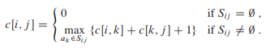
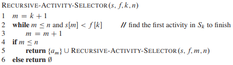
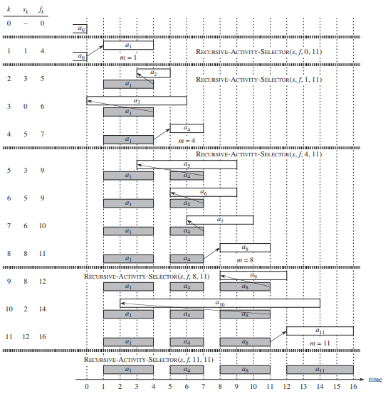
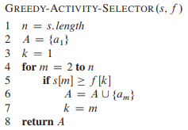

# 贪心算法

<!-- @import "[TOC]" {cmd="toc" depthFrom=1 depthTo=6 orderedList=false} -->
<!-- code_chunk_output -->

* [贪心算法](#贪心算法)
	* [活动选择问题](#活动选择问题)
		* [递归贪心算法](#递归贪心算法)
		* [迭代贪心算法](#迭代贪心算法)
	* [贪心算法原理](#贪心算法原理)
		* [贪心选择性质](#贪心选择性质)
		* [最优子结构](#最优子结构)
		* [贪心 VS 动态规划](#贪心-vs-动态规划)

<!-- /code_chunk_output -->

[贪心算法 wikipedia](https://zh.wikipedia.org/wiki/%E8%B4%AA%E5%BF%83%E6%B3%95)

求解最优化问题的算法通常需要经过一系列的步骤，在每个步骤都面临多种选择。对于许多最优化问题，使用动态规划算法来求最优解有些杀鸡用牛刀了，可以使用更简单、更高效的算法。

贪心算法就是这样的算法，他在每一步都做出当时看起来最佳的选择。也就是说，他总是做出局部最优的选择，寄希望这样的选择能导致全局最优解。在学习本章节时，应该掌握动态规划原理。

贪心算法并不保证得到最优解，但对很多问题确实可以求得最优解。首先考虑使用动态规划方法解决相关问题，然后证明一直做出贪心选择就可以得到最优解，从而得到一个贪心算法。

贪心方法是一种强有力的算法设计方法，可以很好地解决很多问题。在后面的章节中，我们会遇到很多利用贪心策略设计的算法：
* [最小生成树 wikipedia](https://zh.wikipedia.org/wiki/%E6%9C%80%E5%B0%8F%E7%94%9F%E6%88%90%E6%A0%91)
* [单源最短路径 Dijkstra 算法 wikipedia](https://zh.wikipedia.org/wiki/%E6%88%B4%E5%85%8B%E6%96%AF%E7%89%B9%E6%8B%89%E7%AE%97%E6%B3%95)

## 活动选择问题

我们的例子时一个调度竞争共享资源的多个活动的问题，目标是选出一个最大的互相兼容的活动集合。假定有一个 n 个活动和集合 S ={a.1,a.2,...,a.n},这些活动使用同一个资源，而这个资源在某个时刻只能供一个活动使用。每个活动 a.i 都有一个开始时间 s.i 和一个结束时间 f.i ,其中 0<=s.i<f.i<正无穷 。在活动选择问题中，我们希望选出一个最大兼容活动集。假定活动已按结束时间的单调递增顺序排序.

| i   | 1 | 2 | 3 | 4 | 5 | 6 | 7  | 8  | 9  | 10 | 11 |
|-----|---|---|---|---|---|---|----|----|----|----|----|
| s.i | 1 | 3 | 0 | 5 | 3 | 5 | 6  | 8  | 8  | 2  | 12 |
| f.i | 4 | 5 | 6 | 7 | 9 | 9 | 10 | 11 | 12 | 14 | 16 |

求解活动选择问题的算法不必像基于表格的动态规划算法那样自底向上进行计算。相反，可以自顶向下进行计算，选择一个活动放入最优解，然后，对剩余的子问题进行求解。贪心算法通常都是这种自顶向下的设计：做出一个选择，然后求解剩下的那些子问题，而不是自底向上地求解出很多子问题，然后在做出选择。

如果用 c[i,j] 表示集合 S 从 i 到 j 的最优解的大小，则动态规划：



实际上，对于活动选择问题，我们只需考虑一个选择：贪心选择。

### 递归贪心算法
假定活动已按结束时间的单调递增顺序排序:



算法执行过程：



### 迭代贪心算法
假定活动已按结束时间的单调递增顺序排序:



### 代码实现
```c++
#include <iostream>
#include <vector>

using namespace std;

void fun(std::vector<int> s, std::vector<int> f) {
  int length = s.size();
  std::vector<int> tmp{s[0], f[0]};

  int k = 0;

  for (int m = 1; m < length; m++) {
    if (s[m] >= f[k]) {
      tmp.push_back(s[m]);
      tmp.push_back(f[m]);
      k = m;
    }
  }

  int tmpLength = tmp.size();

  for (int i = 0; i < tmpLength; i++) {
    if (i % 2 == 0)
      std::cout << tmp[i] << " -> ";
    else
      std::cout << tmp[i] << '\n';
  }
}

int main(int argc, char const *argv[]) {
  std::vector<int> s{1, 3, 0, 5, 3, 5, 6, 8, 8, 2, 12};
  std::vector<int> f{4, 5, 6, 7, 9, 9, 10, 11, 12, 14, 16};
  fun(s, f);
  return 0;
}
```

Run it:
```sh
1 -> 4
5 -> 7
8 -> 11
12 -> 16
```

## 贪心算法原理

一般地，我们可以按照如下步骤来设计贪心算法：
1. 将最优化问题转化为这样的形式：对其做出一次选择后，只剩下一个子问题需要求解。
2. 证明做出贪心选择后，剩余的部分存在最优解，即贪心选择总是安全的。
3. 证明做出贪心选择后，剩余的子问题满足性质：其最优解与贪心选择组合即可得到原问题的最优解，这样就得到了最优子结构。

### 贪心选择性质

通过做出局部最优（贪心）选择来构造全局最优解。当然，我们必须证明每个步骤做出贪心选择能生成全局最优解。

如果进行贪心选择是我们不得不考虑众多选择，通常意味着可以改进贪心选择，使其更为高效。

### 最优子结构

如果一个问题的最优解包含其子问题的最优解，则称此问题具有最优子结构性质。此性质是能否应用动态规划和贪心方法的关键因素。

### 贪心 VS 动态规划

由于贪心和动态规划都利用了最优子结构性质，所以针对不同的场景使用不同的算法尤为重要。

* [0-1背包问题](https://zh.wikipedia.org/wiki/%E8%83%8C%E5%8C%85%E9%97%AE%E9%A2%98#0-1%E8%83%8C%E5%8C%85%E9%97%AE%E9%A2%98)：一个正在抢劫商店的小偷发现了 n 个商品，第 i 个商品价值 v.i 美元，重 w.i 榜，v.i 和 w.i 都是整数。这个小偷希望拿走价值尽可能高的商品，但他的背包最多容纳 W 磅重的商品，W 是一个整数。它应该拿那些商品？（对每个商品，小偷要么把它完整拿走，要么把它留下；他不能只拿走一个商品的一部分，或者把一个商品拿走多次）
* 分数背包问题:设定与 0-1 背包问题是一样的，但对每个商品，小偷可以拿走其一部分，而不是只做出二元（0-1）选择。

两个背包问题都具有最优子结构性质。对于 0-1 背包问题，只能使用动态规划；分数背包问题使用贪心算法更为合适。


注：
* 参考 《算法导论 3rd》 第 16 章

[上一级](base.md)
[下一篇](UML.md)
