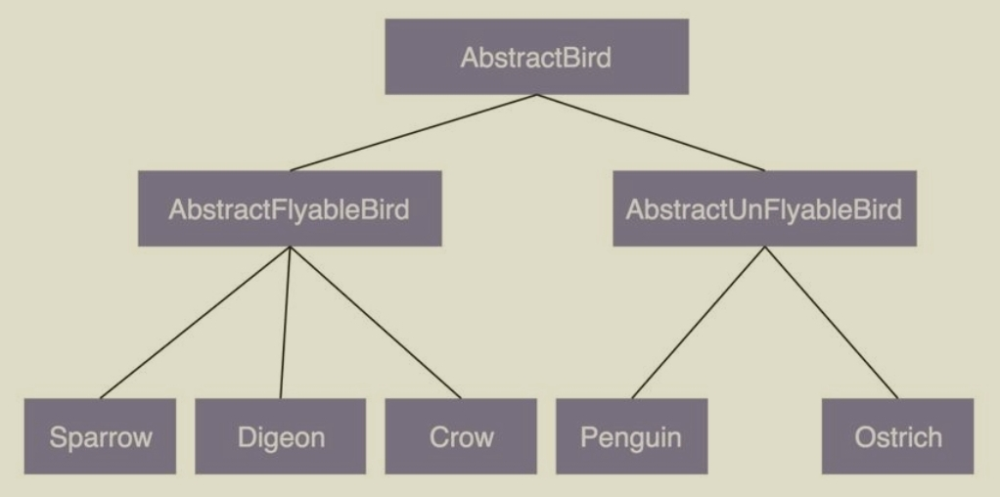

<!-- 极客时间 - 设计模式之美 - 学习笔记 -->

<!-- @import "[TOC]" {cmd="toc" depthFrom=1 depthTo=6 orderedList=false} -->

<!-- code_chunk_output -->

- [01-为什么说每个程序员都要尽早地学习并掌握设计模式相关知识？](#01-为什么说每个程序员都要尽早地学习并掌握设计模式相关知识)
- [02-从哪些维度评判代码质量的好坏？如何具备写出高质量代码的能力？](#02-从哪些维度评判代码质量的好坏如何具备写出高质量代码的能力)
  - [如何评价代码质量的高低？](#如何评价代码质量的高低)
  - [最常用的评价标准有哪几个？](#最常用的评价标准有哪几个)
  - [如何才能写出高质量的代码？](#如何才能写出高质量的代码)
- [03-面向对象、设计原则、设计模式、编程规范、重构，这五者有何关系？](#03-面向对象-设计原则-设计模式-编程规范-重构这五者有何关系)
  - [面向对象](#面向对象)
  - [设计原则](#设计原则)
  - [设计模式](#设计模式)
    - [1.创建型](#1创建型)
    - [2.结构型](#2结构型)
    - [3.行为型](#3行为型)
  - [编程规范](#编程规范)
  - [代码重构](#代码重构)
  - [五者之间的联系](#五者之间的联系)
- [04-理论一：当谈论面向对象的时候，我们到底在谈论什么？](#04-理论一当谈论面向对象的时候我们到底在谈论什么)
  - [什么是面向对象编程和面向对象编程语言？](#什么是面向对象编程和面向对象编程语言)
  - [如何判定某编程语言是否是面向对象编程语言？](#如何判定某编程语言是否是面向对象编程语言)
  - [什么是面向对象分析和面向对象设计？](#什么是面向对象分析和面向对象设计)
  - [什么是UML？我们是否需要UML？](#什么是uml我们是否需要uml)
- [05-理论二：封装、抽象、继承、多态分别可以解决哪些编程问题？](#05-理论二封装-抽象-继承-多态分别可以解决哪些编程问题)
  - [封装（Encapsulation）](#封装encapsulation)
    - [它能解决什么编程问题？](#它能解决什么编程问题)
  - [抽象（Abstraction）](#抽象abstraction)
    - [它能解决什么编程问题？](#它能解决什么编程问题-1)
  - [继承（Inheritance）](#继承inheritance)
    - [它能解决什么编程问题？](#它能解决什么编程问题-2)
  - [多态（Polymorphism）](#多态polymorphism)
    - [它能解决什么编程问题？](#它能解决什么编程问题-3)
- [06-理论三：面向对象相比面向过程有哪些优势？](#06-理论三面向对象相比面向过程有哪些优势)
  - [基础定义](#基础定义)
  - [面向对象编程相比面向过程编程有哪些优势？](#面向对象编程相比面向过程编程有哪些优势)
- [07-理论四：哪些代码设计看似是面向对象，实际是面向过程的？](#07-理论四哪些代码设计看似是面向对象实际是面向过程的)
  - [哪些代码设计看似是面向对象，实际是面向过程的？](#哪些代码设计看似是面向对象实际是面向过程的)
    - [滥用getter、setter方法](#滥用getter-setter方法)
    - [滥用全局变量和全局方法](#滥用全局变量和全局方法)
    - [定义数据和方法分离的类](#定义数据和方法分离的类)
  - [在面向对象编程中，为什么容易写出面向过程风格的代码？](#在面向对象编程中为什么容易写出面向过程风格的代码)
  - [面向过程编程及面向过程编程语言就真的无用武之地了吗？](#面向过程编程及面向过程编程语言就真的无用武之地了吗)
- [08-理论五：接口vs抽象类的区别？如何用普通的类模拟抽象类和接口？](#08-理论五接口vs抽象类的区别如何用普通的类模拟抽象类和接口)
  - [什么是抽象类和接口？区别在哪里？](#什么是抽象类和接口区别在哪里)
  - [抽象类和接口能解决什么编程问题？](#抽象类和接口能解决什么编程问题)
    - [抽象类能够解决什么编程问题？](#抽象类能够解决什么编程问题)
    - [接口能够解决什么编程问题？](#接口能够解决什么编程问题)
  - [如何模拟抽象类和接口两个语法概念？](#如何模拟抽象类和接口两个语法概念)
  - [如何决定该用抽象类还是接口？](#如何决定该用抽象类还是接口)
- [09-理论六：为什么基于接口而非实现编程？有必要为每个类都定义接口吗？](#09-理论六为什么基于接口而非实现编程有必要为每个类都定义接口吗)
  - [如何解读原则中的“接口”二字？](#如何解读原则中的接口二字)
  - [如何将这条原则应用到实战中？](#如何将这条原则应用到实战中)
  - [是否需要为每个类定义接口？](#是否需要为每个类定义接口)
- [10-理论七：为何说要多用组合少用继承？如何决定该用组合还是继承？](#10-理论七为何说要多用组合少用继承如何决定该用组合还是继承)
  - [为什么不推荐使用继承？](#为什么不推荐使用继承)
  - [组合相比继承有哪些优势？](#组合相比继承有哪些优势)
  - [如何判断该用组合还是继承？](#如何判断该用组合还是继承)
- [11-实战一：业务开发常用的基于贫血模型的MVC架构违背OOP吗？](#11-实战一业务开发常用的基于贫血模型的mvc架构违背oop吗)
  - [什么是基于贫血模型的传统开发模式？](#什么是基于贫血模型的传统开发模式)
  - [什么是基于充血模型的DDD开发模式？](#什么是基于充血模型的ddd开发模式)
  - [为什么基于贫血模型的传统开发模式如此受欢迎？](#为什么基于贫血模型的传统开发模式如此受欢迎)
  - [什么项目应该考虑使用基于充血模型的DDD开发模式？](#什么项目应该考虑使用基于充血模型的ddd开发模式)
- [13-实战二（上）：如何对接口鉴权这样一个功能开发做面向对象分析？](#13-实战二上如何对接口鉴权这样一个功能开发做面向对象分析)
  - [对案例进行需求分析](#对案例进行需求分析)
    - [1.第一轮基础分析](#1第一轮基础分析)
    - [2.第二轮分析优化](#2第二轮分析优化)
    - [3.第三轮分析优化](#3第三轮分析优化)
    - [4.第四轮分析优化](#4第四轮分析优化)
    - [5.最终确定需求](#5最终确定需求)
  - [重点回顾](#重点回顾)
- [14-实战二（下）：如何利用面向对象设计和编程开发接口鉴权功能？](#14-实战二下如何利用面向对象设计和编程开发接口鉴权功能)
  - [如何进行面向对象设计？](#如何进行面向对象设计)
    - [1.划分职责进而识别出有哪些类](#1划分职责进而识别出有哪些类)
    - [2.定义类及其属性和方法](#2定义类及其属性和方法)
    - [3.定义类与类之间的交互关系](#3定义类与类之间的交互关系)
    - [4.将类组装起来并提供执行入口](#4将类组装起来并提供执行入口)
  - [辩证思考与灵活应用](#辩证思考与灵活应用)
  - [重点回顾](#重点回顾-1)
    - [1.划分职责进而识别出有哪些类](#1划分职责进而识别出有哪些类-1)
    - [2.定义类及其属性和方法](#2定义类及其属性和方法-1)
    - [3.定义类与类之间的交互关系](#3定义类与类之间的交互关系-1)
    - [4.将类组装起来并提供执行入口](#4将类组装起来并提供执行入口-1)
- [15-理论一：对于单一职责原则，如何判定某个类的职责是否够“单一”？](#15-理论一对于单一职责原则如何判定某个类的职责是否够单一)
  - [如何理解单一职责原则（SRP）？](#如何理解单一职责原则srp)
  - [如何判断类的职责是否足够单一？](#如何判断类的职责是否足够单一)
  - [类的职责是否设计得越单一越好？](#类的职责是否设计得越单一越好)
- [16-理论二：如何做到“对扩展开放、修改关闭”？扩展和修改各指什么？](#16-理论二如何做到对扩展开放-修改关闭扩展和修改各指什么)
  - [如何理解“对扩展开放、修改关闭”？](#如何理解对扩展开放-修改关闭)
  - [修改代码就意味着违背开闭原则吗？](#修改代码就意味着违背开闭原则吗)
  - [如何做到“对扩展开放、修改关闭”？](#如何做到对扩展开放-修改关闭)
  - [如何在项目中灵活应用开闭原则？](#如何在项目中灵活应用开闭原则)
- [17-理论三：里式替换（LSP）跟多态有何区别？哪些代码违背了LSP？](#17-理论三里式替换lsp跟多态有何区别哪些代码违背了lsp)
  - [如何理解“里式替换原则”？](#如何理解里式替换原则)
  - [哪些代码明显违背了LSP？](#哪些代码明显违背了lsp)
- [18-理论四：接口隔离原则有哪三种应用？原则中的“接口”该如何理解？](#18-理论四接口隔离原则有哪三种应用原则中的接口该如何理解)
  - [如何理解“接口隔离原则”？](#如何理解接口隔离原则)
  - [把“接口”理解为一组API接口集合](#把接口理解为一组api接口集合)
  - [把“接口”理解为单个API接口或函数](#把接口理解为单个api接口或函数)
  - [把“接口”理解为OOP中的接口概念](#把接口理解为oop中的接口概念)
  - [接口隔离原则与单一职责原则的区别](#接口隔离原则与单一职责原则的区别)
- [19-理论五：控制反转、依赖反转、依赖注入，这三者有何区别和联系？](#19-理论五控制反转-依赖反转-依赖注入这三者有何区别和联系)
  - [控制反转（IOC）](#控制反转ioc)
  - [依赖注入（DI）](#依赖注入di)
  - [依赖注入框架（DI Framework）](#依赖注入框架di-framework)
  - [依赖反转原则（DIP）](#依赖反转原则dip)
- [20-理论六：我为何说KISS、YAGNI原则看似简单，却经常被用错？](#20-理论六我为何说kiss-yagni原则看似简单却经常被用错)
  - [如何理解“KISS原则”？](#如何理解kiss原则)
  - [代码行数越少就越“简单”吗？](#代码行数越少就越简单吗)
  - [代码逻辑复杂就违背KISS原则吗？](#代码逻辑复杂就违背kiss原则吗)
  - [如何写出满足KISS原则的代码？](#如何写出满足kiss原则的代码)
  - [YAGNI跟KISS说的是一回事吗？](#yagni跟kiss说的是一回事吗)
- [21-理论七：重复的代码就一定违背DRY吗？如何提高代码的复用性？](#21-理论七重复的代码就一定违背dry吗如何提高代码的复用性)
  - [DRY原则（Don’t Repeat Yourself）](#dry原则dont-repeat-yourself)
    - [实现逻辑重复](#实现逻辑重复)
    - [功能语义重复](#功能语义重复)
    - [代码执行重复](#代码执行重复)
  - [代码复用性（Code Reusability）](#代码复用性code-reusability)
    - [什么是代码的复用性？](#什么是代码的复用性)
  - [怎么提高代码复用性？](#怎么提高代码复用性)
    - [辩证思考和灵活应用](#辩证思考和灵活应用)
- [22-理论八：如何用迪米特法则（LOD）实现“高内聚、松耦合”？](#22-理论八如何用迪米特法则lod实现高内聚-松耦合)
  - [何为“高内聚、松耦合”？](#何为高内聚-松耦合)
  - [“迪米特法则”理论描述](#迪米特法则理论描述)
    - [理论解读与代码实战一](#理论解读与代码实战一)
    - [理论解读与代码实战二](#理论解读与代码实战二)
  - [辩证思考与灵活应用](#辩证思考与灵活应用-1)

<!-- /code_chunk_output -->

# 01-为什么说每个程序员都要尽早地学习并掌握设计模式相关知识？

- 应对面试中的设计模式相关问题
- 告别写被人吐槽的烂代码
- 提高复杂代码的设计和开发能力
- 让读源码、学框架事半功倍
- 为你的职场发展做铺垫

# 02-从哪些维度评判代码质量的好坏？如何具备写出高质量代码的能力？

## 如何评价代码质量的高低？

代码质量的评价有很强的主观性，描述代码质量的词汇也有很多，比如可读性、可维护性、灵活、优雅、简洁等，这些词汇是从不同的维度去评价代码质量的。它们之间有互相作用，并不是独立的，比如，代码的可读性好、可扩展性好就意味着代码的可维护性好。代码质量高低是一个综合各种因素得到的结论。我们并不能通过单一的维度去评价一段代码的好坏。

## 最常用的评价标准有哪几个？

- 1.可维护性（maintainability）- 在不破坏原有代码设计、不引入新的bug的情况下，能够快速地修改或者添加代码。
- 2.可读性（readability）-  如何评价一段代码的可读性呢？我们需要看代码是否符合编码规范、命名是否达意、注释是否详尽、函数是否长短合适、模块划分是否清晰、是否符合高内聚低耦合等等。
- 3.可扩展性（extensibility）- 我们在不修改或少量修改原有代码的情况下，通过扩展的方式添加新的功能代码。
- 4.灵活性（flexibility）- 易扩展、易复用或者易用
- 5.简洁性（simplicity）- 思从深而行从简，真正的高手能云淡风轻地用最简单的方法解决最复杂的问题。这也是一个编程老手跟编程新手的本质区别之一。
- 6.可复用性（reusability）- 尽量减少重复代码的编写，复用已有的代码。
- 7.可测试性（testability）- 代码的可测试性是一个相对较少被提及，但又非常重要的代码质量评价标准。代码可测试性的好坏，能从侧面上非常准确地反应代码质量的好坏。代码的可测试性差，比较难写单元测试，那基本上就能说明代码设计得有问题。

其中，可维护性、可读性、可扩展性又是提到最多的、最重要的三个评价标准。

## 如何才能写出高质量的代码？

问如何写出高质量的代码，也就等同于在问，如何写出易维护、易读、易扩展、灵活、简洁、可复用、可测试的代码。

要写出满足这些评价标准的高质量代码，我们需要掌握一些更加细化、更加能落地的编程方法论，包括面向对象设计思想、设计原则、设计模式、编码规范、重构技巧等。而所有这些编程方法论的最终目的都是为了编写出高质量的代码。

# 03-面向对象、设计原则、设计模式、编程规范、重构，这五者有何关系？

## 面向对象

面向对象编程因为其具有丰富的特性（封装、抽象、继承、多态），可以实现很多复杂的设计思路，是很多设计原则、设计模式编码实现的基础。

对于这部分内容，你需要掌握下面这7个大的知识点。

- 面向对象的四大特性：封装、抽象、继承、多态
- 面向对象编程与面向过程编程的区别和联系
- 面向对象分析、面向对象设计、面向对象编程
- 接口和抽象类的区别以及各自的应用场景
- 基于接口而非实现编程的设计思想
- 多用组合少用继承的设计思想
- 面向过程的贫血模型和面向对象的充血模型

## 设计原则

设计原则是指导我们代码设计的一些经验总结。对于每一种设计原则，我们需要掌握它的设计初衷，能解决哪些编程问题，有哪些应用场景。只有这样，我们才能在项目中灵活恰当地应用这些原则。

对于这一部分内容，你需要透彻理解并且掌握，如何应用下面这样几个常用的设计原则。

- SOLID原则-SRP单一职责原则
- SOLID原则-OCP开闭原则
- SOLID原则-LSP里式替换原则
- SOLID原则-ISP接口隔离原则
- SOLID原则-DIP依赖倒置原则
- DRY原则、KISS原则、YAGNI原则、LOD法则

## 设计模式

设计模式是针对软件开发中经常遇到的一些设计问题，总结出来的一套解决方案或者设计思路。大部分设计模式要解决的都是代码的可扩展性问题。设计模式相对于设计原则来说，没有那么抽象，而且大部分都不难理解，代码实现也并不复杂。这一块的学习难点是了解它们都能解决哪些问题，掌握典型的应用场景，并且懂得不过度应用。

经典的设计模式有23种。它们又可以分为三大类：创建型、结构型、行为型。对于这23种设计模式的学习，我们要有侧重点，因为有些模式是比较常用的，有些模式是很少被用到的。对于常用的设计模式，我们要花多点时间理解掌握。对于不常用的设计模式，我们只需要稍微了解即可。

### 1.创建型

常用的有：单例模式、工厂模式（工厂方法和抽象工厂）、建造者模式。

不常用的有：原型模式。

### 2.结构型

常用的有：代理模式、桥接模式、装饰者模式、适配器模式。

不常用的有：门面模式、组合模式、享元模式。

### 3.行为型

常用的有：观察者模式、模板模式、策略模式、职责链模式、迭代器模式、状态模式。

不常用的有：访问者模式、备忘录模式、命令模式、解释器模式、中介模式。

## 编程规范

编程规范主要解决的是代码的可读性问题。编码规范相对于设计原则、设计模式，更加具体、更加偏重代码细节。即便你可能对设计原则不熟悉、对设计模式不了解，但你最起码要掌握基本的编码规范，比如，如何给变量、类、函数命名，如何写代码注释，函数不宜过长、参数不能过多等等。

## 代码重构

在软件开发中，只要软件在不停地迭代，就没有一劳永逸的设计。随着需求的变化，代码的不停堆砌，原有的设计必定会存在这样那样的问题。针对这些问题，我们就需要进行代码重构。重构是软件开发中非常重要的一个环节。持续重构是保持代码质量不下降的有效手段，能有效避免代码腐化到无可救药的地步。

而重构的工具就是我们前面罗列的那些面向对象设计思想、设计原则、设计模式、编码规范。实际上，设计思想、设计原则、设计模式一个最重要的应用场景就是在重构的时候。我们前面讲过，虽然使用设计模式可以提高代码的可扩展性，但过度不恰当地使用，也会增加代码的复杂度，影响代码的可读性。在开发初期，除非特别必须，我们一定不要过度设计，应用复杂的设计模式。而是当代码出现问题的时候，我们再针对问题，应用原则和模式进行重构。这样就能有效避免前期的过度设计。

对于重构这部分内容，你需要掌握以下几个知识点：

- 重构的目的（why）、对象（what）、时机（when）、方法（how）；
- 保证重构不出错的技术手段：单元测试和代码的可测试性；
- 两种不同规模的重构：大重构（大规模高层次）和小重构（小规模低层次）。

## 五者之间的联系

关于面向对象、设计原则、设计模式、编程规范和代码重构，这五者的关系我们前面稍微提到了一些，我这里再总结梳理一下。

- 面向对象编程因为其具有丰富的特性（封装、抽象、继承、多态），可以实现很多复杂的设计思路，是很多设计原则、设计模式等编码实现的基础。
- 设计原则是指导我们代码设计的一些经验总结，对于某些场景下，是否应该应用某种设计模式，具有指导意义。比如，“开闭原则”是很多设计模式（策略、模板等）的指导原则。
- 设计模式是针对软件开发中经常遇到的一些设计问题，总结出来的一套解决方案或者设计思路。应用设计模式的主要目的是提高代码的可扩展性。从抽象程度上来讲，设计原则比设计模式更抽象。设计模式更加具体、更加可执行。
- 编程规范主要解决的是代码的可读性问题。编码规范相对于设计原则、设计模式，更加具体、更加偏重代码细节、更加能落地。持续的小重构依赖的理论基础主要就是编程规范。
- 重构作为保持代码质量不下降的有效手段，利用的就是面向对象、设计原则、设计模式、编码规范这些理论。

实际上，面向对象、设计原则、设计模式、编程规范、代码重构，这五者都是保持或者提高代码质量的方法论，本质上都是服务于编写高质量代码这一件事的


# 04-理论一：当谈论面向对象的时候，我们到底在谈论什么？

## 什么是面向对象编程和面向对象编程语言？

如果不按照严格的定义来说，大部分编程语言都是面向对象编程语言，比如Java、C++、Go、Python、C#、Ruby、JavaScript、Objective-C、Scala、PHP、Perl等等。

- 面向对象编程是一种编程范式或编程风格。它以类或对象作为组织代码的基本单元，并将封装、抽象、继承、多态四个特性，作为代码设计和实现的基石 。
- 面向对象编程语言是支持类或对象的语法机制，并有现成的语法机制，能方便地实现面向对象编程四大特性（封装、抽象、继承、多态）的编程语言。

理解面向对象编程及面向对象编程语言两个概念，其中最关键的一点就是理解面向对象编程的四大特性。这四大特性分别是：封装、抽象、继承、多态。不过，关于面向对象编程的特性，也有另外一种说法，那就是只包含三大特性：封装、继承、多态，不包含抽象。为什么会有这种分歧呢？抽象为什么可以排除在面向对象编程特性之外呢？关于这个问题，在下一节课详细讲解这四大特性的时候，我还会再拿出来说一下。不过，话说回来，实际上，我们没必要纠结到底是四大特性还是三大特性，关键还是理解每种特性讲的是什么内容、存在的意义以及能解决什么问题。

## 如何判定某编程语言是否是面向对象编程语言？

前面提到的有些编程语言，并不是严格意义上的面向对象编程语言，比如JavaScript，它不支持封装和继承特性，按照严格的定义，它不算是面向对象编程语言，但在某种意义上，它又可以算得上是一种面向对象编程语言。我为什么这么说呢？到底该如何判断一个编程语言是否是面向对象编程语言呢？

实际上，面向对象编程从字面上，按照最简单、最原始的方式来理解，就是将对象或类作为代码组织的基本单元，来进行编程的一种编程范式或者编程风格，并不一定需要封装、抽象、继承、多态这四大特性的支持。但是，在进行面向对象编程的过程中，人们不停地总结发现，有了这四大特性，我们就能更容易地实现各种面向对象的代码设计思路。

比如，我们在面向对象编程的过程中，经常会遇到is-a这种类关系（比如狗是一种动物），而继承这个特性就能很好地支持这种is-a的代码设计思路，并且解决代码复用的问题，所以，继承就成了面向对象编程的四大特性之一。但是随着编程语言的不断迭代、演化，人们发现继承这种特性容易造成层次不清、代码混乱，所以，很多编程语言在设计的时候就开始摒弃继承特性，比如Go语言。但是，我们并不能因为它摒弃了继承特性，就一刀切地认为它不是面向对象编程语言了。

实际上，**只要某种编程语言支持类或对象的语法概念，并且以此作为组织代码的基本单元，那就可以被粗略地认为它就是面向对象编程语言了**。至于是否有现成的语法机制，完全地支持了面向对象编程的四大特性、是否对四大特性有所取舍和优化，可以不作为判定的标准。基于此，我们才有了前面的说法，按照严格的定义，很多语言都不能算得上面向对象编程语言，但按照不严格的定义来讲，现在流行的大部分编程语言都是面向对象编程语言。

## 什么是面向对象分析和面向对象设计？

前面我们讲了面向对象编程（OOP），实际上，跟面向对象编程经常放到一块儿来讲的还有另外两个概念，那就是面向对象分析（OOA）和面向对象设计（OOD）.

OOA、OOD、OOP三个连在一起就是面向对象分析、设计、编程（实现），正好是面向对象软件开发要经历的三个阶段。

简单点讲，面向对象分析就是要搞清楚做什么，面向对象设计就是要搞清楚怎么做，面向对象编程就是将分析和设计的的结果翻译成代码的过程。

## 什么是UML？我们是否需要UML？

UML（Unified Model Language），统一建模语言。很多讲解面向对象或设计模式的书籍，常用它来画图表达面向对象或设计模式的设计思路。

实际上，UML是一种非常复杂的东西。它不仅仅包含我们常提到类图，还有用例图、顺序图、活动图、状态图、组件图等。在我看来，即便仅仅使用类图，学习成本也是很高的。就单说类之间的关系，UML就定义了很多种，比如泛化、实现、关联、聚合、组合、依赖等。

要想完全掌握，并且熟练运用这些类之间的关系，来画UML类图，肯定要花很多的学习精力。而且，UML作为一种沟通工具，即便你能完全按照UML规范来画类图，可对于不熟悉的人来说，看懂的成本也还是很高的。

**UML在互联网公司的项目开发中，用处可能并不大。为了文档化软件设计或者方便讨论软件设计，大部分情况下，我们随手画个不那么规范的草图，能够达意，方便沟通就够了，而完全按照UML规范来将草图标准化，所付出的代价是不值得的。**

# 05-理论二：封装、抽象、继承、多态分别可以解决哪些编程问题？

## 封装（Encapsulation）

封装也叫作信息隐藏或者数据访问保护。类通过暴露有限的访问接口，授权外部仅能通过类提供的方式（或者叫函数）来访问内部信息或者数据。

### 它能解决什么编程问题？

如果我们对类中属性的访问不做限制，那任何代码都可以访问、修改类中的属性，虽然这样看起来更加灵活，但从另一方面来说，过度灵活也意味着不可控，属性可以随意被以各种奇葩的方式修改，而且修改逻辑可能散落在代码中的各个角落，势必影响代码的可读性、可维护性。

## 抽象（Abstraction）

抽象讲的是如何隐藏方法的具体实现，让调用者只需要关心方法提供了哪些功能，并不需要知道这些功能是如何实现的。

### 它能解决什么编程问题？

抽象作为一种只关注功能点不关注实现的设计思路，正好帮我们的大脑过滤掉许多非必要的信息。

除此之外，抽象作为一个非常宽泛的设计思想，在代码设计中，起到非常重要的指导作用。很多设计原则都体现了抽象这种设计思想，比如基于接口而非实现编程、开闭原则（对扩展开放、对修改关闭）、代码解耦（降低代码的耦合性）等。

## 继承（Inheritance）

继承是用来表示类之间的is-a关系，比如猫是一种哺乳动物。

### 它能解决什么编程问题？

继承最大的一个好处就是代码复用。假如两个类有一些相同的属性和方法，我们就可以将这些相同的部分，抽取到父类中，让两个子类继承父类。这样，两个子类就可以重用父类中的代码，避免代码重复写多遍。

继承的概念很好理解，也很容易使用。不过，过度使用继承，继承层次过深过复杂，就会导致代码可读性、可维护性变差。为了了解一个类的功能，我们不仅需要查看这个类的代码，还需要按照继承关系一层一层地往上查看“父类、父类的父类……”的代码。还有，子类和父类高度耦合，修改父类的代码，会直接影响到子类。

所以，继承这个特性也是一个非常有争议的特性。很多人觉得继承是一种反模式。我们应该尽量少用，甚至不用。关于这个问题，在后面讲到“多用组合少用继承”这种设计思想的时候，会非常详细地再讲解。

## 多态（Polymorphism）

多态是指，子类可以替换父类，在实际的代码运行过程中，调用子类的方法实现。

### 它能解决什么编程问题？

多态特性能提高代码的可扩展性和复用性。

除此之外，多态也是很多设计模式、设计原则、编程技巧的代码实现基础，比如策略模式、基于接口而非实现编程、依赖倒置原则、里式替换原则、利用多态去掉冗长的if-else语句等等。

# 06-理论三：面向对象相比面向过程有哪些优势？

## 基础定义

- 面向对象编程是一种编程范式或编程风格。它以类或对象作为组织代码的基本单元，并将封装、抽象、继承、多态四个特性，作为代码设计和实现的基石 。
- 面向对象编程语言是支持类或对象的语法机制，并有现成的语法机制，能方便地实现面向对象编程四大特性（封装、抽象、继承、多态）的编程语言。
- 面向过程编程也是一种编程范式或编程风格。它以过程（可以理解为方法、函数、操作）作为组织代码的基本单元，以数据（可以理解为成员变量、属性）与方法相分离为最主要的特点。面向过程风格是一种流程化的编程风格，通过拼接一组顺序执行的方法来操作数据完成一项功能。
- 面向过程编程语言首先是一种编程语言。它最大的特点是不支持类和对象两个语法概念，不支持丰富的面向对象编程特性（比如继承、多态、封装），仅支持面向过程编程。

## 面向对象编程相比面向过程编程有哪些优势？

1. OOP更加能够应对大规模复杂程序的开发
2. OOP风格的代码更易复用、易扩展、易维护
3. OOP语言更加人性化、更加高级、更加智能

# 07-理论四：哪些代码设计看似是面向对象，实际是面向过程的？

在实际的开发工作中，很多同学对面向对象编程都有误解，总以为把所有代码都塞到类里，自然就是在进行面向对象编程了。实际上，这样的认识是不正确的。有时候，从表面上看似是面向对象编程风格的代码，从本质上看却是面向过程编程风格的。

面向过程编程是否就真的无用武之地了呢？是否有必要杜绝在面向对象编程中写面向过程风格的代码呢？

## 哪些代码设计看似是面向对象，实际是面向过程的？

### 滥用getter、setter方法

面向对象封装的定义是：通过访问权限控制，隐藏内部数据，外部仅能通过类提供的有限的接口访问、修改内部数据。所以，暴露不应该暴露的setter方法，明显违反了面向对象的封装特性。数据没有访问权限控制，任何代码都可以随意修改它，代码就退化成了面向过程编程风格的了。

在设计实现类的时候，除非真的需要，否则，尽量不要给属性定义setter方法。除此之外，尽管getter方法相对setter方法要安全些，但是如果返回的是集合容器（比如例子中的List容器），也要防范集合内部数据被修改的危险。

### 滥用全局变量和全局方法

在面向对象编程中，常见的全局变量有单例类对象、静态成员变量、常量等，常见的全局方法有静态方法。

常量是一种非常常见的全局变量，比如一些代码中的配置参数，一般都设置为常量，放到一个Constants类中。静态方法一般用来操作静态变量或者外部数据。你可以联想一下我们常用的各种Utils类，里面的方法一般都会定义成静态方法，可以在不用创建对象的情况下，直接拿来使用。静态方法将方法与数据分离，破坏了封装特性，是典型的面向过程风格。

设计 Constants、Utils类的时候，最好也能细化一下，针对不同的功能，设计不同的类。以 Utils 为例，可以设计诸如 FileUtils、IOUtils、StringUtils、UrlUtils等细小的类，不要设计一个过于大而全的类（这样可以避免过多的类依赖这个，降低编译时间）。除此之外，如果能将这些类中的属性和方法，划分归并到其他业务类中，那是最好不过的了，能极大地提高类的内聚性和代码的可复用性。

### 定义数据和方法分离的类

我们再来看最后一种面向对象编程过程中，常见的面向过程风格的代码。那就是，数据定义在一个类中，方法定义在另一个类中。你可能会觉得，这么明显的面向过程风格的代码，谁会这么写呢？实际上，如果你是基于MVC三层结构做Web方面的后端开发，这样的代码你可能天天都在写。

传统的MVC结构分为Model层、Controller层、View层这三层。不过，在做前后端分离之后，三层结构在后端开发中，会稍微有些调整，被分为Controller层、Service层、Repository层。Controller层负责暴露接口给前端调用，Service层负责核心业务逻辑，Repository层负责数据读写。而在每一层中，我们又会定义相应的VO（View Object）、BO（Business Object）、Entity。一般情况下，VO、BO、Entity中只会定义数据，不会定义方法，所有操作这些数据的业务逻辑都定义在对应的Controller类、Service类、Repository类中。这就是典型的面向过程的编程风格。

实际上，这种开发模式叫作基于贫血模型的开发模式，也是我们现在非常常用的一种Web项目的开发模式。看到这里，你内心里应该有很多疑惑吧？既然这种开发模式明显违背面向对象的编程风格，为什么大部分Web项目都是基于这种开发模式来开发呢？

后续将会更细致、全面的讲解这个。

## 在面向对象编程中，为什么容易写出面向过程风格的代码？

可以联想一下，在生活中，你去完成一个任务，你一般都会思考，应该先做什么、后做什么，如何一步一步地顺序执行一系列操作，最后完成整个任务。面向过程编程风格恰恰符合人的这种流程化思维方式。而面向对象编程风格正好相反。它是一种自底向上的思考方式。它不是先去按照执行流程来分解任务，而是将任务翻译成一个一个的小的模块（也就是类），设计类之间的交互，最后按照流程将类组装起来，完成整个任务。我们在上一节课讲到了，这样的思考路径比较适合复杂程序的开发，但并不是特别符合人类的思考习惯。

除此之外，面向对象编程要比面向过程编程难一些。在面向对象编程中，类的设计还是挺需要技巧，挺需要一定设计经验的。你要去思考如何封装合适的数据和方法到一个类里，如何设计类之间的关系，如何设计类之间的交互等等诸多设计问题。

所以，基于这两点原因，很多工程师在开发的过程，更倾向于用不太需要动脑子的方式去实现需求，也就不由自主地就将代码写成面向过程风格的了。

## 面向过程编程及面向过程编程语言就真的无用武之地了吗？

如果我们开发的是微小程序，或者是一个数据处理相关的代码，以算法为主，数据为辅，那脚本式的面向过程的编程风格就更适合一些。当然，面向过程编程的用武之地还不止这些。实际上，面向过程编程是面向对象编程的基础，面向对象编程离不开基础的面向过程编程。为什么这么说？我们仔细想想，类中每个方法的实现逻辑，不就是面向过程风格的代码吗？

除此之外，面向对象和面向过程两种编程风格，也并不是非黑即白、完全对立的。在用面向对象编程语言开发的软件中，面向过程风格的代码并不少见，甚至在一些标准的开发库（比如JDK、Apache Commons、Google Guava）中，也有很多面向过程风格的代码。

不管使用面向过程还是面向对象哪种风格来写代码，我们最终的目的还是写出易维护、易读、易复用、易扩展的高质量代码。只要我们能避免面向过程编程风格的一些弊端，控制好它的副作用，在掌控范围内为我们所用，我们就大可不用避讳在面向对象编程中写面向过程风格的代码。

# 08-理论五：接口vs抽象类的区别？如何用普通的类模拟抽象类和接口？

在面向对象编程中，抽象类和接口是两个经常被用到的语法概念，是面向对象四大特性，以及很多设计模式、设计思想、设计原则编程实现的基础。
比如，我们可以使用接口来实现面向对象的抽象特性、多态特性和基于接口而非实现的设计原则，使用抽象类来实现面向对象的继承特性和模板设计模式等等。

不过，并不是所有的面向对象编程语言都支持这两个语法概念，比如，**C++这种编程语言只支持抽象类，不支持接口**；而像Python这样的动态编程语言，既不支持抽象类，也不支持接口。尽管有些编程语言没有提供现成的语法来支持接口和抽象类，我们仍然可以通过一些手段来模拟实现这两个语法概念。

## 什么是抽象类和接口？区别在哪里？

抽象类具有哪些特性。我总结了下面三点。

- 抽象类不允许被实例化，只能被继承。也就是说，你不能new一个抽象类的对象出来。
- 抽象类可以包含属性和方法。方法既可以包含代码实现（比如Logger中的log()方法），也可以不包含代码实现（比如Logger中的doLog()方法）。不包含代码实现的方法叫作抽象方法。
- 子类继承抽象类，必须实现抽象类中的所有抽象方法。

接口都有哪些特性。我也总结了三点。

- 接口不能包含属性（也就是成员变量）。
- 接口只能声明方法，方法不能包含代码实现。
- 类实现接口的时候，必须实现接口中声明的所有方法。

从语法特性上对比，这两者有比较大的区别，比如抽象类中可以定义属性、方法的实现，而接口中不能定义属性，方法也不能包含代码实现等等。除了语法特性，从设计的角度，两者也有比较大的区别。

抽象类实际上就是类，只不过是一种特殊的类，这种类不能被实例化为对象，只能被子类继承。我们知道，继承关系是一种is-a的关系，那抽象类既然属于类，也表示一种is-a的关系。相对于抽象类的is-a关系来说，接口表示一种has-a关系，表示具有某些功能。对于接口，有一个更加形象的叫法，那就是协议（contract）。

## 抽象类和接口能解决什么编程问题？

### 抽象类能够解决什么编程问题？

- 抽象类也是为代码复用而生的
- 实现起来更为优雅，亦可以让编译器强制子类重写相应方法，降低子类被误用风险。

### 接口能够解决什么编程问题？

抽象类更多的是为了代码复用，而接口就更侧重于解耦。接口是对行为的一种抽象，相当于一组协议或者契约，你可以联想类比一下API接口。调用者只需要关注抽象的接口，不需要了解具体的实现，具体的实现代码对调用者透明。接口实现了约定和实现相分离，可以降低代码间的耦合性，提高代码的可扩展性。

实际上，接口是一个比抽象类应用更加广泛、更加重要的知识点。比如，我们经常提到的“基于接口而非实现编程”，就是一条几乎天天会用到，并且能极大地提高代码的灵活性、扩展性的设计思想。

## 如何模拟抽象类和接口两个语法概念？

我们先来回忆一下接口的定义：接口中没有成员变量，只有方法声明，没有方法实现，实现接口的类必须实现接口中的所有方法。只要满足这样几点，从设计的角度上来说，我们就可以把它叫作接口。

实际上，除了用抽象类来模拟接口之外，我们还可以用普通类来模拟接口。具体的Java代码实现如下所示。

```java
public class MockInteface {
  protected MockInteface() {}
  public void funcA() {
    throw new MethodUnSupportedException();
  }
}
```

我们知道类中的方法必须包含实现，这个不符合接口的定义。但是，我们可以让类中的方法抛出MethodUnSupportedException异常，来模拟不包含实现的接口，并且能强迫子类在继承这个父类的时候，都去主动实现父类的方法，否则就会在运行时抛出异常。我们将构造函数设置成protected属性的，这样就能避免非同包下的类去实例化MockInterface。不过，这样还是无法避免同包中的类去实例化MockInterface。为了解决这个问题，我们可以学习Google Guava中@VisibleForTesting注解的做法，自定义一个注解，人为表明不可实例化。

对于动态编程语言来说，还有一种对接口支持的策略，那就是duck-typing。

## 如何决定该用抽象类还是接口？

如果我们要表示一种is-a的关系，并且是为了解决代码复用的问题，我们就用抽象类；如果我们要表示一种has-a关系，并且是为了解决抽象而非代码复用的问题，那我们就可以使用接口。

从类的继承层次上来看，抽象类是一种自下而上的设计思路，先有子类的代码重复，然后再抽象成上层的父类（也就是抽象类）。而接口正好相反，它是一种自上而下的设计思路。我们在编程的时候，一般都是先设计接口，再去考虑具体的实现。

# 09-理论六：为什么基于接口而非实现编程？有必要为每个类都定义接口吗？

## 如何解读原则中的“接口”二字？

“基于接口而非实现编程”这条原则的英文描述是：“Program to an interface, not an implementation”。我们理解这条原则的时候，千万不要一开始就与具体的编程语言挂钩，局限在编程语言的“接口”语法中（比如Java中的interface接口语法）

从本质上来看，“接口”就是一组“协议”或者“约定”，是功能提供者提供给使用者的一个“功能列表”。“接口”在不同的应用场景下会有不同的解读，比如服务端与客户端之间的“接口”，类库提供的“接口”，甚至是一组通信的协议都可以叫作“接口”。

这条原则能非常有效地提高代码质量，之所以这么说，那是因为，应用这条原则，可以将接口和实现相分离，封装不稳定的实现，暴露稳定的接口。上游系统面向接口而非实现编程，不依赖不稳定的实现细节，这样当实现发生变化的时候，上游系统的代码基本上不需要做改动，以此来降低耦合性，提高扩展性。

实际上，“基于接口而非实现编程”这条原则的另一个表述方式，是“基于抽象而非实现编程”。后者的表述方式其实更能体现这条原则的设计初衷。在软件开发中，最大的挑战之一就是需求的不断变化，这也是考验代码设计好坏的一个标准。**越抽象、越顶层、越脱离具体某一实现的设计，越能提高代码的灵活性，越能应对未来的需求变化。好的代码设计，不仅能应对当下的需求，而且在将来需求发生变化的时候，仍然能够在不破坏原有代码设计的情况下灵活应对。**而抽象就是提高代码扩展性、灵活性、可维护性最有效的手段之一。

## 如何将这条原则应用到实战中？

在编写代码的时候，要遵从“基于接口而非实现编程”的原则，具体来讲，我们需要做到下面这3点。

- 函数的命名不能暴露任何实现细节。
- 封装具体的实现细节。
- 为实现类定义抽象的接口。具体的实现类都依赖统一的接口定义。使用者依赖接口，而不是具体的实现类来编程。

我们在做软件开发的时候，一定要有抽象意识、封装意识、接口意识。在定义接口的时候，不要暴露任何实现细节。接口的定义只表明做什么，而不是怎么做。而且，在设计接口的时候，我们要多思考一下，这样的接口设计是否足够通用，是否能够做到在替换具体的接口实现的时候，不需要任何接口定义的改动。

## 是否需要为每个类定义接口？

做任何事情都要讲求一个“度”，过度使用这条原则，非得给每个类都定义接口，接口满天飞，也会导致不必要的开发负担。至于什么时候，该为某个类定义接口，实现基于接口的编程，什么时候不需要定义接口，直接使用实现类编程，我们做权衡的根本依据，还是要回归到设计原则诞生的初衷上来。只要搞清楚了这条原则是为了解决什么样的问题而产生的，你就会发现，很多之前模棱两可的问题，都会变得豁然开朗。

这条原则的设计初衷是，将接口和实现相分离，封装不稳定的实现，暴露稳定的接口。

从这个设计初衷上来看，如果在我们的业务场景中，某个功能只有一种实现方式，未来也不可能被其他实现方式替换，那我们就没有必要为其设计接口，也没有必要基于接口编程，直接使用实现类就可以了。

除此之外，越是不稳定的系统，我们越是要在代码的扩展性、维护性上下功夫。相反，如果某个系统特别稳定，在开发完之后，基本上不需要做维护，那我们就没有必要为其扩展性，投入不必要的开发时间。

# 10-理论七：为何说要多用组合少用继承？如何决定该用组合还是继承？

## 为什么不推荐使用继承？

继承是面向对象的四大特性之一，用来表示类之间的is-a关系，可以解决代码复用的问题。虽然继承有诸多作用，但继承层次过深、过复杂，也会影响到代码的可维护性。

假设我们要设计一个关于鸟的类。我们将“鸟类”这样一个抽象的事物概念，定义为一个抽象类AbstractBird。所有更细分的鸟，比如麻雀、鸽子、乌鸦等，都继承这个抽象类。

我们知道，大部分鸟都会飞，那我们可不可以在AbstractBird抽象类中，定义一个fly()方法呢？答案是否定的。尽管大部分鸟都会飞，但也有特例，比如鸵鸟就不会飞。鸵鸟继承具有fly()方法的父类，那鸵鸟就具有“飞”这样的行为，这显然不符合我们对现实世界中事物的认识。当然，你可能会说，我在鸵鸟这个子类中重写（override）fly()方法，让它抛出UnSupportedMethodException异常不就可以了吗？

这种设计思路虽然可以解决问题，但不够优美。因为除了鸵鸟之外，不会飞的鸟还有很多，比如企鹅。对于这些不会飞的鸟来说，我们都需要重写fly()方法，抛出异常。这样的设计，一方面，徒增了编码的工作量；另一方面，也违背了我们之后要讲的最小知识原则（Least Knowledge Principle，也叫最少知识原则或者迪米特法则），暴露不该暴露的接口给外部，增加了类使用过程中被误用的概率。

你可能又会说，那我们再通过AbstractBird类派生出两个更加细分的抽象类：会飞的鸟类AbstractFlyableBird和不会飞的鸟类AbstractUnFlyableBird，让麻雀、乌鸦这些会飞的鸟都继承AbstractFlyableBird，让鸵鸟、企鹅这些不会飞的鸟，都继承AbstractUnFlyableBird类，不就可以了吗？



从图中我们可以看出，继承关系变成了三层。不过，整体上来讲，目前的继承关系还比较简单，层次比较浅，也算是一种可以接受的设计思路。我们再继续加点难度。在刚刚这个场景中，我们只关注“鸟会不会飞”，但如果我们还关注“鸟会不会叫”，那这个时候，我们又该如何设计类之间的继承关系呢？

是否会飞？是否会叫？两个行为搭配起来会产生四种情况：会飞会叫、不会飞会叫、会飞不会叫、不会飞不会叫。如果我们继续沿用刚才的设计思路，那就需要再定义四个抽象类（AbstractFlyableTweetableBird、AbstractFlyableUnTweetableBird、AbstractUnFlyableTweetableBird、AbstractUnFlyableUnTweetableBird）。

如果我们还需要考虑“是否会下蛋”这样一个行为，那估计就要组合爆炸了。类的继承层次会越来越深、继承关系会越来越复杂。而这种层次很深、很复杂的继承关系，一方面，会导致代码的可读性变差。

另一方面，这也破坏了类的封装特性，将父类的实现细节暴露给了子类。子类的实现依赖父类的实现，两者高度耦合，一旦父类代码修改，就会影响所有子类的逻辑。

**继承最大的问题就在于：继承层次过深、继承关系过于复杂会影响到代码的可读性和可维护性。**

## 组合相比继承有哪些优势？

实际上，我们可以利用组合（composition）、接口、委托（delegation）三个技术手段，一块儿来解决刚刚继承存在的问题。

我们前面讲到接口的时候说过，接口表示具有某种行为特性。针对“会飞”这样一个行为特性，我们可以定义一个Flyable接口，只让会飞的鸟去实现这个接口。对于会叫、会下蛋这些行为特性，我们可以类似地定义Tweetable接口、EggLayable接口。我们将这个设计思路翻译成Java代码的话，就是下面这个样子：

不过，我们知道，接口只声明方法，不定义实现。也就是说，每个会下蛋的鸟都要实现一遍layEgg()方法，并且实现逻辑是一样的，这就会导致代码重复的问题。那这个问题又该如何解决呢？

我们可以针对三个接口再定义三个实现类，它们分别是：实现了fly()方法的FlyAbility类、实现了tweet()方法的TweetAbility类、实现了layEgg()方法的EggLayAbility类。然后，通过组合和委托技术来消除代码重复。具体的代码实现如下所示：

```java
public interface Flyable {
  void fly()；
}
public class FlyAbility implements Flyable {
  @Override
  public void fly() { //... }
}
//省略Tweetable/TweetAbility/EggLayable/EggLayAbility

public class Ostrich implements Tweetable, EggLayable {//鸵鸟
  private TweetAbility tweetAbility = new TweetAbility(); //组合
  private EggLayAbility eggLayAbility = new EggLayAbility(); //组合
  //... 省略其他属性和方法...
  @Override
  public void tweet() {
    tweetAbility.tweet(); // 委托
  }
  @Override
  public void layEgg() {
    eggLayAbility.layEgg(); // 委托
  }
}
```

**我们知道继承主要有三个作用：表示is-a关系，支持多态特性，代码复用。而这三个作用都可以通过其他技术手段来达成。比如is-a关系，我们可以通过组合和接口的has-a关系来替代；多态特性我们可以利用接口来实现；代码复用我们可以通过组合和委托来实现。** 所以，从理论上讲，通过组合、接口、委托三个技术手段，我们完全可以替换掉继承，在项目中不用或者少用继承关系，特别是一些复杂的继承关系。

## 如何判断该用组合还是继承？

尽管我们鼓励多用组合少用继承，但组合也并不是完美的，继承也并非一无是处。从上面的例子来看，继承改写成组合意味着要做更细粒度的类的拆分。这也就意味着，我们要定义更多的类和接口。类和接口的增多也就或多或少地增加代码的复杂程度和维护成本。所以，在实际的项目开发中，我们还是要根据具体的情况，来具体选择该用继承还是组合。

如果类之间的继承结构稳定（不会轻易改变），继承层次比较浅（比如，最多有两层继承关系），继承关系不复杂，我们就可以大胆地使用继承。反之，系统越不稳定，继承层次很深，继承关系复杂，我们就尽量使用组合来替代继承。

除此之外，还有一些设计模式会固定使用继承或者组合。比如，装饰者模式（decorator pattern）、策略模式（strategy pattern）、组合模式（composite pattern）等都使用了组合关系，而模板模式（template pattern）使用了继承关系。

# 11-实战一：业务开发常用的基于贫血模型的MVC架构违背OOP吗？

虽然这种开发模式已经成为标准的Web项目的开发模式，但它却违反了面向对象编程风格，是一种彻彻底底的面向过程的编程风格，因此而被有些人称为 [反模式（anti-pattern）](https://zh.wikipedia.org/wiki/%E5%8F%8D%E9%9D%A2%E6%A8%A1%E5%BC%8F) 。特别是领域驱动设计（Domain Driven Design，简称DDD）盛行之后，这种基于贫血模型的传统的开发模式就更加被人诟病。而基于充血模型的DDD开发模式越来越被人提倡。

## 什么是基于贫血模型的传统开发模式？

对于大部分的后端开发工程师来说，MVC三层架构都不会陌生。不过，为了统一我们之间对MVC的认识，我还是带你一块来回顾一下，什么是MVC三层架构。

MVC三层架构中的M表示Model，V表示View，C表示Controller。它将整个项目分为三层：数据层、展示层、逻辑层。MVC三层开发架构是一个比较笼统的分层方式，落实到具体的开发层面，很多项目也并不会100%遵从MVC固定的分层方式，而是会根据具体的项目需求，做适当的调整。

```java
////////// Controller+VO(View Object) //////////
public class UserController {
  private UserService userService; //通过构造函数或者IOC框架注入
  
  public UserVo getUserById(Long userId) {
    UserBo userBo = userService.getUserById(userId);
    UserVo userVo = [...convert userBo to userVo...];
    return userVo;
  }
}

public class UserVo {//省略其他属性、get/set/construct方法
  private Long id;
  private String name;
  private String cellphone;
}

////////// Service+BO(Business Object) //////////
public class UserService {
  private UserRepository userRepository; //通过构造函数或者IOC框架注入
  
  public UserBo getUserById(Long userId) {
    UserEntity userEntity = userRepository.getUserById(userId);
    UserBo userBo = [...convert userEntity to userBo...];
    return userBo;
  }
}

public class UserBo {//省略其他属性、get/set/construct方法
  private Long id;
  private String name;
  private String cellphone;
}

////////// Repository+Entity //////////
public class UserRepository {
  public UserEntity getUserById(Long userId) { //... }
}

public class UserEntity {//省略其他属性、get/set/construct方法
  private Long id;
  private String name;
  private String cellphone;
}
```

我们平时开发Web后端项目的时候，基本上都是这么组织代码的。其中，UserEntity和UserRepository组成了数据访问层，UserBo和UserService组成了业务逻辑层，UserVo和UserController在这里属于接口层。

从代码中，我们可以发现，UserBo是一个纯粹的数据结构，只包含数据，不包含任何业务逻辑。业务逻辑集中在UserService中。我们通过UserService来操作UserBo。换句话说，Service层的数据和业务逻辑，被分割为BO和Service两个类中。像UserBo这样，只包含数据，不包含业务逻辑的类，就叫作贫血模型（Anemic Domain Model）。同理，UserEntity、UserVo都是基于贫血模型设计的。这种贫血模型将数据与操作分离，破坏了面向对象的封装特性，是一种典型的面向过程的编程风格。

## 什么是基于充血模型的DDD开发模式？

现在我们再讲一下，另外一种最近更加被推崇的开发模式：基于充血模型的DDD开发模式。

首先，我们先来看一下，什么是充血模型？

在贫血模型中，数据和业务逻辑被分割到不同的类中。**充血模型（Rich Domain Model）** 正好相反，数据和对应的业务逻辑被封装到同一个类中。因此，这种充血模型满足面向对象的封装特性，是典型的面向对象编程风格。

接下来，我们再来看一下，什么是领域驱动设计？

**领域驱动设计，即DDD，主要是用来指导如何解耦业务系统，划分业务模块，定义业务领域模型及其交互。**

它被大众熟知，还是基于另一个概念的兴起，那就是微服务。

我们知道，除了监控、调用链追踪、API网关等服务治理系统的开发之外，微服务还有另外一个更加重要的工作，那就是针对公司的业务，合理地做微服务拆分。而领域驱动设计恰好就是用来指导划分服务的。所以，微服务加速了领域驱动设计的盛行。

实际上，基于充血模型的DDD开发模式实现的代码，也是按照MVC三层架构分层的。Controller层还是负责暴露接口，Repository层还是负责数据存取，Service层负责核心业务逻辑。它跟基于贫血模型的传统开发模式的区别主要在Service层。

在基于贫血模型的传统开发模式中，Service层包含Service类和BO类两部分，BO是贫血模型，只包含数据，不包含具体的业务逻辑。业务逻辑集中在Service类中。在基于充血模型的DDD开发模式中，Service层包含Service类和Domain类两部分。Domain就相当于贫血模型中的BO。不过，Domain与BO的区别在于它是基于充血模型开发的，既包含数据，也包含业务逻辑。而Service类变得非常单薄。总结一下的话就是，基于贫血模型的传统的开发模式，重Service轻BO；基于充血模型的DDD开发模式，轻Service重Domain。

## 为什么基于贫血模型的传统开发模式如此受欢迎？

- 大部分情况下，我们开发的系统业务可能都比较简单，简单到就是基于SQL的CRUD操作，所以，我们根本不需要动脑子精心设计充血模型，贫血模型就足以应付这种简单业务的开发工作。除此之外，因为业务比较简单，即便我们使用充血模型，那模型本身包含的业务逻辑也并不会很多，设计出来的领域模型也会比较单薄，跟贫血模型差不多，没有太大意义。
- 充血模型的设计要比贫血模型更加有难度。因为充血模型是一种面向对象的编程风格。我们从一开始就要设计好针对数据要暴露哪些操作，定义哪些业务逻辑。
- 思维已固化，转型有成本。基于贫血模型的传统开发模式经历了这么多年，已经深得人心、习以为常。

## 什么项目应该考虑使用基于充血模型的DDD开发模式？

基于充血模型的DDD开发模式，更适合业务复杂的系统开发。比如，包含各种利息计算模型、还款模型等复杂业务的金融系统。

为什么基于贫血模型的传统开发模式，就不能应对复杂业务系统的开发？而基于充血模型的DDD开发模式就可以呢？

我们平时的开发，大部分都是SQL驱动（SQL-Driven）的开发模式。我们接到一个后端接口的开发需求的时候，就去看接口需要的数据对应到数据库中，需要哪张表或者哪几张表，然后思考如何编写SQL语句来获取数据。之后就是定义Entity、BO、VO，然后模板式地往对应的Repository、Service、Controller类中添加代码。

业务逻辑包裹在一个大的SQL语句中，而Service层可以做的事情很少。SQL都是针对特定的业务功能编写的，复用性差。当我要开发另一个业务功能的时候，只能重新写个满足新需求的SQL语句，这就可能导致各种长得差不多、区别很小的SQL语句满天飞。

所以，在这个过程中，很少有人会应用领域模型、OOP的概念，也很少有代码复用意识。对于简单业务系统来说，这种开发方式问题不大。但对于复杂业务系统的开发来说，这样的开发方式会让代码越来越混乱，最终导致无法维护。

如果我们在项目中，应用基于充血模型的DDD的开发模式，那对应的开发流程就完全不一样了。在这种开发模式下，我们需要事先理清楚所有的业务，定义领域模型所包含的属性和方法。领域模型相当于可复用的业务中间层。新功能需求的开发，都基于之前定义好的这些领域模型来完成。

# 13-实战二（上）：如何对接口鉴权这样一个功能开发做面向对象分析？

面向对象分析（OOA）、面向对象设计（OOD）、面向对象编程（OOP），是面向对象开发的三个主要环节。在前面的章节中，我对三者的讲解比较偏理论、偏概括性，目的是让你先有一个宏观的了解，知道什么是OOA、OOD、OOP。不过，光知道“是什么”是不够的，我们更重要的还是要知道“如何做”，也就是，如何进行面向对象分析、设计与编程。

## 对案例进行需求分析

尽管针对框架、组件、类库等非业务系统的开发，我们一定要有组件化意识、框架意识、抽象意识，开发出来的东西要足够通用，不能局限于单一的某个业务需求，但这并不代表我们就可以脱离具体的应用场景，闷头拍脑袋做需求分析。多跟业务团队聊聊天，甚至自己去参与几个业务系统的开发，只有这样，我们才能真正知道业务系统的痛点，才能分析出最有价值的需求。不过，针对鉴权这一功能的开发，最大的需求方还是我们自己，所以，我们也可以先从满足我们自己系统的需求开始，然后再迭代优化。

### 1.第一轮基础分析

对于如何做鉴权这样一个问题，最简单的解决方案就是，通过用户名加密码来做认证。我们给每个允许访问我们服务的调用方，派发一个应用名（或者叫应用ID、AppID）和一个对应的密码（或者叫秘钥）。调用方每次进行接口请求的时候，都携带自己的AppID和密码。微服务在接收到接口调用请求之后，会解析出AppID和密码，跟存储在微服务端的AppID和密码进行比对。如果一致，说明认证成功，则允许接口调用请求；否则，就拒绝接口调用请求。

### 2.第二轮分析优化

不过，这样的验证方式，每次都要明文传输密码。密码很容易被截获，是不安全的。那如果我们借助加密算法（比如SHA），对密码进行加密之后，再传递到微服务端验证，是不是就可以了呢？实际上，这样也是不安全的，因为加密之后的密码及AppID，照样可以被未认证系统（或者说黑客）截获，未认证系统可以携带这个加密之后的密码以及对应的AppID，伪装成已认证系统来访问我们的接口。这就是典型的“重放攻击”。

提出问题，然后再解决问题，是一个非常好的迭代优化方法。对于刚刚这个问题，我们可以借助OAuth的验证思路来解决。调用方将请求接口的URL跟AppID、密码拼接在一起，然后进行加密，生成一个token。调用方在进行接口请求的的时候，将这个token及AppID，随URL一块传递给微服务端。微服务端接收到这些数据之后，根据AppID从数据库中取出对应的密码，并通过同样的token生成算法，生成另外一个token。用这个新生成的token跟调用方传递过来的token对比。如果一致，则允许接口调用请求；否则，就拒绝接口调用请求。

### 3.第三轮分析优化

不过，这样的设计仍然存在重放攻击的风险，还是不够安全。每个URL拼接上AppID、密码生成的token都是固定的。未认证系统截获URL、token和AppID之后，还是可以通过重放攻击的方式，伪装成认证系统，调用这个URL对应的接口。

为了解决这个问题，我们可以进一步优化token生成算法，引入一个随机变量，让每次接口请求生成的token都不一样。我们可以选择时间戳作为随机变量。原来的token是对URL、AppID、密码三者进行加密生成的，现在我们将URL、AppID、密码、时间戳四者进行加密来生成token。调用方在进行接口请求的时候，将token、AppID、时间戳，随URL一并传递给微服务端。

微服务端在收到这些数据之后，会验证当前时间戳跟传递过来的时间戳，是否在一定的时间窗口内（比如一分钟）。如果超过一分钟，则判定token过期，拒绝接口请求。如果没有超过一分钟，则说明token没有过期，就再通过同样的token生成算法，在服务端生成新的token，与调用方传递过来的token比对，看是否一致。如果一致，则允许接口调用请求；否则，就拒绝接口调用请求。

### 4.第四轮分析优化

不过，你可能会说，这样还是不够安全啊。未认证系统还是可以在这一分钟的token失效窗口内，通过截获请求、重放请求，来调用我们的接口啊！

你说得没错。不过，攻与防之间，本来就没有绝对的安全。我们能做的就是，尽量提高攻击的成本。这个方案虽然还有漏洞，但是实现起来足够简单，而且不会过度影响接口本身的性能（比如响应时间）。所以，权衡安全性、开发成本、对系统性能的影响，这个方案算是比较折中、比较合理的了。

实际上，还有一个细节我们没有考虑到，那就是，如何在微服务端存储每个授权调用方的AppID和密码。当然，这个问题并不难。最容易想到的方案就是存储到数据库里，比如MySQL。不过，开发像鉴权这样的非业务功能，最好不要与具体的第三方系统有过度的耦合。

针对AppID和密码的存储，我们最好能灵活地支持各种不同的存储方式，比如ZooKeeper、本地配置文件、自研配置中心、MySQL、Redis等。我们不一定针对每种存储方式都去做代码实现，但起码要留有扩展点，保证系统有足够的灵活性和扩展性，能够在我们切换存储方式的时候，尽可能地减少代码的改动。

### 5.最终确定需求

最终需求描述:

- 调用方进行接口请求的时候，将URL、AppID、密码、时间戳拼接在一起，通过加密算法生成token，并且将token、AppID、时间戳拼接在URL中，一并发送到微服务端。
- 微服务端在接收到调用方的接口请求之后，从请求中拆解出token、AppID、时间戳。
- 微服务端首先检查传递过来的时间戳跟当前时间，是否在token失效时间窗口内。如果已经超过失效时间，那就算接口调用鉴权失败，拒绝接口调用请求。
- 如果token验证没有过期失效，微服务端再从自己的存储中，取出AppID对应的密码，通过同样的token生成算法，生成另外一个token，与调用方传递过来的token进行匹配；如果一致，则鉴权成功，允许接口调用，否则就拒绝接口调用。

## 重点回顾

针对框架、类库、组件等非业务系统的开发，其中一个比较大的难点就是，需求一般都比较抽象、模糊，需要你自己去挖掘，做合理取舍、权衡、假设，把抽象的问题具象化，最终产生清晰的、可落地的需求定义。需求定义是否清晰、合理，直接影响了后续的设计、编码实现是否顺畅。所以，作为程序员，你一定不要只关心设计与实现，前期的需求分析同等重要。

需求分析的过程实际上是一个不断迭代优化的过程。我们不要试图一下就能给出一个完美的解决方案，而是先给出一个粗糙的、基础的方案，有一个迭代的基础，然后再慢慢优化，这样一个思考过程能让我们摆脱无从下手的窘境。

# 14-实战二（下）：如何利用面向对象设计和编程开发接口鉴权功能？

## 如何进行面向对象设计？

面向对象分析的产出是详细的需求描述，那面向对象设计的产出就是类。在面向对象设计环节，我们将需求描述转化为具体的类的设计。我们把这一设计环节拆解细化一下，主要包含以下几个部分：

- 划分职责进而识别出有哪些类；
- 定义类及其属性和方法；
- 定义类与类之间的交互关系；
- 将类组装起来并提供执行入口。

不管是面向对象分析还是面向对象设计，理论的东西都不多，所以我们还是结合鉴权这个例子，在实战中体会如何做面向对象设计。

### 1.划分职责进而识别出有哪些类

大多数讲面向对象的书籍中，还会讲到另外一种识别类的方法，那就是把需求描述中的名词罗列出来，作为可能的候选类，然后再进行筛选。对于没有经验的初学者来说，这个方法比较简单、明确，可以直接照着做。
另外一种方法，那就是根据需求描述，把其中涉及的功能点，一个一个罗列出来，然后再去看哪些功能点职责相近，操作同样的属性，是否应该归为同一个类。

我们来看一下，针对鉴权这个例子，具体该如何来做。

根据详细的需求描述,拆解成小的功能点，一条一条罗列下来。注意，拆解出来的每个功能点要尽可能的小。每个功能点只负责做一件很小的事情（专业叫法是“单一职责”，后面章节中我们会讲到）

功能点列表：

- 把URL、AppID、密码、时间戳拼接为一个字符串；
- 对字符串通过加密算法加密生成token；
- 将token、AppID、时间戳拼接到URL中，形成新的URL；
- 解析URL，得到token、AppID、时间戳等信息；
- 从存储中取出AppID和对应的密码；
- 根据时间戳判断token是否过期失效；
- 验证两个token是否匹配；

从上面的功能列表中，我们发现，1、2、6、7都是跟token有关，负责token的生成、验证；3、4都是在处理URL，负责URL的拼接、解析；5是操作AppID和密码，负责从存储中读取AppID和密码。所以，我们可以粗略地得到三个核心的类：AuthToken、Url、CredentialStorage。AuthToken负责实现1、2、6、7这四个操作；Url负责3、4两个操作；CredentialStorage负责5这个操作。

当然，这是一个初步的类的划分，其他一些不重要的、边边角角的类，我们可能暂时没法一下子想全，但这也没关系，面向对象分析、设计、编程本来就是一个循环迭代、不断优化的过程。根据需求，我们先给出一个粗糙版本的设计方案，然后基于这样一个基础，再去迭代优化，会更加容易一些，思路也会更加清晰一些。

接口调用鉴权这个开发需求比较简单，所以，需求对应的面向对象设计并不复杂，识别出来的类也并不多。但如果我们面对的是更加大型的软件开发、更加复杂的需求开发，涉及的功能点可能会很多，对应的类也会比较多，像刚刚那样根据需求逐句罗列功能点的方法，最后会得到一个长长的列表，就会有点凌乱、没有规律。针对这种复杂的需求开发，我们首先要做的是进行模块划分，将需求先简单划分成几个小的、独立的功能模块，然后再在模块内部，应用我们刚刚讲的方法，进行面向对象设计。而模块的划分和识别，跟类的划分和识别，是类似的套路。

### 2.定义类及其属性和方法

AuthToken类相关的功能点

- 把URL、AppID、密码、时间戳拼接为一个字符串；
- 对字符串通过加密算法加密生成token；
- 根据时间戳判断token是否过期失效；
- 验证两个token是否匹配。

Url类相关的功能点：

- 将token、AppID、时间戳拼接到URL中，形成新的URL；
- 解析URL，得到token、AppID、时间戳等信息。

CredentialStorage类相关的功能：

- 从存储中取出AppID和对应的密码。

### 3.定义类与类之间的交互关系

类与类之间都有哪些交互关系呢？UML统一建模语言中定义了六种类之间的关系。它们分别是：泛化、实现、关联、聚合、组合、依赖。关系比较多，而且有些还比较相近，比如聚合和组合，接下来我就逐一讲解一下。

泛化（Generalization）可以简单理解为继承关系。具体到Java代码就是下面这样：

```java
public class A { ... }
public class B extends A { ... }
```

实现（Realization）一般是指接口和实现类之间的关系。具体到Java代码就是下面这样：

```java
public interface A {...}
public class B implements A { ... }
```

聚合（Aggregation）是一种包含关系，A类对象包含B类对象，B类对象的生命周期可以不依赖A类对象的生命周期，也就是说可以单独销毁A类对象而不影响B对象，比如课程与学生之间的关系。具体到Java代码就是下面这样：

```java
public class A {
  private B b;
  public A(B b) {
    this.b = b;
  }
}
```

组合（Composition）也是一种包含关系。A类对象包含B类对象，B类对象的生命周期依赖A类对象的生命周期，B类对象不可单独存在，比如鸟与翅膀之间的关系。具体到Java代码就是下面这样：

```java
public class A {
  private B b;
  public A() {
    this.b = new B();
  }
}
```

关联（Association）是一种非常弱的关系，包含聚合、组合两种关系。具体到代码层面，如果B类对象是A类的成员变量，那B类和A类就是关联关系。具体到Java代码就是下面这样：

```java
public class A {
  private B b;
  public A(B b) {
    this.b = b;
  }
}
```

或者

```java
public class A {
  private B b;
  public A() {
    this.b = new B();
  }
}
```

依赖（Dependency）是一种比关联关系更加弱的关系，包含关联关系。不管是B类对象是A类对象的成员变量，还是A类的方法使用B类对象作为参数或者返回值、局部变量，只要B类对象和A类对象有任何使用关系，我们都称它们有依赖关系。具体到Java代码就是下面这样：

```java
public class A {
  private B b;
  public A(B b) {
    this.b = b;
  }
}
```

或者

```java
public class A {
  private B b;
  public A() {
    this.b = new B();
  }
}
```

或者

```java
public class A {
  public void func(B b) { ... }
}
```

这样拆分有点太细，增加了学习成本，对于指导编程开发没有太大意义。所以，我从更加贴近编程的角度，对类与类之间的关系做了调整，只保留了四个关系：泛化、实现、组合、依赖，这样你掌握起来会更加容易。

其中，泛化、实现、依赖的定义不变，组合关系替代UML中组合、聚合、关联三个概念，也就相当于重新命名关联关系为组合关系，并且不再区分UML中的组合和聚合两个概念。之所以这样重新命名，是为了跟我们前面讲的“多用组合少用继承”设计原则中的“组合”统一含义。只要B类对象是A类对象的成员变量，那我们就称，A类跟B类是组合关系。

### 4.将类组装起来并提供执行入口

接口鉴权并不是一个独立运行的系统，而是一个集成在系统上运行的组件，所以，我们封装所有的实现细节，设计了一个最顶层的ApiAuthenticator接口类，暴露一组给外部调用者使用的API接口，作为触发执行鉴权逻辑的入口。

如何进行面向对象编程？

面向对象设计完成之后，我们已经定义清晰了类、属性、方法、类之间的交互，并且将所有的类组装起来，提供了统一的执行入口。接下来，面向对象编程的工作，就是将这些设计思路翻译成代码实现。有了前面的类图，这部分工作相对来说就比较简单了。所以，这里只给出比较复杂的ApiAuthenticator的实现。

```java
public interface ApiAuthenticator {
  void auth(String url);
  void auth(ApiRequest apiRequest);
}

public class DefaultApiAuthenticatorImpl implements ApiAuthenticator {
  private CredentialStorage credentialStorage;
  
  public DefaultApiAuthenticatorImpl() {
    this.credentialStorage = new MysqlCredentialStorage();
  }
  
  public DefaultApiAuthenticatorImpl(CredentialStorage credentialStorage) {
    this.credentialStorage = credentialStorage;
  }

  @Override
  public void auth(String url) {
    ApiRequest apiRequest = ApiRequest.buildFromUrl(url);
    auth(apiRequest);
  }

  @Override
  public void auth(ApiRequest apiRequest) {
    String appId = apiRequest.getAppId();
    String token = apiRequest.getToken();
    long timestamp = apiRequest.getTimestamp();
    String originalUrl = apiRequest.getOriginalUrl();

    AuthToken clientAuthToken = new AuthToken(token, timestamp);
    if (clientAuthToken.isExpired()) {
      throw new RuntimeException("Token is expired.");
    }

    String password = credentialStorage.getPasswordByAppId(appId);
    AuthToken serverAuthToken = AuthToken.generate(originalUrl, appId, password, timestamp);
    if (!serverAuthToken.match(clientAuthToken)) {
      throw new RuntimeException("Token verfication failed.");
    }
  }
}
```

## 辩证思考与灵活应用

在之前的讲解中，面向对象分析、设计、实现，每个环节的界限划分都比较清楚。而且，设计和实现基本上是按照功能点的描述，逐句照着翻译过来的。这样做的好处是先做什么、后做什么，非常清晰、明确，有章可循，即便是没有太多设计经验的初级工程师，都可以按部就班地参照着这个流程来做分析、设计和实现。

不过，在平时的工作中，大部分程序员往往都是在脑子里或者草纸上完成面向对象分析和设计，然后就开始写代码了，边写边思考边重构，并不会严格地按照刚刚的流程来执行。而且，说实话，即便我们在写代码之前，花很多时间做分析和设计，绘制出完美的类图、UML图，也不可能把每个细节、交互都想得很清楚。在落实到代码的时候，我们还是要反复迭代、重构、打破重写。

## 重点回顾

今天的内容到此就讲完了。我们来一块总结回顾一下，你需要掌握的重点内容。

面向对象分析的产出是详细的需求描述。面向对象设计的产出是类。在面向对象设计这一环节中，我们将需求描述转化为具体的类的设计。这个环节的工作可以拆分为下面四个部分。

### 1.划分职责进而识别出有哪些类

根据需求描述，我们把其中涉及的功能点，一个一个罗列出来，然后再去看哪些功能点职责相近，操作同样的属性，可否归为同一个类。

### 2.定义类及其属性和方法

我们识别出需求描述中的动词，作为候选的方法，再进一步过滤筛选出真正的方法，把功能点中涉及的名词，作为候选属性，然后同样再进行过滤筛选。

### 3.定义类与类之间的交互关系

UML统一建模语言中定义了六种类之间的关系。它们分别是：泛化、实现、关联、聚合、组合、依赖。我们从更加贴近编程的角度，对类与类之间的关系做了调整，保留四个关系：泛化、实现、组合、依赖。

### 4.将类组装起来并提供执行入口

我们要将所有的类组装在一起，提供一个执行入口。这个入口可能是一个main()函数，也可能是一组给外部用的API接口。通过这个入口，我们能触发整个代码跑起来。

# 15-理论一：对于单一职责原则，如何判定某个类的职责是否够“单一”？

SOLID原则并非单纯的1个原则，而是由5个设计原则组成的，它们分别是：单一职责原则、开闭原则、里式替换原则、接口隔离原则和依赖反转原则，依次对应SOLID中的S、O、L、I、D这5个英文字母。我们今天要学习的是SOLID原则中的第一个原则：单一职责原则。

## 如何理解单一职责原则（SRP）？

单一职责原则的英文是Single Responsibility Principle，缩写为SRP。
这个原则的英文描述是这样的：A class or module should have a single responsibility。

- 一个类或者模块只负责完成一个职责（或者功能）。

为了方便理解，接下来只从“类”设计的角度，来讲解如何应用这个设计原则。对于“模块”来说，可以自行引申。

## 如何判断类的职责是否足够单一？

大部分情况下，类里的方法是归为同一类功能，还是归为不相关的两类功能，并不是那么容易判定的。在真实的软件开发中，对于一个类是否职责单一的判定，是很难拿捏的。我举一个更加贴近实际的例子来给你解释一下。

在一个社交产品中，我们用下面的UserInfo类来记录用户的信息。你觉得，UserInfo类的设计是否满足单一职责原则呢？

```java
public class UserInfo {
  private long userId;
  private String username;
  private String email;
  private String telephone;
  private long createTime;
  private long lastLoginTime;
  private String avatarUrl;
  private String provinceOfAddress; // 省
  private String cityOfAddress; // 市
  private String regionOfAddress; // 区 
  private String detailedAddress; // 详细地址
  // ...省略其他属性和方法...
}
```

对于这个问题，有两种不同的观点。一种观点是，UserInfo类包含的都是跟用户相关的信息，所有的属性和方法都隶属于用户这样一个业务模型，满足单一职责原则；另一种观点是，地址信息在UserInfo类中，所占的比重比较高，可以继续拆分成独立的UserAddress类，UserInfo只保留除Address之外的其他信息，拆分之后的两个类的职责更加单一。

哪种观点更对呢？实际上，要从中做出选择，我们不能脱离具体的应用场景。如果在这个社交产品中，用户的地址信息跟其他信息一样，只是单纯地用来展示，那UserInfo现在的设计就是合理的。但是，如果这个社交产品发展得比较好，之后又在产品中添加了电商的模块，用户的地址信息还会用在电商物流中，那我们最好将地址信息从UserInfo中拆分出来，独立成用户物流信息（或者叫地址信息、收货信息等）。

我们再进一步延伸一下。如果做这个社交产品的公司发展得越来越好，公司内部又开发出了很多其他产品（可以理解为其他App）。公司希望支持统一账号系统，也就是用户一个账号可以在公司内部的所有产品中登录。这个时候，我们就需要继续对UserInfo进行拆分，将跟身份认证相关的信息（比如，email、telephone等）抽取成独立的类。

从刚刚这个例子，我们可以总结出，不同的应用场景、不同阶段的需求背景下，对同一个类的职责是否单一的判定，可能都是不一样的。在某种应用场景或者当下的需求背景下，一个类的设计可能已经满足单一职责原则了，但如果换个应用场景或着在未来的某个需求背景下，可能就不满足了，需要继续拆分成粒度更细的类。

除此之外，从不同的业务层面去看待同一个类的设计，对类是否职责单一，也会有不同的认识。比如，例子中的UserInfo类。如果我们从“用户”这个业务层面来看，UserInfo包含的信息都属于用户，满足职责单一原则。如果我们从更加细分的“用户展示信息”“地址信息”“登录认证信息”等等这些更细粒度的业务层面来看，那UserInfo就应该继续拆分。

**我们可以先写一个粗粒度的类，满足业务需求。随着业务的发展，如果粗粒度的类越来越庞大，代码越来越多，这个时候，我们就可以将这个粗粒度的类，拆分成几个更细粒度的类。这就是所谓的持续重构**

下面这几条判断原则，比起很主观地去思考类是否职责单一，要更有指导意义、更具有可执行性：

- 类中的代码行数、函数或属性过多，会影响代码的可读性和可维护性，我们就需要考虑对类进行拆分；
- 类依赖的其他类过多，或者依赖类的其他类过多，不符合高内聚、低耦合的设计思想，我们就需要考虑对类进行拆分；
- 私有方法过多，我们就要考虑能否将私有方法独立到新的类中，设置为public方法，供更多的类使用，从而提高代码的复用性；
- 比较难给类起一个合适名字，很难用一个业务名词概括，或者只能用一些笼统的Manager、Context之类的词语来命名，这就说明类的职责定义得可能不够清晰；
- 类中大量的方法都是集中操作类中的某几个属性，比如，在UserInfo例子中，如果一半的方法都是在操作address信息，那就可以考虑将这几个属性和对应的方法拆分出来。

## 类的职责是否设计得越单一越好？

单一职责原则通过避免设计大而全的类，避免将不相关的功能耦合在一起，来提高类的内聚性。同时，类职责单一，类依赖的和被依赖的其他类也会变少，减少了代码的耦合性，以此来实现代码的高内聚、低耦合。但是，如果拆分得过细，实际上会适得其反，反倒会降低内聚性，也会影响代码的可维护性。

# 16-理论二：如何做到“对扩展开放、修改关闭”？扩展和修改各指什么？

SOLID中的第二个原则：开闭原则。开闭原则是SOLID中最难理解、最难掌握，同时也是最有用的一条原则。

之所以说这条原则难理解，那是因为，“怎样的代码改动才被定义为‘扩展’？怎样的代码改动才被定义为‘修改’？怎么才算满足或违反‘开闭原则’？修改代码就一定意味着违反‘开闭原则’吗？”等等这些问题，都比较难理解。

之所以说这条原则难掌握，那是因为，“如何做到‘对扩展开放、修改关闭’？如何在项目中灵活地应用‘开闭原则’，以避免在追求扩展性的同时影响到代码的可读性？”等等这些问题，都比较难掌握。

之所以说这条原则最有用，那是因为，扩展性是代码质量最重要的衡量标准之一。在23种经典设计模式中，大部分设计模式都是为了解决代码的扩展性问题而存在的，主要遵从的设计原则就是开闭原则。

## 如何理解“对扩展开放、修改关闭”？

开闭原则的英文全称是Open Closed Principle，简写为OCP。它的英文描述是：software entities (modules, classes, functions, etc.) should be open for extension , but closed for modification。

- 软件实体（模块、类、方法等）应该“对扩展开放、对修改关闭”。
- 添加一个新的功能应该是，在已有代码基础上扩展代码（新增模块、类、方法等），而非修改已有代码（修改模块、类、方法等）。

为了让你更好地理解这个原则，我举一个例子来进一步解释一下。这是一段API接口监控告警的代码。

其中，AlertRule存储告警规则，可以自由设置。Notification是告警通知类，支持邮件、短信、微信、手机等多种通知渠道。NotificationEmergencyLevel表示通知的紧急程度，包括SEVERE（严重）、URGENCY（紧急）、NORMAL（普通）、TRIVIAL（无关紧要），不同的紧急程度对应不同的发送渠道。关于API接口监控告警这部分，更加详细的业务需求分析和设计，我们会在后面的设计模式模块再拿出来进一步讲解，这里你只要简单知道这些，就够我们今天用了。

```java
public class Alert {
  private AlertRule rule;
  private Notification notification;

  public Alert(AlertRule rule, Notification notification) {
    this.rule = rule;
    this.notification = notification;
  }

  public void check(String api, long requestCount, long errorCount, long durationOfSeconds) {
    long tps = requestCount / durationOfSeconds;
    if (tps > rule.getMatchedRule(api).getMaxTps()) {
      notification.notify(NotificationEmergencyLevel.URGENCY, "...");
    }
    if (errorCount > rule.getMatchedRule(api).getMaxErrorCount()) {
      notification.notify(NotificationEmergencyLevel.SEVERE, "...");
    }
  }
}
```

上面这段代码非常简单，业务逻辑主要集中在check()函数中。当接口的TPS超过某个预先设置的最大值时，以及当接口请求出错数大于某个最大允许值时，就会触发告警，通知接口的相关负责人或者团队。

现在，如果我们需要添加一个功能，当每秒钟接口超时请求个数，超过某个预先设置的最大阈值时，我们也要触发告警发送通知。这个时候，我们该如何改动代码呢？主要的改动有两处：第一处是修改check()函数的入参，添加一个新的统计数据timeoutCount，表示超时接口请求数；第二处是在check()函数中添加新的告警逻辑。具体的代码改动如下所示：

```java
public class Alert {
  // ...省略AlertRule/Notification属性和构造函数...
  
  // 改动一：添加参数timeoutCount
  public void check(String api, long requestCount, long errorCount, long timeoutCount, long durationOfSeconds) {
    long tps = requestCount / durationOfSeconds;
    if (tps > rule.getMatchedRule(api).getMaxTps()) {
      notification.notify(NotificationEmergencyLevel.URGENCY, "...");
    }
    if (errorCount > rule.getMatchedRule(api).getMaxErrorCount()) {
      notification.notify(NotificationEmergencyLevel.SEVERE, "...");
    }
    // 改动二：添加接口超时处理逻辑
    long timeoutTps = timeoutCount / durationOfSeconds;
    if (timeoutTps > rule.getMatchedRule(api).getMaxTimeoutTps()) {
      notification.notify(NotificationEmergencyLevel.URGENCY, "...");
    }
  }
}
```

这样的代码修改实际上存在挺多问题的。一方面，我们对接口进行了修改，这就意味着调用这个接口的代码都要做相应的修改。另一方面，修改了check()函数，相应的单元测试都需要修改（关于单元测试的内容我们在重构那部分会详细介绍）。

上面的代码改动是基于“修改”的方式来实现新功能的。如果我们遵循开闭原则，也就是“对扩展开放、对修改关闭”。那如何通过“扩展”的方式，来实现同样的功能呢？

我们先重构一下之前的Alert代码，让它的扩展性更好一些。重构的内容主要包含两部分：

第一部分是将check()函数的多个入参封装成ApiStatInfo类；
第二部分是引入handler的概念，将if判断逻辑分散在各个handler中。

具体的代码实现如下所示：

```java
public class Alert {
  private List<AlertHandler> alertHandlers = new ArrayList<>();
  
  public void addAlertHandler(AlertHandler alertHandler) {
    this.alertHandlers.add(alertHandler);
  }

  public void check(ApiStatInfo apiStatInfo) {
    for (AlertHandler handler : alertHandlers) {
      handler.check(apiStatInfo);
    }
  }
}

public class ApiStatInfo {//省略constructor/getter/setter方法
  private String api;
  private long requestCount;
  private long errorCount;
  private long durationOfSeconds;
}

public abstract class AlertHandler {
  protected AlertRule rule;
  protected Notification notification;
  public AlertHandler(AlertRule rule, Notification notification) {
    this.rule = rule;
    this.notification = notification;
  }
  public abstract void check(ApiStatInfo apiStatInfo);
}

public class TpsAlertHandler extends AlertHandler {
  public TpsAlertHandler(AlertRule rule, Notification notification) {
    super(rule, notification);
  }

  @Override
  public void check(ApiStatInfo apiStatInfo) {
    long tps = apiStatInfo.getRequestCount()/ apiStatInfo.getDurationOfSeconds();
    if (tps > rule.getMatchedRule(apiStatInfo.getApi()).getMaxTps()) {
      notification.notify(NotificationEmergencyLevel.URGENCY, "...");
    }
  }
}

public class ErrorAlertHandler extends AlertHandler {
  public ErrorAlertHandler(AlertRule rule, Notification notification){
    super(rule, notification);
  }

  @Override
  public void check(ApiStatInfo apiStatInfo) {
    if (apiStatInfo.getErrorCount() > rule.getMatchedRule(apiStatInfo.getApi()).getMaxErrorCount()) {
      notification.notify(NotificationEmergencyLevel.SEVERE, "...");
    }
  }
}
```

上面的代码是对Alert的重构，我们再来看下，重构之后的Alert该如何使用呢？具体的使用代码我也写在这里了。

其中，ApplicationContext是一个单例类，负责Alert的创建、组装（alertRule和notification的依赖注入）、初始化（添加handlers）工作。

```java
public class ApplicationContext {
  private AlertRule alertRule;
  private Notification notification;
  private Alert alert;
  
  public void initializeBeans() {
    alertRule = new AlertRule(/*.省略参数.*/); //省略一些初始化代码
    notification = new Notification(/*.省略参数.*/); //省略一些初始化代码
    alert = new Alert();
    alert.addAlertHandler(new TpsAlertHandler(alertRule, notification));
    alert.addAlertHandler(new ErrorAlertHandler(alertRule, notification));
  }
  public Alert getAlert() { return alert; }

  // 饿汉式单例
  private static final ApplicationContext instance = new ApplicationContext();
  private ApplicationContext() {
    initializeBeans();
  }
  public static ApplicationContext getInstance() {
    return instance;
  }
}

public class Demo {
  public static void main(String[] args) {
    ApiStatInfo apiStatInfo = new ApiStatInfo();
    // ...省略设置apiStatInfo数据值的代码
    ApplicationContext.getInstance().getAlert().check(apiStatInfo);
  }
}
```

现在，我们再来看下，基于重构之后的代码，如果再添加上面讲到的那个新功能，每秒钟接口超时请求个数超过某个最大阈值就告警，我们又该如何改动代码呢？主要的改动有下面四处。

- 第一处改动是：在ApiStatInfo类中添加新的属性timeoutCount。
- 第二处改动是：添加新的TimeoutAlertHander类。
- 第三处改动是：在ApplicationContext类的initializeBeans()方法中，往alert对象中注册新的timeoutAlertHandler。
- 第四处改动是：在使用Alert类的时候，需要给check()函数的入参apiStatInfo对象设置timeoutCount的值。

改动之后的代码如下所示：

```java
public class Alert { // 代码未改动... }
public class ApiStatInfo {//省略constructor/getter/setter方法
  private String api;
  private long requestCount;
  private long errorCount;
  private long durationOfSeconds;
  private long timeoutCount; // 改动一：添加新字段
}
public abstract class AlertHandler { //代码未改动... }
public class TpsAlertHandler extends AlertHandler {//代码未改动...}
public class ErrorAlertHandler extends AlertHandler {//代码未改动...}
// 改动二：添加新的handler
public class TimeoutAlertHandler extends AlertHandler {//省略代码...}

public class ApplicationContext {
  private AlertRule alertRule;
  private Notification notification;
  private Alert alert;
  
  public void initializeBeans() {
    alertRule = new AlertRule(/*.省略参数.*/); //省略一些初始化代码
    notification = new Notification(/*.省略参数.*/); //省略一些初始化代码
    alert = new Alert();
    alert.addAlertHandler(new TpsAlertHandler(alertRule, notification));
    alert.addAlertHandler(new ErrorAlertHandler(alertRule, notification));
    // 改动三：注册handler
    alert.addAlertHandler(new TimeoutAlertHandler(alertRule, notification));
  }
  //...省略其他未改动代码...
}

public class Demo {
  public static void main(String[] args) {
    ApiStatInfo apiStatInfo = new ApiStatInfo();
    // ...省略apiStatInfo的set字段代码
    apiStatInfo.setTimeoutCount(289); // 改动四：设置tiemoutCount值
    ApplicationContext.getInstance().getAlert().check(apiStatInfo);
}
```

重构之后的代码更加灵活和易扩展。如果我们要想添加新的告警逻辑，只需要基于扩展的方式创建新的handler类即可，不需要改动原来的check()函数的逻辑。而且，我们只需要为新的handler类添加单元测试，老的单元测试都不会失败，也不用修改。

## 修改代码就意味着违背开闭原则吗？

看了上面重构之后的代码，你可能还会有疑问：在添加新的告警逻辑的时候，尽管改动二（添加新的handler类）是基于扩展而非修改的方式来完成的，但改动一、三、四貌似不是基于扩展而是基于修改的方式来完成的，那改动一、三、四不就违背了开闭原则吗？

我们先来分析一下改动一：往ApiStatInfo类中添加新的属性timeoutCount。
我们再一块回忆一下开闭原则的定义：软件实体（模块、类、方法等）应该“对扩展开放、对修改关闭”。从定义中，我们可以看出，开闭原则可以应用在不同粒度的代码中，可以是模块，也可以类，还可以是方法（及其属性）。同样一个代码改动，在粗代码粒度下，被认定为“修改”，在细代码粒度下，又可以被认定为“扩展”。比如，改动一，添加属性和方法相当于修改类，在类这个层面，这个代码改动可以被认定为“修改”；但这个代码改动并没有修改已有的属性和方法，在方法（及其属性）这一层面，它又可以被认定为“扩展”。

实际上，我们也没必要纠结某个代码改动是“修改”还是“扩展”，更没必要太纠结它是否违反“开闭原则”。我们回到这条原则的设计初衷：只要它没有破坏原有的代码的正常运行，没有破坏原有的单元测试，我们就可以说，这是一个合格的代码改动。

我们再来分析一下改动三和改动四：在ApplicationContext类的initializeBeans()方法中，往alert对象中注册新的timeoutAlertHandler；在使用Alert类的时候，需要给check()函数的入参apiStatInfo对象设置timeoutCount的值。

这两处改动都是在方法内部进行的，不管从哪个层面（模块、类、方法）来讲，都不能算是“扩展”，而是地地道道的“修改”。不过，有些修改是在所难免的，是可以被接受的。

在重构之后的Alert代码中，我们的核心逻辑集中在Alert类及其各个handler中，当我们在添加新的告警逻辑的时候，Alert类完全不需要修改，而只需要扩展一个新handler类。如果我们把Alert类及各个handler类合起来看作一个“模块”，那模块本身在添加新的功能的时候，完全满足开闭原则。

添加一个新功能，不可能任何模块、类、方法的代码都不“修改”，这个是做不到的。类需要创建、组装、并且做一些初始化操作，才能构建成可运行的的程序，这部分代码的修改是在所难免的。我们要做的是尽量让修改操作更集中、更少、更上层，尽量让最核心、最复杂的那部分逻辑代码满足开闭原则。

## 如何做到“对扩展开放、修改关闭”？

在讲具体的方法论之前，我们先来看一些更加偏向顶层的指导思想。为了尽量写出扩展性好的代码，我们要时刻具备扩展意识、抽象意识、封装意识。这些“潜意识”可能比任何开发技巧都重要。

在写代码的时候后，我们要多花点时间往前多思考一下，这段代码未来可能有哪些需求变更、如何设计代码结构，事先留好扩展点，以便在未来需求变更的时候，不需要改动代码整体结构、做到最小代码改动的情况下，新的代码能够很灵活地插入到扩展点上，做到“对扩展开放、对修改关闭”。

还有，在识别出代码可变部分和不可变部分之后，我们要将可变部分封装起来，隔离变化，提供抽象化的不可变接口，给上层系统使用。当具体的实现发生变化的时候，我们只需要基于相同的抽象接口，扩展一个新的实现，替换掉老的实现即可，上游系统的代码几乎不需要修改。

在众多的设计原则、思想、模式中，最常用来提高代码扩展性的方法有：多态、依赖注入、基于接口而非实现编程，以及大部分的设计模式（比如，装饰、策略、模板、职责链、状态等）

今天我重点讲一下，如何利用多态、依赖注入、基于接口而非实现编程，来实现“对扩展开放、对修改关闭”。

实际上，多态、依赖注入、基于接口而非实现编程，以及前面提到的抽象意识，说的都是同一种设计思路，只是从不同的角度、不同的层面来阐述而已。这也体现了“很多设计原则、思想、模式都是相通的”这一思想。

接下来，我就通过一个例子来解释一下，如何利用这几个设计思想或原则来实现“对扩展开放、对修改关闭”。注意，依赖注入后面会讲到，如果你对这块不了解，可以暂时先忽略这个概念，只关注多态、基于接口而非实现编程以及抽象意识。

比如，我们代码中通过Kafka来发送异步消息。对于这样一个功能的开发，我们要学会将其抽象成一组跟具体消息队列（Kafka）无关的异步消息接口。所有上层系统都依赖这组抽象的接口编程，并且通过依赖注入的方式来调用。当我们要替换新的消息队列的时候，比如将Kafka替换成RocketMQ，可以很方便地拔掉老的消息队列实现，插入新的消息队列实现。具体代码如下所示：

```java
// 这一部分体现了抽象意识
public interface MessageQueue { //... }
public class KafkaMessageQueue implements MessageQueue { //... }
public class RocketMQMessageQueue implements MessageQueue {//...}

public interface MessageFromatter { //... }
public class JsonMessageFromatter implements MessageFromatter {//...}
public class ProtoBufMessageFromatter implements MessageFromatter {//...}

public class Demo {
  private MessageQueue msgQueue; // 基于接口而非实现编程
  public Demo(MessageQueue msgQueue) { // 依赖注入
    this.msgQueue = msgQueue;
  }
  
  // msgFormatter：多态、依赖注入
  public void sendNotification(Notification notification, MessageFormatter msgFormatter) {
    //...    
  }
}
```

## 如何在项目中灵活应用开闭原则？

如果你开发的是一个业务导向的系统，比如金融系统、电商系统、物流系统等，要想识别出尽可能多的扩展点，就要对业务有足够的了解，能够知道当下以及未来可能要支持的业务需求。如果你开发的是跟业务无关的、通用的、偏底层的系统，比如，框架、组件、类库，你需要了解“它们会被如何使用？今后你打算添加哪些功能？使用者未来会有哪些更多的功能需求？”等问题。

对于一些比较确定的、短期内可能就会扩展，或者需求改动对代码结构影响比较大的情况，或者实现成本不高的扩展点，在编写代码的时候之后，我们就可以事先做些扩展性设计。但对于一些不确定未来是否要支持的需求，或者实现起来比较复杂的扩展点，我们可以等到有需求驱动的时候，再通过重构代码的方式来支持扩展的需求。

# 17-理论三：里式替换（LSP）跟多态有何区别？哪些代码违背了LSP？

## 如何理解“里式替换原则”？

里式替换原则的英文翻译是：Liskov Substitution Principle，缩写为LSP。这个原则最早是在1986年由Barbara Liskov提出，他是这么描述这条原则的：

If S is a subtype of T, then objects of type T may be replaced with objects of type S, without breaking the program。

在1996年，Robert Martin在他的SOLID原则中，重新描述了这个原则，英文原话是这样的：

Functions that use pointers of references to base classes must be able to use objects of derived classes without knowing it。

我们综合两者的描述，将这条原则用中文描述出来，是这样的：
**子类对象（object of subtype/derived class）能够替换程序（program）中父类对象（object of base/parent class）出现的任何地方，并且保证原来程序的逻辑行为（behavior）不变及正确性不被破坏。**

这么说还是比较抽象，我们通过一个例子来解释一下。如下代码中，父类Transporter使用org.apache.http库中的HttpClient类来传输网络数据。子类SecurityTransporter继承父类Transporter，增加了额外的功能，支持传输appId和appToken安全认证信息。

```java
public class Transporter {
  private HttpClient httpClient;
  
  public Transporter(HttpClient httpClient) {
    this.httpClient = httpClient;
  }

  public Response sendRequest(Request request) {
    // ...use httpClient to send request
  }
}

public class SecurityTransporter extends Transporter {
  private String appId;
  private String appToken;

  public SecurityTransporter(HttpClient httpClient, String appId, String appToken) {
    super(httpClient);
    this.appId = appId;
    this.appToken = appToken;
  }

  @Override
  public Response sendRequest(Request request) {
    if (StringUtils.isNotBlank(appId) && StringUtils.isNotBlank(appToken)) {
      request.addPayload("app-id", appId);
      request.addPayload("app-token", appToken);
    }
    return super.sendRequest(request);
  }
}

public class Demo {    
  public void demoFunction(Transporter transporter) {    
    Reuqest request = new Request();
    //...省略设置request中数据值的代码...
    Response response = transporter.sendRequest(request);
    //...省略其他逻辑...
  }
}

// 里式替换原则
Demo demo = new Demo();
demo.demofunction(new SecurityTransporter(/*省略参数*/););
```

在上面的代码中，子类SecurityTransporter的设计完全符合里式替换原则，可以替换父类出现的任何位置，并且原来代码的逻辑行为不变且正确性也没有被破坏。

不过，你可能会有这样的疑问，刚刚的代码设计不就是简单利用了面向对象的多态特性吗？多态和里式替换原则说的是不是一回事呢？从刚刚的例子和定义描述来看，里式替换原则跟多态看起来确实有点类似，但实际上它们完全是两回事。为什么这么说呢？

我们还是通过刚才这个例子来解释一下。不过，我们需要对SecurityTransporter类中sendRequest()函数稍加改造一下。改造前，如果appId或者appToken没有设置，我们就不做校验；改造后，如果appId或者appToken没有设置，则直接抛出NoAuthorizationRuntimeException未授权异常。改造前后的代码对比如下所示：

```java
// 改造前：
public class SecurityTransporter extends Transporter {
  //...省略其他代码..
  @Override
  public Response sendRequest(Request request) {
    if (StringUtils.isNotBlank(appId) && StringUtils.isNotBlank(appToken)) {
      request.addPayload("app-id", appId);
      request.addPayload("app-token", appToken);
    }
    return super.sendRequest(request);
  }
}

// 改造后：
public class SecurityTransporter extends Transporter {
  //...省略其他代码..
  @Override
  public Response sendRequest(Request request) {
    if (StringUtils.isBlank(appId) || StringUtils.isBlank(appToken)) {
      throw new NoAuthorizationRuntimeException(...);
    }
    request.addPayload("app-id", appId);
    request.addPayload("app-token", appToken);
    return super.sendRequest(request);
  }
}
```

在改造之后的代码中，如果传递进demoFunction()函数的是父类Transporter对象，那demoFunction()函数并不会有异常抛出，但如果传递给demoFunction()函数的是子类SecurityTransporter对象，那demoFunction()有可能会有异常抛出。尽管代码中抛出的是运行时异常（Runtime Exception），我们可以不在代码中显式地捕获处理，但子类替换父类传递进demoFunction函数之后，整个程序的逻辑行为有了改变。

虽然改造之后的代码仍然可以通过Java的多态语法，动态地用子类SecurityTransporter来替换父类Transporter，也并不会导致程序编译或者运行报错。但是，从设计思路上来讲，SecurityTransporter的设计是不符合里式替换原则的。

**虽然从定义描述和代码实现上来看，多态和里式替换有点类似，但它们关注的角度是不一样的。多态是面向对象编程的一大特性，也是面向对象编程语言的一种语法。它是一种代码实现的思路。而里式替换是一种设计原则，是用来指导继承关系中子类该如何设计的，子类的设计要保证在替换父类的时候，不改变原有程序的逻辑以及不破坏原有程序的正确性。**

## 哪些代码明显违背了LSP？

实际上，里式替换原则还有另外一个更加能落地、更有指导意义的描述，那就是“Design By Contract”，中文翻译就是“按照协议来设计”。

看起来比较抽象，我来进一步解读一下。子类在设计的时候，要遵守父类的行为约定（或者叫协议）。父类定义了函数的行为约定，那子类可以改变函数的内部实现逻辑，但不能改变函数原有的行为约定。这里的行为约定包括：函数声明要实现的功能；对输入、输出、异常的约定；甚至包括注释中所罗列的任何特殊说明。实际上，定义中父类和子类之间的关系，也可以替换成接口和实现类之间的关系。

为了更好地理解这句话，举几个违反里式替换原则的例子如下。

- 子类违背父类声明要实现的功能
- 子类违背父类对输入、输出、异常的约定
- 子类违背父类注释中所罗列的任何特殊说明

# 18-理论四：接口隔离原则有哪三种应用？原则中的“接口”该如何理解？

上几节课中，我们学习了SOLID原则中的单一职责原则、开闭原则和里式替换原则，今天我们学习第四个原则，接口隔离原则。它对应SOLID中的英文字母“I”。

## 如何理解“接口隔离原则”？

接口隔离原则的英文翻译是“ Interface Segregation Principle”，缩写为ISP。Robert Martin在SOLID原则中是这样定义它的：“Clients should not be forced to depend upon interfaces that they do not use。”直译成中文的话就是：
**客户端不应该被强迫依赖它不需要的接口。其中的“客户端”，可以理解为接口的调用者或者使用者。**

理解接口隔离原则的关键，就是理解其中的“接口”二字。在这条原则中，我们可以把“接口”理解为下面三种东西：

- 一组API接口集合
- 单个API接口或函数
- OOP中的接口概念

## 把“接口”理解为一组API接口集合

我们还是结合一个例子来讲解。微服务用户系统提供了一组跟用户相关的API给其他系统使用，比如：注册、登录、获取用户信息等。具体代码如下所示：

```java
public interface UserService {
  boolean register(String cellphone, String password);
  boolean login(String cellphone, String password);
  UserInfo getUserInfoById(long id);
  UserInfo getUserInfoByCellphone(String cellphone);
}

public class UserServiceImpl implements UserService {
  //...
}
```

现在，我们的后台管理系统要实现删除用户的功能，希望用户系统提供一个删除用户的接口。这个时候我们该如何来做呢？你可能会说，这不是很简单吗，我只需要在UserService中新添加一个deleteUserByCellphone()或deleteUserById()接口就可以了。这个方法可以解决问题，但是也隐藏了一些安全隐患。

删除用户是一个非常慎重的操作，我们只希望通过后台管理系统来执行，所以这个接口只限于给后台管理系统使用。如果我们把它放到UserService中，那所有使用到UserService的系统，都可以调用这个接口。不加限制地被其他业务系统调用，就有可能导致误删用户。

当然，最好的解决方案是从架构设计的层面，通过接口鉴权的方式来限制接口的调用。不过，如果暂时没有鉴权框架来支持，我们还可以从代码设计的层面，尽量避免接口被误用。我们参照接口隔离原则，调用者不应该强迫依赖它不需要的接口，将删除接口单独放到另外一个接口RestrictedUserService中，然后将RestrictedUserService只打包提供给后台管理系统来使用。具体的代码实现如下所示：

```java
public interface UserService {
  boolean register(String cellphone, String password);
  boolean login(String cellphone, String password);
  UserInfo getUserInfoById(long id);
  UserInfo getUserInfoByCellphone(String cellphone);
}

public interface RestrictedUserService {
  boolean deleteUserByCellphone(String cellphone);
  boolean deleteUserById(long id);
}

public class UserServiceImpl implements UserService, RestrictedUserService {
  // ...省略实现代码...
}
```

在刚刚的这个例子中，我们把接口隔离原则中的接口，理解为一组接口集合，它可以是某个微服务的接口，也可以是某个类库的接口等等。在设计微服务或者类库接口的时候，如果部分接口只被部分调用者使用，那我们就需要将这部分接口隔离出来，单独给对应的调用者使用，而不是强迫其他调用者也依赖这部分不会被用到的接口。

## 把“接口”理解为单个API接口或函数

把接口理解为单个接口或函数（以下为了方便讲解，我都简称为“函数”）。那接口隔离原则就可以理解为：函数的设计要功能单一，不要将多个不同的功能逻辑在一个函数中实现。接下来，我们还是通过一个例子来解释一下。

```java
public class Statistics {
  private Long max;
  private Long min;
  private Long average;
  private Long sum;
  private Long percentile99;
  private Long percentile999;
  //...省略constructor/getter/setter等方法...
}

public Statistics count(Collection<Long> dataSet) {
  Statistics statistics = new Statistics();
  //...省略计算逻辑...
  return statistics;
}
```

在上面的代码中，count()函数的功能不够单一，包含很多不同的统计功能，比如，求最大值、最小值、平均值等等。按照接口隔离原则，我们应该把count()函数拆成几个更小粒度的函数，每个函数负责一个独立的统计功能。

## 把“接口”理解为OOP中的接口概念

## 接口隔离原则与单一职责原则的区别

单一职责原则针对的是模块、类、接口的设计。接口隔离原则相对于单一职责原则，一方面更侧重于接口的设计，另一方面它的思考角度也是不同的。接口隔离原则提供了一种判断接口的职责是否单一的标准：通过调用者如何使用接口来间接地判定。如果调用者只使用部分接口或接口的部分功能，那接口的设计就不够职责单一。

# 19-理论五：控制反转、依赖反转、依赖注入，这三者有何区别和联系？

今天，我们再来学习SOLID原则的最后一个原则：依赖反转原则

这个原则用起来比较简单，但概念理解起来比较难。

## 控制反转（IOC）

控制反转的英文翻译是Inversion Of Control，缩写为IOC。

```java
public class UserServiceTest {
  public static boolean doTest() {
    // ... 
  }
  
  public static void main(String[] args) {//这部分逻辑可以放到框架中
    if (doTest()) {
      System.out.println("Test succeed.");
    } else {
      System.out.println("Test failed.");
    }
  }
}
```

在上面的代码中，所有的流程都由程序员来控制。如果我们抽象出一个下面这样一个框架，我们再来看，如何利用框架来实现同样的功能。具体的代码实现如下所示：

```java
public abstract class TestCase {
  public void run() {
    if (doTest()) {
      System.out.println("Test succeed.");
    } else {
      System.out.println("Test failed.");
    }
  }
  
  public abstract boolean doTest();
}

public class JunitApplication {
  private static final List<TestCase> testCases = new ArrayList<>();
  
  public static void register(TestCase testCase) {
    testCases.add(testCase);
  }
  
  public static final void main(String[] args) {
    for (TestCase case: testCases) {
      case.run();
    }
  }
```

把这个简化版本的测试框架引入到工程中之后，我们只需要在框架预留的扩展点，也就是TestCase类中的doTest()抽象函数中，填充具体的测试代码就可以实现之前的功能了，完全不需要写负责执行流程的main()函数了。 具体的代码如下所示：

```java
public class UserServiceTest extends TestCase {
  @Override
  public boolean doTest() {
    // ... 
  }
}

// 注册操作还可以通过配置的方式来实现，不需要程序员显示调用register()
JunitApplication.register(new UserServiceTest();
```

刚刚举的这个例子，就是典型的通过框架来实现“控制反转”的例子。框架提供了一个可扩展的代码骨架，用来组装对象、管理整个执行流程。程序员利用框架进行开发的时候，只需要往预留的扩展点上，添加跟自己业务相关的代码，就可以利用框架来驱动整个程序流程的执行。

**这里的“控制”指的是对程序执行流程的控制，而“反转”指的是在没有使用框架之前，程序员自己控制整个程序的执行。在使用框架之后，整个程序的执行流程可以通过框架来控制。流程的控制权从程序员“反转”到了框架。**

实际上，实现控制反转的方法有很多，除了刚才例子中所示的类似于模板设计模式的方法之外，还有马上要讲到的依赖注入等方法，所以，控制反转并不是一种具体的实现技巧，而是一个比较笼统的设计思想，一般用来指导框架层面的设计。

## 依赖注入（DI）

依赖注入跟控制反转恰恰相反，它是一种具体的编码技巧。依赖注入的英文翻译是Dependency Injection，缩写为DI。

那到底什么是依赖注入呢？
**我们用一句话来概括就是：不通过new()的方式在类内部创建依赖类对象，而是将依赖的类对象在外部创建好之后，通过构造函数、函数参数等方式传递（或注入）给类使用。**

我们还是通过一个例子来解释一下。在这个例子中，Notification类负责消息推送，依赖MessageSender类实现推送商品促销、验证码等消息给用户。我们分别用依赖注入和非依赖注入两种方式来实现一下。具体的实现代码如下所示：

```java
// 非依赖注入实现方式
public class Notification {
  private MessageSender messageSender;
  
  public Notification() {
    this.messageSender = new MessageSender(); //此处有点像hardcode
  }
  
  public void sendMessage(String cellphone, String message) {
    //...省略校验逻辑等...
    this.messageSender.send(cellphone, message);
  }
}

public class MessageSender {
  public void send(String cellphone, String message) {
    //....
  }
}
// 使用Notification
Notification notification = new Notification();

// 依赖注入的实现方式
public class Notification {
  private MessageSender messageSender;
  
  // 通过构造函数将messageSender传递进来
  public Notification(MessageSender messageSender) {
    this.messageSender = messageSender;
  }
  
  public void sendMessage(String cellphone, String message) {
    //...省略校验逻辑等...
    this.messageSender.send(cellphone, message);
  }
}
//使用Notification
MessageSender messageSender = new MessageSender();
Notification notification = new Notification(messageSender);
```

通过依赖注入的方式来将依赖的类对象传递进来，这样就提高了代码的扩展性，我们可以灵活地替换依赖的类。这一点在我们之前讲“开闭原则”的时候也提到过。当然，上面代码还有继续优化的空间，我们还可以把MessageSender定义成接口，基于接口而非实现编程。改造后的代码如下所示：

```java
public class Notification {
  private MessageSender messageSender;
  
  public Notification(MessageSender messageSender) {
    this.messageSender = messageSender;
  }
  
  public void sendMessage(String cellphone, String message) {
    this.messageSender.send(cellphone, message);
  }
}

public interface MessageSender {
  void send(String cellphone, String message);
}

// 短信发送类
public class SmsSender implements MessageSender {
  @Override
  public void send(String cellphone, String message) {
    //....
  }
}

// 站内信发送类
public class InboxSender implements MessageSender {
  @Override
  public void send(String cellphone, String message) {
    //....
  }
}

//使用Notification
MessageSender messageSender = new SmsSender();
Notification notification = new Notification(messageSender);
```

实际上，你只需要掌握刚刚举的这个例子，就等于完全掌握了依赖注入。尽管依赖注入非常简单，但却非常有用，在后面的章节中，我们会讲到，它是编写可测试性代码最有效的手段。

## 依赖注入框架（DI Framework）

使用刚刚的例子来解释。在采用依赖注入实现的Notification类中，虽然我们不需要用类似hard code的方式，在类内部通过new来创建MessageSender对象，但是，这个创建对象、组装（或注入）对象的工作仅仅是被移动到了更上层代码而已，还是需要我们程序员自己来实现。具体代码如下所示：

```java
public class Demo {
  public static final void main(String args[]) {
    MessageSender sender = new SmsSender(); //创建对象
    Notification notification = new Notification(sender);//依赖注入
    notification.sendMessage("13918942177", "短信验证码：2346");
  }
}
```

在实际的软件开发中，一些项目可能会涉及几十、上百、甚至几百个类，类对象的创建和依赖注入会变得非常复杂。如果这部分工作都是靠程序员自己写代码来完成，容易出错且开发成本也比较高。而对象创建和依赖注入的工作，本身跟具体的业务无关，我们完全可以抽象成框架来自动完成。

**我们只需要通过依赖注入框架提供的扩展点，简单配置一下所有需要创建的类对象、类与类之间的依赖关系，就可以实现由框架来自动创建对象、管理对象的生命周期、依赖注入等原本需要程序员来做的事情。**

实际上，现成的依赖注入框架有很多，比如Google Guice、Java Spring、Pico Container、Butterfly Container等。

## 依赖反转原则（DIP）

依赖反转原则的英文翻译是Dependency Inversion Principle，缩写为DIP。中文翻译有时候也叫依赖倒置原则。

为了追本溯源，我先给出这条原则最原汁原味的英文描述：

High-level modules shouldn’t depend on low-level modules. Both modules should depend on abstractions. In addition, abstractions shouldn’t depend on details. Details depend on abstractions.

我们将它翻译成中文，大概意思就是：
**高层模块（high-level modules）不要依赖低层模块（low-level）。高层模块和低层模块应该通过抽象（abstractions）来互相依赖。除此之外，抽象（abstractions）不要依赖具体实现细节（details），具体实现细节（details）依赖抽象（abstractions）。**

所谓高层模块和低层模块的划分，简单来说就是，在调用链上，调用者属于高层，被调用者属于低层。在平时的业务代码开发中，高层模块依赖底层模块是没有任何问题的。实际上，这条原则主要还是用来指导框架层面的设计，跟前面讲到的控制反转类似。我们拿Tomcat这个Servlet容器作为例子来解释一下。

Tomcat是运行Java Web应用程序的容器。我们编写的Web应用程序代码只需要部署在Tomcat容器下，便可以被Tomcat容器调用执行。按照之前的划分原则，Tomcat就是高层模块，我们编写的Web应用程序代码就是低层模块。Tomcat和应用程序代码之间并没有直接的依赖关系，两者都依赖同一个“抽象”，也就是Servlet规范。Servlet规范不依赖具体的Tomcat容器和应用程序的实现细节，而Tomcat容器和应用程序依赖Servlet规范。

# 20-理论六：我为何说KISS、YAGNI原则看似简单，却经常被用错？

## 如何理解“KISS原则”？

KISS原则的英文描述有好几个版本，比如下面这几个。

- Keep It Simple and Stupid.
- Keep It Short and Simple.
- Keep It Simple and Straightforward.

不过，仔细看你就会发现，它们要表达的意思其实差不多，翻译成中文就是：
**尽量保持简单。**

KISS原则算是一个万金油类型的设计原则，可以应用在很多场景中。它不仅经常用来指导软件开发，还经常用来指导更加广泛的系统设计、产品设计等，比如，冰箱、建筑、iPhone手机的设计等等。

代码的可读性和可维护性是衡量代码质量非常重要的两个标准。而KISS原则就是保持代码可读和可维护的重要手段。代码足够简单，也就意味着很容易读懂，bug比较难隐藏。即便出现bug，修复起来也比较简单。

## 代码行数越少就越“简单”吗？

我们先一起看一个例子。下面这三段代码可以实现同样一个功能：检查输入的字符串ipAddress是否是合法的IP地址。

一个合法的IP地址由四个数字组成，并且通过“.”来进行分割。每组数字的取值范围是0~255。第一组数字比较特殊，不允许为0。对比这三段代码，你觉得哪一段代码最符合KISS原则呢？如果让你来实现这个功能，你会选择用哪种实现方法呢？你可以先自己思考一下，然后再看我下面的讲解。

```java
// 第一种实现方式: 使用正则表达式
public boolean isValidIpAddressV1(String ipAddress) {
  if (StringUtils.isBlank(ipAddress)) return false;
  String regex = "^(1\\d{2}|2[0-4]\\d|25[0-5]|[1-9]\\d|[1-9])\\."
          + "(1\\d{2}|2[0-4]\\d|25[0-5]|[1-9]\\d|\\d)\\."
          + "(1\\d{2}|2[0-4]\\d|25[0-5]|[1-9]\\d|\\d)\\."
          + "(1\\d{2}|2[0-4]\\d|25[0-5]|[1-9]\\d|\\d)$";
  return ipAddress.matches(regex);
}

// 第二种实现方式: 使用现成的工具类
public boolean isValidIpAddressV2(String ipAddress) {
  if (StringUtils.isBlank(ipAddress)) return false;
  String[] ipUnits = StringUtils.split(ipAddress, '.');
  if (ipUnits.length != 4) {
    return false;
  }
  for (int i = 0; i < 4; ++i) {
    int ipUnitIntValue;
    try {
      ipUnitIntValue = Integer.parseInt(ipUnits[i]);
    } catch (NumberFormatException e) {
      return false;
    }
    if (ipUnitIntValue < 0 || ipUnitIntValue > 255) {
      return false;
    }
    if (i == 0 && ipUnitIntValue == 0) {
      return false;
    }
  }
  return true;
}

// 第三种实现方式: 不使用任何工具类
public boolean isValidIpAddressV3(String ipAddress) {
  char[] ipChars = ipAddress.toCharArray();
  int length = ipChars.length;
  int ipUnitIntValue = -1;
  boolean isFirstUnit = true;
  int unitsCount = 0;
  for (int i = 0; i < length; ++i) {
    char c = ipChars[i];
    if (c == '.') {
      if (ipUnitIntValue < 0 || ipUnitIntValue > 255) return false;
      if (isFirstUnit && ipUnitIntValue == 0) return false;
      if (isFirstUnit) isFirstUnit = false;
      ipUnitIntValue = -1;
      unitsCount++;
      continue;
    }
    if (c < '0' || c > '9') {
      return false;
    }
    if (ipUnitIntValue == -1) ipUnitIntValue = 0;
    ipUnitIntValue = ipUnitIntValue * 10 + (c - '0');
  }
  if (ipUnitIntValue < 0 || ipUnitIntValue > 255) return false;
  if (unitsCount != 3) return false;
  return true;
}
```

第一种实现方式利用的是正则表达式，只用三行代码就把这个问题搞定了。它的代码行数最少，那是不是就最符合KISS原则呢？答案是否定的。虽然代码行数最少，看似最简单，实际上却很复杂。这正是因为它使用了正则表达式。

一方面，正则表达式本身是比较复杂的，写出完全没有bug的正则表达本身就比较有挑战；另一方面，并不是每个程序员都精通正则表达式。对于不怎么懂正则表达式的同事来说，看懂并且维护这段正则表达式是比较困难的。这种实现方式会导致代码的可读性和可维护性变差，所以，从KISS原则的设计初衷上来讲，这种实现方式并不符合KISS原则。

讲完了第一种实现方式，我们再来看下其他两种实现方式。

第二种实现方式使用了StringUtils类、Integer类提供的一些现成的工具函数，来处理IP地址字符串。第三种实现方式，不使用任何工具函数，而是通过逐一处理IP地址中的字符，来判断是否合法。从代码行数上来说，这两种方式差不多。但是，第三种要比第二种更加有难度，更容易写出bug。从可读性上来说，第二种实现方式的代码逻辑更清晰、更好理解。所以，在这两种实现方式中，第二种实现方式更加“简单”，更加符合KISS原则。

不过，你可能会说，第三种实现方式虽然实现起来稍微有点复杂，但性能要比第二种实现方式高一些啊。从性能的角度来说，选择第三种实现方式是不是更好些呢？

在回答这个问题之前，我先解释一下，为什么说第三种实现方式性能会更高一些。一般来说，工具类的功能都比较通用和全面，所以，在代码实现上，需要考虑和处理更多的细节，执行效率就会有所影响。而第三种实现方式，完全是自己操作底层字符，只针对IP地址这一种格式的数据输入来做处理，没有太多多余的函数调用和其他不必要的处理逻辑，所以，在执行效率上，这种类似定制化的处理代码方式肯定比通用的工具类要高些。

不过，尽管第三种实现方式性能更高些，但我还是更倾向于选择第二种实现方法。那是因为第三种实现方式实际上是一种过度优化。除非isValidIpAddress()函数是影响系统性能的瓶颈代码，否则，这样优化的投入产出比并不高，增加了代码实现的难度、牺牲了代码的可读性，性能上的提升却并不明显。

## 代码逻辑复杂就违背KISS原则吗？

如果一段代码的逻辑复杂、实现难度大、可读性也不太好，是不是就一定违背KISS原则呢？在回答这个问题之前，我们先来看下面这段代码：

```java
// KMP algorithm: a, b分别是主串和模式串；n, m分别是主串和模式串的长度。
public static int kmp(char[] a, int n, char[] b, int m) {
  int[] next = getNexts(b, m);
  int j = 0;
  for (int i = 0; i < n; ++i) {
    while (j > 0 && a[i] != b[j]) { // 一直找到a[i]和b[j]
      j = next[j - 1] + 1;
    }
    if (a[i] == b[j]) {
      ++j;
    }
    if (j == m) { // 找到匹配模式串的了
      return i - m + 1;
    }
  }
  return -1;
}

// b表示模式串，m表示模式串的长度
private static int[] getNexts(char[] b, int m) {
  int[] next = new int[m];
  next[0] = -1;
  int k = -1;
  for (int i = 1; i < m; ++i) {
    while (k != -1 && b[k + 1] != b[i]) {
      k = next[k];
    }
    if (b[k + 1] == b[i]) {
      ++k;
    }
    next[i] = k;
  }
  return next;
}
```

这段代码来自另一个专栏《数据结构与算法之美》中KMP字符串匹配算法的代码实现。这段代码完全符合我们刚提到的逻辑复杂、实现难度大、可读性差的特点，但它并不违反KISS原则。为什么这么说呢？

KMP算法以快速高效著称。当我们需要处理长文本字符串匹配问题（几百MB大小文本内容的匹配），或者字符串匹配是某个产品的核心功能（比如Vim、Word等文本编辑器），又或者字符串匹配算法是系统性能瓶颈的时候，我们就应该选择尽可能高效的KMP算法。而KMP算法本身具有逻辑复杂、实现难度大、可读性差的特点。本身就复杂的问题，用复杂的方法解决，并不违背KISS原则。

不过，平时的项目开发中涉及的字符串匹配问题，大部分都是针对比较小的文本。在这种情况下，直接调用编程语言提供的现成的字符串匹配函数就足够了。如果非得用KMP算法、BM算法来实现字符串匹配，那就真的违背KISS原则了。也就是说，同样的代码，在某个业务场景下满足KISS原则，换一个应用场景可能就不满足了。

## 如何写出满足KISS原则的代码？

- 不要使用同事可能不懂的技术来实现代码。比如前面例子中的正则表达式，还有一些编程语言中过于高级的语法等。
- 不要重复造轮子，要善于使用已经有的工具类库。经验证明，自己去实现这些类库，出bug的概率会更高，维护的成本也比较高。
- 不要过度优化。不要过度使用一些奇技淫巧（比如，位运算代替算术运算、复杂的条件语句代替if-else、使用一些过于底层的函数等）来优化代码，牺牲代码的可读性。

## YAGNI跟KISS说的是一回事吗？

YAGNI原则的英文全称是：You Ain’t Gonna Need It。直译就是：你不会需要它。这条原则也算是万金油了。当用在软件开发中的时候，它的意思是：
**不要去设计当前用不到的功能；不要去编写当前用不到的代码。**
实际上，这条原则的核心思想就是：不要做过度设计。

比如，我们的系统暂时只用Redis存储配置信息，以后可能会用到ZooKeeper。根据YAGNI原则，在未用到ZooKeeper之前，我们没必要提前编写这部分代码。当然，这并不是说我们就不需要考虑代码的扩展性。我们还是要预留好扩展点，等到需要的时候，再去实现ZooKeeper存储配置信息这部分代码。

# 21-理论七：重复的代码就一定违背DRY吗？如何提高代码的复用性？

DRY原则-它的英文描述为：Don’t Repeat Yourself。中文直译为：不要重复自己。将它应用在编程中，可以理解为：
**不要写重复的代码。**

你可能会觉得，这条原则非常简单、非常容易应用。只要两段代码长得一样，那就是违反DRY原则了。真的是这样吗？答案是否定的。这是很多人对这条原则存在的误解。实际上，重复的代码不一定违反DRY原则，而且有些看似不重复的代码也有可能违反DRY原则。

## DRY原则（Don’t Repeat Yourself）

今天，我们主要讲三种典型的代码重复情况，它们分别是：实现逻辑重复、功能语义重复和代码执行重复。这三种代码重复，有的看似违反DRY，实际上并不违反；有的看似不违反，实际上却违反了。

### 实现逻辑重复

我们先来看下面这样一段代码是否违反了DRY原则。如果违反了，你觉得应该如何重构，才能让它满足DRY原则？如果没有违反，那又是为什么呢？

```java
public class UserAuthenticator {
  public void authenticate(String username, String password) {
    if (!isValidUsername(username)) {
      // ...throw InvalidUsernameException...
    }
    if (!isValidPassword(password)) {
      // ...throw InvalidPasswordException...
    }
    //...省略其他代码...
  }

  private boolean isValidUsername(String username) {
    // check not null, not empty
    if (StringUtils.isBlank(username)) {
      return false;
    }
    // check length: 4~64
    int length = username.length();
    if (length < 4 || length > 64) {
      return false;
    }
    // contains only lowcase characters
    if (!StringUtils.isAllLowerCase(username)) {
      return false;
    }
    // contains only a~z,0~9,dot
    for (int i = 0; i < length; ++i) {
      char c = username.charAt(i);
      if (!(c >= 'a' && c <= 'z') || (c >= '0' && c <= '9') || c == '.') {
        return false;
      }
    }
    return true;
  }

  private boolean isValidPassword(String password) {
    // check not null, not empty
    if (StringUtils.isBlank(password)) {
      return false;
    }
    // check length: 4~64
    int length = password.length();
    if (length < 4 || length > 64) {
      return false;
    }
    // contains only lowcase characters
    if (!StringUtils.isAllLowerCase(password)) {
      return false;
    }
    // contains only a~z,0~9,dot
    for (int i = 0; i < length; ++i) {
      char c = password.charAt(i);
      if (!(c >= 'a' && c <= 'z') || (c >= '0' && c <= '9') || c == '.') {
        return false;
      }
    }
    return true;
  }
}
```

在代码中，有两处非常明显的重复的代码片段：isValidUserName()函数和isValidPassword()函数。重复的代码被敲了两遍，或者简单copy-paste了一下，看起来明显违反DRY原则。为了移除重复的代码，我们对上面的代码做下重构，将isValidUserName()函数和isValidPassword()函数，合并为一个更通用的函数isValidUserNameOrPassword()。重构后的代码如下所示：

```java
public class UserAuthenticatorV2 {

  public void authenticate(String userName, String password) {
    if (!isValidUsernameOrPassword(userName)) {
      // ...throw InvalidUsernameException...
    }

    if (!isValidUsernameOrPassword(password)) {
      // ...throw InvalidPasswordException...
    }
  }

  private boolean isValidUsernameOrPassword(String usernameOrPassword) {
    //省略实现逻辑
    //跟原来的isValidUsername()或isValidPassword()的实现逻辑一样...
    return true;
  }
}
```

经过重构之后，代码行数减少了，也没有重复的代码了，是不是更好了呢？答案是否定的，这可能跟你预期的不一样。

单从名字上看，我们就能发现，合并之后的isValidUserNameOrPassword()函数，负责两件事情：验证用户名和验证密码，违反了“单一职责原则”和“接口隔离原则”。实际上，即便将两个函数合并成isValidUserNameOrPassword()，代码仍然存在问题。

因为isValidUserName()和isValidPassword()两个函数，虽然从代码实现逻辑上看起来是重复的，但是从语义上并不重复。所谓“语义不重复”指的是：从功能上来看，这两个函数干的是完全不重复的两件事情，一个是校验用户名，另一个是校验密码。尽管在目前的设计中，两个校验逻辑是完全一样的，但如果按照第二种写法，将两个函数的合并，那就会存在潜在的问题。在未来的某一天，如果我们修改了密码的校验逻辑，比如，允许密码包含大写字符，允许密码的长度为8到64个字符，那这个时候，isValidUserName()和isValidPassword()的实现逻辑就会不相同。我们就要把合并后的函数，重新拆成合并前的那两个函数。

**尽管代码的实现逻辑是相同的，但语义不同，我们判定它并不违反DRY原则。对于包含重复代码的问题，我们可以通过抽象成更细粒度函数的方式来解决。比如将校验只包含a~z、0~9、dot的逻辑封装成boolean onlyContains(String str, String charlist);函数。**

### 功能语义重复

现在我们再来看另外一个例子。在同一个项目代码中有下面两个函数：isValidIp()和checkIfIpValid()。尽管两个函数的命名不同，实现逻辑不同，但功能是相同的，都是用来判定IP地址是否合法的。

之所以在同一个项目中会有两个功能相同的函数，那是因为这两个函数是由两个不同的同事开发的，其中一个同事在不知道已经有了isValidIp()的情况下，自己又定义并实现了同样用来校验IP地址是否合法的checkIfIpValid()函数。

那在同一项目代码中，存在如下两个函数，是否违反DRY原则呢？

这个例子跟上个例子正好相反。上一个例子是代码实现逻辑重复，但语义不重复，我们并不认为它违反了DRY原则。而在这个例子中，尽管两段代码的实现逻辑不重复，但语义重复，也就是功能重复，我们认为它违反了DRY原则。我们应该在项目中，统一一种实现思路，所有用到判断IP地址是否合法的地方，都统一调用同一个函数。

假设我们不统一实现思路，那有些地方调用了isValidIp()函数，有些地方又调用了checkIfIpValid()函数，这就会导致代码看起来很奇怪，相当于给代码“埋坑”。

### 代码执行重复

UserService中login()函数用来校验用户登录是否成功。如果失败，就返回异常；如果成功，就返回用户信息。具体代码如下所示：

```java
public class UserService {
  private UserRepo userRepo;//通过依赖注入或者IOC框架注入

  public User login(String email, String password) {
    boolean existed = userRepo.checkIfUserExisted(email, password);
    if (!existed) {
      // ... throw AuthenticationFailureException...
    }
    User user = userRepo.getUserByEmail(email);
    return user;
  }
}

public class UserRepo {
  public boolean checkIfUserExisted(String email, String password) {
    if (!EmailValidation.validate(email)) {
      // ... throw InvalidEmailException...
    }

    if (!PasswordValidation.validate(password)) {
      // ... throw InvalidPasswordException...
    }

    //...query db to check if email&password exists...
  }

  public User getUserByEmail(String email) {
    if (!EmailValidation.validate(email)) {
      // ... throw InvalidEmailException...
    }
    //...query db to get user by email...
  }
}
```

上面这段代码，既没有逻辑重复，也没有语义重复，但仍然违反了DRY原则。这是因为代码中存在“执行重复”。我们一块儿来看下，到底哪些代码被重复执行了？

重复执行最明显的一个地方，就是在login()函数中，email的校验逻辑被执行了两次。一次是在调用checkIfUserExisted()函数的时候，另一次是调用getUserByEmail()函数的时候。这个问题解决起来比较简单，我们只需要将校验逻辑从UserRepo中移除，统一放到UserService中就可以了。

除此之外，代码中还有一处比较隐蔽的执行重复？实际上，login()函数并不需要调用checkIfUserExisted()函数，只需要调用一次getUserByEmail()函数，从数据库中获取到用户的email、password等信息，然后跟用户输入的email、password信息做对比，依次判断是否登录成功。

实际上，这样的优化是很有必要的。因为checkIfUserExisted()函数和getUserByEmail()函数都需要查询数据库，而数据库这类的I/O操作是比较耗时的。我们在写代码的时候，应当尽量减少这类I/O操作。

按照刚刚的修改思路，我们把代码重构一下，移除“重复执行”的代码，只校验一次email和password，并且只查询一次数据库。重构之后的代码如下所示：

```java
public class UserService {
  private UserRepo userRepo;//通过依赖注入或者IOC框架注入

  public User login(String email, String password) {
    if (!EmailValidation.validate(email)) {
      // ... throw InvalidEmailException...
    }
    if (!PasswordValidation.validate(password)) {
      // ... throw InvalidPasswordException...
    }
    User user = userRepo.getUserByEmail(email);
    if (user == null || !password.equals(user.getPassword()) {
      // ... throw AuthenticationFailureException...
    }
    return user;
  }
}

public class UserRepo {
  public boolean checkIfUserExisted(String email, String password) {
    //...query db to check if email&password exists
  }

  public User getUserByEmail(String email) {
    //...query db to get user by email...
  }
}
```

## 代码复用性（Code Reusability）

### 什么是代码的复用性？

我们首先来区分三个概念：代码复用性（Code Reusability）、代码复用（Code Resue）和DRY原则。

代码复用表示一种行为：我们在开发新功能的时候，尽量复用已经存在的代码。代码的可复用性表示一段代码可被复用的特性或能力：我们在编写代码的时候，让代码尽量可复用。DRY原则是一条原则：不要写重复的代码。从定义描述上，它们好像有点类似，但深究起来，三者的区别还是蛮大的。

**首先，“不重复”并不代表“可复用”。**
在一个项目代码中，可能不存在任何重复的代码，但也并不表示里面有可复用的代码，不重复和可复用完全是两个概念。所以，从这个角度来说，DRY原则跟代码的可复用性讲的是两回事。

**其次，“复用”和“可复用性”关注角度不同。**
代码“可复用性”是从代码开发者的角度来讲的，“复用”是从代码使用者的角度来讲的。比如，A同事编写了一个UrlUtils类，代码的“可复用性”很好。B同事在开发新功能的时候，直接“复用”A同事编写的UrlUtils类。

尽管复用、可复用性、DRY原则这三者从理解上有所区别，但实际上要达到的目的都是类似的，都是为了减少代码量，提高代码的可读性、可维护性。除此之外，复用已经经过测试的老代码，bug会比从零重新开发要少。

“复用”这个概念不仅可以指导细粒度的模块、类、函数的设计开发，实际上，一些框架、类库、组件等的产生也都是为了达到复用的目的。比如，Spring框架、Google Guava类库、UI组件等等。

## 怎么提高代码复用性？

- 减少代码耦合
- 满足单一职责原则
- 模块化
- 业务与非业务逻辑分离
  - 越是跟业务无关的代码越是容易复用，越是针对特定业务的代码越难复用。所以，为了复用跟业务无关的代码，我们将业务和非业务逻辑代码分离，抽取成一些通用的框架、类库、组件等。
- 通用代码下沉
  - 从分层的角度来看，越底层的代码越通用、会被越多的模块调用，越应该设计得足够可复用。一般情况下，在代码分层之后，为了避免交叉调用导致调用关系混乱，我们只允许上层代码调用下层代码及同层代码之间的调用，杜绝下层代码调用上层代码。所以，通用的代码我们尽量下沉到更下层。
- 继承、多态、抽象、封装
- 应用模板等设计模式
  - 一些设计模式，也能提高代码的复用性。比如，模板模式利用了多态来实现，可以灵活地替换其中的部分代码，整个流程模板代码可复用。

### 辩证思考和灵活应用

实际上，编写可复用的代码并不简单。如果我们在编写代码的时候，已经有复用的需求场景，那根据复用的需求去开发可复用的代码，可能还不算难。但是，如果当下并没有复用的需求，我们只是希望现在编写的代码具有可复用的特点，能在未来某个同事开发某个新功能的时候复用得上。在这种没有具体复用需求的情况下，我们就需要去预测将来代码会如何复用，这就比较有挑战了。

实际上，除非有非常明确的复用需求，否则，为了暂时用不到的复用需求，花费太多的时间、精力，投入太多的开发成本，并不是一个值得推荐的做法。这也违反我们之前讲到的YAGNI原则。

除此之外，有一个著名的原则，叫作“Rule of Three”。这条原则可以用在很多行业和场景中，你可以自己去研究一下。如果把这个原则用在这里，那就是说，我们在第一次写代码的时候，如果当下没有复用的需求，而未来的复用需求也不是特别明确，并且开发可复用代码的成本比较高，那我们就不需要考虑代码的复用性。在之后我们开发新的功能的时候，发现可以复用之前写的这段代码，那我们就重构这段代码，让其变得更加可复用。

# 22-理论八：如何用迪米特法则（LOD）实现“高内聚、松耦合”？

## 何为“高内聚、松耦合”？

“高内聚、松耦合”是一个非常重要的设计思想，能够有效地提高代码的可读性和可维护性，缩小功能改动导致的代码改动范围。实际上，在前面的章节中，我们已经多次提到过这个设计思想。很多设计原则都以实现代码的“高内聚、松耦合”为目的，比如单一职责原则、基于接口而非实现编程等。

实际上，“高内聚、松耦合”是一个比较通用的设计思想，可以用来指导不同粒度代码的设计与开发，比如系统、模块、类，甚至是函数，也可以应用到不同的开发场景中，比如微服务、框架、组件、类库等。为了方便讲解，接下来以“类”作为这个设计思想的应用对象来展开讲解。

在这个设计思想中，“高内聚”用来指导类本身的设计，“松耦合”用来指导类与类之间依赖关系的设计。不过，这两者并非完全独立不相干。高内聚有助于松耦合，松耦合又需要高内聚的支持。

**那到底什么是“高内聚”呢？**

**所谓高内聚，就是指相近的功能应该放到同一个类中，不相近的功能不要放到同一个类中。**
相近的功能往往会被同时修改，放到同一个类中，修改会比较集中，代码容易维护。实际上，我们前面讲过的单一职责原则是实现代码高内聚非常有效的设计原则。

**我们再来看一下，什么是“松耦合”？**

所谓松耦合是说，
**在代码中，类与类之间的依赖关系简单清晰。即使两个类有依赖关系，一个类的代码改动不会或者很少导致依赖类的代码改动。**
实际上，我们前面讲的依赖注入、接口隔离、基于接口而非实现编程，以及迪米特法则，都是为了实现代码的松耦合。

**最后，我们来看一下，“内聚”和“耦合”之间的关系。**

## “迪米特法则”理论描述

迪米特法则的英文翻译是：Law of Demeter，缩写是LOD。单从这个名字上来看，我们完全猜不出这个原则讲的是什么。不过，它还有另外一个更加达意的名字，叫作最小知识原则，英文翻译为：The Least Knowledge Principle。

关于这个设计原则，我们先来看一下它最原汁原味的英文定义：

Each unit should have only limited knowledge about other units: only units “closely” related to the current unit. Or: Each unit should only talk to its friends; Don’t talk to strangers.

我们把它直译成中文，就是下面这个样子：

**每个模块（unit）只应该了解那些与它关系密切的模块（units: only units “closely” related to the current unit）的有限知识（knowledge）。或者说，每个模块只和自己的朋友“说话”（talk），不和陌生人“说话”（talk）。**

把定义描述中的“模块”替换成了“类”,可以这样理解：

**不该有直接依赖关系的类之间，不要有依赖；有依赖关系的类之间，尽量只依赖必要的接口（也就是定义中的“有限知识”）。**

### 理论解读与代码实战一

先来看这条原则中的前半部分，“不该有直接依赖关系的类之间，不要有依赖”。实力如下：

这个例子实现了简化版的搜索引擎爬取网页的功能。代码中包含三个主要的类。其中，NetworkTransporter类负责底层网络通信，根据请求获取数据；HtmlDownloader类用来通过URL获取网页；Document表示网页文档，后续的网页内容抽取、分词、索引都是以此为处理对象。具体的代码实现如下所示：

```java
public class NetworkTransporter {
    // 省略属性和其他方法...
    public Byte[] send(HtmlRequest htmlRequest) {
      //...
    }
}

public class HtmlDownloader {
  private NetworkTransporter transporter;//通过构造函数或IOC注入
  
  public Html downloadHtml(String url) {
    Byte[] rawHtml = transporter.send(new HtmlRequest(url));
    return new Html(rawHtml);
  }
}

public class Document {
  private Html html;
  private String url;
  
  public Document(String url) {
    this.url = url;
    HtmlDownloader downloader = new HtmlDownloader();
    this.html = downloader.downloadHtml(url);
  }
  //...
}
```

这段代码虽然“能用”，能实现我们想要的功能，但是它不够“好用”，有比较多的设计缺陷。你可以先试着思考一下，看看都有哪些缺陷，然后再来看我下面的讲解。

首先，我们来看NetworkTransporter类。作为一个底层网络通信类，我们希望它的功能尽可能通用，而不只是服务于下载HTML，所以，我们不应该直接依赖太具体的发送对象HtmlRequest。从这一点上讲，NetworkTransporter类的设计违背迪米特法则，依赖了不该有直接依赖关系的HtmlRequest类。

我们应该如何进行重构，让NetworkTransporter类满足迪米特法则呢？我这里有个形象的比喻。假如你现在要去商店买东西，你肯定不会直接把钱包给收银员，让收银员自己从里面拿钱，而是你从钱包里把钱拿出来交给收银员。这里的HtmlRequest对象就相当于钱包，HtmlRequest里的address和content对象就相当于钱。我们应该把address和content交给NetworkTransporter，而非是直接把HtmlRequest交给NetworkTransporter。根据这个思路，NetworkTransporter重构之后的代码如下所示：

```java
public class NetworkTransporter {
    // 省略属性和其他方法...
    public Byte[] send(String address, Byte[] data) {
      //...
    }
}
```

我们再来看HtmlDownloader类。这个类的设计没有问题。不过，我们修改了NetworkTransporter的send()函数的定义，而这个类用到了send()函数，所以我们需要对它做相应的修改，修改后的代码如下所示：

```java
public class HtmlDownloader {
  private NetworkTransporter transporter;//通过构造函数或IOC注入
  
  // HtmlDownloader这里也要有相应的修改
  public Html downloadHtml(String url) {
    HtmlRequest htmlRequest = new HtmlRequest(url);
    Byte[] rawHtml = transporter.send(
      htmlRequest.getAddress(), htmlRequest.getContent().getBytes());
    return new Html(rawHtml);
  }
}
```

最后，我们来看下Document类。这个类的问题比较多，主要有三点。第一，构造函数中的downloader.downloadHtml()逻辑复杂，耗时长，不应该放到构造函数中，会影响代码的可测试性。代码的可测试性我们后面会讲到，这里你先知道有这回事就可以了。第二，HtmlDownloader对象在构造函数中通过new来创建，违反了基于接口而非实现编程的设计思想，也会影响到代码的可测试性。第三，从业务含义上来讲，Document网页文档没必要依赖HtmlDownloader类，违背了迪米特法则。

虽然Document类的问题很多，但修改起来比较简单，只要一处改动就可以解决所有问题。修改之后的代码如下所示：

```java
public class Document {
  private Html html;
  private String url;
  
  public Document(String url, Html html) {
    this.html = html;
    this.url = url;
  }
  //...
}

// 通过一个工厂方法来创建Document
public class DocumentFactory {
  private HtmlDownloader downloader;
  
  public DocumentFactory(HtmlDownloader downloader) {
    this.downloader = downloader;
  }
  
  public Document createDocument(String url) {
    Html html = downloader.downloadHtml(url);
    return new Document(url, html);
  }
}
```

### 理论解读与代码实战二

现在，我们再来看一下这条原则中的后半部分：“有依赖关系的类之间，尽量只依赖必要的接口”。我们还是结合一个例子来讲解。下面这段代码非常简单，Serialization类负责对象的序列化和反序列化。

```java
public class Serialization {
  public String serialize(Object object) {
    String serializedResult = ...;
    //...
    return serializedResult;
  }
  
  public Object deserialize(String str) {
    Object deserializedResult = ...;
    //...
    return deserializedResult;
  }
}
```

单看这个类的设计，没有一点问题。不过，如果我们把它放到一定的应用场景里，那就还有继续优化的空间。假设在我们的项目中，有些类只用到了序列化操作，而另一些类只用到反序列化操作。那基于迪米特法则后半部分“有依赖关系的类之间，尽量只依赖必要的接口”，只用到序列化操作的那部分类不应该依赖反序列化接口。同理，只用到反序列化操作的那部分类不应该依赖序列化接口。

根据这个思路，我们应该将Serialization类拆分为两个更小粒度的类，一个只负责序列化（Serializer类），一个只负责反序列化（Deserializer类）。拆分之后，使用序列化操作的类只需要依赖Serializer类，使用反序列化操作的类只需要依赖Deserializer类。拆分之后的代码如下所示：

```java
public class Serializer {
  public String serialize(Object object) {
    String serializedResult = ...;
    ...
    return serializedResult;
  }
}

public class Deserializer {
  public Object deserialize(String str) {
    Object deserializedResult = ...;
    ...
    return deserializedResult;
  }
}
```

不知道你有没有看出来，尽管拆分之后的代码更能满足迪米特法则，但却违背了高内聚的设计思想。高内聚要求相近的功能要放到同一个类中，这样可以方便功能修改的时候，修改的地方不至于过于分散。对于刚刚这个例子来说，如果我们修改了序列化的实现方式，比如从JSON换成了XML，那反序列化的实现逻辑也需要一并修改。在未拆分的情况下，我们只需要修改一个类即可。在拆分之后，我们需要修改两个类。显然，这种设计思路的代码改动范围变大了。

如果我们既不想违背高内聚的设计思想，也不想违背迪米特法则，那我们该如何解决这个问题呢？实际上，通过引入两个接口就能轻松解决这个问题，具体的代码如下所示。实际上，我们在第18节课中讲到“接口隔离原则”的时候，第三个例子就使用了类似的实现思路，你可以结合着一块儿来看。

```java
public interface Serializable {
  String serialize(Object object);
}

public interface Deserializable {
  Object deserialize(String text);
}

public class Serialization implements Serializable, Deserializable {
  @Override
  public String serialize(Object object) {
    String serializedResult = ...;
    ...
    return serializedResult;
  }
  
  @Override
  public Object deserialize(String str) {
    Object deserializedResult = ...;
    ...
    return deserializedResult;
  }
}

public class DemoClass_1 {
  private Serializable serializer;
  
  public Demo(Serializable serializer) {
    this.serializer = serializer;
  }
  //...
}

public class DemoClass_2 {
  private Deserializable deserializer;
  
  public Demo(Deserializable deserializer) {
    this.deserializer = deserializer;
  }
  //...
}
```

尽管我们还是要往DemoClass_1的构造函数中，传入包含序列化和反序列化的Serialization实现类，但是，我们依赖的Serializable接口只包含序列化操作，DemoClass_1无法使用Serialization类中的反序列化接口，对反序列化操作无感知，这也就符合了迪米特法则后半部分所说的“依赖有限接口”的要求。

实际上，上面的的代码实现思路，也体现了“基于接口而非实现编程”的设计原则，结合迪米特法则，我们可以总结出一条新的设计原则，那就是“基于最小接口而非最大实现编程”。

## 辩证思考与灵活应用

对于实战二最终的设计思路，你有没有什么不同的观点呢？

整个类只包含序列化和反序列化两个操作，只用到序列化操作的使用者，即便能够感知到仅有的一个反序列化函数，问题也不大。那为了满足迪米特法则，我们将一个非常简单的类，拆分出两个接口，是否有点过度设计的意思呢？

设计原则本身没有对错，只有能否用对之说。不要为了应用设计原则而应用设计原则，我们在应用设计原则的时候，一定要具体问题具体分析。

对于刚刚这个Serialization类来说，只包含两个操作，确实没有太大必要拆分成两个接口。但是，如果我们对Serialization类添加更多的功能，实现更多更好用的序列化、反序列化函数，我们来重新考虑一下这个问题。修改之后的具体的代码如下：

```java
public class Serializer { // 参看JSON的接口定义
  public String serialize(Object object) { //... }
  public String serializeMap(Map map) { //... }
  public String serializeList(List list) { //... }
  
  public Object deserialize(String objectString) { //... }
  public Map deserializeMap(String mapString) { //... }
  public List deserializeList(String listString) { //... }
}
```

在这种场景下，第二种设计思路要更好些。因为基于之前的应用场景来说，大部分代码只需要用到序列化的功能。对于这部分使用者，没必要了解反序列化的“知识”，而修改之后的Serialization类，反序列化的“知识”，从一个函数变成了三个。一旦任一反序列化操作有代码改动，我们都需要检查、测试所有依赖Serialization类的代码是否还能正常工作。为了减少耦合和测试工作量，我们应该按照迪米特法则，将反序列化和序列化的功能隔离开来。

---

- [上一级](README.md)
- 上一篇 -> [贪心算法](GreedyAlgorithms.md)
- 下一篇 -> [极客时间 - 软件工程之美（宝玉）- 学习笔记](TheBeautyOfSoftwareEngineering.md)
