<!-- 极客时间 - 软件工程之美（宝玉）- 学习笔记 -->

<!-- @import "[TOC]" {cmd="toc" depthFrom=1 depthTo=6 orderedList=false} -->

<!-- code_chunk_output -->

- [课前必读](#课前必读)
  - [开篇词 | 你为什么应该学好软件工程？](#开篇词-你为什么应该学好软件工程)
- [基础理论](#基础理论)
  - [01 | 到底应该怎样理解软件工程？](#01-到底应该怎样理解软件工程)
  - [02 | 工程思维：把每件事都当作一个项目来推进](#02-工程思维把每件事都当作一个项目来推进)
  - [03 | 瀑布模型：像工厂流水线一样把软件开发分层化](#03-瀑布模型像工厂流水线一样把软件开发分层化)
  - [04 | 瀑布模型之外，还有哪些开发模型？](#04-瀑布模型之外还有哪些开发模型)
    - [还有哪些开发模型？](#还有哪些开发模型)
    - [该选择什么过程模型？](#该选择什么过程模型)
  - [05 | 敏捷开发到底是想解决什么问题？](#05-敏捷开发到底是想解决什么问题)
    - [如果用敏捷的方式盖房子](#如果用敏捷的方式盖房子)
    - [敏捷开发和瀑布模型的差异](#敏捷开发和瀑布模型的差异)
  - [06 | 大厂都在用哪些敏捷方法？（上）](#06-大厂都在用哪些敏捷方法上)
    - [一切工作任务围绕 Ticket 开展](#一切工作任务围绕-ticket-开展)
    - [基于 Git 和 CI 的开发流程](#基于-git-和-ci-的开发流程)
    - [部署上线流程](#部署上线流程)
    - [每日站立会议](#每日站立会议)
  - [07 | 大厂都在用哪些敏捷方法？（下）](#07-大厂都在用哪些敏捷方法下)
    - [一个应用敏捷开发的小组日常](#一个应用敏捷开发的小组日常)
    - [如何完成需求和修复 Bug？](#如何完成需求和修复-bug)
    - [每周一部署生产环境](#每周一部署生产环境)
    - [每周二开迭代回顾会议，总结上个 Sprint](#每周二开迭代回顾会议总结上个-sprint)
    - [每周四迭代规划会，计划下周工作](#每周四迭代规划会计划下周工作)
    - [每周五分支切割](#每周五分支切割)
    - [每周轮值](#每周轮值)
    - [一些问题解答](#一些问题解答)
  - [08 | 怎样平衡软件质量与时间成本范围的关系？](#08-怎样平衡软件质量与时间成本范围的关系)
    - [如何应用“管理金三角”做决策？](#如何应用管理金三角做决策)
    - [瀑布模型和敏捷开发如何平衡时间成本范围的关系？](#瀑布模型和敏捷开发如何平衡时间成本范围的关系)
    - [如何平衡好软件质量与时间成本范围的关系？](#如何平衡好软件质量与时间成本范围的关系)
- [项目规划篇](#项目规划篇)
  - [09 | 为什么软件工程项目普遍不重视可行性分析？](#09-为什么软件工程项目普遍不重视可行性分析)
    - [可行性研究主要从哪几个方面进行？](#可行性研究主要从哪几个方面进行)
    - [为什么软件项目很少做可行性研究？](#为什么软件项目很少做可行性研究)
    - [如何做好可行性研究？](#如何做好可行性研究)
    - [总结](#总结)
  - [10 | 如果你想技术转管理，先来试试管好一个项目](#10-如果你想技术转管理先来试试管好一个项目)
    - [技术人员转型管理的障碍是什么？](#技术人员转型管理的障碍是什么)
    - [怎么样去管理一个软件项目？](#怎么样去管理一个软件项目)
    - [技术转管理的一些经验教训分享](#技术转管理的一些经验教训分享)
  - [11 | 项目计划：代码未动，计划先行](#11-项目计划代码未动计划先行)
    - [做技术的就不用关心计划吗？](#做技术的就不用关心计划吗)
    - [如何制定计划？](#如何制定计划)
    - [设置里程碑](#设置里程碑)
    - [计划需要跟踪和调整](#计划需要跟踪和调整)
  - [12 | 流程和规范：红绿灯不是约束，而是用来提高效率](#12-流程和规范红绿灯不是约束而是用来提高效率)
    - [为什么要有流程规范？](#为什么要有流程规范)
    - [如何制定好流程规范？](#如何制定好流程规范)
    - [将流程规范工具化](#将流程规范工具化)
  - [13 | 白天开会，加班写代码的节奏怎么破？](#13-白天开会加班写代码的节奏怎么破)
    - [什么样的会议是有效率的？](#什么样的会议是有效率的)
    - [如何提高开会效率？](#如何提高开会效率)
  - [14 | 项目管理工具：一切管理问题，都应思考能否通过工具解决](#14-项目管理工具一切管理问题都应思考能否通过工具解决)
    - [项目管理工具软件发展史](#项目管理工具软件发展史)
    - [有哪些项目管理软件可以选择的？](#有哪些项目管理软件可以选择的)
  - [15 | 风险管理：不能盲目乐观，凡事都应该有B计划](#15-风险管理不能盲目乐观凡事都应该有b计划)
    - [什么是风险管理？](#什么是风险管理)
    - [风险管理重要吗？](#风险管理重要吗)
    - [如何做好风险管理？](#如何做好风险管理)
  - [16 | 怎样才能写好项目文档？](#16-怎样才能写好项目文档)
    - [为什么要写文档？](#为什么要写文档)
    - [如何写好文档？](#如何写好文档)
    - [一些关于文档的其他建议](#一些关于文档的其他建议)
- [需求分析篇](#需求分析篇)
  - [17 | 需求分析到底要分析什么？怎么分析？](#17-需求分析到底要分析什么怎么分析)
  - [18 | 原型设计：如何用最小的代价完成产品特性？](#18-原型设计如何用最小的代价完成产品特性)
    - [如何选择合适的原型设计工具？](#如何选择合适的原型设计工具)
  - [19 | 作为程序员，你应该有产品意识](#19-作为程序员你应该有产品意识)
    - [什么是产品意识](#什么是产品意识)
    - [如何培养产品意识？](#如何培养产品意识)
  - [20 | 如何应对让人头疼的需求变更问题？](#20-如何应对让人头疼的需求变更问题)
    - [如何解决需求变更问题？](#如何解决需求变更问题)
- [相关链接](#相关链接)

<!-- /code_chunk_output -->

注：该文档为 [软件工程之美](https://time.geekbang.org/column/intro/100023701?tab=catalog) 学习笔记。

# 课前必读

## 开篇词 | 你为什么应该学好软件工程？

软件项目的开发其实是一个工程，整个开发过程是可以有效组织起来的；对于开发过程的各个阶段，已经有很多解决问题的最佳实践，有很多方法来帮助我们高效完成任务；我们还可以借助工具来协助管理，提升开发效率。

软件开发领域需要的主要知识不外乎：`数据结构、算法、面向对象思想、设计模式、软件工程`.

无论你是什么岗位，只要你从事软件开发相关领域，都绕不开“软件工程”，因为现代软件项目开发，多多少少都离不开软件工程知识的应用。

想象下在日常工作中，不管你用什么开发语言，不管是前端和后端：

- 你接到一个开发任务，如果想开发出客户想要的功能，你是不是先要做需求分析；
- 你接手一个复杂的、大的功能模块，是不是先要做设计，才能把复杂的拆成简单的，才能让大家一起分工去开发；
- 你完成一个功能模块，如果要保证质量，是不是需要写一些测试代码，还要做一些功能测试；
- 还有日常用的那些工具，像源代码管理、Bug 跟踪。

`技术更新迭代速度确实很快，难以把握，更难以预测，但是软件开发背后的逻辑却万变不离其宗。`
你只有掌握了这些逻辑，才能步步为营，不被快速发展的软件开发行业所淘汰。因为你脑袋里装有软件开发的战略，相对于赤手空拳、盲打莽撞的人来说，你更能在未来获得先机。

# 基础理论

## 01 | 到底应该怎样理解软件工程？

`有人参与、有计划、有步骤地造一件产品，我们通常称为“工程”。`

当软件的规模越来越大，复杂度不断增加，软件项目开发维护过程中的问题就逐步暴露出来：`软件产品质量低劣、软件维护工作量大、成本不断上升、进度不可控、程序人员无限度地增加。`

`软件工程，它是为研究和克服软件危机而生。就是要用工程化方法去规范软件开发，让项目可以按时完成、成本可控、质量有保证。`

开发软件本质上也是像盖房子一样，是从无到有创造的过程。工程化的方式，就是你分步骤（过程），采用科学的方法，借助工具来做产品。

于是参考建筑工程，整个软件开发过程也被分成了几个阶段：需求定义与分析、设计、实现、测试、交付和维护，这也就是我们常说的软件项目生命周期。

同时，也很自然就衍生出一套最基础的过程模型：瀑布模型。

后面又发展除了敏捷开发：

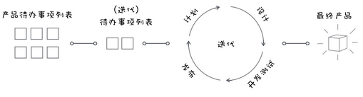

基于软件过程，我们有了角色分工，有了对过程的管理和工具，对过程中每个阶段细分的方法学和工具。

`软件工程 = 过程 + 方法 + 工具。`

软件工程的核心，就是围绕软件项目开发，对开发过程的组织，对方法的运用，对工具的使用。

## 02 | 工程思维：把每件事都当作一个项目来推进

解决问题的方式，可以参考软件生命周期和瀑布模型，把一件事情分成几个阶段：`分析、设计、实施、测试、完成`，然后制定相应的计划。这种方法不仅非常有效，还能让做事效率大幅提高，而且能够更全面地、站在更高的角度去思考。

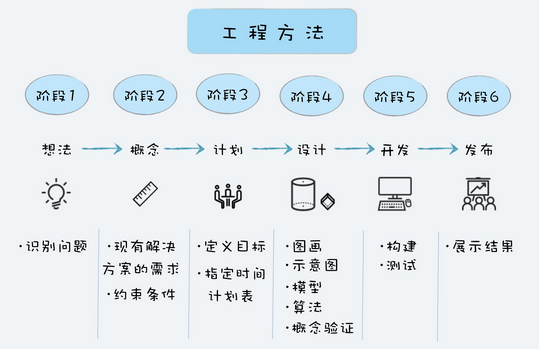

工程方法通常会分成六个阶段：`想法、概念、计划、设计、开发和发布`。

- 想法：想法阶段通常是想要解决问题。最开始问题通常是模糊的，所以需要清晰地定义好问题，研究其可行性，检查是否有可行的解决方案。
- 概念：概念阶段就是用图纸、草图、模型等方式，提出一些概念性的解决方案。这些方案可能有多个，最终会确定一个解决方案。
- 计划：计划阶段是关于如何实施的计划，通常会包含人员、任务、任务持续时间、任务的依赖关系，以及完成项目所需要的预算。
- 设计：设计阶段就是要针对产品需求，将解决方案进一步细化，设计整体架构和划分功能模块，作为分工合作和开发实施的一个依据和参考。
- 开发：开发阶段就是根据设计方案，将解决方案构建实施。开发阶段通常是一个迭代的过程，这个阶段通常会有构建、测试、调试和重新设计的迭代。
- 发布：将最终结果包括文档发布。

每个项目成员，如果能多站在项目的角度去考虑，那么这样不仅对项目有利，更对自己有好处。

`工程思维，本质上是一种思考问题的方式，在解决日常遇到的问题时，尝试从一个项目的角度去看待问题、尝试用工程方法去解决问题、站在一个整体而不是局部的角度去看问题。`

你不需要现在是一个项目经理或者管理者，也一样可以在日常生活中应用“工程思维”。比如作者[记录下两个孩子在 MineCraft 里面还原公寓的经历](https://zhuanlan.zhihu.com/p/21314651)

## 03 | 瀑布模型：像工厂流水线一样把软件开发分层化

布模型算是现代软件工程的起源，软件工程的发展，很大部分都是构建于瀑布模型的基础之上的。

瀑布模型的诞生

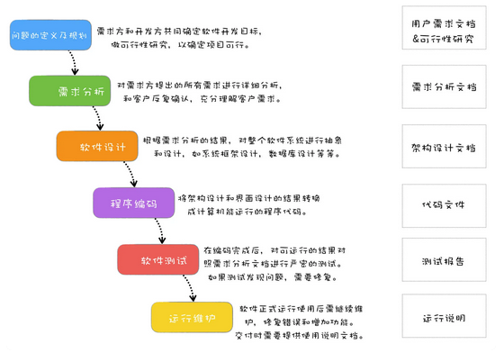

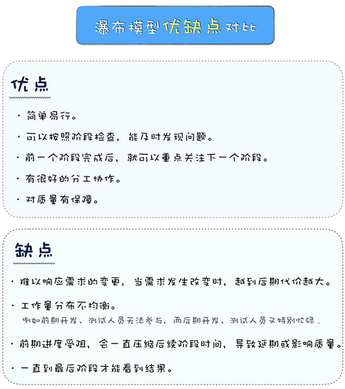

## 04 | 瀑布模型之外，还有哪些开发模型？

### 还有哪些开发模型？

- 快速开发快速改
  - `快速原型模型` - `着重解决客户的需求不明确和需求多变的问题。`原型模型因为能快速修改，所以能快速对用户的反馈和变更作出响应，同时原型模型注重和客户的沟通，所以最终开发出来的软件能够真正反映用户的需求。但这种快速原型开发往往是以`牺牲质量`为代价的。针对原型模型的这种快速、低质量的特点，通常有两种处理策略：`抛弃策略`和`附加策略`。
- 大瀑布拆小瀑布
  - 增量模型——按模块分批次交付。`如果系统不能模块化，那么将很难采用增量模型的模式来开发。`另外，对模块的划分很抽象，这本身对于系统架构的水平是要求很高的。基于这样的特点，增量模型主要适用于：`需求比较清楚，能模块化的软件系统，并且可以按模块分批次交付。`
  - 迭代模型——每次迭代都有一个可用的版本。在一个迭代中都会包括需求分析、设计、实现和测试，类似于一个小瀑布模型。迭代结束时要完成一个可以运行的交付版本。
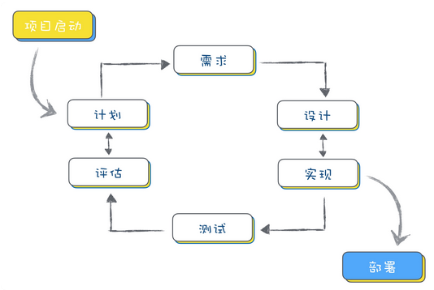
  - 增量模型是按照功能模块来拆分；而迭代模型则是按照时间来拆分，看单位时间内能完成多少功能。迭代模型最难的部分，在于规划每次迭代的内容和要达到的目标。

### 该选择什么过程模型？

`场景一：外包项目，需要阶段验收`
假如你现在是一家外包公司，你可以`采用瀑布模型`开发，但是甲方需要对你项目的每个阶段进行验收测试，以确认你是不是达到要求。

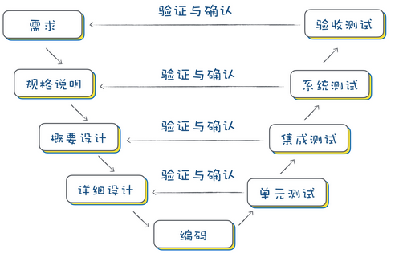

`场景二：项目风险高，随时可能会中断`

这种情况，`基于增量模型或者迭代模型进行开发`，就可以有效降低风险。你需要注意的是，在`每次交付的时候，要同时做一个风险评估`，如果风险过大就不继续后续开发了，及时止损。

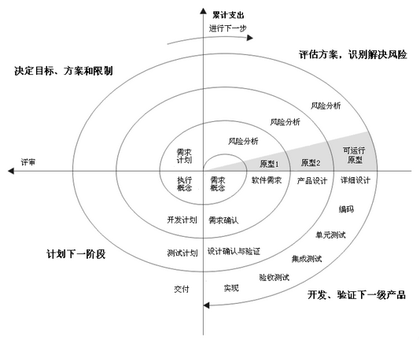

`场景三：山寨一款软件产品，希望能快速上线发布`

其实软件行业山寨的案例不少，山寨项目的特点是，项目需求是明确的，不会有什么变化，这时候就可以`选择增量模型`，划分好模块，先实现核心模块，发布可运行版本，再增量发布其他模块。多模块可以同步开发。

`场景四：客户都没想清楚想要什么，但是个大单子`

很多项目，客户一开始都没想清楚想要的是什么，`需要花很长时间去分析定义需求，但是单子很大，值得认真去做好。`(这个时候快速原型模式是不适合的)

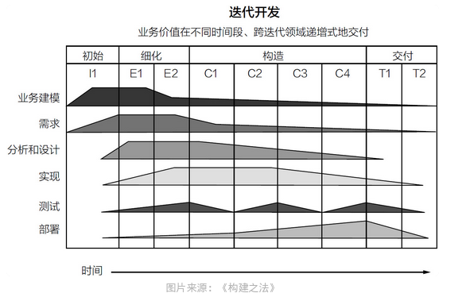

`场景五：我的产品已经上线，但是需要持续更新维护`

在这种情况下，`迭代模型`是比较合适的。固定时间周期，在固定的周期内选择适合的需求开发任务和 Bug 修复任务去完成，按时发布。
另外还可以尝试敏捷开发，也是基于迭代的开发模型，它也强调快速交付，每次交付系统的部分功能，来保证客户满意度。在敏捷开发中，系统交付的周期称之为冲刺（Sprint）。

## 05 | 敏捷开发到底是想解决什么问题？

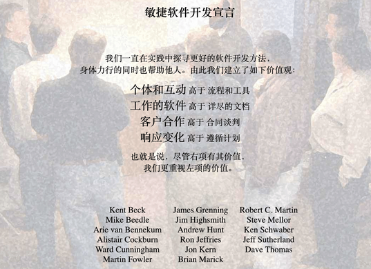

敏捷不是一种方法论，也不是一种软件开发的具体方法，更不是一个框架或过程，而是一套价值观和原则。

各种敏捷框架、方法论和工具，就像是“术”，告诉你敏捷开发的方式，而敏捷则是“道”，是一套价值观和原则，指导你在软件项目开发中做决策。

也就是说，`当你开发做决策的时候，遵守了敏捷开发的价值观和原则，不管你是不是用 Scrum 或者极限编程，那么都可以算是敏捷开发。`

`瀑布模型的典型问题就是周期长、发布烦、变更难，敏捷开发就是快速迭代、持续集成、拥抱变化。`

### 如果用敏捷的方式盖房子

如果改成用敏捷开发的模式盖房子，则会是这样子的：

- 客户想要盖一栋房子（`初步的想法`）。
- 产品经理和客户进行了初步的沟通，把用户的需求写成了一个个用户故事（`用简单的用户故事代替繁重的需求文档`），例如：
  - 作为一个上班族，我想要一个卧室，以便于休息；
  - 作为一个家庭主妇，我想要一个厨房，以便于做饭。
- 施工人员根据用户故事和客户进一步沟通（`客户合作高于合同谈判`），然后对用户故事进行设计和实现；
- 每个用户故事开发时，还要给一个测试机器人编写测试脚本，让机器人可以自动测试（`大量采用自动化测试`），并且做好的用户故事可以随时被测试验收（`随时发布，持续集成`）；
- 每个 Sprint 四个星期时间（`时间盒子，迭代时间固定`）；
- 第一个 Sprint 搭了个草棚，一张床就是卧室，厕所就挖了一个坑，厨房还来不及搭建（`每个 Sprint 会选择高优先级的用户故事`），屋顶还在漏水（`每个 Sprint 会定期发布，客户可以随时看到可用版本，即使还不完整`）；
- 第二个 Sprint 有了简易厨房，同时修复了屋顶漏水的毛病（`每个 Sprint 不仅完成用户故事，还会修复 Bug`）；
- 第三个 Sprint 升级成了小木屋，但是忘记加上窗户（敏捷推崇自动化测试，但可能会测试不完备）；
- 第四个 Sprint 升级成了砖瓦房，窗户也开好了，客户可以入住。但是这时候客户发现一家三口的话，完全不够用，需要扩建到 3 个卧室。于是决定下个迭代改成 3 个卧室（`响应变化高于遵循计划`）；
- 第五个 Sprint，升级成了 3 个卧室，升级过程中把厨房下水道弄坏了（`迭代过程中可能会导致质量不稳定`）；
- 第六个 Sprint，修复了下水道的问题，房子也装修好了（`迭代中不断完善`）；
- 客户验收使用（`上线`）。

用敏捷开发的方式，不再像瀑布模型那样有严格的阶段划分，会在迭代中不断完善；不再写很多文档，而是和客户一起紧密合作；不再抵制需求变更，而是即时响应变更；不再等到测试阶段才发布，而是随时发布，客户随时可以看到东西。

当然，采用敏捷开发的模式也存在一些问题，例如全程需要客户参与，由于测试相对少一些 ，问题也会相应多一些。

### 敏捷开发和瀑布模型的差异

1. 敏捷开发是怎么做需求分析的？
    - 瀑布模型的一个重要阶段就是需求分析，要有严谨的需求分析，产生详尽的需求分析文档。而敏捷开发的需求，主要是来源于一个个小的用户故事，用户故事通常是写在卡片上的一句话，在 Sprint 的开发中，再去确认需求的细节。
2. 敏捷开发是怎么做架构设计的？
    - 瀑布模型在需求分析完了以后，就需要根据需求做架构设计。而在敏捷开发中，并不是基于完整的用户需求开发，每个 Sprint 只做一部分需求，所以是一种渐进式的架构设计，当前 Sprint 只做适合当前需求的架构设计。
    - 这种渐进式的架构设计，迭代次数一多，就会出现架构满足不了需求的现象，产生不少冗余代码，通常我们叫它技术债务，需要定期对系统架构进行重构。
3. 敏捷开发怎么保证项目质量？
    - 瀑布模型在编码完成后，会有专门的阶段进行测试，以保证质量。在敏捷开发的 Sprint 中，并没有专门的测试阶段，这就依赖于开发功能的同时，要编写单元测试和集成测试代码，用自动化的方式辅助完成测试。
    - 相对来说，这种以自动化测试为主的方式，质量确实是要有些影响的。
4. 敏捷开发是怎么发布部署的？
    - 瀑布模型通常在编码结束后，开始部署测试环境，然后在测试阶段定期部署测试环境。测试验收通过后，发布部署到生产环境。
    - 在敏捷开发中，使用持续构建、持续发布
5. 敏捷开发的 Sprint 和迭代模型的迭代有什么区别？
    - 我们假设有两个团队，都要实现一个简单的用户系统，一个团队用迭代模型，一个团队用敏捷开发（Scrum），一个迭代 /Sprint 的时间周期都是 2 周（10 个工作日）。
    - 迭代模型所在的团队，产品经理会先花 2 天时间去分析需求，写成需求分析文档，架构师会花 3 天时间来做设计，程序员会花 3 天时间编码，测试再花 2 天时间去测试，最后上线用户系统。
    - 再看敏捷开发的团队，Product Owner（类似于产品经理）会把需求拆分成了几个简单的用户故事：用户登录、用户注册、找回密码、修改资料，然后放到当前 Sprint 的 Backlog（任务清单），Team（开发团队）成员开始从 Backlog 选择用户故事。
    - 在敏捷开发中，通常用“用户故事”这样的方式来代替传统的需求分析，也就是以用户故事的形式，对一个需求进行简单的描述，配合关键的测试用例，并且和需求方的紧密沟通，让开发人员可以理清楚需求；通过“只做刚刚好的设计”来节约设计上的时间；通过“自动化测试”、“持续集成”来提升测试效率。
    - 相对来说，敏捷开发中，整个 Sprint 的节奏是比较恒定，产品也是相对稳定的，即使用户故事没有完成，也不影响版本的发布。因此，敏捷开发更注重软件开发中人的作用，需要团队成员以及客户之间的紧密协作。

敏捷开发也需要满足一些条件才能用好，例如：

- 团队要小，人数超过一定规模就要分拆；
- 团队成员之间要紧密协作，客户也要自始至终深度配合；
- 领导们的支持。敏捷需要扁平化的组织结构，更少的控制，更多的发挥项目组成员的主动性；
- 写代码时要有一定比例的自动化测试代码，要花时间搭建好源码管理和持续集成环境。

## 06 | 大厂都在用哪些敏捷方法？（上）

其实大厂做项目也没有什么特别的，无非就是工程中常见的“分而治之”的策略：`大项目拆成小项目，大服务拆成小服务，大团队拆成小团队。`

服务之间通过商定好的标准协议进行通信，架构上将大的服务拆分隔离成微服务，大团队按照业务或者服务拆分成小组，按照一定的流程规范保障协作。最终，各个小组要负责的内容其实就不多了。

### 一切工作任务围绕 Ticket 开展

早些年的项目开发，都是围绕着项目计划开展的，把甘特图打印贴在墙上，方便团队成员看项目进展到什么地步了。自从敏捷化后，开始变成了看板。

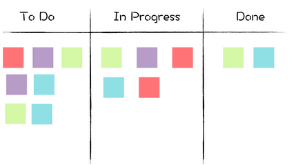

### 基于 Git 和 CI 的开发流程

如果你的团队应用瀑布模型来开发，大概会有两大烦恼：`代码不稳定和部署太麻烦。`

解决代码不稳定：`代码审查（Code Review）和自动化测试`

每次要往 master 添加内容，不是直接提交代码到 master，而是先基于当前稳定的 master，克隆一个 branch（分支）出来，基于 branch 去开发，开发完成后提交一个 PR（Pull Request，合并请求）。PR 提交后，就可以清楚的看出来代码做了哪些改动，其他人就可以针对每一行代码写评论提出修改意见。如果确认代码没问题了，就可以通过代码审查。

自动化测试的问题。就该 CI （持续集成）出场了。如果你不了解 CI 是什么，可以把它想象成一个机器人，每次你提交一个 PR（严格来说是 Commit，这里略作简化）到源代码服务器，这个机器人马上就知道了。然后它创建一个干净的运行环境，运行你的所有测试代码，运行完后，把测试结果报告给你。
可参考，《[Git 工作流程](http://www.ruanyifeng.com/blog/2015/12/git-workflow.html)》《[持续集成是什么？](http://www.ruanyifeng.com/blog/2015/09/continuous-integration.html)》

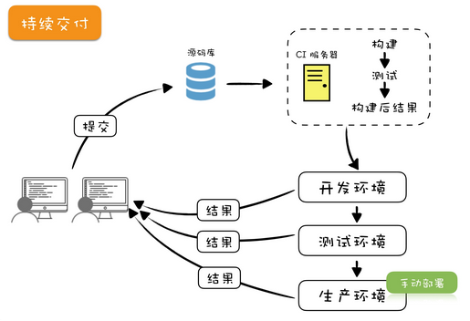

在这里以一个开发任务为例，大致讲解一下应用敏捷开发方法的基本开发流程：

- 把要开发的 Ticket 从“To Do”栏移动到“In Progress”栏；
- 从主干（master）创建一个分支（branch），基于分支去开发功能或修复 Bug；
- 编写实现代码和测试代码（单元测试和集成测试），是不是测试驱动不重要，看个人偏好或团队要求；持续提交代码更新到分支，直到完成；
- 创建 PR（Pull Request，合并请求），邀请其他人帮忙 Review 代码，根据 Review 的结果，可能还需要更新几次；
- CI 在每一次提交代码到代码库后都会自动运行，运行后主要做这些工作：
    – 检查代码格式是不是符合规范；
    – 运行单元测试代码；
    – 运行集成测试。
- 最终这些检查都完成后，CI 会把执行结果显示在 PR 上。通常绿色表示通过，红色表示失败；
- PR 能合并需要满足两个条件：CI 变绿 + 代码 Review 通过；
- PR 合并后，CI 会自动构建 Docker Image，将 Image 部署到开发环境；
- 将相应的 Ticket 从看板上的“In Progress”栏移动到“Done”栏。

正常来讲，你是需要严格遵守开发流程的，但偶尔肯定也有紧急任务，来不及写测试代码，这种情况下，一定要再创建一条 Ticket 跟踪，以确保后续完成测试代码。

### 部署上线流程

以前是运维人员按照文档部署，现在已经变成了 DevOps 写自动化部署工具，然后开发人员自己去部署生产环境。
现在大厂的部署也都实现了自动化，但是流程上还是有一些控制。

- 首先，部署的不再是程序代码，而是 Docker 的 Image，每次代码合并后 CI 都会自动生成新的 Image，测试也是基于 Image 测试。
- 部署生产环境之前，先在内部的测试环境充分测试。
- 部署生产环境前，需要审批确认，有 Ticket 跟踪。
- 部署时，先部署一部分，监测正常后再全量部署。
- 整个过程都有监控报警，出现问题及时回滚。

### 每日站立会议

是不是站着开会其实不重要，重点是要高效沟通反馈。

开会都干什么呢？主要有三个话题：

1. 成员轮流发言
每个人轮流介绍一下，昨天干了什么事情，今天计划做什么事情，工作上有没有障碍无法推进。
要注意的是，这过程中很容易偏离主题,这时候会议主持者要及时打断，记录到“`问题停车场`”，让下一个人继续，先保证大家能高效完成这一环节。
2. 检查最新的 Ticket
3. 停车场问题
能在会议时间内解决的问题，就马上解决，不能解决的会后再私下讨论或者再组织会议。

## 07 | 大厂都在用哪些敏捷方法？（下）

### 一个应用敏捷开发的小组日常

这个小组是做网站开发的，基于微服务负责网站的某一个小模块。标准配置 7 人左右，4 个程序员（至少有一个资深程序员，有架构能力），1 个产品经理（Scrum 里面叫 Product Owner），1 个测试，1 个项目经理（Scrum 里面叫 Scrum Master）。主要负责网站某模块的日常维护。

在分工上：

- 产品经理：写需求设计文档，将需求整理成 Ticket，随时和项目成员沟通确认需求；
- 开发人员：每天从看板上按照优先级从高到低领取 Ticket，完成日常开发任务；
- 测试人员：测试已经部署到测试环境的程序，如果发现 Bug，提交 Ticket；
- 项目经理：保障日常工作流程正常执行，让团队成员可以专注工作，提供必要的帮助，解决问题。

### 如何完成需求和修复 Bug？

围绕 Ticket 来开展

### 每周一部署生产环境

部署很简单，按照流程执行几个命令就可以完成生产环境部署。部署完成后，需要对线上监控的图表进行观察，如果有问题需要及时甄别，必要的话对部署进行回滚操作。但`轻易不会打补丁马上重新上线，因为仓促之间的修复可能会导致更大的问题。`

### 每周二开迭代回顾会议，总结上个 Sprint

每周二的早上，这个小组一般还会预留一个小时的时间，因为常规的站会完成后，还有一个`迭代回顾会议 (Sprint Retrospective)` 会议，目的是回顾一下在迭代中，团队有哪些做的好的地方，有哪些做的不好的地方。对于需要后续改进的，需要创建相应的 Ticket，加入到 Backlog 中，在后续迭代中改进完善。

如果会议中要形成涉及项目的决策，最好是通过集体表决的方式决策，尽可能避免独裁式决策。因为敏捷的原则之一是要`善于激励项目人员，给他们以所需要的环境和支持，并相信他们能够完成任务。`

### 每周四迭代规划会，计划下周工作

每周四早上，也需要一个小时来组织会议。因为常规站会完成后，还有一个`迭代规划会（Sprint Planning Meeting）`。这个会议是要大家一起讨论下一个 Sprint 的内容。

在开会之前，产品经理和项目经理会商量好 Ticket 的优先级。

团队每个成员都要对候选的下个 Sprint Backlog 中的 Ticket 从 1-5 分进行打分，1 分表示容易 1 天以内可以完成的工作量，2 分表示 2 天内可以完成的工作，5 分表示非常复杂，需要 5 天以上的工作量。这里需要注意，打分时，要大家一起亮分，而不是挨个表态，不然结果很容易被前面亮分的人影响。

`评估每条 Ticket 工作量的大概流程如下`：

- 会议组织者阅读一条 Ticket，可能是用户故事，可能是 Bug，可能是优化任务。同时会询问大家对内容有没有疑问。
- 大家一起讨论这个 Ticket，确保充分理解这个 Ticket。
- 每个团队成员在心中对 Ticket 进行工作量估算。
- 会议组织者确认大家是否都已经确定估算结果，确认后，开始倒数：“3，2，1”，大家一起伸出一只手，亮出代表分数的手指头。
- 如果估算结果存在分歧，出分最高的和最低的各自说明理由，讨论后达成一致。

这种估算工作量的方法有个名字叫估算扑克，因为亮分时用扑克牌亮分而得名，但并非一定要用扑克牌。

`用这种方式评估工作量有几点很明显的好处`：

- 大家积极参与，详细了解需求。
- 工作量是由实际参与开发的成员作出评估，往往更准确也更容易被接受。
- 促进成员的交流和经验分享。

### 每周五分支切割

周五标志着一周的工作要结束了，所以下班之前（4 点左右），要做 branch cut（分支切割），也就是要把当前主干上的代码，克隆到一个分支（branch）上。

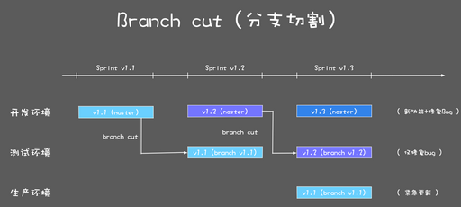

### 每周轮值

小组里面除了日常开发工作以外，其实还有不少琐碎的事情，比如每周部署生产环境，每天部署测试环境，每周的 branch cut（分支切割），回答其他小组的问题，主持每日会议（不一定需要项目经理），这些事情如果都是一个人做难免会有些枯燥。

在敏捷开发中，鼓励发挥每个成员的主动性，所以每周轮值是一个不错的方式，可以让每个人都有机会去体验一下，帮助团队完成这些事情，更有集体荣誉感和责任感。

### 一些问题解答

1. 基于这种敏捷开发的方式加班多吗？
其实加不加班，绝大部分时候和是不是敏捷开发没关系的，还是看项目组的情况。
2. 一周一个迭代怎么保证质量？
自动化测试 + 人工测试。
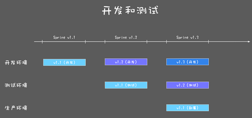
虽然是 1 周的 Sprint，但是其实还有 1 周的时间进行测试。每个 Sprint 不仅开发新功能，还要同步修复以前版本的 Bug。
这样基本上可以保证有好的质量。而且这种 1 周的迭代，可以保持每周都有内容更新，还有个好处就是每周更新的内容不多，出现问题的话，很容易就定位到是什么地方导致的问题。
3. 基于敏捷开发如何做计划？
至于工期的估算，在迭代规划会上会对每个 Ticket 进行打分，根据分数可以预估有多少工作量，要花多少时间。
4. 如何沟通协作？
    - 每天站立会议
    - Ticket 的形式

## 08 | 怎样平衡软件质量与时间成本范围的关系？

日常项目中涉及`时间、成本和范围`的问题，都离不开“`软件项目管理金三角`”的概念。

在现实生活中，我们都知道，做产品想“多、快、好、省”都占着，是不可能的，最多只能选两样。

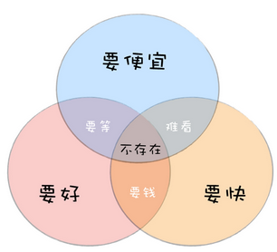

而在软件项目中，也有一个类似的平衡关系，就是软件质量（产品的质量，客户的满意度）与范围（需要实现多少功能）、时间（多久可以完成）、成本（花多少钱）四个要素之间的平衡。

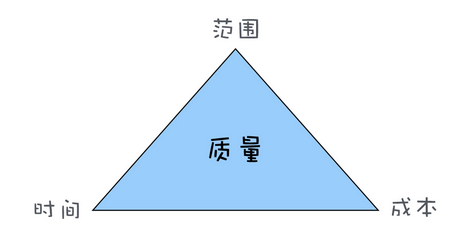

为什么四个要素，是“质量”放在三角形的中间？因为`软件工程的目标就是要构建和维护高质量的软件`，所以项目的质量是高于一切的。

### 如何应用“管理金三角”做决策？

`项目管理其实就是项目中一系列问题的平衡和妥协`

- 老板要压缩项目时间怎么办？
先用“金三角”知识分析了一下：老板希望时间是 1 个月，也就是说时间这条边被缩短了，那么结果就是会影响到另两条边：范围和成本，如果另外两条边可以调整，也不是不可以。
于是再遇到这种问题，我就换了一种方式跟老板沟通：“一个月也不是不行，就是我们的需求调整一下，第一个版本只能做一些核心功能，剩下的后面版本再加上（`调整范围`）。另外还得给我加两人，不然真做不完！（`增加成本`）”
- 产品经理要临时加需求怎么办？
增加需求，也就是范围这条边要增加，那就必然对成本和时间这两条边造成影响，要么延期，要么增加成本。

### 瀑布模型和敏捷开发如何平衡时间成本范围的关系？

瀑布模型有严格的阶段划分，有需求分析、系统设计、开发和测试等阶段，通常在开发过程中不接受需求变更，也就是说，我们可以认为`瀑布模型的范围是固定的，其他两条边时间和成本是变量。`

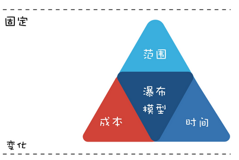

`在敏捷开发中，时间和成本两条边是固定，就只有范围这条边是变量。`

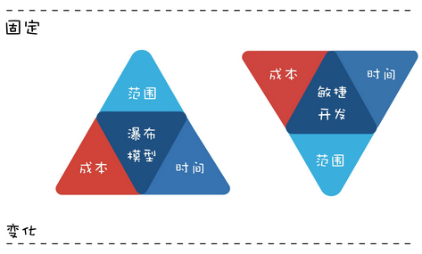

### 如何平衡好软件质量与时间成本范围的关系？

`从时间、成本和范围这三条边中找出来固定的一条或者两条边，再去调整另一条边。`

1. 淘宝网站第一个版本是怎么做到一个月上线的？
先应用“金三角”分析一下：时间这条边被固定了，只能一个月；功能也不能少，范围这条边也限制住了，那就只能在成本上想办法了。要么一下子雇很多牛人，要么直接买一个现成的电子商务网站，然后修改。
2. 极限编程是怎么做到“极限”的？
极限编程的“极限”（Extreme），意思就是如果某个实践好，就将其做到极限。
    - 比如：如果做测试好，就让每个开发人员都做测试 ;
    - 如果集成测试重要，就每天都做几次测试和集成 ;
    - 如果简单的就是好，那么我们就尽可能的选择简单的方法实现系统功能 ;
    - ……
  极限编程的“极限”理念，产生了很多优秀的实践方法，例如持续集成、自动化测试、重构等。
3. MVP 模式是怎么诞生的？
这些年流行的 MVP（minimum viable product，最小化的可行性产品）模式，是一种快速推出产品的模式：一开始只推出最核心的功能，满足用户最核心的需求，然后在用户的使用过程中收集反馈，进一步升级迭代。
这种模式怎么诞生的呢？还是应用“金三角”理论，要快速推出产品，还想成本不用太高，那就意味着时间和成本这两条边是固定的，剩下范围这个变量。

# 项目规划篇

## 09 | 为什么软件工程项目普遍不重视可行性分析？

### 可行性研究主要从哪几个方面进行？

1. 经济可行性；
2. 技术可行性；
3. 社会可行性(也就是法律方面的可行性)

### 为什么软件项目很少做可行性研究？

1. “因为我们是软件项目，所以我们很特殊。”
   - "我们很特殊”，不能成为不做可行性分析的借口，可能项目需求最开始是模糊不清的，还不具备可行性研究的条件，那么等到项目有了一定的进展，需求逐步明确后，要继续对可行性做研究。
   - 如果发现方案不具备可行性，也应及时调整方案或停止项目以止损。

2. “老板拍板的项目，明知道不可行也得硬着头皮干呀！”
    - 第一种情况，多半是由于老板或者项目负责人控制决策权，且对于不同意见容忍度较低。底下人不敢提不同意见，明知道不对也只能执行。
    - 第二种情况，老板或者项目负责人能接触到的信息更多、更全面，同时还有战略上的一些考虑，所以下面执行的人觉得不靠谱，并不代表真的不靠谱。
3. “软件项目是鼓励创新、鼓励试错的，可行性研究会阻碍创新！”
    - 实际上可行性研究和创新从来就不是矛盾的，它反而可以帮助你提前过滤掉那些不靠谱的创新想法，提前发现可能的风险。

### 如何做好可行性研究？

当你决定要做可行性研究，你就已经成功一半了，怎么做反而是相对简单的部分！

通常从三个方面着手做：

- `经济可行性。` 从成本和收益角度分析，看投入产出比。不仅要分析短期利益，还要分析长期利益，看是不是值得做。
- `技术可行性。` 软件项目最终是需要人通过技术来实现的，所以要分析技术上是不是可行，如果有技术上解决不了的问题又能否规避。
- `社会可行性。` 社会可行性涉及法律、道德、社会影响等社会因素。比如，触犯国家法律的事情肯定不能做；产品如若不符合道德标准，可能带来较大的社会负面影响，那么也要慎重考虑。

### 总结

- 可行性研究是项目启动前很关键的一步，可能最早帮你发现风险，甚至避免损失，千万要重视起来。
- 如果可行性研究并不能给你一个很明确的结果，也可以考虑小范围试点，先实现一个最小化可行产品，等验证了可行性，再逐步加大投入。

## 10 | 如果你想技术转管理，先来试试管好一个项目

### 技术人员转型管理的障碍是什么？

程序员总是想着如何技术实现、用什么语言框架、怎么提高效率……要钻研技术，这些是非常好的优点，但是要转管理，这反而会是一种障碍。
`因为管理，最重要的一点就是大局观，要能从整个项目的角度，从整个团队的角度去思考，去确定方向，去发现问题，对问题及时解决及时调整。`

就像有人说的：

- 关注细节的，是工程师；
- 关注过程的，是项目经理；
- 关注结果的，是老板。

所以，如果你要技术转管理，可以先从管好一个项目开始。

### 怎么样去管理一个软件项目？

- 怎样管好软件项目中的人？
  - 管理好客户的预期
  - 用流程和规范让项目成员一起紧密协作
    - 好的项目管理，不需要直接去管人，而是管理好流程规范；项目成员不需要按照项目经理的指令做事，而是遵循流程规范。
- 怎样管好软件项目中的事？
  - 选择适合项目的开发模式
  - 制定好项目计划
  - 对计划进行跟踪和控制，同时做好风险管理

管好人、管好事，你就能管好软件项目。

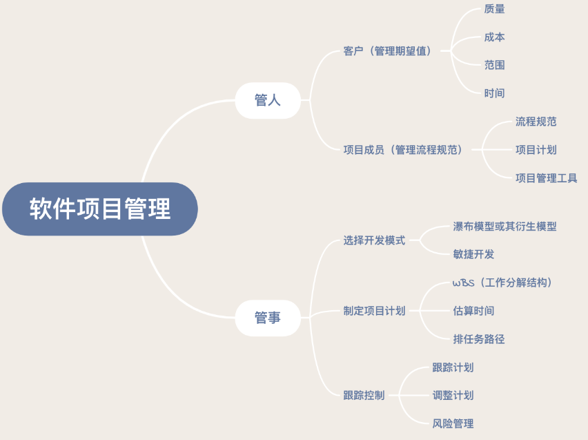

### 技术转管理的一些经验教训分享

- 控制你想写代码的冲动
- 团队的成功，才是你的成功
- 形成自己的管理风格
- 坚持就是胜利

## 11 | 项目计划：代码未动，计划先行

`如果没有计划，你的项目可能会陷入一种无序和混乱中。`

### 做技术的就不用关心计划吗？

在专栏中常说你要有大局观，不要将自己局限在程序员的身份中。试着做计划就是一个非常好的培养大局观的方式。比如说，你在制定计划的过程中，需要去综合考虑各种因素：有哪些任务要做，可能存在什么风险，任务之间的依赖关系是什么，等等。
参与做计划的过程，可以让你对项目的各种事情了然于胸，这就相当于扩大了你的上下文，让你有更高的视角看待当前工作遇到的问题。

很多人都有一些目标：要转型，要写业余项目，然而很多目标都无疾而终了。`光有目标还不够，必须得要付诸行动。而要行动，就需要对目标进行分解，进而变成可以执行的计划。`

### 如何制定计划？

- 第一步：任务分解
  - 就是把要做的事情，按照一个树形结构去组织，逐级分解，分割成小而具体的可交付结果，直到不能再拆分为止。
- 第二步：估算时间
  - 最好由项目经理和开发人员一起估算出来
  - 如果双方估算有偏差，要有良好的沟通
  - 提问可以帮助双方搞清楚真实的情况是什么样的，而且也不会招致反感。同时项目经理还可以给予一些建议和支持。
- 第三步：排路径
  - 排路径就是要根据任务之间的关系，资源的占用情况，排出合适的顺序.例如：
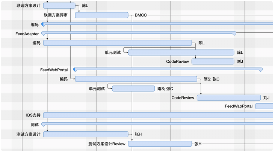

### 设置里程碑

里程碑的设置，并没有特别的规则，可以是项目生命周期的特定主要时间，也可以是一些关键的时间点。

### 计划需要跟踪和调整

项目管理中，并不是计划制定好了就完事了，还需要跟踪和调整。
跟踪进度的方式主要有两种:

- 项目经理定期收集跟踪(会有一个沟通确认的过程，对进度会了解的更准确)
- 项目成员主动汇报(可以减少项目经理的收集工作，但有可能不准确。)

在这方面，敏捷开发的两个实践特别值得借鉴和推广。

- 每日站立会议
- 看板,通过看板，可以非常直观的看到每个人在干什么，进展如何。

## 12 | 流程和规范：红绿灯不是约束，而是用来提高效率

### 为什么要有流程规范？

- 提升团队效率
  - 从个体来看，因为流程规范的存在，确实可能存在效率降低的情况，但从团队的角度来看，好的流程规范反而是提升效率的。
- 将好的实践标准化流程化，让大家可以共享经验
- 借助流程规范，让项目管理从人治到“法治”

### 如何制定好流程规范？

制定流程规范的四个步骤

1. 明确要解决的问题
2. 提出解决方案
    - 在提出解决方案，制定开发流程时，可以参考借鉴软件工程中，大家公认的好的实践。比如说：
      - 敏捷开发的流程
      - 代码规范
      - 源代码管理流程
      - 部署流程

3. 达成共识，推广执行
4. 持续优化，不断改进

### 将流程规范工具化

应该尽可能借助技术手段来推动甚至替代流程规范。

- 代码规范,可以借助 XX_Lint 这种代码检查工具。
- CI (持续集成)

## 13 | 白天开会，加班写代码的节奏怎么破？

- `开会是有价值的`
- `开会是有成本的`

### 什么样的会议是有效率的？

每日站立会这样的会议更有效率，其时间短、人数少，所以成本低，创造的价值高于其成本。而人数多，又偏离会议主题的讨论会则没有价值.

### 如何提高开会效率？

`减少开会的成本，增加开会创造的价值！`

1. 砍掉一些没价值的会议
2. 减少参与会议的人
3. 缩短开会时间
4. 提升会议所创造的价值

## 14 | 项目管理工具：一切管理问题，都应思考能否通过工具解决

- `一个任务，只有 0% 和 100% 两种状态是准确的，中间状态都是不靠谱的。`

### 项目管理工具软件发展史

- 最初的项目管理软件：项目计划工具([MS Project](https://www.microsoft.com/zh-cn/microsoft-365/project/project-management-software))
- 基于 Ticket 的任务跟踪系统
- 基于看板的可视化任务管理

### 有哪些项目管理软件可以选择的？

如果单纯是项目计划工具，功能最好、最全的应该是微软的[MS Project](https://www.microsoft.com/zh-CN/microsoft-365/project/project-management-software/)，但遗憾的是只能运行在 Window 上，不支持 Mac 平台。如果要在 Mac 上使用项目计划工具，可选的有 [OmniPlan](https://www.omnigroup.com/omniplan) 和 [Merlin Project](https://www.projectwizards.net/en)。
而且这些项目计划工具，现在也都支持了看板视图。不过如果只是单机支持的话，意义并没有那么大，需要在线版的 Ticket 跟踪结合看板视图，才能让整个团队可以一起浏览操作，发挥其最大效用。
基于 Ticket 的任务跟踪系统，最有名的应该是Atlassian公司出品的 [Jira](https://www.atlassian.com/software/jira) 软件，功能全面，体验很好。Jira 主要是在海外比较流行，因为访问速度和使用习惯等原因，国内用户要相对少一些。
同类产品也很多，微软的[Azure DevOps](https://azure.microsoft.com/en-us/services/devops/server/) （以前叫 TFS, Team Foundation Server），和微软系的产品如 Visual Studio、Azure 可以很好的整合。

国内同类的软件有：

- [禅道](https://www.zentao.net/) ：为数不多提供开源版本可以自己搭建的；
- [Worktile](https://worktile.com/) ：集成了即时消息软件；
- [TAPD](https://www.tapd.cn/) ：腾讯出品，可以和腾讯的服务很好整合，例如企业微信和腾讯云；
- [云效](https://cn.aliyun.com/product/yunxiao) ：阿里巴巴出品，可以和阿里的服务很好整合，例如阿里云和钉钉；
- [DevCloud](https://www.huaweicloud.com/devcloud/) ：华为出品，和华为云有很好的整合。

## 15 | 风险管理：不能盲目乐观，凡事都应该有B计划

### 什么是风险管理？

风险是指不确定的事件，一旦发生，将会造成消极的影响。风险包含两个方面的内容：

- 发生后，会造成什么样的损失？
- 发生的概率有多大？

所以也有人认为：`风险 = 损失 x 发生概率`。

### 风险管理重要吗？

`对软件项目风险的管理，才是体现项目管理水平的地方`.我们对比下面几种应对风险的层次来看：

- 被动应对：风险已经发生，造成了问题才被动应对；
- 有备无患：事先制定好风险发生后的补救方案，但没有任何防范措施；
- 防患未然：对可能的风险做出防范，并把风险防范作为项目任务的一部分。

哪一种层次更体现项目管理水平，相信你心中已经有了答案。

### 如何做好风险管理？

1. 培养风险意识
    - `项目中的任务，不能盲目乐观，都思考一下它最坏的结果是什么，如果最坏的结果不能接受，就说明要有个 B 计划，考虑风险管理了。`
2. 管理风险
    - 第一步：风险识别，识别可能的风险
      - 识别风险这种事，经验很重要，因为大部分风险其实都是相似的。以前看 CSDN 总裁蒋涛发过一条微博，内容引发了很多人的共鸣，每一条无不应对着软件项目中的常见风险。10 个项目死亡的信号：
        - 第一版做太多功能 ;
        - 太依赖新技术平台；
        - 与公司另一个有份量的产品竞争；
        - 团队人手不足；
        - 复杂的问题，需要复杂的解法；
        - 成员开始隐藏进度落后的事实和原因；
        - 不断更改、增加的需求 ；
        - 2.0 症候群 - 非要更大、更强、更美 ；
        - 产品没有市场立足点；你根本无法解决的大问题。
      - 一个识别风险的方法叫检查表法，就是可以把类似于上面这些常见风险收集整理起来，分类列成清单，按照清单去检查对照。
      - 软件项目的风险主要分成以下几类：
        - 项目风险：项目预算、进度、用户和需求等方面的问题；
        - 人员风险：人员离职、人手不足等问题；
        - 技术风险：采用的技术所可能带来的风险；
        - 商业风险：与市场、产品策略等有关的商业风险。
    - 第二步：风险量化，对风险进行评估量化
      - 需要从两个方面去评估：
        - 发生的概率多大？
        - 发生后，后果多严重？
    - 第三步：应对计划，对风险制定应对策略
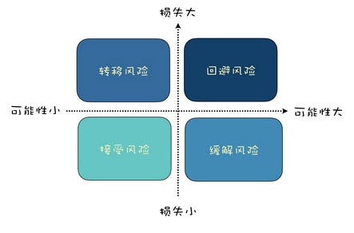
      - 回避风险——更改导致风险的方案
      - 转移风险——将损失转嫁出去
      - 缓解风险——降低风险发生概率或减少可能造成的损失
      - 接受风险——明知山有虎偏向虎山行
    - 第四步：风险监控，对风险进行监控预警

以上四个风险管理的步骤是一个连续循环的过程，在整个项目期间，都要持续地对风险进行识别，对风险量化，对于风险采取应对计划，对风险进行监控。
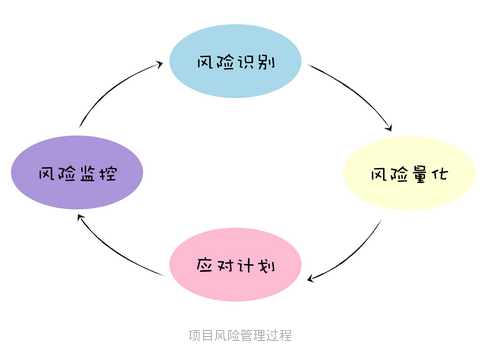

## 16 | 怎样才能写好项目文档？

以前看过一个投票，盘点程序员不喜欢的事，有两条和文档相关：

- 不喜欢写文档；
- 不喜欢项目文档太少。

看起来很矛盾，却很现实。基本上大家都认同：“项目文档很重要”，然而我们在项目中总是`短期高估文档的重要性，而长期低估文档的重要性`。

### 为什么要写文档？

- 帮助写文档的人理清楚思路
  - `先写文档，就会抛开代码细节，去站在全局思考`
- 便于未来的维护和交接
- 便于团队更好的协作沟通

### 如何写好文档？

1. 从模仿开始
2. 从小文档开始
3. 从粗到细，迭代更新
4. 一些基本的画图的技巧
    - 线框图
    - 流程图
    - 时序图
    - 各种格式截图

### 一些关于文档的其他建议

文档很重要，但是工作的软件高于详尽的文档。这里面的平衡很重要。

不需要为代码写很多文档，好的代码格式，良好的注释、完善的单元测试可以很大程度上代替针对代码而写的文档。

Markdown 是一种非常好的文档格式，可以让你更专注于内容上，而不是文档格式上面。

在线文档工具优于离线文档工具，在线文档有很好的版本管理，也更方便多人协作。

`重要的是，文档的写作一样需要多练习，写的越多，就越熟练。`
  
# 需求分析篇

## 17 | 需求分析到底要分析什么？怎么分析？

需求分析是要分析什么？

- 第一步：挖掘真实需求
- 第二步：提出解决方案
- 第三步：筛选和验证方案

而软件项目的用户需求，从来就不是单一的，而是一系列需求，所以对于软件项目的需求分析，还需要增加收集整理的步骤。整个过程是迭代进行的，如下所示：收集需求：

- 对用户需求进行收集整理；分析需求：
- 对需求进行分析，挖掘用户真实需求；
- 需求评估：筛选过滤掉不可行的需求；
  - 如果确定可行，还需要评估其优先级。评估优先级一个简单的方案就是用“紧急重要四象限”的方法来区分：
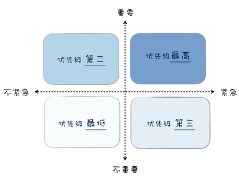
  - 复杂一点的有 KANO 模型，如下图所示。
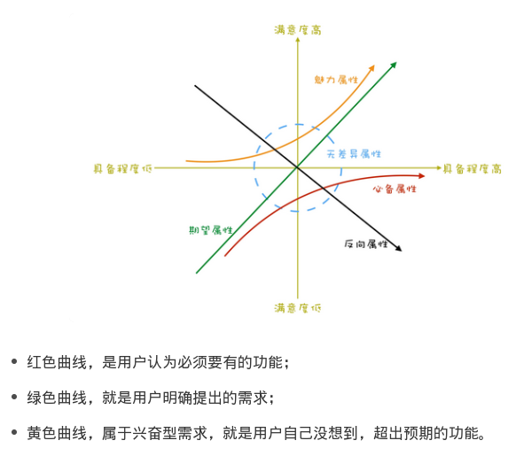
- 需求设计：针对用户需求提出解决方案，设计成产品方案；
- 验证需求：验证方案是否可行。

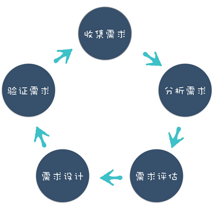

## 18 | 原型设计：如何用最小的代价完成产品特性？

原型设计，让产品经理可以用最小的代价完成产品特性，逐步成为产品经理确认需求、设计产品最重要的沟通工具。原型设计工具有很多可以选择的，建议从面向的平台、保真度、功能和价格等多方面因素综合考虑。
要做好原型设计，可以结合工程方法，分成四个阶段：分析、设计、实施和验证。

- 分析阶段，搞清楚用户的需求，原型设计的目标；
- 设计阶段，划分好产品的信息架构，设计好产品操作的流程；
- 实施阶段，按照设计的结果，对每个界面制作原型，并且将界面组织起来，让界面之间可以相互跳转；
- 验证阶段，和项目成员、客户进行确认，收集意见反馈，根据反馈进行修改。

如果你的项目还没有把原型设计作为确认需求、设计产品的沟通工具，可以考虑推广应用起来，不仅上手容易，而且可以帮你降低确认清楚需求的成本。
如果你打算做自己的产品，先不要着急动手写代码，不妨先做一个原型出来。

### 如何选择合适的原型设计工具？

原型设计工具，选择非常多。我建议你选择的时候，可以从几个维度考虑：

- 面向的平台：Web、桌面、手机；
- 保真度：中等保真度还是高保真度；
- 功能：是否满足你的要求；
- 成本：价钱是否可以接受。

这里推荐几款主要的原型设计工具，供参考。

- Axure RP：[Axure RP](https://www.axure.com/) 曾一度是原型设计工具的代名词，历史悠久功能强大，可以制作网站、桌面软件、移动 App 的原型。 缺点是专业度较高，价格高。
- 墨刀：[墨刀](https://modao.cc/) 是一款优秀的国产原型设计工具，可以制作网站、桌面软件、移动 App 的原型。上手相对容易，价钱也较 Axure 便宜很多。
- Adobe XD：[Adobe XD](https://www.adobe.com/cn/products/xd.html) 是 Adebe 出的一款设计兼原型设计工具，可以制作出高保真原型，对于设计师尤其容易上手。
- ProtoPie：[ProtoPie](https://www.protopie.io/) 是一款高保真原型设计工具，不需要编程基础，可以做出逼真强大的交互效果。
- Framer X：[Framer X](https://www.framer.com/pricing/)是一款高保真的原型设计工具，功能很强大，但是需要一定的编程基础，尤其适合程序员使用。

关于原型设计工具更多的资料，可以到“人人都是产品经理”网站的[原型设计分类](http://www.woshipm.com/category/rp)下，可以找到很多有价值的资料。

## 19 | 作为程序员，你应该有产品意识

程序员的价值

- 第一，你的价值体现在你所做的产品之上。
- 第二，你的价值体现在团队中的稀缺性。

### 什么是产品意识

- 商业意识
所谓商业意识，就是所做的产品是要有商业价值的。另一方面其实是成本，成本意识也是程序员容易忽视的。
- 用户意识
所谓用户意识，就是说做产品时，你要能挖掘出用户的真实需求，让产品有好的用户体验。这需要你要有同理心，能站在用户的角度去思考和体验产品。
- 数据意识
所谓数据意识，就是在产品设计、产品运营时，通过数据来发现问题、证实结果。

### 如何培养产品意识？

- 首先要解放思想解
放思想，其实就是说，对于程序员，不要总是单纯的用技术眼光看问题，也可以从产品的角度看问题。这两者有什么区别呢？
  - 技术思维会关注用什么技术，关注技术细节，关注功能“如何”实现；产品思维会关注用户体验，关注一个功能所创造的价值，会去思考为什么要或者不要一个功能。
- 然后要改变习惯
改变习惯是是指在日常使用产品、开发产品的时候，多站在产品的角度思考，去思考它的商业价值、用户体验、使用场景等等。
- 最后要多实践
你不妨在业余时间做个小应用程序，或者设计一个原型，做完了再找你的朋友试用一下，让他们提提意见。在做产品的过程中，你自然会去站在产品的角度去思考，这会让你对产品方面有更多感悟。

## 20 | 如何应对让人头疼的需求变更问题？

在需求变更这个事情上，没有赢家，每个人都是受害者。

两个常见的解决方案:

- 方案一：增强需求变更流程，让需求变更规范起来。
- 方案二：快速迭代，缩短版本周期。

为什么建筑工程中少有需求变更？

- 原因一：需求的确定性
- 原因二：需求变更的成本

### 如何解决需求变更问题？

- 提升需求确定性，来减少需求的变更。这种方案的优势就是对需求理解透彻，后期返工少，缺点是对产品经理的需求分析能力要求很高。
- 提高需求变更的成本，规范需求变更流程，减少需求变更。这种方案的优势就是可以马上起到效果，缺点就是过于繁琐的流程不利于项目协作。
- 降低响应需求变更的成本，积极应对需求变更。这种方案的优势在于可以快速响应需求变更，能快速试错尽快调整，缺点在于对软件架构和项目管理要求比较高。

# 相关链接

- [[软件工程之美（原文链接）](https://time.geekbang.org/column/intro/100023701?tab=catalog)]

---

- [上一级](README.md)
- 上一篇 -> [贪心算法](GreedyAlgorithms.md)
- 下一篇 -> [变量名的力量](ThePowerOfVariableName.md)
