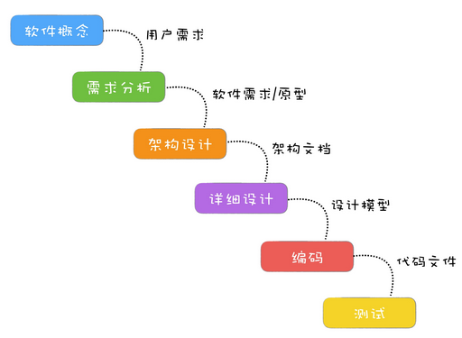

<!-- 极客时间 - 软件工程之美（宝玉）- 学习笔记 -->

<!-- @import "[TOC]" {cmd="toc" depthFrom=1 depthTo=6 orderedList=false} -->

<!-- code_chunk_output -->

- [课前必读](#课前必读)
  - [开篇词 | 你为什么应该学好软件工程？](#开篇词-你为什么应该学好软件工程)
- [基础理论](#基础理论)
  - [01 | 到底应该怎样理解软件工程？](#01-到底应该怎样理解软件工程)
  - [02 | 工程思维：把每件事都当作一个项目来推进](#02-工程思维把每件事都当作一个项目来推进)
  - [03 | 瀑布模型：像工厂流水线一样把软件开发分层化](#03-瀑布模型像工厂流水线一样把软件开发分层化)
  - [04 | 瀑布模型之外，还有哪些开发模型？](#04-瀑布模型之外还有哪些开发模型)
    - [还有哪些开发模型？](#还有哪些开发模型)
    - [该选择什么过程模型？](#该选择什么过程模型)
  - [05 | 敏捷开发到底是想解决什么问题？](#05-敏捷开发到底是想解决什么问题)
    - [如果用敏捷的方式盖房子](#如果用敏捷的方式盖房子)
    - [敏捷开发和瀑布模型的差异](#敏捷开发和瀑布模型的差异)
  - [06 | 大厂都在用哪些敏捷方法？（上）](#06-大厂都在用哪些敏捷方法上)
    - [一切工作任务围绕 Ticket 开展](#一切工作任务围绕-ticket-开展)
    - [基于 Git 和 CI 的开发流程](#基于-git-和-ci-的开发流程)
    - [部署上线流程](#部署上线流程)
    - [每日站立会议](#每日站立会议)
  - [07 | 大厂都在用哪些敏捷方法？（下）](#07-大厂都在用哪些敏捷方法下)
    - [一个应用敏捷开发的小组日常](#一个应用敏捷开发的小组日常)
    - [如何完成需求和修复 Bug？](#如何完成需求和修复-bug)
    - [每周一部署生产环境](#每周一部署生产环境)
    - [每周二开迭代回顾会议，总结上个 Sprint](#每周二开迭代回顾会议总结上个-sprint)
    - [每周四迭代规划会，计划下周工作](#每周四迭代规划会计划下周工作)
    - [每周五分支切割](#每周五分支切割)
    - [每周轮值](#每周轮值)
    - [一些问题解答](#一些问题解答)
  - [08 | 怎样平衡软件质量与时间成本范围的关系？](#08-怎样平衡软件质量与时间成本范围的关系)
    - [如何应用“管理金三角”做决策？](#如何应用管理金三角做决策)
    - [瀑布模型和敏捷开发如何平衡时间成本范围的关系？](#瀑布模型和敏捷开发如何平衡时间成本范围的关系)
    - [如何平衡好软件质量与时间成本范围的关系？](#如何平衡好软件质量与时间成本范围的关系)
- [相关链接](#相关链接)

<!-- /code_chunk_output -->

注：该文档为 [软件工程之美](https://time.geekbang.org/column/intro/100023701?tab=catalog) 学习笔记。

# 课前必读

## 开篇词 | 你为什么应该学好软件工程？

软件项目的开发其实是一个工程，整个开发过程是可以有效组织起来的；对于开发过程的各个阶段，已经有很多解决问题的最佳实践，有很多方法来帮助我们高效完成任务；我们还可以借助工具来协助管理，提升开发效率。

软件开发领域需要的主要知识不外乎：`数据结构、算法、面向对象思想、设计模式、软件工程`.

无论你是什么岗位，只要你从事软件开发相关领域，都绕不开“软件工程”，因为现代软件项目开发，多多少少都离不开软件工程知识的应用。

想象下在日常工作中，不管你用什么开发语言，不管是前端和后端：

- 你接到一个开发任务，如果想开发出客户想要的功能，你是不是先要做需求分析；
- 你接手一个复杂的、大的功能模块，是不是先要做设计，才能把复杂的拆成简单的，才能让大家一起分工去开发；
- 你完成一个功能模块，如果要保证质量，是不是需要写一些测试代码，还要做一些功能测试；
- 还有日常用的那些工具，像源代码管理、Bug 跟踪。

`技术更新迭代速度确实很快，难以把握，更难以预测，但是软件开发背后的逻辑却万变不离其宗。`
你只有掌握了这些逻辑，才能步步为营，不被快速发展的软件开发行业所淘汰。因为你脑袋里装有软件开发的战略，相对于赤手空拳、盲打莽撞的人来说，你更能在未来获得先机。

# 基础理论

## 01 | 到底应该怎样理解软件工程？

`有人参与、有计划、有步骤地造一件产品，我们通常称为“工程”。`

当软件的规模越来越大，复杂度不断增加，软件项目开发维护过程中的问题就逐步暴露出来：`软件产品质量低劣、软件维护工作量大、成本不断上升、进度不可控、程序人员无限度地增加。`

`软件工程，它是为研究和克服软件危机而生。就是要用工程化方法去规范软件开发，让项目可以按时完成、成本可控、质量有保证。`

开发软件本质上也是像盖房子一样，是从无到有创造的过程。工程化的方式，就是你分步骤（过程），采用科学的方法，借助工具来做产品。

于是参考建筑工程，整个软件开发过程也被分成了几个阶段：需求定义与分析、设计、实现、测试、交付和维护，这也就是我们常说的软件项目生命周期。

同时，也很自然就衍生出一套最基础的过程模型：瀑布模型。

后面又发展除了敏捷开发：

基于软件过程，我们有了角色分工，有了对过程的管理和工具，对过程中每个阶段细分的方法学和工具。

`软件工程 = 过程 + 方法 + 工具。`

软件工程的核心，就是围绕软件项目开发，对开发过程的组织，对方法的运用，对工具的使用。

## 02 | 工程思维：把每件事都当作一个项目来推进

解决问题的方式，可以参考软件生命周期和瀑布模型，把一件事情分成几个阶段：`分析、设计、实施、测试、完成`，然后制定相应的计划。这种方法不仅非常有效，还能让做事效率大幅提高，而且能够更全面地、站在更高的角度去思考。

工程方法通常会分成六个阶段：`想法、概念、计划、设计、开发和发布`。

- 想法：想法阶段通常是想要解决问题。最开始问题通常是模糊的，所以需要清晰地定义好问题，研究其可行性，检查是否有可行的解决方案。
- 概念：概念阶段就是用图纸、草图、模型等方式，提出一些概念性的解决方案。这些方案可能有多个，最终会确定一个解决方案。
- 计划：计划阶段是关于如何实施的计划，通常会包含人员、任务、任务持续时间、任务的依赖关系，以及完成项目所需要的预算。
- 设计：设计阶段就是要针对产品需求，将解决方案进一步细化，设计整体架构和划分功能模块，作为分工合作和开发实施的一个依据和参考。
- 开发：开发阶段就是根据设计方案，将解决方案构建实施。开发阶段通常是一个迭代的过程，这个阶段通常会有构建、测试、调试和重新设计的迭代。
- 发布：将最终结果包括文档发布。

每个项目成员，如果能多站在项目的角度去考虑，那么这样不仅对项目有利，更对自己有好处。

`工程思维，本质上是一种思考问题的方式，在解决日常遇到的问题时，尝试从一个项目的角度去看待问题、尝试用工程方法去解决问题、站在一个整体而不是局部的角度去看问题。`

你不需要现在是一个项目经理或者管理者，也一样可以在日常生活中应用“工程思维”。比如作者[记录下两个孩子在 MineCraft 里面还原公寓的经历](https://zhuanlan.zhihu.com/p/21314651)

## 03 | 瀑布模型：像工厂流水线一样把软件开发分层化

布模型算是现代软件工程的起源，软件工程的发展，很大部分都是构建于瀑布模型的基础之上的。

瀑布模型的诞生

## 04 | 瀑布模型之外，还有哪些开发模型？

### 还有哪些开发模型？

- 快速开发快速改
  - `快速原型模型` - `着重解决客户的需求不明确和需求多变的问题。`原型模型因为能快速修改，所以能快速对用户的反馈和变更作出响应，同时原型模型注重和客户的沟通，所以最终开发出来的软件能够真正反映用户的需求。但这种快速原型开发往往是以`牺牲质量`为代价的。针对原型模型的这种快速、低质量的特点，通常有两种处理策略：`抛弃策略`和`附加策略`。
- 大瀑布拆小瀑布
  - 增量模型——按模块分批次交付。`如果系统不能模块化，那么将很难采用增量模型的模式来开发。`另外，对模块的划分很抽象，这本身对于系统架构的水平是要求很高的。基于这样的特点，增量模型主要适用于：`需求比较清楚，能模块化的软件系统，并且可以按模块分批次交付。`
  - 迭代模型——每次迭代都有一个可用的版本。在一个迭代中都会包括需求分析、设计、实现和测试，类似于一个小瀑布模型。迭代结束时要完成一个可以运行的交付版本。

  - 增量模型是按照功能模块来拆分；而迭代模型则是按照时间来拆分，看单位时间内能完成多少功能。迭代模型最难的部分，在于规划每次迭代的内容和要达到的目标。

### 该选择什么过程模型？

`场景一：外包项目，需要阶段验收`
假如你现在是一家外包公司，你可以`采用瀑布模型`开发，但是甲方需要对你项目的每个阶段进行验收测试，以确认你是不是达到要求。

`场景二：项目风险高，随时可能会中断`

这种情况，`基于增量模型或者迭代模型进行开发`，就可以有效降低风险。你需要注意的是，在`每次交付的时候，要同时做一个风险评估`，如果风险过大就不继续后续开发了，及时止损。

`场景三：山寨一款软件产品，希望能快速上线发布`

其实软件行业山寨的案例不少，山寨项目的特点是，项目需求是明确的，不会有什么变化，这时候就可以`选择增量模型`，划分好模块，先实现核心模块，发布可运行版本，再增量发布其他模块。多模块可以同步开发。

`场景四：客户都没想清楚想要什么，但是个大单子`

很多项目，客户一开始都没想清楚想要的是什么，`需要花很长时间去分析定义需求，但是单子很大，值得认真去做好。`(这个时候快速原型模式是不适合的)

`场景五：我的产品已经上线，但是需要持续更新维护`

在这种情况下，`迭代模型`是比较合适的。固定时间周期，在固定的周期内选择适合的需求开发任务和 Bug 修复任务去完成，按时发布。
另外还可以尝试敏捷开发，也是基于迭代的开发模型，它也强调快速交付，每次交付系统的部分功能，来保证客户满意度。在敏捷开发中，系统交付的周期称之为冲刺（Sprint）。

## 05 | 敏捷开发到底是想解决什么问题？

敏捷不是一种方法论，也不是一种软件开发的具体方法，更不是一个框架或过程，而是一套价值观和原则。

各种敏捷框架、方法论和工具，就像是“术”，告诉你敏捷开发的方式，而敏捷则是“道”，是一套价值观和原则，指导你在软件项目开发中做决策。

也就是说，`当你开发做决策的时候，遵守了敏捷开发的价值观和原则，不管你是不是用 Scrum 或者极限编程，那么都可以算是敏捷开发。`

`瀑布模型的典型问题就是周期长、发布烦、变更难，敏捷开发就是快速迭代、持续集成、拥抱变化。`

### 如果用敏捷的方式盖房子

如果改成用敏捷开发的模式盖房子，则会是这样子的：

- 客户想要盖一栋房子（`初步的想法`）。
- 产品经理和客户进行了初步的沟通，把用户的需求写成了一个个用户故事（`用简单的用户故事代替繁重的需求文档`），例如：
  - 作为一个上班族，我想要一个卧室，以便于休息；
  - 作为一个家庭主妇，我想要一个厨房，以便于做饭。
- 施工人员根据用户故事和客户进一步沟通（`客户合作高于合同谈判`），然后对用户故事进行设计和实现；
- 每个用户故事开发时，还要给一个测试机器人编写测试脚本，让机器人可以自动测试（`大量采用自动化测试`），并且做好的用户故事可以随时被测试验收（`随时发布，持续集成`）；
- 每个 Sprint 四个星期时间（`时间盒子，迭代时间固定`）；
- 第一个 Sprint 搭了个草棚，一张床就是卧室，厕所就挖了一个坑，厨房还来不及搭建（`每个 Sprint 会选择高优先级的用户故事`），屋顶还在漏水（`每个 Sprint 会定期发布，客户可以随时看到可用版本，即使还不完整`）；
- 第二个 Sprint 有了简易厨房，同时修复了屋顶漏水的毛病（`每个 Sprint 不仅完成用户故事，还会修复 Bug`）；
- 第三个 Sprint 升级成了小木屋，但是忘记加上窗户（敏捷推崇自动化测试，但可能会测试不完备）；
- 第四个 Sprint 升级成了砖瓦房，窗户也开好了，客户可以入住。但是这时候客户发现一家三口的话，完全不够用，需要扩建到 3 个卧室。于是决定下个迭代改成 3 个卧室（`响应变化高于遵循计划`）；
- 第五个 Sprint，升级成了 3 个卧室，升级过程中把厨房下水道弄坏了（`迭代过程中可能会导致质量不稳定`）；
- 第六个 Sprint，修复了下水道的问题，房子也装修好了（`迭代中不断完善`）；
- 客户验收使用（`上线`）。

用敏捷开发的方式，不再像瀑布模型那样有严格的阶段划分，会在迭代中不断完善；不再写很多文档，而是和客户一起紧密合作；不再抵制需求变更，而是即时响应变更；不再等到测试阶段才发布，而是随时发布，客户随时可以看到东西。

当然，采用敏捷开发的模式也存在一些问题，例如全程需要客户参与，由于测试相对少一些 ，问题也会相应多一些。

### 敏捷开发和瀑布模型的差异

1. 敏捷开发是怎么做需求分析的？
    - 瀑布模型的一个重要阶段就是需求分析，要有严谨的需求分析，产生详尽的需求分析文档。而敏捷开发的需求，主要是来源于一个个小的用户故事，用户故事通常是写在卡片上的一句话，在 Sprint 的开发中，再去确认需求的细节。
2. 敏捷开发是怎么做架构设计的？
    - 瀑布模型在需求分析完了以后，就需要根据需求做架构设计。而在敏捷开发中，并不是基于完整的用户需求开发，每个 Sprint 只做一部分需求，所以是一种渐进式的架构设计，当前 Sprint 只做适合当前需求的架构设计。
    - 这种渐进式的架构设计，迭代次数一多，就会出现架构满足不了需求的现象，产生不少冗余代码，通常我们叫它技术债务，需要定期对系统架构进行重构。
3. 敏捷开发怎么保证项目质量？
    - 瀑布模型在编码完成后，会有专门的阶段进行测试，以保证质量。在敏捷开发的 Sprint 中，并没有专门的测试阶段，这就依赖于开发功能的同时，要编写单元测试和集成测试代码，用自动化的方式辅助完成测试。
    - 相对来说，这种以自动化测试为主的方式，质量确实是要有些影响的。
4. 敏捷开发是怎么发布部署的？
    - 瀑布模型通常在编码结束后，开始部署测试环境，然后在测试阶段定期部署测试环境。测试验收通过后，发布部署到生产环境。
    - 在敏捷开发中，使用持续构建、持续发布
5. 敏捷开发的 Sprint 和迭代模型的迭代有什么区别？
    - 我们假设有两个团队，都要实现一个简单的用户系统，一个团队用迭代模型，一个团队用敏捷开发（Scrum），一个迭代 /Sprint 的时间周期都是 2 周（10 个工作日）。
    - 迭代模型所在的团队，产品经理会先花 2 天时间去分析需求，写成需求分析文档，架构师会花 3 天时间来做设计，程序员会花 3 天时间编码，测试再花 2 天时间去测试，最后上线用户系统。
    - 再看敏捷开发的团队，Product Owner（类似于产品经理）会把需求拆分成了几个简单的用户故事：用户登录、用户注册、找回密码、修改资料，然后放到当前 Sprint 的 Backlog（任务清单），Team（开发团队）成员开始从 Backlog 选择用户故事。
    - 在敏捷开发中，通常用“用户故事”这样的方式来代替传统的需求分析，也就是以用户故事的形式，对一个需求进行简单的描述，配合关键的测试用例，并且和需求方的紧密沟通，让开发人员可以理清楚需求；通过“只做刚刚好的设计”来节约设计上的时间；通过“自动化测试”、“持续集成”来提升测试效率。
    - 相对来说，敏捷开发中，整个 Sprint 的节奏是比较恒定，产品也是相对稳定的，即使用户故事没有完成，也不影响版本的发布。因此，敏捷开发更注重软件开发中人的作用，需要团队成员以及客户之间的紧密协作。

敏捷开发也需要满足一些条件才能用好，例如：

- 团队要小，人数超过一定规模就要分拆；
- 团队成员之间要紧密协作，客户也要自始至终深度配合；
- 领导们的支持。敏捷需要扁平化的组织结构，更少的控制，更多的发挥项目组成员的主动性；
- 写代码时要有一定比例的自动化测试代码，要花时间搭建好源码管理和持续集成环境。

## 06 | 大厂都在用哪些敏捷方法？（上）

其实大厂做项目也没有什么特别的，无非就是工程中常见的“分而治之”的策略：`大项目拆成小项目，大服务拆成小服务，大团队拆成小团队。`

服务之间通过商定好的标准协议进行通信，架构上将大的服务拆分隔离成微服务，大团队按照业务或者服务拆分成小组，按照一定的流程规范保障协作。最终，各个小组要负责的内容其实就不多了。

### 一切工作任务围绕 Ticket 开展

早些年的项目开发，都是围绕着项目计划开展的，把甘特图打印贴在墙上，方便团队成员看项目进展到什么地步了。自从敏捷化后，开始变成了看板。

### 基于 Git 和 CI 的开发流程

如果你的团队应用瀑布模型来开发，大概会有两大烦恼：`代码不稳定和部署太麻烦。`

解决代码不稳定：`代码审查（Code Review）和自动化测试`

每次要往 master 添加内容，不是直接提交代码到 master，而是先基于当前稳定的 master，克隆一个 branch（分支）出来，基于 branch 去开发，开发完成后提交一个 PR（Pull Request，合并请求）。PR 提交后，就可以清楚的看出来代码做了哪些改动，其他人就可以针对每一行代码写评论提出修改意见。如果确认代码没问题了，就可以通过代码审查。

自动化测试的问题。就该 CI （持续集成）出场了。如果你不了解 CI 是什么，可以把它想象成一个机器人，每次你提交一个 PR（严格来说是 Commit，这里略作简化）到源代码服务器，这个机器人马上就知道了。然后它创建一个干净的运行环境，运行你的所有测试代码，运行完后，把测试结果报告给你。
可参考，《[Git 工作流程](http://www.ruanyifeng.com/blog/2015/12/git-workflow.html)》《[持续集成是什么？](http://www.ruanyifeng.com/blog/2015/09/continuous-integration.html)》

在这里以一个开发任务为例，大致讲解一下应用敏捷开发方法的基本开发流程：

- 把要开发的 Ticket 从“To Do”栏移动到“In Progress”栏；
- 从主干（master）创建一个分支（branch），基于分支去开发功能或修复 Bug；
- 编写实现代码和测试代码（单元测试和集成测试），是不是测试驱动不重要，看个人偏好或团队要求；持续提交代码更新到分支，直到完成；
- 创建 PR（Pull Request，合并请求），邀请其他人帮忙 Review 代码，根据 Review 的结果，可能还需要更新几次；
- CI 在每一次提交代码到代码库后都会自动运行，运行后主要做这些工作：
    – 检查代码格式是不是符合规范；
    – 运行单元测试代码；
    – 运行集成测试。
- 最终这些检查都完成后，CI 会把执行结果显示在 PR 上。通常绿色表示通过，红色表示失败；
- PR 能合并需要满足两个条件：CI 变绿 + 代码 Review 通过；
- PR 合并后，CI 会自动构建 Docker Image，将 Image 部署到开发环境；
- 将相应的 Ticket 从看板上的“In Progress”栏移动到“Done”栏。

正常来讲，你是需要严格遵守开发流程的，但偶尔肯定也有紧急任务，来不及写测试代码，这种情况下，一定要再创建一条 Ticket 跟踪，以确保后续完成测试代码。

### 部署上线流程

以前是运维人员按照文档部署，现在已经变成了 DevOps 写自动化部署工具，然后开发人员自己去部署生产环境。
现在大厂的部署也都实现了自动化，但是流程上还是有一些控制。

- 首先，部署的不再是程序代码，而是 Docker 的 Image，每次代码合并后 CI 都会自动生成新的 Image，测试也是基于 Image 测试。
- 部署生产环境之前，先在内部的测试环境充分测试。
- 部署生产环境前，需要审批确认，有 Ticket 跟踪。
- 部署时，先部署一部分，监测正常后再全量部署。
- 整个过程都有监控报警，出现问题及时回滚。

### 每日站立会议

是不是站着开会其实不重要，重点是要高效沟通反馈。

开会都干什么呢？主要有三个话题：

1. 成员轮流发言
每个人轮流介绍一下，昨天干了什么事情，今天计划做什么事情，工作上有没有障碍无法推进。
要注意的是，这过程中很容易偏离主题,这时候会议主持者要及时打断，记录到“`问题停车场`”，让下一个人继续，先保证大家能高效完成这一环节。
2. 检查最新的 Ticket
3. 停车场问题
能在会议时间内解决的问题，就马上解决，不能解决的会后再私下讨论或者再组织会议。

## 07 | 大厂都在用哪些敏捷方法？（下）

### 一个应用敏捷开发的小组日常

这个小组是做网站开发的，基于微服务负责网站的某一个小模块。标准配置 7 人左右，4 个程序员（至少有一个资深程序员，有架构能力），1 个产品经理（Scrum 里面叫 Product Owner），1 个测试，1 个项目经理（Scrum 里面叫 Scrum Master）。主要负责网站某模块的日常维护。

在分工上：

- 产品经理：写需求设计文档，将需求整理成 Ticket，随时和项目成员沟通确认需求；
- 开发人员：每天从看板上按照优先级从高到低领取 Ticket，完成日常开发任务；
- 测试人员：测试已经部署到测试环境的程序，如果发现 Bug，提交 Ticket；
- 项目经理：保障日常工作流程正常执行，让团队成员可以专注工作，提供必要的帮助，解决问题。

### 如何完成需求和修复 Bug？

围绕 Ticket 来开展

### 每周一部署生产环境

部署很简单，按照流程执行几个命令就可以完成生产环境部署。部署完成后，需要对线上监控的图表进行观察，如果有问题需要及时甄别，必要的话对部署进行回滚操作。但`轻易不会打补丁马上重新上线，因为仓促之间的修复可能会导致更大的问题。`

### 每周二开迭代回顾会议，总结上个 Sprint

每周二的早上，这个小组一般还会预留一个小时的时间，因为常规的站会完成后，还有一个`迭代回顾会议 (Sprint Retrospective)` 会议，目的是回顾一下在迭代中，团队有哪些做的好的地方，有哪些做的不好的地方。对于需要后续改进的，需要创建相应的 Ticket，加入到 Backlog 中，在后续迭代中改进完善。

如果会议中要形成涉及项目的决策，最好是通过集体表决的方式决策，尽可能避免独裁式决策。因为敏捷的原则之一是要`善于激励项目人员，给他们以所需要的环境和支持，并相信他们能够完成任务。`

### 每周四迭代规划会，计划下周工作

每周四早上，也需要一个小时来组织会议。因为常规站会完成后，还有一个`迭代规划会（Sprint Planning Meeting）`。这个会议是要大家一起讨论下一个 Sprint 的内容。

在开会之前，产品经理和项目经理会商量好 Ticket 的优先级。

团队每个成员都要对候选的下个 Sprint Backlog 中的 Ticket 从 1-5 分进行打分，1 分表示容易 1 天以内可以完成的工作量，2 分表示 2 天内可以完成的工作，5 分表示非常复杂，需要 5 天以上的工作量。这里需要注意，打分时，要大家一起亮分，而不是挨个表态，不然结果很容易被前面亮分的人影响。

`评估每条 Ticket 工作量的大概流程如下`：

- 会议组织者阅读一条 Ticket，可能是用户故事，可能是 Bug，可能是优化任务。同时会询问大家对内容有没有疑问。
- 大家一起讨论这个 Ticket，确保充分理解这个 Ticket。
- 每个团队成员在心中对 Ticket 进行工作量估算。
- 会议组织者确认大家是否都已经确定估算结果，确认后，开始倒数：“3，2，1”，大家一起伸出一只手，亮出代表分数的手指头。
- 如果估算结果存在分歧，出分最高的和最低的各自说明理由，讨论后达成一致。

这种估算工作量的方法有个名字叫估算扑克，因为亮分时用扑克牌亮分而得名，但并非一定要用扑克牌。

`用这种方式评估工作量有几点很明显的好处`：

- 大家积极参与，详细了解需求。
- 工作量是由实际参与开发的成员作出评估，往往更准确也更容易被接受。
- 促进成员的交流和经验分享。

### 每周五分支切割

周五标志着一周的工作要结束了，所以下班之前（4 点左右），要做 branch cut（分支切割），也就是要把当前主干上的代码，克隆到一个分支（branch）上。

### 每周轮值

小组里面除了日常开发工作以外，其实还有不少琐碎的事情，比如每周部署生产环境，每天部署测试环境，每周的 branch cut（分支切割），回答其他小组的问题，主持每日会议（不一定需要项目经理），这些事情如果都是一个人做难免会有些枯燥。

在敏捷开发中，鼓励发挥每个成员的主动性，所以每周轮值是一个不错的方式，可以让每个人都有机会去体验一下，帮助团队完成这些事情，更有集体荣誉感和责任感。

### 一些问题解答

1. 基于这种敏捷开发的方式加班多吗？
其实加不加班，绝大部分时候和是不是敏捷开发没关系的，还是看项目组的情况。
2. 一周一个迭代怎么保证质量？
自动化测试 + 人工测试。

虽然是 1 周的 Sprint，但是其实还有 1 周的时间进行测试。每个 Sprint 不仅开发新功能，还要同步修复以前版本的 Bug。
这样基本上可以保证有好的质量。而且这种 1 周的迭代，可以保持每周都有内容更新，还有个好处就是每周更新的内容不多，出现问题的话，很容易就定位到是什么地方导致的问题。
3. 基于敏捷开发如何做计划？
至于工期的估算，在迭代规划会上会对每个 Ticket 进行打分，根据分数可以预估有多少工作量，要花多少时间。
4. 如何沟通协作？
    - 每天站立会议
    - Ticket 的形式

## 08 | 怎样平衡软件质量与时间成本范围的关系？

日常项目中涉及`时间、成本和范围`的问题，都离不开“`软件项目管理金三角`”的概念。

在现实生活中，我们都知道，做产品想“多、快、好、省”都占着，是不可能的，最多只能选两样。

而在软件项目中，也有一个类似的平衡关系，就是软件质量（产品的质量，客户的满意度）与范围（需要实现多少功能）、时间（多久可以完成）、成本（花多少钱）四个要素之间的平衡。

为什么四个要素，是“质量”放在三角形的中间？因为`软件工程的目标就是要构建和维护高质量的软件`，所以项目的质量是高于一切的。

### 如何应用“管理金三角”做决策？

`项目管理其实就是项目中一系列问题的平衡和妥协`

- 老板要压缩项目时间怎么办？
先用“金三角”知识分析了一下：老板希望时间是 1 个月，也就是说时间这条边被缩短了，那么结果就是会影响到另两条边：范围和成本，如果另外两条边可以调整，也不是不可以。
于是再遇到这种问题，我就换了一种方式跟老板沟通：“一个月也不是不行，就是我们的需求调整一下，第一个版本只能做一些核心功能，剩下的后面版本再加上（`调整范围`）。另外还得给我加两人，不然真做不完！（`增加成本`）”
- 产品经理要临时加需求怎么办？
增加需求，也就是范围这条边要增加，那就必然对成本和时间这两条边造成影响，要么延期，要么增加成本。

### 瀑布模型和敏捷开发如何平衡时间成本范围的关系？

瀑布模型有严格的阶段划分，有需求分析、系统设计、开发和测试等阶段，通常在开发过程中不接受需求变更，也就是说，我们可以认为`瀑布模型的范围是固定的，其他两条边时间和成本是变量。`

`在敏捷开发中，时间和成本两条边是固定，就只有范围这条边是变量。`

### 如何平衡好软件质量与时间成本范围的关系？

`从时间、成本和范围这三条边中找出来固定的一条或者两条边，再去调整另一条边。`

1. 淘宝网站第一个版本是怎么做到一个月上线的？
先应用“金三角”分析一下：时间这条边被固定了，只能一个月；功能也不能少，范围这条边也限制住了，那就只能在成本上想办法了。要么一下子雇很多牛人，要么直接买一个现成的电子商务网站，然后修改。
2. 极限编程是怎么做到“极限”的？
极限编程的“极限”（Extreme），意思就是如果某个实践好，就将其做到极限。
    - 比如：如果做测试好，就让每个开发人员都做测试 ;
    - 如果集成测试重要，就每天都做几次测试和集成 ;
    - 如果简单的就是好，那么我们就尽可能的选择简单的方法实现系统功能 ;
    - ……
  极限编程的“极限”理念，产生了很多优秀的实践方法，例如持续集成、自动化测试、重构等。
3. MVP 模式是怎么诞生的？
这些年流行的 MVP（minimum viable product，最小化的可行性产品）模式，是一种快速推出产品的模式：一开始只推出最核心的功能，满足用户最核心的需求，然后在用户的使用过程中收集反馈，进一步升级迭代。
这种模式怎么诞生的呢？还是应用“金三角”理论，要快速推出产品，还想成本不用太高，那就意味着时间和成本这两条边是固定的，剩下范围这个变量。

# 相关链接

- [[软件工程之美（原文链接）](https://time.geekbang.org/column/intro/100023701?tab=catalog)]

---

- [上一级](README.md)
- 上一篇 -> [贪心算法](GreedyAlgorithms.md)
- 下一篇 -> [变量名的力量](ThePowerOfVariableName.md)
