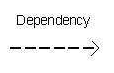

# UML 统一建模语言

<!-- @import "[TOC]" {cmd="toc" depthFrom=1 depthTo=6 orderedList=false} -->
<!-- code_chunk_output -->

* [UML 统一建模语言](#uml-统一建模语言)
	* [UML 概述](#uml-概述)
		* [UML的概念模型](#uml的概念模型)
		* [UML 在 OO（面向对象）设计中的作用](#uml-在-oo面向对象设计中的作用)
	* [UML 构建模块](#uml-构建模块)
		* [事物](#事物)
			* [结构](#结构)
			* [行为](#行为)
			* [分组](#分组)
			* [注释](#注释)
		* [关系](#关系)
			* [依赖](#依赖)
			* [关联](#关联)
			* [泛化](#泛化)
			* [实现](#实现)
		* [UML 图](#uml-图)
	* [UML 体系结构](#uml-体系结构)
	* [建模类型](#建模类型)
		* [结构建模](#结构建模)
		* [行为建模](#行为建模)
		* [架构建模](#架构建模)
	* [基本符号](#基本符号)
		* [结构的事物](#结构的事物)
			* [类](#类)
			* [对象](#对象)
			* [界面符号](#界面符号)
			* [协作标记](#协作标记)
			* [用例符号](#用例符号)
			* [演员表示法](#演员表示法)
			* [初始状态符号](#初始状态符号)
			* [最终状态符号](#最终状态符号)
			* [活动类表示法](#活动类表示法)
			* [组件符号](#组件符号)
			* [节点标记](#节点标记)
		* [行为的事物](#行为的事物)
			* [状态机表示法](#状态机表示法)
		* [分组的事物](#分组的事物)
			* [包表示法](#包表示法)
		* [注释的事物](#注释的事物)
			* [注释符号](#注释符号)
		* [关系](#关系-1)
			* [依赖](#依赖-1)
			* [关联](#关联-1)
			* [泛化](#泛化-1)
			* [可扩展性](#可扩展性)

<!-- /code_chunk_output -->

注：该文档翻译参考自 [ tutorialspoint/UML Tutorial ](https://www.tutorialspoint.com/uml/index.htm)  系列教程

[统一建模语言 wikipedia](https://zh.wikipedia.org/wiki/%E7%BB%9F%E4%B8%80%E5%BB%BA%E6%A8%A1%E8%AF%AD%E8%A8%80)

UML（统一建模语言）是用于指定，可视化，构建和记录软件系统工件的标准语言。UML由 Object Management Group（OMG）创建，UML 1.0规范草案于1997年1月提交给OMG。它最初开始用于捕捉复杂软件和非软件系统的行为，现在它已成为OMG标准。

## UML 概述

OMG正在不断努力创造一个真正的行业标准。

* UML代表统一建模语言。

* UML不同于其他常见编程语言，如C ++，Java，COBOL等。

* UML是一种用于制作软件蓝图的图像语言。

* UML可以被描述为一种通用的可视化建模语言，用于可视化，指定，构建和记录软件系统。

* 尽管UML通常用于模拟软件系统，但它并不局限于此范围内。它也被用来模拟非软件系统。例如，制造单位中的流程等。

UML不是一种编程语言，但可以使用工具来使用UML图生成各种语言的代码。UML与面向对象的分析和设计有直接的关系。经过一些标准化之后，UML已经成为OMG标准

UML的目标可以被定义为一个简单的建模机制来模拟当今复杂环境中所有可能的实际系统。

### UML的概念模型
* 概念模型可以被定义为由概念及其关系组成的模型。
* 概念模型是绘制UML图之前的第一步。它有助于理解现实世界中的实体以及它们如何相互交互。

由于UML描述了实时系统，因此建立概念模型并逐步进行是非常重要的。通过学习以下三个主要元素可以掌握UML的概念模型：
* UML 构建模块
* 连接构建模块的规则
* UML的通用机制

### UML 在 OO（面向对象）设计中的作用
UML是一种用于建模软件和非软件系统的建模语言。虽然UML用于非软件系统，但重点在于对OO软件应用程序进行建模

## UML 构建模块

UML 的构建块可以被定义为：
* 事物
* 关系
* 图

### 事物

事物是 UML 最重要的组成部分，事物可以是：
* 结构
* 行为
* 分组
* 注释

#### 结构

定义了模型的静态部分。他们代表了物理和概念元素。以下是结构化事物的简要描述

类，表示一组具有类似职责的对象

接口，定义了一组操作，他们指定了一个类的责任

协作，定义元素之间的交互

用例，代表系统为特定目标执行的一组操作

组件，描述了系统的物理部分

节点，可以定义为运行时存在的物理元素

#### 行为

行为事物由UML模型的动态部分组成。以下是行为的事物

交互，被定义为一种行为，它由一组元素之间交换的消息组成，以完成特定的任务

状态机,在其生命周期中的对象状态非常重要时非常有用。它定义了一个对象响应事件所经历的状态序列。事件是造成变化的外部因素

#### 分组

可以被定义为一种将UML模型的元素组合在一起的机制。只有一个可用的分组事物：

package,是唯一可用于收集结构和行为事物的分组事物

#### 注释

注释事物可以被定义为一种机制来捕获UML模型元素的注释，描述和注释。这是唯一可用的注释事物。注释用于呈现UML元素的注释，约束等。

### 关系

关系是UML的另一个最重要的组成部分。它显示了元素如何相互关联，并且该关联描述了应用程序的功能

#### 依赖
依赖性是两个事物之间的关系，其中一个元素的变化也会影响另一个元素

#### 关联
关联基本上是一组连接UML模型元素的链接。它还描述了有多少对象参与这种关系

#### 泛化

泛化可以定义为将特定元素与广义元素相联系的关系。它基本上描述了对象世界中的继承关系

#### 实现
实现可以被定义为两个元素连接的关系。一个要素描述了一些责任，这个责任没有实现，另一个与之相连的来实实现这个责任。这种关系在接口的情况下存在。

### UML 图

UML图是整个讨论的最终输出。所有的元素，关系都被用来制作一个完整的UML图，而该图代表一个系统。

UML图的视觉效果是整个过程中最重要的部分。所有其他元素都被用来完成它。

UML包含以下九个图表：

* [类图](https://www.tutorialspoint.com/uml/uml_class_diagram.htm)
* [对象图](https://www.tutorialspoint.com/uml/uml_object_diagram.htm)
* [用例图](https://www.tutorialspoint.com/uml/uml_use_case_diagram.htm)
* [序列图](https://www.tutorialspoint.com/uml/uml_interaction_diagram.htm)
* [协作图](https://www.tutorialspoint.com/uml/uml_interaction_diagram.htm)
* [活动图](https://www.tutorialspoint.com/uml/uml_activity_diagram.htm)
* [状态图](https://www.tutorialspoint.com/uml/uml_statechart_diagram.htm)
* [部署图](https://www.tutorialspoint.com/uml/uml_deployment_diagram.htm)
* [组件图](https://www.tutorialspoint.com/uml/uml_component_diagram.htm)

## UML 体系结构

任何真实世界的系统都被不同的用户使用。用户可以是开发人员，测试人员，业务人员，分析师等等。因此，在设计系统之前，架构是考虑到不同的观点。最重要的部分是从不同观众的角度对系统进行可视化。我们越了解我们越能够建立系统。

UML在定义系统的不同视角方面发挥着重要作用。这些观点是：
* 设计
* 实现
* 处理
* 部署

该中心是连接所有这四个的用例视图。一个用例表示系统的功能。因此，其他观点与用例有关。

系统的 “设计” 由类，接口和协作组成。UML提供了类图，对象图来支持这个。
“实现” 定义组件组装在一起构成一个完整的物理系统。
“处理” 定义了系统的流程。
“部署” 代表物理节点的硬件系统构成

## 建模类型

区分 UML 模型非常重要。不同的图用于不同类型的 UML 建模。有三种重要的 UML 建模类型

### 结构建模

结构建模捕捉系统的静态特征。他们包括以下内容：

* 类图
* 对象图
* 部署图
* 包图
* 复合结构图
* 组件图

结构模型代表了系统的框架，这个框架是所有其他组件存在的地方。因此，类图，组件图和部署图是结构建模的一部分。它们都代表了组装它们的要素和机制。

结构模型从不描述系统的动态行为。类图是使用最广泛的结构图。

### 行为建模
行为模型描述了系统中的交互。它代表了结构图之间的相互作用。行为建模显示了系统的动态性。它们包括以下内容 -
* 活动图
* 交互图
* 用例图

以上所有内容都显示了系统中流动的动态顺序。

### 架构建模

架构建模代表了系统的总体框架。它包含系统的结构和行为要素。架构建模可以被定义为整个系统的蓝图。软件包图涉及体系结构建模。

## 基本符号

UML符号是建模中最重要的元素。符号的高效和适当使用对于建立完整而有意义的模型非常重要。除非其目的被正确描述，否则该模型是无用的，

### 结构的事物
结构事物中使用的图形符号在 UML 中应用最广泛。这些被认为是UML模型的名词。以下是结构性事物的列表。

* 类
* 对象
* 接口
* 协作
* 用例
* 活动类
* 组件
* 节点

#### 类
UML 类由下图表示。该图分为四个部分。
* 顶部，用于命名类
* 第二个部分，用于显示类的属性
* 第三个部分，用于描述类执行的操作
* 第四个部分，是可选的，以显示任何其它组件

#### 对象

对象与类有相似的表示。唯一的区别是下划线所示的名称，如下图所示。

#### 界面符号

界面由一个圆圈表示，如下图所示。它的名字通常写在圆圈下面。

接口用于描述没有实现的功能。接口就像一个定义不同功能的模板，而不是实现。当一个类实现接口时，它也按照需求实现功能。

#### 协作标记

#### 用例符号

用例被表示为一个带有名字的eclipse。它可能包含额外的责任。

#### 演员表示法
角色可以被定义为与系统交互的一些内部或外部实体。

#### 初始状态符号

初始状态被定义为显示进程的开始。几乎所有图表都使用这种表示法。

#### 最终状态符号

最终状态用于显示进程的结束。几乎所有图表中都使用这种表示法来描述结束。

#### 活动类表示法

活动类看起来类似于具有实心边框的类。活动类通常用于描述系统的并发行为。

#### 组件符号

图显示了UML中的一个组件，其中有一个名称。可以根据需要添加其他元素。
组件用于表示为其制作UML图的系统的任何部分。

#### 节点标记

UML中的节点由方框表示，如下图所示，名称。节点表示系统的物理组件。
节点用于表示系统的物理部分，例如服务器，网络等。

### 行为的事物

动态部分是UML中最重要的元素之一。UML具有一组强大的功能来表示软件和非软件系统的动态部分。这些功能包括交互和状态机。

交互可以有两种类型 -
* 顺序（由顺序图表示）
* 协作（由协作图表示）

交互基本上是两个UML组件之间的消息交换。下图表示交互中使用的不同符号。

交互用于表示系统组件之间的通信。

#### 状态机表示法

状态机描述组件在其生命周期中的不同状态。

状态机用于描述系统组件的不同状态。根据情况，状态可以是活动的，空闲的或任何其他状态。

### 分组的事物
组织UML模型是设计最重要的方面之一。在UML中，只有一个可用于分组的元素，并且是包。

#### 包表示法

### 注释的事物

在任何图表中，不同元素及其功能的解释都非常重要。因此，UML 注意到支持这个要求。

#### 注释符号

### 关系

除非元素之间的关系被正确描述，否则模型不完整。该关系给出了一个应有之义为UML模型。以下是UML中可用的不同类型的关系。

* 依赖
* 协会
* 概括
* 可扩展性

#### 依赖
依赖是UML元素中的一个重要方面。它描述了依赖元素和依赖方向。
如下图所示，相关性由虚线箭头表示。箭头表示独立元素，另一端表示从属元素。

依赖关系用于表示系统的两个元素之间的依赖关系

#### 关联

关联描述了UML图中的元素如何关联。简而言之，它描述了参与交互的元素数量。

协会由虚线表示，两侧带有（没有）箭头。两端代表两个相关联的元素，如下图所示。在末端（1，* 等）还提到了多重性，以显示多少个对象相关联。

关联用于表示系统中两个元素之间的关系。

#### 泛化

泛化描述了面向对象世界的继承关系。这是一个父母和孩子的关系。

泛化由带有空心箭头的箭头表示，如下图所示。一端表示父元素，另一端表示子元素。

泛化用于描述系统中两个元素的父子关系。

#### 可扩展性

所有语言（编程或建模）都有一些机制来扩展其功能，如语法，语义等.UML还具有以下机制来提供可扩展性功能

* 定型（代表新元素）
* 标记值（表示新属性）
* 约束（表示边界）

扩展性符号用于增强语言的力量。它基本上是用来表示系统某些额外行为的附加元素。这些额外的行为不包含在标准可用符号中。

[上一级](base.md)
[上一篇](ThePowerOfVariableName.md)
[下一篇](c++VSjava.md)
