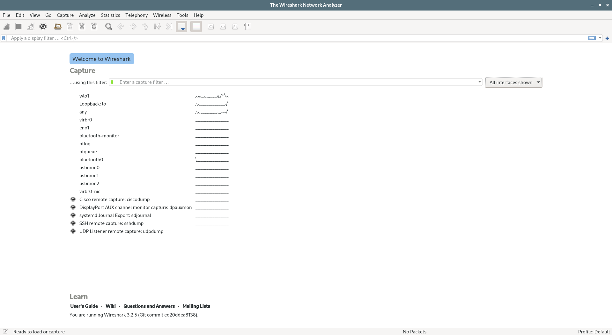
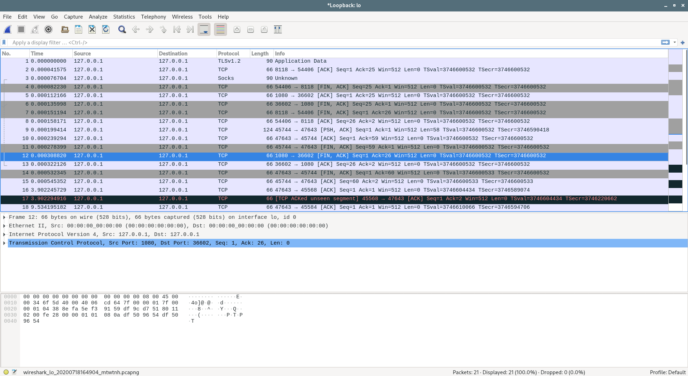
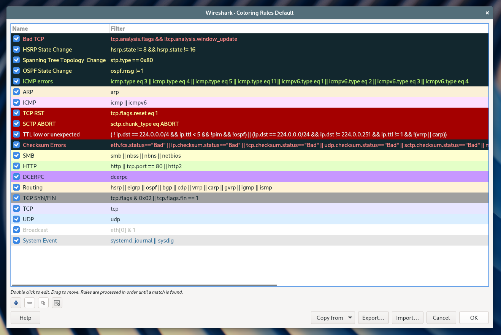
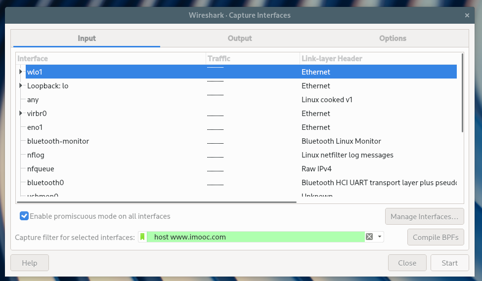
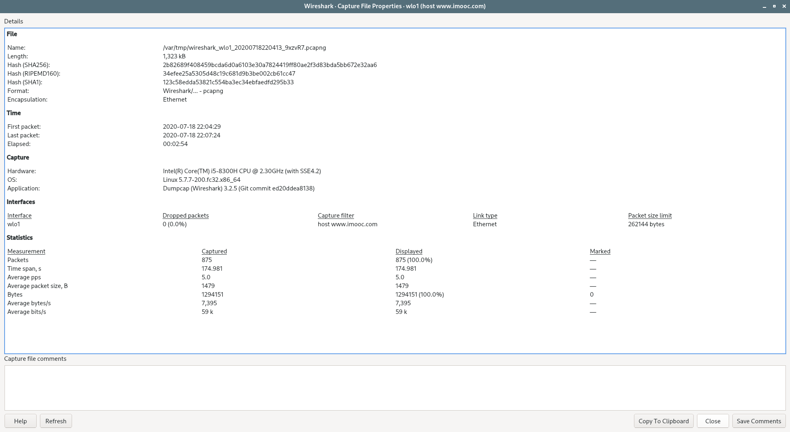
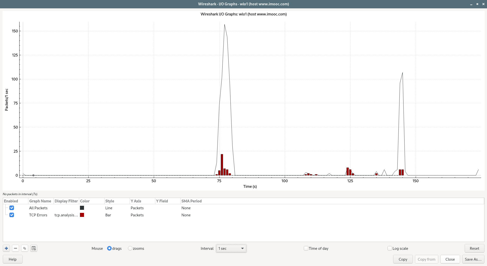

<!-- Wireshark 使用 -->


<!-- @import "[TOC]" {cmd="toc" depthFrom=1 depthTo=6 orderedList=false} -->

<!-- code_chunk_output -->

- [wireshark 官网](#wireshark-官网)
- [wireshark 简介](#wireshark-简介)
  - [Functionality](#functionality)
  - [How does Wireshark work?](#how-does-wireshark-work)
- [How to Download Wireshark](#how-to-download-wireshark)
  - [Wireshark for Linux](#wireshark-for-linux)
    - [Red Hat Fedora](#red-hat-fedora)
- [Capturing Data Packets on Wireshark](#capturing-data-packets-on-wireshark)
- [Analyzing Data Packets on Wireshark](#analyzing-data-packets-on-wireshark)
- [Wireshark Filters](#wireshark-filters)
  - [Wireshark Capture Filters](#wireshark-capture-filters)
  - [Wireshark Display Filters](#wireshark-display-filters)
- [Additional Wireshark Features](#additional-wireshark-features)
  - [Wireshark Colorization Options](#wireshark-colorization-options)
  - [Wireshark Promiscuous Mode](#wireshark-promiscuous-mode)
  - [Wireshark Command Line](#wireshark-command-line)
    - [Wireshark Commands](#wireshark-commands)
  - [Metrics and Statistics](#metrics-and-statistics)
- [Additional Wireshark Resources and Tutorials](#additional-wireshark-resources-and-tutorials)
- [Link](#link)

<!-- /code_chunk_output -->

## wireshark 官网
[wireshark](https://www.wireshark.org/)

## wireshark 简介
Wireshark is a free and open-source packet analyzer. It is used for network troubleshooting, analysis, software and communications protocol development, and education. 

Wireshark is cross-platform, using the Qt widget toolkit in current releases to implement its user interface, and using [pcap](https://en.wikipedia.org/wiki/Pcap) to capture packets; it runs on Linux, macOS, BSD, Solaris, some other Unix-like operating systems, and Microsoft Windows. There is also a terminal-based (non-GUI) version called [TShark](https://www.wireshark.org/docs/man-pages/tshark.html). Wireshark, and the other programs distributed with it such as TShark, are free software, released under the terms of the GNU General Public License.

### Functionality 
Wireshark is very similar to [tcpdump](https://en.wikipedia.org/wiki/Tcpdump), but has a graphical front-end, plus some integrated sorting and filtering options.

Wireshark lets the user put network interface controllers into [promiscuous mode](https://en.wikipedia.org/wiki/Promiscuous_mode) (if supported by the network interface controller), so they can see all the traffic visible on that interface including unicast traffic not sent to that network interface controller's MAC address. However, when capturing with a packet analyzer in promiscuous mode on a port on a [network switch](https://en.wikipedia.org/wiki/Network_switch), not all traffic through the switch is necessarily sent to the port where the capture is done, so capturing in promiscuous mode is not necessarily sufficient to see all network traffic. [Port mirroring](https://en.wikipedia.org/wiki/Port_mirroring) or various network taps extend capture to any point on the network. Simple passive taps are extremely resistant to tampering[citation needed].

On GNU/Linux, BSD, and macOS, with [libpcap](https://en.wikipedia.org/wiki/Pcap) 1.0.0 or later, Wireshark 1.4 and later can also put wireless network interface controllers into monitor mode.

If a remote machine captures packets and sends the captured packets to a machine running Wireshark using the [TZSP](https://en.wikipedia.org/wiki/TZSP) protocol or the protocol used by [OmniPeek](https://en.wikipedia.org/wiki/OmniPeek), Wireshark dissects those packets, so it can analyze packets captured on a remote machine at the time that they are captured.

### How does Wireshark work?
Wireshark is a packet sniffer and analysis tool. It captures network traffic on the local network and stores that data for offline analysis. Wireshark captures network traffic from Ethernet, Bluetooth, Wireless (IEEE.802.11), Token Ring, Frame Relay connections, and more. 

Ed. Note: A “packet” is a single message from any network protocol (i.e., TCP, DNS, etc.)

Ed. Note 2: LAN traffic is in broadcast mode, meaning a single computer with Wireshark can see traffic between two other computers. If you want to see traffic to an external site, you need to capture the packets on the local computer. 

Wireshark allows you to filter the log either before the capture starts or during analysis, so you can narrow down and zero into what you are looking for in the network trace. For example, you can set a filter to see TCP traffic between two IP addresses. You can set it only to show you the packets sent from one computer. The filters in Wireshark are one of the primary reasons it became the standard tool for packet analysis. 

## How to Download Wireshark
[wireshark Download page](https://www.wireshark.org/download.html)

### Wireshark for Linux
#### Red Hat Fedora
```sh
sudo dnf install wireshark-qt
sudo usermod -a -G wireshark username
```
The first command installs the GUI and CLI version of Wireshark, and the second adds permissions to use Wireshark.

## Capturing Data Packets on Wireshark
When you open Wireshark, you see a screen that shows you a list of all of the network connections you can monitor. You also have a capture filter field, so you only capture the network traffic you want to see.



You can select one or more of the network interfaces using “shift left-click.” or "ctrl + left-click" Once you have the network interface selected, you can start the capture, and there are several ways to do that:
* Click the first button on the toolbar, titled “Start Capturing Packets.”
* You can select the menu item Capture -> Start.
* Or you could use the Control + E.

During the capture, Wireshark will show you the packets that it captures in real-time.



Once you have captured all the packets you need, you use the same buttons or menu options to stop the capture. 

Best practice says that you should stop Wireshark packet capture before you do analysis.

## Analyzing Data Packets on Wireshark
Wireshark shows you three different panes for inspecting packet data:The Packet List, the top pane, is a list of all the packets in the capture.  When you click on a packet, the other two panes change to show you the details about the selected packet. You can also tell if the packet is part of a conversation. Here are some details about each column in the top pane:
* `No.`: This is the number order of the packet that got captured. The bracket indicates that this packet is part of a conversation.
* `Time`: This column shows you how long after you started the capture that this packet got captured. You can change this value in the Settings menu if you need something different displayed.
* `Source`: This is the address of the system that sent the packet.
* `Destination`: This is the address of the destination of that packet.
* `Protocol`: This is the type of packet, for example, TCP, DNS, DHCPv6, or ARP.
* `Length`: This column shows you the length of the packet in bytes.
* `Info`: This column shows you more information about the packet contents, and will vary depending on what kind of packet it is.

Packet Details, the middle pane, shows you as much readable information about the packet as possible, depending on what kind of packet it is. You can right-click and create filters based on the highlighted text in this field.

The bottom pane, Packet Bytes, displays the packet exactly as it got captured in hexadecimal. 

When you are looking at a packet that is part of a conversation, you can right-click the packet and select Follow to see only the packets that are part of that conversation. 

## Wireshark Filters
One of the best features of Wireshark is the Wireshark Capture Filters and Wireshark Display Filters. Filters allow you to view the capture the way you need to see it so you can troubleshoot the issues at hand. Here are several filters to get you started.

### Wireshark Capture Filters
[Capture filters](https://wiki.wireshark.org/CaptureFilters) limit the captured packets by the filter. Meaning if the packets don’t match the filter, Wireshark won’t save them. Here are some examples of capture filters:
* `host IP-address`: this filter limits the capture to traffic to and from the IP address
* `net 192.168.0.0/24`: this filter captures all traffic on the subnet.
* `dst host IP-address`: capture packets sent to the specified host.
* `port 53`: capture traffic on port 53 only.
* `port not 53 and not arp`: capture all traffic except DNS and ARP traffic

### Wireshark Display Filters
[Wireshark Display Filters](https://wiki.wireshark.org/DisplayFilters) change the view of the capture during analysis. After you have stopped the packet capture, you use display filters to narrow down the packets in the Packet List so you can troubleshoot your issue.

The most useful (in my experience) display filter is:
```sh
ip.src==IP-address and ip.dst==IP-address
```
This filter shows you packets from one computer (ip.src) to another (ip.dst). You can also use ip.addr to show you packets to and from that IP. 
Here are some others:
* `tcp.port eq 25`: This filter will show you all traffic on port 25, which is usually SMTP traffic.
* `icmp`: This filter will show you only ICMP traffic in the capture, most likely they are pings.
* `ip.addr != IP_address`: This filter shows you all traffic except the traffic to or from the specified computer.
* Analysts even build filters to detect specific attacks, like this filter to detect the [Sasser worm](https://en.wikipedia.org/wiki/Sasser_(computer_worm)):`ls_ads.opnum==0x09`

## Additional Wireshark Features
Beyond the capture and filtering, there are several other features in Wireshark that can make your life better.

### Wireshark Colorization Options
You can setup Wireshark so it colors your packets in the Packet List according to the display filter, which allows you to emphasize the packets you want to highlight. Check out some examples [here](https://wiki.wireshark.org/ColoringRules).



### Wireshark Promiscuous Mode 
By default, Wireshark only captures packets going to and from the computer where it runs. By checking the box to run Wireshark in Promiscuous Mode in the Capture Options, you can capture most of the traffic on the LAN.



### Wireshark Command Line 
Wireshark does provide a [Command Line Interface (CLI)](https://www.wireshark.org/docs/wsug_html_chunked/ChCustCommandLine.html) if you operate a system without a GUI. Best practice would be to use the CLI to capture and save a log so you can review the log with the GUI.

#### Wireshark Commands
`wireshark `: run Wireshark in GUI mode
`wireshark –h` : show available command line parameters for Wireshark
`wireshark –a duration:300 –i eth1 –w wireshark.` : capture traffic on the Ethernet interface 1 for 5 minutes. –a means automatically stop the capture, -i specifics which interface to capture

### Metrics and Statistics
Under the Statistics menu item, you will find a plethora of options to show details about your capture.

Capture File Properties:



Wireshark I/O Graph:



## Additional Wireshark Resources and Tutorials
[the official documentation and Wiki](https://wiki.wireshark.org/).

Wireshark is a great network sniffer and analysis tool – however, in my opinion, it’s best used once you know what you are looking for. You aren’t going to use Wireshark to find a new problem. There is too much noise on the network. You need something like [Varonis](https://www.varonis.com/products/data-security-platform/) with [Edge](https://www.varonis.com/products/edge/) to make sense of the overall situation for you and point you to a threat to investigate, and then you use Wireshark to dig in deeper to understand exactly what is in the packets that are dangerous. 


## Link 
* [wireshark wikpedia](https://en.wikipedia.org/wiki/Wireshark)
* [How to Use Wireshark: Comprehensive Tutorial + Tips](https://www.varonis.com/blog/how-to-use-wireshark/)


---
- [上一级](README.md)
- 上一篇 -> [UML 统一建模语言](UML.md)
- 下一篇 -> [C++ VS Java](c++VSjava.md)
