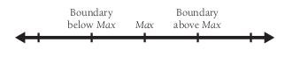

<!-- 开发者测试 -->


<!-- @import "[TOC]" {cmd="toc" depthFrom=1 depthTo=6 orderedList=false} -->
<!-- code_chunk_output -->

- [开发者测试在软件质量中的角色](#开发者测试在软件质量中的角色)
- [开发者测试的推荐方法](#开发者测试的推荐方法)
  - [测试先行还是测试后行](#测试先行还是测试后行)
  - [开发者测试的局限性](#开发者测试的局限性)
- [测试技巧锦囊](#测试技巧锦囊)
  - [不完整的测试](#不完整的测试)
  - [结构化的基础测试](#结构化的基础测试)
  - [数据流测试](#数据流测试)
  - [等价类划分](#等价类划分)
  - [猜测错误](#猜测错误)
  - [边界值分析](#边界值分析)
    - [复合边界值](#复合边界值)
  - [几类坏数据](#几类坏数据)
  - [几类好数据](#几类好数据)
  - [采用容易手工检查的测试用例](#采用容易手工检查的测试用例)
- [典型错误](#典型错误)
  - [哪些类包含最多的错误](#哪些类包含最多的错误)
  - [错误的分类](#错误的分类)
  - [不完善的构建过程引发错误所占的比例](#不完善的构建过程引发错误所占的比例)
  - [你期望能发现多少错误](#你期望能发现多少错误)
  - [测试本身的错误](#测试本身的错误)
- [测试支持工具](#测试支持工具)
  - [为测试各个类构造脚手架](#为测试各个类构造脚手架)
  - [Diff tools](#diff-tools)
  - [测试数据生成器](#测试数据生成器)
  - [覆盖率监视器](#覆盖率监视器)
  - [数据记录器/日志记录器](#数据记录器日志记录器)
  - [符号调试器](#符号调试器)
  - [系统干扰器](#系统干扰器)
  - [错误数据库](#错误数据库)
- [改善测试过程](#改善测试过程)
  - [有计划的测试](#有计划的测试)
  - [（重新测试）回归测试](#重新测试回归测试)
  - [自动化测试](#自动化测试)
- [保留测试记录](#保留测试记录)
  - [个人测试记录](#个人测试记录)
  - [更多的资源](#更多的资源)
    - [测试](#测试)
    - [测试脚手架](#测试脚手架)
    - [测试先行开发](#测试先行开发)
  - [相关标准](#相关标准)
    - [核对表：测试用例](#核对表测试用例)
- [要点](#要点)

<!-- /code_chunk_output -->

测试是常见的改善质量的活动：
* `单元测试（Unit testing）`是将一个程序员或者一个开发团队所编写的，一个完整的类、子程序或者小程序，从完整的系统中隔离出来进行测试。
* `组件测试（Component testing）`是将一个类、包、小程序或者其他程序元素，从一个更加完整的系统中隔离出来进行测试，这些被测代码涉及到多个程序员或者多个团队。
* `集成测试（Integration testing）` 是对两个或更多的类、包、组件或者子系统进行的联合测试，这些组件由多个程序员或者开发团队所创建。这种测试通常在有了两个可以进行测试的类的时候就应该尽快开始，并且一直持续到整个系统开发完成。
* `回归测试（Regression testing）` 是指重复执行以前的测试用例，以便在原先通过了相同测试集合的软件中查找缺陷。
* `系统测试（System testing）` 是在最终的配置下（包括同其他软硬件系统的集成）运行整个软件。以便测试安全、性能、资源消耗、时序方面的问题，以及其他无法在低级集成上测试的问题。

测试通常分为两大类：黑盒测试 (black-box testing) 和 白盒 (white-box testing,或者 玻璃盒测试 glass-box testing)。
* 黑盒测试：指的是测试者无法了解测试对象内部工作机制的测试。
* 白盒测试：指的是测试者清楚待测对象内部工作机制的测试。
本章关注的是白盒测试，即由开发者完成的测试。

“测试” 和 “调试” 是不同的术语：
* 测试是一种检查错误的方法
* 调试意味着错误已经被发现，要做的是诊断错误并消灭造成这些错误的根本原因。

## 开发者测试在软件质量中的角色
对于任何软件质量规划来说，测试都是一个重要的组成部分，并且在许多情况下它是唯一的组成部分。这是非常不幸的，因为各种形式的协同开发实践都表现出比测试更高的错误检查率，而且发现一条测试的成本不到测试的二分之一。

测试对于绝大数开发人员来说都是一种煎熬：
* 测试的目标与开发活动背道而驰，测试的目标是找出错误。一个成功的测试应该弄跨软件，而其他开发活动的目标是避免程序错误和软件的崩溃。
* 测试永远不可能彻底证明程序中没有错误。
* 测试本身并不能改善软件的质量。测试的结果是软件质量的一个指示器，但是结果本身并不改善软件质量。
* 测试是要求你假设会在代码里面找到错误。

如下图所示，根据项目大小和复杂程度的不同，开发者测试应该占整个项目时间的 8% ~ 25%.


理解测试基本概念可以更好地支持测试，也能提供测试的效率。

## 开发者测试的推荐方法
采用系统化的开发者测试方法，能最大限度提高你发现各种错误的能力，同时让你的花费也最少。请确保下面所有要点你都能做到：
* 对每一项相关的需求进行测试，以确保需求都已经被实现。在需求阶段就计划好这一部分的测试用例，或者至少尽早开始-最好在你开始编写代测试的单元之前。注意对需求里面常见的疏漏进行测试。安全级别、数据存储、安装过程以及系统可靠性等，这些都是测试的绝佳素材，并且常常在需求阶段被忽略。
* 对每一个相关的设计关注点进行测试，以确保设计已经被实现。
* 用基础测试（basis testing）来扩充针对需求和设计的详细测试用例。增加数据流测试（data-flow testing），然后补充其他所需的测试用例，以便对代码进行彻底的考验。至少你应该测试到每一行代码。
* 使用一个检查表，其中记录着你在项目迄今为止所犯的，以及在过去的项目中所犯的错误类型。

在设计产品的时候设计测试用例，这样可以帮助避免在需求和设计中产生错误，修正这些错误的代价往往比修正编码错误更昂贵。越早修复这些缺陷，成本就越低，因此，要尽可能地对测试进行规划并找出缺陷。

### 测试先行还是测试后行
通过下面的缺陷成本增长图，我们可以得到：首先写测试用例可以将从引入缺陷到发现并排除缺陷之间的时间缩减至最短。这正是首先写测试用例的诸多原因之一。


* 在开始写代码先写测试用例，并不比之后在写要多花功夫，只是调整了一下测试用例编写活动的工作顺序而已。
* 假如你首先编写测试用例，那么你将可以更早发现缺陷，同时也更容易修正它们。
* 首先编写测试用例，将迫使你在开始写代码之前至少思考一下需求和设计，而这往往会催生更高质量的代码。
* 首先编写测试用例，能更早地把需求上的问题暴露出来，因为对于一个糟糕的需求来说，要写出测试用例是一件困难的事情。
* 如果你保存了最初的测试用例-这是你应该做的，那么先进行测试并非唯一选择，你仍然可以最后在进行测试。

总而言之，我认为测试先行的编程是过去十年中所形成的最有用的软件开发实践之一，同时也是一个非常好的通用方法。但这并不是一种测试万能药，正如接下来将要说明的那样，它同样受制于开发者测试本身的局限性。


### 开发者测试的局限性
应注意到开发者测试的下述局限性：
* 开发者测试倾向于 “干净测试”：开发人员往往去做一些检查代码能否工作的测试（干净测试，clean test）,而不是所用可能让代码失效的测试（肮脏测试，dirty test）。
* 开发者测试对覆盖率由过于乐观的估计: 平均而言，，程序员坚信它们的测试覆盖率达到了 95% ,但通常，最佳情况下这一数字也只能达到大约 80%，而在最糟糕的情况下只有 30%。平均而言大约在 50% ~ 60%.
* 开发者测试往往会忽略一些更复杂的测试覆盖率类型

上面的这些讨论绝不是想要贬低开发者测试的价值，相反，它们促使我们用正确的观点来看待开发者测试。开发者测试是有价值的，但对于提供足够的质量保证而言，仅仅进行开发者测试是不够的。我们需要补充其他的测试，包括独立测试(independent testing) 技术以及协同构建 (collaborative construction) 技术。

## 测试技巧锦囊

为什么说通过测试来证明程序的正确性是不可能的呢？如果要用测试来证明一个程序的正确性，你需要对程序的每一种可能的输入值，以及它们之间的所有的可以想像的组合进行测试。即使是一个简单的程序，这样庞大的任务都会让人望而却步。

### 不完整的测试
由于进行完全测试实际上是不可能的，因此测试的窍门就在于选择那些最有可能找到错误的测试用例。

### 结构化的基础测试

其思想是，你需要去测试程序中的每一条语句至少一次。例如 if 语句或者 while 语句，那么你就需要根据 if 或者 while 中表达式的复杂程度来修改测试，以确保这个语句完全经过了测试。要确保你已经覆盖了所有的基础情况，最简单的方法就是算一算有多少条通过程序的路径，然后据此开发出能通过程序里每条路径的最少数量的测试用例。

测试穿过程序里的所有路径的两种方法：`代码覆盖测试`或`逻辑覆盖测试`。这两种方法覆盖了所有的路径，因此，它们和结构化的基础测试很相似，但是它们并不蕴涵者以最小数量的测试用例覆盖所有路径的思想。如果使用代码覆盖率测试或者逻辑覆盖测试，在覆盖相同逻辑的情况下，你需要创建的测试用例远多于结构化的基础测试。
所需基础测试用例的最少数量可以这样计算：
1. 对通过子程序的直路，开始的时候记 1.
2. 遇到下面的关键字或者其等价物时，加 1： if 、while、repeat、for、and 以及 or
3. 遇到每一个 case 语句就加 1,如果 case 语句没有缺省情况，则再加 1.

```java
// 记 1
Statement1;
Statement2;
if (x < 10) { // 遇到 if,记作 2
	Statement3;
}
Statement4;
```
对于这个例子，我们需要如下两个测试用例：
* 由 if 控制的语句执行 (x<10);
* 由 if 控制的语句不执行 (x>=10)

下面是一个稍微复杂一点的例子，这一段代码将在本章中不断使用，并且包含了一些可能的错误。
```java
//Example of Computing the Number of Cases Needed for Basis Testing
// Compute Net Pay
totalWithholdings = 0;
for ( id = 0; id < numEmployees; id++ ) {
	// compute social security withholding, if below the maximum
	if ( m_employee[ id ].governmentRetirementWithheld < MAX_GOVT_RETIREMENT ) {
		governmentRetirement = ComputeGovernmentRetirement( m_employee[ id ] );
	}
	// set default to no retirement contribution
	companyRetirement = 0;
	// determine discretionary employee retirement contribution
	if ( m_employee[ id ].WantsRetirement &&
		EligibleForRetirement( m_employee[ id ] ) ) {
		companyRetirement = GetRetirement( m_employee[ id ] );
	}
	grossPay = ComputeGrossPay ( m_employee[ id ] );
	// determine IRA contribution
	personalRetirement = 0;
	if ( EligibleForPersonalRetirement( m_employee[ id ] ) ) {
		personalRetirement = PersonalRetirementContribution( m_employee[ id ],
			companyRetirement, grossPay );
	}
	// make weekly paycheck
	withholding = ComputeWithholding( m_employee[ id ] );
	netPay = grossPay - withholding - companyRetirement - governmentRetirement –
	personalRetirement;
	PayEmployee( m_employee[ id ], netPay );
	// add this employee's paycheck to total for accounting
	totalWithholdings = totalWithholdings + withholding;
	totalGovernmentRetirement = totalGovernmentRetirement + governmentRetirement;
	totalRetirement = totalRetirement + companyRetirement;
}
SavePayRecords( totalWithholdings, totalGovernmentRetirement, totalRetirement );
```
下面是一套能够覆盖这一例子中所有基本情况的测试用例：
<style type="text/css">
.tg  {border-collapse:collapse;border-spacing:0;}
.tg td{border-color:black;border-style:solid;border-width:1px;font-family:Arial, sans-serif;font-size:14px;
  overflow:hidden;padding:10px 5px;word-break:normal;}
.tg th{border-color:black;border-style:solid;border-width:1px;font-family:Arial, sans-serif;font-size:14px;
  font-weight:normal;overflow:hidden;padding:10px 5px;word-break:normal;}
.tg .tg-c3ow{border-color:inherit;text-align:center;vertical-align:top}
.tg .tg-0pky{border-color:inherit;text-align:left;vertical-align:top}
</style>
<table class="tg">
<thead>
  <tr>
    <th class="tg-c3ow">用例</th>
    <th class="tg-c3ow">测试用例描述</th>
    <th class="tg-c3ow">测试数据</th>
  </tr>
</thead>
<tbody>
  <tr>
    <td class="tg-c3ow">1</td>
    <td class="tg-c3ow">正常情况</td>
    <td class="tg-c3ow">所有布尔条件都为真</td>
  </tr>
  <tr>
    <td class="tg-c3ow">2</td>
    <td class="tg-c3ow">初始 for 条件为假</td>
    <td class="tg-c3ow">numEmployee &lt; 1</td>
  </tr>
  <tr>
    <td class="tg-c3ow">3 </td>
    <td class="tg-c3ow">第一个 if 为假</td>
    <td class="tg-c3ow">m_employee[ id ].governmentRetirementWithheld &gt;= MAX_GOVT_RETIREMENT</td>
  </tr>
  <tr>
    <td class="tg-c3ow">4</td>
    <td class="tg-c3ow">第二个 if由于 and之前的部分为假，结果为假</td>
    <td class="tg-c3ow">not&nbsp;&nbsp;m_employee[ id ].WantsRetirement</td>
  </tr>
  <tr>
    <td class="tg-c3ow">5</td>
    <td class="tg-c3ow">第二个 if由于 and后半部分为假，结果为假</td>
    <td class="tg-c3ow">not EligibleForRetirement( m_employee[ id ] )</td>
  </tr>
  <tr>
    <td class="tg-c3ow">6</td>
    <td class="tg-c3ow">第三个 if 为假</td>
    <td class="tg-c3ow">not EligibleForPersonalRetirement( m_employee[ id ] )</td>
  </tr>
  <tr>
    <td class="tg-0pky" colspan="3">注意：在本章中，我们会不断地对该表增添更多的测试用例</td>
  </tr>
</tbody>
</table>

现在你已经为该子程序创建了 6 个测试用例，这满足了结构化的基础测试的要求，那么你认为这一个子程序已经经过完整的测试了吗？很可能并非如此。
这种测试能够向你保证所有的代码都得到执行，但它并不能说明数据的变化情况。

### 数据流测试
将上一节和本节的内容综合起来考虑，给出了另一个例子，该例显示控制流和数据流在计算机程序设计中的重要性部分伯仲。
数据流测试基于如下观念：数据使用的出错几率至少不亚于控制流。Boris Beizer 声称全部代码中至少有一半是数据声明和初始化。
数据的状态可以是下列三种状态中的一种：
* 已定义 - 数据已经初始化，但是还没有使用
* 已使用 - 数据已经用于计算，或作为某子程序调用的一个参数，或者用于其他用途。
* 已销毁 - 数据曾经定义过，但是现在已经通过某种途径取消了对它的定义。

为了方便起见，还应该有一些术语来描述对变量进行某种操作之前或者之后，控制流进入或退出某个子程序的状态。
* 已进入 - 控制流已经进入一个子程序，但还没有使用该变量。例如一个在子程序中使用的变量在子程序开始处进行初始化。
* 已退出 - 在对变量产生影响之后，控制流立即推出子程序。例如在子程序的结尾处把返回值赋给一个状态变量。

数据状态的组合:
* 已定义 - 已定义  其实这是多此一举，就算当时没有出错，也是非常危险的。
* 已定义 - 已退出 如果这是一个局部变量，那完全没有理由在定义后却不使用就退出。如果是一个子程序的参数或者全局变量，这还说得过去。
* 已定义 - 已销毁 定义一个变量然后就销毁它，这意味着要么这个变量对程序没什么意义，要么就是程序员忘记写使用这个变量的代码了。
* 已进入 - 已销毁 如果这是一个局部变量，那就有问题了。如果局部变量未定义或者未使用，那么它完全不需要被销毁。而另一方面，如果这是一个子程序的参数或者全局变量，只要在销毁之前确定该变量已经在别的什么地方定义过，那么使用这种组合就没有问题。
* 已进入 - 已使用 还是一样，如果这是一个局部变量就有问题。这个变量应该在使用之前被定义。反之，如果这是一个子程序的参数或者是一个全局变量，那么只要这个变量在使用之前已经在别的地方被定义过，那么就没有任何问题。
* 已销毁 - 已销毁 一个变量不应该被销毁两次
* 已销毁 - 已使用 使用一个已销毁的变量，从逻辑上就讲不通。如果这样的代码似乎还能正常工作，这只是一种例外的情况，墨菲定律（任何可能出错的事都会出错）也说代码如果停止工作将要引起极大混乱，那这时它就会停止工作。
* 已使用 - 已定义 对一个变量先使用后定义，可能是问题也可能不是，这就要看这个变量在使用之前是否已经定义过。当然，如果你看到某个已使用 - 已定义的模式，那么检查一下之前的定义是非常有必要的。

在开始测试之前，首先要检查一下，看看是否出现了这些反常的数据状态顺序。在做过这些检查之后，编写数据流测试用例的关键是要对所有可能的定义-使用路径进行测试。你可以采用彻底程度不同的测试。
* 所有定义。测试每一个变量的每一个定义 - 在每个变量被赋值的地方。这是一个很弱的策略，因为如果你曾经尝试对每一行代码进行测试，那么就已经做过这件事了。
* 使用已定义 - 已使用的组合。对每一个变量测试所有在某处定义而在另一处使用的组合，与测试所有定义相比，这是一个更强的策略，因为仅仅执行每一行代码并不能保证测试到每一种已定义-已使用的组合。


下面是一个例子：
```java
//Java Example of a Program Whose Data Flow Is to Be Tested
if (Condition 1) {
	x=a;
}
else
{
	x=b;
}
if (Condition 2) {
	y=x+1;
}
else
{
	y=x-1;
}
```
结合上面一节说的 结构化的基础测试，我们可以得到两个测试用例：
1. Condition 1 true,Condition 2 true
2. Condition 1 false ,Condition 2 false
要测试每一种已定义-已使用的组合，你还需要另外两种情况：
3. Condition 1 true,Condition 2 false
4. Condition 1 false,Condition 2 true

开发测试用例的一个好方法是首先进行结构化的基础测试，即使它没有测试所有的已定义-已使用数据流的形式，但至少也完成了其中的一部分。然后你需要添加完整的已定义-已使用数据流测试所需的用例。

正如前一节所讨论的那样，结构化的基础测试已经为其提供了 6 个测试用例。补充所有的数据流组合：

| 用例 	|                                       测试用例描述                                      	|
|:----:	|:---------------------------------------------------------------------------------------:	|
|   7  	| 在第12行定义 companyRetirement,并在第 26 行首次使用它，前面的测试用例并没有覆盖这种情况 	|
|   8  	| 在第12行定义 companyRetirement,并在第 31 行首次使用它，前面的测试用例并没有覆盖这种情况 	|
|   9  	| 在第17行定义 companyRetirement,并在第 31 行首次使用它，前面的测试用例并没有覆盖这种情况 	|

### 等价类划分
一个好的测试用例应该覆盖可输入数据中的很大一部分。如果两个用例能揭示的错误完全相同，那么只要一个就够了。“等价类划分”的概念是这一想法的严格表现形式，应用它有助于减少所需用例的数量。

在上一节中的用例表中，测试用例 3 是使用等价类划分的好地方，在这一情况下，有两个等价类：
* m_employee[ id ].governmentRetirementWithheld >= MAX_GOVT_RETIREMENT
* m_employee[ id ].governmentRetirementWithheld <
 MAX_GOVT_RETIREMENT

如果你已经通过基础测试和数据流覆盖了整个程序，那么对等价类划分的研究并不会对你的程序产生多少新的认识。然而，如果你从程序的外部来审视（从规格说明而非源代码角度），或是数据很复杂且程序的逻辑并为完全体现这种复杂性的时候，等价类划分还是大有好处的。

### 猜测错误
作为正式测试方法的补充，优秀的程序员会使用各种不太规矩的、启发式的方法去寻找它们代码中的错误，其中一种启发式方法就是猜测错误。它的真正含义应该是在猜测程序会在哪里出错的基础上建立测试用例，尽管这也意味着猜测中会有一些牵强附会的成分。

猜测可以基于直觉或过去的经验。第 21 章 “协同构建”提到，详细检查的一个好处是，这一过程能产生并维护一份常见错误列表，而该列表可以用于检查新的代码。如果你保留了一份记录过去所犯错误种类的列表，那么你就能提高 “猜测错误”的命中率。

下面几个小节描述了一些特定的错误类型，这些错误很容易通过猜测错误的方法发现。

### 边界值分析
边界值分析的思想就是写一些测试用例来测试边界值条件。假如你要对小于 max 的某个范围的数值进行测试，那么你会遇到下图所示的三种可能情况：



正如图中所示，这三种边界情况是：刚好小于 max 、等于 max 本身以及大于 max。需要三个测试用例去保证代码里没有出现任何一种常见错误。

在之前的实例代码中有一个判断：m_employee[ id ].governmentRetirementWithheld < MAX_GOVT_RETIREMENT，而根据边界值分析原理，我们需要测试三种情况：

| 用例 	|                                                                                             测试用例描述                                                                                             	|
|:----:	|:----------------------------------------------------------------------------------------------------------------------------------------------------------------------------------------------------:	|
|   1  	| 检查测试条件 m_employee[ id ].governmentRetirementWithheld < MAX_GOVT_RETIREMENT 为真的情况，于是需要将 m_employee[ id ].governmentRetirementWithheld设置为 MAX_GOVT_RETIREMENT-1 ，这个测试用例有了 	|
|   3  	| 检查测试条件 m_employee[ id ].governmentRetirementWithheld < MAX_GOVT_RETIREMENT 为假的情况，于是需要将 m_employee[ id ].governmentRetirementWithheld设置为 MAX_GOVT_RETIREMENT+1 ，这个测试用例有了 	|
|  10  	|                                                         还要在加上一个测试用例，测试正好在边界值上面的情形，也就是 MAX_GOVT_RETIREMENT 的时候                                                        	|

#### 复合边界值
边界值分析也适用于允许的最大最小值。在这个例子里面，可能会出现 grossPay 、 companyRetirement 以及 RetirementContribution 的最小值或最大值，但是由于对这些值的计算在子程序考虑范围之外，因此它们的测试用例不在这里做进一步讨论。

有一种边界条件更加隐蔽，就是当边界条件涉及到互相关联的多个变量的时候 ，例如，两个变量相乘，它们的值都是大的正数，会出现什么情况呢？都是大负数呢？零呢？如果传入子程序的字符串都长得很不寻常呢？

在我们的例子里面，你可能希望看一下，当一大群员工都有巨额月薪的时候-比如 25万美元的月薪（我们梦寐以求的数字），变量 totalWithholdings、totalGovernmentRetirement 以及 totalRetirement 会发生什么情况。这就需要另外的测试用例了：
| 用例 	|                                                                             测试用例描述                                                                             	|
|:----:	|:--------------------------------------------------------------------------------------------------------------------------------------------------------------------:	|
|  11  	| 有一大群员工都有很高的薪水（多少才算大取决于所开发的特定系统）-比如说，我们有 1000 位员工，美人有 $250000 的月薪，它们都不需要交社会保险，同时所有人都希望得到退休金 	|
基于同样的道理，可以站在相反的方向问问看，我们也需要这样的测试用例：
| 用例 	|            测试用例描述           	|
|:----:	|:---------------------------------:	|
|  12  	| 10 个员工，每个人的薪水都是 $0.00 	|

### 几类坏数据
除了假设错误会在边界条件上出现之外，你可以猜测并测试几种类型的坏数据。典型的坏数据测试用例包括：
* 数据太少（没有数据）
* 太多的数据
* 错误的数据情况（无效数据）
* 长度错误的数据
* 未初始化的数据

你遵从这些建议所能想到的一些测试用例早已被前面的用例覆盖了。比如说，“数据太少”就已经被 用例 2 和 12 覆盖了，此外我们也很难提出任何“数据长度错误”的情形。尽管如此，关于这几种坏数据的想法还是会带来如下几个新的用例：
| 用例 	|                                         测试用例描述                                        	|
|:----:	|:-------------------------------------------------------------------------------------------:	|
|  13  	| 100 000 000个员工，测试太多数据的情况（根据系统的不同做出不同的定义，这里假定该数据太多）。 	|
|  14  	|                                  薪水是负数，错误的数据情况                                 	|
|  15  	|                               员工的数量是负数，错误的数据情况                              	|

### 几类好数据
当你试图在程序中寻找错误的时候，这样一个事实很可能从你的眼皮底下溜过去：正常的情况也可能暗含错误。通常情况来说，基础测试一节所提到的正常情形所描述的就是一种好数据。下面是其他几种值得测试的好数据，根据待测试对象的情况，测试下面的每种数据类型时可能会有所收获。
* 正常的情形 - 大路正中间，所期望的值
* 最小的正常局面
* 最大的正常局面
* 与旧数据的兼容性

最小的测试数据在测试一组对象而非一个对象时候比较有用。它和测试多个边界条件中的最小值思想差不多，但还是由所区别，这里我们测试的是一组正常期望值中的最小值的集合。在本书中的例子里面，为了测试最小的正常局面需要添加下面的测试用例：
| 用例 	|             测试用例描述             	|
|:----:	|:------------------------------------:	|
|  16  	| 只有一个员工。用于测试最小的正常局面 	|

最大的正常局面是最小局面的对立面。在本例当中，测试最大正常形式需要看允许的最大员工数量是多少，比如我们假设是 500 个，那么可以添加这个测试用例：
| 用例 	|            测试用例描述           	|
|:----:	|:---------------------------------:	|
|  17  	| 500个员工。用于测试最大的正常局面 	|

最后一种对正常数据的测试 - 测试与旧数据的兼容性，这是在新程序或子程序替代旧版本的时候才需要进行。

###  采用容易手工检查的测试用例
让我们假设你正在写一个有关正常薪水的测试用例，你需要一个普通的薪水值，eg:`$90 783.82`.
现在我们进一步假设这个测试用例很成功 - 也就是说它发现了一个错误。
怎么发现错误的呢？嗯，你可能是通过手工计算得知这个答案是错误的，同时还算出了正确答案应该是多少。但当你试着手工计算`$90 783.82` 这个数字的过程犯错的几率和你在程序中发现错误的几率差不多。

在另一方面，使用一个好的数值 `$20 000`会让你手工计算倍加轻松。

你可能会想，那种像`$90 783.82`的丑八怪应该更可能把错误揪出来，但实际上它发现错误的几率并不会比其他数值高。

## 典型错误
你如果越了解你的对手-错误，你的测试就越有可能做得更好。

### 哪些类包含最多的错误
我们很自然会有这样的假设：缺陷在代码里面是均匀分布的。做出这种假设是很自然的，但事实上是错误的。

绝大多数错误往往与少数几个具有严重缺陷的子程序有关。下面是错误和代码之间的普遍关系：
* 80% 的错误存在于项目 20% 的类或者子程序中。
* 50% 的错误被发现存在于项目 5% 的类当中。

如果你认为这些关系无关紧要，很可能是因为你对下面几个结论一无所知：

* 项目中 20% 的子程序占用了 80% 的开发成本。虽然这并不是说成本最高的 20% 的代码就是有最多缺陷的 20% 代码，但这很有启发性。
* 无论高缺陷率的子程序在成本中所占的具体比例如何，这些子程序的成本的确是异常高昂的。
* 子程序开发成本昂贵带来的影响也是显而易见的。
* 避免维护惹人厌烦的子程序同样具有明显的重要意义。维护工作应该围绕如何确定容易出问题的子程序，如何把这些部分推倒重来，重新设计并编写代码。在前面提到的 IMS 项目中，替换了这些容易出错的类之后， IMS 发布版的运行效率提升了 15%。

### 错误的分类
Boris Beizer 将多个研究的数据综合起来，得到了一种非常详尽的错误分类方法：

| 错误占比（%）  	|        错误类型        	|
|:--------------:	|:------------------:	|
|      25.18     	|   结构方面的问题   	|
|     22.44      	|        数据        	|
|     16.19      	|    已实现的功能    	|
|      9.88      	|        构建        	|
|      8.98      	|        集成        	|
|      8.12      	|      功能需求      	|
|      2.76      	| 测试的定义或者执行 	|
|      1.74      	| 整个系统，软件架构 	|
|      4.71      	|       未归类       	|

Beizer 报告的结构精确到了小数点后两位，但其对错误类型的研究至今仍然不是结论性的。不同研究所报告的错误类型就有很大差别，针对类似的错误类型进行的不同研究也得到了非常不同的结果，并且差异可以达到 50% 而不只是是百分之几。

但即便不能将其作为定论，这些数据中的某些部分还是很有启发性的。下面是这些数据给我们的提示：
* 大多数错误的影响范围是相当有限的：一项研究发现，85% 的错误可以在修改不超过一个子程序的范围内得以修正。
* 许多错误发生在构建的范畴之外：有一次研究人员组织了一系列的调查，这 97 次调查发现了三种最为常见错误的源头，它们分别是缺乏应用领域知识，频繁变动且相互矛盾的需求，以及沟通和协调的失效。
* 大多数的构建期错误是编程人员的失误造成的。
* 让人惊奇的是，笔误（拼写错误）是一种常见的问题根源
* 研究程序员所犯错误原因时，错误理解设计这条经常回出现：Beizer 的汇总研究的价值之一在于，他发现有 16% 的错误是由于对设计的错误解释所造成的。另一个研究发现 19% 的错误是对设计的误解的产物。因此，花点时间来彻底理解设计是很值得的。所花的时间并不会立竿见影-你不必像编写代码一样权利投入，但你会在整个项目的生命周期中持续获得回报。
* 大多数错误都很容易修正： 但你应当尽可能地通过早期对需求和设计的复查来避免软件中的硬伤，以及尽可能有效地处理大量存在的小错误。
* 总结所在组织中对付错误的经验

### 不完善的构建过程引发错误所占的比例
构建总是会出现大量的错误。有些人会争辩说，修正构建中产生的错误的成本，比修正需求或者设计的错误的成本要底。修正单个构建错误的成本可能确实会底一些，但是没有证据证明总成本也比较低。

下面是作者的一些结论：
* 在小型项目中，构建中的缺陷占了所有错误的大多数。
* 无论项目规模如何，构建缺陷至少占了总缺陷的 35%。
* 修正构建错误的代价虽然要比修正需求和设计的错误想对低廉，但从绝对值来看仍然是高昂的。

项目规模和错误来源之间的大致关系：


### 你期望能发现多少错误
预期发现错误的数量会根据你所使用开发过程的质量而变化。下面列出可能的范围：
* 业界的经验是，在已发行的软件中平均 1000 行代码发现 1～25 个错误。
* 微软应用程序部门的经验是，内部测试程序大约每 1000 行代码有10至20个缺陷，而对于已发布产品则大约是每1000行代码 0.5 个缺陷。要达到这一水平，需要结合运用 第 21.4 节 “其他类型的协同开发实践”中所描述的代码阅读技术，以及独立测试技术。
* Harlan Milss 所倡导的 “净室开发”的技术，可以降低至每 1000 行代码 3 个缺陷（内部测试阶段），以及每 1000 行代码 0.1 个缺陷（产品发布阶段）的错误率。只有少数几个项目，例如航天飞机的软件，能够达到每 50 万行代码 0 缺陷的水平。这需要使用一个系统的形式化开发方法、同事复查(peer review) ，以及统计测试（Fishman 1996）.
* Watts Humphrey 报告称，使用 “团队软件开发过程” (Team Software Process,TSP) 的开发小组，可以达到大约每 1000 行代码 0.06 个缺陷的水平。TSP 把训练开发人员如何避免缺陷放在了第一位（Weber 2003）

TSP 和净室开发项目的结论从另一角度证明了软件质量的普遍原则：开发高质量的软件，比开发低质量软件然后修正的成本要低廉。一个使用净室开发技术，经过全面检验合格并拥有8万行代码的项目，其生产效率相当于平均每个工作月 740 行代码。而开发经过全面检验合格的代码的业界平均效率大约是平均每工作月 250 - 300 行代码，这包含了所有非编码的日常开销(Cusumano et al.2003)。这里我们所看到的成本节约和生产效率提升，其源泉在于使用 TSP 或者净室技术的项目几乎没有将时间投入到调试当中。不再调试上面花时间？那真的是一个很有价值的目标！

### 测试本身的错误
测试用例可能包含同被测代码同样多，甚至是更多的错误(Weiland 1983; Jones 1986a; Johnson 1994).原因很简单 - 尤其是由开发人员在编写测试用例的时候。测试用例往往是临时抱佛脚的成果，没有经过仔细的设计和构建。这些测试用例通常被认为是只测试一次，并且开发它们的人是抱着用后即弃的心态开发的。

你可以通过下列几项工作来减少测试用例当中的错误量：
* 检查你的工作： 要以开发代码般的谨慎态度来开发测试用例，这种谨慎当然包括对测试进行双重检查。在调试器当中单步跟踪测试代码，要一行一行的来，就像你对待产品级代码那样。对测试数据进行走查和详细检查也是适当的做法。
* 开发软件的时候就要计划好测试用例：在需求阶段或者刚刚接手该程序时，就应该开始对测试做出有效的计划。这有助于将基于错误假定的测试用例扼杀在摇篮中。
* 保留你的测试用例：花上点时间来管理测试用例，把它们保存起来，这些东西在回归测试或者开发下一个版本的时候还用得上。如果你知道应该保留这些测试用例而非将其抛弃，就很容易努力去避免一些麻烦。
* 将单元测试纳入测试架构：首先写单元测试中使用的代码，在每完成一次单元测试后，记得将它们集成到一个系统级的测试框架中去（例如 JUnit）.有了这样的集成测试框架，就可以减少丢弃测试用例的可能性。

## 测试支持工具
本节将介绍几种你可以买得到，或者可以自己开发的测试工具。

### 为测试各个类构造脚手架
”脚手架(scaffolding)“ 是一个建筑术语。建筑工人如果要对建筑的某个部分施工，就必须搭建脚手架，除此之外别无他法。在软件中搭建脚手架只有一个目的，那就是更方便地测试代码。

有一种脚手架是所谓地哑类(dummy class),待测试地类可以使用他。这样的类也被称为 "模仿对象(mock object)"或者 ”桩对象（stub object）“。对于底层的子程序也可以用类似的方法，那就是 ”桩函数(stub routines)“。在制作mock 对象或者桩函数的时候，你可以根据所需的真实性来决定它们与现实的近似程度。在这些情况下，脚手架可以：
* 立刻返回控制权，不做任何动作；
* 检查传给他的数据；
* 输出诊断信息，可能是显示所传入的参数，或者是将信息记录到日志文件中；
* 返回用户交互输入的值；
* 不管输入的是什么都返回一个标准的响应；
* 消耗原本分配给真实对象或者真实子程序的时钟周期；
* 以某种慢速、臃肿、简单或者粗略的方式实现真实对象或者子程序的功能。

另外一种脚手架类型，是调用待测试的真实函数的伪造函数。这种脚手架称为 ”驱动函数“，有时也称为 ”测试夹具“。这种脚手架可以：
* 用固定的一组输入调用对象；
* 提示用户输入，然后根据输入去调用对象；
* 从命令行取得参数（如果操作系统支持）去调用对象；
* 从文件中读入参数，并据此调用对象；
* 用一集预先定义的输入数据去多次调用有关的对象。

最后一种脚手架是所谓的哑文件，即真实文件的一个小尺寸版本，它的构成和全尺寸文件一模一样。一个小的哑文件由一些好处：首先，因为它尺寸小，你对它的内容一清二楚，并且可以毫不犹豫的断定这个文件本身没有错误。其次，因为它是为了测试而被特别制作出来的，你可以设计它的内容，使任何使用文件的错误都能暴露出来。

显然，构造脚手架也需要付出一些劳动，但一旦在某个类当中发现了一个错误，你就可以重用这些脚手架。并且有很多能流水线般创建假对象和其他脚手架的工具。同时被测试的类与其他类的交互可能会影响测试的结果，而如果使用脚手架，就不用冒这样的风险。在遇到晦涩的算法时，脚手架会相当有用。还有一种常见的情况：由于所测试的代码是嵌入在其他代码当中，因此，执行每一个测试用例都需要花费好几分钟的时间。而脚手架则可以让你直接测试哪些需要测试的代码。制作脚手架花不了多少时间，但它可以直接测试非常底层的代码，从而为你节约很多的调试时间。

目前已有很多现成的测试框架可以提供脚手架功能(JUnit,CppUnit,NUnit 等),你可以使用任意一款来测试你的程序。如果你的开发环境不支持任何一种现存的测试框架，你可以在写完某个类的若干子程序之后，在该文件当中添加一个 main() 脚手架子程序来测试这个类，而被测试的类甚至不需要为此做任何准备。这个 main() 子程序可以从命令行当中读取参数，然后将参数传递给被测试的子程序，这样你就可以在这份代码集成到整个程序之前首先自行测试一遍。集成的时候，这些脚手架子程序可以和被测试子程序一同保留在文件当中，然后通过预处理指令或者注释，使脚手架子程序处于非激活的状态。

### Diff tools 
如果你有一个能自动对比实际输出与期望输出的工具，那么进行回归测试- 或者别称为重新测试的时候就会容易得多了。一种检查输出数据的简单方法是，将程序的输出重定向到一个文件当中，包预计输出也存放到一个文件中，然后用一个文件比较工具如 diff 对二者进行比较。如果两个输出不一致，你就已经发现了一个回归错误。

### 测试数据生成器
* 正确设计的随机数据生成器可以产生让你意想不到的、不寻常的测试数据组合。
* 比起手工构造测试数据，随机数据生成器可以更加彻底地对程序进行测试。
* 你可以在很长时间中进一步精炼随机生的地测试用例，以强化所生成的输入的真实性。这样就可以几种测试用户最可能使用到的范围，从而最大限度地增强程序在这一输入范围内地可靠性。
* 在测试期间，模块化设计就显现出它的优势来了。可以独立测试，这使得编写测试驱动程序的工作变得非常简单。
* 甚至在你修改了被测试的代码之后，你可以重用测试驱动程序。

### 覆盖率监视器
Karl Wiegers 的报告称，那些没有测量代码覆盖率的测试，通常只测试了大约 50% - 60% 的代码(Wiegers 2002)。覆盖率监视器就是用来跟踪哪些代码已经测试过了，而哪些代码还没有。他在系统化测试的时候尤其有用。

### 数据记录器/日志记录器
有些工具可以监视你的程序，并在发生错误的时候为你收集程序状态信息，这就像飞机上用来分析空难原因的黑匣子一样。详细完整的日志记录可以为诊断错误提供帮助，还可以在产品发布之后为客户提供有效的服务。

你可以编写一个自己的数据记录工具，把关键事件记录到某个文件里，其中要记录的是发生错误前的系统状态，以及发生错误的确切条件等详细信息。你可以把这一功能编译进开发版本中，而在发布版本中去掉。另一个方案是，如果你能使`日志实现自动裁剪记录长度，并妥善考虑记录存放的位置以及错误信息的内容`，那么将此项功能纳入发布版也未尝不可。

### 符号调试器
符号调试器可以作为走查和详查代码的技术辅助工具。调试器可以一行行地对代码进行单步调试，跟踪变量的值，并能完全按照计算机的方式来演绎代码的执行情况。在调试器中对某段代码进行单步调试，并观察其运行情况是很有价值的。

优秀的调试器甚至是了解你所用语言的很好的工具，因为你可以通过它准确地看到代码是如何被执行的；你可以在高级语言代码和汇编代码这两个视图之间进行切换，据此了解高级语言是如何翻译成汇编的；你还可以监视寄存器和堆栈的情况，看看参数是如何传递的；也可以查看编译器优化之后的代码，分析编译器实施进行了哪几种优化。上述的优点都与调试器的基本作用-分析已经发现的错误没有多大关系，然而这些对调试器的创造性运用所带来的好处，远远超越了其本来的用途。

### 系统干扰器
另一类测试支持工具是用来对系统进行干扰的。许多人都遇到过这样的事情：对同样的数据测试了 100 遍，其中 99 次都成功了，但就是有一次失败了。这种问题几乎总是源于忘记对某处变量进行初始化了，这种问题通常很难重现，因为 100 次中的 99 次，这个没有初始化的变量的值都正好是 0.

* 内存填充： 你可能想要确认程序中的所有变量都已经初始化了。有些工具可以在你运行程序之前将任意数值填充到内存当中，这样没有初始化的变量就不会正好是 0 。在某些情况下，内存也可以设置成某指定数值。例如，在 x86 处理器中，数值 0xcc 是断点中断 (int 03h) 的机器码。如果你用 0xcc 来填充内存，那么当代码访问到不该访问的内存区域时，你就能够在调试器上捕捉断点从而发现这个错误。
* 内存抖动： 在多任务系统里面，有些工具可以在你的程序运行的时候重新组织内存，使用这种工具可以让你确信所有代码都只依赖存放在相对位置的数据，而非某些绝对位置。
* 选择性内存失败： 一个内存驱动程序可以模拟内存容量不足的情况。程序在这种情况下有可能遇到各种内存问题，包括内存耗尽，内存请求失败，若干次请求成功之后遭遇失败，或是若干次请求失败后才能成功等。在测试那些动态分配内存地复杂程序的时候，这种工具就特别有用。
* 内存访问检查（边界检查）： 边界检查监视着各种指针操作，确保所有指针都工作正常。这种工具在寻找为初始化的或者悬空的指针方面非常有用。

### 错误数据库

存放以往错误的数据库是另一种强大的测试工具，这样一个数据库既是管理工具，也是技术工具。它让你能检查重复出现的错误，即时获取已纠正错误和已发现错误之比率，以及跟踪错误的处理状态和严重级别。后面章节的 “保留测试记录”将详细说明错误数据库里面应该保存什么样的信息。

## 改善测试过程
改善测试过程的步骤同改善任何其他过程的步骤类似。你必须清楚地知道这一过程是干什么的，这样你才能对其策略做调整，然后看看这样改变会产生什么效果。当你观察到某种改变产生了积极的效果时，你就可以继续下去，使其锦上添花。下面的小节描述了在测试中应该如何去做。

### 有计划的测试
有效测试的关键之一，就是在待测试项目开始之初就拟定测试计划。就重要性而言，测试应当与设计和编码平起平坐，这就要求项目为测试分配时间，重视测试并保障这一过程的质量。测试计划也是使测试过程可重复的一个要素，如果你无法重复它，那么就不可能改善它。

### （重新测试）回归测试
假设你已经对某产品进行了彻底的检查，而且没有发现任何错误。在此之后该产品的某个部分被修改，你想确定修改后的产品仍然能通过此前所有的测试。为确保软件没有倒退，或者没有“回归”而设计的测试，被称为 “回归测试”。

除非在每次修改后重新对程序进行系统化的测试，否则要开发出一个高质量的软件产品几乎是痴人说梦。而如果每次修改后你都使用了不同的测试用例，那么你将无法保证本次修改没有给程序引入任何新的错误。因此回归测试每次都应该使用相同的测试用例。有时候，随着产品的不断成熟，你会添加新的测试用例，但仍然应当保留旧的测试用例。

### 自动化测试
管理回归测试唯一可行的方法，就是将其变成一个自动化的过程。在一遍遍执行相同的测试并观察到相同的测试结果后，人们常常会开始变得麻木，对所出现的错误视而不见。这直接违背了回归测试的目的。测试大师 Boriz Beizer 的报告表明，手动测试发生错误的几率，与被测代码中错误存在的几率有得一拼。它估计，手动测试的时候，只有一半的测试被正确地执行了(Johnson 1994).
自动化测试的好处如下：
* 自动化测试发生错误的几率比手动测试要小。
* 一旦你把一个测试自动化了，那么你只需稍下功夫，就很容易在项目的剩余部分继续实施自动化。
* 如果测试是自动进行的，那么就可以频繁地运行，看看新地 check in 的代码是否破环了原有的程序。测试自动化是各种测试实践的基础部分之一，这些测试实践包括 daily build 。冒烟测试以及极限编程，等等。
* 自动化测试可以提高问题刚产生就被发现的可能性，这可能显著减少分析和修正错误所需要的工作量。
* 由于自动化测试能够提升快速发现修改所引入错误的几率，因此它为大规模代码修改提供了一张安全网。
* 自动化测试在那些新的、不稳定的技术环境当中特别有价值，因为它提早稀释了环境改变对系统的影响，而非事后补救。
 
进行自动化测试所需要的工具应该提供： `脚手架、生成输入、捕获输出、以及比较实际输出与预期输出等功能`。


## 保留测试记录
除了使测试过程有重复之外，你还需要对整个项目进行量化评估，已确定所做的修改是使程序质量由所提高还是降低。为了评估整个项目，你需要收集下列几种数据：
* 缺陷的管理方面描述（报告日期、报告人、描述或标题、生成编号以及修正错误的日期等）
* 问题的完整描述
* 复现错误所需要的步骤
* 绕过该问题的建议
* 相关的缺陷
* 问题的严重程度-例如致命的、严重的或者表面的
* 缺陷根源：需求、设计、编码还是测试
* 对编码缺陷的分类： off-by-one 错误、错误赋值、错误数组小标，以及子程序调用错误等
* 修正错误所改变的类和子程序
* 缺陷所影响的代码行数
* 查找给错误所花费的小时数
* 修正错误所花费的小时数

一旦你收集到了这些数，你就可以对其中部分细加思考，从而判断项目是向这更健康，还是更糟糕的趋势发展。
* 每一个类的缺陷数目，从最糟糕的类到最好的类依次列出，如果类的规模不同，可能需要对这一数字进行归一化处理。
* 按照同样的方式列出每个子程序中的缺陷数，也可能需要根据子程序的大小归一化处理。
* 发现一个错误平均所花费的测试时间。
* 每个测试用例所发现缺陷的平均数。
* 修正一个缺陷所花费的平均编程时间。
* 全部测试用例的代码覆盖率。
* 在各个严重级别中未处理缺陷的数量。


### 个人测试记录
除了保留项目级的测试记录之外，你或许还会发现坚持编写个人的测试记录也很有用。这份列表除了记录你最常犯的错误之外，还可以记录编写代码、测试代码以及修正代码所花费的时间。

### 更多的资源
有几本书比本章更深入地讨论了测试。这些书专注于测试讨论系统，以及黑盒测试，这些都是本章所没有提到的。这些书也与在开发者有关的主题上走得更远，讨论了诸如因果图等形式化测试方法，以及建立独立测试组织的细节。

#### 测试
* 《计算机软件测试》- 这可能是现今软件测试方面最好的书了。其内容适用于指导测试那些用户基数很大的应用程序，例如高流量的网站以及各种流行软件，在其他方面也很有用。
* 《软件测试：经验与教训》- 这本书是对 《计算机软件测试》 的一个很好的补充。该书列举了作者们收获的 250 条经验教训。
* 《软件测试导引》 - 这是一本通俗易懂的测试书籍，面向的是那些需要理解测试的开发人员。不要被这本书的标题所误导，这本书深入讨论了许多测试细节，这些内容甚至对有经验的测试人员都非常有用。
* 《怎样摧毁软件：测试实用指南》 - 这本书列举了 23 种测试人员可以尝试让软件崩溃的攻击方法，并且通过流行的软件包为每个攻击方法给出了例子。你可以将这本书作为测试的第一手资料，或者将它作为其他测试书籍的一个补充。因为该书中描述的方法太有特色了。
* 《软件测试的艺术》 - 这是软件测试方面的一本经典图书。这本书内容丰富：自评估测试；程序测试的心理学和经济学；程序的评审、走查以及复查；测试用例设计；类的测试；高阶测试；调试；测试工具和其他技术。它很薄，也很易读，开篇的提问让你从测试人员的角度去思考那几种情况下会导致一段代码出错，该书随后进行了演示。
* [Whittaker,James A: "What Is Software Testing? And Why Is It So Hard?"《IEEE Software》](http://citeseerx.ist.psu.edu/viewdoc/download?doi=10.1.1.111.9188&rep=rep1&type=pdf).这篇文章对软件测试进行了精彩的介绍，并解释了有效测试所面临的一些挑战。

#### 测试脚手架
* 《编程珠玑 第二版》中的`编程小事`一章包含了一些很好的测试脚手架例子。
* [Tim Mackinnon, Steve Freeman, Philip Craig. "Endo-Testing: Unit Testing with Mock Objects"](https://www2.ccs.neu.edu/research/demeter/related-work/extreme-programming/MockObjectsFinal.PDF),这是最早讨论用 mock 对象辅助开发人员测试的论文。
* [ Andy Hunt and Dave Thomas . "Mock Objects" , 《IEEE Software》](https://media.pragprog.com/articles/may_02_mock.pdf),介绍了如何用 mock 对象帮助开发人员进行测试。

* [cppunit](https://sourceforge.net/projects/cppunit/) ,[JUnit](https://junit.org/junit5/) ,[NUnit](https://nunit.org/)

#### 测试先行开发
[Beck,Kent. 《Test-Driven Development:By Example》](http://barbra-coco.dyndns.org/yuri/Kent_Beck_TDD.pdf)-《测试驱动开发：示例导引》。在这里描述了测试驱动开发的细节，这种开发方法的特征是首先写测试用例，然后再写代码来满足这些测试用例。尽管 Beck 不时会对自己的方法表现出步道者的狂热，但他的建议还是很合理的。这本书较薄，却击中要点，此外还有大量的例子，都是可以运行的真实代码。

### 相关标准

* [IEEE 1008-1987 - IEEE Standard for Software Unit Testing](https://standards.ieee.org/standard/1008-1987.html)
* [IEEE 829-1998 - IEEE Standard for Software Test Documentation](https://standards.ieee.org/standard/829-1998.html)
* [IEEE 730-2002 - IEEE Standard for Software Quality Assurance Plans](https://standards.ieee.org/standard/730-2002.html)

#### 核对表：测试用例
- [ ] 类和子程序所对应的每一项需求是否都有相应的测试用例？
- [ ] 类和子程序所对应的每一个设计元素是否都有相应的测试用例？
- [ ] 每行代码是否至少被一个测试用例所测试？你是否通过计算测试到每行代码所需的最少测试用例数量来验证这一点？
- [ ] 所有已定义-已使用路径是否至少被一个测试用例测试过了？
- [ ] 是否测试过那些不太可能正确的数据流模式，例如已定义-已定义、已定义-已退出以及已定义-已销毁？
- [ ] 是否有一张常见错误列表，并据此编写测试用例以检测过去经常出现的错误？
- [ ] 所有简单边界是否都已经测试过了：最大、最小以及 off-by-one?
- [ ] 是否测试了组合边界 - 即，多个输入数据的组合导致输出数据过小或者过大？
- [ ] 测试用例是否检查了数据类型错误，例如一个薪水记账程序里的雇员数量是负数？
- [ ] 是否测试了那些中规中矩的典型数值？
- [ ] 是否测试了最小正常形式？
- [ ] 是否测试了最大正常形式？
- [ ] 是否检查了与旧数据的兼容性？以及是否对旧硬件、旧操作系统版本以及其他旧版本软件的接口进行了测试？
- [ ] 测试用例是否容易手工检验？

## 要点
* 开发人员测试是完整测试策略的一个关键部分。独立测试也很重要，但这主题超出了本书的范围。
* 同编码之后编写测试用例相比较，编码开始之前编写测试用例，工作量和花费的时间差不多，但是后者可以缩短缺陷-侦测-调试-修正这一周期。
* 即使考虑到了各种各样的测试手段，测试仍然只是良好软件质量计划的一部分。高质量的开发方法至少和测试一样重要，这包括尽可能减少需求和设计阶段的缺陷。在检测错误方面，协同开发的成效至少与测试相当。这些方法所检测错误类型也各不相同。
* 你可以根据不同的思路来产生很多测试用例，这些思路包括基础测试、数据流分析、边界分析、错误数据类型以及正确数据类型等。你还可以通过猜测错误的方式得到更多的测试用例。
* 错误往往集中在少数几个容易出错的类和子程序上。找出这部分代码，重新设计和编写它们。
* 测试数据本身出错的密度往往比被测代码还要高。查找这种错误完全是浪费时间，又不能对代码有所改善，因此测试数据里面的错误更加让人烦恼。要像写代码一样小心地开发测试用例，这样才能避免产生这种问题。
* 自动化测试总体来说是很有用的，也是进行回归测试的基础。
* 从长远来看，改善测试过程的最好办法就是将其规范化，并对其进行评估，然后用从评估中获得的经验教训来改善这个过程。

注： 读 《代码大全 2rd》 第 22 章 开发者测试，学习笔记

---
- [上一级](README.md)
- 上一篇 -> [C++ VS Java](c++VSjava.md)
- 下一篇 -> [动态规划](dynamicProgramming.md)
