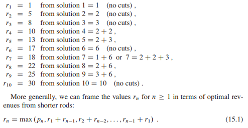
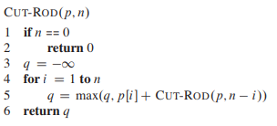
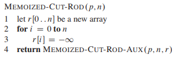
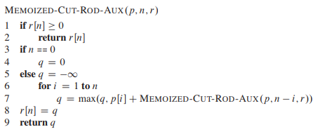
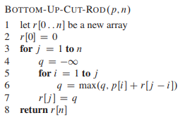
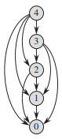
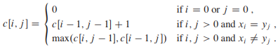
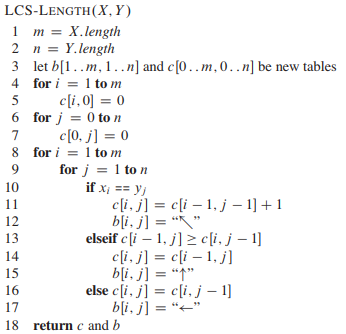
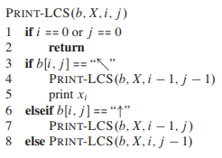
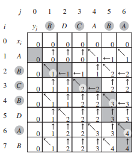

# 动态规划


<!-- @import "[TOC]" {cmd="toc" depthFrom=1 depthTo=6 orderedList=false} -->
<!-- code_chunk_output -->

* [动态规划](#动态规划)
	* [钢条切割](#钢条切割)
		* [自顶向下递归实现](#自顶向下递归实现)
		* [自顶向下(带备忘机制)](#自顶向下带备忘机制)
		* [自底向上版本](#自底向上版本)
		* [子问题](#子问题)
	* [动态规划原理](#动态规划原理)
		* [最优子结构](#最优子结构)
		* [重叠子问题](#重叠子问题)
	* [最长公共子序列](#最长公共子序列)
		* [最长公共子序列代码实现](#最长公共子序列代码实现)

<!-- /code_chunk_output -->


动态规划与分治法相似，都是通过组合子问题的解来求解原问题。动态规划应用于子问题重叠的情况，即不同的子问题具有公共的子子问题。在这种情况下，分治算法会作许多不必要的工作，它会反复地求解那些公共子子问题。而动态规划算法对每个子子问题只求解一次，将其解保存在一个表格中，从而无需每次求解一个子子问题时都重新计算，避免了这种不必要的计算工作。

动态规划通常用来求解最优化问题。

我们通常按照如下 4 个步骤来设计一个动态规划算法：
1. 刻画一个最优解的结构特征
2. 递归地定义最优解的值
3. 计算最优解的值，通常采用自底向上的方法
4. 利用计算出的信息构造一个最优解

步骤1～3 是动态规划的基础。如果我们仅仅需要一个最优解的值，而非解本身，可以忽略步骤4。如果哟确实需要做步骤 4 ，有时就需要在执行步骤 3 的过程中维护一些额外信息，以便用来构造一个最优解。

动态规划有两种等价的实现方法：
* 带备忘的自顶向下法
* 自底向上法
两种方法得到的算法具有相同的渐近运行时间，仅有的差异时在某些特殊情况下，自顶向下方法并未真正递归地考察所有可能的子问题。由于没有频繁的递归函数调用的开销，自底向上方法的时间复杂性函数通常具有更小的系数。

## 钢条切割

给定一段长度为 n 英寸的钢条和一个价格表 p ，求切割钢条方案，使得销售收益 r 最大。

| 长度 i    | 1 | 2 | 3 | 4 | 5  | 6  | 7  | 8  | 9  | 10 |
|-----------|---|---|---|---|----|----|----|----|----|----|
| 价格 p[i] | 1 | 5 | 8 | 9 | 10 | 17 | 17 | 20 | 24 | 30 |

最优切割方案：




### 自顶向下递归实现



### 自顶向下(带备忘机制)





### 自底向上版本



```c++
#include <algorithm>
#include <iostream>
#include <vector>

using namespace std;

void cut(std::vector<int> &r, std::vector<int> p, int length) {
  int q = 0;
  for (int j = 1; j <= length; j++) {
    q = 0;
    for (int i = 1; i <= j; i++) {
      q = max(q, p[i] + r[j - i]);
    }
    r[j] = q;
  }
}

int main(int argc, char const *argv[]) {
  std::vector<int> p{0, 1, 5, 8, 9, 10, 17, 17, 20, 24, 30};
  std::vector<int> r(11, 0);
  cut(r, p, 10);

  for (auto i : r) {
    std::cout << i << '\n';
  }
  return 0;
}
```

Run it:

```sh
[breap@breap algorithm]$ gcp cutRod.cpp
0
1
5
8
10
13
17
18
22
25
30
```

### 子问题

当思考一个动态规划问题是，我们应该弄清楚所涉及的子问题以及子问题之间的依赖关系。

问题的子问题图准确地表达了这些信息。

n=4时钢条切割问题的子问题图：



## 动态规划原理
适合应用动态规划方法求解的最优化问题应该具备两个要素：
* 最优子结构
* 子问题重叠

### 最优子结构

如果一个问题的最优解包含其子问题的最优解，我们就称此问题具有最优子结构性质。

发掘最优子结构过程中，实际上遵循了如下的通用模式：
1. 证明问题最优解的第一个组成部分是做出一个选择，例如，选择钢条第一次切割位置。做出这次选择会产生一个或多个待解的子问题。
2. 对于一个给定问题，在其可能的第一步选择中，你假定已经知道哪种选择才会得到最优解。你现在并不关心这种选择具体是如何得到的，只是假定已经知道了这种操作。
3. 给定可获得最优解的选择后，你确定这次选择会产生哪些子问题，以及如何最好地刻画子问题空间。
4. 利用“剪切-粘贴”技术证明：作为构成原问题最优解的组成部分，每个子问题的解就是它本身的最优解。证明这一点是利用反证法：假定子问题的解不是其自身的最优解，那么我们就可以从原问题的解中“剪切”掉这些非最优解，将最优解“粘贴”进去，从而得到原问题一个更优的解，这与最初的解是原问题最优解的前提假设矛盾。

### 重叠子问题

使用动态规划方法求解的最优化问题应该具备的第二个性质是子问题空间必须足够“小”，即问题的递归算法会反复地求解相同的子问题，而不是一直生成新的子问题。如果递归算法反复求解相同的子问题，我们就称最优化问题具有重叠子问题。动态规划算法通常这样利用重叠子问题性质：对每个子问题求解一次，将解存入一个表中，当再次需要这个子问题时直接查表，每次查表的代价为常量时间。

## 最长公共子序列

[最长公共子序列 wikipedia](https://zh.wikipedia.org/wiki/%E6%9C%80%E9%95%BF%E5%85%AC%E5%85%B1%E5%AD%90%E5%BA%8F%E5%88%97)

[最长公共子串 wikipedia](https://zh.wikipedia.org/wiki/%E6%9C%80%E9%95%BF%E5%85%AC%E5%85%B1%E5%AD%90%E4%B8%B2)

我们定义 c[i,j] 表示 X.i 和 Y.j 的 LCS 长度。
根据 LCS 问题的最优子结构性质，可得到如下公式：







下图显示了 LCS-LENGTH对输入序列 X=<A,B,C,B,D,A,B> 和 Y=<B,D,C,A,B,A>生成的结果：



### 最长公共子序列代码实现

```c++
#include <iostream>
#include <string>
#include <vector>

using namespace std;

enum DIRECTION { DEFAULT = 0, LT = 1, TOP = 2, LEFT = 3 };
void LCS_length(string x, string y, vector<vector<int>> &c,
                vector<vector<DIRECTION>> &b) {
  int m = x.size();
  int n = y.size();

  for (int i = 1; i <= m; i++) {
    for (int j = 1; j <= n; j++) {
      if (x[i - 1] == y[j - 1]) {
        c[i][j] = c[i - 1][j - 1] + 1;
        b[i][j] = LT;
      } else if (c[i - 1][j] >= c[i][j - 1]) {
        c[i][j] = c[i - 1][j];
        b[i][j] = TOP;
      } else {
        c[i][j] = c[i][j - 1];
        b[i][j] = LEFT;
      }
    }
  }
}

void print_LCS(vector<vector<DIRECTION>> b, string x, int i, int j) {
  if (i == 0 || j == 0)
    return;
  if (b[i][j] == LT) {
    print_LCS(b, x, i - 1, j - 1);
    std::cout << x[i - 1];
  } else if (b[i][j] == TOP)
    print_LCS(b, x, i - 1, j);
  else
    print_LCS(b, x, i, j - 1);
}

int main(int argc, char const *argv[]) {
  string x = "ABCBDAB";
  string y = "BDCABA";
  const int M = x.size();
  const int N = y.size();

  vector<vector<DIRECTION>> b(M + 1, std::vector<DIRECTION>(N + 1, DEFAULT));
  vector<vector<int>> c(M + 1, std::vector<int>(N + 1, 0));

  LCS_length(x, y, c, b);

  for (int i = 0; i <= M; i++) {
    for (int j = 0; j <= N; j++) {
      std::cout << c[i][j] << ':' << b[i][j] << ',';
    }
    std::cout << '\n';
  }
  print_LCS(b, x, x.size(), y.size());
  std::cout << '\n';
  return 0;
}
```

```sh
[breap@breap algorithm]$ gcp LCS.cpp
0:0,0:0,0:0,0:0,0:0,0:0,0:0,
0:0,0:2,0:2,0:2,1:1,1:3,1:1,
0:0,1:1,1:3,1:3,1:2,2:1,2:3,
0:0,1:2,1:2,2:1,2:3,2:2,2:2,
0:0,1:1,1:2,2:2,2:2,3:1,3:3,
0:0,1:2,2:1,2:2,2:2,3:2,3:2,
0:0,1:2,2:2,2:2,3:1,3:2,4:1,
0:0,1:1,2:2,2:2,3:2,4:1,4:2,
BCBA
```

注:
* 参考 《算法导论 3rd》 第 15 章节

---
- [上一级](README.md)
- 上一篇 -> [开发者测试](developTest.md)
- 下一篇 -> [Eclipse IDE](eclipse.md)
