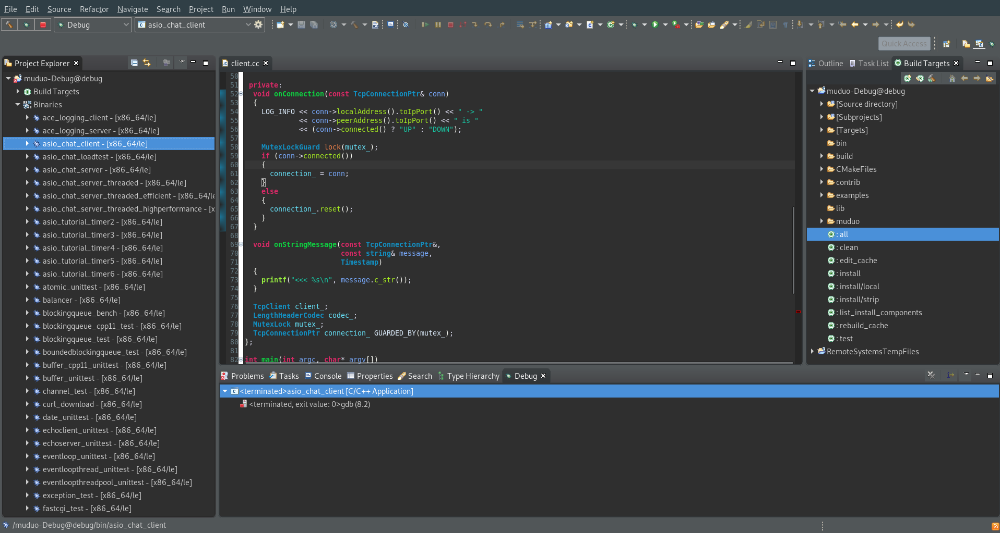

# Eclipse IDE

<!-- @import "[TOC]" {cmd="toc" depthFrom=1 depthTo=6 orderedList=false} -->
<!-- code_chunk_output -->

* [Eclipse IDE](#eclipse-ide)
	* [Import CMake project to eclipse](#import-cmake-project-to-eclipse)
		* [Debug Cmake project](#debug-cmake-project)
	* [Link](#link)

<!-- /code_chunk_output -->

## Import CMake project to eclipse
```sh
mkdir ./cdt && cd ./cdt
# Release
cmake -G "Eclipse CDT4 - Unix Makefiles" $projectDir -DCMAKE_BUILD_TYPE:STRING=Release
# Debug
cmake -G "Eclipse CDT4 - Unix Makefiles" $projectDir -DCMAKE_BUILD_TYPE:STRING=Debug
# cmake will generate a Eclipse project in ./cdt and you can open it in Eclipse.
```

### Debug Cmake project
1. 导入上一步生成的 Debug project；
2. 点击菜单 window->show view->Build Targets
3. 找到 Build Targets 窗口，右键 all 规则 -> build Targets
4. 在 project explorer -> Binaries 中找到想要 debug 的程序，右键 debug as -> local c/c++ application  



## Link
* [How to Import a CMake project into Eclipse CDT?](https://www.systutorials.com/241292/how-to-import-a-cmake-project-into-eclipse-cdt/)
* [eclipse导入Cmake工程](https://blog.csdn.net/sean_8180/article/details/80676261)
* [Build with CMake in Eclipse](http://johnnado.com/use-cmake-with-eclipse/)


- [上一级](README.md)
- 上一篇 -> [动态规划](dynamicProgramming.md)
- 下一篇 -> [利用 enterprise architect 从源代码生成类图](enterpriseArchitectClassView.md)
