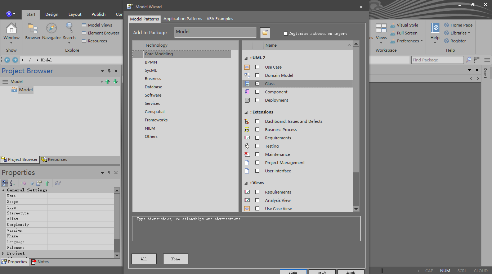
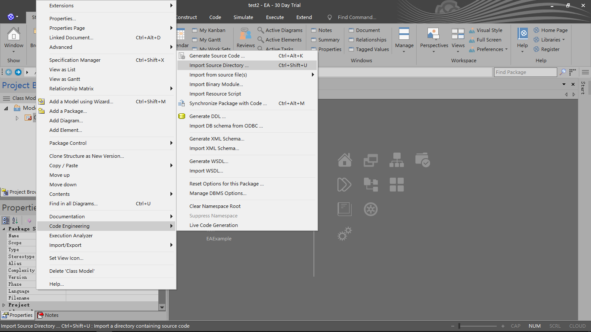
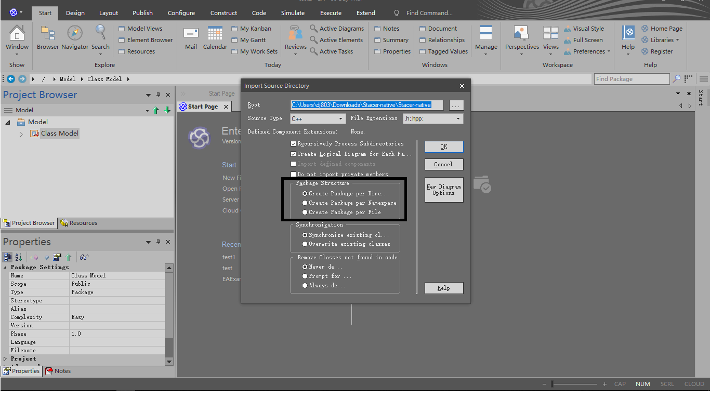
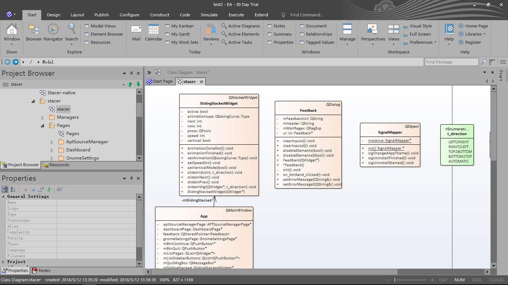

# 利用 enterprise architect 从源代码生成类图

[enterprise architect](http://sparxsystems.com/products/ea/)

1. Create project

2. Choose class view

3. Import source directory

4. Set source code path,select packages structure ([stacer source code](https://github.com/oguzhaninan/Stacer) )

Packages structure:
* create package per directory
* create package per namespace
* create package per file

5. result

Link :
* [How to create class diagram from source code using either Enterprise Architect or Rational Software Architect?](https://stackoverflow.com/questions/12432016/how-to-create-class-diagram-from-source-code-using-either-enterprise-architect-o?utm_medium=organic&utm_source=google_rich_qa&utm_campaign=google_rich_qa)

## 利用 visual studio 2010 将类图导出为 visio 文件

安装 visual studio 2010 和 visio 2010 ，然后按照 [vs2010将类图导入visio](https://blog.csdn.net/shiqijiamengjie/article/details/50884744)即可实现。

再次尝试导出：
*  需要 Visio Professional 2010 ;
* 在我现在的电脑上按照上面的步骤来做，反向生成visio UML 文件失败。
* 于是，我在创建了一个新的 Win10 虚拟机（安装 visual studio 2010 和 visio Professional 2010），就成功导出 visio UML 文件了。
* （oops，猜想是由于我的电脑上 visual studio 版本过多，或者是由于我现在的电脑上还安装了 office 2016(除 visio)）

- [上一级](README.md)
- 上一篇 -> [Eclipse IDE](eclipse.md)
- 下一篇 -> [数据结构-图](graph.md)
