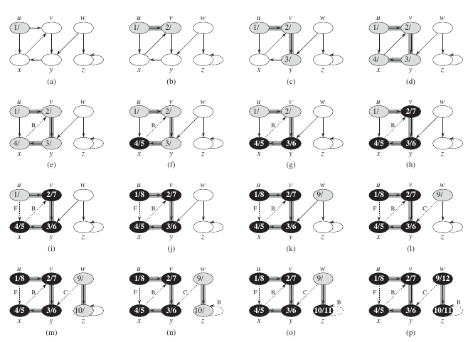

# 数据结构-图


<!-- @import "[TOC]" {cmd="toc" depthFrom=1 depthTo=6 orderedList=false} -->
<!-- code_chunk_output -->

* [数据结构-图](#数据结构-图)
	* [图的表示](#图的表示)
	* [深度优先搜索](#深度优先搜索)
	* [广度优先搜索](#广度优先搜索)

<!-- /code_chunk_output -->

## 图的表示

[图 (数学) wikipedia](https://zh.wikipedia.org/wiki/%E5%9B%BE_(%E6%95%B0%E5%AD%A6))

图又有各种变体，包括简单图/多重图;有向图/无向图等，但大体上有以下两种定义方式：
1. [二元组的定义 wikipedia](https://zh.wikipedia.org/wiki/%E5%9B%BE_(%E6%95%B0%E5%AD%A6)#%E4%BA%8C%E5%85%83%E7%B5%84%E7%9A%84%E5%AE%9A%E7%BE%A9)

2. [三元组的定义 wikipedia](https://zh.wikipedia.org/wiki/%E5%9B%BE_(%E6%95%B0%E5%AD%A6)#%E4%B8%89%E5%85%83%E7%B5%84%E7%9A%84%E5%AE%9A%E7%BE%A9)

对于图 G=(V,E),可以用两种标准方式表示。一种表示方法将图作为邻接链表的组合，另一种表示法则将图作为邻接矩阵来看待。两种表示方法既可以表示无向图，也可以表示有向图。

[邻接链表](https://zh.wikipedia.org/wiki/%E9%82%BB%E6%8E%A5%E8%A1%A8) 因为在表示 稀疏图（边的条树 $|E|$ 远远小于 $|V|^2$ 的图）是非常紧凑而成为通常的选择

[邻接矩阵](https://zh.wikipedia.org/wiki/%E9%82%BB%E6%8E%A5%E7%9F%A9%E9%98%B5-),在稠密图 （ $|E|$ 接近 $|V|^2$ 的图）的情况下，我们可能更加倾向与使用邻接矩阵表示法。另外，如果需要快速判断任意两个节点之间是否有边连接，可能也需要使用邻接矩阵表示法

在有向图和无向图中，邻接链表和邻接矩阵的表示：


不管是有向图还是无向图，邻接链表表示法的存储空间需求均为 $\Theta(V+E)$

邻接矩阵表示法更为简单，因此在图规模比较小的时候，我们可能更加倾向与使用邻接矩阵表示法。而且，对于无向图来说，邻接矩阵还有一个优势：每个记录只需要1位空间。

## 深度优先搜索

[深度优先搜索 wikipedia](https://zh.wikipedia.org/wiki/%E6%B7%B1%E5%BA%A6%E4%BC%98%E5%85%88%E6%90%9C%E7%B4%A2#c++%E4%BB%A3%E7%A0%81)

```c++
#include <iostream>
#include <list>

using namespace std;

class Graph {
private:
  int v;               // vertices
  list<int> * adj;      // pointer to an array containing adjacentcy lists
  void DFSUtil(int v); // A function used by DFS
  bool * visited;

public:
  Graph(int v);
  void addEdge(int v, int w); // function to add an edge to graph
  void DFS();                 // prints DFS traversal of the complete graph
  virtual ~Graph() {
    delete[] adj;
    delete[] visited;
  }
};

Graph::Graph(int v) {
  this->v = v;
  adj = new list<int>[v];
  visited = nullptr;
}

void Graph::addEdge(int v, int w) {
  adj[v].push_back(w); // add w to v's list
}

void Graph::DFSUtil(int v) {
  visited[v] = true;
  std::cout << v << ' ';

  list<int>::iterator i;
  for (i = adj[v].begin(); i != adj[v].end(); ++i) {
    if (visited[*i] == false)
      DFSUtil(*i);
  }
}

void Graph::DFS() {
  visited = new bool[v];
  for (int i = 0; i < v; i++) {
    visited[i] = false;
  }

  // handle disconnected graph
  for (int i = 0; i < v; i++) {
    if (visited[i] == false)
      DFSUtil(i);
  }
}

int main(int argc, char const *argv[]) {
  Graph g(4);
  g.addEdge(0, 1);
  g.addEdge(0, 2);
  g.addEdge(1, 2);
  g.addEdge(2, 0);
  g.addEdge(2, 3);
  g.addEdge(3, 3);

  cout << "Following is Depth First Traversaln:" << endl;
  g.DFS();
  std::cout << '\n';
  return 0;
}
```

Run it:
```sh
Following is Depth First Traversaln:
0 1 2 3
```

[geeksforgeeks.org/depth-first-traversal-for-a-graph](https://www.geeksforgeeks.org/depth-first-traversal-for-a-graph/)


算法导论上的伪代码：


图示：



## 广度优先搜索

[广度优先搜索 wikipedia](https://zh.wikipedia.org/wiki/%E5%B9%BF%E5%BA%A6%E4%BC%98%E5%85%88%E6%90%9C%E7%B4%A2)

```c++
#include <deque>
#include <iostream>
#include <list>

using namespace std;

class Graph {
private:
  int v;
  list<int> * adj;
  bool * visited;

public:
  Graph(int v);
  void addEdge(int v, int w);
  void BFS(int s);
  virtual ~Graph() {
    delete[] adj;
    delete[] visited;
  }
};

Graph::Graph(int v) {
  this->v = v;
  adj = new list<int>[v];
}

void Graph::addEdge(int v, int w) {
  adj[v].push_back(w); // add w to v's list
}

void Graph::BFS(int s) {
  visited = new bool[v];

  for (int i = 0; i < v; i++)
    visited[i] = false;

  deque<int> queue;

  visited[s] = true;
  queue.push_back(s);

  list<int>::iterator i;

  while (!queue.empty()) {
    s = queue.front();
    std::cout << s << ' ';
    queue.pop_front();

    for (i = adj[s].begin(); i != adj[s].end(); i++) {
      if (visited[*i] == false) {
        visited[* i] = true;
        queue.push_back(*i);
      }
    }
  }
}

int main(int argc, char const *argv[]) {
  Graph g(4);
  g.addEdge(0, 1);
  g.addEdge(0, 2);
  g.addEdge(1, 2);
  g.addEdge(2, 0);
  g.addEdge(2, 3);
  g.addEdge(3, 3);

  cout << "Following is Breadth First Traversal "
       << "(starting from vertex 2) \n";
  g.BFS(2);
  std::cout << '\n';
  return 0;
}
```

Run it:
```sh
Following is Breadth First Traversal (starting from vertex 2)
2 0 3 1
```

[geeksforgeeks.org/breadth-first-traversal-for-a-graph](https://www.geeksforgeeks.org/breadth-first-traversal-for-a-graph/)

算法导论上的伪代码：


图示：


注：
* 参考 《算法导论 3rd》 部分章节
* geeksforgeeks.org


[上一级](base.md)
[上一篇](enterpriseArchitectClassView.md)
[下一篇](mulThread.md)
