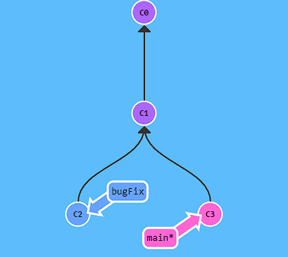
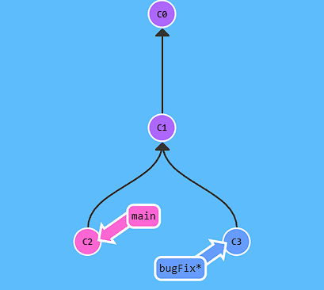
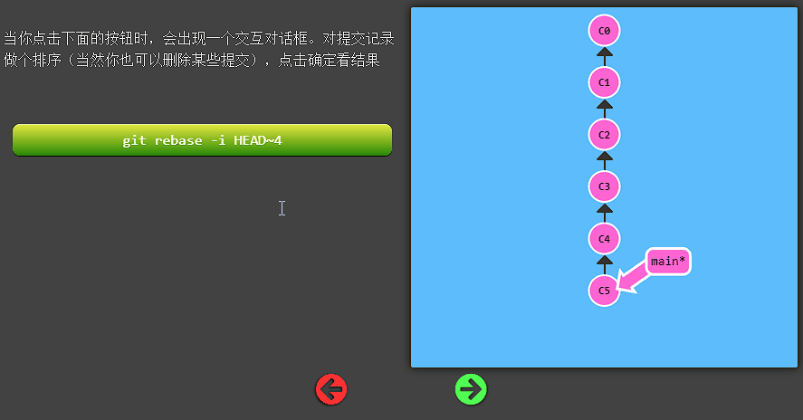
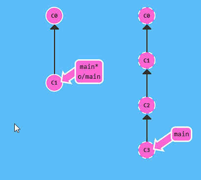
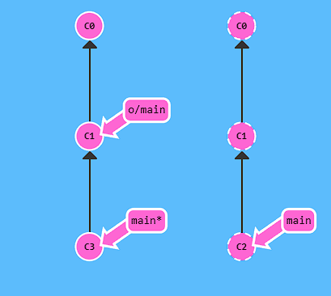
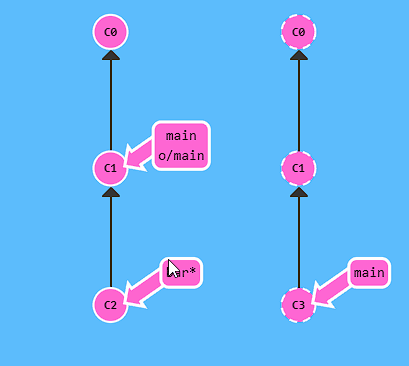

# 轻松学习 Git

<!-- @import "[TOC]" {cmd="toc" depthFrom=1 depthTo=6 orderedList=false} -->

<!-- code_chunk_output -->

- [轻松学习 Git](#轻松学习-git)
  - [简介](#简介)
  - [Git与SVN对比](#git与svn对比)
  - [主要](#主要)
    - [基础](#基础)
      - [分支](#分支)
      - [分支与合并](#分支与合并)
        - [合并 (Merge)](#合并-merge)
        - [变基 (Rebase)](#变基-rebase)
    - [高级篇](#高级篇)
      - [分离头](#分离头)
      - [撤销变更](#撤销变更)
        - [git reset](#git-reset)
        - [git revert](#git-revert)
    - [移动提交记录](#移动提交记录)
      - [git cherry-pick](#git-cherry-pick)
      - [交互式的 rebase](#交互式的-rebase)
  - [远程](#远程)
    - [远程仓库](#远程仓库)
    - [远程分支](#远程分支)
    - [git fetch](#git-fetch)
    - [偏离的提交历史](#偏离的提交历史)
    - [git pull](#git-pull)
  - [其它](#其它)
    - [储藏和引用日志](#储藏和引用日志)
      - [储藏](#储藏)
        - [一般使用](#一般使用)
        - [贮藏的创意性使用](#贮藏的创意性使用)
        - [从贮藏创建一个分支](#从贮藏创建一个分支)
      - [引用日志](#引用日志)
    - [使用 Git 调试](#使用-git-调试)
      - [文件标注](#文件标注)
      - [二分查找](#二分查找)
      - [使用 Pickaxe](#使用-pickaxe)
    - [子模块](#子模块)
    - [钩子](#钩子)
    - [高级操作](#高级操作)
      - [使用 git filter-branch](#使用-git-filter-branch)
        - [使用 git filter-branch 的例子](#使用-git-filter-branch-的例子)
        - [filter-branch 的诱惑](#filter-branch-的诱惑)
      - [git rev-list](#git-rev-list)
      - [数据块的交互式暂存](#数据块的交互式暂存)
      - [恢复遗失的提交](#恢复遗失的提交)
  - [提示、技巧和技术](#提示技巧和技术)
    - [拆分版本库](#拆分版本库)
    - [操作来自两个版本库的分支](#操作来自两个版本库的分支)
    - [从上游变基中恢复](#从上游变基中恢复)
    - [清理](#清理)
    - [使用 git-grep 来搜索版本库](#使用-git-grep-来搜索版本库)
    - [跟踪移动的文件](#跟踪移动的文件)
    - [你来过这里吗？](#你来过这里吗)
  - [参考链接](#参考链接)

<!-- /code_chunk_output -->

## 简介

Git 是一个分布式版本控制软件，最初由 Linus Torvalds 创作，于 2005 年以 GPL 许可协议发布。

版本控制系统，版本控制是指对软件开发过程中各种程序代码、配置文件及说明文档等文件变更的管理，是软件配置管理的核心思想之一，最主要的功能就是`追踪文件的变更`。

`分布式版本控制，它允许软件开发者可以共同参与一个软件开发项目，但是不必在相同的网络系统下工作。其作法是在每个开发者电脑中复制一份完整的代码库以及完整历史。因此在无法连接网络时，仍可以进行软件的分支及合并，可以加速大部分的作业，增加此情形可以进行的工作，而且系统的代码库可以在多家电脑上备份，不需靠单一位置的备份。而多个位置的代码库再透过其他机制来达到同步。`

## Git与SVN对比

`SVN` 是集中式管理的版本控制器，而 `Git` 是分布式管理的版本控制器，这是两者之间最核心的区别。
`SVN` 只有一个单一的集中管理的服务器，保存所有文件的修订版本，而协同工作的人们都通过客户端连到这台服务器，取出最新的文件或者提交更新。
`Git` 是在每个开发者电脑中复制一份完整的代码库以及完整历史。命令较多，功能强大。
相对来说分布式管理系统功能更强大一些，但同样的上手难度也就高一些。

详细对比：
| 差异     | SVN                                                                                                                                                                                                               | Git                                                                                                                                                                                                                                                      |
|----------|-------------------------------------------------------------------------------------------------------------------------------------------------------------------------------------------------------------------|----------------------------------------------------------------------------------------------------------------------------------------------------------------------------------------------------------------------------------------------------------|
| 系统特点 | 1. 集中式版本控制系统，文档管理很方便。 2. 企业内部并行集中开发 3. 克隆一个拥有将近一万个提交commit，五个分支，每个分支有大约1500个文件，用时将近一个小时                                                         | 1. 分布式系统，代码管理很方便。 2. 开源项目开发。 3. 克隆一个拥有将近一万个提交commit、五个分支、每个分支有大约1500个文件，用时1分钟。                                                                                                                   |
| 灵活性   | 1. 搭载SVN的服务器如果出现故障，就无法与之交互。 2. 所有的SVN操作都需要中央仓库交互，例如拉分支，看日志等。                                                                                                       | 1. 可以单机操作，Git服务器故障也可以在本地Git仓库工作。 2. 除了push和pull或fetch操作，其他都可以在本地操作。 3. 根据自己开发任务任意在本地创建分支。 4. 日志都是在本地查看，效率较高。                                                                   |
| 安全性   | 较差，定期备份，并且是整个SVN都得备份。                                                                                                                                                                           | 较高，每个开发者的本地就是一套完整版本库，记录着版本库的所有信息。                                                                                                                                                                                       |
| 分支方面 | 1. 拉分支更像是copy一个路径。 2. 可针对任何子目录进行branch。 3. 拉分支的时间较慢，因为拉分支相当于copy。 4.创建完分支后，影响全部成员，每个人都会拥有这个分支。 5.多分支并行开发较重，工作较多而且繁琐。         | 1. 我可以在Git的任意一个提交点commit point开启分支。 2. 拉分支时间较快，因为拉分支只是创建文件的指针和HEAD。 3. 自己本地创建的分支不会影响其他人。 4. 比较适合多分支并行开发。 5. Git checkout 切回之前的版本，无需版本回退。 6. 强大的cherry-pick。 |
| 工作流程 | 1. 每次更改文件之前都得update操作，有的时候修改过程中这个文件有更新，commit不会成功。 2. 有冲突，会打断提交动作，冲突解决是一个提交速度的竞赛：手快者，先提交，平安无事；手慢者，后提交，可能遇到麻烦的冲突解决。 | 1. 开始工作前进行fetch操作，完成开发工作后push操作，有冲突解决冲突。 2. Git的提交过程不会被打断，有冲突会标记冲突文件。 3. Gitflow经典流程。                                                                                                             |
| 内容管理 | 操作简单。                                                                                                                                                                                       | 对程序的源代码管理方便，代码库占用的空间少，易于分支化管理。                                                                                                                                                                                             |
| 学习成本 | 使用起来更方便，操作简单。                                                                                                                                                                       | 更在乎效率而不是易用性，成本较高，有很多独有的命令如rebase、远程仓库交互的命令等等。                                                                                                                                                                     |
| 权限管理 | SVN的权限管理相当严格，可以按组、个人针对某个子目录的权限控制，每个目录下都会有个.SVN的隐藏文件。                                                                                                                 | Git没有严格的权限管理控制，只有账号角色划分。                                                                                                                                                                                                            |
| 管理平台 | 有功能非常完善的插件。                                                                                                                                                                                            | 除功能插件外，还有Gitlab、Gerrit、Github等。                                                                                                                                                                                                             |

## 主要

### 基础

Git 有三个比较重要的概念：

1. `工作目录`
2. `索引`（用来暂存(stage)、收集或者修改）
3. `对象库`

当使用 Git 来管理代码时，会在工作目录下编辑，在索引中积累修改，然后把索引中累积的修改作为一次性的变更来提交。

Git 将所有文件分为 3 类：已追踪的、被忽略的以及未追踪的。

- `已追踪的` (Tracked)
  - 指已经在版本库的文件，或者是已暂存到索引中的文件。
- `被忽略的` (Ignored)
  - 被忽略的文件必须在版本库中被明确声明为不可见或被忽略（可通过改写 `.gitignore` 文件来实现），即使它可能会在你的工作目录中出现。
- `未追踪的` (Untracked)
  - 指那些不在前两类中的文件。

#### 分支

`Git 的分支非常轻量。它们只是简单地指向某个提交纪录 —— 仅此而已。`
这是因为即使创建再多的分支也不会造成储存或内存上的开销，并且按逻辑分解工作到不同的分支要比维护那些特别臃肿的分支简单多了。
在将分支和提交记录结合起来后，我们会看到两者如何协作。现在只要记住使用分支其实就相当于在说：“我想基于这个提交以及它所有的父提交进行新的工作。”

#### 分支与合并

##### 合并 (Merge)

在 Git 中合并两个分支时会产生一个特殊的提交记录，它有两个父节点。翻译成自然语言相当于：“我要把这两个父节点本身及它们所有的祖先都包含进来。”

```sh
git merge bufFix
```



##### 变基 (Rebase)

`Rebase` `实际上就是取出一系列的提交记录，“复制”它们，然后在另外一个地方逐个的放下去。`

`Rebase` `的优势就是可以创造更线性的提交历史`，这听上去有些难以理解。如果只允许使用 `Rebase` 的话，代码库的提交历史将会变得异常清晰。

```sh
git rebase main
```



### 高级篇

#### 分离头

`分离的 HEAD 就是让其指向了某个具体的提交记录而不是分支名。`在命令执行之前的状态如下所示：
`HEAD -> main -> C1`

```sh
git checkout c1 
```


在这个情况下你可以查看、并且做些代码调试，还可以提交他们，在这种状态下，如果checkout到其他分支，完全可以丢弃在此基础上做的修改,而不会影响到其他分支。 如果你想保留本次的修改，你可以使用” `git checkout -b` 新的分支名”来保留它(现在或者以后都可以)。

有时候我们不想为某次的修改单独创建一个分支，也没有想要提交到版本库的意思，只是做下调试，那么我们就可以使用git提供的分离头指针方法。

注：如果在分离头状态下添加了提交，并且切换到其他分支上，可以使用 `git reflog` 来找回提交。详见 [What happens to git commits created in a detached HEAD state?](https://stackoverflow.com/questions/9984223/what-happens-to-git-commits-created-in-a-detached-head-state)

#### 撤销变更

主要有两种方法用来撤销变更. 一是 `git reset`，还有就是 `git revert`；

##### git reset

`git reset` 通过把分支记录回退几个提交记录来实现撤销改动。`你可以将这想象成“改写历史”`。`git reset` 向上移动分支，原来指向的提交记录就跟从来没有提交过一样。

```sh
git reset HEAD~1
```


Git 把 main 分支移回到 C1；现在我们的本地代码库根本就不知道有 C2 这个提交了

##### git revert

虽然在你的本地分支中使用 `git reset` 很方便，但是这种“改写历史”的方法对大家一起使用的远程分支是无效的！
为了撤销更改并分享给别人，我们需要使用 `git revert`。

```sh
git revert HEAD
```


### 移动提交记录

到现在我们已经学习了 Git 的基础知识 —— 提交、分支以及在提交树上移动。 这些概念涵盖了 `Git 90%` 的功能，同样也足够满足开发者的日常需求

然而, 剩余的 `10%` 在处理复杂的工作流时(或者当你陷入困惑时）可能就显得尤为重要了。接下来要讨论的这个话题是“整理提交记录” ——`开发人员有时会说“我想要把这个提交放到这里, 那个提交放到刚才那个提交的后面”`, 而接下来就讲的就是它的实现方式，非常清晰、灵活，还很生动。

（还比如在多个分支并行开发中，有同事修复了一个bug，这个bug也在另一个分支中出现了，但又不能合并分支）

#### git cherry-pick

命令形式为:

- [git cherry-pick](https://git-scm.com/docs/git-cherry-pick) <提交号>...

`如果你想将一些提交复制到当前所在的位置（HEAD）下面的话， Cherry-pick 是最直接的方式了。`我个人非常喜欢 cherry-pick，因为它特别简单。

这里有一个仓库, 我们想将 side 分支上的工作复制到 main 分支，你立刻想到了之前学过的 rebase 了吧？但是咱们还是看看 cherry-pick 有什么本领吧。

```sh
git cherry-pick C2 C4 
```


这就是了！我们只需要提交记录 C2 和 C4，所以 Git 就将被它们抓过来放到当前分支下了。 就是这么简单!

#### 交互式的 rebase

交互式 rebase 指的是使用带参数 `--interactive` 的 `rebase` 命令, 简写为 `-i`

如果你在命令后增加了这个选项, Git 会打开一个 UI 界面并列出将要被复制到目标分支的备选提交记录，它还会显示每个提交记录的哈希值和提交说明，提交说明有助于你理解这个提交进行了哪些更改。
`当 rebase UI界面打开时, 你能做3件事:`

- `调整提交记录的顺序`（通过鼠标拖放来完成）
- `删除你不想要的提交`（通过切换 pick 的状态来完成，关闭就意味着你不想要这个提交记录）
- `合并提交`。它允许你把多个提交记录合并成一个。



## 远程

### 远程仓库

远程仓库并不复杂, 在如今的云计算盛行的世界很容易把远程仓库想象成一个富有魔力的东西, 但`实际上它们只是你的仓库在另个一台计算机上的拷贝`。你可以通过因特网与这台计算机通信 —— 也就是增加或是获取提交记录

话虽如此, 远程仓库却有一系列强大的特性

- 首先也是最重要的的点, 远程仓库是一个强大的备份。本地仓库也有恢复文件到指定版本的能力, 但所有的信息都是保存在本地的。有了远程仓库以后，即使丢失了本地所有数据, 你仍可以通过远程仓库拿回你丢失的数据。

- 还有就是, 远程让代码社交化了! 既然你的项目被托管到别的地方了, 你的朋友可以更容易地为你的项目做贡献(或者拉取最新的变更)

现在用网站来对远程仓库进行可视化操作变得越发流行了(像 `GitHub` 或 `Phabricator`), 但远程仓库永远是这些工具的顶梁柱, 因此理解其概念非常的重要!

```sh
git clone $repositoryAddr
```


### 远程分支

既然你已经看过 `git clone` 命令了，咱们深入地看一下发生了什么。

你可能注意到的第一个事就是在我们的本地仓库多了一个名为 `o/main` 的分支, 这种类型的分支就叫远程分支。由于远程分支的特性导致其拥有一些特殊属性。

`远程分支反映了远程仓库(在你上次和它通信时)的状态。`这会有助于你理解本地的工作与公共工作的差别 —— 这是你与别人分享工作成果前至关重要的一步.

远程分支有一个特别的属性，在你检出时自动进入分离 HEAD 状态。Git 这么做是出于不能直接在这些分支上进行操作的原因, 你必须在别的地方完成你的工作, （更新了远程分支之后）再用远程分享你的工作成果。

为什么有 `o/` ？
你可能想问这些远程分支的前面的 `o/` 是什么意思呢？好吧, 远程分支有一个命名规范 —— 它们的格式是:

- `<remote name>/<branch name>`
因此，如果你看到一个名为 `o/main` 的分支，那么这个分支就叫 `main` ，远程仓库的名称就是 `o` 。

大多数的开发人员会将它们主要的远程仓库命名为 `origin` ，并不是 `o` 。这是因为当你用 `git clone` 某个仓库时，Git 已经帮你把远程仓库的名称设置为 `origin` 了

不过 `origin` 对于我们的 UI 来说太长了，因此不得不使用简写 `o` :) 但是要记住, 当你使用真正的 Git 时, 你的远程仓库默认为 `origin`!

说了这么多，让我们看看实例。

如果检出远程分支会怎么样呢？


正如你所见，Git 变成了分离 HEAD 状态，当添加新的提交时 `o/main` 也不会更新。这是因为 `o/main` 只有在远程仓库中相应的分支更新了以后才会更新。

### git fetch

`git fetch` 做了些什么

- 从远程仓库下载本地仓库中缺失的提交记录
- 更新远程分支指针(如 `o/main`)

`git fetch` `实际上将本地仓库中的远程分支更新成了远程仓库相应分支最新的状态。`

不会做的事情：

- `并不会改变你本地仓库的状态。`它不会更新你的分支，也不会修改你磁盘上的文件。

我们可以将 `git fetch` 理解为单纯的下载操作。



### 偏离的提交历史

假设你周一克隆了一个仓库，然后开始研发某个新功能。到周五时，你新功能开发测试完毕，可以发布了。但是 —— 天啊！你的同事这周写了一堆代码，还改了许多你的功能中使用的 API，这些变动会导致你新开发的功能变得不可用。但是他们已经将那些提交推送到远程仓库了，因此你的工作就变成了基于项目旧版的代码，与远程仓库最新的代码不匹配了。

这种情况下, `git push` 就不知道该如何操作了。如果你执行 `git push`，Git 应该让远程仓库回到星期一那天的状态吗？还是直接在新代码的基础上添加你的代码，亦或由于你的提交已经过时而直接忽略你的提交？

因为这情况（历史偏离）有许多的不确定性，Git 是不会允许你 push 变更的。实际上它会强制你先合并远程最新的代码，然后才能分享你的工作。
`rebase` 示例：

```sh
git fetch;git rebase o/main;git push
```



`git pull` 就是 `fetch` 和 `merge` 的简写，类似的 `git pull --rebase` 就是 `fetch` 和 `rebase` 的简写！

### git pull

以下命令在 Git 中是等效的:

`git pull origin foo` 相当于：

`git fetch origin foo; git merge o/foo`

看到了? `git pull` 实际上就是 `fetch + merge` 的缩写, `git pull` 唯一关注的是提交最终合并到哪里（也就是为 `git fetch` 所提供的 destination 参数）



rebase 与 merge 的讨论：
Rebase 优点:

- `使你的提交树变得很干净, 所有的提交都在一条线上`
  
缺点:

- `修改了提交树的历史`
比如, 提交 C1 可以被 rebase 到 C3 之后。这看起来 C1 中的工作是在 C3 之后进行的，但实际上是在 C3 之前。

一些开发人员喜欢保留提交历史，因此更偏爱 merge。而其他人（比如我自己）可能更喜欢干净的提交树，于是偏爱 rebase。仁者见仁，智者见智。

## 其它

### 储藏和引用日志

#### 储藏

##### 一般使用

在日常开发周期中，当要经常中断、修复 bug、处理来自同事或经理的请求，导致弄乱了你正在进行中的工作时，你是否感到不堪重负？如果是这样，那么储藏（stash） 就是来帮助你的！
`储藏可以捕获你的工作进度，允许你保存工作进度并且当你方便时再回到该进度。`

将新的贮藏推送到栈上，运行 `git stash` 或 `git stash push`：

```sh
$ git stash
Saved working directory and index state \
  "WIP on master: 049d078 added the index file"
HEAD is now at 049d078 added the index file
(To restore them type "git stash apply")
```

要查看贮藏的东西，可以使用 `git stash list`：

```sh
$ git stash list
stash@{0}: WIP on master: 049d078 added the index file
stash@{1}: WIP on master: c264051 Revert "added file_size"
stash@{2}: WIP on master: 21d80a5 added number to log
```

可以通过原来 stash 命令的帮助提示中的命令将你刚刚贮藏的工作重新应用：`git stash apply`。 如果想要应用其中一个更旧的贮藏，可以通过名字指定它，像这样：`git stash apply stash@{2}`。 如果不指定一个贮藏，Git 认为指定的是最近的贮藏：

```sh
$ git stash apply
On branch master
Changes not staged for commit:
  (use "git add <file>..." to update what will be committed)
  (use "git checkout -- <file>..." to discard changes in working directory)

 modified:   index.html
 modified:   lib/simplegit.rb

no changes added to commit (use "git add" and/or "git commit -a")
```

也可以运行 `git stash pop` 来应用贮藏然后立即从栈上扔掉它。

##### 贮藏的创意性使用

有几个贮藏的变种可能也很有用。

- 第一个非常流行的选项是 `git stash` 命令的 `--keep-index` 选项。 它告诉 Git 不仅要贮藏所有已暂存的内容，同时还要将它们保留在索引中。
- 另一个经常使用贮藏来做的事情是像贮藏跟踪文件一样贮藏未跟踪文件。 默认情况下，`git stash` 只会贮藏已修改和暂存的 已跟踪 文件。 如果指定 `--include-untracked` 或 `-u` 选项，Git 也会贮藏任何未跟踪文件。 然而，在贮藏中包含未跟踪的文件仍然不会包含明确 忽略 的文件。 要额外包含忽略的文件，请使用 `--all` 或 `-a` 选项。
- 如果指定了 `--patch` 标记，Git 不会贮藏所有修改过的任何东西， 但是会交互式地提示哪些改动想要贮藏、哪些改动需要保存在工作目录中。

##### 从贮藏创建一个分支

如果贮藏了一些工作，将它留在那儿了一会儿，然后继续在贮藏的分支上工作，在重新应用工作时可能会有问题。 如果应用尝试修改刚刚修改的文件，你会得到一个合并冲突并不得不解决它。 如果想要一个轻松的方式来再次测试贮藏的改动，可以运行 `git stash branch <new branchname>` 以你指定的分支名创建一个新分支，检出贮藏工作时所在的提交，重新在那应用工作，然后在应用成功后丢弃贮藏：

```sh
$ git stash branch testchanges
M index.html
M lib/simplegit.rb
Switched to a new branch 'testchanges'
On branch testchanges
Changes to be committed:
  (use "git reset HEAD <file>..." to unstage)

 modified:   index.html

Changes not staged for commit:
  (use "git add <file>..." to update what will be committed)
  (use "git checkout -- <file>..." to discard changes in working directory)

 modified:   lib/simplegit.rb

Dropped refs/stash@{0} (29d385a81d163dfd45a452a2ce816487a6b8b014)
```

#### 引用日志

有时候 Git 会做出一些很神奇的举动而导致用户不知道刚刚发生了什么。有时你可能只是简单地想知道 “等下，我现在在哪儿？刚才发生了什么？”其他时候，你做了某个操作然后意识到，“哦，我不该这么做！”但是为时已晚，你已经失去了那价值一个星期工作量的头提交。

不要慌！ Git 的引用日志已经考虑到了这些情况！`使用引用日志可以确保操作会如你预期般地发生在你计划的分支上，并且你有能力恢复丢失的提交以防误入歧途。`
一些会更新引用日志的基本操作包括：

- 复制；
- 推送；
- 执行新提交；
- 修改或创建分支；
- 变基操作；
- 重置操作。

需要注意的是一些更复杂、深奥的操作，如 [git filter-branch](https://git-scm.com/docs/git-filter-branch) ,最终都可以归结到简单的提交上，因此也会记录下来。从根本上来说，任何修改引用或更改分支头的 Git 操作都会记录下来。

默认情况下，引用日志在非裸版本库中是启用的，在裸版本中是禁用的。

[git-reflog](https://git-scm.com/docs/git-reflog)  可管理引用日志。

还有一个值得管理的问题需要解决。如果 Git 为版本库中每个引用的每次操作都维护一个事务历史记录，那么引用日志最终不就会变得非常巨大吗？
幸运的是，这并不会发生，Git 会时不时地自动执行垃圾回收进程。在这个过程中，一些老旧的引用日志条目会过期并被丢弃。通常情况下，一个提交，如果既不能从某个分支或引用指向，也不可达，将会默认在 30 天过期，而那些可达的提交将默认在 90 天后过期。

储藏和引用日志是密切相关的。事实上，储藏正是通过 `stash` 引用的引用日志来实现的。

### 使用 Git 调试

#### 文件标注

如果你在追踪代码中的一个 bug，并且想知道是什么时候以及为何会引入，文件标注通常是最好用的工具。 `它能显示任何文件中每行最后一次修改的提交记录。` 所以，如果你在代码中看到一个有 bug 的方法，你可以使用 [git blame](https://git-scm.com/docs/git-blame) 标注这个文件，查看哪一次提交引入了这行。

以下示例用 `git blame` 确定了 Linux 内核源码顶层的 Makefile 中每一行分别来自哪个提交和提交者， 此外用 -L 选项还可以将标注的输出限制为该文件中的第 69 行到第 82 行。

```sh
$ git blame -L 69,82 Makefile
b8b0618cf6fab (Cheng Renquan  2009-05-26 16:03:07 +0800 69) ifeq ("$(origin V)", "command line")
b8b0618cf6fab (Cheng Renquan  2009-05-26 16:03:07 +0800 70)   KBUILD_VERBOSE = $(V)
^1da177e4c3f4 (Linus Torvalds 2005-04-16 15:20:36 -0700 71) endif
^1da177e4c3f4 (Linus Torvalds 2005-04-16 15:20:36 -0700 72) ifndef KBUILD_VERBOSE
^1da177e4c3f4 (Linus Torvalds 2005-04-16 15:20:36 -0700 73)   KBUILD_VERBOSE = 0
^1da177e4c3f4 (Linus Torvalds 2005-04-16 15:20:36 -0700 74) endif
^1da177e4c3f4 (Linus Torvalds 2005-04-16 15:20:36 -0700 75)
066b7ed955808 (Michal Marek   2014-07-04 14:29:30 +0200 76) ifeq ($(KBUILD_VERBOSE),1)
066b7ed955808 (Michal Marek   2014-07-04 14:29:30 +0200 77)   quiet =
066b7ed955808 (Michal Marek   2014-07-04 14:29:30 +0200 78)   Q =
066b7ed955808 (Michal Marek   2014-07-04 14:29:30 +0200 79) else
066b7ed955808 (Michal Marek   2014-07-04 14:29:30 +0200 80)   quiet=quiet_
066b7ed955808 (Michal Marek   2014-07-04 14:29:30 +0200 81)   Q = @
066b7ed955808 (Michal Marek   2014-07-04 14:29:30 +0200 82) endif
```

另一件比较酷的事情是 Git 不会显式地记录文件的重命名。 它会记录快照，然后在事后尝试计算出重命名的动作。 这其中有一个很有意思的特性就是你可以让 Git 找出所有的代码移动。 如果你在 `git blame` 后面加上一个 `-C`，Git 会分析你正在标注的文件， 并且尝试找出文件中从别的地方复制过来的代码片段的原始出处。 比如，你将 GITServerHandler.m 这个文件拆分为数个文件，其中一个文件是 GITPackUpload.m。 对 GITPackUpload.m 执行带 -C 参数的 blame 命令，你就可以看到代码块的原始出处：

```sh
$ git blame -C -L 141,153 GITPackUpload.m
f344f58d GITServerHandler.m (Scott 2009-01-04 141)
f344f58d GITServerHandler.m (Scott 2009-01-04 142) - (void) gatherObjectShasFromC
f344f58d GITServerHandler.m (Scott 2009-01-04 143) {
70befddd GITServerHandler.m (Scott 2009-03-22 144)         //NSLog(@"GATHER COMMI
ad11ac80 GITPackUpload.m    (Scott 2009-03-24 145)
ad11ac80 GITPackUpload.m    (Scott 2009-03-24 146)         NSString *parentSha;
ad11ac80 GITPackUpload.m    (Scott 2009-03-24 147)         GITCommit *commit = [g
ad11ac80 GITPackUpload.m    (Scott 2009-03-24 148)
ad11ac80 GITPackUpload.m    (Scott 2009-03-24 149)         //NSLog(@"GATHER COMMI
ad11ac80 GITPackUpload.m    (Scott 2009-03-24 150)
56ef2caf GITServerHandler.m (Scott 2009-01-05 151)         if(commit) {
56ef2caf GITServerHandler.m (Scott 2009-01-05 152)                 [refDict setOb
56ef2caf GITServerHandler.m (Scott 2009-01-05 153)
```

#### 二分查找

当你知道问题是在哪里引入的情况下文件标注可以帮助你查找问题。 如果你不知道哪里出了问题，并且自从上次可以正常运行到现在已经有数十个或者上百个提交， 这个时候你可以使用 [git bisect](https://git-scm.com/docs/git-bisect) 来帮助查找。 `bisect 命令会对你的提交历史进行二分查找来帮助你尽快找到是哪一个提交引入了问题。`

具体步骤：

1. 首先执行 `git bisect start` 来启动
2. 接着执行 `git bisect bad` 来告诉系统当前你所在的提交是有问题的。
3. 然后你必须使用 `git bisect good <good_commit>`，告诉 bisect 已知的最后一次正常状态是哪次提交
4. 查找的过程中使用 `git bisect bad` 或者 `git bisect good` 来告诉 Git 这个提交是否有问题。
5. 重复 二分查找 直到定位到问题。
6. 执行 `git bisect reset` 重置你的 HEAD 指针到最开始的位置， 否则你会停留在一个奇怪的状态。

这是一个可以帮助你在几分钟内从数百个提交中找到 bug 的强大工具。 事实上，如果你有一个脚本在项目是正常的情况下返回 0，在不正常的情况下返回非 0，你可以使 `git bisect` 自动化这些操作。 首先，你设定好项目正常以及不正常所在提交的二分查找范围。 你可以通过 `bisect start` 命令的参数来设定这两个提交，第一个参数是项目不正常的提交，第二个参数是项目正常的提交：

```sh
git bisect start HEAD v1.0
git bisect run test-error.sh
```

Git 会自动在每个被检出的提交里执行 test-error.sh，直到找到项目第一个不正常的提交。 你也可以执行 `make` 或者 `make tests` 或者其他东西来进行自动化测试。

#### 使用 Pickaxe

`git blame` 命令告诉你文件的当前状态，`git log -S$STRING` 则根据给定的 `STRING` 沿着文件的差异历史搜索。`通过搜索修订版本间的实际差异，这个命令可以找到那些执行改变（增加或删除）的提交。`  

```sh
$ git log -Sinclude --pretty=oneline --abbrev-commit init/version.c 
cd354f1... [PATCH] remove many unneeded #includes of sched.h 
4865ecf... [PATCH] namespaces: utsname: implement utsname namespaces 
63104ee... kbuild: introduce utsrelease.h 
1da177e... Linux-2.6.12-rc2 
```

排列在左侧的每个提交（例如 cd354f1） 都添加或删除了那些包含 `include` 的行。但是要注意，如果某个提交添加和删除了相同数量的含关键字的行，它将不会显示出来。该提交必须有添加和删除数量上的变化才能计数。

带有 `-S` 选项的 `git log` 命令称为 Pickaxe，对你来说这是一种暴力考古。

### 子模块

有种情况我们经常会遇到：某个工作中的项目需要包含并使用另一个项目。 也许是第三方库，或者你独立开发的，用于多个父项目的库。 现在问题来了：你想要把它们当做两个独立的项目，同时又想在一个项目中使用另一个。

这个时候，如果将代码复制到自己的项目中，那么你做的任何自定义修改都会使合并上游的改动变得困难。
Git 通过子模块来解决这个问题。 `子模块允许你将一个 Git 仓库作为另一个 Git 仓库的子目录。 它能让你将另一个仓库克隆到自己的项目中，同时还保持提交的独立。`

详见 [Git 工具 - 子模块](https://git-scm.com/book/zh/v2/Git-%E5%B7%A5%E5%85%B7-%E5%AD%90%E6%A8%A1%E5%9D%97)

### 钩子

`你可以使用 Git 钩子(hook)，任何时候当版本库中出现如提交或补丁这样的特殊事件时，都会触发执行一个或多个任意的脚本。`通常情况下，一个事件会分解成多个规定好的步骤，可以为每个步骤绑定自定义脚本。当 Git 事件发生时，每一步开始都会调用相应的脚本。

`钩子只属于并作用于一个特定的版本库，在克隆操作时不会复制。`如果由于某些原因要复制钩子，就需要使用一些其他方法（非克隆）来复制 `.git/hook` 目录。

大多数 Git 钩子属于这两类。

- `前置(pre)钩子` - 会在动作完成前调用。要在变更应用前进行批准、拒绝或者调整操作，可以使用这种钩子。
- `后置(post) 钩子` - 会在动作完成之后调用，它常用来触发通知或者进行额外的处理，如执行构建或关闭 bug。

`一般而言，Git 开发人员主张谨慎地使用钩子。`

咋一看，钩子似乎是一个直接且有吸引力的解决方案。然而，它的使用会牵连很多东西。

- `会改变 Git 的行为。`
- `可以使原来很快的操作变得很慢。`
- `一个出问题的钩子脚本会影响你的工作和效率。`
- `版本库中的钩子不会自动复制。`

当前 Git 的维护者 对钩子的总体看法：
有 5 个合理的理由去为 Git 命令或操作添加钩子。

1. `为了撤销底层命令做出的决定。` update 和 pre-commit 钩子都是用于这个目的。
2. `为了在命令开始执行后对生成的数据进行操作。`例如，使用 commit-msg 钩子修改提交日志信息。
3. `在仅能使用 Git 协议访问时，对连接的远程端进行操作。`执行 git update-server-info 的 post-update 钩子就是为了完成这个任务的。
4. `为了获得互斥锁。`这是一个很少见的需求，但还是有钩子能实现它。
5. `为了根据命令的输出执行几种可能的操作之一。` post-checkout 钩子就是一个明显的例子。
  
`有了那些背后的“警告”，我们可以说钩子的存在时出于很好的理由，而且能够带来令人难以置信的好处。`

详见 [自定义 Git - Git 钩子](https://git-scm.com/book/zh/v2/%E8%87%AA%E5%AE%9A%E4%B9%89-Git-Git-%E9%92%A9%E5%AD%90)

### 高级操作

#### 使用 git filter-branch

[git filter-branch](https://git-scm.com/docs/git-filter-branch) 是一个通用的分支操作命令，可以通过自定义命令来利用它操作不同的 git 对象，从而重写分支上的提交。一些过滤器可以对 “提交” 起作用，一些对 “树对象” 和 目录结构起作用，还有一些则可以操作 git 环境。
是不是听起来挺有用的但是又挺危险的？
很好！
可能你也想到了，强大的功能伴随着巨大的责任。`它具有改写整个版本库提交历史的潜能，如果对一个已经对外发布供大家克隆和使用的版本库执行此命令，将会给使用该版本库的其他人带来无尽的苦恼。`和所有的 rebase 操作一样，提交历史记录会改变。执行此命令后，之前克隆来的所有版本库都应该作为过时的。

##### 使用 git filter-branch 的例子

- 使用 git filter-branch 删除文件（彻底删除，就像这个文件从来没有在这个版本库中存在的那样）
  - 可使用 `--tree-filter` 或 `--index-filter`
  - 如果这个文件曾经移动或者改过名字，可以使用 `git log --name-only --follow --all - file` 来找出它们。
- 使用 filter-branch 编辑提交信息
  - 可使用 `--msg-filter`

##### filter-branch 的诱惑

我们需要从这条 Git 命令的名字上理解它的作用：它是用来过滤分支的。首先，git file-branch 命令用来作用域一个分支或引用。然而，它同样可以作用于多个分支和引用。在很多场景中，需要把 filter-branch 操作作用于所有分支，从而覆盖全版本库。要实现这样的操作，可以在命令后面添加 `--all`。

#### git rev-list

[git rev-list](https://git-scm.com/docs/git-rev-list) 致力于提供丰富的选项组合，帮助用户对有很多分支的复杂提交历史记录排序，挖掘潜在模糊的用户特征，限制搜索空间，最后在提交提交历史记录中定位特定的提交。它会输出一个或多个 SHA1 ID ,供其他工具使用。`可以把 git recv-list 想象成版本库中用于提交数据库的前端查询工具`

示例：

- 基于日期的查询 `git rev-list --after="Jan 1,2011 00:00:00" --before="Jan 1,2012"`
- 查询指定文件(date.c)的提交 `git rev-list master -- date.c`
- 查询指定目录(src)的提交 `git rev-list master -- src`

#### 数据块的交互式暂存

这是一个非常强大的工具，可以用来组织和简化开发过程中的提交，使其简单易懂。如果曾有人`要求过你拆分你提交的补丁`，或者`要求过你提交的补丁时候要做到主题特性一个补丁`，那么这一节特别适合。

将所有那些不同且不相关的改动作为一个补丁提交，似乎并不是很好的做法，这样会显得逻辑很混乱。事实上，一些开源项目要求提交的补丁必须包含独立的内容。就是说，一个补丁只能用于一个目的。因此，`每一个想法都需要独立实现，并通过一个简单的补丁展示给别人，这个补丁也恰好只包含这一个想法的实现，而没有任何其他的内容。如果有多个想法的实现需要被接受，则应该按照一定的顺序制作一系列补丁。`

Git 提供了一些工具帮助形成好的补丁。其中的一个工具就是可以交互式地选择提交特定的片段（数据块）制作当前补丁，而将剩下的部分留给下一个补丁。最终，你就可以得到一系列按照特定顺序组织的小提交。要交互地暂存数据块（从而进行提交），只需在 `git add` 后加上 `-p` 选项，eg：

```sh
git add -p $FILE_NAME
```

也可参见 [Git 工具 - 交互式暂存](https://git-scm.com/book/zh/v2/Git-%E5%B7%A5%E5%85%B7-%E4%BA%A4%E4%BA%92%E5%BC%8F%E6%9A%82%E5%AD%98)

#### 恢复遗失的提交

偶尔，不合时宜的 `git reset` 命令或者意外的分支删除操作都有可能引起提交的遗失，你会希望但愿没有丢掉其中保存的辛勤开发成果，或者可以通过某种方法找回它们。通常找回这些工作成果的方法是使用之前提到的  `reflog`（引用日志）。不过有时候， `reflog` 不一定有效，有可能是 `reflog` 关闭了。

尽管不是很容易使用， Git 还是提供了 [git fsck](https://git-scm.com/docs/git-fsck) 命令来帮助找回丢失的数据。

## 提示、技巧和技术

### 拆分版本库

假设你的版本库包含 4 个顶层目录，分别是 part1 part2 part3 part4，要把顶层目录 part4 拆分成一个独立的版本库。

```sh
git filter-branch --subdirectory-filter part4 HEAD
```

如果也想要在新的 part4 版本库里显示标签,则使用如下命令

```sh
$ git filter-branch --tag-name-filter cat \
  --subdirectory-filter part4 -- --all
```

最终，如果你需要在原始库中删除 part4，则需要执行另一条 `git filter-branch` 命令。

### 操作来自两个版本库的分支

“我怎么比较两个来自不同版本库的分支？”

Git 只可以比较本地版本库里的分支。因此，需要将所有版本库里的所有分支汇聚到一个库里。通常，只要简单地为其他每个版本库添加一个新的 remote ,然后从中 `fetch` 即可。

一旦所有分支都处在同一个版本库里了，就可以在需求比较的分支上使用 `diff` 命令或者其他命令了。

### 从上游变基中恢复

有时候，当工作在分布式环境中，你无法控制上游版本库，就是你现在开发的衍生出的克隆版的版本库，上游版本可能会经历一次[非快进的变更](https://www.qikegu.com/docs/4333)或者一次变基。这样的变化会破环你的分支的基础，并阻止你直接发送更改到上游。

那么，当这种情况发生时，应该怎么做呢？从而使得你的工作可以再次发送到上游呢？

根据在上游发生的变基的程度，你也许可能轻易地摆脱困境，通过简单的 `git pull --rebase`  命令进行恢复。试试看吧，如果可行，你就成功了。但是，并不建议这样做。应当谨慎的使用 `reflog` ，做好应对随之而来的一团糟局面的准备。

真正更可靠的方法时有条不紊地把你开发的和孤立的提交序列从你当前无效的分支转换到新的上游分支。基本的步骤顺序如下：

- 重命名你的旧的上游分支。在 `fetch` 之前，这是非常重要的。因为这个步骤才能对新的上游历史记录进行干净的 `fetch`。可以这样:`git branch save-origin-master origin/master`
- 从上游 `fetch`，以恢复当前的上游内容。运行 `git fetch`
- 使用 `cherry-pick` 或 `rebase` 命令，把你的提交从重命名的分支变基到新的上游分支里。如 `git rebase --onto origin/master save-origin-master master`
- 清理并删除临时分支。 `git branch -D save-origin-master`

### 清理

无论何时，每个人都喜欢一个干净整洁的目录结构。`git clean` 可以帮助你实现。

默认情况下，`git clean` 只删除所有不受版本控制的文件。未追踪的目录相对来说稍微比纯文本文件更有价值一些，会保留在原地，除非使用 `-d` 选项。

### 使用 git-grep 来搜索版本库

可能你还记得，之前介绍的 [git pickaxe](#使用-pickaxe) ，该选项通过反向搜索一个分支的提交变更历史记录，查找导入或者删除给定的字符串或正则表达式的提交。

`git grep` 命令搜索版本库内文件的内容。而不是搜索分支的每个提交的变化。git grep 就像一把多用途的瑞士军刀，更精确地说， `git grep` 在工作树中追踪 blob 中，在索引处缓存的 blob 中，或者特定树上的 blob 中搜索文本模式。默认情况下，它只搜索工作树上被追踪的文件。

```sh
$ cd /tmp 
$ git clone https://github.com/gitster/git.git 
...
$ cd git 
$ git grep -i loeliger 
.mailmap:Jon Loeliger <jdl@jdl.com> <jdl@freescale.com>
.mailmap:Jon Loeliger <jdl@jdl.com> <jdl@freescale.org>
Documentation/gitcore-tutorial.txt:Here is an ASCII art by Jon Loeliger that illustrates how
Documentation/revisions.txt:Here is an illustration, by Jon Loeliger.  Both commit nodes B
Documentation/revisions.txt:Here are a handful of examples using the Loeliger illustration above,

$ git grep jdl 
.mailmap:Jon Loeliger <jdl@jdl.com> <jdl@freescale.com>
.mailmap:Jon Loeliger <jdl@jdl.com> <jdl@freescale.org>
Documentation/technical/pack-heuristics.txt:    <jdl> What is a "thin" pack?

$ git grep -l git-grep 
 .gitignore
Documentation/RelNotes/1.5.3.6.txt
Documentation/RelNotes/1.5.3.8.txt
Documentation/RelNotes/1.6.3.txt
Documentation/config/grep.txt
Documentation/git-grep.txt
Documentation/gitweb.conf.txt
command-list.txt
gitweb/gitweb.perl
grep.c
t/README
t/perf/p4220-log-grep-engines.sh
t/perf/p4221-log-grep-engines-fixed.sh
t/perf/p7810-grep.sh
t/perf/p7820-grep-engines.sh
t/perf/p7821-grep-engines-fixed.sh
```

这里有几点需要注意：`git-grep` 支持传统的 grep 工具的许多常规命令行选项。例如， `-i` 代表不区分大小写的搜索， `-l` 代表一个只列出匹配的文件名的列表， `-w` 代表字匹配，等等。使用 `--separator` 选项，可以限制 Git 搜索的目录或路径。比如限制只在 `Documentation/` 目录下搜索，可以这样：

```sh  
$ git grep -l git-grep -- Documentation
Documentation/RelNotes/1.5.3.6.txt
Documentation/RelNotes/1.5.3.8.txt
Documentation/RelNotes/1.6.3.txt
Documentation/config/grep.txt
Documentation/git-grep.txt
Documentation/gitweb.conf.txt
```

使用 `--untracked` 选项，也可以在没有被追踪（也没有被忽略）的文件中搜索匹配的模式。

### 跟踪移动的文件

如果一个文件曾经在你的版本库目录结构下从一个地方移动到另一个地方，那么 Git 通常会使用它现在的名称来回溯历史记录。

要查看完整的历史记录，包括移动之前的历史记录，就得使用 `--follow` 命令。例如：

```sh
git log --follow $FILE_NAME 
```

添加 `--name-only` 选项，可是使 Git 也随着文件的重命名时而显示它的名字。

```sh  
git log --follow --name-only $FILE_NAME 
```

### 你来过这里吗？

你曾感觉过已经通过了一次又一次的复杂的合并或变基。你累了吗？
Git 有一个名为 `rerere` 的功能，`能一次次自动解决相同的合并或变基冲突这些苦差事`。这个押韵的名字其实是 "重用已录制的解决方法"(reuse record resolution) 的简写。有时候，在漫长的开发周期里，用一个分支来保持一条开发线，在最终合并到主开发线前要经过好多迭代，在变基和移动的时候会面临同样的冲突好多次。

为了启用并使用 `git rerere` 命令，必须设定 `rerere.enabled` 为 `true` ：

```sh
git config --global rerere.enabled true 
```

一旦启用，该功能会在 `./git/rr.cache` 目录下记录合并冲突的左右两侧：如果把冲突解决了，还会记录冲突的手动解决方案。如果相同的冲突再次发生，自动化的解决方案会参与进来，抢先解决冲突。

当 `rerere` 被启用且参与了合并时，该功能会阻止合并的自动提交，使你能在冲突解决方案称为提交的历史记录之前，有机会再检查一遍。

`rerere` 只有一个明显的缺点： `.rr-cache` 目录的不可移植性。冲突和解决方案的录制只能在每个录制的基础上进行，而不能通过 push 或 pull 操作进行传输。

详见 [Git 工具 - Rerere](https://git-scm.com/book/zh/v2/Git-%E5%B7%A5%E5%85%B7-Rerere)

关于共享 rerere cache ，可参考 [Sharing rerere cache](https://stackoverflow.com/questions/12566023/sharing-rerere-cache)

## 参考链接

- [啥是git分离头指针](https://zhuanlan.zhihu.com/p/158635615)
- [learnGitBranching](https://github.com/pcottle/learnGitBranching)
- [分布式版本控制](https://zh.wikipedia.org/wiki/%E5%88%86%E6%95%A3%E5%BC%8F%E7%89%88%E6%9C%AC%E6%8E%A7%E5%88%B6)
- [Git与SVN对比](https://www.cnblogs.com/WindrunnerMax/p/14171924.html)
- [对比 Git 与 SVN，这篇讲的很易懂](https://segmentfault.com/a/1190000016865867)
- [Git-工具-使用-Git-调试](https://git-scm.com/book/zh/v2/Git-%E5%B7%A5%E5%85%B7-%E4%BD%BF%E7%94%A8-Git-%E8%B0%83%E8%AF%95)
- 《Git 版本控制管理》
- [How to grep Git commit diffs or contents for a certain word](https://stackoverflow.com/questions/1337320/how-to-grep-git-commit-diffs-or-contents-for-a-certain-word)
- [7.3 Git 工具 - 贮藏与清理](https://git-scm.com/book/zh/v2/Git-%E5%B7%A5%E5%85%B7-%E8%B4%AE%E8%97%8F%E4%B8%8E%E6%B8%85%E7%90%86)
- [github - gitster/git](https://github.com/gitster/git)

---

- [上一级](README.md)
- 上一篇 -> [Git 学习笔记](learnGit.md)
- 下一篇 -> [多线程 VS 多进程](mulThreadAndMulProcesses.md)
