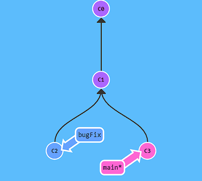
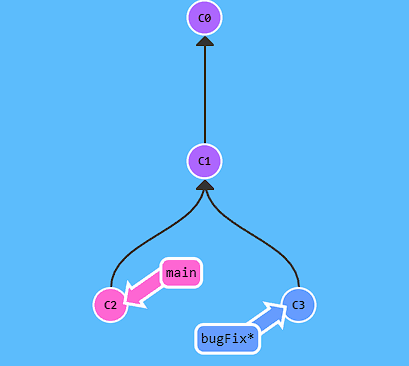
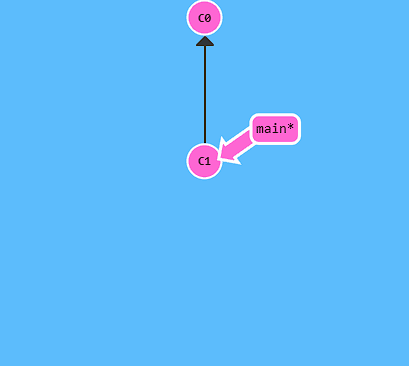
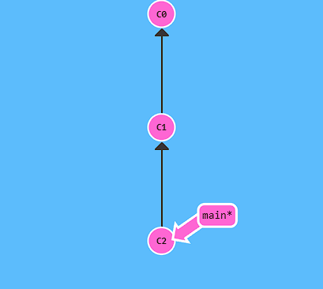
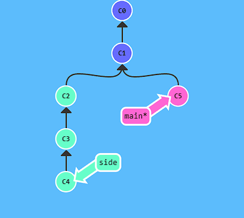
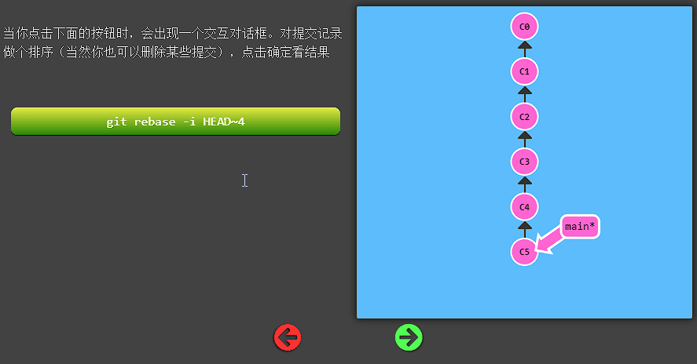
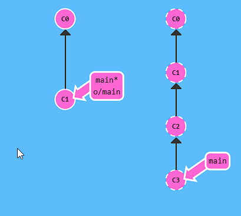
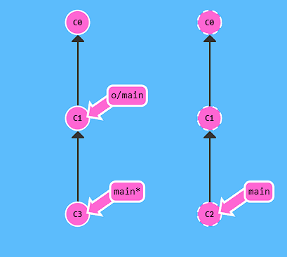

# Learn git branch

<!-- @import "[TOC]" {cmd="toc" depthFrom=1 depthTo=6 orderedList=false} -->

<!-- code_chunk_output -->

- [Learn git branch](#learn-git-branch)
  - [主要](#主要)
    - [基础](#基础)
      - [Git Branch](#git-branch)
      - [分支与合并](#分支与合并)
        - [Merge](#merge)
        - [rebase](#rebase)
    - [高级篇](#高级篇)
      - [分离头](#分离头)
      - [撤销变更](#撤销变更)
        - [git reset](#git-reset)
        - [git revert](#git-revert)
    - [移动提交记录](#移动提交记录)
      - [git cherry-pick](#git-cherry-pick)
      - [交互式的 rebase](#交互式的-rebase)
  - [远程](#远程)
    - [git fetch](#git-fetch)
    - [偏离的提交历史](#偏离的提交历史)
    - [git pull](#git-pull)

<!-- /code_chunk_output -->

该教程是根据使用 [learnGitBranching](https://github.com/pcottle/learnGitBranching) 编写而成的。

## 主要

### 基础

#### Git Branch

Git 的分支也非常轻量。它们只是简单地指向某个提交纪录 —— 仅此而已。
这是因为即使创建再多的分支也不会造成储存或内存上的开销，并且按逻辑分解工作到不同的分支要比维护那些特别臃肿的分支简单多了。
在将分支和提交记录结合起来后，我们会看到两者如何协作。现在只要记住使用分支其实就相当于在说：“我想基于这个提交以及它所有的父提交进行新的工作。”

#### 分支与合并

##### Merge

在 Git 中合并两个分支时会产生一个特殊的提交记录，它有两个父节点。翻译成自然语言相当于：“我要把这两个父节点本身及它们所有的祖先都包含进来。”

```console
git merge bufFix
```



##### rebase

`Rebase` 实际上就是取出一系列的提交记录，“复制”它们，然后在另外一个地方逐个的放下去。

`Rebase` 的优势就是可以创造更线性的提交历史，这听上去有些难以理解。如果只允许使用 `Rebase` 的话，代码库的提交历史将会变得异常清晰。

```sh
# 当前分支在 bugFix
git rebase main
```



### 高级篇

#### 分离头

分离的 HEAD 就是让其指向了某个具体的提交记录而不是分支名。在命令执行之前的状态如下所示：
`HEAD -> main -> C1`

```sh
git checkout c1 #C1 是指定的提交
```



需要注意的情况是：

- [What happens to git commits created in a detached HEAD state?](https://stackoverflow.com/questions/9984223/what-happens-to-git-commits-created-in-a-detached-head-state)

#### 撤销变更

主要有两种方法用来撤销变更. 一是 git reset，还有就是 git revert；

##### git reset

git reset 通过把分支记录回退几个提交记录来实现撤销改动。你可以将这想象成“改写历史”。git reset 向上移动分支，原来指向的提交记录就跟从来没有提交过一样。

```sh
git reset HEAD~1
```



Git 把 main 分支移回到 C1；现在我们的本地代码库根本就不知道有 C2 这个提交了

##### git revert

虽然在你的本地分支中使用 git reset 很方便，但是这种“改写历史”的方法对大家一起使用的远程分支是无效的（一般也没权限这么做，同时不太建议这么做）！
为了撤销更改并分享给别人，我们需要使用 git revert。

```sh
git revert HEAD
```


### 移动提交记录

到现在我们已经学习了 Git 的基础知识 —— 提交、分支以及在提交树上移动。 这些概念涵盖了 Git 90% 的功能，同样也足够满足开发者的日常需求

然而, 剩余的 10% 在处理复杂的工作流时(或者当你陷入困惑时）可能就显得尤为重要了。接下来要讨论的这个话题是“整理提交记录” —— 开发人员有时会说“我想要把这个提交放到这里, 那个提交放到刚才那个提交的后面”, 而接下来就讲的就是它的实现方式，非常清晰、灵活，还很生动。

（还比如在多个分支并行开发中，有同事修复了一个bug，这个bug也在另一个分支中出现了，但又不能合并分支）

#### git cherry-pick

命令形式为:

- [git cherry-pick](https://git-scm.com/docs/git-cherry-pick) <提交号>...

如果你想将一些提交复制到当前所在的位置（HEAD）下面的话， Cherry-pick 是最直接的方式了。我个人非常喜欢 cherry-pick，因为它特别简单。

这里有一个仓库, 我们想将 side 分支上的工作复制到 main 分支，你立刻想到了之前学过的 rebase 了吧？但是咱们还是看看 cherry-pick 有什么本领吧。

```sh
git cherry-pick C2 C4 
```



这就是了！我们只需要提交记录 C2 和 C4，所以 Git 就将被它们抓过来放到当前分支下了。 就是这么简单!

#### 交互式的 rebase

交互式 rebase 指的是使用带参数 --interactive 的 rebase 命令, 简写为 -i

如果你在命令后增加了这个选项, Git 会打开一个 UI 界面并列出将要被复制到目标分支的备选提交记录，它还会显示每个提交记录的哈希值和提交说明，提交说明有助于你理解这个提交进行了哪些更改。
当 rebase UI界面打开时, 你能做3件事:

- 调整提交记录的顺序（通过鼠标拖放来完成）
- 删除你不想要的提交（通过切换 pick 的状态来完成，关闭就意味着你不想要这个提交记录）
- 合并提交。它允许你把多个提交记录合并成一个。



## 远程

### git fetch

git fetch 做了些什么

- 从远程仓库下载本地仓库中缺失的提交记录
- 更新远程分支指针(如 o/main)
git fetch 实际上将本地仓库中的远程分支更新成了远程仓库相应分支最新的状态。

不会做的事情：

- 并不会改变你本地仓库的状态。它不会更新你的分支，也不会修改你磁盘上的文件。

我们可以将 git fetch 理解为单纯的下载操作。



### 偏离的提交历史

假设你周一克隆了一个仓库，然后开始研发某个新功能。到周五时，你新功能开发测试完毕，可以发布了。但是 —— 天啊！你的同事这周写了一堆代码，还改了许多你的功能中使用的 API，这些变动会导致你新开发的功能变得不可用。但是他们已经将那些提交推送到远程仓库了，因此你的工作就变成了基于项目旧版的代码，与远程仓库最新的代码不匹配了。

这种情况下, git push 就不知道该如何操作了。如果你执行 git push，Git 应该让远程仓库回到星期一那天的状态吗？还是直接在新代码的基础上添加你的代码，亦或由于你的提交已经过时而直接忽略你的提交？

因为这情况（历史偏离）有许多的不确定性，Git 是不会允许你 push 变更的。实际上它会强制你先合并远程最新的代码，然后才能分享你的工作。
`rebase` 示例：

```console
git fetch;git rebase o/main;git push
```



git pull 就是 fetch 和 merge 的简写，类似的 git pull --rebase 就是 fetch 和 rebase 的简写！

### git pull

以下命令在 Git 中是等效的:

`git pull origin foo` 相当于：

`git fetch origin foo; git merge o/foo`

看到了? `git pull` 实际上就是 `fetch + merge` 的缩写, `git pull` 唯一关注的是提交最终合并到哪里（也就是为 `git fetch` 所提供的 destination 参数）


rebase 与 merge 的讨论：
Rebase 优点:

- 使你的提交树变得很干净, 所有的提交都在一条线上
  
缺点:
- 修改了提交树的历史
比如, 提交 C1 可以被 rebase 到 C3 之后。这看起来 C1 中的工作是在 C3 之后进行的，但实际上是在 C3 之前。

一些开发人员喜欢保留提交历史，因此更偏爱 merge。而其他人（比如我自己）可能更喜欢干净的提交树，于是偏爱 rebase。仁者见仁，智者见智。

---

- [上一级](README.md)
- 上一篇 -> [Git 学习笔记](learnGit.md)
- 下一篇 -> [多线程 VS 多进程](mulThreadAndMulProcesses.md)
