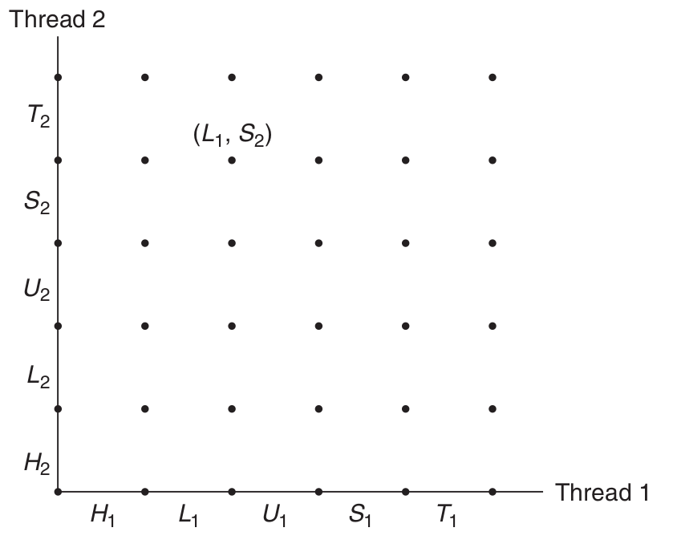

# 多线程 VS 多进程


<!-- @import "[TOC]" {cmd="toc" depthFrom=1 depthTo=6 orderedList=false} -->
<!-- code_chunk_output -->

* [多线程 VS 多进程](#多线程-vs-多进程)
	* [多线程](#多线程)
		* [线程概述](#线程概述)
		* [线程执行模型](#线程执行模型)
		* [分离线程](#分离线程)
		* [线程并发](#线程并发)
		* [多线程示例](#多线程示例)
		* [共享变量](#共享变量)
		* [进度图](#进度图)
	* [多进程对比多线程](#多进程对比多线程)
	* [名词解释](#名词解释)
	* [链接](#链接)

<!-- /code_chunk_output -->

## 多线程
### 线程概述

[操作系统 进程管理 wikipedia](https://zh.wikipedia.org/wiki/%E6%93%8D%E4%BD%9C%E7%B3%BB%E7%BB%9F#%E8%BF%9B%E7%A8%8B%E7%AE%A1%E7%90%86)
[线程 wikipedia](https://zh.wikipedia.org/wiki/%E7%BA%BF%E7%A8%8B)

线程就是运行在进程 [上下文](#名词解释) 中的 [逻辑流](#名词解释) 。在现代系统中允许我们编写一个进程里同时运行多个线程的程序。线程由内核自动调度。每个线程都有它自己的线程上下文，包括一个唯一的整数线程 ID 、栈、栈指针、程序计数器、通用目的寄存器和条件码。所有的运行在一个进程里的线程共享该进程的整个 [虚拟地址空间](http://wiki.legendit.ca/cn/137.html) 。

### 线程执行模型

多线程的执行模型在某些方面和多进程的执行模型是相似的。思考一下图中的示例。每个进程开始生命周期时都是单一线程，这个线程称为主线程。在某一时刻，主线程创建一个对等线程，从这个时间点开始，两个线程就并发地运行。最后，因为主线程执行一个慢速系统调用，例如 read 或 sleep，或者因为它被系统的间隔计时器中断，控制就会通过上下文切换传递到对等线程。对等线程会执行一段时间，然后控制传递回主线程，依次类推。


在一些重要的方面，线程执行是不同于进程的。因为一个线程的上下文要比一个进程的上下文小得多，线程的上下文切换要比进程的上下文切换快得多。另一个不同的就是线程不像进程那样，不是按照严格的父子层次来组织的。和一个进程相关的线程组成一个对等（线程）池（pool），独立于其他线程创建的线程。主线程和其他线程的区别仅在于它总是进程中第一个运行的线程。对等（线程）池概念的主要影响是，一个线程可以杀死它的任何对等线程，或者等待它的任意对等线程终止。另外，每个对等线程都能读写相同的共享数据。

### 分离线程

在任何一个时间点上，线程是可结合的 (joinable) 或者是分离的 (detached)。一个可结合的线程能够被其它线程收回其资源和杀死。在被其它线程回收之前，他的存储器资源 （例如栈） 是没有被释放的。相反，一个分离的线程是不能被其它线程回收或杀死的。他的存储器资源在它终止时由系统自动释放。

### 线程并发

[本地笔记： c++ 并发](../cpp/multiThread.md)

### 多线程示例

```c++
#include <exception>
#include <iostream>
#include <thread>
#include <unistd.h>
using namespace std;

void doSomething(int num, char c) {
  try {
    for (ssize_t i = 0; i < num; i++) {
      std::cout.put(c).flush();
    }
  }

  catch (const exception &e) {
    std::cerr << "thread_exception(thread " << this_thread::get_id()
              << "):" << e.what() << '\n';
  }

  catch (...) {
    std::cerr << "thread_exception (thread " << this_thread::get_id() << ")"
              << '\n';
  }
}

int main(int argc, char const *argv[]) {
  try {
    thread t1(doSomething, 25, '.');
    thread t2(doSomething, 55, '+');

    t1.join();
    t2.join();
    std::cout << '\n';

  }

  catch (const exception &e) {
    std::cerr << "exception:" << e.what() << '\n';
  }
  return 0;
}
```

Run it:
First:
```sh
+.+++++++++++++++++.+++++++++++++++++++++++.+......................+++++++++++++
```
Second:
```sh
+.++++++++++++.++++++++++++.+++++++++++++.+++++++++.++++++++....................
```

```c++
#include <chrono> // 一个精度中立的时间程序库
#include <exception>
#include <iostream>
#include <random>
#include <thread>
using namespace std;

void doSomething(int num, char c) {
  try {
    default_random_engine dre(42 * c);
    uniform_int_distribution<int> id(10, 1000);
    for (ssize_t i = 0; i < num; i++) {
      this_thread::sleep_for(chrono::milliseconds(id(dre)));
      std::cout.put(c).flush();
    }
  }

  catch (const exception &e) {
    std::cerr << "thread_exception(thread " << this_thread::get_id()
              << "):" << e.what() << '\n';
  }

  catch (...) {
    std::cerr << "thread_exception (thread " << this_thread::get_id() << ")"
              << '\n';
  }
}

int main(int argc, char const *argv[]) {
  try {
    thread t1(doSomething, 5, '.');
    std::cout << "- started fg thread" << t1.get_id() << '\n';

    for (size_t i = 0; i < 5; i++) {
      thread t(doSomething, 10, 'a' + i);
      std::cout << "- detach started bg thread " << t.get_id() << '\n';
      t.detach();//注释掉这行会core dump
    }
    cin.get();
    std::cout << "- join fg thread " << t1.get_id() << '\n';
    t1.join();
  }

  catch (const exception &e) {
    std::cerr << "exception:" << e.what() << '\n';
  }
  return 0;
}
```

### 共享变量

看下面一个不正确的计数器程序：
```c++
#include <iostream>
#include <thread>

using namespace std;

volatile int cnt = 0; // counter


void fun(int count) {
  int i, niters = count;

  for (i = 0; i < niters; i++)
    cnt++;
}

int main(int argc, char const *argv[]) {
  int niters;

  if (argc != 2) {
    std::cout << "usage : " << argv[0] << " <niters>" << '\n';
    exit(0);
  }

  niters = atoi(argv[1]);

  thread t1(fun, niters);
  thread t2(fun, niters);

  t1.join();
  t2.join();

  if (cnt != (2 * niters))
    std::cout << "BOOM ! cnt= " << cnt << '\n';
  else
    std::cout << "OK cnt= " << cnt << '\n';
  return 0;
}
```

Run it:
```sh
[breap@breap thread]$ ./threadSharedVal 200
OK cnt= 400
[breap@breap thread]$ ./threadSharedVal 100000
BOOM ! cnt= 107029
[breap@breap thread]$ ./threadSharedVal 100000
BOOM ! cnt= 141413
[breap@breap thread]$ ./threadS值haredVal 100000
BOOM ! cnt= 128988
```
注意：若上面不加 [volatile变量 wikipedia](https://zh.wikipedia.org/wiki/Volatile%E5%8F%98%E9%87%8F) 关键字，就只可能出现下面两种结果的一种：

```sh
[breap@breap thread]$ ./test 100000
OK cnt= 200000
[breap@breap thread]$ ./test 100000
BOOM ! cnt= 100000
```


那么哪里出错了呢？为了清晰地理解这个问题，我们需要研究计数器循环的汇编代码，如下示例。我们发现，将线程 i 的循环代码分解成五个部分是很有帮助的：
* H.i : 在循环头部的指令块。
* L.i : 加载共享变量 cnt 到寄存器 %eax.i 的指令,这里的 %eax.i 表示线程 i 中的寄存器 %eax 的值。
* U.i : 更新（增加） %eax.i 的指令。
* S.i : 将 %eax.i 的更新值存回到共享变量 cnt 的指令。
* T.i : 循环尾部的指令块。
注意头和尾只操作本地栈变量，而 L.i 、 U.i  和 S.i 操作共享计数器变量的内容。

生成汇编代码：
```sh
g++ -S threadSharedVal.cpp
```

线程 i 的 C++ 代码 ：
```c++
for (i = 0; i < niters; i++)
	cnt++;
```
线程 i 的汇编代码：

<style type="text/css">
.tg  {border-collapse:collapse;border-spacing:0;}
.tg td{font-family:Arial, sans-serif;font-size:14px;padding:10px 5px;border-style:solid;border-width:1px;overflow:hidden;word-break:normal;border-color:black;}
.tg th{font-family:Arial, sans-serif;font-size:14px;font-weight:normal;padding:10px 5px;border-style:solid;border-width:1px;overflow:hidden;word-break:normal;border-color:black;}
.tg .tg-c3ow{border-color:inherit;text-align:center;vertical-align:top}
.tg .tg-uys7{border-color:inherit;text-align:center}
</style>
<table class="tg" style="undefined;table-layout: fixed; width: 511px">
<colgroup>
<col style="width: 403px">
<col style="width: 108px">
</colgroup>
  <tr>
    <th class="tg-uys7">.LVL0:<br>.loc 1 9 3<br>.loc 1 11 3	<br>.loc 1 11 17 is_stmt 0<br>testl	%edi, %edi<br>jle  .L1<br>.loc 1 11 10	<br>movl $0, %edx<br></th>
    <th class="tg-uys7">H.i : 头</th>
  </tr>
  <tr>
    <td class="tg-uys7" rowspan="3">.LVL1:<br>.L3:	<br>.loc 1 12 5 is_stmt 1 discriminator 2	<br>.loc 1 12 8 is_stmt 0 discriminator 2<br>movl cnt(%rip), %eax<br>addl	$1, %eax<br>movl %eax, cnt(%rip)<br>.loc 1 11 3 discriminator 2</td>
    <td class="tg-uys7">L.i : Load cnt</td>
  </tr>
  <tr>
    <td class="tg-uys7">U.i : Update cnt</td>
  </tr>
  <tr>
    <td class="tg-c3ow">S.i :&nbsp;&nbsp;Store cnt</td>
  </tr>
  <tr>
    <td class="tg-c3ow">addl	$1, %edx<br>.LVL2:<br>.loc 1 11 17 discriminator 2<br>cmpl %edx, %edi<br>jne .L3<br>.LVL3:</td>
    <td class="tg-c3ow">T.i : Tail</td>
  </tr>
</table>

这里有两个关键点：一般而言，你没有办法预测操作系统是否将为你的线程选择一个正确的顺序。


正确的顺序如下：
| 步骤 | 线程 | 指令 | %eax.1 | %eax.2 | cnt |
|------|------|------|--------|--------|-----|
|   1  |   1  |  H.1 | ------ | ------ |  0  |
|   2  |   1  |  L.1 |    0   | ------ |  0  |
|   3  |   1  |  U.1 |    1   | ------ |  0  |
|   4  |   1  |  S.1 |    1   | ------ |  1  |
|   5  |   2  |  H.2 | ------ | ------ |  1  |
|   6  |   2  |  L.2 | ------ |    1   |  1  |
|   7  |   2  |  U.2 | ------ |    2   |  1  |
|   8  |   2  |  S.2 | ------ |    2   |  2  |
|   9  |   2  |  T.2 | ------ |    2   |  2  |
|  10  |   1  |  T.1 |    1   | ------ |  2  |


不正确的顺序如下：
| 步骤 | 线程 | 指令 | %eax.1 | %eax.2 | cnt |
|------|------|------|--------|--------|-----|
|   1  |   1  |  H.1 | ------ | ------ |  0  |
|   2  |   1  |  L.1 |    0   | ------ |  0  |
|   3  |   1  |  U.1 |    1   | ------ |  0  |
|   4  |   2  |  H.2 | ------ | ------ |  0  |
|   5  |   2  |  L.2 | ------ |    0   |  0  |
|   6  |   1  |  S.1 |    1   | ------ |  1  |
|   7  |   1  |  T.1 |    1   | ------ |  1  |
|   8  |   2  |  U.2 | ------ |    1   |  1  |
|   9  |   2  |  S.2 | ------ |    1   |  1  |
|  10  |   2  |  T.2 | ------ |    1   |  1  |

### 进度图
 进度图 （progress graph） 将 n 个并发线程的执行模型化为一条 n 维笛卡尔空间中的轨迹线。每条轴 k 对应于线程 k 的进度。每个点 （I.1,I.2,...） 代表线程 k （k=1,...,n） 已经完成了指令 I.k 这一状态。图的原点对应于没有任何线程完成一条指令的初始状态。

 下图展示了上面的程序第一次循环迭代的二维进度图。



 进度图将指令执行模型从一种状态到另一种状态的转换。转换被表示为一条从一点到相邻的有向边。合法的转换是向右（线程 1 中的一条指令完成）或者向上（线程 2 中的一条指令完成）的。两条指令不能在同一时刻完成--对角线转换是不允许的。程序绝不会反向运行，所以向下或者向左移动的转换也是不合法的。

 一个程序的执行历史被模型化为状态空间中的一条轨迹线。下图展示了一个轨迹线。


 对于线程 i，操作共享变量 cnt 内容的指令 (L.i,U.i,S.i) 构成了一个（关于共享变量cnt的）临界区(critical section),这个临界区不应该和其它线程的临界区交替执行。换句话说，我们想要确保每个线程在执行它的临界区中的指令时，需要拥有对共享变量的互斥的访问(mutually exclusive access)。通常这种现象称为互斥（mutually exclusion）。

 在进度图中，两个临界区的交集形成的状态空间区域称为不安全区（unsafe region）。下图展示了变量 cnt 的不安全区。注意，不安全区和与它交界的状态相毗邻，但并不包括这些状态。绕开不安全区俄轨迹线叫做安全轨迹线（safe trajectory）.相反，接触到任何不安全区的轨迹线叫做不安全轨迹线 (unsafe trajectory).下图给出了上面的示例程序的状态空间中的安全和不安全区。


 任何安全轨迹线都将正确地更新共享计数器。为了保证任何共享全局数据结构的并发程序的正确执行，我们必须以某种方式 同步线程 ，使他们总是有一条安全轨迹线。

## 多进程对比多线程


## 名词解释

1. 逻辑控制流:如果用调试器单步执行程序，我们会看到一系列的 [程序计数器](https://zh.wikipedia.org/wiki/%E7%A8%8B%E5%BC%8F%E8%A8%88%E6%95%B8%E5%99%A8) （PC） 的值，这些值唯一地对应与包含在程序的可执行目标文件中的指令。这个 PC 的值的序列叫做逻辑控制流，或者简称逻辑流。

* 上下文是由程序正确运行所需的状态组成的。这个状态包括存放在存储器中的程序的代码和数据，他的栈、通用目的寄存器的内容、程序计数器、环境变量以及打开的文件描述符的集合。

* [上下文切换](https://zh.wikipedia.org/wiki/%E4%B8%8A%E4%B8%8B%E6%96%87%E4%BA%A4%E6%8F%9B#%E4%B8%8A%E4%B8%8B%E6%96%87%E4%BA%A4%E6%8F%9B%EF%BC%9A%E5%85%B7%E9%AB%94%E6%AD%A5%E9%A9%9F)

## 链接
* 《深入理解计算机系统 2rd》
* [操作系统 wikipedia](https://zh.wikipedia.org/wiki/%E6%93%8D%E4%BD%9C%E7%B3%BB%E7%BB%9F)

[上一级](base.md)
[上一篇](graph.md)
[下一篇](sort.md)
