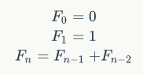

<!-- 一些典型的编程题 -->

<!-- @import "[TOC]" {cmd="toc" depthFrom=1 depthTo=6 orderedList=false} -->

<!-- code_chunk_output -->

- [二维数组中的查找](#二维数组中的查找)
- [斐波那契数列](#斐波那契数列)
  - [青蛙跳台阶问题](#青蛙跳台阶问题)
- [计算一个这样的 9 位的整数](#计算一个这样的-9-位的整数)
- [矩阵中的路径](#矩阵中的路径)
- [二进制中 1 的个数](#二进制中-1-的个数)

<!-- /code_chunk_output -->

## 二维数组中的查找

在一个二维数组中，每一行都按照从左到右递增的顺序排序，每一列都按照从上到下递增的顺序排序。请完成一个函数，输入这样的一个二维数组和一个整数，判断数组中是否含有该整数。

```python
import unittest

def find(matrix,rows,columns,number):
    found = False
    if len(matrix) >0 and rows > 0 and columns >0:
        row_index =0
        column_index = columns -1
        print(matrix)
        while row_index < rows and column_index >=0: 
            cur_index = row_index*columns+column_index
            if matrix[cur_index] == number:
                found = True
                break
            elif matrix[cur_index]>number:
                column_index -=1
            else:
                row_index+=1
    return found


class TestStringMethods(unittest.TestCase):
    def test(self):
        data = (1,2,8,9\
                ,2,4,9,12\
                ,4,7,10,13\
                ,6,8,11,15)
        row_cnt = 4
        column_cnt = 4
        self.assertEqual(find(data,row_cnt,column_cnt,7),True)
        self.assertEqual(find(data,row_cnt,column_cnt,1),True)
        self.assertEqual(find(data,row_cnt,column_cnt,15),True)
        self.assertEqual(find(data,row_cnt,column_cnt,3),False)

if __name__ == '__main__':
    unittest.main()
```

## 斐波那契数列

写一个函数，输入 n ，求斐波那契(Fibonacci) 数列的第 n 项。斐波那契数列的定义如下：



解法一：以递归的方式解决该问题：

```python
# 以 c++ 实现时注意返回结果类型应该为 long long 
def Fibonacci(n):
    if n <= 0:
        return 0
    if 1 == n:
        return 1
    return Fibonacci(n-1) + Fibonacci(n-2) 
```

但该解法存在严重的效率问题和有可能出现栈溢出。

解法二：

```py
# 以 c++ 实现时注意返回结果类型应该为 long long 
def Fibonacci(n):
    result = (0,1)
    if n < 2:
        return result[n]
    
    fibNMinusOne = 1
    fibNMinusTwo = 2 
    fibN = 0 
    for i in range(2,n+1):
        fibN = fibNMinusOne + fibNMinusTwo
        fibNMinusTwo = fibNMinusOne
        fibNMinusOne = fibN 
    return fibN
```

### 青蛙跳台阶问题

一只青蛙一次可以跳上一级台阶，也可以跳上两级台阶。求该青蛙跳上一个 n 级台阶总共有多少种跳法。（这也是一个斐波那契数列）

本题扩展：在青蛙跳台阶的问题中，如果把条件改成：一只青蛙一次可以跳上一级台阶，也可以跳上 2 级台阶 ... 它也可以跳上 n 级，此时该青蛙跳上一个 n 级台阶总共有多少种跳法？我们用数学归纳法可以证明 `f(n)= 2 ** n-1`

## 计算一个这样的 9 位的整数

1～9 的 9 个数字，每个数字只能出现一次，要求这样一个 9 位的整数：其第一位能被一整除，前两位能被2整除，前三位能被3整除... 依次类推，前9位能被9整除。

```python
used = []
for i in range(0,10):
    used.append(False)

ret = []

def dfs(k,a):
    if k and a % k != 0:
        return
    if k == 9:
        ret.append(a)
        return 
    for i in range(1,10):
        if not used[i]:
            used[i]=True
            dfs(k+1,a*10 + i)
            used[i]=False

if __name__ == "__main__":
    dfs(0,0)
    print(ret)
```

Run it:

```cmd
381654729
```

## 矩阵中的路径

请设计一个函数，用来判断在一个矩阵中是否存在一条包含某字符串所有字符的路径。路径可以从矩阵中任意一格开始，每一步可以在矩阵中向左、右、上、下移动一格。如果一条路径经过了矩阵的某一格，那么该路径不能再次进入该格子。例如在下面的3×4的矩阵中包含一条字符串“bfce”的路径（路径中的字母用下划线标出）。但矩阵中不包含字符串“abfb”的路径，因为字符串的第一个字符b占据了矩阵中的第一行第二个格子之后，路径不能再次进入这个格子。

// A B T G
// C F C S
// J D E H

```python
def hasPathCore(matrix, rows, cols, row, col, str, path_len, visited):
    if len(str) == path_len[0]:
        return True

    has_path = False
    if row >= 0 and row< rows and col >= 0 and col < cols \
            and matrix[row * cols + col] == str[path_len[0]] \
            and not visited[row * cols + col]:
        path_len[0] = path_len[0] + 1

        visited[row * cols + col] = True
        has_path = hasPathCore(matrix, rows, cols, row, col - 1, str, path_len, visited) \
                   or hasPathCore(matrix, rows, cols, row - 1, col, str, path_len, visited) \
                   or hasPathCore(matrix, rows, cols, row, col + 1, str, path_len, visited) \
                   or hasPathCore(matrix, rows, cols, row+1, col, str, path_len, visited)

        if not has_path:
            path_len[0] = path_len[0] - 1
            visited[row * cols + col] = False

    return has_path


def hasPath(matrix, rows, cols, str):
    if 0 == len(matrix) or rows < 1 \
            or cols < 1 or 0 == len(str):
        return False

    visited = []
    for i in range(0, rows * cols):
        visited.append(False)

    path_len = [0]
    for row in range(0, rows):
        for col in range(0, cols):
            if hasPathCore(matrix, rows, cols, row, col, str \
                    , path_len, visited):
                return True

    return False


if __name__ == '__main__':
    matrix = 'abtgcfcsjdeh'

    # result is True
    print(hasPath(matrix, 3, 4, 'bfce'))
```

## 二进制中 1 的个数

请实现一个函数，输入一个整数，输出该数二进制表示中 1 的个数。例如，把 9 表示成二进制是 1001,有两位是 1 。

```python

def number_of_1(n):
    count=0
    while n:
        count+=1
        n=(n-1)&n 
    
    return count 

print(number_of_1(1))
print(number_of_1(0x7FFFFFFF))
print(number_of_1(0x80000000))
print(number_of_1(0xFFFFFFFF))
print(number_of_1(0))
print(number_of_1(9))
```

Run it:

```cmd
1
31
1
32
0
2
```


---
- [上一级](README.md)
- 上一篇 -> [多线程 VS 多进程](mulThreadAndMulProcesses.md)
- 下一篇 -> [排序](sort.md)
