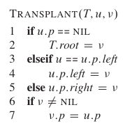

<!-- 数据结构（树） -->


<!-- @import "[TOC]" {cmd="toc" depthFrom=1 depthTo=6 orderedList=false} -->
<!-- code_chunk_output -->

* [数据结构（树）](#数据结构树)
	* [术语](#术语)
	* [树的种类](#树的种类)
	* [二叉查找树(Binary Search Tree)](#二叉查找树binary-search-tree)

<!-- /code_chunk_output -->


在计算机科学中，[树](https://zh.wikipedia.org/wiki/%E6%A0%91_(%E6%95%B0%E6%8D%AE%E7%BB%93%E6%9E%84)) 是一种[抽象数据类型](https://zh.wikipedia.org/wiki/%E6%8A%BD%E8%B1%A1%E8%B3%87%E6%96%99%E5%9E%8B%E5%88%A5) (ADT)或是实作这种抽象数据类型的数据结构，用来模拟具有树状结构性质的数据集合。它是由n（n>0）个有限节点组成一个具有层次关系的集合。把它叫做“树”是因为它看起来像一棵倒挂的树，也就是说它是根朝上，而叶朝下的。它具有以下的特点：
* 每个节点有零个或多个子节点
* 没有父节点的节点称为根节点
* 每一个非根节点有且只有一个父节点
* 除了根节点外，每个子节点可分为多个不相交的子树

## 术语
1. 节点的度：一个节点含有的子节点的个数被成为该节点的度
2. 树的度：一棵树中，最大的节点的度称为树的度
3. 叶节点或终端节点：度为零的点
4. 非终端或分支节点：度不为零的节点
5. 父节点：若一个节点含有子节点，则这个节点被称为其子节点的父节点
6. 孩子节点或子节点：一个节点含有的子树的根节点被称为该节点的子节点
7. 兄弟节点：具有相同父节点的节点互称为兄弟节点
8. 节点的层次：从根开始定义起，根为第1层，根的子节点为第2层，以此类推
9. 深度：对于任意节点 n，n的深度为从根到n的唯一路径长，根的深度为0
10. 高度：对于任意节点n，n的高度为从n到一片树叶的最长路径长
11. 堂兄弟节点：父节点在同一层的节点互为堂兄弟
12. 节点的祖先：从根到该节点所经分支上的所有节点
13. 子孙：以某节点为根的子树中任一节点都称为该节点的子孙
14. 森林：由 m(m>=0) 棵互不相交的树的集合称为森林

高度与深度的图示：


[树的高度和深度的区别](http://blog.csdn.net/fanpei_moukoy/article/details/23828603)

## 树的种类

* 无序树
树中任意节点的子节点之间没有顺序关系，这种树被称为无序树，也称为自由树

* 有序树

  * 二叉树:每个节点最多含有两个子树的树
    * 完全二叉树:对于一个二叉树，假设其深度为d(d>1)。除了第d层外，其它各层的节点书目均以达最大值，且第d层所有节点从左到右连续地紧密排列
    * 满二叉树:所有叶节点都在最底层的完全二叉树
    * [平衡二叉树](https://zh.wikipedia.org/wiki/%E5%B9%B3%E8%A1%A1%E4%BA%8C%E5%85%83%E6%90%9C%E5%B0%8B%E6%A8%B9):（AVL树,红黑树,Treap）：当且仅当任何节点的两颗子树的高度差不大于1的二叉树
    * [二叉查找树](https://zh.wikipedia.org/wiki/%E4%BA%8C%E5%85%83%E6%90%9C%E5%B0%8B%E6%A8%B9)(Binary Search Tree)
  * [霍夫曼树](https://zh.wikipedia.org/wiki/%E9%9C%8D%E5%A4%AB%E6%9B%BC%E7%BC%96%E7%A0%81)：带权路径最短的二叉树被称为哈夫曼树或最优二叉树
  * [B树](https://zh.wikipedia.org/wiki/B%E6%A0%91)：一种对读写操作进行优化的自平衡的二叉查找树，能够保持数据有序，拥有多于两个子树


完全二叉树 VS 满二叉树图示：


## 二叉查找树(Binary Search Tree)


[二叉搜索树](https://zh.wikipedia.org/wiki/%E4%BA%8C%E5%85%83%E6%90%9C%E5%B0%8B%E6%A8%B9)（英语：Binary Search Tree），也称二叉搜索树、有序二叉树（英语：ordered binary tree），排序二叉树（英语：sorted binary tree），是指一棵空树或者具有下列性质的二叉树：

* 若任意节点的左子树不空，则左子树上所有节点的值均小于或等于它的根节点的值；
* 若任意节点的右子树不空，则右子树上所有节点的值均大于或等于它的根节点的值；
* 任意节点的左、右子树也分别为二叉查找树；

二叉查找树相比于其他数据结构的优势在于查找、插入的时间复杂度较低。为O(log n)。二叉查找树是基础性数据结构，用于构建更为抽象的数据结构。

搜索、插入、删除的复杂度等于树高，期望  O(log n)，最坏 O(n)（数列有序，树退化成线性表）。


```c++
#include <iostream>

using namespace std;

struct node {
  node() : left(nullptr), right(nullptr) {}
  int data;
  node *left;
  node *right;
};

class BinarySearchTree {
private:
  node * root;

public:
  BinarySearchTree() { root = nullptr; }

  void inorderTreeWalk(node * t);
  node *search(int data);
  node *minmum(node *t);
  node *maxmum(node *t);
  void insertNode(int data);
  node *remove(int x, node *t);
  node *makeEmpty(node *t);
  void remove(int x);
  void display();
  virtual ~BinarySearchTree();
};

void BinarySearchTree::inorderTreeWalk(node *t) {
  if (t != nullptr) {
    inorderTreeWalk(t->left);
    std::cout << t->data << "->";
    inorderTreeWalk(t->right);
  }
}

node *BinarySearchTree::search(int data) {
  node * t = root;
  while (t != nullptr && t->data != data) {
    if (t->data > data)
      t = t->left;
    else
      t = t->right;
  }
  return t;
}

node *BinarySearchTree::minmum(node *t) {
  if (t == nullptr)
    return nullptr;

  while (t->left != nullptr) {
    t = t->left;
  }
  return t;
}

node *BinarySearchTree::maxmum(node *t) {

  if (t == nullptr)
    return nullptr;
  while (t->right != nullptr)
    t = t->right;
  return t;
}

void BinarySearchTree::insertNode(int data) {
  node * t = root;
  node * newNode = new node;
  newNode->data = data;

  node * tmp = t;
  while (t != nullptr) {
    tmp = t;
    if (t->data > data)
      t = t->left;
    else
      t = t->right;
  }

  if (tmp == nullptr)
    root = newNode;
  else if (tmp->data > data)
    tmp->left = newNode;
  else
    tmp->right = newNode;
}

node *BinarySearchTree::remove(int x, node *t) {
  node * tmp;

  if (t == nullptr)
    return nullptr;
  else if (x < t->data)
    t->left = remove(x, t->left);
  else if (x > t->data)
    t->right = remove(x, t->right);
  else if (t->left && t->right) {
    tmp = minmum(t->right);
    t->data = tmp->data;
    t->right = remove(t->data, t->right);
  } else {
    tmp = t;
    if (t->left == nullptr)
      t = t->right;
    else if (t->right == nullptr)
      t = t->left;
    delete tmp;
  }
  return t;
}

node *BinarySearchTree::makeEmpty(node *t) {
  if (t == nullptr)
    return nullptr;

  makeEmpty(t->left);
  makeEmpty(t->right);
  delete t;

  return nullptr;
}

BinarySearchTree::~BinarySearchTree() { makeEmpty(root); }

void BinarySearchTree::remove(int x) {
	// 注意，这里应该重新给root赋值（可能root节点有变化）
	root = remove(x, root); }

void BinarySearchTree::display() {
  inorderTreeWalk(root);
  cout << endl;
}

int main(int argc, char const *argv[]) {
  BinarySearchTree t;
  t.insertNode(20);
  t.insertNode(25);
  t.insertNode(15);
  t.insertNode(10);
  t.insertNode(30);
  t.display();
  t.remove(20);
  t.display();
  t.remove(25);
  t.display();
  t.remove(30);
  t.display();
  return 0;
}
```

Run it:
```terminal
10->15->20->25->30->
10->15->25->30->
10->15->30->
10->15->
```

[harish-r/Binary Search Tree.cpp](https://gist.github.com/harish-r/a7df7ce576dda35c9660)

在二叉查找树中，算法导论上给出了一个严谨的删除节点的方法：


伪代码如下所示：




---------------------

一种更为简单的理解删除的方式:[6天通吃树结构—— 第一天 二叉查找树](http://www.cnblogs.com/huangxincheng/archive/2012/07/21/2602375.html)

* 单孩子的情况: 这个比较简单，如果删除的节点有左孩子那就把左孩子顶上去，如果有右孩子就把右孩子顶上去，然后打完收工。


* 左右都有孩子的情况:我们根据”中序遍历“找到要删除结点的后一个结点，然后顶上去就行了，原理跟"数组”一样一样的


注：
* 参考 wikipedia 中文 [树 (数据结构)](https://zh.wikipedia.org/wiki/%E6%A0%91_(%E6%95%B0%E6%8D%AE%E7%BB%93%E6%9E%84))
* 《算法导论-第三版》相关章节


---
- [上一级](README.md)
- 上一篇 -> [sqlite 学习](sqlite.md)
- 下一篇 -> [使用 doxygen](useDoxygen.md)
