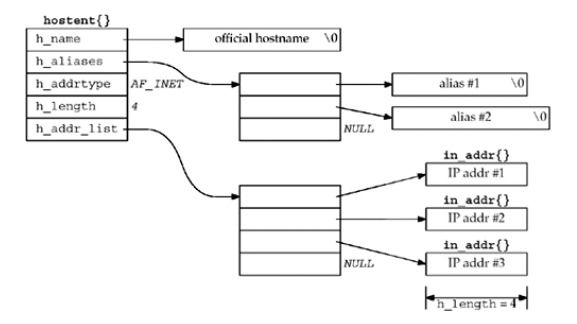

# 11.名字与地址转换

<!-- @import "[TOC]" {cmd="toc" depthFrom=1 depthTo=6 orderedList=false} -->
<!-- code_chunk_output -->

* [11.名字与地址转换](#11名字与地址转换)
	* [概述](#概述)
	* [域名系统](#域名系统)
		* [资源记录](#资源记录)
		* [解析器和名字服务器](#解析器和名字服务器)
		* [DNS 替代方法](#dns-替代方法)
	* [gethostbyname 函数](#gethostbyname-函数)
	* [gethostbyaddr 函数](#gethostbyaddr-函数)
	* [getservbyname 和 getservbyport 函数](#getservbyname-和-getservbyport-函数)
	* [getaddrinfo 函数](#getaddrinfo-函数)
	* [gai_strerror 函数](#gai_strerror-函数)
	* [freeaddrinfo 函数](#freeaddrinfo-函数)
	* [getaddrinfo 函数： IPV6](#getaddrinfo-函数-ipv6)
	* [getaddrinfo 函数：例子](#getaddrinfo-函数例子)
	* [<unp.h>提供的实用的函数接口](#unph提供的实用的函数接口)
		* [host_serv 函数](#host_serv-函数)
		* [tcp_connect 函数](#tcp_connect-函数)
		* [tcp_listen 函数](#tcp_listen-函数)
		* [udp_client 函数](#udp_client-函数)
		* [udp_connect 函数](#udp_connect-函数)
		* [udp_server 函数](#udp_server-函数)
	* [getnameinfo 函数](#getnameinfo-函数)
	* [可重入函数](#可重入函数)
	* [gethostbyname_r 和 gethostbyaddr_r 函数](#gethostbyname_r-和-gethostbyaddr_r-函数)
		* [gethostbyname_r 函数](#gethostbyname_r-函数)
		* [gethostbyaddr_r 函数](#gethostbyaddr_r-函数)
	* [作废的 IPV6 地址解析函数](#作废的-ipv6-地址解析函数)
		* [RES_USE_INET6 常值](#res_use_inet6-常值)
		* [gethostbyname2 函数](#gethostbyname2-函数)
		* [getipnodbyname](#getipnodbyname)
		* [getipnodebyaddr](#getipnodebyaddr)
	* [其它网络相关信息](#其它网络相关信息)

<!-- /code_chunk_output -->

## 概述
在名字和数值地址间进行转换的函数：
* gethostbyname和gethostbyaddr在主机名字与IPV4地址之间进行转换
* getservbyname和getservbyport在服务器名字和端口号之间进行转换
* 两个协议无关的转换函数：getaddrinfo和getnameinfo，分别用于主机名字和IP地址之间以及服务器名字和端口号之间的转换

## 域名系统

域名系统（Domain Name System,DNS）主要用于主机名字与 IP 地址之间映射。
本节仅仅讨论网络编程所需的 DNS 基础知识。对于更多细节感兴趣的读者可参阅 <TCP V1> 的第14章。

### 资源记录
DNS 中的条目称为资源记录(resource record,RR)。 我们感兴趣的RR 类型只有若干个：

| 类型 | 说明     |
| :------------- | :------------- |
A | A记录把一个主机名映射为一个32位的IPV4地址
AAAA | 把一个主机名映射为一个128位的IPV6地址
PTR | 称为“指针记录”(pointer record)的PTR记录把IP地址映射成主机名
MX | 把一个主机指定作为给定主机的“邮件交换器”(mail exchanger)
CNAME | 代表规范名字(canonical name),它的常见用法是为常用的服务(www,ftp)指派CNAME记录。如果人们使用这些服务名而不是真实的主机名，那么相应的服务挪到另一个主机时它们也不必知道。

[How to use dig to query DNS name servers](https://www.madboa.com/geek/dig/)


```sh
dig +nocmd yahoo.com any +multiline +noall +answer
yahoo.com.		423 IN A 206.190.39.42
yahoo.com.		423 IN A 98.139.180.180
yahoo.com.		423 IN A 98.138.252.38
yahoo.com.		54250 IN NS ns4.yahoo.com.
yahoo.com.		54250 IN NS ns3.yahoo.com.
yahoo.com.		54250 IN NS ns5.yahoo.com.
yahoo.com.		54250 IN NS ns1.yahoo.com.
yahoo.com.		54250 IN NS ns2.yahoo.com.
```

### 解析器和名字服务器

每个组织机构往往运行一个或多个 名字服务器 (name server),它们通常就是所谓的 BIND （Berkeley Internet Name Domain的简称）程序。诸如我们在本书中编写的客户和服务器等应用程序通过调用解析器 (resolver) 的函数库中的函数接触DNS服务器。常见的解析器函数是 gethostbyname 和 gethostbyaddr,前者把主机名映射成 IPV4 地址，后者则执行相反的映射。

应用程序代码使用通常的函数调用来执行解析器中的代码，调用的典型函数是 gethostbyname 和 gethostbyaddr

客户、解析器和名字服务器的典型关系：


解析器代码通过读取其系统相关配置文件确定本组织机构的名字服务器们的所在位置。文件/etc/resolv.conf通常包含本地名字服务器主机的IP地址。

解析器使用UDP向本地名字服务器发出查询。如果本地名字服务器不知道答案，它通常就会使用 UDP 在整个因特网上查询其他名字服务器。如果答案太长，超出 UDP 消息的承载能力，本地名字服务器和解析器会自动切换到 TCP

### DNS 替代方法

不使用 DNS 也可能获取名字和地址信息。常用的替代方法有静态主机文件(通常是 /etc/hosts文件)、[网络信息系统](http://searchnetworking.techtarget.com/definition/NIS)(Network Information System,NIS)以及[轻目录访问协议 wikipedia](https://zh.wikipedia.org/wiki/%E8%BD%BB%E5%9E%8B%E7%9B%AE%E5%BD%95%E8%AE%BF%E9%97%AE%E5%8D%8F%E8%AE%AE)(Lightweight Directory Access Protocol,LDAP)。不幸的是，系统管理员如何使用不同类型的名字服务是实现相关的。Solaris 2.x、HP-UX 10 及后续版本、FreeBSD 5.x及后续版本使用文件 /etc/nsswitch.conf,AIX 使用文件 /etc/netsvc.conf 。BIND 9.2.2 提供了自己的名为信息检索服务 (Information Retrival Sevice,IRS)的版本，使用 /etc/irs.conf。 如果使用名字服务器查找主机名，那么所有的这些系统都使用文件 /etc/resolv.conf 指定名字服务器的IP地址。幸运的是，这些差异对于应用程序开发人员来说通常是透明的，我们只需要诸如 gethostbyname 和 gethostbyaddr 这样的解析器函数。

相关知识扩展：
[域名服务器缓存污染 wikipedia](https://zh.wikipedia.org/wiki/%E5%9F%9F%E5%90%8D%E6%9C%8D%E5%8A%A1%E5%99%A8%E7%BC%93%E5%AD%98%E6%B1%A1%E6%9F%93)


## gethostbyname 函数

大多数应用程序应该处理名字而不是地址。当我们使用 IPV6 时，这一点显得尤为重要。

查找主机名的最基本的函数是 gethostbyname 。如果调用成功i，他就返回一个指向 hostent 结构的指针，该结构中含有所查找主机的所有 IPV4 地址。这个函数的局限是只能返回 IPV4 地址，而后面讲解的 getaddrinfo 函数能够同时处理 IPV4 地址 和 IPV6 地址。我们鼓励在新的程序中改用 getaddrinfo 函数。

```c
#include <netdb.h>

struct hostent * gethostbyname(const char * hostname);
//if success return not NULL pointer,if error return NULL and set h_errno
```

```c
struct hostent
{
	char * h_name; //official (canonical) name of host
	char ** h_aliases; //pointer to array of pointer to alias names
	int h_addrtype; //host address type: AF_INET or AF_INET6
	int h_length; //length of address
	char ** h_addr_list; //list of addresses qqq
}
```


按照 DNS 的说法， gethostbyname 执行的是对 A 记录查询。它只能返回 IPV4 地址。

[Stackoverflow: Can gethostbyname() return an IPv6 address? ](https://stackoverflow.com/questions/45992814/can-gethostbyname-return-an-ipv6-address) : gethostbyname() is not part of (the current) POSIX (IEEE Std 1003.1-2008, 2016 Edition) any more.

hostent 结构和它所包含的信息：


gethostbyname 与我们之前介绍过的其他套接字函数不同之处在于：当发生错误时，它不设置 errno 变量，而是将全局整数变量 h_errno 设置为在头文件 <netdb.h> 中定义的下列常值之一：
* HOST_NOT_FOUND
* TRY_AGAIN
* NO_RECOVERY
* NO_DATA （等同于 AO_ADDRESS）
NO_DATA 错误表示指定的名字有效，但是它没有A记录。只有MX记录的主机名是这样的例子。

如今多数解析器提供名为 hstrerror 的函数，它以某个 h_errno 值作为唯一的参数，返回的是一个 const char * 指针，指向相应错误的说明。

示例代码：
```c
#include "unp.h"

int main(int argc, char const *argv[]) {
  char * ptr, ** pptr;
  char str[INET_ADDRSTRLEN];
  struct hostent * hptr;

  while (--argc > 0) {
    ptr = * ++argv;
    if ((hptr = gethostbyname(ptr)) == NULL) {
      err_msg("gethostbyname error for host :%s : %s", ptr, hstrerror(h_errno));
      continue;
    }
    printf("official hostname: %s\n", hptr->h_name);

    for (pptr = hptr->h_aliases; * pptr != NULL; pptr++)
      printf("\talias: %s\n", * pptr);

    switch (hptr->h_addrtype) {
    case AF_INET:
      pptr = hptr->h_addr_list;
      for (; *pptr != NULL; pptr++)
        printf("\taddress : %s\n",
               Inet_ntop(hptr->h_addrtype, * pptr, str, sizeof(str)));
      break;
    default:
      err_ret("unknown address type");
      break;
    }
  }
  return 0;
}
```

Run:
```terminal
./hostent music.163.com
official hostname: music.163.com
        address : 59.111.160.197
        address : 59.111.160.195
        address : 223.252.199.66
```

## gethostbyaddr 函数
gethostbyaddr 函数试图由一个二进制的IP地址找到相应的主机名，与 gethostbyname 的行为u刚好相反。

注：此处与原书中的 gethostbyaddr 函数不同，原书中的函数在库<netdb.h>，且addr参数为 const char *
```c
#include <sys/socket.h>

struct hostent * gethostbyaddr(const void * addr,socklen_t len,int type);
//if success return not NULL pointer,if error return NULL and set h_errno
```

[man 3 gethostbyaddr](https://linux.die.net/man/3/gethostbyaddr)

addr 参数是一个指向IPV4地址的某个in_addr结构的指针；len参数是这个结构的大小；family参数为AF_INET或者AF_INET6

按照DNS的说法， gethostbyaddr 在 in_addr.arpa 域中向一个名字服务器查询 PTR 记录。


## getservbyname 和 getservbyport 函数

像主机一样，服务也通常靠名字来认知。如果我们在程序代码中通过其名字而不是其端口号来指代一个服务，而且从名字到端口号的映射关系保存在一个文件中(通常是 /etc/services)，那么即使端口号发生变动，我们需要修改的仅仅是 /etc/services 文件中的某一行，而不必编译应用程序。 getservbyname 函数用于根据给定的名字查找相应服务

注：/etc/services 文件通常包含由 IANA 维护的规范赋值列表的某个子集

```c
#include <netdb.h>

struct servent * getservbyname(const char * servname,const char * protoname);
//if success return not NULL pointer,if error return NULL
```

```c
struct servent
{
	char * s_name; //Official services name
	char ** s_aliases; //Alias list
	int s_port; //Port number,Network byte order
	char * s_proto; //Protocol to use
}
```

服务名参数 servname 必须指定。如果同时指定了协议(即 protoname 参数为非空指针)，那么指定服务必须有匹配的协议。有些因特网服务既用 TCP 也用 UDP 提供，其他英特网则仅仅支持单个协议。如果 protoname 未指定而 servname 指定服务支持多个协议，那么返回哪个端口号取决于实现。通常情况下这种选择无关紧要，因为支持多个协议的服务往往使用相同的 TCP 端口号和 UDP 端口号，不过这点并无保证。

servent 结构中我们关心的主要字段是端口号。既然端口号是以网络字节序返回的，把它存放到套接字地址结构时绝对不能调用 htons。

该函数的典型调用：
```c
struct servent *sptr;

sptr=getservbyname("domain","udp"); //DNS using UDP
sptr=getservbyname("ftp","tcp"); //FTP using TCP
sptr=getservbyname("ftp",NULL); //FTP using TCP
sptr=getservbyname("ftp","udp"); //this call will fail
```

/etc/services文件中典型的文本行：
```sh
[breap@breap ~]$ grep -e ^ftp -e ^domain /etc/services
ftp-data        20/tcp
ftp-data        20/udp
ftp             21/tcp
ftp             21/udp          fsp fspd
domain          53/tcp                          # name-domain server
domain          53/udp
ftp-data        20/sctp                 # FTP
ftp             21/sctp                 # FTP
ftp-agent       574/tcp                 # FTP Software Agent System
ftp-agent       574/udp                 # FTP Software Agent System
domain-s        853/tcp                 # DNS query-response protocol
domain-s        853/udp                 # DNS query-response protocol
ftps-data       989/tcp                 # ftp protocol, data, over TLS/SSL
ftps-data       989/udp                 # ftp protocol, data, over TLS/SSL
ftps            990/tcp                 # ftp protocol, control, over TLS/SSL
ftps            990/udp                 # ftp protocol, control, over TLS/SSL
domaintime      9909/tcp                # domaintime
domaintime      9909/udp                # domaintime
```

getservbyport 函数用于给定端口号和可选协议查询相应服务

```c
#include <netdb.h>

struct servent * getservbyport(int port,const char * protoname);

//if success return not NULL pointer,if error return NULL
```

port参数的值必须为网络字节序。该函数的典型调用如下：
```c
struct servent *sptr;

sptr=getservbyport(htons(53),"udp"); //DNS using UDP
sptr=getservbyport(htons(21),"tcp"); //FTP using TCP
sptr=getservbyport(htons(21),NULL); // FTP using TCP
sptr=getservbyport(htons(21),"udp"); //this call will fail
```

必须清楚的是，某些端口号在 TCP 上是一种服务，在 UDP 上却用于完全不同的另一种服务。例如：
```sh
[breap@breap ~]$ grep 514 /etc/services
shell           514/tcp         cmd             # no passwords used
syslog          514/udp
```


例子：
```c
#include "unp.h"

int main(int argc, char const *argv[]) {
  int sockfd, n;
  char recvline[MAXLINE + 1];
  struct sockaddr_in servaddr;
  struct in_addr ** pptr;
  struct in_addr * inetaddrp[2];
  struct in_addr inetaddr;
  struct hostent * hp;
  struct servent * sp;

  if (argc != 3)
    err_quit("usage: daytimetcpcli1 <hostname> <services>");

  if ((hp = gethostbyname(argv[1])) == NULL) {
    if (inet_aton(argv[1], &inetaddr) == 0)
      err_quit("hostname error for %s : %s", argv[1], hstrerror(h_errno));
    else {
      inetaddrp[0] = &inetaddr;
      inetaddrp[1] = NULL;
      pptr = inetaddrp;
    }
  } else
    pptr = (struct in_addr ** )hp->h_addr_list;

  if ((sp = getservbyname(argv[2], "tcp")) == NULL)
    err_quit("getservbyname error for %s : %s", argv[2]);

  for (; *pptr != NULL; pptr++) {
    sockfd = Socket(AF_INET, SOCK_STREAM, 0);

    bzero(&servaddr, sizeof(servaddr));
    servaddr.sin_family = AF_INET;
    servaddr.sin_port = sp->s_port;
    memcpy(&servaddr.sin_addr, * pptr, sizeof(struct in_addr));
    printf("trying %s \n", Sock_ntop((SA *)&servaddr, sizeof(servaddr)));

    if (connect(sockfd, (SA *)&servaddr, sizeof(servaddr)) == 0)
      break;
    err_ret("connect error");
    close(sockfd);
  }

  if (*pptr == NULL)
    err_quit("unable to connect");

  while ((n = Read(sockfd, recvline, MAXLINE)) > 0) {
    recvline[n] = 0; // null terminate
    Fputs(recvline, stdout);
  }
  return 0;
}
```

```sh
[breap@breap name_test]$ ./daytimetcpcli1 127.0.0.1 daytime
trying 127.0.0.1:13
Tue Jan 16 20:06:35 2018
```

## getaddrinfo 函数

gethostbyaddr 和 gethostbyname 这两个函数仅仅支持IPV4。getaddrinfo 函数能够处理名字到地址以及服务到端口这两种转换，返回的是一个 sockaddr 结构而不是一个地址列表。这些 sockaddr 结构随后可由套接字函数直接使用。如此一来， getaddrinfo 函数把协议相关性完全隐藏在这个库函数内部。应用程序只需要处理由 getaddrinfo 填写的套接字地址结构。该函数在POSIX规范中定义。

```c
#include <netdb.h>

int getaddrinfo(const char * hostname,const char * service,const struct addrinfo *hints,struct addrinfo **result);
//if success return 0,if error return not 0;
```
该函数通过 result 指针参数返回一个指向 addrinfo 结构链表的指针。
```c
#include <netdb.h>

struct addrinfo{
	int ai_flags; //AI_PASSIVE,AI_CANONNAME
	int ai_family; //AF_XXX
	int ai_socktype; //SOCK_XXX
	int ai_protocol; //0 or IPPROTO_XXX for IPV4 and IPV6
	socklen_t ai_addrlen; //length of ai_addr
	char * ai_canonname; //ptr to canonical name for host
	struct sockaddr * ai_addr; //ptr to socket address structure
	struct addrinfo * ai_next; //ptr to next structure in linked list
}
```

其中 hostname 参数是一个主机名或地址串(IPV4的点分十进制数串或IPV6的十六进制数串)。service 参数是一个服务名或十进制端口号数串。

hints 参数可以是一个空指针，也可以是一个指向某个 addrinfo 结构指针，调用者在这个结构中填入期望返回的信息类型的暗示。举例来说，如果指定的服务既支持 TCP 也支持 UDP (例如指代某个DNS服务器的domain服务)，那么调用者可以把 hints 结构中的 ai_socktype 成员设置为 SOCK_DGRAM,使得返回的仅仅是适用与数据报套接字的信息。

hints 结构中调用者可以设置的成员有：
* ai_flags 零个或多个在一起的AI_XXX值
* ai_family 某个 AF_XXX
* ai_socktype 某个 SOCK_XXX值
* ai_protocol

其中 ai_flags 成员可用的标志值及其含义如下：
* AI_PASSIVE 套接字将用于被动打开。
* AI_CANONNAME 告知 getaddrinfo 函数返回主机的规范名字。
* AI_NUMERICHOST 防止任何类型的名字到服务映射， service 参数必须是一个十进制端口号数串。
* AI_V4MAPPED 如果同时指定 ai_family 成员的值为 AF_INET6,那么如果没有可用的AAAA记录，就返回与A记录对应的IPV4映射的IPV6地址。
* AI_ALL 如果同时指定 AI_V4MAPPED 标志，那么除了返回与AAAA记录对应的IPV6地址外，还返回与A记录对应的IPV4映射的IPV6地址。
* AI_ADDRCONFIG 按照i所在主机的配置选择返回地址类型，也就是只查找与所在主机回馈接口以外的网络接口配置的IP地址版本一致的地址。

如果 hints 参数是一个空指针，该函数就假设 ai_flags,ai_socktype,ai_protocol的值均为0，ai_family的值为AF_UNSPEC。

如果该函数返回成功(0)，那么由result参数指向的变量已被填入一个指针，它指向的是由其中的ai_next成员串接起来的addrinfo结构链表。可导致返回多个addrinfo结构情形有以下两个：
1. 如果与hostname参数关联的地址有多个，那么适用于所请求地址族（可通过hints结构的 ai_family 成员设置）的每个地址都返回一个对应的结构
2. 如果 service 参数指定的服务支持多个套接字类型，那么每个套接字类型都可能返回一个对应的结构，具体取决与 hints结构的 ai_socktype 成员。 （注意， getaddrinfo 的多数实现认为只能按照由 ai_socktype 成员请求的套接字类型端口号数串到端口的转换，如果没有指定这个成员，那就返回一个错误）

举例来说，如果在没有提供任何暗示信息的前提下，请求查找有两个IP地址的某个主机上的domain服务，那将返回4个addrinfo结构，分别是：
* 第一个IP地址组合 SOCK_STREAM 套接字类型;
* 第一个IP地址组合 SOCK_DGRAM 套接字类型;
* 第二个IP地址组合 SOCK_STREAM 套接字类型;
* 第二个IP地址组合 SOCK_DGRAM 套接字类型;

当有多个 addrinfo 结构返回时，这些结构的先后顺序没有保证，也就是说，我们并不能假定TCP服务总是先于UDP服务返回。

如果枚举 getaddrinfo 所有的64种可能的输入，那么许多是无效的，有些则没有多大意义。为此我们值查看一些常见的输入：
* 指定 hostname 和 service。这是TCP或UDP客户进程调用 getaddrinfo 的常规输入。该调用返回后，TCP客户在一个循环中针对每个返回的IP地址，主意调用socket和conect，直到有一个连接成功，或者所有地址尝试完毕为止。
对于UDP客户，由getaddrinfo填入的套接字地址结构用于 sendto 或 connect。
* 典型的服务器进程只指定service而不指定hostname，同时在hints结构中指定 AI_PASSIVE 标志。返回的套接字地址结构中应含有一个值为 INADDR_ANY(IPV4) 或 IN6ADDR_ANY_INIT(IPV6)。 TCP 服务器随后调用 socket、bind、listen、accept。
UDP服务器将调用 socket、bind、recvfrom。
与典型的客户一样，如果服务器清楚自己只处理一种类型的套接字，那么应该把 hints 结构的 ai_socktype 成员设置成 SOCK_DGRAM 或 SOCK_STREAM。这样可以避免返回多个结构，其中可能出现错误的 ai_socktype值。
* 到目前为止，我们展示的TCP服务器仅仅创建一个监听套接字，UDP服务器也仅仅创建一个数据报套接字。这也是我们讨论上一点隐含的一个假设。服务器程序的另一种设计方法是使用select或poll函数让服务器进程处理多个套接字。这种情况下，服务器将遍历由getaddrinfo返回的整个addrinfo结构链表，并为每个结构创建一个套接字，再使用select或poll。

getaddrinfo 解决了把主机名和服务名转换成套接字地址结构的问题。我们将在后面讲解他的反义函数 getnameinfo，他把套接字地址转换成主机名和服务名。

## gai_strerror 函数

下表给出了可由 getaddrinfo 返回的非0错误值的名字和含义。gai_strerror 以这些值为它的唯一参数，返回一个指向对应的出错信息串的指针。

```c
#include <netdb.h>

const char * gai_strerror(int error);

// 返回：指向错误描述消息字符串的指针
```

getaddrinfo 返回的非0错误常值：

| 常数 | 说明  |
| :------------- | :------------- |
|EAI_AGAIN|名字解析中临时失败
|EAI_BADFLAGS| ai_flags的值无效
|EAI_FAIL|名字解析中不可恢复地失败
|EAI_FAMILY|不支持 ai_family
|EAI_MEMORY| 内存分配失败
|EAI_NONAME| hostname或service未提供，或者不可知
|EAI_OVERFLOW| 用户参数缓冲区溢出（仅限 getnameinfo 函数）
|EAI_SERVICE| 不支持 ai_socktype 类型的service
|EAI_SOCKTYPE| 不支持 ai_socktype
|EAI_SYSTEM| 在 errno 变量中有系统错误返回

## freeaddrinfo 函数
由getaddrinfo返回的所有存储空间都是动态获取的（譬如来自malloc调用），包括addrinfo结构、ai_addr 结构和 ai_canonname 字符串。这些存储空间通过 freeeaddrinfo返还给系统：
```c
#include <netdb.h>

void freeaddrinfo(struct addrinfo *ai);
```

ai 参数应指向由 getaddrinfo 返回的第一个 addrinfo 结构。

## getaddrinfo 函数： IPV6

POSIX 规范定义了 getaddrinfo 函数以及该函数为IPV4或IPV6返回的信息。在下表汇总这些返回值之前，我们注意以下几点：
* getaddrinfo 在处理两个不同的输入：一个是套接字地址结构类型，调用者期待返回的地址结构符合这个类型；另一个是资源记录类型，在DNS或其他数据库中执行的查找符合这个类型。
* 由调用者在hints结构中提供的地址族指定调用者期待返回的套接字地址结构的类型
* POSIX声称如果调用者指定AF_UNSPEC,那么 getaddrinfo 函数返回的是适合于指定主机名和服务名且适合任意协议族的地址
* POSIX的这个声明也意味着如果设置了 AI_PASSIVE 标志但是没有指定主机名，那么 IPV6 通配地址（IN6ADDR_ANY_INIT或0::0）应该作为 sockaddr_in6 结构返回，同样 IPV4 通配地址 (INADDR_ANY 或 0.0.0.0)应该作为 sockaddr_in 结构返回
* 在 hints 结构的 ai_family 成员中指定的地址族以及在 ai_flags 成员中指定的 AI_V4MAPPED 和 AI_ALL 等标志决定了在 DNS中查找的资源记录类型
* 主机名参数还可以是IPV6的十六进制数串或IPV4的点分十进制数串。这个数串的有效性取决于调用者指定的地址族

<table style="width: 1000px; margin-left: auto; margin-right: auto;">
<tbody>
<tr style="height: 18px;">
<td style="width: 140px; height: 18px; text-align: center;">&nbsp;调用者指定的主机名</td>
<td style="width: 86px; height: 18px; text-align: center;">&nbsp;调用者指定的地址族</td>
<td style="width: 105px; height: 18px; text-align: center;">&nbsp;主机名字符串包含</td>
<td style="width: 115px; height: 18px; text-align: center;">&nbsp;结果</td>
<td style="width: 148px; height: 18px; text-align: center;">行为&nbsp;</td>
</tr>
<tr style="height: 18px; text-align: center;">
<td style="width: 140px; height: 214px; text-align: center;" rowspan="11">非空主机名字符串：主动或被动&nbsp;</td>
<td style="width: 86px; height: 70px; text-align: center;" rowspan="3">AF_UNSPEC&nbsp;</td>
<td style="width: 105px; height: 18px; text-align: center;">&nbsp;主机名</td>
<td style="width: 115px; height: 18px;">以 sockaddr_in6{} 返回所有 AAAA 记录，以 sockaddr_in{} 返回所有A记录</td>
<td style="width: 148px; height: 18px;">AAAA记录搜索加上A记录搜索&nbsp;</td>
</tr>
<tr style="height: 34px; text-align: center;">
<td style="width: 105px; height: 34px; text-align: center;">&nbsp;十六进制数串</td>
<td style="width: 115px; height: 34px;">&nbsp;一个sockaddr_in6{}</td>
<td style="width: 148px; height: 34px;">&nbsp;inet_pton(AF_INET6)</td>
</tr>
<tr style="height: 18px; text-align: center;">
<td style="width: 105px; height: 18px; text-align: center;">&nbsp;点分十进制数串</td>
<td style="width: 115px; height: 18px;">&nbsp;一个sockaddr_in{}</td>
<td style="width: 148px; height: 18px;">&nbsp;inet_pton(AF_INET)&nbsp;</td>
</tr>
<tr style="height: 18px; text-align: center;">
<td style="width: 86px; height: 90px; text-align: center;" rowspan="5">AF_INET6&nbsp;</td>
<td style="width: 105px; height: 54px; text-align: center;" rowspan="3">&nbsp;主机名</td>
<td style="width: 115px; height: 18px;">以 sockaddr_in6{} 返回所有 AAAA 记录</td>
<td style="width: 148px; height: 18px;">&nbsp;AAAA记录搜索</td>
</tr>
<tr style="height: 18px; text-align: center;">
<td style="width: 115px; height: 18px;">&nbsp;在 ai_flags 含 AI_V4MAPPED前提下：若存在AAAA记录则以 sockaddr_in6{} 返回所有 AAAA 记录；否则以 sockaddr_in6{}作为IPV4映射的IPV6地址返回所有A记录</td>
<td style="width: 148px; height: 18px;">AAAA记录搜索，若无结果则A记录搜索&nbsp;&nbsp;</td>
</tr>
<tr style="height: 18px; text-align: center;">
<td style="width: 115px; height: 18px;">&nbsp;在 ai_flags 含&nbsp;AI_V4MAPPED和 AI_ALL前提下：以 sockaddr_in6{} 返回所有 AAAA 记录，并且以 sockaddr_in6{}作为IPV4映射的IPV6地址返回所有A记录</td>
<td style="width: 148px; height: 18px;">AAAA记录搜索加上A记录搜索&nbsp;&nbsp;</td>
</tr>
<tr style="height: 18px; text-align: center;">
<td style="width: 105px; height: 18px; text-align: center;">&nbsp;十六进制数串</td>
<td style="width: 115px; height: 18px;">&nbsp;一个sockaddr_in6{}</td>
<td style="width: 148px; height: 18px;">&nbsp;inet_pton(AF_INET6)</td>
</tr>
<tr style="height: 18px; text-align: center;">
<td style="width: 105px; height: 18px; text-align: center;">&nbsp;点分十进制数串</td>
<td style="width: 115px; height: 18px;">&nbsp;作为主机名查找</td>
<td style="width: 148px; height: 18px;">&nbsp;</td>
</tr>
<tr style="height: 18px; text-align: center;">
<td style="width: 86px; height: 54px; text-align: center;" rowspan="3">&nbsp;AF_INET</td>
<td style="width: 105px; height: 18px; text-align: center;">&nbsp;主机名</td>
<td style="width: 115px; height: 18px;">&nbsp;以 sockaddr_in{} 返回所有A记录</td>
<td style="width: 148px; height: 18px;">&nbsp;A记录搜索</td>
</tr>
<tr style="height: 18px; text-align: center;">
<td style="width: 105px; height: 18px; text-align: center;">&nbsp;&nbsp;十六进制数串</td>
<td style="width: 115px; height: 18px;">&nbsp;&nbsp;作为主机名查找</td>
<td style="width: 148px; height: 18px;">&nbsp;</td>
</tr>
<tr style="height: 18px; text-align: center;">
<td style="width: 105px; height: 18px; text-align: center;">&nbsp;&nbsp;点分十进制数串</td>
<td style="width: 115px; height: 18px;">&nbsp;一个sockaddr_in{}</td>
<td style="width: 148px; height: 18px;">&nbsp;inet_pton(AF_INET)&nbsp;</td>
</tr>
<tr style="height: 18px; text-align: center;">
<td style="width: 140px; height: 54px;" rowspan="3">空主机名字符串：被动&nbsp;</td>
<td style="width: 86px; height: 18px; text-align: center;">&nbsp;AF_UNSPEC</td>
<td style="width: 105px; height: 18px;">
<p style="text-align: center;">&nbsp;隐含0::0</p>
<p style="text-align: center;">隐含0.0.0.0</p>
</td>
<td style="width: 115px; height: 18px;">&nbsp;一个sockaddr_in6{}和 一个sockaddr_in{}</td>
<td style="width: 148px; height: 18px;">
<p>&nbsp;inet_pton(AF_INET6)</p>
<p>&nbsp;inet_pton(AF_INET)&nbsp;</p>
</td>
</tr>
<tr style="height: 18px; text-align: center;">
<td style="width: 86px; height: 18px; text-align: center;">&nbsp;AF_INET6</td>
<td style="width: 105px; height: 18px; text-align: center;">&nbsp;隐含0::0</td>
<td style="width: 115px; height: 18px; text-align: center;">&nbsp;&nbsp;一个sockaddr_in6{}</td>
<td style="width: 148px; height: 18px;">&nbsp;inet_pton(AF_INET6)</td>
</tr>
<tr style="height: 18px; text-align: center;">
<td style="width: 86px; height: 18px;">&nbsp;AF_INET</td>
<td style="width: 105px; height: 18px; text-align: center;">隐含0.0.0.0&nbsp;</td>
<td style="width: 115px; height: 18px; text-align: center;">&nbsp;&nbsp;一个sockaddr_in{}</td>
<td style="width: 148px; height: 18px;">&nbsp;inet_pton(AF_INET)</td>
</tr>
<tr style="height: 18px; text-align: center;">
<td style="width: 140px; height: 54px;" rowspan="3">空主机名字符串：主动&nbsp;&nbsp;</td>
<td style="width: 86px; height: 18px;">&nbsp;AF_UNSPEC</td>
<td style="width: 105px; height: 18px;">
<p style="text-align: center;">隐含0::1</p>
<p style="text-align: center;">隐含127.0.0.1&nbsp;</p>
</td>
<td style="width: 115px; height: 18px; text-align: center;">一个sockaddr_in6{}和 一个sockaddr_in{}&nbsp;</td>
<td style="width: 148px; height: 18px;">
<p>&nbsp;inet_pton(AF_INET6)</p>
<p>&nbsp;inet_pton(AF_INET)&nbsp;</p>
</td>
</tr>
<tr style="height: 18px; text-align: center;">
<td style="width: 86px; height: 18px;">&nbsp;AF_INET6</td>
<td style="width: 105px; height: 18px; text-align: center;">&nbsp;隐含0::1</td>
<td style="width: 115px; height: 18px; text-align: center;">&nbsp;&nbsp;一个sockaddr_in6{}</td>
<td style="width: 148px; height: 18px;">&nbsp;inet_pton(AF_INET6)</td>
</tr>
<tr style="height: 18px; text-align: center;">
<td style="width: 86px; height: 18px;">&nbsp;AF_INET</td>
<td style="width: 105px; height: 18px; text-align: center;">&nbsp;隐含127.0.0.1</td>
<td style="width: 115px; height: 18px; text-align: center;">&nbsp;&nbsp;一个sockaddr_in{}</td>
<td style="width: 148px; height: 18px;">&nbsp;inet_pton(AF_INET)</td>
</tr>
</tbody>
</table>

## getaddrinfo 函数：例子

该书给出了一个测试程序 testga ,源代码路径($UNP_HOME/libgai/testga.c)。
```sh
[breap@breap libgai]$ ./testga
usage: testaddrinfo [ options ]
options: -h <host>    (can be hostname or address string)
         -s <service> (can be service name or decimal port number)
         -c    AI_CANONICAL flag
         -p    AI_PASSIVE flag
         -l N  loop N times (check for memory leaks with ps)
         -f X  address family, X = inet, inet6, unix
         -r X  protocol, X = tcp, udp, ... or number e.g. 6, 17, ...
         -t X  socket type, X = stream, dgram, raw, rdm, seqpacket
         -v    verbose
         -e    only do test of error returns (no options required)
  without -e, one or both of <host> and <service> must be specified.
```
## <unp.h>提供的实用的函数接口

### host_serv 函数

访问 getaddrinfo 的第一个接口函数不要求调用者调用者分配并填写一个 hints 结构。该结构中我们感兴趣的两个字段（地址族和套接字类型）成为这个名为 host_serv 的接口函数的参数。
```c
#include "unp.h"

struct addrinfo *host_serv(const char *hostname,const char *service,int family,int socktype);

// 返回：若成功则为指向 addrinfo 结构的指针，若出错则为 NULL
```

该函数的源代码:
```c
struct addrinfo * host_serv(const char *hostname,const char *service,int family,int socktype)
{
	int n;
	struct addrinfo hints, * res;

	bzero(&hints,sizeof(struct addrinfo));
	hints.ai_flags=AI_CANONNAME ; //always return canonical name
	hints.ai_family=family; //AF_UNSPEC,AF_INET,AF_INET6,etc .
	hints.ai_socktype=socktype; //0,SOCK_STREAM,SOCK_DGRAM,etc .

	if ((n=getaddrinfo(host,serv,&hints,&res))!=0)
	return NULL;
	return res;
}
```

### tcp_connect 函数

tcp_connect 函数执行客户的通常步骤：创建一个TCP套接字并连接到一个服务器：
```c
#include "unp.h"

int tcp_connect(const char * hostname,const char * service);

// 返回：若成功则为已连接的套接字描述符，若出错则不返回
```

该函数的源代码：
```c
int tcp_connect(const char *host, const char *service) {
  int sockfd, n;
  struct addrinfo hints, * res, * ressave;

  bzero(&hints, sizeof(struct addrinfo));
  hints.ai_family = AF_UNSPEC;
  hints.ai_socktype = SOCK_STREAM;

  if ((n = getaddrinfo(host, service, &hints, &res)) != 0)
    err_quit("tcp_connect error for %s , %s : %s", host, service,
             gai_strerror(n));

  ressave = res;

  do {
    sockfd = socket(res->ai_family, res->ai_socktype, res->ai_protocol);

    if (sockfd < 0)
      continue; // ignore this one

    if (connect(sockfd, res->ai_addr, res->ai_addrlen) == 0)
      break; // success

    Close(sockfd); // ignore this one
  } while ((res = res->ai_next) != NULL);

  if (res == NULL) // errno set from final connect()
    err_sys("tcp_connect error for %s ,%s", host, service);

  freeaddrinfo(ressave);

  return sockfd;
}
```

例子：时间获取客户程序
```c
#include "unp.h"

int main(int argc, char const *argv[]) {
  int sockfd, n;

  char recvline[MAXLINE + 1];
  socklen_t len;
  struct sockaddr_storage ss;

  if (argc != 3)
    err_quit("usage : daytimetcpcli <hostname/IPaddress> <service/prot#>");

  sockfd = Tcp_connect(argv[1], argv[2]);

  len = sizeof(ss);

  Getpeername(sockfd, (SA *)&ss, &len);

  printf("connected to %s \n", Sock_ntop_host((SA *)&ss, len));

  while ((n = Read(sockfd, recvline, MAXLINE)) > 0) {
    recvline[n] = 0;
    Fputs(recvline, stdout);
  }
  return 0;
}
```

### tcp_listen 函数

tcp_listen 函数执行 TCP 服务器的通常步骤：创建一个TCP套接字，给它捆绑服务器的众所周知的端口，并允许接受外来的连接请求。
```c
#include "unp.h"

int tcp_listen(const char * hostname,const char * service, socklen_t *addrlenp);

// 若成功则为以连接套接字描述符，若出错则不返回
```

调用 getaddrinfo：
初始化一个 addrinfo 结构提供如下暗示信息： AI_PASSIVE、AF_UNSPEC、SOCK_STREAM

该函数的源代码：
```c
int tcp_listen(const char *host, const char *serv, socklen_t *addrlenp) {
  int listenfd, n;
  const int on = 1;
  struct addrinfo hints, * res, * ressave;

  bzero(&hints, sizeof(struct addrinfo));
  hints.ai_flags = AI_PASSIVE;
  hints.ai_family = AF_UNSPEC;
  hints.ai_socktype = SOCK_STREAM;

  if ((n = getaddrinfo(host, serv, &hints, &res)) != 0)
    err_quit("tcp_listen error for %s , %s : %s", host, serv, gai_strerror(n));

  ressave = res;

  do {
    listenfd = socket(res->ai_family, res->ai_socktype, res->ai_protocol);

    if (listenfd < 0)
      continue; // error, try next one

    Setsockopt(listenfd, SOL_SOCKET, SO_REUSEADDR, &on, sizeof(on));

    if (bind(listenfd, res->ai_addr, res->ai_addrlen) == 0)
      break; // success

    Close(listenfd); // bind error ,close and try next one
  } while ((res = res->ai_next) != NULL);

  if (res == NULL)
    err_sys("tcp listen error for %s , %s", host, serv);

  Listen(listenfd, LISTENQ);

  if (addrlenp)
    * addrlenp = res->ai_addrlen; // return size of protocol address

  freeaddrinfo(ressave);

  return listenfd;
}
```

例子1：时间获取服务器程序

```c
#include "unp.h"
#include <time.h>

int main(int argc, char const *argv[]) {
  int listenfd, connfd;
  socklen_t len;
  char buff[MAXLINE];
  time_t ticks;
  struct sockaddr_storage cliaddr;

  if (argc != 2)
    err_quit("usage : daytimetcpsrv1 <service or port #>");

  listenfd = Tcp_listen(NULL, argv[1], NULL);

  while (1) {
    len = sizeof(cliaddr);
    connfd = Accept(listenfd, (SA *)&cliaddr, &len);
    printf("connection from %s\n", Sock_ntop_host((SA *)&cliaddr, len));

    ticks = time(NULL);
    snprintf(buff, sizeof(buff), "%.24s\r\n", ctime(&ticks));
    Write(connfd, buff, strlen(buff));

    Close(connfd);
  }
  return 0;
}
```

该程序存在一个小问题， tcp_listen 的第一个参数是一个空指针，而且 tcp_listen 函数内部指定的地址族 AF_UNSPEC ,两者结合可能导致 getaddrinfo 返回非期望地址族的套接字地址结构。举例来说，在双栈主机上返回的第一个套接字地址结构将是 IPv6的，但我们期望该服务器仅仅处理IPV4.

例子2：可指定协议的时间获取服务器程序

```c
#include "unp.h"
#include <time.h>

int main(int argc, char const *argv[]) {
  int listenfd, connfd;
  socklen_t len, addrlen;
  char buff[MAXLINE];
  time_t ticks;
  struct sockaddr_storage cliaddr;

  if (argc == 2)
    listenfd = Tcp_listen(NULL, argv[1], &addrlen);
  else if (argc == 3)
    listenfd = Tcp_listen(argv[1], argv[2], &addrlen);
  else
    err_quit("usage : daytimetcpsrv2 [<host>] <sevice or port>");

  while (1) {
    len = sizeof(cliaddr);
    connfd = Accept(listenfd, (SA *)&cliaddr, &len);
    printf("connection from %s\n", Sock_ntop_host((SA *)&cliaddr, len));

    ticks = time(NULL);
    snprintf(buff, sizeof(buff), "%.24s\r\n", ctime(&ticks));
    Write(connfd, buff, strlen(buff));

    Close(connfd);
  }
  return 0;
}
```

### udp_client 函数
udp_client： 用于创建未连接的 UDP 套接字。
```c
#include "unp.h"

int udp_client(const char * hostname,const char * service,struct sockaddr ** saptr,socklen_t * lenp);

// 若成功则为未连接套接字描述符，若出错则不返回
```

该函数返回三项数据。首先，返回值是该套接字的描述符。其次，saptr 是指向某个套接字地质结构的一个指针的地址，该函数把目地地址和端口存放在这个结构中，用于稍后调用 sendto。最后这个套接字地址结构的大小在 lenp 指向的变量中返回。lenp 这个结尾参数不能是一个空指针(而 tcp_listen 允许结尾参数是一个空指针)，因为任何 sendto 和 recvfrom 调用都需要知道套接字地址结构的长度。

该函数的源代码：
```c
int udp_client(const char *host, const char *serv, SA **saptr,
               socklen_t *lenp) {
  int sockfd, n;
  struct addrinfo hints, * res, * ressave;

  bzero(&hints, sizeof(struct addrinfo));
  hints.family = AF_UNSPEC;
  hints.ai_socktype = SOCK_DGRAM;

  if ((n = getaddrinfo(host, serv, &hints, &res)) != 0)
    err_quit("udp_client erorr for %s, %s : %s", host, serv, gai_strerror(n));
  ressave = res;

  do {
    sockfd = socket(res->ai_family, res->ai_socktype, res->ai_protocol);
    if (sockfd >= 0)
      break;
  } while ((res = res->ai_next) != NULL);

  if (res == NULL)
    err_sys("udp_client error for %s , %s", host, serv);

  * saptr = Malloc(res->ai_addrlen);
  memecpy(*saptr, res->ai_addr, res->ai_addrlen);
  * lenp = res->ai_addrlen;

  freeaddrinfo(ressave);

  return (sockfd);
}
```

例子：协议无关时间获取客户程序

```c
#include "unp.h"

int main(int argc, char const *argv[]) {
  int sockfd, n;
  char recvline[MAXLINE + 1];
  socklen_t salen;
  struct sockaddr * sa;

  if (argc != 3)
    err_quit("usage : daytimeudpcli1 <hostname/IPaddress> <service/port#>");

  sockfd = Udp_client(argv[1], argv[2], (void **)&sa, &salen);

  printf("sending to %s\n", Sock_ntop_host(sa, salen));

  Sendto(sockfd, "", 1, 0, sa, salen); // send 1 byte datagram

  n = Recvfrom(sockfd, recvline, MAXLINE, 0, NULL, NULL);
  recvline[n] = '\0';
  Fputs(recvline, stdout);
  return 0;
}
```


### udp_connect 函数

该函数创建一个已连接 UDP 套接字
```c
#include "unp.h"

int udp_connect(const char *hostname,const char * service);

// 返回：若成功则为以连接套接字描述符，若出错则不返回
```

该函数源代码：
```c
int udp_connect(const char *host, const char *serv) {
  int sockfd, n;
  struct addrinfo hints, * res, * ressave;

  bzero(&hints, sizeof(struct addrinfo));
  hints.ai_family = AF_UNSPEC;
  hints.ai_socktype = SOCK_DGRAM;

  if ((n = getaddrinfo(host, serv, &hints, &res)) != 0)
    err_quit("udp_connect error for %s, %s : %s", host, serv, gai_strerror(n));

  ressave = res;

  do {
    sockfd = socket(res->ai_family, res->ai_socktype, res->ai_protocol);

    if (sockfd < 0)
      continue;

    if (connect(sockfd, res->ai_addr, res->ai_addrlen) == 0)
      break;

    Close(sockfd);
  } while ((res = res->ai_next) != NULL);

  if (res == NULL)
    err_sys("udp_connect error for %s, %s ", host, serv);

  freeaddrinfo(ressave);

  return sockfd;
}
```

### udp_server 函数

```c
#include "unp.h"

int udp_server(const char *hostname,const char *service,socklen_t *lenptr);

// 返回：若成功则为以连接套接字描述符，若出错则不返回
```

该函数的源代码：
```c
int udp_server(const char *host, const char *serv, socklen_t *addrlenp) {
  int sockfd, n;
  struct addrinfo hints, * res, * ressave;

  bzero(&hints, sizeof(struct addrinfo));
  hints.ai_flags = AI_PASSIVE;
  hints.ai_family = AF_UNSPEC;
  hints.ai_socktype = SOCK_DGRAM;

  if ((n = getaddrinfo(host, serv, &hints, &res)) != 0)
    err_quit("udp_server error for %s, %s : %s", host, serv, gai_strerror(n));

  ressave = res;

  do {
    sockfd = socket(res->ai_family, res->ai_socktype, res->ai_protocol);

    if (sockfd < 0)
      continue;

    if (bind(sockfd, res->ai_addr, res->addrlen)) == 0)
      break;

    Close(sockfd);
  } while ((res = res->ai_next) != NULL);

  if (res == NULL)
    err_sys("udp_server error for %s, %s ", host, serv);

  if (addrlenp)
    * addrlenp = res->ai_addrlen;

  freeaddrinfo(ressave);

  return sockfd;
}
```

例子：协议无关时间获取服务器程序

```c
#include	"unp.h"
#include	<time.h>

int
main(int argc, char **argv)
{
	int				sockfd;
	ssize_t			n;
	char			buff[MAXLINE];
	time_t			ticks;
	socklen_t		len;
	struct sockaddr_storage	cliaddr;

	if (argc == 2)
		sockfd = Udp_server(NULL, argv[1], NULL);
	else if (argc == 3)
		sockfd = Udp_server(argv[1], argv[2], NULL);
	else
		err_quit("usage: daytimeudpsrv [ <host> ] <service or port>");

	for ( ; ; ) {
		len = sizeof(cliaddr);
		n = Recvfrom(sockfd, buff, MAXLINE, 0, (SA *)&cliaddr, &len);
		printf("datagram from %s\n", Sock_ntop((SA *)&cliaddr, len));

		ticks = time(NULL);
		snprintf(buff, sizeof(buff), "%.24s\r\n", ctime(&ticks));
		Sendto(sockfd, buff, strlen(buff), 0, (SA *)&cliaddr, len);
	}
}
```

## getnameinfo 函数

该函数是 getaddrinfo 的互补函数，它以一个函数套接字为参数，返回描述其中的主机的一个字符串和描述其中服务的另一个字符串。该函数以协议无关的方式提供这些信息。
```c
#include <netdb.h>

int getnameinfo(const struct sockaddr *sockaddr,socklen_t addrlen,char *host,socklen_t hostlen,char * serv,socklen_t servlen,int flags);

// 返回：若成功则为0，若出错则为非0
```

sockaddr 指向一个套接字地址结构，其中包含待转换成直观可读的字符串的协议地址，addrlen 是这个结构的长度。

待返回的2个直观可读字符串由调用者预先分配存储空间，host和hostlen指定主机字符串，serv和servlen指定服务字符串。如果调用者不想返回主机字符串，那就指定hostlen为0.同样，把servlen指定为0就是不想返回服务字符串。

sock_ntop 和 getnameinfo 的差别在于，前者不涉及 DNS ，只返回 IP 地址和端口号的一个可显示版本：后者通常尝试获取主机和服务的名字。

6个可指定的标志：

| 常值            | 说明                             |
|-----------------|----------------------------------|
| NI_DGRAM        | 数据报服务                       |
| NI_NAMEREQD     | 若不能从地址解析出名字则返回错误 |
| NI_NOFQDN       | 只返回 FQDN 的主机名部分         |
| NI_NUMERICHOST  | 以数串格式返回主机字符串         |
| NI_NUMERICSCOPE | 以数串格式返回范围标识字符串     |
| NI_NUMERICSERV  | 以数串格式返回服务字符串         |

NI_NOFQDN 标志导致返回的主机名第一个点号之后的内容截去。

NI_NUMERICHOST 告知 getnameinfo 不要调用 DNS （因为调用 DNS 可能耗时），而是以数值表达式以字符串的形式返回IP地址 （可能通过调用 inet_ntop实现）。类似地， NI_NUMERICSERV 标志指定以十进制数格式作为字符串返回端口号，以代替查找服务名；NI_NUMERICSCOPE 标志指定以数值格式作为字符串返回范围标识，以代替其名字。既然客户的端口号通常没有关联的服务名-它们是临时的端口，服务器通常应该设置 NI_NUMERICSERV 标志。


## 可重入函数

查看本章讲解的名字和地址转换函数以及第4章中的 inet_XXX 函数，我们就重入函数提请注意以下几点:

* 因历史原因， gethostbyname,gethostbyname,getservbyname,getservbyport 这4个函数是不可重入的，因为他们都返回指向同一个静态结构的指针
* inet_pton,inet_ntop 总是可重入的
* 因历史原因，inet_ntoa 是不可重入的，不过支持线程的一些实现提供了使用线程特定数据的可重入版本
* getaddrinfo 可重入的前提是它调用的函数都是可重入的，这就是说，他应该调用可重入版本的 gethostbyname 和 getservbyname 。该函数返回的结果全部存放在动态分配内存空间的原因之一就是允许它可重入。
* getnameinfo 可重入的前提是它调用的函数都是可重入的，这就是说，他应该调用可重入版本的 gethostbyaddr 和  getservbyport

errono 变量存在类似的问题：
首先因该注意若没有任何错误发生则errno的值不会改变。因此，除非知道发生了一个错误，否则不应该查看 errno 的值。

## gethostbyname_r 和 gethostbyaddr_r 函数

### gethostbyname_r 函数

```c
int gethostbyname_r(const char *name,
               struct hostent *ret, char *buf, size_t buflen,
               struct hostent **result, int *h_errnop);

// 返回：若成功则为非空指针，若出错则为NULL
```

注意：与书中提供的函数原型不同

### gethostbyaddr_r 函数

```c
int gethostbyaddr_r(const void *addr, socklen_t len, int type,
               struct hostent *ret, char *buf, size_t buflen,
               struct hostent **result, int *h_errnop);
// 返回：若成功则为非空指针，若出错则为NULL							 
```

注意：与书中提供的函数原型不同

## 作废的 IPV6 地址解析函数

### RES_USE_INET6 常值

### gethostbyname2 函数

gethostbyname2 函数给 gethostbyname 函数增设了一个地址族参数

```c
#include <netdb.h>
#include <sys/socket.h>

struct hostent *gethostbyname2(const char *name, int af);
// 返回：若成功则为非空指针，若出错则为NULL且设置 h_errno
```

### getipnodbyname

```c
#include <sys/socket.h>
#include <netdb.h>

struct hostent *getipnodebyname(const char *name, int af,int flags, int *error_num);

// 返回：若成功则为非空指针，若出错则为NULL且设置 error_num
```

### getipnodebyaddr

```c
#include <sys/socket.h>
#include <netdb.h>

struct hostent *getipnodebyaddr(const void *addr, size_t len,int af, int *error_num);

// 返回：若成功则为非空指针，若出错则为NULL且设置 error_num
```

## 其它网络相关信息

我们在本章中一直关注主机名和IP地址以及服务名和端口号。然而我们的视野可以更广阔，应用程序可能想要查找四类与网络相关的信息：主机、网络、协议、服务。

所有四类信息都可以存放在一个文件中，每类信息各定义有三个访问函数：
* 函数 getXXXent 读出文件中的下一个表项，必要的话首先打开文件。
* 函数 setXXXent 打开（如果尚未打开的话） 并回绕文件。
* 函数 endXXXent 关闭文件。

每类信息都定义了各自的结构，包括 hostent,netent,servent . 都由 <netdb.h> 提供

除了顺序处理文件 get、set、end这三个函数外，每类信息还提供一些键值查找函数。这些函数顺序遍历整个文件(通过调用 getXXXent 函数读出每一行)，并寻找与某个参数匹配的一个表项。这些键值查找函数具有形如 getXXXbyYYY 的名字。

四类网络相关信息：

| 信息 | 数据文件       | 结构     | 键值查找函数                    |
|------|----------------|----------|---------------------------------|
| 主机 | /etc/hosts     | hostent  | gethostbyaddr,gethostbyname     |
| 网络 | /etc/networks  | netent   | getnetbyaddr,getnetbyname       |
| 协议 | /etc/protocols | protoent | getprotobyname,getprotobynumber |
| 服务 | /etc/services  | servent  | getservbyname,getservbyport     |

在使用 DNS 的前提下如何应用这些函数呢？首先只有主机和网络信息可以通过 DNS 获取，协议和服务信息总是从相应的文件中读取。我们之前有提到过，不同的实现有不同的方法供系统管理员指定是使用 DNS 还是使用文件来查找主机和网络信息。

其次，如果使用DNS查找主机和网络信息，那么只有键值查找函数才有意义。举例来说，你不能使用 gethostent 并期待顺序遍历 DNS 中所有表项。如果调用 gethostent,那么它仅仅读取 /etc/hosts 文件并避免访问 DNS。

注：虽然网络信息可以做成通过 DNS 能够访问到，但是很少有人这么做。

[上一级](base.md)
[上一篇](8_basic_udp_socket.md)
