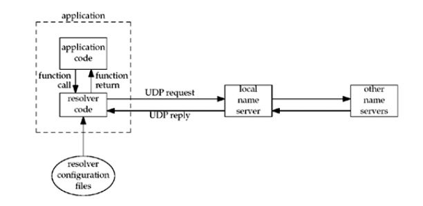

# 11.名字与地址转换

<!-- @import "[TOC]" {cmd="toc" depthFrom=1 depthTo=6 orderedList=false} -->
<!-- code_chunk_output -->

* [11.名字与地址转换](#11名字与地址转换)
	* [概述](#概述)
	* [域名系统](#域名系统)
		* [资源记录](#资源记录)
		* [解析器和名字服务器](#解析器和名字服务器)
		* [DNS 替代方法](#dns-替代方法)

<!-- /code_chunk_output -->

## 概述
在名字和数值地址间进行转换的函数：
* gethostbyname和gethostbyaddr在主机名字与IPV4地址之间进行转换
* getservbyname和getservbyport在服务器名字和端口号之间进行转换
* 两个协议无关的转换函数：getaddrinfo和getnameinfo，分别用于主机名字和IP地址之间以及服务器名字和端口号之间的转换

## 域名系统

域名系统（Domain Name System,DNS）主要用于主机名字与 IP 地址之间映射。
本节仅仅讨论网络编程所需的 DNS 基础知识。对于更多细节感兴趣的读者可参阅 <TCP V1> 的第14章。

### 资源记录
DNS 中的条目称为资源记录(resource record,RR)。 我们感兴趣的RR 类型只有若干个：

| 类型 | 说明     |
| :------------- | :------------- |
A | A记录把一个主机名映射为一个32位的IPV4地址
AAAA | 把一个主机名映射为一个128位的IPV6地址
PTR | 称为“指针记录”(pointer record)的PTR记录把IP地址映射成主机名
MX | 把一个主机指定作为给定主机的“邮件交换器”(mail exchanger)
CNAME | 代表规范名字(canonical name),它的常见用法是为常用的服务(www,ftp)指派CNAME记录。如果人们使用这些服务名而不是真实的主机名，那么相应的服务挪到另一个主机时它们也不必知道。

[How to use dig to query DNS name servers](https://www.madboa.com/geek/dig/)


```sh
dig +nocmd yahoo.com any +multiline +noall +answer
yahoo.com.		423 IN A 206.190.39.42
yahoo.com.		423 IN A 98.139.180.180
yahoo.com.		423 IN A 98.138.252.38
yahoo.com.		54250 IN NS ns4.yahoo.com.
yahoo.com.		54250 IN NS ns3.yahoo.com.
yahoo.com.		54250 IN NS ns5.yahoo.com.
yahoo.com.		54250 IN NS ns1.yahoo.com.
yahoo.com.		54250 IN NS ns2.yahoo.com.
```

### 解析器和名字服务器

每个组织机构往往运行一个或多个 名字服务器 (name server),它们通常就是所谓的 BIND （Berkeley Internet Name Domain的简称）程序。诸如我们在本书中编写的客户和服务器等应用程序通过调用解析器 (resolver) 的函数库中的函数接触DNS服务器。常见的解析器函数是 gethostbyname 和 gethostbyaddr,前者把主机名映射成 IPV4 地址，后者则执行相反的映射。

应用程序代码使用通常的函数调用来执行解析器中的代码，调用的典型函数是 gethostbyname 和 gethostbyaddr

客户、解析器和名字服务器的典型关系：


解析器代码通过读取其系统相关配置文件确定本组织机构的名字服务器们的所在位置。文件/etc/resolv.conf通常包含本地名字服务器主机的IP地址。

解析器使用UDP向本地名字服务器发出查询。如果本地名字服务器不知道答案，它通常就会使用 UDP 在整个因特网上查询其他名字服务器。如果答案太长，超出 UDP 消息的承载能力，本地名字服务器和解析器会自动切换到 TCP

### DNS 替代方法

不使用 DNS 也可能获取名字和地址信息。常用的替代方法有静态主机文件(通常是 /etc/hosts文件)、[网络信息系统](http://searchnetworking.techtarget.com/definition/NIS)(Network Information System,NIS)以及[轻目录访问协议 wikipedia](https://zh.wikipedia.org/wiki/%E8%BD%BB%E5%9E%8B%E7%9B%AE%E5%BD%95%E8%AE%BF%E9%97%AE%E5%8D%8F%E8%AE%AE)(Lightweight Directory Access Protocol,LDAP)。不幸的是，系统管理员如何使用不同类型的名字服务是实现相关的。Solaris 2.x、HP-UX 10 及后续版本、FreeBSD 5.x及后续版本使用文件 /etc/nsswitch.conf,AIX 使用文件 /etc/netsvc.conf 。BIND 9.2.2 提供了自己的名为信息检索服务 (Information Retrival Sevice,IRS)的版本，使用 /etc/irs.conf。 如果使用名字服务器查找主机名，那么所有的这些系统都使用文件 /etc/resolv.conf 指定名字服务器的IP地址。幸运的是，这些差异对于应用程序开发人员来说通常是透明的，我们只需要诸如 gethostbyname 和 gethostbyaddr 这样的解析器函数。

相关知识扩展：
[域名服务器缓存污染](https://zh.wikipedia.org/wiki/%E5%9F%9F%E5%90%8D%E6%9C%8D%E5%8A%A1%E5%99%A8%E7%BC%93%E5%AD%98%E6%B1%A1%E6%9F%93)

[上一级](base.md)
[上一篇](8_basic_udp_socket.md)
