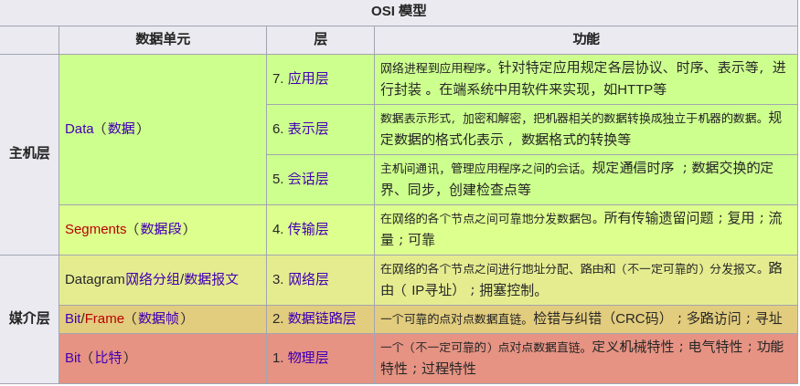

# 1.简介


<!-- @import "[TOC]" {cmd="toc" depthFrom=1 depthTo=6 orderedList=false} -->
<!-- code_chunk_output -->

* [1.简介](#1简介)
	* [OSI七层网络协议](#osi七层网络协议)
	* [一个简单的时间获取客户程序](#一个简单的时间获取客户程序)
	* [错误处理：包裹函数](#错误处理包裹函数)
	* [一个简单的时间获取服务器程序](#一个简单的时间获取服务器程序)

<!-- /code_chunk_output -->

## OSI七层网络协议

开放式系统互联通信参考模型（英语：Open System Interconnection Reference Model，缩写为 OSI），简称为OSI模型（OSI model），一种概念模型，由国际标准化组织（ISO）提出，一个试图使各种计算机在世界范围内互连为网络的标准框架。定义于ISO/IEC 7498-1。



* 第7层 应用层(Application Layer)

提供为应用软件而设的界面，以设置与另一应用软件之间的通信。例如: HTTP，HTTPS，FTP，TELNET，SSH，SMTP，POP3等。

* 第6层 表达层(Presentation Layer)

把数据转换为能与接收者的系统格式兼容并适合传输的格式。

* 第5层 会话层(Session Layer)

负责在数据传输中设置和维护电脑网络中两台电脑之间的通信连接。

* 第4层 传输层(Transport Layer)

把传输表头（TH）加至数据以形成数据包。传输表头包含了所使用的协议等发送信息。例如:传输控制协议义（TCP）等。
* 第3层 网络层(Network Layer)

决定数据的路径选择和转寄，将网络表头（NH）加至数据包，以形成分组。网络表头包含了网络数据。例如:互联网协议（IP）等。

* 第2层 数据链接层(Data Link Layer)

负责网络寻址、错误侦测和改错。当表头和表尾被加至数据包时，会形成了帧。数据链表头（DLH）是包含了物理地址和错误侦测及改错的方法。数据链表尾（DLT）是一串指示数据包末端的字符串。例如以太网、无线局域网（Wi-Fi）和通用分组无线服务（GPRS）等。
分为两种子层：logic link control sublayer & media access control sublayer

* 第1层 物理层(Physical Layer)

在局部局域网上传送帧，它负责管理电脑通信设备和网络媒体之间的互通。包括了针脚、电压、线缆规范、集线器、中继器、网卡、主机适配器等


## 一个简单的时间获取客户程序

```c
#include "unp.h"

int main(int argc, char **argv) {
  int sockfd, n;
  char recvline[MAXLINE + 1];
  struct sockaddr_in servaddr;

  if (argc != 2)
    err_quit("usage: a.out <IPaddress>");

// socket ()
// create an endpoint for communication
// #include <sys/socket.h>
// int socket(int domain, int type, int protocol);

  if ((sockfd = socket(AF_INET, SOCK_STREAM, 0)) < 0)
    err_sys("socket error");

  bzero(&servaddr, sizeof(servaddr));
  servaddr.sin_family = AF_INET;

  // uint16_t htons(uint16_t hostshort);
  // The htons() function converts the unsigned short integer hostshort from
  // host byte order to network byte order
  //     .

  servaddr.sin_port = htons(1300); /* daytime server * /

  // int inet_pton(int af, const char * src, void * dst);
  // inet_pton - convert IPv4 and IPv6 addresses from text to binary form

  if (inet_pton(AF_INET, argv[1], &servaddr.sin_addr) <= 0)
    err_quit("inet_pton error for %s", argv[1]);
    //or
    //servaddr.sin_addr.s_addr = inet_addr(argv[1]);

  // int connect(int socket, const struct sockaddr * address,
  //            socklen_t address_len);

  if (connect(sockfd, (SA *)&servaddr, sizeof(servaddr)) < 0)
    err_sys("connect error");

  while ((n = read(sockfd, recvline, MAXLINE)) > 0) {
    recvline[n] = 0; /* null terminate * /

    // fputs将一个以null字节终止的字符串写到指定的流，尾端的终止符null不写出
    // puts将一个以null字节终止的字符串写到标准输出，尾端的终止符null不写出

    if (fputs(recvline, stdout) == EOF)
      err_sys("fputs error");
  }
  if (n < 0)
    err_sys("read error");

  exit(0);
}

```

## 错误处理：包裹函数

我们约定包裹函数名是实际函数名的首字母大写形式。
sockfd=Socket(AF_INET,SOCK_STREAM,0);
中，函数Socket是函数socket的包裹函数：
```c
int Socket(int family,int type,int protocol)
{
  int n;
  if ((n=socket(family,type,protocol))<0)
  err_sys("socket error");
  return n;
}
```

## 一个简单的时间获取服务器程序

```c
#include "unp.h"
#include <time.h>

int main(int argc, char const * argv[]) {
  int listenfd, connfd;

  struct sockaddr_in servaddr;
  char buff[MAXLINE];
  time_t ticks;

  listenfd = Socket(AF_INET, SOCK_STREAM, 0);

  bzero(&servaddr, sizeof(servaddr));
  servaddr.sin_family = AF_INET;
  servaddr.sin_addr.s_addr = htonl(INADDR_ANY);//INADDR_ANY 0
	//内核选择IP地址和端口
  servaddr.sin_port = htons(1300);

  Bind(listenfd, (SA *)&servaddr, sizeof(servaddr));

  Listen(listenfd, LISTENQ);

  while (1) {
    connfd = Accept(listenfd, (SA *)NULL, NULL);

    ticks = time(NULL);
    snprintf(buff, sizeof(buff), "%.24s\r\n", ctime(&ticks));
    Write(connfd, buff, strlen(buff));
    Close(connfd);
  }
  return 0;
}
```
---
- [上一级](README.md)
- 下一篇 -> [2.传输层：TCP、UDP、SCTP](2_transport_layer.md)
