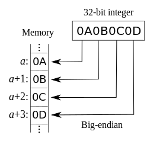
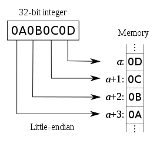

# 3.套接字编程简介


<!-- @import "[TOC]" {cmd="toc" depthFrom=1 depthTo=6 orderedList=false} -->
<!-- code_chunk_output -->

* [3.套接字编程简介](#3套接字编程简介)
	* [套接字地址结构](#套接字地址结构)
		* [IPv4套接字地址结构](#ipv4套接字地址结构)
		* [通用套接字地址结构](#通用套接字地址结构)
		* [IPv6套接字结构](#ipv6套接字结构)
	* [字节排序函数](#字节排序函数)
		* [大端模式](#大端模式)
		* [小端模式](#小端模式)
		* [确定主机字节序的程序](#确定主机字节序的程序)
	* [inet_pton 和 inet_ntop 函数](#inet_pton-和-inet_ntop-函数)

<!-- /code_chunk_output -->


## 套接字地址结构

### IPv4套接字地址结构

定义在<netinet/in.h>头文件中：

```c
struct inet_addr{
  in_addr_t s_addr;
};

struct sockaddr_in{
  uint8_t sin_len; //length os structure
  sa_family_t sin_family; // AF_INET
  in_port_t sin_port; // 16_bit TCP or UDP port number
  struct in_addr sin_addr;//32 bit IPv4 address
  char sin_zero[8];//unused
};
```

### 通用套接字地址结构
定义在<sys/socket.h>头文件中：
```c
struct sockaddr{
  uint8_t sa_len;
  sa_family_t sa_family;//address family:AF_XXX value
  char sa_data[14]; //protocol-specific address
};
```

### IPv6套接字结构

定义在<netinet/in.h>头文件中：

```c
struct in6_addr{
  uint8_t s6_addr[16];
};

#define SIN6_LEN
struct in6_addr{
  uint8_t sin6_len; //length os structure
  sa_family_t sin6_family; // AF_INET6
  in_port_t sin6_port; // 16_bit TCP or UDP port number
  uint32_t sin6_flowinfo;//flow information ,undifined
  struct in6_addr sin6_addr;//32 bit IPv6 address
  uint32_t sin6_scope_id; //set of interfaces for a scope
};
```

## 字节排序函数

* [字节序](https://zh.wikipedia.org/wiki/%E5%AD%97%E8%8A%82%E5%BA%8F)

### 大端模式



### 小端模式



### 确定主机字节序的程序

```c
#include "unp.h"

int main(int argc, char const *argv[]) {
  union {
    short s;
    char c[sizeof(short)];
  } un;

  un.s = 0x0102;
  printf("%s: ", CPU_VENDOR_OS);

  if (sizeof(short) == 2) {
    if (un.c[0] == 1 && un.c[1] == 2)
      printf("big_endian\n");
    else if (un.c[0] == 2 && un.c[1] == 1)
      printf("little_endian\n");
    else
      printf("unknow\n");
  } else
    printf("sizeof(short)=%d\n", sizeof(short));
  return 0;
}
```
linux is little_endian;

## inet_pton 和 inet_ntop 函数
这两个函数是随IPv6出现的新函数，对于IPv4 IPv6都适用。
p --> presentation (表达)
n --> numeric (数值)
```c
#include <arpa/inet.h>

int inet_pton(int family,const char *strptr,void *addrptr);
//success return 1,invaild presentation return 0,error return -1

const char *inet_ntop(int family,const void *addrptr,char * strptr,size_t len);
//success return result pointer,error return NULL
```

示例：
即使你的系统不支持IPv6,你也可以采取下列措施开始使用这些新函数，即用代码
```c
inet_pton(AF_INET,cp,&foo.sin_addr);
```
代替
```c
foo.sin_addr.s_addr=inet_addr(cp);
//如今inet_addr已被弃用，新的代码应该改用inet_aton函数。
```
用代码
```c
char str[INET_ADDRSTRLEN];
prt=inet_ntop(AF_INET,&foo.sin_addr,str,sizeof(str));
```
代替
```c
ptr=inet_ntoa(foo.sin_addr);
```


[上一级](base.md)
[上一篇](2_transport_layer.md)
[下一篇](4_basic_tcp_socket.md)
