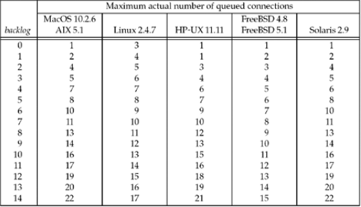

# 4.基本TCP套接字编程

<!-- @import "[TOC]" {cmd="toc" depthFrom=1 depthTo=6 orderedList=false} -->
<!-- code_chunk_output -->

* [4.基本TCP套接字编程](#4基本tcp套接字编程)
	* [socket函数](#socket函数)
		* [基本tcp客户/服务器程序的套接字示意图](#基本tcp客户服务器程序的套接字示意图)
		* [socket函数的family常值](#socket函数的family常值)
		* [socket函数的type常值](#socket函数的type常值)
		* [socket函数AF_INET或者AF_INET6的protocol常值](#socket函数af_inet或者af_inet6的protocol常值)
	* [connect function](#connect-function)
	* [bind function](#bind-function)
	* [listen函数](#listen函数)
		* [不同的backlog值时已排队连接的实际数目](#不同的backlog值时已排队连接的实际数目)
	* [accept function](#accept-function)
		* [显示客户IP地址和端口号的时间获取服务器程序](#显示客户ip地址和端口号的时间获取服务器程序)
	* [并发服务器](#并发服务器)
	* [close 函数](#close-函数)
	* [getsockname 和 getpeername](#getsockname-和-getpeername)
	* [习题](#习题)

<!-- /code_chunk_output -->

## socket函数

```c
#include <sys/socket.h>
int socket(int family,int type,int protocol);
//返回：若成功则为非负描述符，若出错则为-1
```
protocol参数应设为某个协议类型常值，或者设为0

### 基本tcp客户/服务器程序的套接字示意图


### socket函数的family常值
| family | info     |
| :------------- | :------------- |
| AF_INET       | ipv4协议      |
|AF_INET6| ipv6协议
|AF_LOCAL| unix域协议
|AF_ROUTE| 路由套接字
|AF_KEY| 密钥套接字
### socket函数的type常值
| type | info     |
| :------------- | :------------- |
| SOCK_STREAM      | 字节流套接字      |
|SOCK_DGRAM| 数据报套接字
|SOCK_SEQPACKET| 有序分组套接字
|SOCK_RAW| 原始套接字

### socket函数AF_INET或者AF_INET6的protocol常值
| protocol | info     |
| :------------- | :------------- |
| IPPROTO_TCP       | tcp传输协议       |
|IPPROTO_UDP| udp传输协议
|IPPROTO_SCTP| sctp传输协议

## connect function

```c
#include <sys/socket.h>
int connect(int sockfd,const struct sockaddr *serveraddr,socklen_t addrlen);

//success return 0,error -1
```

1. 若tcp客户没有收到SYN分节的响应，则返回ETIMEDOUT错误
2. 若对客户的SYN响应是RST，则表明该服务器主机在我们指定的端口上没有进程在等待与之连接（例如服务器进程也许没有在运行）。这是种硬错误，用户一收到RST就马上返回ECONNREFUSED错误。
3. 若客户发出的SYN在中间的某个路由器上引发了一个“destination unreachable”ICMP错误，则认为是一个软错误。

## bind function

bind函数把一个本地协议地址赋予一个套接字。
```c
#include <sys/socket.h>
int bind(int sockfd,const struct sockaddr *myaddr,socklen_t addrlen);
//success return 0,error -1
```
* 进程可以把一个特定的IP地址捆绑到它的套接字上，不过这个IP地址必须属于其所在的网络接口之一。对于TCP客户，这就为在该套接字上发送的IP数据报指派了源IP地址。对于TCP服务器，这个限定了该套接字只接受那些目的地为这个IP地址的客户连接。TCP客户通常不把IP地址捆绑到它的套接字上。

给bind函数指定要绑定的IP地址/端口号产生的结果

| 地址| 端口 | 结果     |
| :------------- | :------------- |:------------- |
|通配地址| 0 | 内核选择ip地址和端口|
|通配地址|非0 | 内核选择ip地址，进程指定端口|
|本地IP地址| 0 | 进程指定IP地址，内核选择端口
|本地IP地址| 非0 | 进程指定IP地址和端口

INADDR_ANY 值为0

## listen函数
listen函数仅由TCP服务器调用，listen函数将一个主动套接字转化为监听套接字
[监听套接字与已连接套接字](http://blog.csdn.net/lihao21/article/details/64951446)

```c
#include <sys/socket.h>
int listen(int sockfd,int backlog);
//返回：若成功则为0，若出错则为-1；
```

为了理解backlog参数：
1. 未完成连接队列：每个这样的SYN分节对应其中一项：已由某个客户发出到达服务器，而服务器正在等待完成相应的TCP三路握手过程。这些套接字处于SYN_RCVD状态。
2. 已完成连接队列：每个已完成的TCP三路握手过程的客户对应其中的一项。这些套接字处于ESTABLISHED状态

* listen函数的backlog参数“曾被规定”为这两个队列总数的最大值。

* 不要报backlog定义为0，因为不同的实现对此有不同的解释

### 不同的backlog值时已排队连接的实际数目


## accept function

accept 函数由服务器调用，用于从已完成连接队列队头返回下一个已完成连接。如果已完成连接队列为空，那么进程被投入睡眠（假定套接字为默认的阻塞方式）

```c
#include <sys/socket.h>

int accept(int sockfd,struct sockaddr*cliaddr,socklen_t *addlen);
//返回：若成功则为非负描述符，若出错则为-1
```

调用前，我们将由*addrlen所引用的整数值置为由cliaddr所指的套接字地址结构的长度，返回时，该整数值极为由内核存放在该套接字结构地址内的确切字节数。

参数cliaddr和addrlen用来返回已连接的对端进程的协议地址

在讨论accept函数时，我们称他的第一个参数为监听套接字描述符，称它的返回值为已连接套接字描述符。一个服务器通常仅仅创建一个监听套接字，他在该服务器生命周期内一直存在。内核为每个由服务器进程接收的客户连接创建一个已连接套接字。当服务器完成对某个给定客户的服务时，相应的已连接套接字就被关闭。

### 显示客户IP地址和端口号的时间获取服务器程序
```c
#include "unp.h"
#include <stdio.h>
#include <time.h>

int main(int argc, char const *argv[]) {
  int listenfd, connfd;

  socklen_t len;
  struct sockaddr_in serveraddr, cliaddr;

  char buff[MAXLINE];
  time_t ticks;

  listenfd = Socket(AF_INET, SOCK_STREAM, 0);

  bzero(&serveraddr, sizeof(serveraddr));
  serveraddr.sin_family = AF_INET;
  serveraddr.sin_addr.s_addr = INADDR_ANY;
  //INADDR_ANY 为0 ，可以不使用htons（）
  serveraddr.sin_port = htons(1300);

  Bind(listenfd, (SA *)&serveraddr, sizeof(serveraddr));

  Listen(listenfd, LISTENQ);

  while (1) {
    len = sizeof(cliaddr);
    connfd = Accept(listenfd, (SA *)&cliaddr, &len);
    printf("connection from %s ,port %d\n",
           inet_ntop(AF_INET, &cliaddr.sin_addr, buff, sizeof(buff)),
           ntohs(cliaddr.sin_port));

    ticks = time(NULL);

    snprintf(buff, sizeof(buff), "%.24s\r\n", ctime(&ticks));
    Write(connfd, buff, strlen(buff));

    Close(connfd);
  }

  return 0;
}

```


## 并发服务器
当fork一个子程序来响应客户的请求时：
```c
pid_t pid;
int listenfd,connfd;

listenfd=Socket(...);

Bind(listenfd,...);

Listen(listenfd,LISTENQ);
while (1) {
  connfd=Accept(listenfd,...);
  if ((pid=Fork())==0)
  {
    //care
    Close(listenfd);
    doit(connfd);
    //care
    Close(connfd);
    exit(0);
  }
  //care
  Close(connfd);
}
```

涉及到共享文件的概念

## close 函数

通常的close函数也用来关闭套接字，并终止TCP连接。

```c
#include <unistd.h>

int close(int sockfd);
//success 0,error -1
```

close函数只是让文件表里面的引用计数值减一，当引用计数为0时，引发tcp四分组连接终止序列。

如果我们确实想在某个TCP连接上发送一个FIN，那么可以改用shutdown函数代替close。

## getsockname 和 getpeername

```c
#include <sys/socket.h>

int getsockname(int sockfd,struct sockaddr *localaddr,socklen_t *addrlen);

int getpeername(int sockfd,struct sockaddr * peeraddr,socklen_t *addrlen);
//success return 0,error -1
```

需要这两个函数的理由：
* 在没有调用bind的TCP客户上，conect成功返回后，getsockname用于返回由内核赋予该连接的本地IP地址和本地端口号

* 在以端口号0调用bind后，getsockname用于返回由内核赋予的本地端口号

* getsockname可用于获取某个套接字的地址族

* 在一个已通配IP地址调用bind的TCP服务器上，与某个客户的连接一旦建立，getsockname就可以用于返回由内核赋予该连接的本地IP地址

* 当一个服务器是由调用过accept的某个进程通过调用exec执行程序时，它能够获取客户身份的唯一途径便是调用getpeername

返回某个套接字的地址族:
```c
#include "unp.h"

int sockfd_tofamily(int sockfd)
{
  struct sockaddr_sorage ss;
  //不知道要分配的套接字结构的类型，于是采用sockaddr_sorage这个能够承载系统支持的任何套接字地址结构。

  socklen_t len;

  len=sizeof(ss);

  if (getsockname(sockfd,(SA *)&ss,&len)<0)
  return (-1);

  return (ss.ss_family);
}
```

## 习题

在服务器程序中，去掉listen调用会发生什么？
accept返回EINVAL，因为他的第一个参数不是一个监听套接字描述符

在服务器程序中，删除bind调用，但是保留listen调用，又将发生什么？
不调用bind的话，listen调用赋予监听套接字一个临时的端口。


[上一级](base.md)
[上一篇](3_socket_program_into.md)
[下一篇](5_tcp_cli_srv_example.md)
